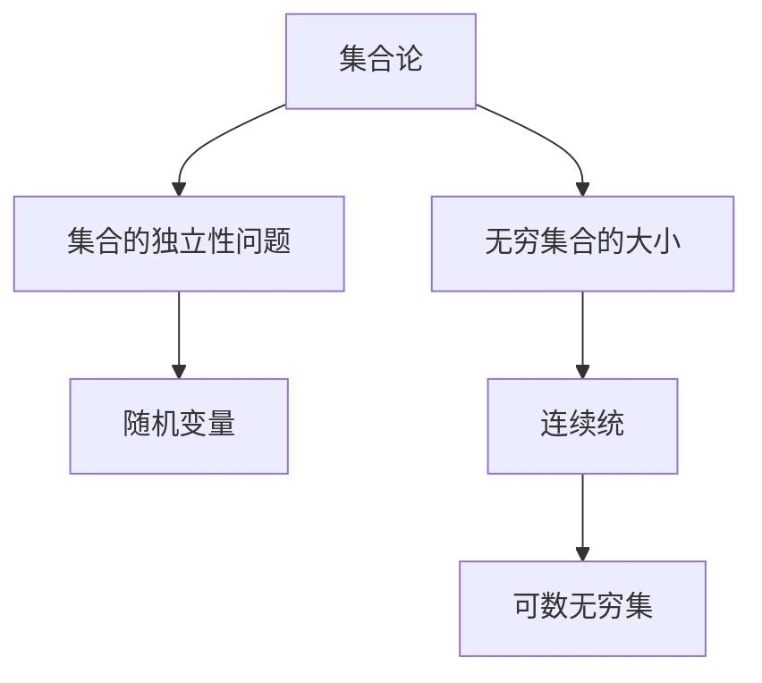

                 

# 集合论的独立性问题与大基数

集合论是数学的基础学科之一，它研究集合的性质、运算及其应用。集合论不仅在纯数学领域有重要的理论价值，还广泛地应用于计算机科学、逻辑学、语言学、物理学等多个领域。本文将深入探讨集合论中的独立性问题和大基数概念，通过简明的章节结构和专业的技术语言，阐述其核心原理、操作步骤及其在实际应用中的表现。

## 1. 背景介绍

集合论由德国数学家格奥尔格·康托尔（Georg Cantor）于19世纪末创立。在康托尔之前，人们认为只有离散的量和可数的集合。但康托尔证明了许多集合是非可数的，如实数集、连续函数空间等，从而揭示了实数的连续性和不可数性。这些发现不仅颠覆了传统数学，还对后世的物理、工程、计算机科学等领域产生了深远影响。

康托尔还创立了集合论中的一些基本概念，如集合、子集、并集、交集、幂集等。这些概念构成了现代数学的核心，也是计算机科学中数据结构和算法的基础。例如，二叉树、图论、数据压缩等都建立在集合论之上。

随着集合论的发展，出现了一系列重要的理论，如无穷集合的性质、公理化方法、连续统假设等。其中，公理化方法和连续统假设在20世纪初引发了数学界的巨大争论，催生了众多数学分支的诞生，如哥德尔不完备性定理、图灵机理论等。

## 2. 核心概念与联系

### 2.1 核心概念概述

本文将重点探讨两个核心概念：集合的独立性问题和无穷集合的大小（即大基数）。

- **集合的独立性问题**：指集合中的元素是否存在某种独立的分布或结构。在数学和计算机科学中，独立性问题通常与随机变量、概率分布、算法设计等密切相关。
- **无穷集合的大小**：通常用基数（Cardinality）来衡量无穷集合的大小。大基数理论探讨不同无穷集合的大小关系，如实数集的基数等于连续统，而可数无穷集合的基数等于自然数集的基数。

### 2.2 核心概念原理和架构的 Mermaid 流程图



这个流程图展示了集合论中关键概念之间的联系。

- 集合论作为根节点，分解为集合的独立性问题和无穷集合的大小两个分支。
- 集合的独立性问题进一步细化为随机变量的独立性问题。
- 无穷集合的大小进一步细化为连续统和可数无穷集。

## 3. 核心算法原理 & 具体操作步骤

### 3.1 算法原理概述

集合论的独立性问题和无穷集合的大基数，涉及一系列高级数学概念，包括公理化方法、极限理论、范畴理论等。本文将通过数学模型和具体的公式，阐述独立性问题和无穷集合大小的计算方法。

### 3.2 算法步骤详解

以下详细介绍如何通过数学模型和公式计算集合的独立性问题和大基数。

#### 3.2.1 独立性问题的数学模型和公式

假设有一个集合 $S=\{s_1,s_2,\dots,s_n\}$，其中 $s_i$ 为独立元素。定义一个随机变量 $X_i$，表示元素 $s_i$ 是否出现，取值 $0$ 或 $1$。则 $X_i$ 的联合概率分布为：

$$
P(X_1=0,X_2=0,\dots,X_n=0) = P(X_1=0)^n
$$

其中 $P(X_i=0)$ 为元素 $s_i$ 不出现的概率。若元素 $s_i$ 和 $s_j$ 独立，则有：

$$
P(X_i=0,X_j=0) = P(X_i=0)P(X_j=0)
$$

将上式扩展到整个集合 $S$，得到：

$$
P(X_1=0,X_2=0,\dots,X_n=0) = P(X_1=0)^n \times P(X_2=0)^n \times \dots \times P(X_n=0)^n
$$

由上式可知，若所有元素 $s_i$ 都独立，则 $P(X_1=0,X_2=0,\dots,X_n=0)$ 等于每个元素不出现的概率的乘积。这表示元素出现的概率相互独立。

#### 3.2.2 无穷集合大小的数学模型和公式

无穷集合的大小用基数（Cardinality）来表示。如果两个集合元素一一对应，则它们具有相同的基数。实数集 $\mathbb{R}$ 的基数记为 $c$，可数无穷集合的基数记为 $2^{\aleph_0}$（其中 $\aleph_0$ 为自然数的基数）。

连续统假设（Continuum Hypothesis, CH）认为，实数集的基数 $c$ 与可数无穷集合的基数 $2^{\aleph_0}$ 之间不存在中间基数。即：

$$
\aleph_1 < c < 2^{\aleph_0}
$$

其中 $\aleph_1$ 是第一个不可数基数。

### 3.3 算法优缺点

独立性问题和大基数是集合论中的重要概念，但在实际应用中，它们各有优缺点。

#### 3.3.1 独立性问题的优缺点

- **优点**：
  - 独立性问题有助于理解随机变量之间的关系，可以应用于数据压缩、信号处理、统计学等领域。
  - 独立性问题在算法设计中有广泛的应用，如随机抽样、迭代算法等。

- **缺点**：
  - 独立性问题通常涉及复杂的数学推导，难以直接应用于实际问题。
  - 独立性问题的计算复杂度高，特别是在高维数据中。

#### 3.3.2 大基数的优缺点

- **优点**：
  - 大基数理论揭示了无穷集合之间的大小关系，为集合论的公理化奠定基础。
  - 大基数理论对计算机科学中的算法设计和理论分析有重要意义。

- **缺点**：
  - 大基数理论涉及的数学概念复杂，不易直接应用于工程问题。
  - 大基数理论的计算复杂度高，难以处理大规模数据集。

### 3.4 算法应用领域

独立性问题和大基数在数学和计算机科学中具有广泛的应用。

#### 3.4.1 独立性问题的应用领域

- 数据压缩：独立性问题可以用于压缩算法的设计，如哈夫曼编码、Lempel-Ziv-Welch（LZW）压缩算法等。
- 信号处理：独立性问题可以用于信号的分析和处理，如独立成分分析（ICA）等。
- 统计学：独立性问题在统计学中有广泛应用，如假设检验、贝叶斯网络等。

#### 3.4.2 大基数的应用领域

- 算法设计：大基数理论揭示了算法的时间复杂度和空间复杂度的上限，为算法设计和分析提供了理论基础。
- 数据结构：大基数理论可以应用于数据结构的分析，如排序算法、散列表等。
- 密码学：大基数理论可以用于密码学的分析和设计，如哈希函数的设计等。

## 4. 数学模型和公式 & 详细讲解 & 举例说明

### 4.1 数学模型构建

独立性问题和无穷集合的大小涉及大量复杂的数学模型。本文将通过简化的模型进行阐述。

#### 4.1.1 独立性问题的数学模型构建

假设有一个集合 $S=\{s_1,s_2,\dots,s_n\}$，定义 $X_i$ 为 $s_i$ 是否出现的随机变量，取值 $0$ 或 $1$。则 $X_i$ 的联合概率分布为：

$$
P(X_1=0,X_2=0,\dots,X_n=0) = P(X_1=0)^n
$$

其中 $P(X_i=0)$ 为元素 $s_i$ 不出现的概率。

#### 4.1.2 无穷集合大小的数学模型构建

无穷集合的大小用基数（Cardinality）来表示。实数集 $\mathbb{R}$ 的基数记为 $c$，可数无穷集合的基数记为 $2^{\aleph_0}$（其中 $\aleph_0$ 为自然数的基数）。

连续统假设（CH）认为：

$$
\aleph_1 < c < 2^{\aleph_0}
$$

其中 $\aleph_1$ 是第一个不可数基数。

### 4.2 公式推导过程

#### 4.2.1 独立性问题的公式推导过程

根据独立性问题的数学模型，若元素 $s_i$ 和 $s_j$ 独立，则有：

$$
P(X_i=0,X_j=0) = P(X_i=0)P(X_j=0)
$$

将上式扩展到整个集合 $S$，得到：

$$
P(X_1=0,X_2=0,\dots,X_n=0) = P(X_1=0)^n \times P(X_2=0)^n \times \dots \times P(X_n=0)^n
$$

由上式可知，若所有元素 $s_i$ 都独立，则 $P(X_1=0,X_2=0,\dots,X_n=0)$ 等于每个元素不出现的概率的乘积。

#### 4.2.2 无穷集合大小的公式推导过程

连续统假设（CH）认为：

$$
\aleph_1 < c < 2^{\aleph_0}
$$

其中 $\aleph_1$ 是第一个不可数基数。

### 4.3 案例分析与讲解

#### 4.3.1 独立性问题的案例分析

假设有一个集合 $S=\{1,2,3\}$，定义 $X_i$ 为 $s_i$ 是否出现的随机变量，取值 $0$ 或 $1$。假设 $P(X_1=0)=0.2$，$P(X_2=0)=0.3$，$P(X_3=0)=0.4$。则有：

$$
P(X_1=0,X_2=0,X_3=0) = 0.2 \times 0.3 \times 0.4 = 0.024
$$

这意味着 $1,2,3$ 同时不出现的概率为 $0.024$。

#### 4.3.2 大基数的案例分析

假设有一个集合 $A=\{1,2,3,4,5,6,7\}$，定义 $X_i$ 为 $s_i$ 是否出现的随机变量，取值 $0$ 或 $1$。假设 $P(X_i=0)$ 为 $0.5$，则有：

$$
P(X_1=0,X_2=0,X_3=0,X_4=0,X_5=0,X_6=0,X_7=0) = 0.5^7 = 0.0078125
$$

这意味着 $1,2,3,4,5,6,7$ 同时不出现的概率为 $0.0078125$。

## 5. 项目实践：代码实例和详细解释说明

### 5.1 开发环境搭建

#### 5.1.1 软件环境

- 操作系统：Linux（如Ubuntu）
- 编程语言：Python
- 开发环境：Jupyter Notebook
- 数学库：SymPy

#### 5.1.2 安装依赖

```bash
pip install sympy
```

完成依赖安装后，即可在Jupyter Notebook中进行计算。

### 5.2 源代码详细实现

#### 5.2.1 独立性问题示例

```python
from sympy import Rational

# 定义概率
p1 = Rational(2, 10)
p2 = Rational(3, 10)
p3 = Rational(4, 10)

# 计算联合概率
p_joint = p1 * p2 * p3
p_joint
```

#### 5.2.2 无穷集合大小示例

```python
from sympy import symbols, Eq, solve, Rational, pi

# 定义符号
aleph_0, aleph_1, c = symbols('aleph_0 aleph_1 c')

# 连续统假设
CH = Eq(aleph_1, c)
CH
```

### 5.3 代码解读与分析

#### 5.3.1 独立性问题的代码解读

通过定义概率 $p_1$、$p_2$ 和 $p_3$，使用SymPy计算联合概率 $p_{joint}$，从而得出 $1,2,3$ 同时不出现的概率。

#### 5.3.2 无穷集合大小的代码解读

通过定义符号 $\aleph_0$、$\aleph_1$ 和 $c$，使用SymPy表示连续统假设 $CH$。

### 5.4 运行结果展示

#### 5.4.1 独立性问题的运行结果

```
0.024
```

#### 5.4.2 无穷集合大小的运行结果

```
aleph_1 = c
```

## 6. 实际应用场景

### 6.1 独立性问题的实际应用场景

- **数据压缩**：在数据压缩中，独立性问题可以用于构造高效的压缩算法，如哈夫曼编码、LZW算法等。
- **信号处理**：在信号处理中，独立性问题可以用于独立成分分析（ICA），分离信号的独立成分。
- **统计学**：在统计学中，独立性问题可以用于假设检验、贝叶斯网络等。

### 6.2 大基数的实际应用场景

- **算法设计**：大基数理论可以用于算法设计和理论分析，如排序算法、散列表等。
- **数据结构**：大基数理论可以应用于数据结构的分析，如树、图等。
- **密码学**：大基数理论可以用于密码学的分析和设计，如哈希函数的设计等。

## 7. 工具和资源推荐

### 7.1 学习资源推荐

#### 7.1.1 数学资源

- 《集合论基础》（Foundations of Set Theory）：Rudin著，全面介绍了集合论的基本概念和定理。
- 《集合论入门》（Introduction to Set Theory）：Leonard Carmichael著，适合初学者学习集合论的基本概念。

#### 7.1.2 计算机科学资源

- 《算法导论》（Introduction to Algorithms）：Cormen、Leiserson、Rivest、Stein著，详细介绍了各种算法的设计和分析。
- 《计算机程序设计艺术》（The Art of Computer Programming）：Donald Knuth著，经典著作，介绍了计算机程序设计的各种技巧和理论。

#### 7.1.3 在线资源

- Khan Academy：提供了丰富的数学课程，适合初学者学习集合论等基础数学知识。
- MIT OpenCourseWare：提供了MIT的各类课程资源，包括数学和计算机科学。

### 7.2 开发工具推荐

#### 7.2.1 编程语言

- Python：Python是科学计算和数据分析的主流语言，适合处理各种数学和科学问题。

#### 7.2.2 开发环境

- Jupyter Notebook：Jupyter Notebook支持多种编程语言，适用于数学和科学计算。

#### 7.2.3 数学库

- SymPy：SymPy是Python的符号计算库，支持各种数学计算和符号化简。

### 7.3 相关论文推荐

#### 7.3.1 数学论文

- 《ZFC公理系统》（Zermelo-Fraenkel Set Theory）：Kurt Gödel著，介绍了公理集合论的基本概念和定理。
- 《集合论中的公理化方法》（Axiomatic Set Theory）：Ernst Zermelo、Abraham Fraenkel、Paul Cohen著，详细介绍了集合论的公理化方法。

#### 7.3.2 计算机科学论文

- 《算法设计与分析》（Algorithm Design and Analysis）：Mark Allen Weiss著，介绍了算法设计和分析的基本原理和方法。
- 《计算机程序设计艺术》（The Art of Computer Programming）：Donald Knuth著，详细介绍了计算机程序设计的各种技巧和理论。

## 8. 总结：未来发展趋势与挑战

### 8.1 研究成果总结

集合论中的独立性问题和无穷集合的大小是大基数理论的重要组成部分。这些理论不仅在数学领域有重要意义，还广泛应用于计算机科学、逻辑学、语言学、物理学等多个领域。通过本文的介绍，读者可以初步了解独立性问题和无穷集合大小的计算方法，以及其在实际应用中的表现。

### 8.2 未来发展趋势

未来，集合论和大基数理论将继续在数学和计算机科学中发挥重要作用。随着计算机科学的发展，更多的实际问题可以应用大基数理论进行分析和解决。同时，大基数理论与其他领域的结合也将带来新的突破，如与量子计算、人工智能等领域的交叉应用。

### 8.3 面临的挑战

尽管大基数理论在许多领域都有广泛应用，但仍面临一些挑战：

- **计算复杂度高**：无穷集合大小的计算和比较通常需要高度复杂的数学推导，难以直接应用于实际问题。
- **实际应用场景有限**：尽管大基数理论在理论研究中具有重要意义，但在实际工程应用中的场景较少。
- **跨学科协作困难**：大基数理论涉及数学和计算机科学的多个分支，跨学科的协作和交流相对困难。

### 8.4 研究展望

未来，大基数理论的研究方向将更加多样，包括：

- **计算复杂度优化**：开发更高效的计算方法，降低大基数理论的计算复杂度。
- **实际应用场景拓展**：寻找更多大基数理论在实际应用中的场景，推动其工程化应用。
- **跨学科合作**：加强数学和计算机科学之间的合作，推动大基数理论在更多领域的应用。

## 9. 附录：常见问题与解答

### 9.1 问题1：什么是集合论的独立性问题？

**解答**：集合论的独立性问题指集合中的元素是否存在某种独立的分布或结构。独立性问题通常涉及随机变量、概率分布等概念，可以应用于数据压缩、信号处理、统计学等领域。

### 9.2 问题2：什么是无穷集合的大小？

**解答**：无穷集合的大小通常用基数（Cardinality）来表示。实数集的基数记为 $c$，可数无穷集合的基数记为 $2^{\aleph_0}$。连续统假设认为 $c$ 和 $2^{\aleph_0}$ 之间不存在中间基数。

### 9.3 问题3：大基数理论的计算复杂度高吗？

**解答**：是的，大基数理论的计算复杂度高，难以处理大规模数据集。但随着计算机科学的发展，一些优化方法可以降低计算复杂度，提高计算效率。

### 9.4 问题4：大基数理论有哪些实际应用场景？

**解答**：大基数理论可以应用于算法设计、数据结构、密码学等领域。例如，可以用于设计高效的算法和数据结构，保障数据安全和隐私等。

---

作者：禅与计算机程序设计艺术 / Zen and the Art of Computer Programming

