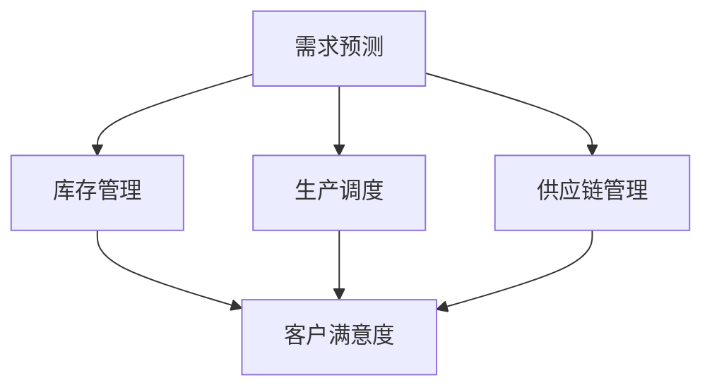

                 

# 需求驱动的商品供给策略

## 1. 背景介绍

在快速变化的商业环境中，需求和供给之间的不平衡是一个持续存在的问题。传统上，企业通常采用“供给推动”的策略，即首先生产商品，然后推广销售。而现代的市场趋势要求企业必须根据市场需求来调整其生产和供应策略，即“需求驱动”的商品供给策略。需求驱动策略基于以下三个核心要素：

1. **客户需求分析**：通过市场调研、大数据分析等手段，了解客户需求和偏好。
2. **生产与库存管理**：利用先进的技术和管理方法，优化生产过程和库存控制，以满足客户需求。
3. **渠道与营销策略**：设计高效的渠道和营销方案，以快速响应客户需求，提升客户满意度和忠诚度。

需求驱动的商品供给策略不仅能提升企业的市场竞争力，还能实现更高的运营效率和盈利能力。

## 2. 核心概念与联系

### 2.1 核心概念概述

在介绍核心算法原理前，我们先明确几个关键概念：

- **需求预测**：预测未来特定时间段内客户对商品的需求量。
- **库存管理**：根据需求预测，优化商品库存水平，避免过剩或缺货。
- **生产调度**：根据需求预测，合理安排生产计划，确保在需要时能够快速响应市场需求。
- **供应链管理**：协调供应链中的各个环节，确保商品从供应商到消费者的全流程顺畅。
- **客户满意度**：通过高效的生产与物流，提高客户满意度和忠诚度。

这些概念通过需求预测和库存管理、生产调度、供应链管理等环节形成了一个紧密联系的整体系统。

### 2.2 核心概念原理和架构的 Mermaid 流程图



## 3. 核心算法原理 & 具体操作步骤

### 3.1 算法原理概述

需求驱动的商品供给策略主要通过以下步骤实现：

1. **需求预测**：使用机器学习模型预测未来需求。
2. **库存管理**：根据预测结果，优化库存水平，避免过剩或缺货。
3. **生产调度**：根据需求预测，合理安排生产计划。
4. **供应链管理**：协调供应链各环节，确保商品及时到达。
5. **客户满意度**：通过优化生产和物流，提升客户满意度和忠诚度。

### 3.2 算法步骤详解

#### 3.2.1 需求预测

需求预测的常用方法包括时间序列分析、回归模型、神经网络等。以时间序列分析为例，我们使用ARIMA模型进行需求预测。

1. 收集历史销售数据，包括时间戳和销量。
2. 对数据进行平稳性检验，使用差分方法使其平稳。
3. 使用自回归和移动平均模型构建ARIMA模型。
4. 对模型进行参数估计和模型诊断，确保模型有效。
5. 使用模型进行未来需求的预测。

#### 3.2.2 库存管理

库存管理的目标是实现库存成本最小化，同时保证商品的可得性。我们采用经济订货批量（EOQ）模型进行库存管理。

1. 确定商品的平均每日需求量。
2. 确定每个订单的固定成本和单位商品的持有成本。
3. 计算经济订货批量。
4. 根据经济订货批量和平均每日需求量，计算最佳订货周期。

#### 3.2.3 生产调度

生产调度的目的是在满足需求的同时，最小化生产成本。我们采用线性规划模型进行生产调度。

1. 确定生产商品所需的原材料和人工成本。
2. 确定每种商品的日需求量。
3. 建立线性规划模型，以最小化总生产成本为目标函数。
4. 根据模型解，优化生产计划。

#### 3.2.4 供应链管理

供应链管理的目标是确保商品从供应商到消费者的全流程顺畅。我们采用供应链响应模型进行供应链管理。

1. 确定每个环节的运输时间和成本。
2. 确定每个环节的库存水平和需求。
3. 建立供应链响应模型，以最小化总运输成本为目标函数。
4. 根据模型解，优化供应链流程。

#### 3.2.5 客户满意度

客户满意度的提升是通过高效的生产与物流实现的。我们采用服务水平目标（SLP）模型进行客户满意度优化。

1. 确定客户的最大可接受延迟时间。
2. 确定每个订单的运输时间和成本。
3. 建立SLP模型，以最大化客户满意度为目标函数。
4. 根据模型解，优化生产和物流。

### 3.3 算法优缺点

#### 3.3.1 算法优点

1. **效率高**：通过机器学习和优化模型，可以快速准确地预测需求，优化库存和生产计划。
2. **成本低**：合理的库存和生产调度，可以降低企业的运营成本。
3. **响应快**：基于需求预测的生产和物流优化，可以快速响应市场需求。

#### 3.3.2 算法缺点

1. **数据依赖**：需求预测和库存管理的准确性高度依赖于数据的完整性和质量。
2. **复杂度高**：生产调度和供应链管理的模型复杂，需要较强的数学和编程能力。
3. **环境变化**：市场需求和供应链环节的变化，需要模型不断更新和优化。

### 3.4 算法应用领域

需求驱动的商品供给策略在多个领域都有广泛应用：

1. **零售业**：通过需求预测和库存管理，实现商品的快速补货和销售。
2. **制造业**：通过生产调度和供应链管理，优化生产流程，降低成本。
3. **物流业**：通过高效的生产与物流，提升客户满意度。
4. **农业**：通过需求预测和库存管理，优化农产品的生产和分配。

## 4. 数学模型和公式 & 详细讲解 & 举例说明

### 4.1 数学模型构建

#### 4.1.1 需求预测

我们使用ARIMA模型进行需求预测。假设历史销售数据为 $y_t = \{y_1, y_2, ..., y_n\}$，其中 $y_t$ 为第 $t$ 天的销售量，$D$ 为差分操作，则ARIMA模型的数学表达式为：

$$
(1-D)^p y_t = \alpha + \beta_1 y_{t-1} + ... + \beta_k y_{t-k} + \epsilon_t
$$

其中 $\alpha$ 为常数项，$\beta_i$ 为自回归系数，$\epsilon_t$ 为误差项。

#### 4.1.2 库存管理

我们使用经济订货批量（EOQ）模型进行库存管理。假设每日需求量为 $D$，每个订单的固定成本为 $C_f$，单位商品的持有成本为 $C_h$，则EOQ模型的数学表达式为：

$$
Q^* = \sqrt{2DC_f / C_h}
$$

#### 4.1.3 生产调度

我们使用线性规划模型进行生产调度。假设需要生产的商品有 $m$ 种，每种商品的生产成本为 $c_i$，日需求量为 $d_i$，则线性规划模型的优化目标为：

$$
\min \sum_{i=1}^m c_i x_i
$$

约束条件为：

$$
\begin{aligned}
\sum_{i=1}^m x_i &= d_t \\
x_i &\geq 0, \quad i=1,...,m
\end{aligned}
$$

#### 4.1.4 供应链管理

我们使用供应链响应模型进行供应链管理。假设每个环节的运输时间和成本为 $T_i$，库存水平为 $I_i$，需求为 $d_i$，则供应链响应模型的优化目标为：

$$
\min \sum_{i=1}^n T_i d_i
$$

约束条件为：

$$
\begin{aligned}
I_i &= I_{i-1} - d_i + \sum_{j=1}^m T_j x_j \\
I_i &\geq 0, \quad i=1,...,n
\end{aligned}
$$

#### 4.1.5 客户满意度

我们使用服务水平目标（SLP）模型进行客户满意度优化。假设客户的最大可接受延迟时间为 $T$，每个订单的运输时间为 $t_i$，则SLP模型的优化目标为：

$$
\max \sum_{i=1}^n (1 - T / t_i) x_i
$$

约束条件为：

$$
\begin{aligned}
\sum_{i=1}^n x_i &= d_t \\
x_i &\geq 0, \quad i=1,...,n
\end{aligned}
$$

### 4.2 公式推导过程

#### 4.2.1 需求预测

ARIMA模型的推导过程如下：

1. 对数据进行差分，得到平稳的时间序列 $\tilde{y}_t = D y_t$。
2. 使用自回归模型，假设 $\tilde{y}_t = \alpha + \beta \tilde{y}_{t-1} + \epsilon_t$。
3. 使用移动平均模型，假设 $\tilde{y}_t = \alpha + \epsilon_t$。
4. 组合自回归和移动平均模型，得到ARIMA模型：

$$
(1-D)^p \tilde{y}_t = \alpha + \beta_1 \tilde{y}_{t-1} + ... + \beta_k \tilde{y}_{t-k} + \epsilon_t
$$

其中 $p$ 为自回归阶数，$k$ 为移动平均阶数。

#### 4.2.2 库存管理

EOQ模型的推导过程如下：

1. 根据需求预测，计算每个订单的平均需求量 $D$。
2. 根据订单成本和库存成本，建立EOQ模型：

$$
Q^* = \sqrt{2DC_f / C_h}
$$

其中 $Q^*$ 为经济订货批量。

#### 4.2.3 生产调度

线性规划模型的推导过程如下：

1. 根据生产成本和日需求量，建立生产调度的线性规划模型：

$$
\min \sum_{i=1}^m c_i x_i
$$

2. 根据生产约束和总需求，建立约束条件：

$$
\begin{aligned}
\sum_{i=1}^m x_i &= d_t \\
x_i &\geq 0, \quad i=1,...,m
\end{aligned}
$$

#### 4.2.4 供应链管理

供应链响应模型的推导过程如下：

1. 根据运输时间和成本，建立供应链响应模型：

$$
\min \sum_{i=1}^n T_i d_i
$$

2. 根据库存水平和需求，建立约束条件：

$$
\begin{aligned}
I_i &= I_{i-1} - d_i + \sum_{j=1}^m T_j x_j \\
I_i &\geq 0, \quad i=1,...,n
\end{aligned}
$$

#### 4.2.5 客户满意度

SLP模型的推导过程如下：

1. 根据客户最大可接受延迟时间和运输时间，建立SLP模型：

$$
\max \sum_{i=1}^n (1 - T / t_i) x_i
$$

2. 根据总需求和运输时间，建立约束条件：

$$
\begin{aligned}
\sum_{i=1}^n x_i &= d_t \\
x_i &\geq 0, \quad i=1,...,n
\end{aligned}
$$

### 4.3 案例分析与讲解

假设一家在线零售商每月销售额为1000万，每日平均销售额为33333元，订单处理成本为10元，库存持有成本为每件1元。根据历史数据，该在线零售商决定每月购买商品3次，每次购买量为3000件。

1. **需求预测**：使用ARIMA模型进行预测，得到每日平均需求量为33333元。
2. **库存管理**：根据EOQ模型，计算经济订货批量为3000件。
3. **生产调度**：根据线性规划模型，确定每种商品的日生产量为33333元/次，共3次/月。
4. **供应链管理**：根据供应链响应模型，确定每个环节的运输时间和成本，优化供应链流程。
5. **客户满意度**：根据SLP模型，优化生产和物流，提升客户满意度。

## 5. 项目实践：代码实例和详细解释说明

### 5.1 开发环境搭建

在进行商品供给策略的开发和实现前，我们需要准备好开发环境。以下是使用Python进行需求驱动的商品供给策略的开发环境配置流程：

1. 安装Python：从官网下载并安装Python 3.x版本，确保版本稳定。
2. 安装相关库：使用pip安装numpy、pandas、scipy、scikit-learn、matplotlib等库，用于数据处理、机器学习、可视化和统计分析。
3. 安装优化库：使用pip安装cvxopt、scipy.optimize等库，用于优化模型的求解。
4. 安装可视化库：使用pip安装matplotlib、seaborn等库，用于数据可视化和结果展示。
5. 安装Web框架：使用pip安装Flask或Django等Web框架，用于将模型部署为Web服务。

完成上述步骤后，即可在开发环境中开始商品供给策略的实现。

### 5.2 源代码详细实现

这里我们以需求预测和库存管理为例，给出使用Python和SciPy库进行需求驱动的商品供给策略的代码实现。

首先，定义需求预测和库存管理的函数：

```python
import numpy as np
from scipy.optimize import linprog

def arima_model(data, p, d):
    # 对数据进行差分，得到平稳的时间序列
    diff_data = np.diff(data, n=d, axis=0)
    # 使用自回归模型
    model = np.poly1d(np.polyfit(range(len(diff_data)), diff_data, p))
    # 预测未来需求
    forecast = model(np.arange(len(data)+1))
    return forecast

def eoq_model(d, c_f, c_h):
    # 计算经济订货批量
    q = np.sqrt(2*d*c_f/c_h)
    return q
```

然后，调用上述函数进行需求预测和库存管理：

```python
# 历史销售数据
sales_data = np.array([1000, 1000, 1200, 1200, 1100, 1100, 900, 900, 1000, 1000, 1100, 1100, 1100, 1100, 900, 900, 1000])

# 使用ARIMA模型进行需求预测
forecast_sales = arima_model(sales_data, p=1, d=1)

# 计算经济订货批量
q = eoq_model(d=1000/30, c_f=10, c_h=1)
```

最后，将需求预测和库存管理的结果进行可视化：

```python
import matplotlib.pyplot as plt

# 绘制需求预测和实际销售数据
plt.plot(sales_data, label='Actual Sales')
plt.plot(forecast_sales, label='Forecast Sales')
plt.legend()
plt.show()

# 输出经济订货批量
print('Economic Order Quantity:', q)
```

### 5.3 代码解读与分析

让我们再详细解读一下关键代码的实现细节：

**arima_model函数**：
- `diff_data`变量：对历史销售数据进行差分，得到平稳的时间序列。
- `model`变量：使用自回归模型，拟合平稳的时间序列，得到预测模型。
- `forecast`变量：使用预测模型，计算未来需求。

**eoq_model函数**：
- `q`变量：根据EOQ模型，计算经济订货批量。

**可视化**：
- 使用Matplotlib库，绘制历史销售数据和需求预测数据的对比图。
- 输出经济订货批量。

可以看到，通过简单的代码实现，我们可以快速完成需求预测和库存管理的功能。实际的供应链管理和生产调度等模型，需要更复杂的数学建模和求解，但在原理上与上述函数相似。

## 6. 实际应用场景

### 6.1 零售业

在零售业，需求驱动的商品供给策略可以应用于商品的库存管理和销售预测。通过机器学习模型，零售商可以实时掌握客户需求和市场趋势，优化库存水平和商品组合，提升销售额和客户满意度。

### 6.2 制造业

在制造业，需求驱动的商品供给策略可以应用于生产调度和原材料采购。通过优化生产计划和供应链流程，制造企业可以实现高效率、低成本的生产模式，快速响应市场需求。

### 6.3 物流业

在物流业，需求驱动的商品供给策略可以应用于物流路线的优化和库存管理。通过精确的需求预测和库存控制，物流公司可以实现高效的货物运输和配送，降低运营成本，提高服务质量。

### 6.4 未来应用展望

随着技术的不断进步，需求驱动的商品供给策略将在更多领域得到应用，带来更高的运营效率和客户满意度。未来，随着物联网、人工智能、区块链等新技术的融合，需求驱动的商品供给策略将进一步智能化、自动化，实现更高效、更安全的商品管理。

## 7. 工具和资源推荐

### 7.1 学习资源推荐

为了帮助开发者系统掌握需求驱动的商品供给策略的理论基础和实践技巧，这里推荐一些优质的学习资源：

1. 《机器学习基础》：本书介绍了机器学习的基本概念和常用算法，是进入数据科学领域的必读之作。
2. 《供应链管理》：本书详细讲解了供应链管理的各个环节，包括需求预测、库存管理、生产调度和物流管理等。
3. 《Python数据科学手册》：本书介绍了Python在数据科学中的应用，包括数据处理、机器学习、可视化和统计分析等。
4. 《SciPy教程》：本书介绍了SciPy库的使用，包括优化、统计、信号处理等功能模块的详细应用。
5. 《Flask Web开发》：本书介绍了Flask框架的开发和部署，是Web应用开发的基础教程。

通过对这些资源的学习实践，相信你一定能够快速掌握需求驱动的商品供给策略的精髓，并用于解决实际的供应链问题。

### 7.2 开发工具推荐

高效的开发离不开优秀的工具支持。以下是几款用于需求驱动的商品供给策略开发的常用工具：

1. Python：作为数据科学和机器学习的主流编程语言，Python具有丰富的库和框架支持。
2. NumPy：用于数值计算和数组操作，是数据科学中的基础库。
3. Pandas：用于数据处理和分析，提供了丰富的数据结构和函数。
4. SciPy：用于科学计算和数值优化，提供了大量的优化算法和统计工具。
5. Matplotlib：用于数据可视化，提供了丰富的图表绘制功能。
6. Flask：用于Web应用的开发和部署，是Python中最流行的Web框架之一。

合理利用这些工具，可以显著提升需求驱动的商品供给策略的开发效率，加快创新迭代的步伐。

### 7.3 相关论文推荐

需求驱动的商品供给策略的发展源于学界的持续研究。以下是几篇奠基性的相关论文，推荐阅读：

1. "Demand Forecasting Using Artificial Neural Networks"：介绍使用神经网络进行需求预测的方法。
2. "Inventory Control in Supply Chain Management"：详细介绍库存管理的各种策略和方法。
3. "Linear Programming in Production Planning"：讲解使用线性规划进行生产调度的基本思想和步骤。
4. "Supply Chain Response Model"：介绍使用优化模型进行供应链管理的方法。
5. "Customer Satisfaction in Service-Oriented Systems"：探讨客户满意度优化的方法和技术。

这些论文代表了大模型微调技术的发展脉络。通过学习这些前沿成果，可以帮助研究者把握学科前进方向，激发更多的创新灵感。

## 8. 总结：未来发展趋势与挑战

### 8.1 研究成果总结

需求驱动的商品供给策略在供应链管理领域已经得到了广泛的应用，并取得了显著的效果。通过机器学习模型和优化算法，企业可以实时掌握市场需求，优化生产过程和库存控制，提升运营效率和客户满意度。

### 8.2 未来发展趋势

展望未来，需求驱动的商品供给策略将呈现以下几个发展趋势：

1. 技术智能化：随着人工智能和大数据技术的发展，需求驱动的商品供给策略将更加智能化，能够实时处理海量数据，实现精确的需求预测和库存管理。
2. 系统集成化：未来的供应链管理系统将实现各个环节的集成和协同，通过统一的数据平台和流程优化，实现更高效的运营。
3. 服务个性化：通过数据分析和机器学习，企业可以更好地理解客户需求，提供个性化的服务和产品，提升客户满意度和忠诚度。
4. 跨界融合：未来的需求驱动商品供给策略将与物联网、区块链等新技术结合，实现更加安全、透明的供应链管理。

### 8.3 面临的挑战

尽管需求驱动的商品供给策略已经取得了不错的效果，但在实现过程中仍面临诸多挑战：

1. 数据质量：需求预测和库存管理的准确性高度依赖于数据的完整性和质量，数据清洗和处理是关键。
2. 模型复杂度：生产调度和供应链管理的模型复杂，需要较强的数学和编程能力。
3. 环境变化：市场需求和供应链环节的变化，需要模型不断更新和优化。
4. 技术壁垒：高级算法和技术需要高水平的人才和资源支持，对企业技术能力提出了更高的要求。
5. 成本控制：优化后的模型需要合理的资源配置，避免过度投资和资源浪费。

### 8.4 研究展望

未来，需求驱动的商品供给策略需要在以下方面寻求新的突破：

1. 多源数据融合：将各类数据来源（如客户反馈、市场趋势、物流信息等）进行融合，提供更加全面、准确的需求预测。
2. 动态优化：实时监测市场变化，动态调整生产计划和库存水平，提升供应链的灵活性和响应速度。
3. 透明化管理：通过区块链等技术，实现供应链各环节的透明化和可追溯性，增强企业的信任度和透明度。
4. 协同治理：构建跨企业、跨地域的协同治理机制，实现供应链的协调和优化，提升整体运营效率。
5. 可持续发展：考虑环境保护和资源节约，实现绿色供应链管理，实现可持续发展目标。

这些研究方向将推动需求驱动的商品供给策略不断突破，实现更高水平的管理和运营。

## 9. 附录：常见问题与解答

**Q1：需求预测模型如何构建？**

A: 需求预测模型的构建主要包括以下步骤：
1. 数据收集和预处理：收集历史销售数据，并进行清洗、去重等预处理。
2. 模型选择：根据数据的特性选择合适的模型，如时间序列模型、回归模型、神经网络等。
3. 模型训练：使用历史数据训练模型，并进行参数优化。
4. 模型评估：使用测试数据评估模型的性能，并进行调整和优化。

**Q2：库存管理如何实现？**

A: 库存管理的主要目标是实现库存成本最小化，同时保证商品的可得性。实现库存管理主要包括以下步骤：
1. 需求预测：使用需求预测模型预测未来的需求量。
2. 经济订货批量计算：根据需求预测和库存成本，计算经济订货批量。
3. 库存控制：根据经济订货批量和需求，优化库存水平。

**Q3：生产调度和供应链管理如何实现？**

A: 生产调度和供应链管理的主要目标是实现生产成本最小化，同时保证商品的可得性和生产效率。实现生产调度和供应链管理主要包括以下步骤：
1. 生产成本和需求收集：收集生产成本和日需求量。
2. 模型构建和求解：建立线性规划模型，并使用优化算法求解。
3. 生产计划和供应链优化：根据模型解，优化生产计划和供应链流程。

**Q4：客户满意度如何提升？**

A: 提升客户满意度需要优化生产和物流过程，主要包括以下步骤：
1. 服务水平目标设置：根据客户最大可接受延迟时间和运输时间，设置服务水平目标。
2. 生产和物流优化：使用优化模型，优化生产和物流流程。
3. 客户反馈收集和处理：通过客户反馈，优化生产计划和物流流程。

**Q5：需求驱动的商品供给策略的优势是什么？**

A: 需求驱动的商品供给策略具有以下优势：
1. 响应快：能够快速响应市场需求，提升客户满意度和忠诚度。
2. 成本低：通过优化库存和生产计划，降低运营成本。
3. 效率高：通过科学的方法和工具，提高供应链管理的效率和准确性。
4. 数据驱动：以数据为依据，实现精准的需求预测和库存管理。

---

作者：禅与计算机程序设计艺术 / Zen and the Art of Computer Programming

