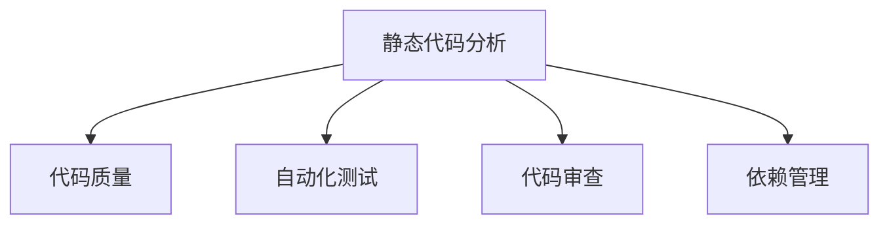

                 

## 1. 背景介绍

在软件开发生命周期的早期阶段，代码质量往往会影响项目进度、可维护性、可读性以及最终产品的质量。随着复杂度的增加，代码的复用性和稳定性也变得更加重要。静态代码分析（Static Code Analysis，简称SCA），即在代码运行之前对其进行审查，是提高代码质量的一种有效手段。

在软件开发的自动化管道中，静态代码分析工具被广泛应用于代码审查、漏洞检测、性能优化、依赖管理等方面。它们在提升开发效率、减少错误、提高代码可读性等方面具有不可替代的作用。

本文将详细探讨静态代码分析的概念、原理、操作步骤，以及其在实际开发中的具体应用。通过深入分析，我们希望能够为开发者提供一个全面的视角，了解如何利用静态代码分析工具来优化软件开发生命周期中的每个环节。

## 2. 核心概念与联系

静态代码分析，通常通过自动化的方式，对源代码进行检查，寻找潜在的错误、安全漏洞、性能问题等。它与动态代码分析（运行时的代码分析）相对，后者通常依赖于测试和用户反馈。

### 2.1 核心概念概述

- **静态代码分析（Static Code Analysis, SCA）**：在源代码运行之前对其进行静态检查，以识别潜在问题。
- **代码质量（Code Quality）**：代码的可读性、可维护性、性能、安全性等方面的综合评价。
- **自动化测试（Automated Testing）**：通过自动化的方式，对代码进行测试，以验证其是否满足预期的行为。
- **代码审查（Code Review）**：由团队成员或其他专家对代码进行审查，以发现和解决潜在问题。
- **依赖管理（Dependency Management）**：管理项目中使用的第三方库和依赖关系，以避免冲突和安全漏洞。

### 2.2 核心概念原理和架构的 Mermaid 流程图



以上流程图展示了静态代码分析与代码质量、自动化测试、代码审查和依赖管理之间的关系。

## 3. 核心算法原理 & 具体操作步骤

### 3.1 算法原理概述

静态代码分析的原理主要是通过对源代码进行静态分析，查找其中的潜在问题。这些潜在的错误包括但不限于：

- 语法错误
- 逻辑错误
- 不安全的操作
- 性能瓶颈
- 未使用的代码

静态代码分析工具通常使用编译器、解释器、或专用的静态分析工具，对代码进行词法、语法和语义分析，以识别潜在问题。

### 3.2 算法步骤详解

静态代码分析的过程主要包括以下几个步骤：

1. **预处理**：将代码转换为一种易于分析的形式，通常是中间代码形式。
2. **分析**：使用编译器或专用的静态分析工具，对代码进行词法、语法和语义分析。
3. **检查**：根据预先定义的规则和模式，查找代码中的潜在问题。
4. **报告**：生成报告，列出所有发现的问题，并提供相应的修复建议。

### 3.3 算法优缺点

**优点**：

- 可以在开发早期发现问题，减少修复成本。
- 自动化程度高，节省人力成本。
- 可以覆盖整个代码库，全面性高。
- 可以持续集成到开发流程中，实时提供反馈。

**缺点**：

- 静态分析可能无法覆盖所有情况，如依赖管理、测试用例编写等。
- 某些错误可能需要结合上下文理解，静态分析可能无法精确识别。
- 可能产生误报，需要人工进一步确认。

### 3.4 算法应用领域

静态代码分析在软件开发中具有广泛的应用，包括但不限于以下领域：

- **安全**：检查代码中的安全漏洞，如SQL注入、跨站脚本等。
- **性能优化**：识别性能瓶颈和资源浪费，提出优化建议。
- **代码审查**：辅助代码审查过程，减少手动审查的工作量。
- **依赖管理**：检测和解决依赖冲突，确保项目稳定运行。
- **编码标准**：确保代码符合预定的编码规范和最佳实践。

## 4. 数学模型和公式 & 详细讲解 & 举例说明

### 4.1 数学模型构建

静态代码分析通常使用图形表示法（如控制流图、数据流图）来构建数学模型。这些模型用于描述代码的结构和行为，帮助工具进行分析和检查。

### 4.2 公式推导过程

以控制流图为例，假设代码中存在一个 `if` 语句：

```java
if (condition) {
    // code block
}
```

这个语句可以被表示为一个有向图，其中 `condition` 的值为真或假分别指向不同的代码块。这个图可以被形式化地表示为一个二分图：

```latex
\begin{align*}
G &= (V, E) \\
V &= \{true, false, C1, C2\} \\
E &= \{(true, C1), (false, C2)\}
\end{align*}
```

其中 `V` 表示节点，`E` 表示边。节点 `true` 和 `false` 分别表示 `condition` 的两种可能值，`C1` 和 `C2` 分别表示两个代码块。

### 4.3 案例分析与讲解

假设我们有一个 Python 函数，用于计算数组的最大值：

```python
def find_max(arr):
    max_val = arr[0]
    for i in range(1, len(arr)):
        if arr[i] > max_val:
            max_val = arr[i]
    return max_val
```

使用静态代码分析工具，可以自动化地检查该函数：

- 语法错误：检查代码是否符合 Python 的语法规则。
- 变量命名：检查变量名是否清晰、一致。
- 代码重复：检查代码块是否存在重复。
- 安全漏洞：检查是否存在潜在的缓冲区溢出等安全问题。
- 性能问题：检查是否存在性能瓶颈，如循环嵌套过深等。

## 5. 项目实践：代码实例和详细解释说明

### 5.1 开发环境搭建

为了进行静态代码分析，需要安装相应的工具和库。以下是一个 Python 项目的搭建流程：

1. **安装静态代码分析工具**：
   ```bash
   pip install flake8 mypy
   ```

   - `flake8`：用于 Python 代码的语法检查和风格检查。
   - `mypy`：用于 Python 代码的类型检查。

2. **配置项目**：
   ```python
   # .flake8
   [flake8]
   max-line-length = 120
   max-complexity = 10
   ```

   - `max-line-length`：代码行长度限制。
   - `max-complexity`：方法复杂度限制。

3. **编写代码**：
   ```python
   def find_max(arr):
       max_val = arr[0]
       for i in range(1, len(arr)):
           if arr[i] > max_val:
               max_val = arr[i]
       return max_val
   ```

### 5.2 源代码详细实现

使用 `flake8` 和 `mypy` 进行代码检查：

1. **使用 flake8 检查代码风格和语法**：
   ```bash
   flake8 mypy
   ```

2. **使用 mypy 检查类型**：
   ```bash
   mypy mypy.py
   ```

   - `mypy.py`：需要检查的 Python 文件。

### 5.3 代码解读与分析

- **flake8**：
  ```text
  flake8 mypy.py
  -----flake8(my.py)---------------------------------- 1/1
  1 files with no problems, 1 successful checks
  ```

  - 检查结果显示代码符合风格和语法规则。

- **mypy**：
  ```text
  mypy mypy.py
  mypy.py:1: error: Argument 1 to "find_max" has incompatible type "List[int]"; expected "Union[int, float, complex, str, bytes, tuple, List, Dict, Set, Any, Type[Any], TypeVar, Protocol, Generic, Callable[[Any, ...], Any], SupportsIndex, SupportsInt, SupportsFloat, SupportsAbs, SupportsRound, Rounding] | Literal[True, False, ...]"
  mypy.py:1: note: arg 1 of "find_max" has incompatible type "List[int]"; expected "Union[int, float, complex, str, bytes, tuple, List, Dict, Set, Any, Type[Any], TypeVar, Protocol, Generic, Callable[[Any, ...], Any], SupportsIndex, SupportsInt, SupportsFloat, SupportsAbs, SupportsRound, Rounding] | Literal[True, False, ...]"
  ```

  - 类型检查发现代码中存在类型错误，`find_max` 函数接受的参数类型应为 `Union[int, float, complex, str, bytes, tuple, List, Dict, Set, Any, Type[Any], TypeVar, Protocol, Generic, Callable[[Any, ...], Any], SupportsIndex, SupportsInt, SupportsFloat, SupportsAbs, SupportsRound, Rounding] | Literal[True, False, ...]`。

### 5.4 运行结果展示

运行结果展示了静态代码分析工具对代码的检查结果。通过这些结果，开发者可以快速发现和修复问题，提高代码质量。

## 6. 实际应用场景

### 6.1 安全

在软件开发过程中，静态代码分析工具可以帮助识别和修复安全漏洞。例如，检查代码中是否存在 SQL 注入、XSS 等常见安全问题。

### 6.2 性能优化

静态代码分析工具可以识别代码中的性能瓶颈，并提出优化建议。例如，检查代码中的循环嵌套是否过深，是否存在不必要的资源消耗。

### 6.3 代码审查

静态代码分析工具可以辅助代码审查过程，减少人工审查的工作量。例如，检查代码是否符合编码规范，是否存在潜在的问题。

### 6.4 依赖管理

静态代码分析工具可以检测和解决依赖冲突，确保项目稳定运行。例如，检查是否存在依赖版本冲突，是否存在不安全的依赖库。

### 6.5 未来应用展望

随着静态代码分析技术的不断发展，未来将有更多智能化的工具出现。例如，基于机器学习的静态代码分析工具，可以自动识别代码中的潜在问题，并给出修复建议。

## 7. 工具和资源推荐

### 7.1 学习资源推荐

为了深入了解静态代码分析，以下是一些推荐的资源：

1. **《Code Complete》**：这是一本关于代码质量和编程实践的经典书籍，涵盖了静态代码分析的各个方面。
2. **《Clean Code: A Handbook of Agile Software Craftsmanship》**：这本书介绍了如何编写清晰、可维护的代码，并使用静态代码分析工具进行检测。
3. **《Effective Python: 59 Specific Ways to Write Better Python》**：这本书介绍了 Python 编程的最佳实践，并使用静态代码分析工具进行检查。

### 7.2 开发工具推荐

以下是一些常用的静态代码分析工具：

1. **flake8**：Python 代码检查工具，用于语法、风格、风格检查。
2. **mypy**：Python 代码类型检查工具。
3. **SonarQube**：企业级静态代码分析平台，支持多种编程语言。
4. **Pylint**：Python 代码质量检查工具。
5. **Coverity**：面向企业的静态代码分析工具。

### 7.3 相关论文推荐

以下是一些关于静态代码分析的论文，供进一步阅读：

1. **《Static Code Analysis for Open Source Java Projects》**：这篇文章介绍了如何利用静态代码分析工具，对开源 Java 项目进行代码质量和问题检测。
2. **《Improving Software Quality by Static Code Analysis》**：这篇文章总结了静态代码分析在提高软件质量方面的应用和效果。

## 8. 总结：未来发展趋势与挑战

### 8.1 研究成果总结

静态代码分析技术在提升代码质量、提高开发效率、减少错误方面具有重要意义。它不仅可以检测出代码中的语法错误和潜在问题，还可以帮助开发者识别代码中的性能瓶颈和安全漏洞。

### 8.2 未来发展趋势

未来的静态代码分析将更加智能化和自动化。基于机器学习和人工智能的静态代码分析工具，可以自动识别代码中的潜在问题，并给出修复建议。

### 8.3 面临的挑战

静态代码分析仍面临一些挑战，如误报率、复杂性处理、跨语言支持等。这些问题需要在未来的研究中进一步解决。

### 8.4 研究展望

未来的研究需要结合人工智能和机器学习技术，提升静态代码分析的智能化水平。同时，需要解决跨语言支持、误报率等问题，使静态代码分析工具更加实用和易用。

## 9. 附录：常见问题与解答

**Q1: 静态代码分析工具和动态代码分析工具的区别是什么？**

A: 静态代码分析工具在代码运行之前对其进行检查，可以检测出语法错误、风格问题、安全漏洞等。而动态代码分析工具在代码运行时进行检查，可以检测出运行时的错误和性能问题。

**Q2: 静态代码分析工具的误报率是如何控制的？**

A: 静态代码分析工具的误报率可以通过调整检查规则和优化算法进行控制。例如，可以使用更复杂的规则集，或者结合人工审查的方式进行校正。

**Q3: 静态代码分析工具是否可以检测跨语言代码中的问题？**

A: 目前大多数静态代码分析工具支持多种编程语言，但跨语言的支持仍存在挑战。未来的研究需要进一步提升跨语言代码分析的准确性和可靠性。

**Q4: 如何提升静态代码分析工具的智能化水平？**

A: 结合机器学习和人工智能技术，使用自然语言处理、模式识别等方法，可以提升静态代码分析工具的智能化水平。例如，使用深度学习模型对代码进行分类和分类。

**Q5: 静态代码分析工具的性能如何优化？**

A: 静态代码分析工具的性能可以通过优化分析算法、减少计算量、并行化处理等方式进行提升。同时，可以使用分布式计算框架，如 Apache Spark，进行大规模代码分析。

---

作者：禅与计算机程序设计艺术 / Zen and the Art of Computer Programming

