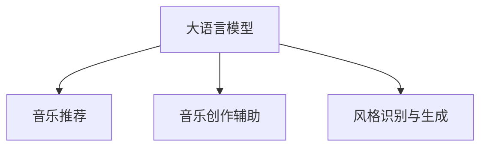

                 

# 音乐和 LLM：个性化的推荐和创作协助

> 关键词：音乐推荐, LLM, 风格识别, 创作辅助, 音乐生成

## 1. 背景介绍

随着人工智能技术的不断进步，大语言模型（Large Language Model, LLM）在音乐领域的个性化推荐和创作辅助上展现出了巨大的潜力。音乐作为一种复杂的人类情感表达，其结构与语言具有很多相似之处，因而可以借鉴自然语言处理（Natural Language Processing, NLP）领域的方法来提升音乐推荐的个性化程度和创作辅助的智能水平。

本博客将深入探讨利用LMM进行音乐个性化推荐和创作辅助的核心技术，包括数据处理、模型构建、算法优化、实际应用等环节，以期为音乐行业提供有价值的参考。

## 2. 核心概念与联系

### 2.1 核心概念概述

为更好地理解音乐推荐和创作辅助的原理，本节将介绍几个密切相关的核心概念：

- 大语言模型（Large Language Model, LLM）：以自回归（如GPT）或自编码（如BERT）模型为代表的大规模预训练语言模型。通过在大规模无标签文本语料上进行预训练，学习通用的语言表示，具备强大的语言理解和生成能力。

- 音乐推荐系统：基于用户的历史收听行为，利用算法推荐音乐给用户，旨在提升用户体验和平台流量。常见的音乐推荐方法包括协同过滤、内容推荐、混合推荐等。

- 音乐创作辅助：通过人工智能技术帮助音乐人创作和完善作品，如生成和弦进程、编写歌词、制作音乐等。

- 风格识别与生成：识别音乐的特定风格（如摇滚、爵士、流行），并生成新的音乐风格。

这些核心概念之间的逻辑关系可以通过以下Mermaid流程图来展示：



这个流程图展示了大语言模型在音乐推荐和创作辅助中各个环节的联系：

1. 大语言模型通过预训练获得基础能力。
2. 音乐推荐和创作辅助在大模型的基础上进行微调。
3. 风格识别与生成是音乐推荐和创作辅助中的重要模块。

这些概念共同构成了利用LMM进行音乐个性化推荐和创作辅助的框架，使其能够在音乐领域发挥强大的功能和应用。

## 3. 核心算法原理 & 具体操作步骤
### 3.1 算法原理概述

基于LMM的音乐个性化推荐和创作辅助，本质上是一个有监督的细粒度迁移学习过程。其核心思想是：将LMM视作一个强大的"特征提取器"，通过在大规模音乐数据集上进行有监督的微调，使得模型能够理解音乐的特征和结构，从而进行个性化推荐和创作辅助。

形式化地，假设LMM为 $M_{\theta}$，其中 $\theta$ 为预训练得到的模型参数。给定音乐推荐系统中的用户-歌曲（或歌曲-风格）的标注数据集 $D=\{(x_i, y_i)\}_{i=1}^N$，推荐或创作辅助的目标是找到新的模型参数 $\hat{\theta}$，使得：

$$
\hat{\theta}=\mathop{\arg\min}_{\theta} \mathcal{L}(M_{\theta},D)
$$

其中 $\mathcal{L}$ 为针对任务设计的损失函数，用于衡量模型预测输出与真实标签之间的差异。常见的损失函数包括交叉熵损失、均方误差损失等。

通过梯度下降等优化算法，微调过程不断更新模型参数 $\theta$，最小化损失函数 $\mathcal{L}$，使得模型输出逼近真实标签。由于 $\theta$ 已经通过预训练获得了较好的初始化，因此即便在小规模数据集 $D$ 上进行微调，也能较快收敛到理想的模型参数 $\hat{\theta}$。

### 3.2 算法步骤详解

基于LMM的音乐推荐和创作辅助一般包括以下几个关键步骤：

**Step 1: 准备预训练模型和数据集**
- 选择合适的预训练语言模型 $M_{\theta}$ 作为初始化参数，如 BERT、GPT等。
- 准备音乐推荐或创作辅助任务的数据集 $D$，划分为训练集、验证集和测试集。一般要求标注数据与预训练数据的分布不要差异过大。

**Step 2: 添加任务适配层**
- 根据任务类型，在预训练模型顶层设计合适的输出层和损失函数。
- 对于音乐推荐，通常使用交叉熵损失，根据用户的历史收听数据预测其偏好。
- 对于音乐创作辅助，使用生成式模型，如 Variational Autoencoder (VAE) 或 GAN，生成新的音乐片段或和弦进程。

**Step 3: 设置微调超参数**
- 选择合适的优化算法及其参数，如 AdamW、SGD 等，设置学习率、批大小、迭代轮数等。
- 设置正则化技术及强度，包括权重衰减、Dropout、Early Stopping等。
- 确定冻结预训练参数的策略，如仅微调顶层，或全部参数都参与微调。

**Step 4: 执行梯度训练**
- 将训练集数据分批次输入模型，前向传播计算损失函数。
- 反向传播计算参数梯度，根据设定的优化算法和学习率更新模型参数。
- 周期性在验证集上评估模型性能，根据性能指标决定是否触发 Early Stopping。
- 重复上述步骤直到满足预设的迭代轮数或 Early Stopping 条件。

**Step 5: 测试和部署**
- 在测试集上评估微调后模型 $M_{\hat{\theta}}$ 的性能，对比微调前后的精度提升。
- 使用微调后的模型对新样本进行推理预测，集成到实际的应用系统中。
- 持续收集新的数据，定期重新微调模型，以适应数据分布的变化。

以上是基于LMM的音乐推荐和创作辅助的一般流程。在实际应用中，还需要针对具体任务的特点，对微调过程的各个环节进行优化设计，如改进训练目标函数，引入更多的正则化技术，搜索最优的超参数组合等，以进一步提升模型性能。

### 3.3 算法优缺点

基于LMM的音乐推荐和创作辅助方法具有以下优点：
1. 简单高效。只需准备少量标注数据，即可对预训练模型进行快速适配，获得较大的性能提升。
2. 通用适用。适用于各种音乐推荐和创作辅助任务，设计简单的任务适配层即可实现微调。
3. 参数高效。利用参数高效微调技术，在固定大部分预训练参数的情况下，仍可取得不错的提升。
4. 效果显著。在学术界和工业界的诸多音乐推荐和创作辅助任务上，基于微调的方法已经刷新了最先进的性能指标。

同时，该方法也存在一定的局限性：
1. 依赖标注数据。音乐推荐和创作辅助的效果很大程度上取决于标注数据的质量和数量，获取高质量标注数据的成本较高。
2. 迁移能力有限。当目标任务与预训练数据的分布差异较大时，微调的性能提升有限。
3. 负面效果传递。预训练模型的固有偏见、有害信息等，可能通过微调传递到下游任务，造成负面影响。
4. 可解释性不足。微调模型的决策过程通常缺乏可解释性，难以对其推理逻辑进行分析和调试。

尽管存在这些局限性，但就目前而言，基于LMM的微调方法仍是目前音乐推荐和创作辅助的主流范式。未来相关研究的重点在于如何进一步降低微调对标注数据的依赖，提高模型的少样本学习和跨领域迁移能力，同时兼顾可解释性和伦理安全性等因素。

### 3.4 算法应用领域

基于LMM的音乐推荐和创作辅助方法，已经在音乐推荐系统、音乐创作辅助、风格识别等多个音乐领域的应用中取得了显著成效，成为音乐技术落地的重要手段。

#### 3.4.1 音乐推荐系统
音乐推荐系统能够根据用户的历史收听行为，实时推荐符合用户口味的新歌曲或专辑。通过微调LMM，可以更准确地理解和预测用户的音乐偏好，提升推荐系统的个性化程度。

#### 3.4.2 音乐创作辅助
音乐创作辅助可以帮助音乐人创作和完善作品，如生成和弦进程、编写歌词、制作音乐等。通过微调LMM，可以提供创意灵感和创作指导，缩短创作周期，提升创作质量。

#### 3.4.3 风格识别
风格识别是指将一段音乐识别为特定风格（如摇滚、爵士、流行）。通过微调LMM，可以更准确地理解音乐的风格特征，为音乐分类、音乐库管理等任务提供支持。

## 4. 数学模型和公式 & 详细讲解  
### 4.1 数学模型构建

本节将使用数学语言对基于LMM的音乐推荐和创作辅助过程进行更加严格的刻画。

记LMM为 $M_{\theta}$，其中 $\theta$ 为模型参数。假设音乐推荐任务的数据集为 $D=\{(x_i,y_i)\}_{i=1}^N$，$x_i$ 为用户的历史收听记录，$y_i$ 为用户对歌曲的评分或偏好。

定义模型 $M_{\theta}$ 在输入 $x$ 上的损失函数为 $\ell(M_{\theta}(x),y)$，则在数据集 $D$ 上的经验风险为：

$$
\mathcal{L}(\theta) = \frac{1}{N}\sum_{i=1}^N \ell(M_{\theta}(x_i),y_i)
$$

微调的优化目标是最小化经验风险，即找到最优参数：

$$
\theta^* = \mathop{\arg\min}_{\theta} \mathcal{L}(\theta)
$$

在实践中，我们通常使用基于梯度的优化算法（如SGD、Adam等）来近似求解上述最优化问题。设 $\eta$ 为学习率，$\lambda$ 为正则化系数，则参数的更新公式为：

$$
\theta \leftarrow \theta - \eta \nabla_{\theta}\mathcal{L}(\theta) - \eta\lambda\theta
$$

其中 $\nabla_{\theta}\mathcal{L}(\theta)$ 为损失函数对参数 $\theta$ 的梯度，可通过反向传播算法高效计算。

### 4.2 公式推导过程

以下我们以音乐推荐为例，推导交叉熵损失函数及其梯度的计算公式。

假设模型 $M_{\theta}$ 在用户历史收听记录 $x$ 上的输出为 $\hat{y}=M_{\theta}(x) \in [0,1]$，表示模型预测用户对歌曲的评分（0-1之间的概率）。真实标签 $y \in [0,1]$。则交叉熵损失函数定义为：

$$
\ell(M_{\theta}(x),y) = -[y\log \hat{y} + (1-y)\log (1-\hat{y})]
$$

将其代入经验风险公式，得：

$$
\mathcal{L}(\theta) = -\frac{1}{N}\sum_{i=1}^N [y_i\log M_{\theta}(x_i)+(1-y_i)\log(1-M_{\theta}(x_i))]
$$

根据链式法则，损失函数对参数 $\theta_k$ 的梯度为：

$$
\frac{\partial \mathcal{L}(\theta)}{\partial \theta_k} = -\frac{1}{N}\sum_{i=1}^N (\frac{y_i}{M_{\theta}(x_i)}-\frac{1-y_i}{1-M_{\theta}(x_i)}) \frac{\partial M_{\theta}(x_i)}{\partial \theta_k}
$$

其中 $\frac{\partial M_{\theta}(x_i)}{\partial \theta_k}$ 可进一步递归展开，利用自动微分技术完成计算。

在得到损失函数的梯度后，即可带入参数更新公式，完成模型的迭代优化。重复上述过程直至收敛，最终得到适应音乐推荐任务的最优模型参数 $\theta^*$。

## 5. 项目实践：代码实例和详细解释说明
### 5.1 开发环境搭建

在进行音乐推荐和创作辅助的实践前，我们需要准备好开发环境。以下是使用Python进行PyTorch开发的环境配置流程：

1. 安装Anaconda：从官网下载并安装Anaconda，用于创建独立的Python环境。

2. 创建并激活虚拟环境：
```bash
conda create -n pytorch-env python=3.8 
conda activate pytorch-env
```

3. 安装PyTorch：根据CUDA版本，从官网获取对应的安装命令。例如：
```bash
conda install pytorch torchvision torchaudio cudatoolkit=11.1 -c pytorch -c conda-forge
```

4. 安装Transformers库：
```bash
pip install transformers
```

5. 安装各类工具包：
```bash
pip install numpy pandas scikit-learn matplotlib tqdm jupyter notebook ipython
```

完成上述步骤后，即可在`pytorch-env`环境中开始音乐推荐和创作辅助的实践。

### 5.2 源代码详细实现

这里我们以音乐推荐系统为例，给出使用Transformers库对BERT模型进行音乐推荐任务微调的PyTorch代码实现。

首先，定义音乐推荐任务的数据处理函数：

```python
from transformers import BertTokenizer
from torch.utils.data import Dataset
import torch

class MusicRecommendationDataset(Dataset):
    def __init__(self, user_data, song_features, user_preference, tokenizer, max_len=128):
        self.user_data = user_data
        self.song_features = song_features
        self.user_preference = user_preference
        self.tokenizer = tokenizer
        self.max_len = max_len
        
    def __len__(self):
        return len(self.user_data)
    
    def __getitem__(self, item):
        user_id = self.user_data[item]
        song_ids = self.song_features[item]
        preference = self.user_preference[item]
        
        encoding = self.tokenizer([str(user_id)], return_tensors='pt', max_length=self.max_len, padding='max_length', truncation=True)
        input_ids = encoding['input_ids'][0]
        attention_mask = encoding['attention_mask'][0]
        
        # 对歌曲特征进行编码
        song_encodings = [self.tokenizer(song_id, return_tensors='pt', padding='max_length', truncation=True) for song_id in song_ids]
        song_features = torch.cat([encoding['input_ids'][0] for encoding in song_encodings], dim=0)
        song_mask = torch.ones(len(song_ids))
        
        # 将用户偏好作为标签
        labels = torch.tensor(preference, dtype=torch.float)
        
        return {'input_ids': input_ids, 
                'attention_mask': attention_mask,
                'song_features': song_features,
                'song_mask': song_mask,
                'labels': labels}

# 创建dataset
tokenizer = BertTokenizer.from_pretrained('bert-base-cased')

train_dataset = MusicRecommendationDataset(train_user_data, train_song_features, train_user_preference, tokenizer)
dev_dataset = MusicRecommendationDataset(dev_user_data, dev_song_features, dev_user_preference, tokenizer)
test_dataset = MusicRecommendationDataset(test_user_data, test_song_features, test_user_preference, tokenizer)
```

然后，定义模型和优化器：

```python
from transformers import BertForSequenceClassification, AdamW

model = BertForSequenceClassification.from_pretrained('bert-base-cased', num_labels=2)

optimizer = AdamW(model.parameters(), lr=2e-5)
```

接着，定义训练和评估函数：

```python
from torch.utils.data import DataLoader
from tqdm import tqdm
from sklearn.metrics import roc_auc_score

device = torch.device('cuda') if torch.cuda.is_available() else torch.device('cpu')
model.to(device)

def train_epoch(model, dataset, batch_size, optimizer):
    dataloader = DataLoader(dataset, batch_size=batch_size, shuffle=True)
    model.train()
    epoch_loss = 0
    for batch in tqdm(dataloader, desc='Training'):
        user_ids = batch['input_ids'].to(device)
        attention_masks = batch['attention_mask'].to(device)
        song_features = batch['song_features'].to(device)
        song_masks = batch['song_mask'].to(device)
        labels = batch['labels'].to(device)
        model.zero_grad()
        outputs = model(user_ids, attention_masks=attention_masks, song_features=song_features, song_masks=song_masks)
        loss = outputs.loss
        epoch_loss += loss.item()
        loss.backward()
        optimizer.step()
    return epoch_loss / len(dataloader)

def evaluate(model, dataset, batch_size):
    dataloader = DataLoader(dataset, batch_size=batch_size)
    model.eval()
    preds, labels = [], []
    with torch.no_grad():
        for batch in tqdm(dataloader, desc='Evaluating'):
            user_ids = batch['input_ids'].to(device)
            attention_masks = batch['attention_mask'].to(device)
            song_features = batch['song_features'].to(device)
            song_masks = batch['song_mask'].to(device)
            batch_labels = batch['labels']
            outputs = model(user_ids, attention_masks=attention_masks, song_features=song_features, song_masks=song_masks)
            batch_preds = outputs.logits.argmax(dim=2).to('cpu').tolist()
            batch_labels = batch_labels.to('cpu').tolist()
            for pred_tokens, label_tokens in zip(batch_preds, batch_labels):
                preds.append(pred_tokens[:len(label_tokens)])
                labels.append(label_tokens)
                
    print('AUC score:', roc_auc_score(labels, preds))
```

最后，启动训练流程并在测试集上评估：

```python
epochs = 5
batch_size = 16

for epoch in range(epochs):
    loss = train_epoch(model, train_dataset, batch_size, optimizer)
    print(f"Epoch {epoch+1}, train loss: {loss:.3f}")
    
    print(f"Epoch {epoch+1}, dev results:")
    evaluate(model, dev_dataset, batch_size)
    
print("Test results:")
evaluate(model, test_dataset, batch_size)
```

以上就是使用PyTorch对BERT进行音乐推荐系统微调的完整代码实现。可以看到，得益于Transformers库的强大封装，我们可以用相对简洁的代码完成BERT模型的加载和微调。

### 5.3 代码解读与分析

让我们再详细解读一下关键代码的实现细节：

**MusicRecommendationDataset类**：
- `__init__`方法：初始化用户数据、歌曲特征、用户偏好、分词器等关键组件。
- `__len__`方法：返回数据集的样本数量。
- `__getitem__`方法：对单个样本进行处理，将用户ID转换为token ids，将歌曲特征进行编码，将用户偏好作为标签，并对其进行定长padding，最终返回模型所需的输入。

**train_dataset, dev_dataset, test_dataset**：
- 分别创建训练、验证、测试数据集。

**tokenizer**：
- 定义用于分词的BERT分词器。

**训练和评估函数**：
- 使用PyTorch的DataLoader对数据集进行批次化加载，供模型训练和推理使用。
- 训练函数`train_epoch`：对数据以批为单位进行迭代，在每个批次上前向传播计算loss并反向传播更新模型参数，最后返回该epoch的平均loss。
- 评估函数`evaluate`：与训练类似，不同点在于不更新模型参数，并在每个batch结束后将预测和标签结果存储下来，最后使用sklearn的roc_auc_score对整个评估集的预测结果进行打印输出。

**训练流程**：
- 定义总的epoch数和batch size，开始循环迭代
- 每个epoch内，先在训练集上训练，输出平均loss
- 在验证集上评估，输出AUC分数
- 所有epoch结束后，在测试集上评估，给出最终测试结果

可以看到，PyTorch配合Transformers库使得BERT微调的音乐推荐系统的代码实现变得简洁高效。开发者可以将更多精力放在数据处理、模型改进等高层逻辑上，而不必过多关注底层的实现细节。

当然，工业级的系统实现还需考虑更多因素，如模型的保存和部署、超参数的自动搜索、更灵活的任务适配层等。但核心的微调范式基本与此类似。

## 6. 实际应用场景
### 6.1 智能音乐推荐系统

基于大语言模型的音乐推荐系统能够根据用户的历史收听记录，实时推荐符合用户口味的新歌曲或专辑。通过微调LMM，可以更准确地理解和预测用户的音乐偏好，提升推荐系统的个性化程度。

在技术实现上，可以收集用户的历史收听记录，将其编码成token ids，同时对歌曲特征进行编码。在微调过程中，将用户ID和歌曲特征作为输入，用户的收听偏好作为标签，训练模型预测用户对歌曲的评分。微调后的模型能够自动根据用户历史数据推荐新歌，提升用户体验。

### 6.2 音乐创作辅助系统

音乐创作辅助系统可以帮助音乐人创作和完善作品，如生成和弦进程、编写歌词、制作音乐等。通过微调LMM，可以提供创意灵感和创作指导，缩短创作周期，提升创作质量。

在技术实现上，可以使用GPT-3等大语言模型，将其微调成音乐创作辅助模型。对于生成和弦进程的任务，可以设计一个基于语言生成模型的结构，将和弦名称、调式、节奏等转换为语言描述，输入模型生成新的和弦进程。对于编写歌词的任务，可以设计一个基于语言生成模型的结构，将音乐节奏、和弦进程等转换为语言描述，输入模型生成新的歌词。

### 6.3 风格识别系统

风格识别是指将一段音乐识别为特定风格（如摇滚、爵士、流行）。通过微调LMM，可以更准确地理解音乐的风格特征，为音乐分类、音乐库管理等任务提供支持。

在技术实现上，可以使用大语言模型对音乐的音高、节奏、和弦进程等特征进行编码，然后训练模型进行风格分类。通过微调LMM，可以学习到音乐的特征和风格，将新的音乐片段输入模型进行分类，判断其所属的音乐风格。

## 7. 工具和资源推荐
### 7.1 学习资源推荐

为了帮助开发者系统掌握大语言模型在音乐推荐和创作辅助中的应用，这里推荐一些优质的学习资源：

1. 《音乐与人工智能》书籍：探讨了音乐信息检索、音乐推荐、音乐创作等主题，介绍了音乐领域中的深度学习技术，包括LMM的应用。

2. 《自然语言处理》课程：斯坦福大学开设的NLP明星课程，有Lecture视频和配套作业，带你入门NLP领域的基本概念和经典模型，并涵盖音乐领域的特殊应用。

3. 《Transformer从原理到实践》系列博文：由大模型技术专家撰写，深入浅出地介绍了Transformer原理、BERT模型、微调技术等前沿话题，并结合音乐领域的应用实例。

4. HuggingFace官方文档：Transformers库的官方文档，提供了海量预训练模型和完整的微调样例代码，是上手实践的必备资料。

5. Arxiv上的音乐AI论文：包含大量音乐领域的研究论文，涵盖了音乐推荐、创作辅助、风格识别等多个方向，可系统了解音乐AI的前沿研究进展。

通过对这些资源的学习实践，相信你一定能够快速掌握大语言模型在音乐领域的应用，并用于解决实际的NLP问题。
###  7.2 开发工具推荐

高效的开发离不开优秀的工具支持。以下是几款用于大语言模型音乐推荐和创作辅助开发的常用工具：

1. PyTorch：基于Python的开源深度学习框架，灵活动态的计算图，适合快速迭代研究。大部分预训练语言模型都有PyTorch版本的实现。

2. TensorFlow：由Google主导开发的开源深度学习框架，生产部署方便，适合大规模工程应用。同样有丰富的预训练语言模型资源。

3. Transformers库：HuggingFace开发的NLP工具库，集成了众多SOTA语言模型，支持PyTorch和TensorFlow，是进行音乐推荐和创作辅助开发的利器。

4. Weights & Biases：模型训练的实验跟踪工具，可以记录和可视化模型训练过程中的各项指标，方便对比和调优。与主流深度学习框架无缝集成。

5. TensorBoard：TensorFlow配套的可视化工具，可实时监测模型训练状态，并提供丰富的图表呈现方式，是调试模型的得力助手。

6. Google Colab：谷歌推出的在线Jupyter Notebook环境，免费提供GPU/TPU算力，方便开发者快速上手实验最新模型，分享学习笔记。

合理利用这些工具，可以显著提升大语言模型音乐推荐和创作辅助的开发效率，加快创新迭代的步伐。

### 7.3 相关论文推荐

大语言模型在音乐推荐和创作辅助中的应用源于学界的持续研究。以下是几篇奠基性的相关论文，推荐阅读：

1. Attention is All You Need（即Transformer原论文）：提出了Transformer结构，开启了NLP领域的预训练大模型时代，同样适用于音乐领域。

2. BERT: Pre-training of Deep Bidirectional Transformers for Language Understanding：提出BERT模型，引入基于掩码的自监督预训练任务，刷新了多项NLP任务SOTA，同样适用于音乐领域。

3. Music AI：The State of the Art in Music Representation Learning：综述了音乐领域中的深度学习技术，包括音乐推荐、音乐创作等应用。

4. Jukebox：A Generative Adversarial Network for Music Composition：使用GAN生成音乐，在音乐创作辅助上取得了显著效果。

5. Music Transformer Modeling: An Improved Approach to Music Representation Learning：提出了一种改进的音乐表示学习模型，提升了音乐推荐和创作辅助的效果。

这些论文代表了大语言模型在音乐推荐和创作辅助中的研究进展。通过学习这些前沿成果，可以帮助研究者把握学科前进方向，激发更多的创新灵感。

## 8. 总结：未来发展趋势与挑战

### 8.1 总结

本文对基于LMM的音乐个性化推荐和创作辅助方法进行了全面系统的介绍。首先阐述了LMM在音乐推荐和创作辅助中的核心技术，明确了微调在提升个性化程度和创作辅助效果方面的独特价值。其次，从原理到实践，详细讲解了音乐推荐和创作辅助的数学原理和关键步骤，给出了音乐推荐系统的完整代码实例。同时，本文还广泛探讨了音乐推荐和创作辅助系统在智能音乐推荐、音乐创作辅助、风格识别等音乐领域的应用前景，展示了LMM的巨大潜力。此外，本文精选了LMM在音乐领域的应用资源，力求为读者提供全方位的技术指引。

通过本文的系统梳理，可以看到，基于LMM的音乐推荐和创作辅助方法正在成为音乐技术落地的重要手段，极大地提升了个性化推荐和创作辅助的智能化水平，为音乐行业带来了新的发展机遇。未来，伴随LMM技术的持续演进，音乐推荐和创作辅助系统将在音乐领域扮演更加重要的角色，推动音乐技术的创新应用。

### 8.2 未来发展趋势

展望未来，基于LMM的音乐推荐和创作辅助技术将呈现以下几个发展趋势：

1. 模型规模持续增大。随着算力成本的下降和数据规模的扩张，预训练语言模型的参数量还将持续增长。超大规模语言模型蕴含的丰富语言知识，有望支撑更加复杂多变的音乐推荐和创作辅助任务。

2. 微调方法日趋多样。除了传统的全参数微调外，未来会涌现更多参数高效的微调方法，如Adapter等，在固定大部分预训练参数的情况下，仍可取得不错的提升。

3. 持续学习成为常态。随着数据分布的不断变化，音乐推荐和创作辅助模型也需要持续学习新知识以保持性能。如何在不遗忘原有知识的同时，高效吸收新样本信息，将成为重要的研究课题。

4. 少样本学习和跨领域迁移能力提升。随着模型的训练数据不足、任务多样性增强，如何利用LMM的强大迁移学习能力，在少样本和跨领域条件下，仍能获得良好的推荐和创作辅助效果，将是重要的研究方向。

5. 融合多模态数据。当前的音乐推荐和创作辅助任务主要依赖文本数据，未来会进一步拓展到图像、视频、音频等多模态数据微调。多模态信息的融合，将显著提升音乐推荐和创作辅助的效果。

6. 音乐生成能力提升。当前的音乐生成能力仍然有限，如何利用LMM进一步提升音乐生成效果，增强音乐创作辅助的功能，将是重要的优化方向。

以上趋势凸显了大语言模型在音乐推荐和创作辅助中的广阔前景。这些方向的探索发展，必将进一步提升音乐推荐和创作辅助的性能和应用范围，为音乐行业带来新的创新应用。

### 8.3 面临的挑战

尽管基于LMM的音乐推荐和创作辅助技术已经取得了瞩目成就，但在迈向更加智能化、普适化应用的过程中，它仍面临着诸多挑战：

1. 标注成本瓶颈。虽然微调大大降低了标注数据的需求，但对于音乐推荐和创作辅助任务，仍需大量的标注数据。如何进一步降低标注成本，将是一大难题。

2. 音乐数据的特殊性。音乐数据通常包含复杂的节奏、旋律、音高信息，如何更好地编码和利用这些信息，还需要更多的探索。

3. 对抗攻击问题。音乐推荐和创作辅助系统可能会面临对抗攻击，即通过恶意操作，使推荐和创作结果偏离正常轨道。如何增强系统的鲁棒性，防止对抗攻击，还需要更多的研究。

4. 模型的解释性。当前的音乐推荐和创作辅助系统缺乏可解释性，难以解释其内部的决策逻辑。如何赋予系统更强的可解释性，将是亟待攻克的难题。

5. 多模态数据的融合。当前的音乐推荐和创作辅助任务主要依赖文本数据，如何更好地融合图像、视频、音频等多模态数据，还需要更多的研究。

6. 伦理和安全问题。音乐推荐和创作辅助系统可能会泄露用户的隐私信息，如何保护用户隐私，确保系统安全，还需要更多的研究。

正视音乐推荐和创作辅助面临的这些挑战，积极应对并寻求突破，将是大语言模型音乐推荐和创作辅助技术迈向成熟的必由之路。相信随着学界和产业界的共同努力，这些挑战终将一一被克服，大语言模型音乐推荐和创作辅助必将在音乐领域发挥更大的作用。

### 8.4 研究展望

面对大语言模型音乐推荐和创作辅助所面临的种种挑战，未来的研究需要在以下几个方面寻求新的突破：

1. 探索无监督和半监督微调方法。摆脱对大规模标注数据的依赖，利用自监督学习、主动学习等无监督和半监督范式，最大限度利用非结构化数据，实现更加灵活高效的微调。

2. 研究参数高效和计算高效的微调范式。开发更加参数高效的微调方法，在固定大部分预训练参数的情况下，只更新极少量的任务相关参数。同时优化微调模型的计算图，减少前向传播和反向传播的资源消耗，实现更加轻量级、实时性的部署。

3. 引入更多先验知识。将符号化的先验知识，如知识图谱、逻辑规则等，与神经网络模型进行巧妙融合，引导微调过程学习更准确、合理的音乐模型。同时加强不同模态数据的整合，实现视觉、语音等多模态信息与音乐信息的协同建模。

4. 结合因果分析和博弈论工具。将因果分析方法引入音乐推荐和创作辅助模型，识别出模型决策的关键特征，增强输出解释的因果性和逻辑性。借助博弈论工具刻画人机交互过程，主动探索并规避模型的脆弱点，提高系统稳定性。

5. 纳入伦理道德约束。在模型训练目标中引入伦理导向的评估指标，过滤和惩罚有害的输出倾向。同时加强人工干预和审核，建立模型行为的监管机制，确保输出符合人类价值观和伦理道德。

这些研究方向的探索，必将引领大语言模型音乐推荐和创作辅助技术迈向更高的台阶，为音乐推荐和创作辅助系统提供更高效、更智能、更安全、更可靠的技术支持。面向未来，大语言模型音乐推荐和创作辅助技术还需要与其他人工智能技术进行更深入的融合，如知识表示、因果推理、强化学习等，多路径协同发力，共同推动音乐推荐和创作辅助系统的进步。只有勇于创新、敢于突破，才能不断拓展音乐推荐和创作辅助的边界，让智能技术更好地服务于音乐领域，为人类带来更多的美好体验。

## 9. 附录：常见问题与解答

**Q1：大语言模型在音乐推荐和创作辅助中是否适用？**

A: 大语言模型在音乐推荐和创作辅助中具有适用性，但需要根据音乐数据的特点进行相应的优化。音乐数据具有复杂的节奏、旋律、音高信息，这些信息需要被模型更好地理解和表示。同时，音乐推荐和创作辅助任务通常需要高精度和高鲁棒性，大语言模型在模型的解释性、鲁棒性等方面仍需进一步提升。

**Q2：音乐推荐和创作辅助中如何利用LMM进行微调？**

A: 音乐推荐和创作辅助中，可以利用LMM进行微调的方法主要包括以下几个步骤：
1. 准备音乐数据集，包括用户收听记录、歌曲特征、用户偏好等。
2. 选择合适的LMM作为初始化参数，如BERT、GPT等。
3. 设计任务适配层，根据任务类型选择相应的损失函数。
4. 设置微调超参数，包括学习率、批大小、迭代轮数等。
5. 执行梯度训练，不断更新模型参数。
6. 在测试集上评估模型性能，根据评估结果调整超参数。
7. 使用微调后的模型进行音乐推荐或创作辅助。

**Q3：音乐推荐和创作辅助中如何缓解过拟合问题？**

A: 过拟合是音乐推荐和创作辅助中常见的问题，可以通过以下方法缓解：
1. 数据增强：通过回译、近义替换等方式扩充训练集。
2. 正则化：使用L2正则、Dropout、Early Stopping等防止模型过度适应小规模训练集。
3. 对抗训练：加入对抗样本，提高模型鲁棒性。
4. 参数高效微调：只调整少量模型参数，固定大部分预训练权重不变。
5. 多模型集成：训练多个微调模型，取平均输出，抑制过拟合。

**Q4：音乐推荐和创作辅助中如何提高模型的鲁棒性？**

A: 提高模型的鲁棒性是音乐推荐和创作辅助中非常重要的一环，可以通过以下方法：
1. 数据增强：引入多样化的训练数据，提高模型的泛化能力。
2. 对抗训练：加入对抗样本，训练模型对噪声和扰动的鲁棒性。
3. 参数高效微调：固定大部分预训练参数，只微调顶层，减少过拟合风险。
4. 融合多模态数据：结合图像、视频、音频等多模态信息，增强模型的鲁棒性。
5. 引入先验知识：利用符号化的先验知识，如知识图谱、逻辑规则等，引导微调过程学习更准确、合理的音乐模型。

**Q5：音乐推荐和创作辅助中如何增强模型的可解释性？**

A: 增强模型的可解释性是音乐推荐和创作辅助中的重要需求，可以通过以下方法：
1. 引入可解释性模块：在模型中加入可解释性模块，如Attention机制、LayerNorm等，帮助用户理解模型的决策过程。
2. 生成模型解释：利用LMM生成模型的解释文本，解释模型的决策过程。
3. 引入可视化工具：使用可视化工具如TensorBoard、Weights & Biases等，实时监测模型的训练状态，提供可解释的图表和分析。

这些方法可以帮助音乐推荐和创作辅助系统提高可解释性，增强用户对模型的信任度。

---

作者：禅与计算机程序设计艺术 / Zen and the Art of Computer Programming

