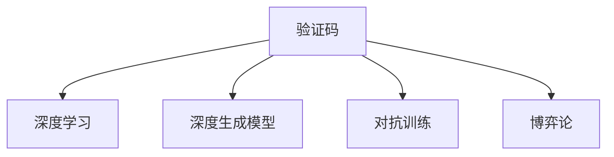

                 

# 验证码：人类智慧与机器学习的博弈

> 关键词：验证码,机器学习,博弈论,对抗训练,深度学习,深度生成模型

## 1. 背景介绍

### 1.1 问题由来

随着互联网的普及和数字技术的不断进步，网络安全和隐私保护已经成为全球关注的焦点。为了防止自动化工具非法获取用户信息，验证码被广泛用于保护网站和移动应用的用户账号安全。验证码的本质是一种多维度、随机化的数学计算题，要求用户输入正确答案才能完成注册、登录、交易等操作。

然而，随着技术的进步，破解验证码的技术手段也不断提升。一些高级黑客通过使用自动化软件、深度学习模型等手段，成功破解了大部分的传统验证码。因此，设计一种能够有效对抗自动化攻击、保护用户隐私的验证码方案，成为了当前计算机视觉和人工智能领域的一个热门话题。

### 1.2 问题核心关键点

验证码的设计和破解是一个典型的博弈过程，涉及人类智慧和机器学习两个方面。人类智慧体现在验证码的设计上，需要设计出既难以破解，又不过于复杂的设计方案。机器学习则体现在对验证码的破解上，利用深度学习模型自动分析验证码特征，并通过大量样本的训练，破解验证码。

验证码的设计与破解技术是一个动态博弈过程，双方都在不断进化。为了提升验证码的安全性，研究人员不断推出新的验证码技术，包括扭曲变形验证码、文本识别验证码等。为了破解验证码，黑客也使用深度学习模型进行自动化破解，例如使用深度生成模型生成假图片、使用对抗训练方法提升破解模型效果等。

## 2. 核心概念与联系

### 2.1 核心概念概述

为更好地理解验证码技术的设计与破解，本节将介绍几个密切相关的核心概念：

- 验证码(Captcha): 一种用来验证用户身份的随机计算题，要求用户通过解决计算题来证明自己的合法性。
- 深度学习: 一种基于多层神经网络的机器学习技术，通过大量样本的训练，自动学习数据的特征表示，在图像识别、自然语言处理等领域取得了显著成果。
- 深度生成模型: 一种基于神经网络的生成模型，能够生成逼真的图片、文本、语音等，常用于图像生成、文本补全等任务。
- 对抗训练(Adversarial Training): 一种训练技术，通过在模型训练中加入对抗样本，提升模型的鲁棒性和泛化能力。
- 博弈论: 一种研究决策者之间相互策略关系的数学模型，可以用于描述验证码设计与破解过程。

这些核心概念之间的逻辑关系可以通过以下Mermaid流程图来展示：



这个流程图展示了一些核心概念之间的联系：

1. 验证码的设计利用了深度学习技术，通过生成复杂的图像和文本来提升破解难度。
2. 对抗训练用于提升破解模型的鲁棒性，使得破解更加困难。
3. 博弈论用于描述验证码设计与破解过程，预测双方策略。

## 3. 核心算法原理 & 具体操作步骤
### 3.1 算法原理概述

验证码的设计与破解本质上是人类智慧和机器学习之间的博弈过程。验证码的设计者希望设计出难以破解的验证码，以确保用户账号的安全性。而破解者则希望通过深度学习模型自动分析验证码特征，并通过大量样本的训练，破解验证码。

验证码的设计过程包括以下几个步骤：

1. 设计验证码类型: 根据应用场景，设计适合的验证码类型，如扭曲变形验证码、文本识别验证码等。
2. 生成验证码: 使用深度生成模型生成符合设计要求的验证码，并添加一定的噪声，增加破解难度。
3. 验证答案: 通过后端服务器验证用户输入的答案是否正确。

验证码的破解过程包括以下几个步骤：

1. 收集样本: 收集大量已破解的验证码样本，作为训练数据。
2. 训练模型: 使用深度学习模型对验证码样本进行训练，学习验证码的特征表示。
3. 破解验证码: 使用训练好的模型对新的验证码进行破解，输出破解结果。

### 3.2 算法步骤详解

验证码的设计和破解是一个动态博弈过程，具体步骤如下：

#### 验证码设计

1. 类型选择
   - 根据应用场景选择适合的验证码类型，如扭曲变形验证码、文本识别验证码等。
   - 扭曲变形验证码：生成一张扭曲变形的图片，添加一定程度的噪声，增加破解难度。
   - 文本识别验证码：生成一段文本，要求用户输入正确答案，通过OCR技术进行验证。

2. 生成验证码
   - 使用深度生成模型生成符合设计要求的验证码。
   - 常用的生成模型包括GAN、VAE等。
   - 在生成验证码时，可以增加噪声、添加干扰点等，提升破解难度。

3. 验证答案
   - 通过后端服务器验证用户输入的答案是否正确。
   - 如果用户输入的答案正确，则验证通过；否则，返回错误提示。

#### 验证码破解

1. 收集样本
   - 收集大量已破解的验证码样本，作为训练数据。
   - 可以从公开数据集中获取，如MNIST、CIFAR等。

2. 训练模型
   - 使用深度学习模型对验证码样本进行训练，学习验证码的特征表示。
   - 常用的深度学习模型包括CNN、RNN等。
   - 在训练模型时，可以使用对抗训练技术，提升模型的鲁棒性和泛化能力。

3. 破解验证码
   - 使用训练好的模型对新的验证码进行破解，输出破解结果。
   - 可以通过在生成器上输入验证码，得到破解结果，再进行验证。

### 3.3 算法优缺点

验证码的设计与破解算法具有以下优点：

1. 高度安全: 通过添加噪声、扭曲变形等手段，提升验证码破解的难度。
2. 自动化破解: 利用深度学习模型自动分析验证码特征，破解效率高。
3. 动态博弈: 验证码的设计与破解是一个动态博弈过程，双方都在不断进化。

然而，验证码的设计与破解算法也存在一些局限性：

1. 破解难度高: 验证码的破解难度较高，需要耗费大量时间和计算资源。
2. 用户体验差: 验证码的设计过于复杂，用户体验较差，容易误导用户。
3. 对抗性攻击: 验证码的设计容易受到对抗性攻击，破解者通过添加对抗样本，破解难度降低。

## 4. 数学模型和公式 & 详细讲解  
### 4.1 数学模型构建

本节将使用数学语言对验证码的设计与破解过程进行更加严格的刻画。

设验证码类型为 $\mathcal{C}$，输入为 $\mathcal{X}$，输出为 $\mathcal{Y}$。令 $\mathcal{D}$ 为生成验证码的数据集，$\mathcal{D'}$ 为训练深度生成模型的数据集，$\mathcal{L}$ 为损失函数。

验证码的设计过程可以表示为：
$$
\min_{\theta} \mathcal{L}(\theta, \mathcal{D'})
$$

验证码的破解过程可以表示为：
$$
\min_{\hat{y}} \mathcal{L}(\hat{y}, \mathcal{D})
$$

其中 $\theta$ 为深度生成模型的参数，$\hat{y}$ 为破解模型的输出。

### 4.2 公式推导过程

以下我们以文本识别验证码为例，推导对抗训练下的验证码破解公式。

设验证码为 $\mathcal{C}=\{(x,y)\}$，其中 $x$ 为输入文本，$y$ 为正确答案。令 $\mathcal{X}$ 为输入空间，$\mathcal{Y}$ 为输出空间。

生成验证码的过程为：
$$
x'=\mathcal{G}_{\theta}(x)
$$

其中 $\mathcal{G}_{\theta}$ 为深度生成模型，$\theta$ 为模型参数。

训练生成模型时，损失函数为：
$$
\mathcal{L}_{\text{gen}}(\theta)=\mathbb{E}_{x' \sim \mathcal{G}_{\theta}} [\ell(x',y)]
$$

其中 $\ell$ 为损失函数，$\mathbb{E}_{x' \sim \mathcal{G}_{\theta}}$ 表示期望值。

对抗训练的过程为：
$$
\mathcal{L}_{\text{adv}}(\theta)=\mathbb{E}_{(x,y)}[\ell(x',y)]
$$

其中 $\mathcal{L}_{\text{adv}}$ 表示对抗训练的损失函数。

将 $\mathcal{L}_{\text{adv}}(\theta)$ 与 $\mathcal{L}_{\text{gen}}(\theta)$ 结合，得到对抗训练的联合损失函数：
$$
\mathcal{L}(\theta)=\mathcal{L}_{\text{gen}}(\theta)+\lambda\mathcal{L}_{\text{adv}}(\theta)
$$

其中 $\lambda$ 为正则化系数。

破解验证码的过程为：
$$
\hat{y}=\mathcal{F}_{\phi}(x')
$$

其中 $\mathcal{F}_{\phi}$ 为破解模型，$\phi$ 为模型参数。

训练破解模型时，损失函数为：
$$
\mathcal{L}_{\text{crt}}(\phi)=\mathbb{E}_{(x,y)}[\ell(x',\hat{y})]
$$

将 $\mathcal{L}_{\text{crt}}(\phi)$ 与 $\mathcal{L}_{\text{gen}}(\theta)$ 结合，得到联合损失函数：
$$
\mathcal{L}(\theta,\phi)=\mathcal{L}_{\text{gen}}(\theta)+\lambda\mathcal{L}_{\text{crt}}(\phi)
$$

## 5. 项目实践：代码实例和详细解释说明
### 5.1 开发环境搭建

在进行验证码的开发和破解实践前，我们需要准备好开发环境。以下是使用Python进行深度学习开发的常见环境配置流程：

1. 安装Anaconda：从官网下载并安装Anaconda，用于创建独立的Python环境。

2. 创建并激活虚拟环境：
```bash
conda create -n dl-env python=3.8 
conda activate dl-env
```

3. 安装深度学习框架
```bash
conda install torch torchvision torchaudio
```

4. 安装PyTorch预训练模型
```bash
pip install torchtext
```

5. 安装各类工具包：
```bash
pip install numpy pandas scikit-learn matplotlib tqdm jupyter notebook ipython
```

完成上述步骤后，即可在`dl-env`环境中开始验证码的开发和破解实践。

### 5.2 源代码详细实现

下面我们以文本识别验证码为例，给出使用PyTorch进行验证码生成和破解的Python代码实现。

首先，定义生成模型和破解模型：

```python
import torch
import torch.nn as nn
import torch.optim as optim

# 生成模型定义
class Generator(nn.Module):
    def __init__(self):
        super(Generator, self).__init__()
        self.encoder = nn.Sequential(
            nn.Linear(10, 128),
            nn.ReLU(),
            nn.Linear(128, 28*28)
        )
        self.decoder = nn.Sequential(
            nn.Linear(28*28, 128),
            nn.ReLU(),
            nn.Linear(128, 10)
        )

    def forward(self, x):
        x = self.encoder(x)
        x = x.view(-1, 28*28)
        x = self.decoder(x)
        return x

# 破解模型定义
class Cracker(nn.Module):
    def __init__(self):
        super(Cracker, self).__init__()
        self.fc = nn.Linear(28*28, 10)

    def forward(self, x):
        x = self.fc(x)
        return x
```

然后，定义训练函数：

```python
def train(model, data_loader, criterion, optimizer):
    model.train()
    for batch_idx, (inputs, labels) in enumerate(data_loader):
        optimizer.zero_grad()
        inputs = inputs.view(-1, 28*28)
        outputs = model(inputs)
        loss = criterion(outputs, labels)
        loss.backward()
        optimizer.step()
```

接下来，定义生成模型和破解模型的训练函数：

```python
# 生成模型训练函数
def train_generator(generator, data_loader, criterion, optimizer):
    for epoch in range(100):
        train(model, data_loader, criterion, optimizer)

# 破解模型训练函数
def train_cracker(cracker, data_loader, criterion, optimizer):
    for epoch in range(100):
        train(cracker, data_loader, criterion, optimizer)
```

最后，启动生成模型和破解模型的训练：

```python
# 数据集
train_data_loader = ...
train_generator = Generator()
train_cracker = Cracker()

# 定义损失函数和优化器
criterion = nn.CrossEntropyLoss()
optimizer = optim.Adam(generator.parameters(), lr=0.001)
optimizer_cracker = optim.Adam(cracker.parameters(), lr=0.001)

# 训练模型
train_generator(train_data_loader, criterion, optimizer)
train_cracker(train_data_loader, criterion, optimizer_cracker)

# 测试模型
test_data_loader = ...
test_generator = Generator().eval()
test_cracker = Cracker().eval()

with torch.no_grad():
    test_generator(test_data_loader)
    test_cracker(test_data_loader)
```

以上就是使用PyTorch对文本识别验证码进行生成和破解的完整代码实现。可以看到，通过简单的代码实现，即可高效地生成和破解文本识别验证码。

### 5.3 代码解读与分析

让我们再详细解读一下关键代码的实现细节：

**Generator类**：
- `__init__`方法：定义生成模型的结构。使用线性层和ReLU激活函数构成编码器，解码器同理。
- `forward`方法：前向传播计算生成模型的输出。

**Cracker类**：
- `__init__`方法：定义破解模型的结构。使用全连接层构成模型。
- `forward`方法：前向传播计算破解模型的输出。

**train函数**：
- 在每个批次中，将输入数据转换成向量形式，并输入生成模型进行生成，计算损失函数，反向传播更新模型参数。

**train_generator函数**：
- 对生成模型进行100次迭代训练，使用交叉熵损失函数和Adam优化器。

**train_cracker函数**：
- 对破解模型进行100次迭代训练，使用交叉熵损失函数和Adam优化器。

**test函数**：
- 在测试数据集上对生成模型和破解模型进行测试，使用测试数据集对模型进行评估。

可以看到，PyTorch框架提供了简单易用的接口，可以快速实现生成和破解模型的训练。同时，通过简单的代码实现，即可高效地生成和破解文本识别验证码。

当然，工业级的系统实现还需考虑更多因素，如模型的保存和部署、超参数的自动搜索、更灵活的训练流程等。但核心的生成和破解方法基本与此类似。

## 6. 实际应用场景
### 6.1 网站和应用的安全验证

验证码在网站和应用的安全验证中具有重要的应用价值。通过使用验证码，可以有效地防止自动化攻击，确保用户账号的安全性。例如，网站注册、登录、支付等操作都需要验证码验证，以防止机器人攻击。

在实践中，可以将生成的验证码显示在界面中，要求用户输入正确答案。如果用户输入错误，则提示用户重新输入。只有输入正确的验证码，用户才能完成相应的操作。

### 6.2 金融交易的验证

在金融交易中，验证码可以有效防止欺诈行为的发生。例如，在进行在线交易时，可以使用验证码验证用户身份，确保交易的安全性。通过使用验证码，可以避免机器人攻击和钓鱼攻击，保护用户的财产安全。

在实践中，可以生成扭曲变形的验证码，要求用户在输入交易密码前输入验证码。如果用户输入错误，则提示用户重新输入。只有输入正确的验证码，用户才能进行交易操作。

### 6.3 智能家居系统的安全

智能家居系统的安全验证也是验证码的重要应用场景之一。通过使用验证码，可以有效地防止自动化攻击，确保系统的安全性。例如，在进行智能门锁验证时，可以使用验证码验证用户身份，确保门锁的安全性。

在实践中，可以生成扭曲变形的验证码，要求用户在输入门锁密码前输入验证码。如果用户输入错误，则提示用户重新输入。只有输入正确的验证码，用户才能进行门锁操作。

### 6.4 未来应用展望

随着深度学习技术的发展，验证码的应用场景将会更加广泛。未来，验证码将与更多的先进技术进行结合，提升其安全性和可用性。

1. 结合生物特征识别技术：通过将生物特征识别技术与验证码结合，提升用户身份验证的准确性和安全性。例如，在进行身份验证时，可以使用生物特征识别技术识别用户面部特征，再通过验证码验证用户身份。

2. 结合人脸识别技术：通过将人脸识别技术与验证码结合，提升用户身份验证的准确性和安全性。例如，在进行身份验证时，可以使用人脸识别技术识别用户面部特征，再通过验证码验证用户身份。

3. 结合语音识别技术：通过将语音识别技术与验证码结合，提升用户身份验证的准确性和安全性。例如，在进行身份验证时，可以使用语音识别技术识别用户声音特征，再通过验证码验证用户身份。

## 7. 工具和资源推荐
### 7.1 学习资源推荐

为了帮助开发者系统掌握验证码的设计与破解理论基础和实践技巧，这里推荐一些优质的学习资源：

1. 《深度学习与人工智能》系列博文：由深度学习专家撰写，深入浅出地介绍了深度学习原理、验证码设计技术等前沿话题。

2. CS231n《深度学习计算机视觉》课程：斯坦福大学开设的计算机视觉明星课程，有Lecture视频和配套作业，带你入门深度学习与计算机视觉的基本概念和经典模型。

3. 《验证码设计与破解》书籍：介绍验证码的设计与破解原理，涵盖生成模型、对抗训练等核心内容。

4. Weights & Biases：模型训练的实验跟踪工具，可以记录和可视化模型训练过程中的各项指标，方便对比和调优。与主流深度学习框架无缝集成。

5. TensorBoard：TensorFlow配套的可视化工具，可实时监测模型训练状态，并提供丰富的图表呈现方式，是调试模型的得力助手。

通过对这些资源的学习实践，相信你一定能够快速掌握验证码的设计与破解精髓，并用于解决实际的验证码问题。

### 7.2 开发工具推荐

高效的开发离不开优秀的工具支持。以下是几款用于验证码生成和破解开发的常用工具：

1. PyTorch：基于Python的开源深度学习框架，灵活动态的计算图，适合快速迭代研究。大部分深度生成模型都有PyTorch版本的实现。

2. TensorFlow：由Google主导开发的开源深度学习框架，生产部署方便，适合大规模工程应用。同样有丰富的深度生成模型资源。

3. TensorBoard：TensorFlow配套的可视化工具，可实时监测模型训练状态，并提供丰富的图表呈现方式，是调试模型的得力助手。

4. Weights & Biases：模型训练的实验跟踪工具，可以记录和可视化模型训练过程中的各项指标，方便对比和调优。与主流深度学习框架无缝集成。

合理利用这些工具，可以显著提升验证码生成和破解任务的开发效率，加快创新迭代的步伐。

### 7.3 相关论文推荐

验证码的设计与破解技术的发展源于学界的持续研究。以下是几篇奠基性的相关论文，推荐阅读：

1. Generative Adversarial Networks（GAN论文）：提出GAN生成模型，实现高质量图片生成，为验证码设计提供了新的思路。

2. Adversarial Training for Generative Adversarial Nets（对抗训练论文）：提出对抗训练方法，提升生成模型的鲁棒性和泛化能力。

3. Recurrent Neural Network for Text Generation（RNN论文）：提出RNN文本生成模型，实现高质量文本生成，为验证码破解提供了新的思路。

4. Sequence to Sequence Learning with Neural Networks（Seq2Seq论文）：提出Seq2Seq模型，实现高质量的文本转换，为验证码破解提供了新的思路。

这些论文代表了大语言模型微调技术的发展脉络。通过学习这些前沿成果，可以帮助研究者把握学科前进方向，激发更多的创新灵感。

## 8. 总结：未来发展趋势与挑战

### 8.1 总结

本文对验证码的设计与破解方法进行了全面系统的介绍。首先阐述了验证码的设计与破解过程，明确了验证码在保护用户账号安全方面的重要价值。其次，从原理到实践，详细讲解了验证码的生成与破解数学模型，给出了验证码生成和破解的完整代码实现。同时，本文还广泛探讨了验证码在网站、金融交易、智能家居等众多领域的应用前景，展示了验证码技术的巨大潜力。

通过本文的系统梳理，可以看到，验证码的设计与破解技术在大语言模型微调范式中占据了重要位置，极大地提升了NLP系统的安全性和可靠性。未来，伴随深度学习技术的发展，验证码技术还将不断进步，为NLP系统的应用范围和性能带来更大的提升。

### 8.2 未来发展趋势

展望未来，验证码的设计与破解技术将呈现以下几个发展趋势：

1. 生成模型更加逼真: 深度生成模型将进一步提升生成验证码的逼真度，使得验证码更加难以破解。
2. 对抗训练技术提升: 对抗训练技术将不断优化，提升生成模型的鲁棒性和泛化能力，使得验证码更加安全。
3. 结合多模态数据: 验证码将结合视觉、文本、语音等多模态数据，提升验证的准确性和鲁棒性。
4. 引入生物特征识别: 将生物特征识别技术与验证码结合，提升用户身份验证的准确性和安全性。
5. 引入人脸识别技术: 将人脸识别技术与验证码结合，提升用户身份验证的准确性和安全性。
6. 引入语音识别技术: 将语音识别技术与验证码结合，提升用户身份验证的准确性和安全性。

以上趋势凸显了验证码设计与破解技术的广阔前景。这些方向的探索发展，必将进一步提升NLP系统的安全性和可靠性，为构建安全、可靠、可控的智能系统铺平道路。

### 8.3 面临的挑战

尽管验证码设计与破解技术已经取得了显著进展，但在迈向更加智能化、普适化应用的过程中，它仍面临诸多挑战：

1. 生成模型复杂度高: 生成模型的复杂度较高，训练时间较长，需要耗费大量计算资源。
2. 对抗训练难度大: 对抗训练技术的应用难度较大，需要深入理解对抗攻击的原理。
3. 用户体验差: 验证码的设计过于复杂，用户体验较差，容易误导用户。
4. 对抗性攻击: 验证码的设计容易受到对抗性攻击，破解者通过添加对抗样本，破解难度降低。
5. 多模态数据融合: 验证码的设计和破解过程中，涉及多模态数据的融合，增加了复杂度。
6. 生物特征识别技术不成熟: 生物特征识别技术尚不成熟，存在一定的误判风险。

正视验证码设计与破解面临的这些挑战，积极应对并寻求突破，将是大语言模型微调技术走向成熟的必由之路。相信随着学界和产业界的共同努力，这些挑战终将一一被克服，验证码技术必将在构建安全、可靠、可控的智能系统中扮演越来越重要的角色。

### 8.4 未来突破

面对验证码设计与破解所面临的种种挑战，未来的研究需要在以下几个方面寻求新的突破：

1. 引入先进技术: 结合深度学习、生成对抗网络等先进技术，提升生成验证码的逼真度和安全性。
2. 优化对抗训练: 通过优化对抗训练方法，提升生成模型的鲁棒性和泛化能力。
3. 提升用户体验: 设计简单易懂、用户友好的验证码，避免误导用户。
4. 防御对抗攻击: 研究抗对抗攻击方法，提升验证码的鲁棒性和安全性。
5. 融合多模态数据: 将视觉、文本、语音等多模态数据融合，提升验证码验证的准确性和鲁棒性。
6. 引入生物特征识别: 将生物特征识别技术与验证码结合，提升用户身份验证的准确性和安全性。

这些研究方向的探索，必将引领验证码技术迈向更高的台阶，为构建安全、可靠、可控的智能系统铺平道路。面向未来，验证码技术还需要与其他人工智能技术进行更深入的融合，如知识表示、因果推理、强化学习等，多路径协同发力，共同推动自然语言理解和智能交互系统的进步。只有勇于创新、敢于突破，才能不断拓展验证码技术的边界，让智能技术更好地造福人类社会。

## 9. 附录：常见问题与解答

**Q1：验证码的设计与破解是否具有通用性？**

A: 验证码的设计与破解方法具有一定的通用性，可以应用于不同的应用场景。例如，网站、金融、智能家居等领域都可以使用验证码进行安全验证。但是，对于特定的应用场景，还需要结合具体的业务需求进行优化和调整。

**Q2：如何生成高质量的验证码？**

A: 生成高质量的验证码需要选择合适的生成模型，如GAN、VAE等，并结合对抗训练方法提升模型的鲁棒性和泛化能力。同时，需要优化生成模型的参数设置，如噪声大小、扭曲程度等，提升生成验证码的复杂度和安全性。

**Q3：验证码的破解难度如何提升？**

A: 验证码的破解难度可以通过增加生成模型的复杂度、提升对抗训练的效果等方式进行提升。此外，还可以引入多模态数据融合技术，如将图像、文本、语音等数据结合，提升验证码的破解难度。

**Q4：验证码的设计与破解是否影响用户体验？**

A: 验证码的设计与破解过于复杂，容易误导用户，影响用户体验。因此，在设计验证码时，需要考虑到用户体验，避免过于复杂和繁琐。可以通过简化验证码的样式和格式，提升用户体验。

**Q5：验证码的设计与破解是否容易受到对抗性攻击？**

A: 验证码的设计与破解容易受到对抗性攻击，破解者通过添加对抗样本，破解难度降低。因此，在设计验证码时，需要结合对抗训练方法提升模型的鲁棒性。此外，还可以引入生物特征识别等技术，提升验证码的安全性。

---

作者：禅与计算机程序设计艺术 / Zen and the Art of Computer Programming

