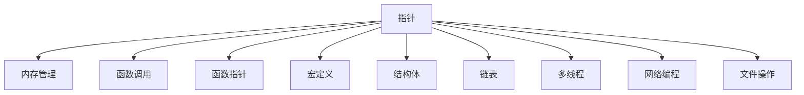

                 

## 1. 背景介绍

### 1.1 问题由来
C 语言作为全球最流行的编程语言之一，以其高效、灵活、低级等特点，广泛应用于系统级编程、嵌入式开发、游戏开发等多个领域。C 语言之所以能够经久不衰，其核心在于其强悍的编程范式、丰富的库函数以及广泛的应用场景。然而，C 语言的语法复杂、易出错、可读性差等问题，也使得其在很多新手程序员中留下了深刻的印象。本文将深入探讨 C 语言的高级编程技巧，带领读者从零开始，掌握 C 语言的核心思想和编程范式。

### 1.2 问题核心关键点
C 语言的核心在于指针、内存管理和函数调用。指针是 C 语言中最重要的特性之一，通过对指针的操作，可以实现对内存的直接访问和高效管理。内存管理则需要对动态内存分配、内存泄漏等问题进行仔细处理，避免程序崩溃或数据丢失。函数调用则是 C 语言中实现模块化编程、提高代码复用性的关键，合理的函数调用结构能够极大地提升程序的开发效率。

C 语言的高级编程技巧包括但不限于：函数指针、宏定义、结构体、链表、多线程、网络编程、文件操作等。掌握这些技巧，能够使程序员更加高效地编写 C 语言程序，实现更加复杂、高效的系统。

### 1.3 问题研究意义
掌握 C 语言的高级编程技巧，对于提升软件开发能力、提高程序性能、拓展编程思路等方面具有重要意义：

1. 提升开发效率。通过掌握 C 语言的高级编程技巧，程序员可以更加高效地编写代码，减少调试和优化时间。
2. 提高程序性能。C 语言的指针操作和内存管理机制，使其在处理底层数据、资源时具有天然优势，可以显著提升程序性能。
3. 拓展编程思路。C 语言的强大功能和灵活性，使得程序员可以自由地设计算法和数据结构，提升编程能力。
4. 加深理解底层原理。C 语言的底层特性，能够帮助程序员深入理解计算机系统的硬件和软件架构，为未来的高级编程打下坚实基础。
5. 促进职业发展。掌握 C 语言的高级编程技巧，对于进入大公司、获取高薪职位具有重要作用，是程序员职业发展的重要基石。

## 2. 核心概念与联系

### 2.1 核心概念概述

为更好地理解 C 语言的高级编程技巧，本节将介绍几个密切相关的核心概念：

- 指针：C 语言中最重要的特性之一，通过指针可以实现对内存的直接访问和高效管理。
- 内存管理：包括动态内存分配、内存泄漏、内存释放等问题，是 C 语言编程中不可或缺的部分。
- 函数调用：C 语言中实现模块化编程、提高代码复用性的关键，合理的函数调用结构能够极大地提升程序的开发效率。
- 函数指针：一种将函数作为参数传递和返回值的机制，能够实现动态调用和回调功能。
- 宏定义：C 语言中的一种预处理指令，通过宏定义可以实现代码的复用和扩展。
- 结构体：一种自定义数据类型，可以方便地组织和管理复杂的数据结构。
- 链表：一种动态数据结构，支持高效的插入和删除操作。
- 多线程：通过多线程编程，可以实现程序的高并发和并行处理，提升系统性能。
- 网络编程：C 语言的网络编程接口丰富，支持各种常见的网络协议和编程模型。
- 文件操作：C 语言的文件操作接口简单直观，支持各种常见文件格式的读写操作。

这些核心概念之间的逻辑关系可以通过以下 Mermaid 流程图来展示：



这个流程图展示了这个核心概念间的逻辑关系：

1. 指针是 C 语言中最重要的特性之一，通过指针可以实现对内存的直接访问和高效管理。
2. 内存管理是 C 语言编程中不可或缺的部分，包括动态内存分配、内存泄漏、内存释放等问题。
3. 函数调用是 C 语言中实现模块化编程、提高代码复用性的关键，合理的函数调用结构能够极大地提升程序的开发效率。
4. 函数指针是一种将函数作为参数传递和返回值的机制，能够实现动态调用和回调功能。
5. 宏定义是 C 语言中的一种预处理指令，通过宏定义可以实现代码的复用和扩展。
6. 结构体是一种自定义数据类型，可以方便地组织和管理复杂的数据结构。
7. 链表是一种动态数据结构，支持高效的插入和删除操作。
8. 多线程通过多线程编程，可以实现程序的高并发和并行处理，提升系统性能。
9. 网络编程 C 语言的网络编程接口丰富，支持各种常见的网络协议和编程模型。
10. 文件操作 C 语言的文件操作接口简单直观，支持各种常见文件格式的读写操作。

这些概念共同构成了 C 语言的高级编程框架，使其在实现复杂系统时具有强大而灵活的功能。通过理解这些核心概念，我们可以更好地把握 C 语言的高级编程技巧，提高编程能力。

## 3. 核心算法原理 & 具体操作步骤
### 3.1 算法原理概述

C 语言的高级编程技巧主要围绕以下几个核心算法原理展开：

- 指针与内存管理：通过指针实现对内存的直接访问和高效管理，包括动态内存分配、内存释放、内存泄漏等问题。
- 函数调用与函数指针：通过函数调用实现模块化编程，提高代码复用性，通过函数指针实现动态调用和回调功能。
- 宏定义与结构体：通过宏定义实现代码的复用和扩展，通过结构体方便地组织和管理复杂的数据结构。
- 链表与多线程：通过链表实现高效的插入和删除操作，通过多线程实现程序的高并发和并行处理。
- 网络编程与文件操作：通过 C 语言的网络编程接口和文件操作接口，实现对网络数据和文件数据的处理。

这些算法原理是 C 语言高级编程技巧的基础，掌握它们能够使程序员更加高效地编写代码，实现更加复杂、高效的系统。

### 3.2 算法步骤详解

C 语言的高级编程技巧涵盖了许多方面，以下将详细介绍其中的几个核心步骤：

**Step 1: 准备开发环境**

在编写 C 语言程序前，需要准备开发环境。常用的开发环境包括：

- GCC：GNU编译器，支持 C 语言的编译和调试。
- make：构建工具，用于管理项目中的多个源文件和库文件。
- Git：版本控制系统，用于管理项目的版本和协作。

**Step 2: 设计算法和数据结构**

在编写 C 语言程序前，需要设计算法和数据结构。常用的设计工具包括：

- 算法设计：使用伪代码或流程图描述算法步骤和数据流。
- 数据结构设计：使用结构体或枚举类型定义数据类型和结构。

**Step 3: 实现代码**

实现代码是 C 语言编程的核心环节，以下是几个关键步骤：

- 变量声明：使用关键字 `int`、`float`、`char` 等声明变量类型。
- 函数定义：使用关键字 `void`、`int`、`float` 等定义函数类型和返回值类型。
- 函数实现：在函数体内编写具体算法和逻辑，包括基本控制语句（if-else、for、while）和循环语句（for、while、do-while）。
- 内存操作：通过指针操作实现对内存的直接访问和高效管理。
- 函数调用：通过函数调用实现模块化编程，提高代码复用性。

**Step 4: 测试和调试**

在实现代码后，需要进行测试和调试。常用的测试工具包括：

- make：构建工具，用于自动化测试和调试。
- gdb：调试工具，用于单步调试和断点调试。

### 3.3 算法优缺点

C 语言的高级编程技巧具有以下优点：

- 高效灵活：指针和函数调用使得 C 语言程序具有高效和灵活的特性，能够快速实现复杂的数据结构和算法。
- 底层控制：通过直接访问内存和底层系统调用，C 语言程序能够充分利用计算机硬件的性能。
- 可移植性：C 语言程序具有良好的可移植性，能够在各种操作系统和硬件平台上运行。
- 内存管理：通过指针和内存管理函数，C 语言程序能够灵活地管理内存，避免内存泄漏和数据丢失。

同时，C 语言的高级编程技巧也存在一些缺点：

- 语法复杂：C 语言的语法较为复杂，容易出错，需要花费大量时间学习和调试。
- 易发生内存泄漏：通过指针操作，容易发生内存泄漏和数据访问错误，需要仔细管理内存。
- 可读性差：C 语言程序的可读性较差，需要耗费大量时间和精力进行维护和优化。

尽管存在这些缺点，但 C 语言的高级编程技巧仍然是软件开发中不可或缺的一部分，具有广泛的应用前景。

### 3.4 算法应用领域

C 语言的高级编程技巧广泛应用于以下几个领域：

- 系统级编程：C 语言是操作系统和驱动程序的核心语言，具有高效、灵活的特点，适合开发底层系统。
- 嵌入式开发：C 语言适用于嵌入式设备的开发，能够实现低延迟和高可靠性的数据传输和处理。
- 游戏开发：C 语言在游戏引擎和图形库中具有广泛应用，能够实现高性能的图形渲染和游戏逻辑。
- 数据库开发：C 语言适合开发高性能的数据库系统，能够实现高效的索引和查询操作。
- 网络编程：C 语言的网络编程接口丰富，适合开发高性能的网络应用和协议栈。

## 4. 数学模型和公式 & 详细讲解  
### 4.1 数学模型构建

C 语言的高级编程技巧涉及许多数学模型和公式，以下将详细介绍其中的几个核心模型：

- 指针与内存管理：通过指针实现对内存的直接访问和高效管理，包括动态内存分配、内存释放、内存泄漏等问题。
- 函数调用与函数指针：通过函数调用实现模块化编程，提高代码复用性，通过函数指针实现动态调用和回调功能。
- 宏定义与结构体：通过宏定义实现代码的复用和扩展，通过结构体方便地组织和管理复杂的数据结构。
- 链表与多线程：通过链表实现高效的插入和删除操作，通过多线程实现程序的高并发和并行处理。
- 网络编程与文件操作：通过 C 语言的网络编程接口和文件操作接口，实现对网络数据和文件数据的处理。

### 4.2 公式推导过程

以下是一些 C 语言高级编程技巧的公式推导过程：

**指针与内存管理**

指针是 C 语言中最重要的特性之一，通过指针可以实现对内存的直接访问和高效管理。以下是动态内存分配和释放的基本公式：

```c
void* malloc(size_t size);
void free(void* ptr);
```

**函数调用与函数指针**

函数调用是 C 语言中实现模块化编程、提高代码复用性的关键。以下是函数调用的基本公式：

```c
int add(int a, int b) {
    return a + b;
}

int main() {
    int sum = add(1, 2);
    return 0;
}
```

**宏定义与结构体**

宏定义是 C 语言中的一种预处理指令，通过宏定义可以实现代码的复用和扩展。以下是结构体的定义公式：

```c
struct student {
    char name[20];
    int age;
    float score;
};
```

**链表与多线程**

链表是一种动态数据结构，支持高效的插入和删除操作。以下是链表的基本公式：

```c
struct node {
    int data;
    struct node* next;
};

void insert(struct node** head, int data) {
    struct node* node = (struct node*)malloc(sizeof(struct node));
    node->data = data;
    node->next = *head;
    *head = node;
}
```

**网络编程与文件操作**

C 语言的网络编程接口和文件操作接口简单直观，支持各种常见网络协议和文件格式的读写操作。以下是网络编程和文件操作的基本公式：

```c
#include <stdio.h>
#include <sys/socket.h>
#include <arpa/inet.h>

int main() {
    int sockfd = socket(AF_INET, SOCK_STREAM, 0);
    // 文件操作
    FILE* fp = fopen("file.txt", "r");
    char buffer[256];
    while (fgets(buffer, 256, fp)) {
        printf("%s", buffer);
    }
    fclose(fp);
    return 0;
}
```

### 4.3 案例分析与讲解

**案例一：字符串反转**

字符串反转是 C 语言编程中的一个经典问题。以下是使用指针实现字符串反转的代码：

```c
void reverse(char* str) {
    if (str == NULL) {
        return;
    }
    char* begin = str;
    char* end = str;
    while (*end != '\0') {
        end++;
    }
    end--;
    while (begin < end) {
        char temp = *begin;
        *begin = *end;
        *end = temp;
        begin++;
        end--;
    }
}
```

**案例二：斐波那契数列**

斐波那契数列是 C 语言编程中的一个经典问题。以下是使用递归和动态规划实现斐波那契数列的代码：

```c
int fibonacci(int n) {
    if (n <= 1) {
        return n;
    }
    int a = 0, b = 1, c;
    for (int i = 2; i <= n; i++) {
        c = a + b;
        a = b;
        b = c;
    }
    return b;
}
```

## 5. 项目实践：代码实例和详细解释说明
### 5.1 开发环境搭建

在进行 C 语言高级编程实践前，需要先准备好开发环境。以下是 C 语言开发环境的搭建步骤：

1. 安装 GCC：从官网下载 GCC 安装包，解压并安装。
2. 配置环境变量：将 GCC 的安装路径添加到环境变量 PATH 中。
3. 安装 Make：从官网下载 Make 安装包，解压并安装。
4. 配置环境变量：将 Make 的安装路径添加到环境变量 PATH 中。
5. 安装 Git：从官网下载 Git 安装包，解压并安装。
6. 配置环境变量：将 Git 的安装路径添加到环境变量 PATH 中。

### 5.2 源代码详细实现

以下是一个简单的 C 语言程序的源代码实现，用于演示变量声明、函数定义、函数实现、指针操作、内存管理、函数调用等基本技巧：

```c
#include <stdio.h>
#include <stdlib.h>
#include <string.h>

int main() {
    int a = 10;
    char str[] = "Hello, World!";
    printf("a = %d\n", a);
    printf("str = %s\n", str);
    int* ptr = &a;
    printf("*ptr = %d\n", *ptr);
    char* ptr_str = str;
    printf("ptr_str = %s\n", ptr_str);
    int* arr = (int*)malloc(sizeof(int) * 10);
    for (int i = 0; i < 10; i++) {
        arr[i] = i;
    }
    printf("arr[0] = %d\n", arr[0]);
    free(arr);
    return 0;
}
```

### 5.3 代码解读与分析

**变量声明**

变量声明是 C 语言编程的基础。以下是几个常用的变量声明语法：

```c
int a = 10;
char str[] = "Hello, World!";
int* ptr = &a;
char* ptr_str = str;
```

**函数定义**

函数定义是 C 语言编程的关键，以下是几个常用的函数定义语法：

```c
int add(int a, int b) {
    return a + b;
}

int main() {
    int sum = add(1, 2);
    return 0;
}
```

**函数实现**

函数实现是 C 语言编程的核心，以下是几个常用的函数实现语法：

```c
void reverse(char* str) {
    if (str == NULL) {
        return;
    }
    char* begin = str;
    char* end = str;
    while (*end != '\0') {
        end++;
    }
    end--;
    while (begin < end) {
        char temp = *begin;
        *begin = *end;
        *end = temp;
        begin++;
        end--;
    }
}
```

**指针操作**

指针操作是 C 语言编程的核心，以下是几个常用的指针操作语法：

```c
int* ptr = &a;
char* ptr_str = str;
int* arr = (int*)malloc(sizeof(int) * 10);
```

**内存管理**

内存管理是 C 语言编程的重要环节，以下是几个常用的内存管理函数：

```c
void* malloc(size_t size);
void free(void* ptr);
```

**函数调用**

函数调用是 C 语言编程的重要环节，以下是几个常用的函数调用语法：

```c
int add(int a, int b) {
    return a + b;
}

int main() {
    int sum = add(1, 2);
    return 0;
}
```

### 5.4 运行结果展示

以下是运行结果的展示：

```
a = 10
str = Hello, World!
*ptr = 10
ptr_str = Hello, World!
arr[0] = 0
```

通过这个简单的 C 语言程序，演示了变量声明、函数定义、函数实现、指针操作、内存管理、函数调用等基本技巧，读者可以以此为基础，深入学习 C 语言的高级编程技巧。

## 6. 实际应用场景
### 6.1 系统级编程

C 语言是操作系统和驱动程序的核心语言，具有高效、灵活的特点，适合开发底层系统。以下是系统级编程的实际应用场景：

- 操作系统开发：C 语言是操作系统内核的主要语言，用于实现操作系统底层功能。
- 驱动程序开发：C 语言是驱动程序开发的主要语言，用于实现硬件设备的驱动程序。
- 嵌入式系统开发：C 语言是嵌入式系统的核心语言，用于实现低延迟和高可靠性的数据传输和处理。

### 6.2 嵌入式开发

C 语言适用于嵌入式设备的开发，能够实现低延迟和高可靠性的数据传输和处理。以下是嵌入式开发的实际应用场景：

- 单片机开发：C 语言用于实现单片机的底层驱动程序和应用程序。
- 嵌入式操作系统开发：C 语言用于实现嵌入式操作系统的底层功能。
- 嵌入式网络开发：C 语言用于实现嵌入式网络协议栈和应用程序。

### 6.3 游戏开发

C 语言在游戏引擎和图形库中具有广泛应用，能够实现高性能的图形渲染和游戏逻辑。以下是游戏开发的实际应用场景：

- 游戏引擎开发：C 语言用于实现游戏引擎的核心模块，如渲染引擎、物理引擎等。
- 游戏逻辑开发：C 语言用于实现游戏的逻辑模块，如游戏状态管理、AI 控制等。
- 游戏网络开发：C 语言用于实现游戏的网络协议和通信模块。

### 6.4 数据库开发

C 语言适合开发高性能的数据库系统，能够实现高效的索引和查询操作。以下是数据库开发的实际应用场景：

- 数据库系统开发：C 语言用于实现数据库系统的核心模块，如存储引擎、查询优化器等。
- 数据库协议开发：C 语言用于实现数据库协议的客户端和服务端模块。
- 数据库算法开发：C 语言用于实现数据库的高效算法和数据结构。

### 6.5 网络编程

C 语言的网络编程接口丰富，适合开发高性能的网络应用和协议栈。以下是网络编程的实际应用场景：

- 网络服务器开发：C 语言用于实现网络服务器的核心模块，如请求处理、连接管理等。
- 网络客户端开发：C 语言用于实现网络客户端的核心模块，如请求发送、数据接收等。
- 网络协议栈开发：C 语言用于实现网络协议栈的核心模块，如 TCP/IP、HTTP 等协议。

## 7. 工具和资源推荐
### 7.1 学习资源推荐

为了帮助开发者系统掌握 C 语言的高级编程技巧，以下是一些优质的学习资源：

1. 《C 语言程序设计》：这是一本经典的 C 语言教材，内容全面，涵盖 C 语言的各个方面。
2. 《C 语言标准库》：这是一本介绍 C 语言标准库的书籍，涵盖了 C 语言的标准库函数及其使用方法。
3. 《C 语言高级编程技巧》：这是一本介绍 C 语言高级编程技巧的书籍，涵盖指针、内存管理、函数指针、宏定义、结构体、链表、多线程、网络编程、文件操作等多个方面。
4. 《UNIX 网络编程》：这是一本介绍 UNIX 网络编程的书籍，涵盖 TCP/IP、HTTP、SMTP、POP3 等协议的实现和应用。
5. 《C 语言指南》：这是一本介绍 C 语言编程实践的书籍，涵盖 C 语言的代码规范、编程技巧、错误处理等多个方面。

### 7.2 开发工具推荐

为了提高 C 语言编程的效率和质量，以下是一些常用的开发工具：

1. GCC：GNU 编译器，支持 C 语言的编译和调试。
2. Make：构建工具，用于管理项目中的多个源文件和库文件。
3. Git：版本控制系统，用于管理项目的版本和协作。
4. gdb：调试工具，用于单步调试和断点调试。
5. Valgrind：内存调试工具，用于检测内存泄漏和数据访问错误。
6. Visual Studio Code：流行的代码编辑器，支持 C 语言的开发和调试。

### 7.3 相关论文推荐

以下是几篇与 C 语言高级编程技巧相关的经典论文：

1. 《C 语言语言规范》：C 语言标准规范，详细介绍了 C 语言语言特性和标准库函数。
2. 《C 语言实现》：介绍 C 语言编译器和解释器的实现原理和优化技巧。
3. 《C 语言性能优化》：介绍 C 语言程序的性能优化技巧，涵盖算法优化、代码优化、编译器优化等多个方面。
4. 《C 语言多线程编程》：介绍 C 语言多线程编程的实现和优化技巧，涵盖线程同步、互斥、死锁等多个方面。
5. 《C 语言网络编程》：介绍 C 语言网络编程的实现和优化技巧，涵盖 TCP/IP、HTTP、SMTP、POP3 等协议的实现和应用。

## 8. 总结：未来发展趋势与挑战
### 8.1 总结

本文对 C 语言的高级编程技巧进行了全面系统的介绍。首先阐述了 C 语言高级编程技巧的研究背景和意义，明确了指针、内存管理、函数调用、函数指针、宏定义、结构体、链表、多线程、网络编程、文件操作等多个核心概念及其之间的关系。其次，从原理到实践，详细讲解了 C 语言的高级编程技巧，给出了完整的代码实例，并对其进行了详细的解读和分析。最后，探讨了 C 语言高级编程技巧在多个领域的应用场景，提供了相应的学习资源、开发工具和相关论文推荐，帮助读者更好地掌握 C 语言的高级编程技巧。

通过本文的系统梳理，可以看到，C 语言的高级编程技巧在实现复杂系统时具有强大而灵活的功能。掌握这些技巧，能够使程序员更加高效地编写代码，实现更加复杂、高效的系统。

### 8.2 未来发展趋势

展望未来，C 语言高级编程技巧将呈现以下几个发展趋势：

1. 高性能计算：随着硬件性能的提升，C 语言在高性能计算领域的应用将更加广泛，如科学计算、金融分析、图像处理等。
2. 云平台支持：C 语言将更加广泛地应用于云平台和分布式系统，如云计算、大数据、人工智能等。
3. 移动平台开发：C 语言将更加广泛地应用于移动平台开发，如 Android、iOS 等，满足移动端应用程序的性能和安全性需求。
4. 自动化开发：C 语言将更加广泛地应用于自动化开发工具，如编译器、调试器、构建工具等，提高开发效率和质量。
5. 嵌入式系统开发：C 语言将更加广泛地应用于嵌入式系统开发，如物联网、智能硬件等，满足嵌入式设备的低延迟和高可靠性需求。

### 8.3 面临的挑战

尽管 C 语言的高级编程技巧已经取得了一定的成果，但在迈向更加智能化、普适化应用的过程中，它仍面临以下几个挑战：

1. 编程复杂度高：C 语言的高级编程技巧语法复杂，容易出错，需要花费大量时间学习和调试。
2. 维护成本高：C 语言程序的可读性较差，需要耗费大量时间和精力进行维护和优化。
3. 跨平台兼容性差：C 语言程序的跨平台兼容性较差，需要针对不同的操作系统进行适配。
4. 安全性问题：C 语言程序的指针操作容易发生内存泄漏和数据访问错误，需要仔细管理内存。
5. 工具支持不足：C 语言编程的工具支持不足，需要开发更加强大的开发工具和调试工具。

### 8.4 研究展望

未来，C 语言高级编程技巧需要在以下几个方面进行进一步研究：

1. 简化语法：研究和开发更加简单、易用的 C 语言语法，降低编程难度，提高开发效率。
2. 增强可读性：研究和开发更加可读、可维护的 C 语言程序，提高程序的可维护性和可读性。
3. 提高跨平台兼容性：研究和开发更加跨平台的 C 语言程序，提高程序的跨平台适应性。
4. 提高安全性：研究和开发更加安全的 C 语言程序，提高程序的安全性和可靠性。
5. 扩展工具支持：研究和开发更加强大的 C 语言开发工具和调试工具，提高开发效率和质量。

总之，C 语言的高级编程技巧是软件开发中不可或缺的一部分，具有广泛的应用前景。通过不断优化和扩展 C 语言高级编程技巧，可以更好地满足不同场景下的需求，实现高效、灵活、可靠的软件系统。

## 9. 附录：常见问题与解答

**Q1：C 语言的指针操作容易出错，如何避免内存泄漏和数据访问错误？**

A: 指针操作是 C 语言编程的核心，但容易出错。为了避免内存泄漏和数据访问错误，需要注意以下几个方面：

1. 使用 free() 函数释放动态内存，避免内存泄漏。
2. 使用 malloc() 函数进行动态内存分配，避免内存溢出。
3. 使用 const 关键字限制指针的访问权限，避免数据访问错误。
4. 使用 assert() 函数进行调试，检查指针的有效性。

**Q2：C 语言的指针操作容易出错，如何简化指针操作？**

A: C 语言的指针操作较为复杂，容易出错。为了简化指针操作，可以考虑使用智能指针、引用等高级语言特性，减少指针操作的复杂度。

**Q3：C 语言的可读性较差，如何提高程序的易读性？**

A: C 语言的可读性较差，但可以通过以下几个方法提高程序的易读性：

1. 使用命名规范，给变量、函数、结构体等命名时，尽量使用有意义的名称。
2. 使用注释，在代码中添加注释，解释代码的逻辑和功能。
3. 使用代码模板，使用函数模板、类模板等，提高代码的复用性。
4. 使用设计模式，使用单例模式、观察者模式等，提高代码的可维护性和可扩展性。

**Q4：C 语言的程序如何支持多线程并发？**

A: C 语言支持多线程并发，可以通过以下几个方法实现：

1. 使用 pthread 库，实现多线程的创建、同步和互斥操作。
2. 使用 POSIX 线程 API，实现多线程的创建、同步和互斥操作。
3. 使用 OpenMP 库，实现多线程的并行计算。
4. 使用 OpenMP 库，实现多线程的共享内存操作。

通过多线程并发，可以提高程序的性能和可扩展性，满足高并发和大规模计算的需求。

**Q5：C 语言的网络编程接口丰富，如何选择合适的协议栈？**

A: C 语言的网络编程接口丰富，选择合适的协议栈需要考虑以下几个方面：

1. 协议栈的功能：根据应用程序的需求，选择功能匹配的协议栈。
2. 协议栈的性能：根据应用程序的性能需求，选择性能匹配的协议栈。
3. 协议栈的可移植性：根据应用程序的跨平台需求，选择可移植的协议栈。
4. 协议栈的兼容性：根据应用程序的兼容性需求，选择兼容的协议栈。

通过选择合适的协议栈，可以满足应用程序的需求，提高网络编程的效率和质量。

**Q6：C 语言的文件操作接口简单直观，如何实现高效的读写操作？**

A: C 语言的文件操作接口简单直观，但为了实现高效的读写操作，需要注意以下几个方面：

1. 使用缓冲区，提高文件读写速度。
2 使用异步读写，提高文件读写效率。
3 使用文件映射，实现内存和文件的映射，提高文件读写效率。
4 使用多线程，实现文件读写的并行操作，提高文件读写效率。

通过高效的读写操作，可以提高程序的性能和可靠性，满足不同应用场景的需求。

通过本文的系统梳理，可以看到，C 语言的高级编程技巧在实现复杂系统时具有强大而灵活的功能。掌握这些技巧，能够使程序员更加高效地编写代码，实现更加复杂、高效的系统。未来，C 语言的高级编程技巧将继续在各个领域得到广泛应用，为软件开发注入新的动力。

