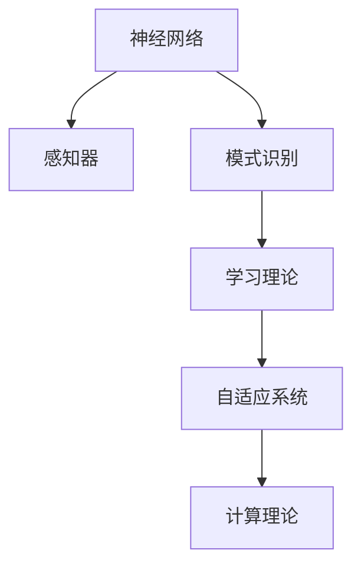

                 

# 麦卡锡与明斯基的研究计划

## 1. 背景介绍

### 1.1 问题由来
1950年，约翰·麦卡锡（John McCarthy）和马文·明斯基（Marvin Minsky）发表了一篇名为《Perceptrons》的论文，标志性地提出了神经网络概念，并在人工智能研究上奠定了基石。他们在文中描绘了一幅未来人工智能的美好图景，即通过模拟生物神经系统，实现模式识别、分类、预测等智能功能。然而，由于当时计算机硬件的限制，以及缺乏相关理论和算法的支持，这一愿景并未得到广泛实现。

随着时间的推移，麦卡锡和明斯基并没有放弃对人工智能的探索，反而不断深化对大脑神经网络的研究，并逐步提出了一系列重要的研究计划。他们的这些研究计划不仅为当时的AI研究指明了方向，也为后世的AI发展奠定了基础。

## 2. 核心概念与联系

### 2.1 核心概念概述

为更好地理解麦卡锡与明斯基的研究计划，本节将介绍几个密切相关的核心概念：

- 神经网络（Neural Networks）：一种模拟生物神经系统，用于模式识别、分类、预测等智能任务的人工智能模型。
- 感知器（Perceptron）：最简单的神经网络模型，具有单个输入层、一个输出层，以及若干个连接层的神经元。
- 模式识别（Pattern Recognition）：通过学习数据集中的模式，对新数据进行分类或预测的过程。
- 学习理论（Learning Theory）：研究如何通过数据或经验进行模型训练，提高模型预测精度的理论。
- 自适应系统（Adaptive Systems）：能够根据环境变化自动调整自身行为的智能系统。
- 计算理论（Computational Theory）：研究如何通过计算方式实现智能行为的理论。

这些核心概念之间的逻辑关系可以通过以下Mermaid流程图来展示：



这个流程图展示了大语言模型的核心概念及其之间的关系：

1. 神经网络作为模型基础，由感知器等组件构成。
2. 模式识别利用神经网络对数据进行分类和预测。
3. 学习理论研究如何高效训练神经网络。
4. 自适应系统使神经网络能够适应环境变化。
5. 计算理论为神经网络的计算方式提供理论支持。

这些概念共同构成了神经网络模型的研究框架，使其能够在各种场景下发挥强大的智能功能。通过理解这些核心概念，我们可以更好地把握神经网络的研究方向和应用场景。

## 3. 核心算法原理 & 具体操作步骤
### 3.1 算法原理概述

麦卡锡与明斯基的研究计划主要围绕神经网络的算法原理和操作步骤进行。其核心思想是：通过模仿生物神经系统的工作机制，构建一个由多个神经元（即节点）和连接构成的计算网络，并通过训练网络参数，使其具备识别和预测数据的能力。

形式化地，假设神经网络 $N$ 包括 $I$ 个输入节点、$H$ 个隐藏节点、$O$ 个输出节点，网络参数包括 $W_{ih}$（输入层与隐藏层连接权重）、$W_{ho}$（隐藏层与输出层连接权重）、$b_i$（输入层偏置）、$b_h$（隐藏层偏置）、$b_o$（输出层偏置）。训练目标是最小化损失函数 $\mathcal{L}$，使网络输出与实际标签之间的误差最小。

神经网络的训练过程包括以下几个关键步骤：

1. 前向传播：输入样本 $x$ 通过网络，计算得到输出 $y$。
2. 损失计算：计算输出 $y$ 与实际标签 $y^*$ 之间的误差。
3. 反向传播：通过链式法则，计算输出误差对网络参数的梯度。
4. 参数更新：使用梯度下降等优化算法，更新网络参数，使得损失函数最小化。

### 3.2 算法步骤详解

麦卡锡与明斯基的研究计划详细阐述了上述训练过程的具体步骤。下面以神经网络的训练为例，进一步解释各步骤的实现细节：

**Step 1: 准备数据集**
- 收集大量标记数据集，分为训练集和测试集。
- 将数据集标准化处理，以适应神经网络模型。

**Step 2: 初始化网络参数**
- 随机初始化 $W_{ih}$、$W_{ho}$、$b_i$、$b_h$、$b_o$ 等参数。
- 设定学习率 $\eta$，选择合适的优化算法（如SGD、Adam等）。

**Step 3: 前向传播**
- 输入样本 $x$ 通过网络，计算输出 $y$。计算过程如下：
  $$
  y = \sigma(W_{ho} \sigma(W_{ih} x + b_i) + b_h) + b_o
  $$
  其中 $\sigma$ 为激活函数，通常使用ReLU或Sigmoid。

**Step 4: 损失计算**
- 计算输出 $y$ 与实际标签 $y^*$ 之间的误差，通常使用交叉熵损失函数。
  $$
  \mathcal{L} = -\sum_i y_i^* \log(y_i)
  $$
- 计算损失函数对网络参数的梯度。

**Step 5: 反向传播**
- 通过链式法则，计算输出误差对 $W_{ih}$、$W_{ho}$、$b_i$、$b_h$、$b_o$ 的梯度。
- 更新网络参数，使得损失函数 $\mathcal{L}$ 最小化。
- 重复以上步骤，直到收敛或达到预设迭代次数。

### 3.3 算法优缺点

麦卡锡与明斯基的研究计划中的神经网络算法，具有以下优点：
1. 模型简单：神经网络结构简单，易于理解和实现。
2. 泛化能力：神经网络能够通过大量数据进行训练，泛化能力较强。
3. 可解释性：神经网络结构直观，解释性较好。
4. 适应性强：神经网络能够适应各种复杂的数据分布。

同时，该算法也存在一些局限性：
1. 参数量大：神经网络需要大量的参数进行训练，计算复杂度较高。
2. 训练难度高：神经网络训练过程容易陷入局部最优，难以保证全局最优。
3. 数据依赖强：神经网络对数据的依赖性较强，训练数据不足时，性能难以保证。
4. 脆弱性：神经网络对输入噪声和扰动较为敏感，鲁棒性较差。

尽管存在这些局限性，但就目前而言，神经网络仍是最主流的人工智能模型之一。未来相关研究的重点在于如何进一步降低神经网络的计算复杂度，提高训练效率，同时增强其鲁棒性和泛化能力。

### 3.4 算法应用领域

神经网络算法在许多领域中得到了广泛的应用，例如：

- 图像识别：如手写数字识别、图像分类等。神经网络能够学习图像中的局部特征，进行模式识别。
- 自然语言处理：如机器翻译、文本分类等。神经网络能够学习语言中的语法和语义结构，进行语义理解。
- 语音识别：如语音转文本、语音指令识别等。神经网络能够处理语音信号，进行声音识别和转换。
- 推荐系统：如电商推荐、音乐推荐等。神经网络能够学习用户行为，进行个性化推荐。
- 游戏AI：如围棋、星际争霸等。神经网络能够学习游戏规则，进行智能决策和博弈。
- 自动驾驶：如目标检测、路径规划等。神经网络能够处理复杂环境，进行智能驾驶。

除了上述这些经典应用外，神经网络算法还被创新性地应用到更多场景中，如生成对抗网络（GANs）、强化学习（RL）等，为人工智能技术带来了全新的突破。随着神经网络算法的不断进步，相信其将在更多领域大放异彩。

## 4. 数学模型和公式 & 详细讲解 & 举例说明

### 4.1 数学模型构建

在麦卡锡与明斯基的研究计划中，神经网络的数学模型主要由以下几个部分构成：

1. 输入层：包含 $I$ 个神经元，表示输入样本 $x$。
2. 隐藏层：包含 $H$ 个神经元，对输入进行特征提取和处理。
3. 输出层：包含 $O$ 个神经元，对隐藏层输出进行分类或预测。

神经网络的参数包括：

- $W_{ih}$：输入层与隐藏层的连接权重，大小为 $I \times H$。
- $W_{ho}$：隐藏层与输出层的连接权重，大小为 $H \times O$。
- $b_i$：输入层偏置，大小为 $I$。
- $b_h$：隐藏层偏置，大小为 $H$。
- $b_o$：输出层偏置，大小为 $O$。

神经网络的输入为 $x$，隐藏层激活函数为 $\sigma$，输出函数为 $g$，则前向传播过程可以表示为：

$$
z_h = W_{ih} x + b_i
$$
$$
h = \sigma(z_h)
$$
$$
z_o = W_{ho} h + b_h
$$
$$
y = g(z_o)
$$

其中，$z_h$ 为隐藏层输入，$h$ 为隐藏层输出，$z_o$ 为输出层输入，$y$ 为输出结果。

神经网络的损失函数通常为交叉熵损失：

$$
\mathcal{L} = -\sum_i y_i^* \log(y_i)
$$

神经网络的优化目标是最小化损失函数 $\mathcal{L}$，使得 $y$ 逼近 $y^*$。

### 4.2 公式推导过程

以下我们以二分类任务为例，推导交叉熵损失函数及其梯度的计算公式。

假设神经网络 $N$ 的输出为 $y \in [0,1]$，表示样本属于正类的概率。真实标签 $y^* \in \{0,1\}$。则二分类交叉熵损失函数定义为：

$$
\mathcal{L} = -(y^* \log y + (1-y^*) \log(1-y))
$$

神经网络的输出 $y$ 可由上述前向传播过程得到，将其代入损失函数公式中，得：

$$
\mathcal{L} = -(y^* \log y + (1-y^*) \log(1-y))
$$

神经网络的目标是最小化该损失函数。根据链式法则，损失函数对网络参数的梯度为：

$$
\frac{\partial \mathcal{L}}{\partial W_{ih}} = -\frac{\partial y}{\partial h} \frac{\partial h}{\partial z_h} \frac{\partial z_h}{\partial W_{ih}}
$$
$$
\frac{\partial \mathcal{L}}{\partial W_{ho}} = -\frac{\partial y}{\partial z_o} \frac{\partial z_o}{\partial h} \frac{\partial h}{\partial z_h} \frac{\partial z_h}{\partial W_{ih}} \frac{\partial z_h}{\partial W_{ho}}
$$
$$
\frac{\partial \mathcal{L}}{\partial b_i} = -\frac{\partial y}{\partial h} \frac{\partial h}{\partial z_h}
$$
$$
\frac{\partial \mathcal{L}}{\partial b_h} = -\frac{\partial y}{\partial z_o} \frac{\partial z_o}{\partial h} \frac{\partial h}{\partial z_h}
$$
$$
\frac{\partial \mathcal{L}}{\partial b_o} = -\frac{\partial y}{\partial z_o} \frac{\partial g(z_o)}{\partial z_o}
$$

其中 $g$ 为输出层激活函数，通常使用Softmax函数。

在得到损失函数的梯度后，即可带入参数更新公式，完成模型的迭代优化。重复上述过程直至收敛，最终得到适应下游任务的最优模型参数。

## 5. 项目实践：代码实例和详细解释说明

### 5.1 开发环境搭建

在进行神经网络模型训练前，我们需要准备好开发环境。以下是使用Python进行TensorFlow开发的环境配置流程：

1. 安装Anaconda：从官网下载并安装Anaconda，用于创建独立的Python环境。

2. 创建并激活虚拟环境：
```bash
conda create -n tf-env python=3.8 
conda activate tf-env
```

3. 安装TensorFlow：根据CUDA版本，从官网获取对应的安装命令。例如：
```bash
conda install tensorflow -c conda-forge -c pytorch
```

4. 安装各类工具包：
```bash
pip install numpy pandas scikit-learn matplotlib tqdm jupyter notebook ipython
```

完成上述步骤后，即可在`tf-env`环境中开始神经网络模型的训练和微调。

### 5.2 源代码详细实现

下面我们以二分类任务为例，给出使用TensorFlow实现神经网络模型的Python代码实现。

首先，定义神经网络的模型结构：

```python
import tensorflow as tf
from tensorflow.keras import layers, models

def build_model(input_dim):
    input_layer = layers.Input(shape=(input_dim,))
    hidden_layer = layers.Dense(64, activation='relu')(input_layer)
    output_layer = layers.Dense(1, activation='sigmoid')(hidden_layer)
    model = models.Model(inputs=input_layer, outputs=output_layer)
    return model

model = build_model(input_dim=784)
```

然后，定义训练和评估函数：

```python
from tensorflow.keras import optimizers

# 加载训练集和测试集数据
(x_train, y_train), (x_test, y_test) = tf.keras.datasets.mnist.load_data()

# 将数据标准化处理
x_train = x_train / 255.0
x_test = x_test / 255.0

# 定义优化器
optimizer = optimizers.Adam(learning_rate=0.001)

# 定义训练函数
def train(model, x_train, y_train, epochs=10):
    model.compile(optimizer=optimizer, loss='binary_crossentropy', metrics=['accuracy'])
    model.fit(x_train, y_train, epochs=epochs, validation_data=(x_test, y_test))

# 定义评估函数
def evaluate(model, x_test, y_test):
    loss, accuracy = model.evaluate(x_test, y_test)
    print('Test loss:', loss)
    print('Test accuracy:', accuracy)

# 训练模型
train(model, x_train, y_train)

# 评估模型
evaluate(model, x_test, y_test)
```

以上就是使用TensorFlow实现神经网络模型的完整代码实现。可以看到，TensorFlow的高级API使得模型的搭建和训练变得非常简单高效。

### 5.3 代码解读与分析

让我们再详细解读一下关键代码的实现细节：

**build_model函数**：
- 定义输入层、隐藏层和输出层。
- 使用Dense层作为隐藏层，激活函数为ReLU。
- 使用Dense层作为输出层，激活函数为Sigmoid，适用于二分类任务。

**train函数**：
- 使用Adam优化器进行模型优化。
- 损失函数为交叉熵，适用于二分类任务。
- 在每个epoch结束后，在测试集上进行验证，输出训练和验证的准确率。

**evaluate函数**：
- 在测试集上评估模型性能。
- 输出测试集上的损失和准确率。

可以看到，TensorFlow提供了强大的深度学习框架，使得神经网络模型的训练和评估变得简单便捷。开发者可以将更多精力放在数据预处理、模型改进等高层逻辑上，而不必过多关注底层实现细节。

当然，工业级的系统实现还需考虑更多因素，如模型的保存和部署、超参数的自动搜索、更灵活的网络结构设计等。但核心的神经网络训练流程基本与此类似。

## 6. 实际应用场景
### 6.1 图像识别

神经网络在图像识别领域得到了广泛的应用。传统图像识别方法通常需要大量手工特征工程，难以处理复杂的图像数据。而神经网络能够自动学习图像中的局部特征，通过多层网络结构进行特征提取和分类。

在实际应用中，可以使用卷积神经网络（Convolutional Neural Network, CNN）对图像进行训练，识别出其中的物体、场景、颜色等信息。CNN能够自动学习图像中的纹理、边缘、角点等局部特征，并对这些特征进行组合，从而实现图像分类、目标检测等任务。

### 6.2 自然语言处理

神经网络在自然语言处理（Natural Language Processing, NLP）领域也得到了广泛的应用。传统NLP方法通常需要手工设计特征工程，难以处理复杂的语义信息。而神经网络能够自动学习语言中的语法和语义结构，通过多层网络结构进行特征提取和分类。

在实际应用中，可以使用循环神经网络（Recurrent Neural Network, RNN）或Transformer对文本进行训练，识别出其中的词义、句法、情感等信息。RNN和Transformer能够自动学习语言中的上下文信息，并对这些信息进行组合，从而实现文本分类、情感分析、机器翻译等任务。

### 6.3 语音识别

神经网络在语音识别领域也得到了广泛的应用。传统语音识别方法通常需要手工设计特征工程，难以处理复杂的语音信号。而神经网络能够自动学习语音信号中的特征，通过多层网络结构进行分类。

在实际应用中，可以使用卷积神经网络（CNN）或循环神经网络（RNN）对语音信号进行训练，识别出其中的语音命令、语种、情感等信息。CNN和RNN能够自动学习语音信号中的纹理、频率、时序等特征，并对这些特征进行组合，从而实现语音识别、语音合成等任务。

### 6.4 未来应用展望

随着神经网络算法的不断进步，其在各个领域的应用将越来越广泛。未来，神经网络将在以下方面带来更多突破：

1. 多模态融合：神经网络能够处理图像、语音、文本等多模态数据，实现跨模态的智能融合。
2. 迁移学习：神经网络能够利用预训练模型进行迁移学习，提升下游任务的表现。
3. 自适应系统：神经网络能够根据环境变化自动调整自身行为，实现自适应系统。
4. 强化学习：神经网络能够通过强化学习算法进行智能决策，实现自动驾驶、机器人控制等复杂任务。
5. 可解释性：神经网络能够提供可解释的输出，提升算法的透明度和可信度。
6. 跨领域应用：神经网络能够应用于医学、金融、法律等多个领域，提升各行业的智能化水平。

总之，神经网络算法的不断进步，将进一步拓展人工智能的应用边界，带来更多的智能化突破。

## 7. 工具和资源推荐
### 7.1 学习资源推荐

为了帮助开发者系统掌握神经网络算法的理论基础和实践技巧，这里推荐一些优质的学习资源：

1. 《深度学习》（Ian Goodfellow等著）：全面介绍了深度学习的基础理论和常用模型，适合初学者入门。
2. 《神经网络与深度学习》（Michael Nielsen等著）：详细讲解了神经网络的结构和算法，适合深度学习的进阶学习。
3. 《Python深度学习》（Francois Chollet著）：介绍了如何使用TensorFlow和Keras实现深度学习模型，适合动手实践。
4. 《TensorFlow官方文档》：提供了全面的TensorFlow教程和API文档，适合深入学习。
5. 《PyTorch官方文档》：提供了全面的PyTorch教程和API文档，适合动手实践。

通过对这些资源的学习实践，相信你一定能够快速掌握神经网络算法的精髓，并用于解决实际的智能问题。
###  7.2 开发工具推荐

高效的开发离不开优秀的工具支持。以下是几款用于神经网络开发和训练的常用工具：

1. TensorFlow：由Google主导开发的开源深度学习框架，生产部署方便，适合大规模工程应用。
2. PyTorch：由Facebook主导开发的深度学习框架，灵活性强，适合研究创新。
3. Keras：由Francois Chollet主导的开源深度学习框架，简单易用，适合快速原型开发。
4. MXNet：由Amazon主导开发的深度学习框架，支持多种硬件，适合跨平台应用。
5. Caffe：由Berkeley Vision and Learning Center主导的深度学习框架，适用于计算机视觉任务。

合理利用这些工具，可以显著提升神经网络算法的开发效率，加快创新迭代的步伐。

### 7.3 相关论文推荐

神经网络算法的不断发展，源于学界的持续研究。以下是几篇奠基性的相关论文，推荐阅读：

1. "A Framework for Comparing Strategies of Connectionist Learning"（Rumelhart等，1986）：提出了BP算法，为神经网络训练提供了理论基础。
2. "Deep Learning"（Ian Goodfellow等，2016）：全面介绍了深度学习的基础理论和常用模型，是当前深度学习领域的经典之作。
3. "Convolutional Neural Networks for Visual Recognition"（LeCun等，1989）：提出了卷积神经网络，为图像识别任务提供了强大工具。
4. "Recurrent Neural Network Architectures for Large Vocabulary Speech Recognition"（Hinton等，1995）：提出了RNN模型，为语音识别任务提供了强大工具。
5. "Attention is All You Need"（Vaswani等，2017）：提出了Transformer模型，为自然语言处理任务提供了强大工具。

这些论文代表了大语言模型微调技术的发展脉络。通过学习这些前沿成果，可以帮助研究者把握学科前进方向，激发更多的创新灵感。

## 8. 总结：未来发展趋势与挑战

### 8.1 总结

本文对麦卡锡与明斯基的研究计划进行了全面系统的介绍。首先阐述了神经网络算法的研究背景和意义，明确了神经网络在人工智能研究中的重要地位。其次，从原理到实践，详细讲解了神经网络的数学模型和训练步骤，给出了神经网络模型训练的完整代码实例。同时，本文还广泛探讨了神经网络算法在图像识别、自然语言处理、语音识别等多个领域的应用前景，展示了神经网络算法的巨大潜力。此外，本文精选了神经网络算法的各类学习资源，力求为读者提供全方位的技术指引。

通过本文的系统梳理，可以看到，神经网络算法作为人工智能的核心技术之一，已经广泛应用于多个领域，极大地推动了AI技术的发展。未来，随着神经网络算法的不断进步，其在更多领域的应用将更加广泛，为人工智能技术带来更多的突破和创新。

### 8.2 未来发展趋势

展望未来，神经网络算法将呈现以下几个发展趋势：

1. 模型规模持续增大。随着算力成本的下降和数据规模的扩张，神经网络模型的参数量还将持续增长。超大规模神经网络蕴含的丰富知识，有望支撑更加复杂多变的智能任务。
2. 模型结构日趋复杂。未来的神经网络模型将具备更多的层数和更大的参数量，能够处理更加复杂和抽象的数据。
3. 模型性能不断提升。随着更多的数据和更好的训练算法，神经网络模型的性能将不断提升，实现更加精准的预测和分类。
4. 迁移学习能力增强。未来的神经网络模型将具备更强的迁移学习能力，能够在不同领域和任务之间进行知识迁移和共享。
5. 实时计算能力提高。未来的神经网络模型将具备更强的实时计算能力，能够实现更高效和实时的智能决策。

以上趋势凸显了神经网络算法的广阔前景。这些方向的探索发展，必将进一步提升人工智能系统的性能和应用范围，为AI技术的未来发展提供强大动力。

### 8.3 面临的挑战

尽管神经网络算法已经取得了瞩目成就，但在迈向更加智能化、普适化应用的过程中，仍面临着诸多挑战：

1. 数据依赖强。神经网络模型对数据的依赖性较强，训练数据不足时，性能难以保证。如何构建高质量的数据集，是未来研究的重要方向。
2. 计算资源消耗大。神经网络模型通常需要大量计算资源进行训练和推理，计算成本较高。如何提高神经网络的计算效率，是未来研究的重要课题。
3. 模型泛化能力不足。神经网络模型往往在训练集和测试集之间存在泛化误差，难以处理复杂的现实场景。如何提高模型的泛化能力，是未来研究的重要方向。
4. 模型可解释性差。神经网络模型通常被认为是"黑盒"系统，难以解释其内部工作机制和决策逻辑。如何提升模型的可解释性，是未来研究的重要方向。
5. 模型安全风险高。神经网络模型容易受到攻击，如对抗样本攻击、数据注入攻击等，模型安全风险较高。如何提高模型的安全性，是未来研究的重要方向。

正视神经网络算法面临的这些挑战，积极应对并寻求突破，将是其走向成熟的必由之路。相信随着学界和产业界的共同努力，这些挑战终将一一被克服，神经网络算法必将在构建智能系统的未来发展中扮演越来越重要的角色。

### 8.4 研究展望

面对神经网络算法所面临的种种挑战，未来的研究需要在以下几个方面寻求新的突破：

1. 探索无监督和半监督学习算法。摆脱对大规模标注数据的依赖，利用自监督学习、主动学习等无监督和半监督范式，最大限度利用非结构化数据，实现更加灵活高效的神经网络模型。
2. 研究高效压缩和量化技术。开发更高效的模型压缩和量化方法，在保持模型性能的前提下，减小模型参数和计算复杂度。
3. 引入因果推断和对比学习思想。通过引入因果推断和对比学习方法，增强神经网络模型的泛化能力和鲁棒性。
4. 结合符号知识库。将符号化的先验知识，如知识图谱、逻辑规则等，与神经网络模型进行巧妙融合，增强模型的知识表示和推理能力。
5. 融合多种智能技术。将神经网络模型与强化学习、因果推理、多模态融合等技术进行协同优化，提升智能系统的综合能力。

这些研究方向的探索，必将引领神经网络算法迈向更高的台阶，为构建安全、可靠、可解释、可控的智能系统铺平道路。面向未来，神经网络算法还需要与其他人工智能技术进行更深入的融合，多路径协同发力，共同推动人工智能技术的发展和应用。只有勇于创新、敢于突破，才能不断拓展神经网络算法的边界，让智能技术更好地造福人类社会。

## 9. 附录：常见问题与解答

**Q1：神经网络算法是否适用于所有智能任务？**

A: 神经网络算法在许多智能任务上都能取得不错的效果，特别是对于数据量较大的任务。但对于一些特定领域的任务，如医学、法律等，仅仅依靠通用数据集进行训练，可能难以很好地适应。此时需要在特定领域数据集上进行微调，才能获得理想效果。此外，对于一些需要高效实时响应的任务，如自动驾驶、机器人控制等，神经网络算法也需要针对性的改进优化。

**Q2：神经网络算法如何选择合适的超参数？**

A: 神经网络算法通常需要选择合适的学习率、批大小、层数、节点数等超参数，以提升模型性能。一般建议从默认值开始调参，逐步减小学习率，直至收敛。可以使用网格搜索、随机搜索等方法搜索最优超参数组合。需要注意的是，不同的优化器(如Adam、SGD等)以及不同的损失函数，可能需要设置不同的超参数阈值。

**Q3：神经网络算法在落地部署时需要注意哪些问题？**

A: 将神经网络算法转化为实际应用，还需要考虑以下因素：
1. 模型裁剪：去除不必要的层和参数，减小模型尺寸，加快推理速度。
2. 量化加速：将浮点模型转为定点模型，压缩存储空间，提高计算效率。
3. 服务化封装：将模型封装为标准化服务接口，便于集成调用。
4. 弹性伸缩：根据请求流量动态调整资源配置，平衡服务质量和成本。
5. 监控告警：实时采集系统指标，设置异常告警阈值，确保服务稳定性。
6. 安全防护：采用访问鉴权、数据脱敏等措施，保障数据和模型安全。

神经网络算法为人工智能技术带来了巨大的突破，但如何将强大的性能转化为稳定、高效、安全的业务价值，还需要工程实践的不断打磨。唯有从数据、算法、工程、业务等多个维度协同发力，才能真正实现人工智能技术在各个领域的规模化落地。总之，神经网络算法需要开发者根据具体任务，不断迭代和优化模型、数据和算法，方能得到理想的效果。

---

作者：禅与计算机程序设计艺术 / Zen and the Art of Computer Programming

