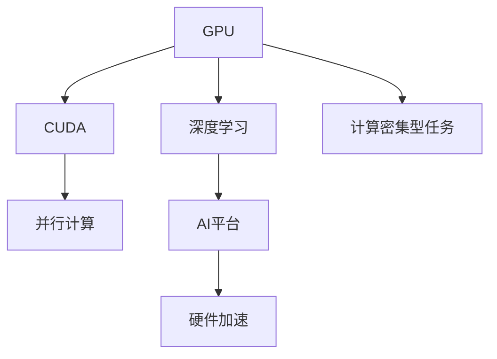

                 

# 黄仁勋与NVIDIA的GPU革命

## 1. 背景介绍

### 1.1 问题由来
黄仁勋是NVIDIA的首席执行官，自1993年公司成立之初，他一直带领NVIDIA在图形处理器（GPU）领域不断创新，推动了图形处理技术的革命性发展。

黄仁勋和NVIDIA的故事始于二十世纪八十年代。当时，黄仁勋在加州大学伯克利分校攻读计算机科学，并参与设计了多款图形芯片。1988年，他和合作伙伴创立了LSI Logic，专门生产图形加速卡。1993年，NVIDIA从硅谷的一家小型创业公司转型为全球领先的图形处理器厂商。

NVIDIA的GPU从最初的图形加速卡发展到现在广泛应用于数据中心、人工智能、游戏和自动驾驶等多个领域，黄仁勋和他的团队在技术创新、市场拓展和产品迭代方面做出了巨大贡献。

### 1.2 问题核心关键点
黄仁勋和NVIDIA在GPU领域的革命性发展，核心关键点在于以下几点：
1. **技术创新**：从2D图形处理到3D图形渲染，再到通用计算，NVIDIA不断突破技术边界。
2. **市场拓展**：从PC市场到游戏市场，再到企业级数据中心市场，NVIDIA不断扩大市场份额。
3. **产品迭代**：从消费级显卡到专业级显卡，再到AI专用显卡，NVIDIA持续推出高性能产品。
4. **合作战略**：与AMD、Intel、微软等公司建立合作关系，推动产业生态的发展。

### 1.3 问题研究意义
了解黄仁勋和NVIDIA的GPU革命，对于理解现代高性能计算和人工智能技术的发展具有重要意义：

1. **技术学习**：掌握GPU的发展历程和技术创新路径。
2. **市场洞察**：理解NVIDIA如何在激烈的市场竞争中保持领先。
3. **产品迭代**：理解高性能产品的设计思路和演进路径。
4. **战略合作**：理解技术生态的构建和商业模式的演变。

## 2. 核心概念与联系

### 2.1 核心概念概述

为更好地理解NVIDIA的GPU革命，本节将介绍几个密切相关的核心概念：

- **GPU（图形处理器）**：专门用于图形处理和计算密集型任务的处理器。GPU的并行计算能力使其在图形渲染、科学计算、人工智能等领域具有显著优势。
- **CUDA**：NVIDIA开发的并行计算平台和编程模型，用于在GPU上进行高性能计算和并行处理。
- **NVIDIA AI平台**：包括GPU、CUDA、cuDNN、NVLabs、TensorRT等组件，支持AI模型的训练、推理和部署。
- **硬件加速**：通过专用硬件加速器实现特定任务的加速，如机器学习、深度学习等。
- **深度学习**：一种基于神经网络的机器学习技术，通过多层神经元处理大量数据，实现复杂模式识别和预测。

这些核心概念之间的逻辑关系可以通过以下Mermaid流程图来展示：



这个流程图展示了大语言模型的核心概念及其之间的关系：

1. GPU是GPU革命的基础，通过并行计算能力实现高性能。
2. CUDA为GPU的编程和优化提供了平台支持。
3. 深度学习利用GPU的计算能力，提升了模型训练和推理的速度。
4. NVIDIA AI平台整合了GPU、CUDA、cuDNN等组件，提供了完整的AI解决方案。
5. 硬件加速优化了深度学习的计算过程，提升了模型效率。

这些概念共同构成了GPU革命的基础，推动了高性能计算和人工智能技术的发展。

## 3. 核心算法原理 & 具体操作步骤
### 3.1 算法原理概述

NVIDIA的GPU革命主要体现在以下几个核心算法和操作流程：

- **并行计算**：GPU的核心优势在于并行计算能力，能够在数千个计算单元上同时执行大量计算任务。
- **CUDA编程模型**：CUDA提供了高效的并行计算和内存管理机制，使得开发者能够方便地利用GPU的计算资源。
- **深度学习框架集成**：NVIDIA通过与TensorFlow、PyTorch等深度学习框架的深度集成，优化了深度学习的训练和推理过程。
- **硬件加速库**：NVIDIA推出了cuDNN、NVIDIA TensorRT等硬件加速库，进一步加速了深度学习模型的计算过程。

### 3.2 算法步骤详解

以下是NVIDIA GPU革命的具体操作步骤：

**Step 1: GPU硬件设计**
- 采用先进的制造工艺，提高晶体管密度和频率。
- 增加GPU的并行计算单元，如CUDA核心的数量。
- 优化GPU的内存带宽和功耗，提高能效比。

**Step 2: CUDA编程和优化**
- 开发CUDA语言和并行编程模型，支持高效的并行计算。
- 优化CUDA内核的线程数和内存访问模式，减少延迟和开销。
- 使用CUDA流式计算，提高计算并行度和资源利用率。

**Step 3: 深度学习框架集成**
- 与TensorFlow、PyTorch等深度学习框架合作，提供GPU支持。
- 优化深度学习算法的GPU实现，提升模型训练和推理的速度。
- 提供深度学习模型的优化工具，如混合精度训练、模型剪枝等。

**Step 4: 硬件加速库优化**
- 推出cuDNN、NVIDIA TensorRT等硬件加速库，优化深度学习模型的计算过程。
- 使用这些库提供的优化函数和算法，提高模型的计算效率和准确性。
- 定期更新和维护这些库，保持其与最新深度学习模型的兼容性。

### 3.3 算法优缺点

NVIDIA的GPU革命具有以下优点：
1. **高效并行计算**：利用GPU的并行计算能力，显著提升了深度学习模型的训练和推理速度。
2. **CUDA优化编程**：CUDA提供了高效的编程模型和工具，使得开发者能够方便地利用GPU资源。
3. **深度学习集成**：与主流深度学习框架深度集成，支持多种深度学习模型的加速。
4. **硬件加速库优化**：cuDNN、TensorRT等库优化了深度学习模型的计算过程，进一步提高了效率。

同时，该方法也存在一定的局限性：
1. **高昂成本**：高性能GPU硬件和软件的成本较高，不适合所有应用场景。
2. **生态依赖**：深度学习模型的加速依赖于NVIDIA的硬件和软件，可能限制模型的灵活性和兼容性。
3. **能效问题**：高性能计算任务往往伴随着高功耗和高散热需求，能效比有待提升。

尽管存在这些局限性，但就目前而言，NVIDIA的GPU革命仍是在GPU领域的主流范式。未来相关研究的重点在于如何进一步降低能耗、优化成本，同时兼顾生态兼容性和性能提升。

### 3.4 算法应用领域

NVIDIA的GPU革命已经在多个领域得到广泛应用，包括但不限于：

- **人工智能**：GPU加速深度学习模型的训练和推理，提升了AI模型的效率和精度。
- **游戏**：高性能GPU加速图形渲染和物理模拟，提升了游戏画面质量和流畅度。
- **自动驾驶**：利用GPU加速计算机视觉和深度学习模型，提高了自动驾驶系统的实时性和准确性。
- **科学计算**：GPU加速复杂的数值计算和模拟，提高了科学研究的效率和精度。
- **数据中心**：GPU加速大数据处理和机器学习模型的训练，提高了数据中心的计算能力和性能。

除了上述这些应用外，NVIDIA的GPU还应用于医疗影像分析、虚拟现实、金融建模等领域，推动了相关产业的发展和进步。

## 4. 数学模型和公式 & 详细讲解 & 举例说明

### 4.1 数学模型构建

在深度学习中，GPU的并行计算能力被广泛应用于各种模型的训练和推理过程。以下以卷积神经网络（CNN）为例，构建数学模型并详细讲解。

假设CNN模型包含$L$层卷积层和池化层，每层包含$K$个特征映射，卷积核大小为$N \times N$。输入图像大小为$H \times W \times C$，其中$H$、$W$、$C$分别表示图像的高度、宽度和通道数。

定义卷积核和权重矩阵为$W \in \mathbb{R}^{K \times K \times C \times N}$，偏置向量为$b \in \mathbb{R}^K$，激活函数为$\phi(\cdot)$，则卷积层的输出为：

$$
\begin{aligned}
& z^l = \phi(x^l * W^l + b^l) \\
& x^{l+1} = \max(z^l,0)
\end{aligned}
$$

其中$*$表示卷积操作，$x^l$表示第$l$层的输入，$z^l$表示第$l$层的卷积输出。

### 4.2 公式推导过程

以下是CNN模型中卷积层的详细公式推导：

假设输入图像大小为$H \times W \times C$，卷积核大小为$N \times N$，卷积层输出的特征映射大小为$M \times M \times K$。则卷积层的前向传播过程可以表示为：

$$
\begin{aligned}
& f_k^l = \sum_{n=0}^{N-1} \sum_{m=0}^{M-1} w_k^{l,n,m} * x_n^l + b_k^l \\
& z^l = \phi(f_k^l) \\
& x^{l+1} = \max(z^l,0)
\end{aligned}
$$

其中$w_k^{l,n,m}$表示第$l$层卷积核的权重，$b_k^l$表示第$l$层的偏置。

对于反向传播过程，定义损失函数为$\mathcal{L}$，则卷积层的梯度计算公式为：

$$
\begin{aligned}
& \frac{\partial \mathcal{L}}{\partial b_k^l} = \frac{\partial \mathcal{L}}{\partial z_k^l} \\
& \frac{\partial \mathcal{L}}{\partial w_k^{l,n,m}} = \frac{\partial \mathcal{L}}{\partial z_k^l} * x_n^l \\
& \frac{\partial \mathcal{L}}{\partial x_n^l} = \frac{\partial \mathcal{L}}{\partial z_k^l} * \phi'(z_k^l) * w_k^{l,n,m}^{T}
\end{aligned}
$$

其中$\phi'(z_k^l)$表示激活函数的导数。

### 4.3 案例分析与讲解

以图像分类任务为例，使用CNN模型在GPU上进行训练和推理。假设模型包含4层卷积层和2层全连接层，使用ReLU激活函数。

具体步骤如下：
1. 使用GPU的并行计算能力，加速CNN模型的前向传播过程。
2. 利用CUDA的流式计算模型，优化模型参数的更新过程。
3. 利用cuDNN等硬件加速库，提升模型训练和推理的效率。

在训练过程中，使用反向传播算法计算梯度，并使用GPU的并行计算能力进行优化，加速模型参数的更新。在推理过程中，使用GPU的硬件加速库进行高效的矩阵运算和卷积操作，提升模型的实时性和准确性。

## 5. 项目实践：代码实例和详细解释说明
### 5.1 开发环境搭建

在进行GPU实践前，我们需要准备好开发环境。以下是使用Python进行PyTorch开发的环境配置流程：

1. 安装Anaconda：从官网下载并安装Anaconda，用于创建独立的Python环境。

2. 创建并激活虚拟环境：
```bash
conda create -n pytorch-env python=3.8 
conda activate pytorch-env
```

3. 安装PyTorch：根据CUDA版本，从官网获取对应的安装命令。例如：
```bash
conda install pytorch torchvision torchaudio cudatoolkit=11.1 -c pytorch -c conda-forge
```

4. 安装Transformers库：
```bash
pip install transformers
```

5. 安装各类工具包：
```bash
pip install numpy pandas scikit-learn matplotlib tqdm jupyter notebook ipython
```

完成上述步骤后，即可在`pytorch-env`环境中开始GPU实践。

### 5.2 源代码详细实现

这里我们以图像分类任务为例，给出使用PyTorch和CUDA进行卷积神经网络训练的代码实现。

首先，定义CNN模型的类：

```python
import torch
import torch.nn as nn
import torch.nn.functional as F
import torch.cuda

class CNN(nn.Module):
    def __init__(self):
        super(CNN, self).__init__()
        self.conv1 = nn.Conv2d(3, 16, 3, 1, 1)
        self.conv2 = nn.Conv2d(16, 32, 3, 1, 1)
        self.fc1 = nn.Linear(32*28*28, 128)
        self.fc2 = nn.Linear(128, 10)
        self.relu = nn.ReLU()
        self.pool = nn.MaxPool2d(2, 2)
        
    def forward(self, x):
        x = self.pool(F.relu(self.conv1(x)))
        x = self.pool(F.relu(self.conv2(x)))
        x = x.view(-1, 32*28*28)
        x = F.relu(self.fc1(x))
        x = self.fc2(x)
        return x
```

然后，定义GPU训练和推理函数：

```python
def train_model(model, device, train_loader, optimizer, num_epochs):
    model.train()
    for epoch in range(num_epochs):
        for i, (images, labels) in enumerate(train_loader):
            images = images.to(device)
            labels = labels.to(device)
            optimizer.zero_grad()
            outputs = model(images)
            loss = F.cross_entropy(outputs, labels)
            loss.backward()
            optimizer.step()
            if (i+1) % 100 == 0:
                print(f'Epoch {epoch+1}, Step {i+1}, Loss: {loss.item()}')
```

最后，启动训练流程并在GPU上评估：

```python
train_loader = torch.utils.data.DataLoader(train_dataset, batch_size=64, shuffle=True)
device = torch.device('cuda')
model.to(device)
optimizer = torch.optim.Adam(model.parameters(), lr=0.001)

num_epochs = 10
train_model(model, device, train_loader, optimizer, num_epochs)

test_loader = torch.utils.data.DataLoader(test_dataset, batch_size=64, shuffle=False)
with torch.no_grad():
    model.eval()
    correct = 0
    total = 0
    for images, labels in test_loader:
        images = images.to(device)
        labels = labels.to(device)
        outputs = model(images)
        _, predicted = torch.max(outputs.data, 1)
        total += labels.size(0)
        correct += (predicted == labels).sum().item()
    print(f'Test Accuracy of the model on the 10000 test images: {correct / total * 100 :.2f}%')
```

以上就是使用PyTorch和CUDA进行卷积神经网络训练的完整代码实现。可以看到，通过CUDA和PyTorch的深度集成，我们可以在GPU上进行高效的卷积神经网络训练。

### 5.3 代码解读与分析

让我们再详细解读一下关键代码的实现细节：

**CNN类**：
- `__init__`方法：初始化卷积层、全连接层和激活函数。
- `forward`方法：定义模型的前向传播过程，包括卷积、池化、全连接和激活等操作。

**train_model函数**：
- 在每个epoch内，对训练集数据进行迭代，计算损失函数和梯度。
- 使用GPU的并行计算能力进行前向传播和反向传播，加速模型参数的更新。
- 周期性地在测试集上评估模型性能，输出测试准确率。

**GPU训练流程**：
- 定义训练集和测试集的数据加载器，设置批次大小。
- 将模型参数迁移到GPU设备。
- 定义优化器和学习率。
- 调用train_model函数进行训练，输出训练过程中的损失值。
- 在测试集上评估模型性能，输出测试准确率。

可以看到，通过合理利用CUDA和PyTorch，我们可以高效地实现卷积神经网络的GPU训练。开发者可以将更多精力放在模型设计、数据预处理等高层逻辑上，而不必过多关注底层的实现细节。

当然，工业级的系统实现还需考虑更多因素，如超参数的自动搜索、模型的保存和部署、模型的可视化等。但核心的GPU训练流程基本与此类似。

## 6. 实际应用场景
### 6.1 智能推荐系统

基于GPU的卷积神经网络，智能推荐系统可以实时分析用户行为和偏好，提供个性化的商品推荐。

在技术实现上，可以收集用户浏览、点击、评价等行为数据，提取和商品相关的图像特征，构建标注数据集。在标注数据集上对CNN模型进行GPU微调，使其能够学习商品图像和用户行为之间的关联关系。在用户进行商品搜索时，CNN模型可以实时生成个性化的商品推荐列表，提升用户的购物体验。

### 6.2 医疗影像分析

医疗影像分析是GPU在医学领域的重要应用之一。使用GPU加速卷积神经网络，可以对医疗影像进行快速、准确的分析和诊断。

在实践中，可以使用GPU加速的卷积神经网络，对医学影像进行图像分割、肿瘤检测等任务。通过在GPU上进行微调，模型可以学习到特定的医学影像特征，提升诊断的准确性。同时，GPU的并行计算能力可以处理大量的医疗影像数据，加速分析过程。

### 6.3 自动驾驶

自动驾驶系统需要实时处理大量传感器数据，包括摄像头、激光雷达等，进行物体检测、路径规划等任务。使用GPU加速的卷积神经网络，可以对传感器数据进行高效的图像处理和特征提取。

在技术实现上，可以使用GPU加速的卷积神经网络，对传感器数据进行物体检测和特征提取。通过在GPU上进行微调，模型可以学习到特定场景下的物体特征，提升自动驾驶系统的鲁棒性和准确性。同时，GPU的并行计算能力可以处理大量的传感器数据，加速自动驾驶系统的实时处理。

### 6.4 未来应用展望

随着GPU技术的不断发展，基于卷积神经网络的GPU应用将在更多领域得到广泛应用，为各个行业带来变革性影响。

在智慧医疗领域，基于GPU的深度学习模型可以应用于医学影像分析、疾病诊断、药物研发等环节，提升医疗服务的智能化水平，辅助医生诊疗，加速新药开发进程。

在智能教育领域，基于GPU的深度学习模型可以应用于作业批改、学情分析、知识推荐等方面，因材施教，促进教育公平，提高教学质量。

在智慧城市治理中，基于GPU的深度学习模型可以应用于城市事件监测、舆情分析、应急指挥等环节，提高城市管理的自动化和智能化水平，构建更安全、高效的未来城市。

此外，在企业生产、社会治理、文娱传媒等众多领域，基于GPU的深度学习应用也将不断涌现，为传统行业数字化转型升级提供新的技术路径。相信随着GPU技术的不断演进，基于卷积神经网络的GPU应用必将在更多领域大放异彩。

## 7. 工具和资源推荐
### 7.1 学习资源推荐

为了帮助开发者系统掌握GPU的计算能力和深度学习技术，这里推荐一些优质的学习资源：

1. NVIDIA Deep Learning Docker镜像：通过Docker镜像，开发者可以轻松搭建GPU环境，快速启动深度学习任务。
2. PyTorch官方文档：PyTorch的官方文档提供了全面的API接口和使用方法，是学习PyTorch和CUDA的最佳资源。
3. NVIDIA Cuda Deep Neural Network库（cuDNN）：cuDNN提供了高效的深度学习计算库，大幅加速模型训练和推理。
4. NVIDIA TensorRT：TensorRT是一个GPU加速推理引擎，支持高效的深度学习模型推理。
5. NVIDIA SDK：NVIDIA的GPU SDK包含了各种开发工具和库函数，方便开发者进行GPU应用开发。

通过对这些资源的学习实践，相信你一定能够快速掌握GPU的计算能力和深度学习技术，并用于解决实际的计算密集型问题。

### 7.2 开发工具推荐

高效的开发离不开优秀的工具支持。以下是几款用于GPU应用开发的常用工具：

1. PyTorch：基于Python的开源深度学习框架，灵活动态的计算图，适合快速迭代研究。GPU支持使得深度学习模型的训练和推理更加高效。
2. TensorFlow：由Google主导开发的开源深度学习框架，生产部署方便，适合大规模工程应用。支持CUDA和GPU硬件加速。
3. CUDA SDK：NVIDIA提供的CUDA开发工具包，包含各种编译器和库函数，方便开发者进行GPU应用开发。
4. Visual Studio：Microsoft提供的开发环境，支持CUDA和CUDA Toolkit的安装和使用，是NVIDIA SDK的良好伴侣。
5. Jetson TX2：NVIDIA推出的高性能嵌入式GPU，提供丰富的AI应用开发平台和工具支持。

合理利用这些工具，可以显著提升GPU应用开发的效率，加快创新迭代的步伐。

### 7.3 相关论文推荐

GPU和深度学习技术的发展源于学界的持续研究。以下是几篇奠基性的相关论文，推荐阅读：

1. Deep Image Patch Matching：提出了一种基于GPU并行处理的图像匹配算法，提升了图像处理的速度和准确性。
2. Convolutional Deep Belief Networks for Scalable Unsupervised Learning of Hierarchical Representations：提出了一种卷积深度信念网络，通过GPU并行计算，实现了大规模无监督学习的加速。
3. GPU-Accelerated Training of Deep Neural Networks：提出了GPU加速深度神经网络训练的方法，大幅提升了模型训练速度。
4. Scalable Deep Learning on Multi-GPU Clusters with Synchronous Stochastic Gradient Descent：提出了一种分布式GPU训练模型的方法，利用多GPU并行计算，提高了训练效率。

这些论文代表了大规模深度学习模型在GPU上的应用和技术创新，对GPU计算能力和深度学习技术的演进具有重要意义。通过学习这些前沿成果，可以帮助研究者把握学科前进方向，激发更多的创新灵感。

## 8. 总结：未来发展趋势与挑战

### 8.1 总结

本文对基于卷积神经网络的GPU应用进行了全面系统的介绍。首先阐述了GPU在深度学习中的作用和重要性，明确了卷积神经网络作为主流计算模型的优势。其次，从原理到实践，详细讲解了GPU计算模型的构建和优化方法，给出了GPU实践的完整代码实例。同时，本文还广泛探讨了GPU在智能推荐、医疗影像、自动驾驶等多个领域的应用前景，展示了GPU技术的广阔应用范围。此外，本文精选了GPU计算和深度学习的学习资源，力求为读者提供全方位的技术指引。

通过本文的系统梳理，可以看到，基于GPU的卷积神经网络技术已经广泛应用于各个行业，推动了深度学习模型在实际应用中的落地和推广。未来，伴随GPU技术的不断发展，卷积神经网络的应用前景将更加广阔，为各行业带来更高效、更可靠的解决方案。

### 8.2 未来发展趋势

展望未来，基于卷积神经网络的GPU应用将呈现以下几个发展趋势：

1. **计算能力提升**：随着GPU硬件的不断升级，计算能力和能效比将进一步提升，使得深度学习模型能够在更复杂的数据和场景中取得更好的效果。
2. **模型规模扩大**：随着GPU计算能力的提升，深度学习模型的规模将进一步扩大，能够处理更复杂的任务和更庞大的数据集。
3. **生态系统完善**：随着GPU技术的普及和深度学习模型的发展，GPU生态系统将更加完善，包括更多的工具、框架和库函数，方便开发者进行GPU应用开发。
4. **应用场景扩展**：基于GPU的深度学习模型将在更多领域得到应用，如智慧医疗、智能教育、智慧城市等，为传统行业带来新的发展机遇。
5. **硬件加速加速**：除了GPU加速，未来将出现更多硬件加速器，如TPU、FPGA等，提供更高效、更灵活的计算能力。

这些趋势将推动GPU技术在深度学习领域的不断演进，为各行业的智能化转型提供更强大的计算支持和应用基础。

### 8.3 面临的挑战

尽管基于GPU的卷积神经网络技术已经取得了显著成就，但在迈向更加智能化、普适化应用的过程中，它仍面临着诸多挑战：

1. **成本问题**：高性能GPU硬件和软件的成本较高，不适合所有应用场景。
2. **能效问题**：高性能计算任务往往伴随着高功耗和高散热需求，能效比有待提升。
3. **兼容性问题**：深度学习模型的加速依赖于NVIDIA的硬件和软件，可能限制模型的灵活性和兼容性。
4. **编程难度**：CUDA编程和并行计算需要开发者具备一定的技术背景，学习曲线较陡峭。

尽管存在这些挑战，但就目前而言，基于GPU的卷积神经网络技术仍然是深度学习应用的主流范式。未来相关研究的重点在于如何进一步降低成本、优化能效、提高兼容性，同时降低编程难度，使更多的开发者能够便捷地进行GPU应用开发。

### 8.4 研究展望

面向未来，GPU计算能力和深度学习技术的研究方向可以总结为以下几点：

1. **计算模型优化**：优化卷积神经网络的结构和参数设置，提高计算效率和模型性能。
2. **模型训练优化**：优化模型训练算法和超参数设置，提升模型训练速度和收敛性能。
3. **硬件加速优化**：优化GPU硬件架构和软件库函数，提高计算能力和能效比。
4. **模型迁移优化**：研究模型迁移学习方法，使得深度学习模型能够在不同硬件平台和不同任务场景中高效迁移。
5. **生态系统完善**：构建更完善的软件生态系统，提供更多工具和库函数，方便开发者进行GPU应用开发。

这些研究方向将推动基于卷积神经网络的GPU应用技术不断演进，为各行业带来更高效、更可靠、更灵活的深度学习解决方案。

## 9. 附录：常见问题与解答

**Q1：卷积神经网络在GPU上的性能优势是什么？**

A: 卷积神经网络在GPU上的性能优势主要体现在以下几个方面：
1. 并行计算：卷积神经网络的卷积操作具有高度的并行性，可以利用GPU的并行计算能力，显著提升计算速度。
2. 矩阵运算：卷积神经网络中的矩阵运算和元素运算可以高效地利用GPU的GPU加速库（如cuDNN）进行优化，提升计算效率。
3. 数据传输：卷积神经网络中的数据传输可以充分利用GPU的内存带宽，减少数据传输时间，提升计算速度。
4. 深度学习模型：卷积神经网络是深度学习模型的核心之一，在GPU上的应用广泛，能够处理复杂的图像、视频、语音等数据。

**Q2：卷积神经网络在GPU上的编程难点是什么？**

A: 卷积神经网络在GPU上的编程难点主要在于以下几个方面：
1. CUDA编程：CUDA编程需要开发者具备一定的并行计算和优化技术背景，学习曲线较陡峭。
2. 数据格式转换：GPU的计算单元通常采用线程块的形式进行计算，需要将卷积神经网络中的数据格式转换为GPU的计算格式。
3. 模型优化：卷积神经网络的模型优化需要针对具体GPU架构和计算单元进行优化，涉及数据流、访存模式等多个方面的调整。
4. 超参数调优：卷积神经网络的超参数调优需要大量的实验和计算资源，找到最优的超参数组合。

**Q3：卷积神经网络在GPU上的应用场景有哪些？**

A: 卷积神经网络在GPU上的应用场景非常广泛，包括但不限于以下几个方面：
1. 计算机视觉：如图像分类、目标检测、图像分割等。
2. 自然语言处理：如文本分类、情感分析、机器翻译等。
3. 语音处理：如语音识别、语音合成、情感识别等。
4. 医疗影像：如医学影像分析、疾病诊断等。
5. 自动驾驶：如物体检测、路径规划等。
6. 游戏开发：如游戏物理模拟、渲染优化等。
7. 智能推荐：如商品推荐、个性化推荐等。
8. 智慧城市：如城市事件监测、智能交通管理等。

**Q4：卷积神经网络在GPU上的应用前景如何？**

A: 卷积神经网络在GPU上的应用前景非常广阔，随着GPU技术的不断演进和深度学习模型的不断进步，未来的应用场景将更加多样化和复杂化。具体来说：
1. 智慧医疗：卷积神经网络可以应用于医学影像分析、疾病诊断等，提升医疗服务的智能化水平，辅助医生诊疗。
2. 智能教育：卷积神经网络可以应用于作业批改、学情分析、知识推荐等方面，因材施教，促进教育公平，提高教学质量。
3. 智慧城市：卷积神经网络可以应用于城市事件监测、舆情分析、应急指挥等环节，提高城市管理的自动化和智能化水平，构建更安全、高效的未来城市。
4. 自动驾驶：卷积神经网络可以应用于物体检测、路径规划等，提升自动驾驶系统的鲁棒性和准确性。
5. 智能推荐：卷积神经网络可以应用于商品推荐、个性化推荐等方面，提升用户体验，提升销售业绩。
6. 工业生产：卷积神经网络可以应用于工业图像识别、故障检测等，提升生产效率，降低成本。
7. 金融领域：卷积神经网络可以应用于金融舆情监测、风险预测等，提升金融服务水平，降低风险。

总之，卷积神经网络在GPU上的应用前景非常广阔，将为各行各业带来新的发展机遇。

**Q5：卷积神经网络在GPU上的实际应用案例有哪些？**

A: 卷积神经网络在GPU上的实际应用案例非常丰富，以下是几个典型的案例：
1. AlphaGo：谷歌DeepMind团队使用卷积神经网络，对围棋局面进行分析，提升了AlphaGo的棋艺水平，成为历史上首个战胜人类职业围棋选手的AI系统。
2. Inception-v3：谷歌研究团队使用卷积神经网络，构建了深度图像分类模型，在ImageNet数据集上取得了SOTA性能。
3. ResNet：微软研究院团队使用卷积神经网络，构建了深度残差网络，提升了计算机视觉任务的准确性和鲁棒性。
4. ImageNet大规模视觉识别竞赛：多次使用卷积神经网络，取得了图像分类的SOTA性能，推动了计算机视觉技术的发展。
5. AlphaStar：暴雪公司使用卷积神经网络，构建了星际争霸2的游戏AI，提升了AI在实时战略游戏中的应用。
6. Google Photos：谷歌使用卷积神经网络，对海量照片进行自动分类、编辑和搜索，提升了用户体验。

这些案例展示了卷积神经网络在GPU上的强大应用潜力，为深度学习技术在实际应用中的落地和推广提供了重要参考。

---

作者：禅与计算机程序设计艺术 / Zen and the Art of Computer Programming

