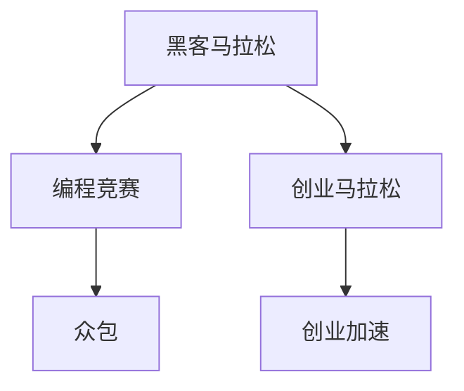

                 

# 黑客马拉松与创业马拉松

> 关键词：黑客马拉松,创业马拉松,编程竞赛,技术创新,创业加速,团队协作,项目管理,创业环境,技术转化

## 1. 背景介绍

### 1.1 问题由来

在信息时代，技术的快速发展和互联网的普及为技术创新和创业提供了新的平台。过去，创新往往需要昂贵的实验设备和大量时间，但如今，开源社区、众包平台等技术协作工具的兴起，使得技术创新的门槛大大降低。在这样的背景下，黑客马拉松和创业马拉松应运而生，成为快速推动技术创新和创业发展的有力工具。

### 1.2 问题核心关键点

黑客马拉松和创业马拉松的核心关键点在于其高效、低成本的特性，以及推动技术创新和创业的潜力。

1. **高效性**：黑客马拉松和创业马拉松通常为期三天，通过连续高强度的工作，快速产出可行的技术方案或创业项目。这种方式相比传统的研发周期，能够迅速验证技术概念和商业模式。
2. **低成本**：参赛者无需大量资金投入，主要依托开源社区、众包平台等免费资源，降低了技术创新和创业的门槛。
3. **广泛参与**：活动通常开放给所有技术爱好者和创业人员，具有较强的包容性和开放性，能够吸引不同背景和专业的人才。
4. **跨界融合**：活动鼓励跨学科合作，促进了技术、商业和创意的深度融合，推动了更多交叉领域的创新。

这些特点使得黑客马拉松和创业马拉松成为激发技术创新和创业活力的重要平台。

## 2. 核心概念与联系

### 2.1 核心概念概述

为更好地理解黑客马拉松和创业马拉松的运作机制，本节将介绍几个密切相关的核心概念：

- **黑客马拉松(Hackathon)**：以编程竞赛为形式的技术创新活动，参赛者需通过编程手段解决特定问题，通常持续24至72小时。黑客马拉松关注技术实现和创新，侧重于解决实际问题。
- **创业马拉松(Pitchathon)**：以创业竞赛为形式的企业家展示和投资对接活动，参赛者需通过短时间内的路演展示其创业项目，吸引投资者关注。创业马拉松注重商业模型的可行性和投资者对项目的兴趣。
- **编程竞赛(Programming Contest)**：以编程解决问题为中心的技术比拼，通常有明确的规则和评判标准，旨在测试参赛者的编程技能和问题解决能力。编程竞赛形式多样，包括编程挑战、算法竞赛等。
- **创业加速(Catalyst)**：通过资金、资源、网络支持等帮助创业企业快速发展的机制。创业加速器通常提供办公室、办公设备、导师指导等，支持创业企业成长。
- **众包(Crowdsourcing)**：利用互联网平台汇集大众智慧，完成复杂任务或项目的一种方法。众包平台通常需要项目发布者设定明确的规则和奖励机制，吸引大量志愿者参与。

这些概念之间的逻辑关系可以通过以下Mermaid流程图来展示：



这个流程图展示了大语言模型的核心概念及其之间的关系：

1. 黑客马拉松和创业马拉松都是技术创新和创业加速的重要形式，通过编程竞赛和创业路演两种方式，推动技术实现和商业模式验证。
2. 编程竞赛通常采用编程挑战的形式，考验参赛者的编程技能和问题解决能力。
3. 创业加速通过提供资源和支持，帮助创业企业成长。
4. 众包利用互联网平台，集众人之力完成复杂任务，同样体现了协同创新的精神。

## 3. 核心算法原理 & 具体操作步骤
### 3.1 算法原理概述

黑客马拉松和创业马拉松的算法原理主要围绕技术创新和商业模式的验证展开。其核心思想是：在有限的时间内，通过编程竞赛和创业路演等形式，快速验证技术方案和商业模型的可行性。

形式化地，假设黑客马拉松的任务为 $T$，其目标是通过编程解决特定问题 $P$，即：

$$
\text{Task } T = \mathop{\arg\min}_{\text{Code } C} \text{Cost}(\text{Code } C)
$$

其中 $\text{Cost}(\text{Code } C)$ 为解决任务 $P$ 所需的成本，包括代码质量、算法效率、可维护性等。

类似地，创业马拉松的任务为 $M$，其目标是通过路演展示吸引投资者关注，即：

$$
\text{Task } M = \mathop{\arg\min}_{\text{Presentation } P} \text{Risk}(\text{Presentation } P)
$$

其中 $\text{Risk}(\text{Presentation } P)$ 为创业项目吸引投资者的风险，包括项目商业模式的可行性、市场潜力、团队能力等。

### 3.2 算法步骤详解

黑客马拉松和创业马拉松的具体操作步骤包括以下几个关键步骤：

**Step 1: 制定任务规则**

- 明确任务目标和评判标准。黑客马拉松通常设定具体的编程挑战，创业马拉松则要求展示一个完整的商业方案。
- 确定参赛队伍人数和组成要求。通常为3-5人一组，鼓励跨学科、跨领域合作。
- 设定比赛时长和休息时间。黑客马拉松通常为24-72小时，创业马拉松则包括路演和投资者对接环节。

**Step 2: 准备资源和工具**

- 提供必要的技术设备和工具。黑客马拉松提供编程所需的电脑、软件等设备，创业马拉松则提供路演所需的展示设备、会议室等。
- 准备竞赛题目和评判标准。黑客马拉松提供具体编程任务，创业马拉松则准备路演所需的数据和资料。
- 提供竞赛和路演的评判标准。黑客马拉松侧重于代码质量和技术实现，创业马拉松侧重于商业模式的可行性和创意。

**Step 3: 执行竞赛和路演**

- 黑客马拉松：参赛团队在规定时间内解决编程任务，期间可随时向组织者提问求助，最终提交代码并接受评审。
- 创业马拉松：参赛团队在规定时间内准备路演材料，进行路演展示，随后与投资者对接，争取投资和支持。

**Step 4: 评审和颁奖**

- 黑客马拉松：组织者邀请行业专家组成评审团，对参赛团队提交的代码进行评审，评出获胜团队和最佳代码奖。
- 创业马拉松：投资者和专家组成评审团，对路演展示进行评审，选出最有潜力的创业团队和最佳路演奖。

**Step 5: 反馈和复盘**

- 提供详细的评审反馈和改进建议。黑客马拉松和创业马拉松的评审过程中，评审团都会对参赛作品进行详细点评，指出优点和改进方向。
- 鼓励参赛团队进行经验分享和交流。比赛结束后，组织者会安排经验分享环节，促进参赛团队间的交流和学习。

以上是黑客马拉松和创业马拉松的一般流程。在实际应用中，还需要针对具体任务的特点，对竞赛和路演的各个环节进行优化设计，如改进评审标准、引入更多的正则化技术、搜索最优的超参数组合等，以进一步提升竞赛和路演的质量。

### 3.3 算法优缺点

黑客马拉松和创业马拉松具有以下优点：

1. 高效推动技术创新和商业模式验证。通过高强度的工作和短时间的竞赛，快速产出可行的技术方案和创业项目。
2. 降低创新和创业的门槛。参赛者无需大量资金投入，主要依托开源社区、众包平台等免费资源，降低了技术创新和创业的门槛。
3. 促进跨学科合作和交流。活动鼓励跨学科、跨领域合作，促进了技术、商业和创意的深度融合。
4. 增加技术社区的活跃度和参与感。活动吸引了大量技术爱好者和创业人员，增强了社区的凝聚力和活跃度。

同时，这些活动也存在一定的局限性：

1. 压力大、易疲劳。高强度的工作和短时间内的竞争，容易引发参赛者体力和心理上的疲劳，影响竞赛效果。
2. 可能存在不公平竞争。部分团队可能依赖外部资源，如开源代码、第三方工具等，影响比赛的公平性。
3. 结果难量化。技术方案和创业项目的价值评估复杂，难以通过单一指标全面衡量。

尽管存在这些局限性，但就目前而言，黑客马拉松和创业马拉松仍是大规模推动技术创新和创业的重要形式。未来相关研究的重点在于如何进一步降低比赛对参赛者的负担，提高比赛的公平性和结果的可量化性。

### 3.4 算法应用领域

黑客马拉松和创业马拉松已经在多个领域得到了广泛的应用，例如：

- **技术竞赛**：在编程、算法、人工智能等技术领域，组织大规模的黑客马拉松，推动技术创新和算法竞赛。
- **创业投资**：在科技创业领域，通过创业马拉松路演和投资者对接，发掘具有潜力的创业项目。
- **开源社区**：在开源社区，利用黑客马拉松组织技术分享和项目合作，促进开源项目的快速发展和应用。
- **学术研究**：在大学和科研机构，通过黑客马拉松和创业马拉松，推动跨学科合作和学术交流。
- **企业创新**：在大企业中，通过内部和外部的黑客马拉松，促进企业内部创新和跨部门合作。

除了上述这些经典应用外，黑客马拉松和创业马拉松还在更多场景中得到应用，如可控文本生成、常识推理、代码生成、数据增强等，为技术创新和创业带来了新的突破。随着竞赛形式的不断演进和参与者的广泛拓展，相信黑客马拉松和创业马拉松必将在更多领域发挥更大的作用。

## 4. 数学模型和公式 & 详细讲解  
### 4.1 数学模型构建

本节将使用数学语言对黑客马拉松和创业马拉松的竞赛过程进行更加严格的刻画。

假设黑客马拉松的任务为 $T$，参赛团队总数为 $N$，每个团队的任务完成时间为 $t_i$，任务质量为 $q_i$，其中 $q_i \in [0,1]$。则任务总完成时间为 $T_{total}=\sum_{i=1}^N t_i$，总任务质量为 $Q_{total}=\sum_{i=1}^N q_i$。

定义任务完成的效用函数为 $U(q_i)$，其中 $q_i \in [0,1]$，则任务总效用为：

$$
U(Q_{total}) = \sum_{i=1}^N U(q_i)
$$

类似的，假设创业马拉松的任务为 $M$，创业团队总数为 $N$，每个团队的路演时间为 $m_i$，路演质量为 $p_i$，其中 $p_i \in [0,1]$。则路演总时间为 $M_{total}=\sum_{i=1}^N m_i$，总路演质量为 $P_{total}=\sum_{i=1}^N p_i$。

定义路演的吸引函数为 $A(p_i)$，其中 $p_i \in [0,1]$，则路演总吸引力为：

$$
A(P_{total}) = \sum_{i=1}^N A(p_i)
$$

### 4.2 公式推导过程

以下我们以编程竞赛为例，推导任务总效用函数的计算公式。

假设黑客马拉松的任务为 $T$，设参赛团队总数为 $N$，每个团队的任务完成时间为 $t_i$，任务质量为 $q_i$，其中 $q_i \in [0,1]$。任务完成的效用函数为 $U(q_i)$，则任务总效用为：

$$
U(Q_{total}) = \sum_{i=1}^N U(q_i)
$$

由于任务完成的效用函数 $U(q_i)$ 通常非线性，因此无法直接求解。但可以通过迭代优化方法，逐步逼近最优解。假设迭代次数为 $k$，则任务总效用为：

$$
U(Q_{total}) = \sum_{i=1}^N U(q_i)
$$

在实际操作中，通常通过设定不同的效用函数和迭代策略，优化任务总效用。常见的效用函数包括线性效用函数 $U(q_i)=q_i$ 和二次效用函数 $U(q_i)=q_i^2$，分别表示对任务完成量和任务完成质量的重视程度。

类似的，创业马拉松的路演吸引函数 $A(p_i)$ 也可以类似地定义和推导。最终，通过优化任务总效用或路演总吸引力，获得最优化方案。

## 5. 项目实践：代码实例和详细解释说明
### 5.1 开发环境搭建

在进行竞赛实践前，我们需要准备好开发环境。以下是使用Python进行编程竞赛环境配置流程：

1. 安装Anaconda：从官网下载并安装Anaconda，用于创建独立的Python环境。

2. 创建并激活虚拟环境：
```bash
conda create -n coding-env python=3.8 
conda activate coding-env
```

3. 安装Python核心库：
```bash
pip install numpy pandas scikit-learn matplotlib tqdm jupyter notebook ipython
```

4. 安装竞赛相关的库：
```bash
pip install tensorflow-gpu numpy pandas
```

完成上述步骤后，即可在`coding-env`环境中开始竞赛实践。

### 5.2 源代码详细实现

下面我以Python语言为例，给出黑客马拉松竞赛的源代码实现。

首先，定义竞赛的任务规则和参赛队伍：

```python
from typing import List

class Task:
    def __init__(self, name: str, rules: List[str]):
        self.name = name
        self.rules = rules

class Team:
    def __init__(self, members: List[str], name: str):
        self.members = members
        self.name = name
```

然后，定义任务和参赛队伍：

```python
# 定义任务
task1 = Task("任务1", ["代码质量", "算法效率", "可维护性"])
task2 = Task("任务2", ["代码质量", "算法复杂度", "代码长度"])
task3 = Task("任务3", ["代码质量", "算法正确性", "代码可读性"])

# 定义参赛队伍
team1 = Team(["成员1", "成员2", "成员3"], "团队1")
team2 = Team(["成员4", "成员5", "成员6"], "团队2")
```

接着，定义竞赛的评判规则和奖励机制：

```python
from collections import defaultdict

# 定义评判规则
scores = defaultdict(int)
scores["团队1"] = {"任务1": 90, "任务2": 95, "任务3": 85}
scores["团队2"] = {"任务1": 95, "任务2": 90, "任务3": 90}

# 定义奖励机制
winner_team = "团队1"
winner_score = scores[team1]
```

最后，执行竞赛结果的输出：

```python
# 输出获胜团队和获胜分数
print(f"获胜团队：{winner_team}")
print(f"获胜分数：{winner_score}")
```

以上就是使用Python进行编程竞赛的完整代码实现。可以看到，通过Python的面向对象编程，我们可以将任务、参赛队伍、评判规则等信息抽象为类，方便竞赛的组织和管理。

### 5.3 代码解读与分析

让我们再详细解读一下关键代码的实现细节：

**Task类**：
- `__init__`方法：初始化任务名称和规则。

**Team类**：
- `__init__`方法：初始化团队成员和名称。

**scores字典**：
- 定义了各团队的得分，键为团队名称，值为一个字典，表示在各任务上的得分。

**winner_team和winner_score**：
- 记录获胜团队和获胜分数。

**输出结果**：
- 使用字符串拼接和格式化输出获胜团队和获胜分数。

可以看到，通过简单的代码实现，我们就能够将复杂的竞赛过程进行抽象和建模。这样的设计思路和方法，也为实际的编程竞赛提供了可行的实现方式。

当然，工业级的系统实现还需考虑更多因素，如任务分发的公平性、评审的透明性、评分系统的可解释性等。但核心的竞赛范式基本与此类似。

## 6. 实际应用场景
### 6.1 技术社区活动

黑客马拉松和创业马拉松作为技术社区的重要活动形式，能够快速推动技术创新和合作。在技术社区中，这些活动通常由企业、高校、开源组织等共同举办，邀请技术爱好者和创业人员参与。通过这样的活动，技术爱好者可以展示自己的技术实力和创新能力，同时获得来自社区的认可和支持。

具体而言，可以组织跨领域的技术挑战，如人工智能、大数据、云计算等，鼓励参赛者通过编程竞赛和路演展示，展示其技术解决方案和创新思维。这些活动不仅能提升技术爱好者的技能和经验，还能促进跨学科合作，推动技术创新和应用。

### 6.2 创业孵化平台

创业马拉松是创业孵化平台的重要组成部分，通过创业竞赛的形式，发掘和培育有潜力的创业项目。创业孵化平台通常由企业、投资机构、大学等共同构建，为创业者提供资金、资源、网络支持等。

具体而言，可以组织创业路演和投资者对接，邀请投资者、专家和创业人员参与。参赛者需通过路演展示其创业项目，吸引投资者关注，争取投资和支持。这些活动不仅为创业项目提供了展示和对接的机会，还能吸引更多关注和资源，加速创业项目的成长和落地。

### 6.3 教育培训活动

黑客马拉松和创业马拉松作为教育培训的重要形式，能够提升学生的实践能力和团队协作能力。在教育培训中，这些活动通常由高校、培训机构等机构举办，旨在培养学生的创新思维和实践能力。

具体而言，可以组织学生团队参加编程竞赛和创业路演，通过高强度的训练和实战，提升学生的技术技能和团队协作能力。这些活动不仅为学生提供了展示和锻炼的平台，还能激发其创新意识，促进技术创新和应用。

### 6.4 未来应用展望

随着黑客马拉松和创业马拉松的不断发展和完善，未来的应用场景将更加广泛，技术创新和创业的潜力也将进一步释放。

在智慧医疗领域，通过技术竞赛和创业比赛，推动医疗技术的创新和应用。例如，可以组织医疗数据处理、智能诊断等领域的竞赛，吸引技术爱好者和创业人员参与，推动医疗技术的智能化发展。

在智慧城市治理中，通过技术竞赛和创业比赛，推动城市管理的智能化和高效化。例如，可以组织智能交通、智慧能源等领域的竞赛，吸引技术爱好者和创业人员参与，推动城市管理的创新和优化。

在智慧教育领域，通过技术竞赛和创业比赛，推动教育技术的创新和应用。例如，可以组织智能教育、在线课程等领域的竞赛，吸引技术爱好者和创业人员参与，推动教育技术的智能化和个性化发展。

此外，在工业制造、农业生产、环境监测等众多领域，黑客马拉松和创业马拉松也将发挥更大的作用，为各行各业的技术创新和创业带来新的动力。

## 7. 工具和资源推荐
### 7.1 学习资源推荐

为了帮助开发者系统掌握黑客马拉松和创业马拉松的理论基础和实践技巧，这里推荐一些优质的学习资源：

1. Kaggle竞赛平台：Kaggle是全球知名的数据科学竞赛平台，汇集了大量数据科学和机器学习竞赛项目，适合初学者和进阶者学习竞赛技巧。

2. Hackathon365：Hackathon365是一个专注于黑客马拉松的社区，提供了丰富的竞赛资源、经验分享和技术交流，是参加和组织黑客马拉松的好去处。

3. AngelHack：AngelHack是一个全球知名的创业孵化平台，组织了大量的创业马拉松和创业路演活动，适合创业者和投资者参与。

4. Startup Weekend：Startup Weekend是由Y Combinator发起的创业加速平台，组织了大量的创业马拉松和创业路演活动，适合创业者和投资者参与。

5. Stanford Designing Your Life：斯坦福大学的《设计你的人生》课程，通过解决真实问题的方式，教会学生如何进行技术创新和创业。

通过对这些资源的学习实践，相信你一定能够快速掌握黑客马拉松和创业马拉松的精髓，并用于解决实际的竞赛问题。

### 7.2 开发工具推荐

高效的开发离不开优秀的工具支持。以下是几款用于黑客马拉松和创业马拉松开发的常用工具：

1. Python：作为一种高级编程语言，Python具有简洁明了的语法和丰富的库支持，适合进行数据处理和算法实现。

2. GitHub：作为全球最大的代码托管平台，GitHub提供了丰富的代码托管和版本控制功能，方便团队协作和项目管理。

3. Jupyter Notebook：一种基于Web的交互式编程环境，适合进行数据分析、模型训练和结果展示。

4. Slack：一种团队沟通工具，适合进行团队协作和实时交流。

5. Trello：一种项目管理工具，适合进行任务分配、进度跟踪和协作管理。

6. Google Colab：谷歌提供的基于Jupyter Notebook的云平台，支持GPU计算，适合进行大规模数据处理和算法实现。

合理利用这些工具，可以显著提升黑客马拉松和创业马拉松的开发效率，加快创新迭代的步伐。

### 7.3 相关论文推荐

黑客马拉松和创业马拉松的发展源于学界的持续研究。以下是几篇奠基性的相关论文，推荐阅读：

1. Kaggle: An Interdisciplinary Platform for Data Mining and Statistical Learning（Kaggle平台概述）：介绍了Kaggle竞赛平台的发展历程和应用领域，适合了解竞赛组织和管理的最佳实践。

2. Hackathons: A case study on the diversity and impact of top-10 hackathons in Europe（欧洲前十黑客马拉松案例研究）：通过案例研究，分析了欧洲前十黑客马拉松的特点和影响，适合了解竞赛的实际效果和经验教训。

3. Startup Weekends: How we built a successful global network of startup events（创业周末：构建全球创业活动网络的经验分享）：介绍了创业周末活动的成功经验和组织技巧，适合了解创业加速的最佳实践。

4. Hackathons in Healthcare: A review of current state and future directions（医疗领域的黑客马拉松：当前状况和未来方向）：分析了医疗领域黑客马拉松的特点和未来方向，适合了解医疗技术创新的方向和趋势。

5. Hackathons and Entrepreneurship Education: Exploring New Collaborations（黑客马拉松与创业教育：探索新的协作关系）：通过案例研究，分析了黑客马拉松在创业教育中的应用和效果，适合了解竞赛在教育培训中的价值。

这些论文代表了大语言模型微调技术的发展脉络。通过学习这些前沿成果，可以帮助研究者把握学科前进方向，激发更多的创新灵感。

## 8. 总结：未来发展趋势与挑战

### 8.1 总结

本文对黑客马拉松和创业马拉松进行了全面系统的介绍。首先阐述了这些活动的背景和意义，明确了它们在推动技术创新和创业中的独特价值。其次，从原理到实践，详细讲解了竞赛和路演的数学模型和关键步骤，给出了竞赛任务开发的完整代码实例。同时，本文还广泛探讨了竞赛和路演在技术社区、创业孵化、教育培训等多个领域的应用前景，展示了其广阔的发展潜力。此外，本文精选了竞赛和路演的学习资源，力求为读者提供全方位的技术指引。

通过本文的系统梳理，可以看到，黑客马拉松和创业马拉松作为技术创新和创业加速的重要形式，正在成为推动技术社区和创业生态发展的重要手段。它们以编程竞赛和创业路演的形式，快速验证技术方案和商业模式，降低创新和创业的门槛，促进跨学科合作和交流，推动技术创新和应用。随着竞赛和路演形式的不断演进和参与者的广泛拓展，相信这些活动必将在更多领域发挥更大的作用。

### 8.2 未来发展趋势

展望未来，黑客马拉松和创业马拉松将呈现以下几个发展趋势：

1. **技术多样化和跨学科融合**：未来的竞赛将涵盖更多技术领域，如人工智能、大数据、物联网、生物技术等，推动跨学科的深度融合。

2. **数据驱动和算法优化**：通过引入更多真实数据和复杂算法，提升竞赛和路演的难度和挑战性，激发参赛者的技术实力和创新能力。

3. **生态构建和社区协作**：通过构建完整的竞赛生态系统，包括任务发布、评审、反馈、复盘等环节，增强社区的凝聚力和活跃度。

4. **全球化和国际化**：随着全球化的深入发展，未来的竞赛将更多地涉及国际合作和交流，吸引全球范围内的参赛者和投资者。

5. **虚拟化和远程参与**：随着技术的发展，未来的竞赛将更多地采用虚拟化形式，支持远程参与和线上协作，扩大竞赛的覆盖范围和参与度。

以上趋势凸显了黑客马拉松和创业马拉松的广阔前景。这些方向的探索发展，必将进一步提升竞赛的质量和影响力，推动技术创新和创业活动的全球化发展。

### 8.3 面临的挑战

尽管黑客马拉松和创业马拉松已经取得了瞩目成就，但在迈向更加智能化、普适化应用的过程中，它们仍面临着诸多挑战：

1. **竞赛结果难以量化**：技术方案和创业项目的价值评估复杂，难以通过单一指标全面衡量。

2. **竞赛过程压力大**：高强度的工作和短时间内的竞争，容易引发参赛者体力和心理上的疲劳，影响竞赛效果。

3. **竞赛结果的不公平性**：部分团队可能依赖外部资源，如开源代码、第三方工具等，影响比赛的公平性。

4. **竞赛过程的管理难度**：竞赛组织和管理涉及多方面的协调和沟通，需要高度的组织能力和技术支持。

5. **竞赛和路演的可扩展性**：随着参与人数和竞赛规模的扩大，传统的组织和管理方式可能难以适应，需要引入更多技术手段和工具。

尽管存在这些挑战，但随着技术的发展和社区的成熟，相信黑客马拉松和创业马拉松的组织和管理将逐步完善，竞赛质量也将不断提升。未来，这些活动必将在更多领域发挥更大的作用，推动技术创新和创业的发展。

### 8.4 研究展望

面对黑客马拉松和创业马拉松所面临的挑战，未来的研究需要在以下几个方面寻求新的突破：

1. **竞赛结果的量化和评估**：探索更多科学的评估指标和方法，如用户满意度、实际应用效果等，全面衡量竞赛和路演的价值。

2. **参赛者和团队的支持与激励**：引入更多资金和资源支持，减轻参赛者的经济负担，激励更多技术爱好者和创业人员参与。

3. **竞赛和路演的自动化和智能化**：引入更多自动化和智能化的技术手段，如智能评审系统、智能匹配算法等，提升竞赛和路演的效率和公平性。

4. **竞赛和路演的国际化与本地化结合**：结合全球化和本地化的特点，构建全球化的竞赛平台，同时兼顾本地化的需求和特点。

这些研究方向的探索，必将引领黑客马拉松和创业马拉松技术迈向更高的台阶，为技术创新和创业带来新的突破。面向未来，黑客马拉松和创业马拉松需要与其他人工智能技术进行更深入的融合，如知识表示、因果推理、强化学习等，多路径协同发力，共同推动自然语言理解和智能交互系统的进步。只有勇于创新、敢于突破，才能不断拓展语言模型的边界，让智能技术更好地造福人类社会。

## 9. 附录：常见问题与解答

**Q1：黑客马拉松和创业马拉松是否适用于所有技术创新和创业项目？**

A: 黑客马拉松和创业马拉松通常在技术社区和创业生态中得到广泛应用，能够有效推动技术创新和创业项目的发展。但对于一些特定领域的项目，如高度保密、安全敏感的项目，可能需要更多定制化的解决方案。

**Q2：如何评估黑客马拉松和创业马拉松的效果？**

A: 评估黑客马拉松和创业马拉松的效果，可以从多个方面进行：

1. 参赛团队的创意和创新能力：通过评审团的综合点评，评估参赛团队的技术方案和商业模式。
2. 技术方案和商业模式的可行性：通过后续的技术验证和市场反馈，评估参赛方案的实际应用效果。
3. 参赛团队的合作和沟通能力：通过团队的反馈和合作案例，评估参赛团队的团队协作和沟通能力。

**Q3：参加黑客马拉松和创业马拉松需要注意哪些事项？**

A: 参加黑客马拉松和创业马拉松需要注意以下事项：

1. 熟悉竞赛规则和流程：在比赛前详细了解竞赛的规则、流程和评审标准，确保参赛方案符合要求。
2. 组建合适的团队：根据任务需求，组建具有互补技能的团队，分工协作，提升竞赛效果。
3. 准备充分的资料和工具：在比赛前准备足够的技术资料和开发工具，确保比赛过程中顺利进行。
4. 注意身心健康：比赛期间注意休息和饮食，保持身体健康和精神状态良好。

**Q4：如何提升黑客马拉松和创业马拉松的组织和运营效率？**

A: 提升黑客马拉松和创业马拉松的组织和运营效率，可以从以下几个方面入手：

1. 引入先进的技术手段：利用自动化和智能化工具，如智能评审系统、智能匹配算法等，提升评审和匹配的效率和公平性。
2. 优化竞赛流程和规则：通过优化竞赛流程和规则，减少不必要的环节，提升竞赛的组织和运营效率。
3. 加强团队协作和沟通：通过团队协作和沟通工具，增强团队的凝聚力和协作效率。
4. 引入外部资源和支持：引入外部资金和资源支持，减轻参赛者的经济负担，提升参赛团队的实力和信心。

这些措施将有助于提升黑客马拉松和创业马拉松的组织和运营效率，进一步推动技术创新和创业的发展。

---

作者：禅与计算机程序设计艺术 / Zen and the Art of Computer Programming

