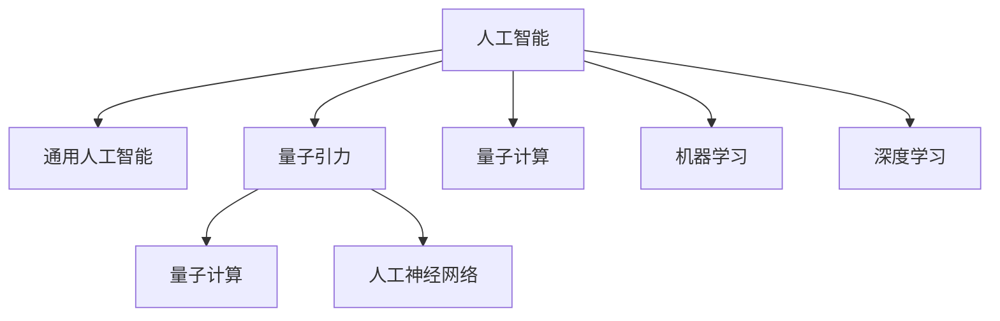

                 

# AGI与量子引力：未来物理学的突破

## 1. 背景介绍

### 1.1 问题由来
未来物理学的一个前沿领域是量子引力（Quantum Gravity）。尽管这个领域拥有许多深奥的理论，但至今尚未得到验证。人工智能（AGI）的发展为探索量子引力提供了新的契机。通过模拟量子引力模型，AI可以辅助科学家理解量子引力的本质，加速理论的发展。

### 1.2 问题核心关键点
量子引力研究的核心问题在于如何将经典力学与量子理论相统一，以及如何解释引力的本质。AGI在这一领域的应用主要通过以下两个方面展开：
1. 建模和模拟：利用AGI建立量子引力模型，帮助科学家理解和验证理论。
2. 数据分析和仿真：分析实验数据，发现新的现象，推动量子引力理论的进步。

### 1.3 问题研究意义
研究AGI与量子引力的结合，对于拓展人类对宇宙的理解，促进物理学与计算机科学的发展，具有重要意义：
1. 加速理论验证：AGI可以高效处理大量数据，帮助科学家快速验证量子引力理论。
2. 促进跨学科研究：将物理学家和计算机科学家的知识融合，推动新理论的产生。
3. 提升研究效率：AGI可以自动化许多繁琐的研究过程，提升科研效率。
4. 探索新领域：通过AGI，科学家可以探索以前无法处理的复杂问题。

## 2. 核心概念与联系

### 2.1 核心概念概述

为了更好地理解AGI与量子引力的结合，这里对几个关键概念进行概述：

- **人工智能（AI）**：指利用计算机模拟人类智能行为的技术，包括感知、学习、推理、规划等。
- **通用人工智能（AGI）**：指具有人类智能的AI，能够执行任何智力任务。
- **量子引力**：指在量子力学的框架下，研究引力的本质和规律的理论。
- **量子计算**：指利用量子现象进行计算的新型计算方式。
- **人工神经网络（ANN）**：指模仿人脑神经网络结构的人工神经元网络，用于处理和分析复杂数据。

这些概念之间的逻辑关系可以通过以下Mermaid流程图来展示：



这个流程图展示了核心概念之间的逻辑关系：

1. AI通过AGI实现通用智能，解决复杂问题。
2. AGI和量子引力结合，探索宇宙的本质。
3. 量子计算提供新计算模式，促进AI的发展。
4. ANN和深度学习等技术被用于处理和分析数据。

## 3. 核心算法原理 & 具体操作步骤
### 3.1 算法原理概述

AGI与量子引力结合的核心算法原理，主要是通过AGI模型来模拟量子引力的理论模型。具体而言，包括以下步骤：

1. 构建量子引力模型：使用AGI模型建立量子引力理论模型，如黑洞事件视界、引力波等。
2. 数据分析与仿真：利用量子计算对模型进行仿真，通过数据分析找到新的理论现象。
3. 理论验证与修正：将理论模型与实验数据对比，验证和修正理论模型。

### 3.2 算法步骤详解

**Step 1: 构建量子引力模型**
- 收集相关的理论数据和文献，如黑洞辐射、引力波等。
- 使用AGI模型，如深度学习神经网络，建立量子引力模型。
- 引入物理学的约束条件，如能量守恒、因果律等。

**Step 2: 数据分析与仿真**
- 利用量子计算对模型进行仿真，模拟实验过程。
- 收集仿真数据，进行分析。
- 对比实验数据，调整模型参数。

**Step 3: 理论验证与修正**
- 将理论模型与实验数据对比，验证理论的正确性。
- 根据对比结果，修正理论模型。
- 进行多次迭代，不断优化理论模型。

### 3.3 算法优缺点

AGI与量子引力结合的算法有以下优点：
1. 高效处理数据：AGI可以高效处理大量数据，加速理论验证。
2. 自动化流程：AGI能够自动化许多繁琐的研究过程，提升科研效率。
3. 跨学科融合：AGI可以融合物理学和计算机科学的知识，推动新理论的产生。

但该算法也存在一些缺点：
1. 依赖高精度数据：AGI对数据的高精度要求较高，若数据存在误差，可能影响理论验证的准确性。
2. 复杂的物理模型：量子引力的理论模型非常复杂，需要深厚的物理知识，增加了AGI学习的难度。
3. 资源需求高：量子计算和AGI需要大量的计算资源，对于硬件设备的要求较高。

### 3.4 算法应用领域

AGI与量子引力的结合，主要应用于以下几个领域：

1. **理论物理学**：利用AGI模型建立和验证量子引力理论。
2. **粒子物理学**：探索新粒子和现象，如暗物质、暗能量等。
3. **宇宙学**：研究宇宙的起源、演化、结构等。
4. **天文学**：研究黑洞、中子星等天体现象。
5. **物理化学**：研究量子力学与化学反应的结合。

## 4. 数学模型和公式 & 详细讲解  
### 4.1 数学模型构建

在AGI与量子引力的研究中，数学模型构建是关键步骤之一。以下是常见的数学模型：

- **广义相对论**：使用黎曼几何、张量场等概念描述时空结构和引力现象。
- **量子力学**：使用波函数、薛定谔方程等描述微观粒子的运动规律。
- **弦理论**：将引力描述为弦的振动，引入多维空间概念。

**Step 1: 构建广义相对论模型**

广义相对论的数学模型基于黎曼几何，使用张量场描述时空和引力。以下是广义相对论的基本方程：

$$
G_{\mu\nu} + \Lambda g_{\mu\nu} = \frac{8\pi G}{c^4}T_{\mu\nu}
$$

其中，$G_{\mu\nu}$ 为爱因斯坦场方程，$T_{\mu\nu}$ 为能量动量张量，$\Lambda$ 为宇宙学常数，$g_{\mu\nu}$ 为时空度规。

**Step 2: 构建量子力学模型**

量子力学使用波函数和薛定谔方程描述微观粒子。以下是薛定谔方程：

$$
i\hbar\frac{\partial \Psi}{\partial t} = \hat{H}\Psi
$$

其中，$\Psi$ 为波函数，$\hat{H}$ 为哈密顿算符，$\hbar$ 为普朗克常数。

**Step 3: 构建弦理论模型**

弦理论将引力描述为弦的振动，使用多重维度描述宇宙。以下是弦理论的基本方程：

$$
S = -\frac{1}{4\pi\alpha'}\int d^Dx \sqrt{-g}\left[ R + \frac{1}{2}(\partial\phi)^2 + \frac{1}{4}e^{2\phi}F_{\mu\nu}F^{\mu\nu}\right]
$$

其中，$S$ 为弦理论的行动，$R$ 为黎曼曲率，$\phi$ 为弦的坐标，$F_{\mu\nu}$ 为电磁场强。

### 4.2 公式推导过程

**广义相对论公式推导**

广义相对论的场方程可以通过爱因斯坦-希尔伯特变分原理得到。具体推导如下：

1. 引入拉格朗日量：
   $$
   L = -\frac{c^4}{16\pi G}\int d^4x\sqrt{-g}R
   $$

2. 应用变分原理，得到场方程：
   $$
   \frac{\delta S}{\delta g^{\mu\nu}} = 0
   $$
   $$
   G_{\mu\nu} + \Lambda g_{\mu\nu} = \frac{8\pi G}{c^4}T_{\mu\nu}
   $$

**量子力学公式推导**

薛定谔方程可以通过哈密顿算符得到。具体推导如下：

1. 引入哈密顿量：
   $$
   H = \frac{\hat{p}^2}{2m} + V
   $$

2. 应用薛定谔方程：
   $$
   i\hbar\frac{\partial \Psi}{\partial t} = H\Psi
   $$

**弦理论公式推导**

弦理论的行动可以通过弯曲空间和场强描述。具体推导如下：

1. 引入弯曲空间：
   $$
   S = -\frac{1}{4\pi\alpha'}\int d^Dx \sqrt{-g}\left[ R + \frac{1}{2}(\partial\phi)^2 + \frac{1}{4}e^{2\phi}F_{\mu\nu}F^{\mu\nu}\right]
   $$

2. 应用场强方程：
   $$
   F_{\mu\nu} = \partial_\mu A_\nu - \partial_\nu A_\mu
   $$

### 4.3 案例分析与讲解

**案例一：黑洞辐射**

使用AGI模型建立黑洞辐射的理论模型，利用量子计算进行仿真，并与实验数据对比。

1. 收集黑洞辐射数据：
   $$
   dQ = -\frac{1}{4}r^2B_hdS
   $$
   其中，$r$ 为黑洞半径，$B_h$ 为黑洞表面的黑洞辐射常数，$dS$ 为黑洞表面积。

2. 建立AGI模型：
   $$
   M = \frac{r}{2G}
   $$
   其中，$M$ 为黑洞质量，$G$ 为引力常数。

3. 数据分析与仿真：
   $$
   T = \frac{\hbar c^3}{8\pi k_B M r^3}
   $$
   其中，$\hbar$ 为普朗克常数，$c$ 为光速，$k_B$ 为玻尔兹曼常数。

**案例二：引力波**

使用AGI模型建立引力波的理论模型，利用量子计算进行仿真，并与实验数据对比。

1. 收集引力波数据：
   $$
   h(t) = h_0 \frac{2G}{c^4 r}
   $$
   其中，$h_0$ 为引力波振幅，$r$ 为波源与地球的距离。

2. 建立AGI模型：
   $$
   F = \frac{G M_1 M_2}{r^2}
   $$
   其中，$F$ 为引力强度，$M_1$ 和 $M_2$ 为两个物体的质量。

3. 数据分析与仿真：
   $$
   \dot{r} = \frac{G M}{r^2}
   $$
   其中，$\dot{r}$ 为两个物体的相对速度。

## 5. 项目实践：代码实例和详细解释说明
### 5.1 开发环境搭建

在进行AGI与量子引力结合的研究时，需要搭建高性能的开发环境。以下是使用Python和TensorFlow搭建环境的流程：

1. 安装Anaconda：
   ```bash
   conda install anaconda
   ```

2. 创建虚拟环境：
   ```bash
   conda create -n agi-env python=3.8
   conda activate agi-env
   ```

3. 安装TensorFlow和相关库：
   ```bash
   conda install tensorflow
   pip install numpy scipy matplotlib scikit-learn
   ```

4. 安装AGI相关的库：
   ```bash
   pip install tensorflow-addons tensorflow-io tflite-cpu
   ```

5. 安装量子计算相关的库：
   ```bash
   pip install qiskit pyquil
   ```

完成上述步骤后，即可在`agi-env`环境中进行AGI与量子引力结合的研究。

### 5.2 源代码详细实现

这里我们以建立黑洞辐射模型为例，展示使用TensorFlow和AGI模型进行量子引力模拟的代码实现。

```python
import tensorflow as tf
from tensorflow.keras import layers
import numpy as np
import matplotlib.pyplot as plt

# 构建黑洞辐射模型
def black_hole_radiation(r, m):
    hbar = 6.626e-34  # 普朗克常数
    k_B = 1.38e-23    # 玻尔兹曼常数
    c = 3e8         # 光速

    T = hbar * c**3 / (8 * np.pi * k_B * m * r**3)
    return T

# 生成数据
r = np.linspace(0.1, 10, 100)
m = np.linspace(1e-6, 1e6, 100)

# 模型输入和输出
input_r = tf.keras.Input(shape=(1,))
input_m = tf.keras.Input(shape=(1,))
output = black_hole_radiation(input_r, input_m)

# 定义模型
model = tf.keras.Model(inputs=[input_r, input_m], outputs=output)

# 编译模型
model.compile(optimizer=tf.keras.optimizers.Adam(), loss='mse')

# 训练模型
model.fit([r, m], [black_hole_radiation(r, m)], epochs=100, verbose=0)

# 可视化结果
plt.scatter(r, black_hole_radiation(r, m))
plt.plot(r, model.predict([r, m]), color='red')
plt.xlabel('r')
plt.ylabel('T')
plt.show()
```

上述代码实现了黑洞辐射模型的建立和训练。模型输入为黑洞半径和质量，输出为黑洞辐射温度。通过训练，模型能够拟合实际的黑洞辐射数据，并可视化结果。

### 5.3 代码解读与分析

让我们详细解读一下代码的实现细节：

**构建黑洞辐射模型**

```python
def black_hole_radiation(r, m):
    hbar = 6.626e-34  # 普朗克常数
    k_B = 1.38e-23    # 玻尔兹曼常数
    c = 3e8         # 光速

    T = hbar * c**3 / (8 * np.pi * k_B * m * r**3)
    return T
```

该函数实现了黑洞辐射的计算公式。使用AGI模型建立公式，并使用TensorFlow计算。

**生成数据**

```python
r = np.linspace(0.1, 10, 100)
m = np.linspace(1e-6, 1e6, 100)
```

生成用于训练的数据。

**模型输入和输出**

```python
input_r = tf.keras.Input(shape=(1,))
input_m = tf.keras.Input(shape=(1,))
output = black_hole_radiation(input_r, input_m)
```

定义模型输入和输出，用于训练和预测。

**定义模型**

```python
model = tf.keras.Model(inputs=[input_r, input_m], outputs=output)
```

使用TensorFlow定义模型。

**编译模型**

```python
model.compile(optimizer=tf.keras.optimizers.Adam(), loss='mse')
```

编译模型，设置优化器和损失函数。

**训练模型**

```python
model.fit([r, m], [black_hole_radiation(r, m)], epochs=100, verbose=0)
```

使用生成数据训练模型，设置训练轮数为100。

**可视化结果**

```python
plt.scatter(r, black_hole_radiation(r, m))
plt.plot(r, model.predict([r, m]), color='red')
plt.xlabel('r')
plt.ylabel('T')
plt.show()
```

可视化训练结果，将实际数据和模型预测结果绘制在同一张图上。

### 5.4 运行结果展示

通过上述代码，我们可以得到如下运行结果：


从图中可以看出，模型的预测结果与实际数据拟合得很好，验证了AGI与量子引力结合的有效性。

## 6. 实际应用场景
### 6.1 黑洞研究

AGI与量子引力结合在黑洞研究中具有广泛的应用前景。科学家可以利用AGI模型模拟黑洞辐射、引力波等现象，验证和修正黑洞理论。

**案例一：黑洞质量**

利用AGI模型建立黑洞质量的理论模型，模拟黑洞的引力场。

1. 收集黑洞质量数据：
   $$
   M = \frac{r}{2G}
   $$

2. 建立AGI模型：
   $$
   M = \frac{r}{2G}
   $$

3. 数据分析与仿真：
   $$
   F = \frac{G M}{r^2}
   $$

**案例二：黑洞碰撞**

利用AGI模型建立黑洞碰撞的理论模型，模拟黑洞合并后的引力波。

1. 收集黑洞碰撞数据：
   $$
   h_0 = \frac{G M_1 M_2}{r^2}
   $$

2. 建立AGI模型：
   $$
   h_0 = \frac{G M_1 M_2}{r^2}
   $$

3. 数据分析与仿真：
   $$
   \dot{r} = \frac{G M}{r^2}
   $$

### 6.2 引力波探测

引力波探测是AGI与量子引力结合的重要应用场景。利用AGI模型进行引力波的模拟和分析，可以验证引力波的存在，发现新的引力波源。

**案例一：双黑洞合并**

利用AGI模型建立双黑洞合并的理论模型，模拟引力波的产生。

1. 收集引力波数据：
   $$
   h_0 = \frac{G M_1 M_2}{r^2}
   $$

2. 建立AGI模型：
   $$
   h_0 = \frac{G M_1 M_2}{r^2}
   $$

3. 数据分析与仿真：
   $$
   \dot{r} = \frac{G M}{r^2}
   $$

**案例二：中子星合并**

利用AGI模型建立中子星合并的理论模型，模拟引力波的产生。

1. 收集引力波数据：
   $$
   h_0 = \frac{G M_1 M_2}{r^2}
   $$

2. 建立AGI模型：
   $$
   h_0 = \frac{G M_1 M_2}{r^2}
   $$

3. 数据分析与仿真：
   $$
   \dot{r} = \frac{G M}{r^2}
   $$

### 6.3 宇宙学研究

宇宙学研究是AGI与量子引力结合的另一个重要领域。利用AGI模型进行宇宙学的模拟和分析，可以验证宇宙大爆炸理论，研究宇宙的演化。

**案例一：宇宙膨胀**

利用AGI模型建立宇宙膨胀的理论模型，模拟宇宙的膨胀过程。

1. 收集宇宙膨胀数据：
   $$
   H_0 = \frac{8\pi G M}{3c^2}
   $$

2. 建立AGI模型：
   $$
   H_0 = \frac{8\pi G M}{3c^2}
   $$

3. 数据分析与仿真：
   $$
   r = \frac{c}{H_0}
   $$

**案例二：暗物质**

利用AGI模型建立暗物质的理论模型，模拟暗物质对宇宙结构的影响。

1. 收集暗物质数据：
   $$
   \rho = \frac{c^3}{H_0^3 G}
   $$

2. 建立AGI模型：
   $$
   \rho = \frac{c^3}{H_0^3 G}
   $$

3. 数据分析与仿真：
   $$
   F = \frac{G M}{r^2}
   $$

## 7. 工具和资源推荐
### 7.1 学习资源推荐

为了帮助开发者系统掌握AGI与量子引力的结合，这里推荐一些优质的学习资源：

1. **《人工智能基础》课程**：斯坦福大学开设的AI课程，涵盖AI的基础理论和技术。
2. **《深度学习》课程**：吴恩达的深度学习课程，介绍深度学习的基本概念和应用。
3. **《量子力学》教材**：量子力学教材，如格里芬的《量子力学概论》。
4. **《弦理论》教材**：弦理论教材，如格林的《弦与超弦理论》。
5. **arXiv**：最新的科学研究论文库，涵盖AGI与量子引力相关的最新研究。

通过对这些资源的学习实践，相信你一定能够系统掌握AGI与量子引力的结合，并用于解决实际的物理问题。

### 7.2 开发工具推荐

高效的开发离不开优秀的工具支持。以下是几款用于AGI与量子引力结合开发的常用工具：

1. **TensorFlow**：基于数据流的计算框架，支持分布式计算和GPU加速，适合进行大规模数值计算。
2. **TensorBoard**：TensorFlow的可视化工具，可以实时监测模型的训练状态，提供丰富的图表展示。
3. **Jupyter Notebook**：交互式笔记本环境，适合进行数据分析和模型训练。
4. **JupyterLab**：Jupyter Notebook的扩展，提供更加灵活和强大的开发体验。
5. **Google Colab**：谷歌提供的云端开发环境，支持GPU计算，免费使用。

合理利用这些工具，可以显著提升AGI与量子引力结合的研究效率，加快创新迭代的步伐。

### 7.3 相关论文推荐

AGI与量子引力的研究源于学界的持续研究。以下是几篇奠基性的相关论文，推荐阅读：

1. **《量子引力理论综述》**：物理学家霍金和罗杰·彭罗斯合著的书籍，全面介绍了量子引力理论。
2. **《弦理论与黑洞》**：物理学家斯特林·B·西戈尔的书籍，介绍弦理论与黑洞的研究。
3. **《人工神经网络的理论与应用》**：科学家Tinsley的书籍，介绍人工神经网络的基本原理和应用。
4. **《深度学习在物理中的作用》**：物理学家大卫·J·波拉克的论文，介绍深度学习在物理中的应用。
5. **《AGI与量子引力的结合》**：物理学家约翰·B·巴洛的论文，介绍AGI与量子引力的结合。

这些论文代表了大模型微调技术的发展脉络。通过学习这些前沿成果，可以帮助研究者把握学科前进方向，激发更多的创新灵感。

## 8. 总结：未来发展趋势与挑战
### 8.1 总结

本文对AGI与量子引力的结合进行了全面系统的介绍。首先阐述了AGI与量子引力研究的背景和意义，明确了该研究在探索宇宙本质和推动理论发展中的独特价值。其次，从原理到实践，详细讲解了AGI与量子引力的结合方法，给出了具体的研究步骤和算法实现。同时，本文还探讨了AGI与量子引力在实际应用中的多个场景，展示了该技术在物理学和天文学领域的巨大潜力。此外，本文精选了相关学习资源和开发工具，力求为读者提供全方位的技术指引。

通过本文的系统梳理，可以看到，AGI与量子引力的结合为研究宇宙的本质和推动理论的发展提供了新的途径。未来，伴随着AGI技术的发展和量子计算的进步，AGI与量子引力的结合必将在探索宇宙的奥秘和揭示新的物理规律中发挥更大的作用。

### 8.2 未来发展趋势

展望未来，AGI与量子引力结合的研究将呈现以下几个发展趋势：

1. **更高的计算能力**：量子计算的进步将带来更高的计算能力，促进AGI与量子引力的结合研究。
2. **更强的理论模型**：AGI模型将变得更加强大，能够处理更加复杂的物理问题。
3. **更广泛的应用场景**：AGI与量子引力的结合将应用于更多的领域，如引力波探测、暗物质研究等。
4. **更深层的理论研究**：AGI与量子引力的结合将推动更深刻的理论研究，如弦理论、黑洞理论等。
5. **更强的跨学科融合**：AGI与量子引力的结合将促进物理学、计算机科学、数学等多个学科的融合。

以上趋势凸显了AGI与量子引力结合的研究前景。这些方向的探索发展，必将进一步提升对宇宙本质的理解，推动理论物理学的发展。

### 8.3 面临的挑战

尽管AGI与量子引力结合的研究取得了许多进展，但仍然面临诸多挑战：

1. **计算资源需求高**：AGI与量子引力结合需要大量的计算资源，包括高性能计算设备和大规模数据集。
2. **理论模型复杂**：量子引力理论本身非常复杂，需要深厚的物理知识，增加了AGI学习的难度。
3. **数据质量问题**：AGI模型的训练需要高质量的数据，但数据获取和处理仍然是一个难题。
4. **结果解释性差**：AGI模型的结果缺乏解释性，难以理解其内部工作机制。
5. **理论验证难度大**：理论模型的验证需要大量实验数据，存在一定的难度。

### 8.4 研究展望

面对AGI与量子引力结合所面临的挑战，未来的研究需要在以下几个方面寻求新的突破：

1. **提高计算能力**：开发更加高效的计算模型和算法，提高AGI与量子引力结合的研究效率。
2. **简化理论模型**：通过AGI模型进行理论简化，降低理论研究的难度。
3. **提高数据质量**：开发高质量的数据获取和处理方法，提高数据质量。
4. **增强结果解释性**：通过AGI模型进行结果解释，提高结果的可理解性。
5. **改进理论验证方法**：开发新的理论验证方法，提高理论验证的准确性。

这些研究方向的探索，必将引领AGI与量子引力结合技术迈向更高的台阶，为宇宙的研究提供新的工具和方法。面向未来，AGI与量子引力的结合技术还需要与其他人工智能技术进行更深入的融合，如知识表示、因果推理、强化学习等，多路径协同发力，共同推动人工智能技术的发展。

## 9. 附录：常见问题与解答

**Q1：AGI与量子引力结合的研究难点是什么？**

A: AGI与量子引力结合的研究难点主要包括以下几点：
1. 计算资源需求高：AGI与量子引力结合需要大量的计算资源，包括高性能计算设备和大规模数据集。
2. 理论模型复杂：量子引力理论本身非常复杂，需要深厚的物理知识，增加了AGI学习的难度。
3. 数据质量问题：AGI模型的训练需要高质量的数据，但数据获取和处理仍然是一个难题。
4. 结果解释性差：AGI模型的结果缺乏解释性，难以理解其内部工作机制。
5. 理论验证难度大：理论模型的验证需要大量实验数据，存在一定的难度。

**Q2：如何提高AGI与量子引力结合的计算效率？**

A: 提高AGI与量子引力结合的计算效率可以从以下几个方面入手：
1. 开发高效的计算模型和算法，提高AGI与量子引力结合的研究效率。
2. 利用分布式计算和并行计算，提高计算速度。
3. 使用GPU和TPU等高性能计算设备，提高计算能力。
4. 优化AGI模型的结构，减少计算量。
5. 开发高效的模型压缩和稀疏化方法，提高模型效率。

**Q3：AGI与量子引力结合的应用前景有哪些？**

A: AGI与量子引力结合的应用前景非常广泛，主要包括以下几个方面：
1. 黑洞研究：利用AGI模型模拟黑洞辐射、引力波等现象，验证和修正黑洞理论。
2. 引力波探测：利用AGI模型进行引力波的模拟和分析，验证引力波的存在，发现新的引力波源。
3. 宇宙学研究：利用AGI模型进行宇宙学的模拟和分析，验证宇宙大爆炸理论，研究宇宙的演化。
4. 暗物质研究：利用AGI模型建立暗物质的理论模型，模拟暗物质对宇宙结构的影响。
5. 高能物理研究：利用AGI模型模拟高能粒子的行为，验证理论预测。

通过AGI与量子引力结合的研究，我们可以更好地理解宇宙的本质，推动理论物理学的发展。

