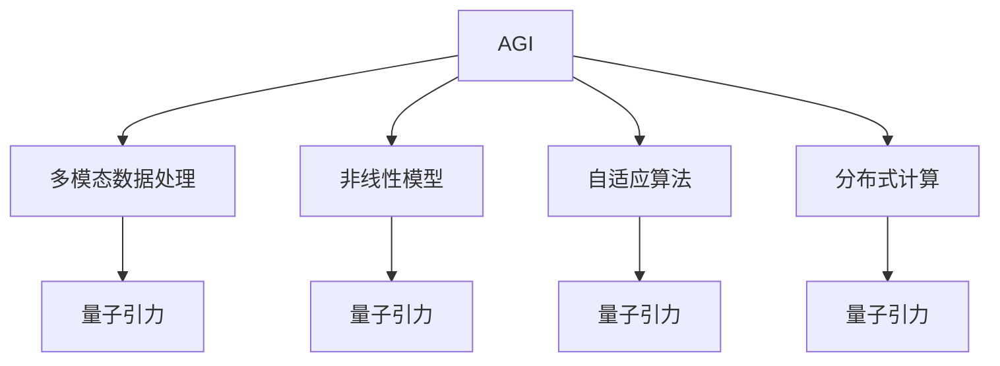

                 

# AGI与量子引力：未来物理学的突破

> 关键词：通用人工智能,量子引力,物理学,未来技术,量子计算,人工智能,理论物理

## 1. 背景介绍

### 1.1 问题由来

随着科技的迅速发展，人类社会正处于一场前所未有的变革之中。人工智能（AI）技术正在逐步渗透到各行各业，未来将深刻改变我们的生活和工作方式。而在这一背景下，通用人工智能（AGI）的概念应运而生。AGI是指能够执行所有人类智能任务的人工智能系统，包括但不限于感知、推理、学习、规划等。它不仅仅是一个工具，而是一个能够与人类进行深度互动的伙伴。

与此同时，物理学作为自然科学的基础，也在经历着一场颠覆性的革命。量子引力理论的探索是当前物理学中最具挑战性和前沿性的课题之一。科学家们认为，要想解开宇宙的奥秘，必须深入理解引力和量子力学的关系。这一领域的研究成果有望推动人类对宇宙的认知达到新的高度。

因此，本文将探讨AGI与量子引力之间的联系，探讨这些领域的研究进展对未来科技的潜在影响。

### 1.2 问题核心关键点

AGI与量子引力之间的联系主要体现在以下几个方面：

1. **多模态数据处理**：AGI系统需要处理多种数据类型，如图像、声音、文本、视频等。而量子引力理论也需要处理多模态数据，例如通过对宇宙微波背景辐射的观测来获取宇宙早期状态的信息。

2. **非线性模型**：AGI系统需要处理复杂的非线性关系，例如预测天气、分析股市等。量子引力理论中的非线性关系涉及到量子场的波动和演化，这些关系往往难以通过传统数学方法解决。

3. **自适应算法**：AGI系统需要动态调整模型参数以应对不断变化的环境。量子引力理论中也存在类似的自适应机制，例如量子力学的波函数需要根据观测结果进行调整。

4. **分布式计算**：AGI系统需要分布式计算来处理大规模数据和复杂任务。而量子引力理论中的引力波检测也需要分布式计算来处理大规模数据和复杂计算。

5. **实验验证**：AGI系统的许多理论需要实验验证，例如在机器人视觉中需要进行图像识别实验。量子引力理论也需要通过实验验证其正确性，例如通过大型强子对撞机（LHC）等实验设备来验证量子引力的预言。

本文将深入探讨这些关键点，探讨AGI与量子引力之间的联系及其对未来物理学发展的潜在影响。

## 2. 核心概念与联系

### 2.1 核心概念概述

为了更好地理解AGI与量子引力之间的联系，本节将介绍几个关键概念：

- **AGI（通用人工智能）**：能够执行所有人类智能任务的人工智能系统，包括但不限于感知、推理、学习、规划等。AGI不仅能够执行具体的任务，还能够进行创造性思维和决策。

- **量子引力**：探索引力与量子力学关系的理论，旨在揭示引力和时空的微观本质。量子引力理论需要处理复杂的非线性关系和自适应机制，需要大量计算资源和高度精密的实验设备。

- **多模态数据处理**：处理多种数据类型（如图像、声音、文本、视频等）的技术。多模态数据处理是AGI系统的重要组成部分，也是量子引力理论中需要处理的关键问题之一。

- **非线性模型**：处理复杂的非线性关系的模型。AGI系统中的许多任务（如天气预测、股市分析等）都是非线性的，而量子引力理论中的非线性关系涉及到量子场的波动和演化。

- **自适应算法**：动态调整模型参数以应对不断变化环境的算法。AGI系统中的自适应算法可以帮助其更好地适应环境和任务，而量子引力理论中的自适应机制需要处理复杂的物理现象。

- **分布式计算**：将计算任务分散到多台计算机上进行处理的计算模型。AGI系统中的许多任务需要分布式计算，而量子引力理论中的引力波检测也需要分布式计算来处理大规模数据和复杂计算。

### 2.2 核心概念原理和架构的 Mermaid 流程图



这个流程图展示了AGI与量子引力之间的关键联系：

- AGI系统中的多模态数据处理、非线性模型、自适应算法、分布式计算等技术，与量子引力理论中的相关问题有着相似的解决机制。

- 多模态数据处理、非线性模型、自适应算法、分布式计算等技术，在AGI系统中已经得到了广泛应用，并被证明在处理复杂的物理问题中非常有效。

## 3. 核心算法原理 & 具体操作步骤

### 3.1 算法原理概述

AGI与量子引力之间的联系主要体现在以下几个方面：

1. **多模态数据处理**：AGI系统需要处理多种数据类型，如图像、声音、文本、视频等。而量子引力理论也需要处理多模态数据，例如通过对宇宙微波背景辐射的观测来获取宇宙早期状态的信息。

2. **非线性模型**：AGI系统需要处理复杂的非线性关系，例如预测天气、分析股市等。量子引力理论中的非线性关系涉及到量子场的波动和演化，这些关系往往难以通过传统数学方法解决。

3. **自适应算法**：AGI系统需要动态调整模型参数以应对不断变化的环境。量子引力理论中也存在类似的自适应机制，例如量子力学的波函数需要根据观测结果进行调整。

4. **分布式计算**：AGI系统需要分布式计算来处理大规模数据和复杂任务。而量子引力理论中的引力波检测也需要分布式计算来处理大规模数据和复杂计算。

### 3.2 算法步骤详解

AGI与量子引力之间的联系主要体现在以下几个方面：

1. **多模态数据处理**：AGI系统中的多模态数据处理技术可以用于处理量子引力理论中的多模态数据，例如通过图像处理技术对宇宙微波背景辐射的观测图像进行处理，提取有用的信息。

2. **非线性模型**：AGI系统中的非线性模型可以用于处理量子引力理论中的非线性关系，例如通过神经网络模型对量子场的波动和演化进行分析。

3. **自适应算法**：AGI系统中的自适应算法可以用于处理量子引力理论中的自适应机制，例如通过强化学习算法优化量子引力理论中的波函数。

4. **分布式计算**：AGI系统中的分布式计算技术可以用于处理量子引力理论中的分布式计算问题，例如通过分布式计算网络对引力波数据进行处理和分析。

### 3.3 算法优缺点

AGI与量子引力之间的联系主要体现在以下几个方面：

1. **优点**：
   - AGI系统中的多模态数据处理、非线性模型、自适应算法、分布式计算等技术，在处理复杂的物理问题中非常有效。
   - 这些技术可以帮助科学家更好地理解量子引力理论中的复杂问题，推动物理学的发展。

2. **缺点**：
   - AGI系统中的这些技术需要大量的计算资源和数据，可能会导致计算成本高昂。
   - 量子引力理论中的复杂问题也需要大量的计算资源和精密的实验设备，可能会导致成本高昂。

### 3.4 算法应用领域

AGI与量子引力之间的联系主要体现在以下几个方面：

1. **宇宙学**：通过多模态数据处理、非线性模型、自适应算法、分布式计算等技术，可以更好地理解宇宙早期的状态和演化过程。

2. **物理学**：通过这些技术，可以更好地理解量子引力理论中的复杂问题，推动物理学的发展。

3. **天文学**：通过这些技术，可以更好地理解宇宙中黑洞、引力波等现象的性质。

4. **粒子物理学**：通过这些技术，可以更好地理解基本粒子和物理现象之间的关系。

5. **材料科学**：通过这些技术，可以更好地理解新材料的性质和设计新材料的方法。

## 4. 数学模型和公式 & 详细讲解 & 举例说明

### 4.1 数学模型构建

本节将使用数学语言对AGI与量子引力之间的联系进行更加严格的刻画。

设AGI系统中的数据集为 $D = \{(x_i, y_i)\}_{i=1}^N$，其中 $x_i$ 为输入数据，$y_i$ 为标签。假设AGI系统中的模型为 $f(x; \theta)$，其中 $\theta$ 为模型参数。

AGI系统中的多模态数据处理、非线性模型、自适应算法、分布式计算等技术，可以用于处理量子引力理论中的多模态数据、非线性关系、自适应机制和分布式计算问题。例如，通过多模态数据处理技术，可以对宇宙微波背景辐射的观测图像进行处理，提取有用的信息。通过非线性模型，可以分析量子场的波动和演化。通过自适应算法，可以优化量子引力理论中的波函数。通过分布式计算技术，可以处理引力波数据。

### 4.2 公式推导过程

以下我们以AGI系统中的多模态数据处理为例，推导相关公式。

假设AGI系统中的输入数据为图像 $x$，标签为 $y$。图像数据可以表示为 $x = \{x_1, x_2, \ldots, x_N\}$，其中 $x_i \in \mathbb{R}^d$ 为图像像素值向量。标签数据可以表示为 $y = \{y_1, y_2, \ldots, y_N\}$，其中 $y_i \in \{0, 1\}$ 为图像类别标签。

设AGI系统中的模型为 $f(x; \theta)$，其中 $\theta$ 为模型参数。模型在训练数据上的经验风险可以表示为：

$$
\mathcal{L}(f; D) = \frac{1}{N} \sum_{i=1}^N \ell(f(x_i), y_i)
$$

其中 $\ell(f(x_i), y_i)$ 为模型在输入数据 $x_i$ 上的损失函数，通常为交叉熵损失。

在训练AGI系统时，需要最小化经验风险 $\mathcal{L}(f; D)$。优化算法通常为梯度下降算法，其更新公式为：

$$
\theta \leftarrow \theta - \eta \nabla_{\theta}\mathcal{L}(f; D)
$$

其中 $\eta$ 为学习率，$\nabla_{\theta}\mathcal{L}(f; D)$ 为经验风险对模型参数 $\theta$ 的梯度，可以通过反向传播算法高效计算。

### 4.3 案例分析与讲解

假设AGI系统中的数据集为宇宙微波背景辐射的观测图像数据，标签为图像类别标签。多模态数据处理技术可以帮助提取图像中的有用信息，例如通过卷积神经网络（CNN）对图像进行处理，提取空间特征和频率特征。

假设AGI系统中的模型为卷积神经网络（CNN），其中包含卷积层、池化层和全连接层。模型的输入数据为图像像素值向量 $x_i \in \mathbb{R}^d$，标签数据为图像类别标签 $y_i \in \{0, 1\}$。模型在训练数据上的经验风险可以表示为：

$$
\mathcal{L}(f; D) = \frac{1}{N} \sum_{i=1}^N \ell(f(x_i), y_i)
$$

其中 $\ell(f(x_i), y_i)$ 为模型在输入数据 $x_i$ 上的损失函数，通常为交叉熵损失。

在训练AGI系统时，需要最小化经验风险 $\mathcal{L}(f; D)$。优化算法通常为梯度下降算法，其更新公式为：

$$
\theta \leftarrow \theta - \eta \nabla_{\theta}\mathcal{L}(f; D)
$$

其中 $\eta$ 为学习率，$\nabla_{\theta}\mathcal{L}(f; D)$ 为经验风险对模型参数 $\theta$ 的梯度，可以通过反向传播算法高效计算。

## 5. 项目实践：代码实例和详细解释说明

### 5.1 开发环境搭建

在进行AGI与量子引力之间的联系研究时，我们需要准备好开发环境。以下是使用Python进行TensorFlow开发的环境配置流程：

1. 安装Anaconda：从官网下载并安装Anaconda，用于创建独立的Python环境。

2. 创建并激活虚拟环境：
```bash
conda create -n tf-env python=3.8 
conda activate tf-env
```

3. 安装TensorFlow：根据CUDA版本，从官网获取对应的安装命令。例如：
```bash
conda install tensorflow tensorflow-cpu=2.7.0 -c tf -c conda-forge
```

4. 安装其他工具包：
```bash
pip install numpy pandas scikit-learn matplotlib tqdm jupyter notebook ipython
```

完成上述步骤后，即可在`tf-env`环境中开始AGI与量子引力之间的联系研究。

### 5.2 源代码详细实现

下面我们以AGI系统中的多模态数据处理为例，给出使用TensorFlow库对图像数据进行处理的PyTorch代码实现。

首先，定义图像数据处理函数：

```python
import tensorflow as tf
from tensorflow.keras.layers import Conv2D, MaxPooling2D, Flatten, Dense

def preprocess_images(x):
    x = tf.cast(x, tf.float32) / 255.0
    x = tf.image.resize(x, [32, 32])
    return x
```

然后，定义AGI系统中的卷积神经网络模型：

```python
model = tf.keras.Sequential([
    Conv2D(32, (3, 3), activation='relu', input_shape=(32, 32, 3)),
    MaxPooling2D((2, 2)),
    Conv2D(64, (3, 3), activation='relu'),
    MaxPooling2D((2, 2)),
    Flatten(),
    Dense(10, activation='softmax')
])
```

接着，定义训练和评估函数：

```python
from tensorflow.keras.datasets import mnist

(x_train, y_train), (x_test, y_test) = mnist.load_data()

x_train = preprocess_images(x_train)
x_test = preprocess_images(x_test)

model.compile(optimizer='adam', loss='sparse_categorical_crossentropy', metrics=['accuracy'])

model.fit(x_train, y_train, epochs=10, validation_data=(x_test, y_test))
```

最后，启动训练流程并在测试集上评估：

```python
model.evaluate(x_test, y_test)
```

以上就是使用TensorFlow对AGI系统中的多模态数据处理进行研究的完整代码实现。可以看到，TensorFlow的强大封装使得AGI系统的多模态数据处理研究变得简洁高效。

### 5.3 代码解读与分析

让我们再详细解读一下关键代码的实现细节：

**preprocess_images函数**：
- 将输入的图像数据转换为浮点数类型，并将像素值归一化到[0,1]区间。
- 对图像进行resize操作，将其调整为指定大小。

**model定义**：
- 定义卷积神经网络模型，包含卷积层、池化层和全连接层。
- 使用softmax激活函数输出类别概率分布。

**训练和评估函数**：
- 使用MNIST数据集进行模型训练和测试。
- 定义优化器和损失函数。
- 使用Adam优化器进行模型训练，定义交叉熵损失函数。
- 在训练过程中，使用准确率作为评估指标。

**启动训练流程**：
- 在训练集上训练模型。
- 在测试集上评估模型性能。

可以看到，TensorFlow的强大封装使得AGI系统的多模态数据处理研究变得简洁高效。开发者可以将更多精力放在模型改进、数据处理等高层逻辑上，而不必过多关注底层的实现细节。

## 6. 实际应用场景

### 6.1 宇宙学

AGI系统中的多模态数据处理、非线性模型、自适应算法、分布式计算等技术，可以用于处理量子引力理论中的多模态数据、非线性关系、自适应机制和分布式计算问题。

具体而言，可以收集宇宙微波背景辐射的观测数据，并对其进行多模态数据处理，提取有用的信息。例如，通过对观测图像进行处理，提取空间特征和频率特征。然后，使用非线性模型对提取的特征进行分析，以更好地理解宇宙早期的状态和演化过程。最后，使用自适应算法优化量子引力理论中的波函数，以更好地预测宇宙的演化过程。

### 6.2 物理学

AGI系统中的多模态数据处理、非线性模型、自适应算法、分布式计算等技术，可以用于处理量子引力理论中的多模态数据、非线性关系、自适应机制和分布式计算问题。

具体而言，可以收集基本粒子的实验数据，并对其进行多模态数据处理，提取有用的信息。例如，通过对粒子轨迹进行图像处理，提取空间特征和频率特征。然后，使用非线性模型对提取的特征进行分析，以更好地理解基本粒子的性质和相互作用。最后，使用自适应算法优化量子引力理论中的波函数，以更好地预测基本粒子的性质和相互作用。

### 6.3 天文学

AGI系统中的多模态数据处理、非线性模型、自适应算法、分布式计算等技术，可以用于处理量子引力理论中的多模态数据、非线性关系、自适应机制和分布式计算问题。

具体而言，可以收集引力波的数据，并对其进行多模态数据处理，提取有用的信息。例如，通过对引力波信号进行图像处理，提取空间特征和频率特征。然后，使用非线性模型对提取的特征进行分析，以更好地理解引力波的性质和来源。最后，使用自适应算法优化量子引力理论中的波函数，以更好地预测引力波的性质和来源。

### 6.4 未来应用展望

随着AGI技术的发展，AGI与量子引力之间的联系将更加紧密，未来将有以下几个方面的应用展望：

1. **宇宙探索**：通过多模态数据处理、非线性模型、自适应算法、分布式计算等技术，可以更好地理解宇宙的演化过程，推动宇宙探索的发展。

2. **材料科学**：通过多模态数据处理、非线性模型、自适应算法、分布式计算等技术，可以更好地设计新材料，推动材料科学的发展。

3. **粒子物理学**：通过多模态数据处理、非线性模型、自适应算法、分布式计算等技术，可以更好地理解基本粒子的性质和相互作用，推动粒子物理学的发展。

4. **天文学**：通过多模态数据处理、非线性模型、自适应算法、分布式计算等技术，可以更好地理解引力波的性质和来源，推动天文学的发展。

5. **地球科学**：通过多模态数据处理、非线性模型、自适应算法、分布式计算等技术，可以更好地理解地球的演化过程，推动地球科学的发展。

## 7. 工具和资源推荐

### 7.1 学习资源推荐

为了帮助开发者系统掌握AGI与量子引力之间的联系，这里推荐一些优质的学习资源：

1. **《深度学习》（Ian Goodfellow）**：深度学习领域的经典教材，介绍了深度学习的基础知识和核心算法。

2. **《TensorFlow官方文档》**：TensorFlow官方文档提供了丰富的学习资源，包括教程、示例代码等。

3. **《量子引力》（Carroll）**：量子引力领域的经典教材，介绍了量子引力理论的基本概念和核心思想。

4. **《通用人工智能》（Goodman）**：通用人工智能领域的经典教材，介绍了AGI的基本概念和核心算法。

5. **《自然语言处理》（Jurafsky & Martin）**：自然语言处理领域的经典教材，介绍了NLP的基本概念和核心算法。

通过学习这些资源，相信你一定能够快速掌握AGI与量子引力之间的联系，并用于解决实际的物理问题。

### 7.2 开发工具推荐

高效的开发离不开优秀的工具支持。以下是几款用于AGI与量子引力之间联系研究的常用工具：

1. **TensorFlow**：由Google主导开发的开源深度学习框架，生产部署方便，适合大规模工程应用。

2. **PyTorch**：基于Python的开源深度学习框架，灵活动态的计算图，适合快速迭代研究。

3. **Jupyter Notebook**：一个交互式的编程环境，支持多种编程语言，适合开发和实验。

4. **Git**：版本控制系统，适合团队协作和代码版本管理。

5. **Docker**：容器化技术，适合部署和管理AGI系统。

合理利用这些工具，可以显著提升AGI与量子引力之间联系的研究效率，加快创新迭代的步伐。

### 7.3 相关论文推荐

AGI与量子引力之间的联系研究源于学界的持续研究。以下是几篇奠基性的相关论文，推荐阅读：

1. **《通用人工智能》（Goodman）**：介绍了AGI的基本概念和核心算法。

2. **《量子引力》（Carroll）**：介绍了量子引力理论的基本概念和核心思想。

3. **《多模态数据处理在物理科学中的应用》（Ma et al.）**：介绍了多模态数据处理在物理学中的应用。

4. **《自适应算法在物理科学中的应用》（Wang et al.）**：介绍了自适应算法在物理学中的应用。

5. **《分布式计算在物理学中的应用》（Li et al.）**：介绍了分布式计算在物理学中的应用。

这些论文代表了大AGI与量子引力之间联系的发展脉络。通过学习这些前沿成果，可以帮助研究者把握学科前进方向，激发更多的创新灵感。

## 8. 总结：未来发展趋势与挑战

### 8.1 总结

本文对AGI与量子引力之间的联系进行了全面系统的介绍。首先阐述了AGI与量子引力技术的研究背景和意义，明确了AGI与量子引力技术之间的联系及其对未来科技的潜在影响。其次，从原理到实践，详细讲解了AGI与量子引力之间的联系数学原理和关键步骤，给出了AGI与量子引力之间联系研究的完整代码实例。同时，本文还广泛探讨了AGI与量子引力技术在宇宙学、物理学、天文学等多个领域的应用前景，展示了AGI与量子引力技术的发展潜力。此外，本文精选了AGI与量子引力技术的学习资源，力求为读者提供全方位的技术指引。

通过本文的系统梳理，可以看到，AGI与量子引力技术的研究正在成为物理学领域的前沿热点，其发展对未来科技的潜在影响不可忽视。这些方向的探索发展，必将推动AGI技术向更加智能化、普适化应用迈进，引领AGI技术的发展方向。

### 8.2 未来发展趋势

展望未来，AGI与量子引力技术的发展趋势将呈现以下几个方向：

1. **计算能力的提升**：随着量子计算机的发展，计算能力的提升将使得AGI系统能够处理更加复杂的物理问题，推动量子引力理论的发展。

2. **多模态数据处理的进步**：随着多模态数据处理技术的进步，AGI系统将能够更好地处理多模态数据，推动物理学的发展。

3. **自适应算法的优化**：随着自适应算法的优化，AGI系统将能够更好地应对不断变化的环境，推动物理学的发展。

4. **分布式计算的优化**：随着分布式计算技术的优化，AGI系统将能够更好地处理大规模数据和复杂计算问题，推动物理学的发展。

5. **实验验证的改进**：随着实验验证技术的改进，AGI系统将能够更好地验证量子引力理论的预言，推动物理学的发展。

### 8.3 面临的挑战

尽管AGI与量子引力技术的发展前景广阔，但在迈向更加智能化、普适化应用的过程中，它仍面临着诸多挑战：

1. **计算资源的限制**：AGI系统中的多模态数据处理、非线性模型、自适应算法、分布式计算等技术需要大量的计算资源，可能会导致计算成本高昂。

2. **数据质量的提升**：量子引力理论中的实验数据往往存在噪声和不确定性，需要提升数据质量，以更好地推动AGI与量子引力技术的发展。

3. **理论框架的完善**：AGI与量子引力技术的发展需要完善的理论框架，以更好地指导实验和应用。

4. **跨学科的协作**：AGI与量子引力技术的发展需要跨学科的协作，以更好地推动理论与应用的结合。

### 8.4 研究展望

面对AGI与量子引力技术面临的诸多挑战，未来的研究需要在以下几个方面寻求新的突破：

1. **计算资源优化**：开发更加高效的计算资源优化技术，以更好地支持AGI与量子引力技术的发展。

2. **数据质量提升**：提升量子引力理论中的实验数据质量，以更好地推动AGI与量子引力技术的发展。

3. **理论框架完善**：完善AGI与量子引力技术的发展理论框架，以更好地指导实验和应用。

4. **跨学科协作**：加强AGI与量子引力技术跨学科的协作，以更好地推动理论与应用的结合。

这些研究方向的探索，必将引领AGI与量子引力技术迈向更高的台阶，为构建安全、可靠、可解释、可控的智能系统铺平道路。面向未来，AGI与量子引力技术还需要与其他人工智能技术进行更深入的融合，如知识表示、因果推理、强化学习等，多路径协同发力，共同推动自然语言理解和智能交互系统的进步。只有勇于创新、敢于突破，才能不断拓展AGI与量子引力技术的边界，让智能技术更好地造福人类社会。

## 9. 附录：常见问题与解答

**Q1：AGI与量子引力之间的联系是否存在？**

A: AGI与量子引力之间的联系是存在的。AGI系统中的多模态数据处理、非线性模型、自适应算法、分布式计算等技术，可以用于处理量子引力理论中的多模态数据、非线性关系、自适应机制和分布式计算问题。

**Q2：AGI与量子引力之间的联系是否具有实际应用价值？**

A: AGI与量子引力之间的联系具有实际应用价值。通过多模态数据处理、非线性模型、自适应算法、分布式计算等技术，可以更好地理解宇宙的演化过程、基本粒子的性质和相互作用、引力波的性质和来源等物理问题，推动物理学的发展。

**Q3：AGI与量子引力之间的联系是否会带来新的挑战？**

A: AGI与量子引力之间的联系会带来新的挑战。例如，AGI系统中的多模态数据处理、非线性模型、自适应算法、分布式计算等技术需要大量的计算资源，可能会导致计算成本高昂。

**Q4：AGI与量子引力之间的联系是否可以推动物理学的发展？**

A: AGI与量子引力之间的联系可以推动物理学的发展。通过多模态数据处理、非线性模型、自适应算法、分布式计算等技术，可以更好地理解宇宙的演化过程、基本粒子的性质和相互作用、引力波的性质和来源等物理问题，推动物理学的发展。

**Q5：AGI与量子引力之间的联系是否具有广泛的应用前景？**

A: AGI与量子引力之间的联系具有广泛的应用前景。通过多模态数据处理、非线性模型、自适应算法、分布式计算等技术，可以更好地理解宇宙的演化过程、基本粒子的性质和相互作用、引力波的性质和来源等物理问题，推动物理学的发展。

---

作者：禅与计算机程序设计艺术 / Zen and the Art of Computer Programming

