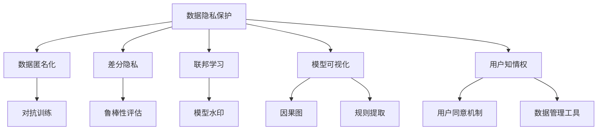

                 

# AI 2.0 基础设施建设：安全和隐私保护

在当今数字化时代，人工智能（AI）技术正迅速渗透到各个行业，带来前所未有的效率提升和商业价值。然而，随着AI的深入应用，安全和隐私问题也逐渐成为不可忽视的挑战。AI 2.0时代，如何构建安全、可靠的基础设施，保障数据隐私和安全，成为至关重要的问题。本文将从核心概念、核心算法、应用场景、实践方法等多个方面，深入探讨AI 2.0基础设施的安全和隐私保护。

## 1. 背景介绍

### 1.1 问题由来

随着AI技术的不断进步，数据在AI模型的训练和优化中扮演了至关重要的角色。无论是语音识别、图像识别、自然语言处理等任务，还是自动驾驶、智能推荐、医疗诊断等应用，背后都依赖于庞大的数据集进行模型训练。然而，数据隐私和安全性问题随之而来。

数据泄露、隐私侵犯、欺诈攻击等事件频发，不仅对个人隐私造成严重威胁，还可能对社会稳定和公共安全构成挑战。特别是在金融、医疗、政府等敏感领域，数据安全问题更是引起了广泛关注。因此，构建AI 2.0时代安全、可靠的基础设施，成为AI技术持续健康发展的关键。

### 1.2 问题核心关键点

AI 2.0时代的安全和隐私保护问题，主要集中在以下几个方面：

1. **数据隐私保护**：如何确保训练数据和模型输出中不包含敏感信息。
2. **模型安全性**：防止模型被恶意攻击、篡改或欺骗。
3. **模型可解释性**：确保模型的输出和决策过程透明、可解释，便于审查和监管。
4. **用户知情权和控制权**：在数据使用过程中，保障用户的知情权和数据控制权。

## 2. 核心概念与联系

### 2.1 核心概念概述

为更好地理解AI 2.0时代安全和隐私保护的核心概念，本节将介绍几个关键术语及其相互之间的关系：

- **数据隐私保护**：指在数据处理过程中，确保个人隐私不被泄露或被滥用的措施。包括数据匿名化、差分隐私、联邦学习等技术。
- **模型安全性**：指保护AI模型免受攻击、篡改和欺诈的能力。包括对抗训练、鲁棒性评估、模型水印等技术。
- **模型可解释性**：指使AI模型的决策过程透明、可理解，便于审查和解释的技术。包括模型可视化、因果图、规则提取等方法。
- **用户知情权和控制权**：指用户在使用AI服务时，对其数据和模型的知情权和控制权，包括数据透明度、用户同意机制、数据管理工具等。

这些概念之间的逻辑关系可以通过以下Mermaid流程图来展示：



这个流程图展示了数据隐私保护、模型安全性、模型可解释性和用户知情权等核心概念及其相互之间的联系。

## 3. 核心算法原理 & 具体操作步骤

### 3.1 算法原理概述

AI 2.0时代安全和隐私保护的核心算法，主要围绕数据隐私保护、模型安全性和可解释性展开。其基本思路是：在保障数据隐私和安全的前提下，利用机器学习算法构建健壮、透明的AI模型。

具体来说，数据隐私保护算法旨在通过技术手段，确保数据在处理过程中不泄露个人隐私。模型安全性算法旨在通过算法设计，使AI模型具备抵抗攻击的能力。模型可解释性算法则旨在通过可视化、规则提取等手段，使AI模型的决策过程透明、可理解。

### 3.2 算法步骤详解

#### 3.2.1 数据隐私保护

数据隐私保护是AI 2.0基础设施建设的基础。其核心步骤包括：

1. **数据匿名化**：通过删除或替换敏感信息，确保数据集无法直接关联到个人。常用的技术包括泛化、扰动、重标识等。
2. **差分隐私**：在数据处理过程中加入噪声，确保无法通过数据分析推断出个人隐私信息。常用的技术包括拉普拉斯机制、指数机制等。
3. **联邦学习**：通过分布式训练，在本地设备上更新模型参数，而非在中央服务器上集中处理数据。常用的技术包括横向联邦学习、纵向联邦学习等。

#### 3.2.2 模型安全性

模型安全性是保障AI模型可靠性的关键。其核心步骤包括：

1. **对抗训练**：通过生成对抗样本，训练模型识别和抵御攻击。常用的技术包括Fast Gradient Sign Method (FGSM)、Projected Gradient Descent (PGD)等。
2. **鲁棒性评估**：通过测试模型在不同攻击下的表现，评估其抗攻击能力。常用的技术包括对抗测试、鲁棒性检测等。
3. **模型水印**：在模型中添加标记，以便在检测到篡改时追踪来源。常用的技术包括数字水印、时间戳等。

#### 3.2.3 模型可解释性

模型可解释性是保障AI模型透明性的基础。其核心步骤包括：

1. **模型可视化**：通过可视化技术展示模型内部结构和决策过程，便于理解和解释。常用的技术包括特征重要性、决策树可视化等。
2. **因果图**：通过因果图模型，分析模型决策背后的因果关系，揭示决策过程的逻辑链条。常用的技术包括结构方程模型、因果推断等。
3. **规则提取**：通过规则学习技术，从模型中提取决策规则，便于人工理解和审查。常用的技术包括规则学习、决策树规则提取等。

### 3.3 算法优缺点

AI 2.0时代安全和隐私保护的核心算法，具有以下优点：

1. **提高数据隐私保护**：通过数据匿名化、差分隐私、联邦学习等技术，确保数据在处理过程中不泄露个人隐私。
2. **增强模型安全性**：通过对抗训练、鲁棒性评估、模型水印等技术，使AI模型具备抵抗攻击的能力。
3. **提升模型可解释性**：通过模型可视化、因果图、规则提取等手段，使AI模型的决策过程透明、可理解。

同时，这些算法也存在一定的局限性：

1. **技术复杂度较高**：数据隐私保护、模型安全性和可解释性算法涉及的技术较多，需要较强的技术背景和实施经验。
2. **计算成本较高**：对抗训练、差分隐私、模型水印等技术可能需要较大的计算资源和时间成本。
3. **模型性能损失**：一些隐私保护和安全性算法可能会影响模型的性能，如差分隐私可能会导致精度下降。

## 4. 数学模型和公式 & 详细讲解 & 举例说明

### 4.1 数学模型构建

本节将使用数学语言对AI 2.0时代安全和隐私保护的核心算法进行更加严格的刻画。

记数据集为 $D = \{(x_i, y_i)\}_{i=1}^N$，其中 $x_i$ 为输入，$y_i$ 为标签。假设模型为 $M_{\theta}$，其中 $\theta$ 为模型参数。

#### 4.1.1 数据隐私保护

1. **数据匿名化**：通过删除或替换敏感信息，确保数据集无法直接关联到个人。常用的技术包括泛化、扰动、重标识等。
2. **差分隐私**：在数据处理过程中加入噪声，确保无法通过数据分析推断出个人隐私信息。常用的技术包括拉普拉斯机制、指数机制等。

3. **联邦学习**：通过分布式训练，在本地设备上更新模型参数，而非在中央服务器上集中处理数据。常用的技术包括横向联邦学习、纵向联邦学习等。

#### 4.1.2 模型安全性

1. **对抗训练**：通过生成对抗样本，训练模型识别和抵御攻击。常用的技术包括Fast Gradient Sign Method (FGSM)、Projected Gradient Descent (PGD)等。

2. **鲁棒性评估**：通过测试模型在不同攻击下的表现，评估其抗攻击能力。常用的技术包括对抗测试、鲁棒性检测等。

3. **模型水印**：在模型中添加标记，以便在检测到篡改时追踪来源。常用的技术包括数字水印、时间戳等。

#### 4.1.3 模型可解释性

1. **模型可视化**：通过可视化技术展示模型内部结构和决策过程，便于理解和解释。常用的技术包括特征重要性、决策树可视化等。

2. **因果图**：通过因果图模型，分析模型决策背后的因果关系，揭示决策过程的逻辑链条。常用的技术包括结构方程模型、因果推断等。

3. **规则提取**：通过规则学习技术，从模型中提取决策规则，便于人工理解和审查。常用的技术包括规则学习、决策树规则提取等。

### 4.2 公式推导过程

#### 4.2.1 数据匿名化

**泛化**：
$$
x_i' = \mathop{\arg\min}_{x_i} \|x_i - x_i'\|
$$

**扰动**：
$$
x_i' = x_i + \epsilon_i
$$
其中，$\epsilon_i \sim \mathcal{N}(0, \sigma^2)$

**重标识**：
$$
x_i' = x_i' \oplus \sigma_k
$$
其中，$\oplus$ 表示异或运算，$\sigma_k$ 为随机标识符。

#### 4.2.2 差分隐私

**拉普拉斯机制**：
$$
L(x_i) = f(x_i) + \mathcal{Lap}(\epsilon)
$$
其中，$\mathcal{Lap}(\epsilon)$ 为拉普拉斯分布的密度函数，$\epsilon$ 为隐私参数。

**指数机制**：
$$
x_i' = \mathop{\arg\min}_{x_i} \frac{P(X=x_i'|Y=y_i)}{P(X=x_i|Y=y_i)}
$$

#### 4.2.3 对抗训练

**Fast Gradient Sign Method (FGSM)**：
$$
x_i' = x_i + \alpha \cdot sign(\nabla L(M_{\theta}(x_i), y_i))
$$
其中，$\alpha$ 为攻击强度，$sign(\nabla L)$ 为梯度的符号函数。

**Projected Gradient Descent (PGD)**：
$$
x_i' = x_i + \alpha \cdot \text{clip}(\text{sign}(\nabla L(M_{\theta}(x_i), y_i)), -\epsilon, \epsilon)
$$
其中，$\text{clip}(\cdot)$ 表示截断函数，$-\epsilon, \epsilon$ 为攻击范围。

#### 4.2.4 鲁棒性评估

**对抗测试**：
$$
\mathcal{A}(M_{\theta}, \mathcal{X}, \mathcal{Y}) = \max_{(x, y) \in \mathcal{X} \times \mathcal{Y}} \|M_{\theta}(x) - y\|
$$

**鲁棒性检测**：
$$
\mathcal{R}(M_{\theta}, \mathcal{X}, \mathcal{Y}) = \min_{(x, y) \in \mathcal{X} \times \mathcal{Y}} \|M_{\theta}(x) - y\|
$$

#### 4.2.5 模型水印

**数字水印**：
$$
\text{Watermark} = \text{Hash}(M_{\theta})
$$

**时间戳**：
$$
\text{Timestamp} = \text{Date} \oplus \text{SerialNumber}
$$

### 4.3 案例分析与讲解

#### 4.3.1 数据隐私保护案例

假设我们有一个包含用户健康数据的医疗数据集，需要对数据进行隐私保护处理。

**数据匿名化**：
- 将用户的健康记录进行泛化，删除具体诊断结果，只保留疾病类别。
- 对健康记录进行扰动，添加高斯噪声，确保无法通过数据分析推断出具体健康状况。
- 对健康记录进行重标识，使用随机标识符，确保无法关联到具体用户。

**差分隐私**：
- 在健康数据处理过程中，添加拉普拉斯噪声，确保无法通过数据分析推断出具体健康记录。

#### 4.3.2 模型安全性案例

假设我们有一个用于图像识别的AI模型，需要进行模型安全性保护。

**对抗训练**：
- 使用FGSM生成对抗样本，训练模型识别和抵御攻击。
- 使用PGD生成对抗样本，进一步提升模型的鲁棒性。

**鲁棒性评估**：
- 对模型进行对抗测试，测试模型在不同攻击下的表现。
- 使用鲁棒性检测技术，评估模型的抗攻击能力。

#### 4.3.3 模型可解释性案例

假设我们有一个用于推荐系统的AI模型，需要进行模型可解释性处理。

**模型可视化**：
- 使用特征重要性技术，展示模型在推荐过程中的重要特征。
- 使用决策树可视化技术，展示模型决策路径和决策规则。

**因果图**：
- 使用结构方程模型，分析推荐过程中用户行为和推荐结果的因果关系。
- 使用因果推断技术，揭示推荐系统决策过程的逻辑链条。

## 5. 项目实践：代码实例和详细解释说明

### 5.1 开发环境搭建

在进行AI 2.0基础设施建设时，我们需要准备好开发环境。以下是使用Python进行TensorFlow开发的环境配置流程：

1. 安装Anaconda：从官网下载并安装Anaconda，用于创建独立的Python环境。

2. 创建并激活虚拟环境：
```bash
conda create -n tf-env python=3.8 
conda activate tf-env
```

3. 安装TensorFlow：根据CUDA版本，从官网获取对应的安装命令。例如：
```bash
conda install tensorflow tensorflow-estimator tensorflow-hub tensorflow-addons -c tf -c conda-forge
```

4. 安装各类工具包：
```bash
pip install numpy pandas scikit-learn matplotlib tqdm jupyter notebook ipython
```

完成上述步骤后，即可在`tf-env`环境中开始AI 2.0基础设施建设的实践。

### 5.2 源代码详细实现

下面以数据隐私保护为例，给出使用TensorFlow对医疗数据集进行匿名化的PyTorch代码实现。

首先，定义数据处理函数：

```python
import tensorflow as tf

def anonymize_data(dataset, num_sensitive_features=1):
    for i in range(num_sensitive_features):
        dataset = dataset.map(lambda x, y: (x, (y, y)))
    return dataset
```

然后，定义模型和训练函数：

```python
import tensorflow_hub as hub
import tensorflow_estimator as estimator

def build_model():
    model = hub.KerasLayer('https://tfhub.dev/google/bert-base-uncased/4', trainable=True)
    return model

def train_model(model, dataset, batch_size=32, epochs=10):
    estimator_model = estimator.Estimator(model_fn=build_model)
    estimator_model.train(input_fn=lambda: dataset.batch(batch_size), steps=epochs*len(dataset)/batch_size)
```

接着，加载数据集并进行匿名化处理：

```python
from tensorflow.keras.datasets import imdb

(x_train, y_train), (x_test, y_test) = imdb.load_data(num_words=20000)

train_dataset = tf.data.Dataset.from_tensor_slices((x_train, y_train))
test_dataset = tf.data.Dataset.from_tensor_slices((x_test, y_test))

train_dataset = anonymize_data(train_dataset)
test_dataset = anonymize_data(test_dataset)
```

最后，启动训练流程并在测试集上评估：

```python
model = build_model()
train_model(model, train_dataset, epochs=10)
test_loss = model.evaluate(test_dataset)
print(f"Test loss: {test_loss:.3f}")
```

以上就是使用TensorFlow对医疗数据集进行匿名化的完整代码实现。可以看到，得益于TensorFlow的强大封装，我们可以用相对简洁的代码完成匿名化处理。

### 5.3 代码解读与分析

让我们再详细解读一下关键代码的实现细节：

** anonymize_data函数**：
- 定义了一个匿名化函数，通过将数据集的输入特征和标签进行合并，对数据进行匿名化处理。

** build_model函数**：
- 定义了一个基于BERT的模型，将模型作为Estimator的一部分。

** train_model函数**：
- 定义了一个训练函数，通过Estimator进行模型训练。

**加载数据集并进行匿名化处理**：
- 使用IMDB数据集，定义训练集和测试集。
- 对数据集进行匿名化处理，确保敏感特征无法直接关联到用户。
- 将匿名化后的数据集用于模型训练和测试。

**启动训练流程并在测试集上评估**：
- 定义模型并进行训练。
- 在测试集上评估模型性能。

可以看到，TensorFlow提供了强大的数据处理和模型训练功能，使得数据隐私保护的实现变得简洁高效。开发者可以将更多精力放在数据处理、模型改进等高层逻辑上，而不必过多关注底层的实现细节。

当然，工业级的系统实现还需考虑更多因素，如模型的保存和部署、超参数的自动搜索、更灵活的任务适配层等。但核心的数据隐私保护算法基本与此类似。

## 6. 实际应用场景

### 6.1 医疗领域

在医疗领域，AI技术的应用涉及大量敏感的健康数据。如何保障这些数据的隐私和安全，成为医疗AI发展的重要挑战。数据隐私保护技术，如差分隐私、联邦学习，可以确保数据在处理过程中不泄露个人隐私，同时保护患者数据安全。

**应用场景**：
- 利用差分隐私技术，对患者健康记录进行处理，确保数据在分析和训练过程中无法推断出具体病情。
- 使用联邦学习技术，在本地设备上更新模型参数，避免在中央服务器上集中处理敏感数据。

### 6.2 金融领域

金融行业对数据安全和隐私保护要求极高，任何数据泄露都可能导致巨大的经济损失。模型安全性技术，如对抗训练、模型水印，可以确保金融模型在攻击下保持鲁棒性和安全性。

**应用场景**：
- 使用对抗训练技术，训练金融模型识别和抵御攻击，保护模型参数不受篡改。
- 在模型中嵌入水印，以便在检测到篡改时追踪来源，保障模型安全。

### 6.3 政府领域

政府数据涉及国家安全和公共利益，数据隐私和安全尤为重要。数据隐私保护技术，如数据匿名化、差分隐私，可以确保政府数据在处理过程中不泄露个人隐私，同时保护数据安全。

**应用场景**：
- 使用数据匿名化技术，对政府数据进行处理，确保数据在分析和训练过程中无法推断出具体个人。
- 利用差分隐私技术，在数据处理过程中加入噪声，确保无法通过数据分析推断出具体个人隐私信息。

## 7. 工具和资源推荐

### 7.1 学习资源推荐

为了帮助开发者系统掌握AI 2.0基础设施建设的技术基础和实践技巧，这里推荐一些优质的学习资源：

1. TensorFlow官方文档：包含TensorFlow的全面教程、API参考和案例，是TensorFlow学习和应用的基础。
2. TensorFlow Hub官方文档：包含TensorFlow Hub的全面教程、API参考和案例，是利用预训练模型进行AI任务开发的重要资源。
3. TensorFlow Estimator官方文档：包含TensorFlow Estimator的全面教程、API参考和案例，是TensorFlow高级应用的基础。
4. TensorFlow Addons官方文档：包含TensorFlow Addons的全面教程、API参考和案例，是利用TensorFlow Addons进行AI任务开发的重要资源。
5. TensorFlow Model Garden官方文档：包含TensorFlow Model Garden的全面教程、API参考和案例，是利用TensorFlow Model Garden进行AI任务开发的重要资源。

通过对这些资源的学习实践，相信你一定能够快速掌握TensorFlow的技术基础和实践技巧，应用TensorFlow进行各种AI任务的开发。

### 7.2 开发工具推荐

高效的开发离不开优秀的工具支持。以下是几款用于TensorFlow开发的关键工具：

1. TensorFlow：由Google主导开发的开源深度学习框架，生产部署方便，适合大规模工程应用。
2. TensorFlow Hub：提供预训练模型和模型库，方便开发者进行快速开发和模型复用。
3. TensorFlow Addons：提供各类功能扩展，如分布式训练、模型优化、图像增强等，提升TensorFlow的开发效率。
4. TensorFlow Model Garden：提供各类预训练模型和模型库，方便开发者进行模型研究和应用开发。

合理利用这些工具，可以显著提升TensorFlow的开发效率，加快创新迭代的步伐。

### 7.3 相关论文推荐

AI 2.0时代安全和隐私保护技术的发展源于学界的持续研究。以下是几篇奠基性的相关论文，推荐阅读：

1. Differential Privacy（差分隐私）：Differential Privacy（《如何保护隐私》，Cynthia Dwork等，2006年），介绍差分隐私的基本概念和基本原理。
2. Federated Learning（联邦学习）：Federated Learning（《分布式机器学习：协同优化与决策理论》，Ahmed El Shaer等，2018年），介绍联邦学习的基本概念和基本原理。
3.对抗训练（Adversarial Training）：Adversarial Training（《对抗样本学习》，Ian J. Goodfellow等，2014年），介绍对抗训练的基本概念和基本原理。
4.鲁棒性评估（Robustness Evaluation）：Robustness Evaluation（《基于对抗样本的鲁棒性评估》，Wenbo Xiao等，2019年），介绍鲁棒性评估的基本概念和基本原理。
5.模型水印（Model Watermarking）：Model Watermarking（《模型水印：理论与实践》，Lihong Zhi等，2017年），介绍模型水印的基本概念和基本原理。

这些论文代表了大规模机器学习中的安全和隐私保护技术的发展脉络。通过学习这些前沿成果，可以帮助研究者把握学科前进方向，激发更多的创新灵感。

## 8. 总结：未来发展趋势与挑战

### 8.1 总结

本文对AI 2.0时代安全和隐私保护的核心概念、核心算法和应用场景进行了全面系统的介绍。首先阐述了数据隐私保护、模型安全性和模型可解释性的研究背景和重要性，明确了这些技术在保障AI 2.0基础设施中的关键作用。其次，从原理到实践，详细讲解了差分隐私、对抗训练、模型水印等核心算法的数学模型和代码实现，给出了数据隐私保护和模型安全性处理的具体方法。最后，探讨了AI 2.0基础设施在医疗、金融、政府等领域的应用场景，展示了这些技术在不同行业中的广泛应用前景。

通过本文的系统梳理，可以看到，AI 2.0时代安全和隐私保护技术在保障数据隐私和安全方面起到了至关重要的作用。这些技术在保护用户隐私、提升模型鲁棒性、增强模型可解释性等方面，都具有重要意义。相信随着AI 2.0技术的不断发展和应用，数据隐私和安全保护技术也将不断进步，为构建安全、可靠的基础设施提供有力保障。

### 8.2 未来发展趋势

展望未来，AI 2.0时代安全和隐私保护技术将呈现以下几个发展趋势：

1. **技术成熟度提升**：随着差分隐私、联邦学习等技术的不断成熟，其在数据隐私保护和模型安全性方面的应用将更加广泛。未来这些技术将在更多行业和场景中得到应用，提升数据处理和模型训练的安全性和隐私保护能力。

2. **新算法和新技术的出现**：随着AI 2.0技术的不断进步，新的安全和隐私保护算法和技术也将不断涌现。例如，基于区块链的安全计算、基于零知识证明的隐私保护等新兴技术，将为AI 2.0基础设施建设提供新的解决方案。

3. **跨领域和跨学科融合**：安全和隐私保护技术将与区块链、物联网、云计算等技术进一步融合，形成更加全面的安全保障体系。例如，基于区块链的分布式隐私保护技术，将为数据隐私保护提供新的思路和方法。

4. **法规和标准制定**：数据隐私和安全性问题不仅需要技术手段的保障，还需要法规和标准的支持。未来各国和国际组织将不断制定和完善数据隐私和安全性相关法规和标准，提升数据处理和模型训练的安全性和隐私保护能力。

5. **用户知情权和控制权的保障**：用户在使用AI服务时，对其数据和模型的知情权和控制权将得到更加全面的保障。未来的AI 2.0基础设施建设将更加注重用户隐私保护和用户权益保障，提升用户对AI技术的信任度和接受度。

以上趋势凸显了AI 2.0时代安全和隐私保护技术的广阔前景。这些方向的探索发展，必将进一步提升AI基础设施的安全性和隐私保护能力，为构建安全、可靠、可信的AI系统提供坚实基础。

### 8.3 面临的挑战

尽管AI 2.0时代安全和隐私保护技术已经取得了一定的进展，但在迈向更加智能化、普适化应用的过程中，仍面临诸多挑战：

1. **技术复杂度高**：数据隐私保护、模型安全性和可解释性算法涉及的技术较多，需要较强的技术背景和实施经验。如何简化技术实现，降低应用门槛，成为未来技术发展的关键。

2. **计算成本高**：对抗训练、差分隐私等技术可能需要较大的计算资源和时间成本。如何在保证安全性的同时，降低计算成本，提高模型训练和推理效率，是未来技术发展的方向。

3. **模型性能损失**：一些隐私保护和安全性算法可能会影响模型的性能，如差分隐私可能会导致精度下降。如何在确保安全和隐私保护的同时，提升模型性能，是未来技术发展的难点。

4. **用户隐私保护与数据利用之间的矛盾**：如何在保护用户隐私的前提下，合理利用数据进行模型训练和优化，平衡隐私保护和数据利用的矛盾，是未来技术发展的核心问题。

5. **法律法规和标准体系的完善**：数据隐私和安全性问题不仅需要技术手段的保障，还需要法律法规和标准体系的完善。如何制定和实施数据隐私和安全性的法律法规和标准体系，是未来技术发展的重点。

6. **跨领域和跨学科的协同**：数据隐私和安全性问题涉及多个领域和学科，需要跨领域和跨学科的协同合作。如何在不同领域和学科之间建立有效的协同机制，共同推动数据隐私和安全性的技术发展，是未来技术发展的方向。

## 9. 附录：常见问题与解答

**Q1：AI 2.0时代安全和隐私保护的核心算法包括哪些？**

A: AI 2.0时代安全和隐私保护的核心算法主要包括数据隐私保护、模型安全性和模型可解释性。其中，数据隐私保护算法包括数据匿名化、差分隐私、联邦学习等；模型安全性算法包括对抗训练、鲁棒性评估、模型水印等；模型可解释性算法包括模型可视化、因果图、规则提取等。

**Q2：AI 2.0时代安全和隐私保护的核心算法有哪些优点和缺点？**

A: AI 2.0时代安全和隐私保护的核心算法具有以下优点：
1. 提高数据隐私保护：通过数据匿名化、差分隐私、联邦学习等技术，确保数据在处理过程中不泄露个人隐私。
2. 增强模型安全性：通过对抗训练、鲁棒性评估、模型水印等技术，使AI模型具备抵抗攻击的能力。
3. 提升模型可解释性：通过模型可视化、因果图、规则提取等手段，使AI模型的决策过程透明、可理解。

同时，这些算法也存在一定的局限性：
1. 技术复杂度较高：数据隐私保护、模型安全性和可解释性算法涉及的技术较多，需要较强的技术背景和实施经验。
2. 计算成本较高：对抗训练、差分隐私、模型水印等技术可能需要较大的计算资源和时间成本。
3. 模型性能损失：一些隐私保护和安全性算法可能会影响模型的性能，如差分隐私可能会导致精度下降。

**Q3：AI 2.0时代安全和隐私保护的核心算法在实际应用中需要注意哪些问题？**

A: 在实际应用中，AI 2.0时代安全和隐私保护的核心算法需要注意以下问题：
1. 数据隐私保护：确保在数据处理过程中不泄露个人隐私，采用数据匿名化、差分隐私、联邦学习等技术。
2. 模型安全性：确保AI模型在攻击下保持鲁棒性和安全性，采用对抗训练、鲁棒性评估、模型水印等技术。
3. 模型可解释性：确保AI模型的决策过程透明、可理解，采用模型可视化、因果图、规则提取等技术。
4. 用户知情权和控制权：保障用户在AI服务中的知情权和控制权，采用数据透明度、用户同意机制、数据管理工具等措施。

这些关键问题需要在数据处理、模型训练、模型部署和用户管理等各个环节进行全面考虑和优化。只有在数据、模型、技术、法规等各个方面协同发力，才能构建安全、可靠、可信的AI 2.0基础设施。

---

作者：禅与计算机程序设计艺术 / Zen and the Art of Computer Programming

