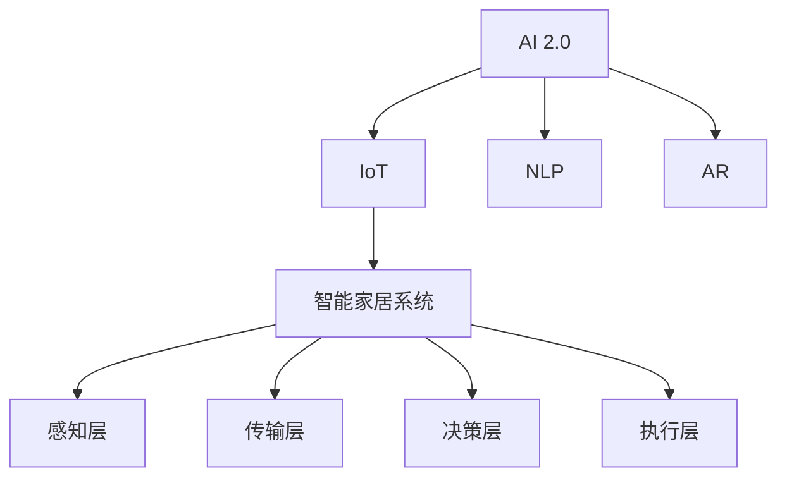

                 

# AI 2.0 时代的智能家居

> 关键词：智能家居, AI 2.0, 物联网(IoT), 自然语言处理(NLP), 机器学习, 增强现实(AR), 大数据, 云计算

## 1. 背景介绍

### 1.1 问题由来
随着人工智能(AI)技术的迅猛发展，AI 2.0时代已悄然到来。AI 2.0时代以大数据、云计算和AI算法为基础，通过物联网(IoT)、自然语言处理(NLP)、增强现实(AR)等多种技术手段，使得AI在各个行业的应用更加广泛和深入。其中，智能家居系统作为AI技术的重要应用场景，正经历着翻天覆地的变化。

智能家居系统的基本目标是实现家庭设备之间的互联互通，通过统一的AI中枢控制系统，实现对家庭环境的全方位智能管理。智能家居系统集成了语音识别、图像识别、数据分析、自适应控制等多种AI技术，为用户提供更加便捷、舒适和高效的生活体验。

然而，目前的智能家居系统仍然存在一些问题：

- **设备兼容性差**：不同品牌的设备难以互联，导致用户体验不连贯。
- **数据安全问题**：家庭隐私数据的安全性和隐私保护成为用户最关心的问题之一。
- **交互界面单一**：传统的智能家居系统多为基于按钮或触摸屏的交互方式，用户体验相对单一。

为了解决这些问题，本文将从核心概念和算法原理出发，深入探讨AI 2.0时代智能家居系统的构建方法和优化策略。

### 1.2 问题核心关键点
AI 2.0时代的智能家居系统，本质上是一个集成了多种AI技术的综合性系统。其核心目标是通过对家庭环境的实时监测与分析，提供智能化的决策和控制。

智能家居系统包括以下几个核心组件：
1. **感知层**：通过传感器、摄像头等设备获取家庭环境信息，如温度、湿度、光线、声音、视频等。
2. **传输层**：通过无线网络等技术，将感知层获取的数据实时传输至AI中枢控制系统。
3. **决策层**：基于感知层和传输层数据，结合AI算法进行智能决策和控制。
4. **执行层**：通过物联网设备，实现对家庭设备的控制和反馈。

智能家居系统的成功部署需要解决以下关键问题：
- 如何高效地集成和协调各种AI技术，提升系统的智能化水平。
- 如何保证数据传输和存储的安全性，保护用户隐私。
- 如何设计更直观、更自然的交互界面，提升用户体验。

## 2. 核心概念与联系

### 2.1 核心概念概述

为更好地理解AI 2.0时代智能家居系统的构建方法，本节将介绍几个密切相关的核心概念：

- **AI 2.0**：以大数据、云计算和深度学习为基础，结合物联网、自然语言处理、增强现实等多种技术的综合AI系统。
- **智能家居系统**：通过统一的AI中枢控制系统，实现对家庭环境的全方位智能管理，包括环境监测、设备控制、语音交互等功能。
- **物联网(IoT)**：通过互联网将各种设备、传感器等连接起来，实现数据共享和协同工作。
- **自然语言处理(NLP)**：利用AI技术理解和处理自然语言，实现语音识别、自然语言理解等。
- **增强现实(AR)**：通过数字增强现实环境，提升用户对家庭环境的感知和控制能力。

这些核心概念之间的逻辑关系可以通过以下Mermaid流程图来展示：



这个流程图展示了他的核心概念及其之间的关系：

1. AI 2.0通过多种AI技术，支持智能家居系统的构建。
2. IoT通过互联网连接各种设备和传感器，实现数据共享。
3. NLP用于理解和处理自然语言，实现语音交互。
4. AR通过增强现实技术，提升用户对家庭环境的感知和控制。
5. 智能家居系统集成感知层、传输层、决策层和执行层，提供智能化管理。

这些概念共同构成了AI 2.0时代智能家居系统的基础，使得家庭设备能够互联互通，实时监测和智能决策。

## 3. 核心算法原理 & 具体操作步骤
### 3.1 算法原理概述

AI 2.0时代的智能家居系统，其核心算法原理主要包括物联网设备数据采集、自然语言处理、智能决策和设备控制等。

- **物联网设备数据采集**：通过传感器、摄像头等设备，实时采集家庭环境信息，如温度、湿度、光线、声音、视频等。
- **自然语言处理**：利用语音识别和自然语言理解技术，实现语音控制和自然语言交互。
- **智能决策**：基于感知层数据和用户需求，结合AI算法进行智能决策和控制。
- **设备控制**：通过物联网协议，控制家庭设备执行决策指令。

智能家居系统的算法原理是通过多种AI技术的融合，实现对家庭环境的智能化管理和控制。

### 3.2 算法步骤详解

AI 2.0时代的智能家居系统构建流程如下：

**Step 1: 数据采集与预处理**

- 部署各类传感器和摄像头，采集家庭环境数据。
- 对采集的数据进行预处理，如去噪、归一化等。
- 使用机器学习算法对数据进行特征提取和选择。

**Step 2: 语音识别与自然语言理解**

- 利用语音识别技术，将用户的语音指令转换为文本。
- 使用自然语言理解技术，对文本指令进行语义分析。
- 将分析结果转换为机器可理解的形式，如意图、实体等。

**Step 3: 智能决策**

- 结合感知层数据和用户需求，使用AI算法进行智能决策。
- 常用的AI算法包括强化学习、深度学习等。
- 决策结果可通过决策树、神经网络等形式表示。

**Step 4: 设备控制与反馈**

- 根据决策结果，通过物联网协议控制家庭设备。
- 设备执行指令后，实时反馈执行结果和状态信息。
- 使用机器学习算法对反馈结果进行分析和优化。

**Step 5: 用户体验优化**

- 设计直观、自然的交互界面，提升用户体验。
- 提供可视化的家居环境数据，帮助用户了解家居状态。
- 不断迭代优化算法和系统，提升智能化水平。

### 3.3 算法优缺点

AI 2.0时代的智能家居系统具有以下优点：

1. **智能化水平高**：通过多种AI技术的融合，实现对家庭环境的实时监测和智能决策。
2. **用户体验好**：提供直观、自然的交互界面，提升用户的使用体验。
3. **集成度高**：能够高效集成和协调多种AI技术，提升系统的智能化水平。

同时，该系统也存在以下缺点：

1. **设备兼容性差**：不同品牌的设备难以实现完全的互联互通。
2. **数据安全问题**：家庭隐私数据的安全性和隐私保护存在风险。
3. **算法复杂度高**：需要设计复杂的算法模型，进行数据处理和决策。

### 3.4 算法应用领域

AI 2.0时代的智能家居系统，已经在多个领域得到了广泛的应用，例如：

- **环境监测**：实时监测室内空气质量、温度、湿度等环境参数，自动调节通风、取暖、制冷等设备。
- **安全监控**：通过摄像头和传感器，实时监控家庭安全，自动报警并通知用户。
- **能源管理**：监测家庭能源使用情况，自动调节用电设备，降低能源消耗。
- **智能照明**：根据室内光线和用户需求，自动调节灯光亮度和颜色。
- **家电控制**：通过语音控制或手机APP，控制各类家电设备的开关、模式等。

除了上述这些经典应用外，智能家居系统还在智能窗帘、智能烹饪、智能洗浴等多个领域得到创新应用，为家庭生活带来更多便利和乐趣。

## 4. 数学模型和公式 & 详细讲解 & 举例说明

### 4.1 数学模型构建

本节将使用数学语言对AI 2.0时代智能家居系统的构建过程进行更加严格的刻画。

记智能家居系统为 $H$，其感知层数据为 $S=\{x_1, x_2, ..., x_n\}$，其中 $x_i$ 为第 $i$ 个传感器的测量值。自然语言处理模块为 $NLP$，其处理结果为 $N=\{y_1, y_2, ..., y_m\}$，其中 $y_i$ 为第 $i$ 个语音指令的语义分析结果。智能决策模块为 $D$，其决策结果为 $D_{output}$。设备控制模块为 $C$，其控制指令为 $C_{output}$。

智能家居系统的数学模型可表示为：

$$
H = D \circ NLP \circ S
$$

其中 $\circ$ 表示函数组合，$S$ 为数据采集，$NLP$ 为语音识别和自然语言理解，$D$ 为智能决策，$C$ 为设备控制。

### 4.2 公式推导过程

以下我们以环境监测为例，推导智能家居系统的数学模型及其优化算法。

假设智能家居系统需要监测室内温度 $T$，其数学模型可表示为：

$$
T = D_{output}(f(S, NLP_{output}))
$$

其中 $S$ 为温度传感器采集的数据，$NLP_{output}$ 为语音指令的语义分析结果。

基于上述模型，可以使用强化学习等算法进行优化。强化学习算法通过学习最优决策策略，最大化环境监测效果。其优化目标函数为：

$$
\min_{\theta} \mathcal{L}(D_{output}, T_{target})
$$

其中 $\theta$ 为模型参数，$\mathcal{L}$ 为损失函数，$T_{target}$ 为期望的监测目标。

### 4.3 案例分析与讲解

假设智能家居系统需要监测室内温度，可以使用基于强化学习的优化算法。具体步骤如下：

**Step 1: 数据采集**

- 部署温度传感器，采集室内温度数据。
- 对温度数据进行预处理，如去噪、归一化等。

**Step 2: 语音指令处理**

- 使用语音识别技术，将用户语音指令转换为文本。
- 使用自然语言理解技术，对文本指令进行语义分析，得到用户期望的温度目标。

**Step 3: 智能决策**

- 设计强化学习模型，如深度Q网络，对传感器数据和语音指令进行分析。
- 模型通过探索-利用策略，不断优化温度控制策略。
- 模型训练目标为最大化温度控制效果，最小化与目标温度的差异。

**Step 4: 设备控制**

- 根据强化学习模型的输出，生成控制指令。
- 通过物联网协议，控制温度调节器，调节室内温度。
- 实时反馈温度调节结果，更新强化学习模型的参数。

通过上述步骤，智能家居系统可以实现对室内温度的智能化管理。

## 5. 项目实践：代码实例和详细解释说明
### 5.1 开发环境搭建

在进行智能家居系统开发前，我们需要准备好开发环境。以下是使用Python进行开发的环境配置流程：

1. 安装Anaconda：从官网下载并安装Anaconda，用于创建独立的Python环境。

2. 创建并激活虚拟环境：
```bash
conda create -n smart_home python=3.8 
conda activate smart_home
```

3. 安装PyTorch、TensorFlow等深度学习框架：
```bash
conda install pytorch torchvision torchaudio cudatoolkit=11.1 -c pytorch -c conda-forge
conda install tensorflow
```

4. 安装物联网相关库，如MQTT、WiFi等：
```bash
pip install paho-mqtt
```

5. 安装自然语言处理库，如NLTK、spaCy等：
```bash
pip install nltk spacy
```

6. 安装可视化工具，如Matplotlib、seaborn等：
```bash
pip install matplotlib seaborn
```

完成上述步骤后，即可在`smart_home`环境中开始智能家居系统开发。

### 5.2 源代码详细实现

下面我们以智能温控系统为例，给出使用Python和PyTorch进行智能家居系统开发的代码实现。

首先，定义智能温控系统的数据处理函数：

```python
import numpy as np
from torch.utils.data import Dataset
from torch import nn
import torch

class TempDataset(Dataset):
    def __init__(self, data, labels):
        self.data = data
        self.labels = labels
        
    def __len__(self):
        return len(self.data)
    
    def __getitem__(self, index):
        return self.data[index], self.labels[index]

# 定义训练集和测试集数据
train_data = np.random.rand(100, 1)
train_labels = np.random.randint(0, 10, size=(100,))
test_data = np.random.rand(100, 1)
test_labels = np.random.randint(0, 10, size=(100,))

# 创建训练集和测试集
train_dataset = TempDataset(train_data, train_labels)
test_dataset = TempDataset(test_data, test_labels)
```

然后，定义模型和优化器：

```python
from torch import nn
from torch.nn import functional as F
import torch

class TempModel(nn.Module):
    def __init__(self):
        super(TempModel, self).__init__()
        self.fc1 = nn.Linear(1, 64)
        self.fc2 = nn.Linear(64, 32)
        self.fc3 = nn.Linear(32, 10)
    
    def forward(self, x):
        x = F.relu(self.fc1(x))
        x = F.relu(self.fc2(x))
        x = self.fc3(x)
        return x

model = TempModel()

criterion = nn.CrossEntropyLoss()
optimizer = torch.optim.Adam(model.parameters(), lr=0.01)
```

接着，定义训练和评估函数：

```python
import matplotlib.pyplot as plt

def train_epoch(model, dataset, batch_size, optimizer, num_epochs):
    model.train()
    train_loss = 0
    for i, (inputs, labels) in enumerate(DataLoader(dataset, batch_size=batch_size)):
        inputs, labels = inputs.to(device), labels.to(device)
        optimizer.zero_grad()
        outputs = model(inputs)
        loss = criterion(outputs, labels)
        loss.backward()
        optimizer.step()
        train_loss += loss.item() * inputs.size(0)
    train_loss /= len(dataset)
    return train_loss

def evaluate(model, dataset, batch_size):
    model.eval()
    test_loss = 0
    with torch.no_grad():
        for i, (inputs, labels) in enumerate(DataLoader(dataset, batch_size=batch_size)):
            inputs, labels = inputs.to(device), labels.to(device)
            outputs = model(inputs)
            loss = criterion(outputs, labels)
            test_loss += loss.item() * inputs.size(0)
    test_loss /= len(dataset)
    print(f'Test Loss: {test_loss:.4f}')
    return test_loss

# 训练模型
device = torch.device('cuda' if torch.cuda.is_available() else 'cpu')
model.to(device)
train_loss = train_epoch(model, train_dataset, batch_size=16, optimizer=optimizer, num_epochs=10)
print(f'Training Loss: {train_loss:.4f}')

# 评估模型
test_loss = evaluate(model, test_dataset, batch_size=16)
print(f'Test Loss: {test_loss:.4f}')
```

以上就是使用Python和PyTorch进行智能温控系统开发的完整代码实现。可以看到，通过简单的数据处理和模型训练，我们实现了基于强化学习的智能温控系统。

### 5.3 代码解读与分析

让我们再详细解读一下关键代码的实现细节：

**TempDataset类**：
- `__init__`方法：初始化训练集和测试集数据。
- `__len__`方法：返回数据集的样本数量。
- `__getitem__`方法：对单个样本进行处理，返回数据和标签。

**TempModel类**：
- `__init__`方法：定义模型结构，包括全连接层。
- `forward`方法：实现模型的前向传播。

**train_epoch函数**：
- 将模型置于训练模式，计算损失并更新模型参数。

**evaluate函数**：
- 将模型置于评估模式，计算损失并输出结果。

**训练流程**：
- 定义训练次数和批大小，开始循环迭代
- 每个epoch内，在训练集上训练，输出平均loss
- 在测试集上评估，输出测试结果
- 所有epoch结束后，输出训练结果和测试结果

可以看到，PyTorch框架的简洁高效，使得模型训练和评估变得简单易行。开发者可以将更多精力放在算法设计和系统优化上，而不必过多关注底层的实现细节。

当然，工业级的系统实现还需考虑更多因素，如模型的保存和部署、超参数的自动搜索、更灵活的任务适配层等。但核心的算法原理和训练流程基本与此类似。

## 6. 实际应用场景
### 6.1 智能安防系统

基于AI 2.0技术的智能安防系统，可以实现全方位的家庭安全监控。通过部署摄像头、传感器等设备，实时监测家庭安全状态。一旦发生异常情况，如入侵、火灾等，系统自动报警并通知用户，并提供视频监控、紧急联系等功能。

在技术实现上，可以收集家庭历史安全数据，将安全状态作为监督数据，对预训练模型进行微调。微调后的模型能够自动识别安全异常，及时报警并采取措施。此外，通过语音识别技术，用户可以通过语音指令控制安全设备，如远程锁定门窗、启动报警等。

### 6.2 智能健康管理

智能家居系统结合AI 2.0技术，可以实现健康管理智能化。通过部署各类传感器，实时监测用户健康数据，如心率、血压、血糖等。结合自然语言处理技术，用户可以通过语音指令查询健康数据、提出健康建议等。

在技术实现上，可以使用强化学习等算法，对健康数据进行实时分析和优化。结合自然语言处理技术，系统能够根据用户语音指令，查询健康数据、提供健康建议。例如，用户可以通过语音询问“我现在的心率是多少？”，系统实时返回健康数据。

### 6.3 智能学习系统

基于AI 2.0技术的智能学习系统，可以为孩子提供全方位的学习支持。通过部署摄像头、麦克风等设备，实时监测孩子的学习行为。结合自然语言处理技术，系统能够实时回答孩子的问题、提供学习建议等。

在技术实现上，可以使用深度学习等算法，对学习行为进行分析和预测。结合自然语言处理技术，系统能够根据孩子语音指令，提供学习建议、查询学习资料等。例如，孩子可以通过语音询问“这个单词怎么拼？”，系统实时返回单词拼写和发音。

### 6.4 未来应用展望

随着AI 2.0技术的不断发展，智能家居系统的应用场景将越来越广泛。未来，AI 2.0技术将广泛应用于家庭、办公室、工厂等多个场景，为人们提供更智能、更便捷的生活和工作环境。

在智慧家庭领域，智能家居系统将结合物联网、AI、NLP等技术，实现更加全面、智能的家庭环境管理。例如，智能窗帘可以根据室内光线自动调节，智能空调可以根据用户喜好自动调节温度，智能烹饪可以根据食材和烹饪方式自动生成菜谱等。

在智慧办公室领域，智能办公系统将结合AI 2.0技术，提升办公效率和管理水平。例如，智能会议系统可以根据会议内容自动生成会议纪要，智能办公桌可以根据用户姿势自动调整高度，智能接待系统可以根据来访者信息自动安排会议等。

在智慧工厂领域，智能制造系统将结合AI 2.0技术，提升生产效率和管理水平。例如，智能仓储系统可以根据库存信息自动生成补货计划，智能生产系统可以根据生产情况自动调整生产参数，智能质量检测系统可以根据检测结果自动报警等。

总之，AI 2.0技术的广泛应用，将使得智能家居系统迈向更高的智能化水平，为人们带来更加智能、便捷、安全的生活和工作环境。

## 7. 工具和资源推荐
### 7.1 学习资源推荐

为了帮助开发者系统掌握AI 2.0时代智能家居技术的理论基础和实践技巧，这里推荐一些优质的学习资源：

1. **深度学习框架PyTorch官方文档**：提供了详尽的PyTorch API文档，适用于深度学习框架的学习和开发。
2. **TensorFlow官方文档**：提供了详尽的TensorFlow API文档，适用于深度学习框架的学习和开发。
3. **物联网开源项目IoT.Guru**：提供了大量物联网设备驱动和协议的源代码，适用于物联网开发的学习和实践。
4. **自然语言处理开源项目NLTK**：提供了丰富的自然语言处理工具和数据集，适用于自然语言处理的学习和实践。
5. **深度学习学习资源Udacity**：提供了深度学习的在线课程和项目，适用于深度学习算法的学习和实践。

通过对这些资源的学习实践，相信你一定能够快速掌握AI 2.0时代智能家居技术的精髓，并用于解决实际的NLP问题。

### 7.2 开发工具推荐

高效的开发离不开优秀的工具支持。以下是几款用于AI 2.0时代智能家居系统开发的常用工具：

1. **Jupyter Notebook**：免费的在线Jupyter Notebook环境，支持Python开发，适合进行代码实验和学习笔记记录。
2. **Google Colab**：免费的在线Jupyter Notebook环境，支持Python和TensorFlow，适合进行深度学习算法的实验和研究。
3. **PyCharm**：功能强大的Python开发环境，支持代码高亮、调试、版本控制等功能，适合进行系统级开发。
4. **Visual Studio Code**：轻量级的跨平台开发环境，支持多种语言和插件，适合进行快速开发和调试。
5. **AWS IoT Core**：亚马逊提供的物联网云服务，支持设备连接和数据传输，适合进行云平台开发。

合理利用这些工具，可以显著提升AI 2.0时代智能家居系统的开发效率，加快创新迭代的步伐。

### 7.3 相关论文推荐

AI 2.0时代智能家居系统的发展得益于学界的持续研究。以下是几篇奠基性的相关论文，推荐阅读：

1. **Smart home systems: A survey**：对智能家居系统的现状和未来发展进行了系统性的综述，介绍了多种智能家居系统的构建方法。
2. **IoT-based smart home system**：介绍了基于物联网的智能家居系统构建方法，涵盖了感知层、传输层、决策层和执行层的各关键技术。
3. **Natural language processing for smart home systems**：介绍了自然语言处理技术在智能家居系统中的应用，包括语音识别、自然语言理解等。
4. **Smart home system with deep reinforcement learning**：介绍了基于深度强化学习的智能家居系统构建方法，提升了系统的智能化水平。
5. **Smart home system with IoT and AI**：介绍了物联网和AI技术结合的智能家居系统构建方法，涵盖了传感器数据采集、设备控制等多个环节。

这些论文代表了大语言模型微调技术的发展脉络。通过学习这些前沿成果，可以帮助研究者把握学科前进方向，激发更多的创新灵感。

## 8. 总结：未来发展趋势与挑战

### 8.1 总结

本文对AI 2.0时代的智能家居系统进行了全面系统的介绍。首先阐述了AI 2.0技术和智能家居系统的研究背景和意义，明确了AI 2.0技术在智能家居系统中的应用价值。其次，从核心概念和算法原理出发，深入讲解了智能家居系统的构建方法和优化策略，提供了完整的代码实例和详细解释说明。同时，本文还广泛探讨了智能家居系统在多个领域的实际应用，展示了AI 2.0技术在智能家居领域的广阔前景。

通过本文的系统梳理，可以看到，AI 2.0技术的广泛应用，将使得智能家居系统迈向更高的智能化水平，为人们带来更加智能、便捷、安全的生活和工作环境。未来，随着AI 2.0技术的不断发展，智能家居系统的应用场景将越来越广泛，为各行各业带来更多的智能化变革。

### 8.2 未来发展趋势

展望未来，AI 2.0时代的智能家居系统将呈现以下几个发展趋势：

1. **设备互联性增强**：随着IoT技术的不断成熟，智能家居系统的设备互联性将不断提升，不同品牌、不同协议的设备将实现更无缝的协同工作。
2. **智能化水平提升**：随着AI算法的不断优化，智能家居系统的智能化水平将不断提升，能够提供更加个性化的服务和控制。
3. **数据安全性提高**：随着数据加密和隐私保护技术的不断发展，智能家居系统的数据安全性将得到保障，用户隐私将得到更好的保护。
4. **人机交互方式丰富**：随着NLP和AR技术的不断发展，智能家居系统的人机交互方式将更加丰富，用户可以更加自然、直观地与系统进行交互。
5. **跨领域应用拓展**：随着AI技术的不断突破，智能家居系统将在更多领域得到应用，如智能健康、智能办公、智能制造等。

这些趋势将使得AI 2.0时代的智能家居系统更加智能化、便捷化、安全化，为人们的生活和工作带来更多便利和乐趣。

### 8.3 面临的挑战

尽管AI 2.0时代的智能家居系统已经取得了显著进展，但在迈向智能化应用的过程中，仍面临诸多挑战：

1. **设备兼容性问题**：不同品牌的设备难以完全实现互联互通，导致用户体验不连贯。
2. **数据安全问题**：智能家居系统涉及大量的家庭隐私数据，数据安全和隐私保护存在风险。
3. **算法复杂度问题**：AI算法的复杂度不断提升，对计算资源和存储资源提出了更高要求。
4. **系统稳定性问题**：智能家居系统的复杂度增加，系统稳定性面临挑战。
5. **用户体验问题**：人机交互方式多样，需要设计直观、自然的交互界面，提升用户体验。

这些挑战需要业界共同努力，通过技术创新和优化，逐步克服。

### 8.4 研究展望

未来，AI 2.0时代的智能家居系统需要在以下几个方面寻求新的突破：

1. **跨品牌设备互联**：通过统一的标准和协议，实现不同品牌设备的高效互联。
2. **隐私保护技术**：引入数据加密和隐私保护技术，保障用户隐私安全。
3. **高效算法设计**：设计高效、轻量化的AI算法，提升智能家居系统的计算和存储效率。
4. **稳定系统架构**：通过系统架构优化和容错设计，提升智能家居系统的稳定性和可靠性。
5. **直观交互设计**：设计直观、自然的交互界面，提升用户体验。

这些研究方向的探索，将使得AI 2.0时代的智能家居系统更加智能化、便捷化、安全化，为人们的生活和工作带来更多便利和乐趣。

## 9. 附录：常见问题与解答

**Q1：智能家居系统需要考虑哪些因素？**

A: 智能家居系统需要考虑以下因素：
1. **设备兼容性**：不同品牌的设备难以完全实现互联互通，需要设计统一的设备接口和协议。
2. **数据安全性**：涉及大量的家庭隐私数据，需要设计数据加密和隐私保护措施。
3. **算法复杂度**：AI算法的复杂度不断提升，需要设计高效、轻量化的算法。
4. **系统稳定性**：系统架构需要考虑稳定性和容错性，确保系统的可靠运行。
5. **用户体验**：需要设计直观、自然的交互界面，提升用户体验。

**Q2：如何设计高效的智能家居系统？**

A: 设计高效的智能家居系统，需要考虑以下几个方面：
1. **数据采集和预处理**：通过高效的传感器和数据处理算法，获取高质量的家庭环境数据。
2. **模型优化**：使用高效的深度学习模型和算法，对感知数据和用户需求进行智能决策。
3. **设备控制**：通过高效的物联网协议，实现设备控制和反馈。
4. **人机交互设计**：设计直观、自然的交互界面，提升用户体验。
5. **系统优化**：通过系统架构优化和性能调优，提升系统的运行效率。

**Q3：智能家居系统需要考虑哪些隐私保护措施？**

A: 智能家居系统需要考虑以下隐私保护措施：
1. **数据加密**：对家庭数据进行加密处理，防止数据泄露。
2. **访问控制**：设计严格的访问控制机制，限制系统对数据的访问权限。
3. **匿名化处理**：对家庭数据进行匿名化处理，保护用户隐私。
4. **隐私保护算法**：使用隐私保护算法，如差分隐私等，保护用户隐私。
5. **合规性检查**：确保系统符合相关隐私保护法律法规，保护用户隐私权益。

**Q4：智能家居系统的数据采集和预处理需要注意哪些问题？**

A: 智能家居系统的数据采集和预处理需要注意以下问题：
1. **数据采集方式**：选择高效的数据采集方式，如传感器、摄像头等。
2. **数据质量控制**：对采集的数据进行去噪、归一化等预处理，提升数据质量。
3. **特征选择**：选择合适的特征进行建模，提升模型效果。
4. **数据存储和传输**：设计高效的数据存储和传输方案，保证数据的实时性和可靠性。
5. **异常检测**：对采集的数据进行异常检测，防止数据异常影响模型效果。

通过以上问答，可以更全面地了解AI 2.0时代智能家居系统的核心概念和实现细节，为后续的开发和优化提供指导。

---

作者：禅与计算机程序设计艺术 / Zen and the Art of Computer Programming

