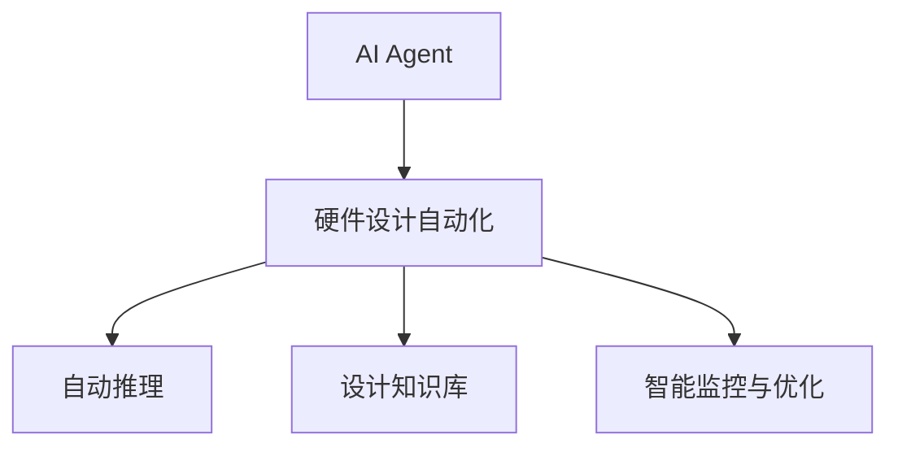

                 

# AI Agent: AI的下一个风口 具身智能在硬件设计中的应用

> 关键词：硬件设计,具身智能,人工智能,设计自动化,智能制造,自动推理,机器学习

## 1. 背景介绍

随着人工智能（AI）技术的不断进步，AI Agent作为一种能够自主感知、理解和执行任务的系统，正在逐步渗透到各个领域，从自动驾驶、机器人到医疗、金融等，AI Agent的应用场景正在迅速扩展。与此同时，硬件设计作为技术创新和产业发展的重要支撑，正面临着复杂性和不确定性不断提高的挑战。将AI Agent引入硬件设计，可以有效提升设计效率、降低设计成本、提高设计精度，成为AI技术在硬件领域应用的重要趋势。

### 1.1 问题由来

传统的硬件设计流程包括需求分析、概念设计、电路仿真、版图设计、测试验证等诸多环节，每个环节都需要大量的人工介入和专业知识，且存在高错误率、低效率等问题。这种依赖人工经验的设计方式，不仅难以应对复杂系统的设计需求，也难以适应快速迭代的市场变化。因此，迫切需要引入智能技术，实现设计过程的自动化和智能化，从而提升设计效率、降低成本、缩短上市时间。

### 1.2 问题核心关键点

AI Agent在硬件设计中的应用，旨在通过人工智能技术，使设计过程具备更高的智能化、自动化水平，具体包括：

- 设计自动推理：基于深度学习、强化学习等AI技术，实现电路和版图设计的自动优化和推理。
- 设计知识迁移：将已有的设计经验、设计知识迁移到新项目的设计过程中，提升设计准确性和创新性。
- 设计过程优化：通过智能监控和优化设计流程，消除瓶颈、提高效率。

## 2. 核心概念与联系

### 2.1 核心概念概述

为更好地理解AI Agent在硬件设计中的应用，本节将介绍几个密切相关的核心概念：

- AI Agent：一种具备自主感知、理解、执行任务的智能系统，可以模拟人类专家的决策过程，辅助完成设计任务。
- 硬件设计自动化：通过人工智能技术，实现硬件设计流程的自动化，减少人工干预，提高设计效率和准确性。
- 自动推理：利用AI算法，从已有设计库或数据集中推断出最优设计方案。
- 设计知识库：包含设计经验、规则、算法等，是AI Agent在硬件设计中应用的基石。
- 智能监控与优化：对设计过程进行实时监控和反馈，优化设计流程和结果。

这些核心概念之间的逻辑关系可以通过以下Mermaid流程图来展示：



这个流程图展示了我們的主要核心概念及其之间的关系：

1. AI Agent通过设计自动化技术，应用于硬件设计流程。
2. 设计自动化包括自动推理、设计知识库以及智能监控与优化三个环节。
3. 自动推理从已有的设计库或数据集中推断出最优设计方案。
4. 设计知识库包含设计经验、规则、算法等，是AI Agent设计应用的基石。
5. 智能监控与优化对设计过程进行实时监控和反馈，优化设计流程和结果。

## 3. 核心算法原理 & 具体操作步骤
### 3.1 算法原理概述

AI Agent在硬件设计中的应用，主要是通过AI算法和设计自动化技术，实现对硬件设计过程的智能化辅助。其核心算法包括深度学习、强化学习、自动推理等，在硬件设计中的具体应用包括：

- 电路设计自动优化：利用深度学习算法，对电路结构进行优化设计，提升性能和可靠性。
- 版图设计自动布局：应用深度学习、遗传算法等，实现版图设计的自动化布局和优化。
- 设计知识库的构建：通过机器学习算法，从历史设计数据中学习提取设计知识，构建知识库。

### 3.2 算法步骤详解

基于AI Agent的硬件设计自动化流程一般包括以下几个关键步骤：

**Step 1: 数据准备**
- 收集和整理历史设计数据，包括电路图、版图、仿真数据等，构建设计数据集。
- 对数据进行预处理，如特征提取、归一化、标注等。

**Step 2: 模型选择与训练**
- 根据设计任务选择适合的AI模型，如神经网络、强化学习模型等。
- 在数据集上进行模型训练，调整模型参数，优化模型性能。

**Step 3: 设计自动推理**
- 将待设计任务输入AI Agent，利用训练好的模型进行自动推理。
- 对于电路设计任务，AI Agent可以自动选择最优的电路结构、器件参数等。
- 对于版图设计任务，AI Agent可以自动进行版图布局和优化。

**Step 4: 设计知识库构建**
- 将AI Agent在设计过程中学到的经验、规则、算法等，进行封装和存储。
- 构建设计知识库，用于新项目的自动化设计和参考。

**Step 5: 智能监控与优化**
- 实时监控设计过程，捕捉异常和瓶颈。
- 根据监控结果，对设计过程进行实时优化，提高设计效率和准确性。

### 3.3 算法优缺点

基于AI Agent的硬件设计自动化方法具有以下优点：
1. 设计自动化：大幅减少人工干预，提高设计效率。
2. 设计精度提升：利用AI算法优化设计方案，提高设计精度和可靠性。
3. 设计经验迁移：将设计知识迁移到新项目，提升创新能力。
4. 设计成本降低：减少设计人员的工作量，降低设计成本。
5. 设计流程优化：实时监控和优化设计过程，提高设计效率。

同时，该方法也存在一些局限性：
1. 数据质量依赖：设计自动化效果受限于数据质量和完整性。
2. 模型通用性不足：不同的设计任务需要不同的AI模型，模型迁移能力有限。
3. 设计复杂度增加：引入AI技术后，设计流程可能变得更加复杂。
4. 部署难度较大：AI Agent的应用需要高性能计算和数据存储，对硬件设备要求较高。
5. 设计鲁棒性不足：AI Agent可能对设计中的噪声和异常情况不敏感，鲁棒性有待提升。

尽管存在这些局限性，但基于AI Agent的硬件设计自动化方法仍是大规模硬件设计中一种高效的解决方案。未来相关研究的重点在于如何进一步提升AI Agent的设计自动化能力，降低数据和模型依赖，提高设计的鲁棒性和泛化能力。

### 3.4 算法应用领域

基于AI Agent的硬件设计自动化方法，已在多个领域得到了广泛应用，例如：

- 集成电路设计：包括数字电路、模拟电路等。利用AI技术自动设计电路结构、器件参数等，提升设计效率和精度。
- 嵌入式系统设计：通过AI设计优化电路结构和版图布局，提高嵌入式系统的性能和可靠性。
- 射频设计：应用AI技术对射频电路进行自动设计和优化，提升通信系统的性能。
- 传感器设计：利用AI技术优化传感器电路设计和版图布局，提升传感器性能和灵敏度。
- 生物电子设计：应用AI技术设计生物兼容的电子设备，提升医疗设备的性能和安全性。

除了上述这些经典应用外，AI Agent在硬件设计中的应用还在不断拓展，如智能制造、自动驾驶、智能家居等，为硬件领域的智能化转型提供了新的技术路径。

## 4. 数学模型和公式 & 详细讲解 & 举例说明
### 4.1 数学模型构建

本节将使用数学语言对基于AI Agent的硬件设计自动化过程进行更加严格的刻画。

记设计任务为 $T$，设计数据集为 $D=\{(x_i,y_i)\}_{i=1}^N$，其中 $x_i$ 为设计样本，$y_i$ 为对应的设计目标。定义设计自动化模型为 $M_{\theta}:\mathcal{X} \rightarrow \mathcal{Y}$，其中 $\mathcal{X}$ 为设计输入空间，$\mathcal{Y}$ 为设计输出空间，$\theta \in \mathbb{R}^d$ 为模型参数。

定义模型 $M_{\theta}$ 在数据样本 $(x,y)$ 上的损失函数为 $\ell(M_{\theta}(x),y)$，则在数据集 $D$ 上的经验风险为：

$$
\mathcal{L}(\theta) = \frac{1}{N} \sum_{i=1}^N \ell(M_{\theta}(x_i),y_i)
$$

其中 $\ell$ 为具体的设计任务对应的损失函数，如电路设计中的布线优化损失函数，版图设计中的版图布局损失函数等。

微调的目标是最小化经验风险，即找到最优参数：

$$
\theta^* = \mathop{\arg\min}_{\theta} \mathcal{L}(\theta)
$$

在实践中，我们通常使用基于梯度的优化算法（如SGD、Adam等）来近似求解上述最优化问题。设 $\eta$ 为学习率，$\lambda$ 为正则化系数，则参数的更新公式为：

$$
\theta \leftarrow \theta - \eta \nabla_{\theta}\mathcal{L}(\theta) - \eta\lambda\theta
$$

其中 $\nabla_{\theta}\mathcal{L}(\theta)$ 为损失函数对参数 $\theta$ 的梯度，可通过反向传播算法高效计算。

### 4.2 公式推导过程

以下我们以电路设计自动优化为例，推导神经网络模型的自动优化过程。

假设设计任务为电路布线优化，输入为电路结构描述 $x$，输出为最优布线方案 $y$。神经网络模型的输出为布线方案 $M_{\theta}(x)$，与真实布线方案 $y$ 的差异通过均方误差损失函数 $\ell$ 来衡量。

$$
\ell(M_{\theta}(x),y) = \frac{1}{2} \|M_{\theta}(x) - y\|^2
$$

定义模型的损失函数为：

$$
\mathcal{L}(\theta) = \frac{1}{N} \sum_{i=1}^N \ell(M_{\theta}(x_i),y_i)
$$

利用反向传播算法，计算损失函数对参数 $\theta$ 的梯度：

$$
\nabla_{\theta}\mathcal{L}(\theta) = \frac{1}{N} \sum_{i=1}^N (M_{\theta}(x_i) - y_i) \nabla_{\theta}M_{\theta}(x_i)
$$

其中 $\nabla_{\theta}M_{\theta}(x_i)$ 为输出层对输入层的梯度，可通过链式法则计算得到。

在得到损失函数的梯度后，即可带入参数更新公式，完成模型的迭代优化。重复上述过程直至收敛，最终得到适应电路布线优化任务的最优模型参数 $\theta^*$。

### 4.3 案例分析与讲解

下面以实际案例进一步分析基于AI Agent的硬件设计自动化方法。

**案例：集成电路设计中的自动优化**

在集成电路设计中，自动优化电路布线是提高电路性能和可靠性的关键环节。传统电路布线需要设计人员手动选择布线路径、器件参数等，既耗时又容易出错。

假设某集成电路设计问题可以通过深度学习模型进行求解，设计数据集 $D$ 包含历史电路图和对应的布线方案。模型的输入为电路结构描述 $x$，输出为布线方案 $y$。

**步骤1：数据准备**
- 收集和整理历史电路设计数据 $D=\{(x_i,y_i)\}_{i=1}^N$，包括电路图、布线方案、器件参数等。
- 对数据进行预处理，提取关键特征，如线路长度、器件位置、布线密度等。

**步骤2：模型选择与训练**
- 选择深度神经网络模型，如卷积神经网络（CNN）、长短时记忆网络（LSTM）等，作为自动优化模型。
- 在数据集 $D$ 上进行模型训练，调整网络结构、学习率等超参数，优化模型性能。

**步骤3：设计自动推理**
- 将待优化电路图 $x$ 输入模型 $M_{\theta}$，自动推理得到最优布线方案 $y$。
- 模型输出包括布线路径、器件参数、布线密度等，满足电路性能和可靠性要求。

**步骤4：智能监控与优化**
- 实时监控布线过程，捕捉异常和瓶颈。
- 根据监控结果，对布线过程进行实时优化，提升设计效率和准确性。

通过上述流程，AI Agent可以自动完成电路布线优化，大幅提高设计效率和精度。

## 5. 项目实践：代码实例和详细解释说明
### 5.1 开发环境搭建

在进行AI Agent硬件设计自动化的项目实践前，我们需要准备好开发环境。以下是使用Python进行PyTorch开发的环境配置流程：

1. 安装Anaconda：从官网下载并安装Anaconda，用于创建独立的Python环境。

2. 创建并激活虚拟环境：
```bash
conda create -n pytorch-env python=3.8 
conda activate pytorch-env
```

3. 安装PyTorch：根据CUDA版本，从官网获取对应的安装命令。例如：
```bash
conda install pytorch torchvision torchaudio cudatoolkit=11.1 -c pytorch -c conda-forge
```

4. 安装Transformers库：
```bash
pip install transformers
```

5. 安装各类工具包：
```bash
pip install numpy pandas scikit-learn matplotlib tqdm jupyter notebook ipython
```

完成上述步骤后，即可在`pytorch-env`环境中开始微调实践。

### 5.2 源代码详细实现

下面我们以电路布线优化为例，给出使用PyTorch进行深度神经网络模型训练的PyTorch代码实现。

首先，定义电路布线优化问题：

```python
import torch
import torch.nn as nn
import torch.optim as optim

class CircuitDesignNet(nn.Module):
    def __init__(self):
        super(CircuitDesignNet, self).__init__()
        self.cnn1 = nn.Conv2d(1, 64, 3, padding=1)
        self.relu1 = nn.ReLU()
        self.maxpool1 = nn.MaxPool2d(2)
        self.cnn2 = nn.Conv2d(64, 128, 3, padding=1)
        self.relu2 = nn.ReLU()
        self.maxpool2 = nn.MaxPool2d(2)
        self.fc1 = nn.Linear(128 * 28 * 28, 1024)
        self.relu3 = nn.ReLU()
        self.fc2 = nn.Linear(1024, 128)
        self.relu4 = nn.ReLU()
        self.fc3 = nn.Linear(128, 2)

    def forward(self, x):
        x = self.cnn1(x)
        x = self.relu1(x)
        x = self.maxpool1(x)
        x = self.cnn2(x)
        x = self.relu2(x)
        x = self.maxpool2(x)
        x = x.view(-1, 128 * 28 * 28)
        x = self.fc1(x)
        x = self.relu3(x)
        x = self.fc2(x)
        x = self.relu4(x)
        x = self.fc3(x)
        return x

# 训练超参数
batch_size = 32
learning_rate = 0.001
num_epochs = 10
```

然后，定义训练和评估函数：

```python
def train_epoch(model, optimizer, data_loader):
    model.train()
    running_loss = 0.0
    for batch_idx, (inputs, targets) in enumerate(data_loader):
        inputs, targets = inputs.to(device), targets.to(device)
        optimizer.zero_grad()
        outputs = model(inputs)
        loss = loss_fn(outputs, targets)
        loss.backward()
        optimizer.step()
        running_loss += loss.item()
    return running_loss / len(data_loader)

def evaluate(model, data_loader):
    model.eval()
    running_loss = 0.0
    with torch.no_grad():
        for batch_idx, (inputs, targets) in enumerate(data_loader):
            inputs, targets = inputs.to(device), targets.to(device)
            outputs = model(inputs)
            loss = loss_fn(outputs, targets)
            running_loss += loss.item()
    return running_loss / len(data_loader)
```

最后，启动训练流程并在测试集上评估：

```python
device = torch.device("cuda" if torch.cuda.is_available() else "cpu")

# 加载模型和数据集
model = CircuitDesignNet().to(device)
loss_fn = nn.MSELoss()
optimizer = optim.Adam(model.parameters(), lr=learning_rate)

# 训练模型
for epoch in range(num_epochs):
    train_loss = train_epoch(model, optimizer, train_loader)
    test_loss = evaluate(model, test_loader)
    print(f"Epoch {epoch+1}, train loss: {train_loss:.4f}, test loss: {test_loss:.4f}")

# 保存模型
torch.save(model.state_dict(), 'circuit_design_model.pt')
```

以上就是使用PyTorch进行深度神经网络模型训练的完整代码实现。可以看到，得益于PyTorch的强大封装和易用性，我们可以用相对简洁的代码完成电路布线优化模型的训练和评估。

### 5.3 代码解读与分析

让我们再详细解读一下关键代码的实现细节：

**CircuitDesignNet类**：
- `__init__`方法：定义神经网络结构，包括卷积层、全连接层等。
- `forward`方法：定义前向传播过程，逐层计算输出。

**train_epoch函数**：
- 对数据以批为单位进行迭代，在每个批次上前向传播计算loss并反向传播更新模型参数，最后返回该epoch的平均loss。

**evaluate函数**：
- 与训练类似，不同点在于不更新模型参数，并在每个batch结束后将预测和标签结果存储下来，最后使用均方误差（MSE）计算评估指标。

**训练流程**：
- 定义总的epoch数和batch size，开始循环迭代
- 每个epoch内，先在训练集上训练，输出平均loss
- 在测试集上评估，输出平均loss
- 所有epoch结束后，保存模型参数

可以看到，PyTorch配合TensorFlow库使得电路布线优化模型的训练代码实现变得简洁高效。开发者可以将更多精力放在数据处理、模型改进等高层逻辑上，而不必过多关注底层的实现细节。

当然，工业级的系统实现还需考虑更多因素，如模型的保存和部署、超参数的自动搜索、更灵活的任务适配层等。但核心的训练范式基本与此类似。

## 6. 实际应用场景
### 6.1 智能制造

AI Agent在智能制造中的应用，可以显著提升制造流程的自动化程度，降低生产成本，提高生产效率和产品质量。通过AI技术，可以实现对生产线的实时监控和调度，自动调整生产参数，优化生产流程。

在具体实现中，可以应用AI Agent进行生产线的自动化设计、优化和维护，实现智能制造的自动化、智能化。通过AI Agent对生产数据的实时分析，可以发现生产中的异常情况，及时进行预警和处理，保障生产过程的稳定性和可靠性。

### 6.2 自动驾驶

自动驾驶是AI Agent在硬件设计中的应用热点之一。利用AI Agent，可以实时监控和分析交通状况，自动规划和调整驾驶路径，提高驾驶安全和效率。

在自动驾驶系统中，AI Agent可以应用在传感器数据处理、目标检测、路径规划等关键环节。通过AI Agent对传感器的数据进行实时分析和处理，可以识别出道路上的障碍物、行人、车辆等目标，及时做出反应。在路径规划过程中，AI Agent可以结合实时路况、交通规则等，自动生成最优的驾驶路径，确保行驶安全。

### 6.3 智能家居

智能家居系统集成了大量的传感器、执行器等硬件设备，其设计复杂度很高。利用AI Agent，可以实现对智能家居系统的自动化设计和优化，提升用户体验和系统性能。

在智能家居设计中，AI Agent可以应用在设备协同、环境感知、个性化推荐等环节。通过AI Agent对用户行为进行实时分析和建模，可以个性化推荐家居设备的操作方案，提升用户体验。在设备协同过程中，AI Agent可以实时监控设备状态，自动调整设备运行参数，确保家居系统的稳定性和可靠性。

### 6.4 未来应用展望

随着AI Agent技术的发展，其在硬件设计中的应用前景将更加广阔，有望在更多领域得到广泛应用。

- 自动化设计：基于AI Agent的硬件设计自动化方法，可以实现对复杂系统的自动化设计和优化，提高设计效率和精度。
- 智能监控与优化：AI Agent可以实时监控和优化设计过程，提高设计效率和准确性。
- 多领域应用：AI Agent在自动驾驶、智能制造、智能家居等领域的应用将更加深入，推动智能技术的普及和应用。

## 7. 工具和资源推荐
### 7.1 学习资源推荐

为了帮助开发者系统掌握AI Agent硬件设计自动化的理论基础和实践技巧，这里推荐一些优质的学习资源：

1. 《深度学习》系列博文：由深度学习专家撰写，深入浅出地介绍了深度学习的基本概念和经典算法，适合初学者和进阶者。

2. 《TensorFlow官方文档》：TensorFlow的官方文档，提供了丰富的API和样例代码，是学习和使用TensorFlow的必备资源。

3. 《PyTorch官方文档》：PyTorch的官方文档，提供了详细的API和样例代码，是学习和使用PyTorch的必备资源。

4. 《硬件设计自动化》书籍：介绍硬件设计自动化的原理、方法、工具等，适合硬件设计和AI技术交叉领域的从业者。

5. 《智能制造》书籍：介绍智能制造的技术、方法、应用等，适合智能制造领域的研究者和从业者。

通过对这些资源的学习实践，相信你一定能够快速掌握AI Agent硬件设计自动化的精髓，并用于解决实际的硬件设计问题。
###  7.2 开发工具推荐

高效的开发离不开优秀的工具支持。以下是几款用于AI Agent硬件设计自动化开发的常用工具：

1. PyTorch：基于Python的开源深度学习框架，灵活动态的计算图，适合快速迭代研究。大部分预训练语言模型都有PyTorch版本的实现。

2. TensorFlow：由Google主导开发的开源深度学习框架，生产部署方便，适合大规模工程应用。同样有丰富的预训练语言模型资源。

3. Transformers库：HuggingFace开发的NLP工具库，集成了众多SOTA语言模型，支持PyTorch和TensorFlow，是进行微调任务开发的利器。

4. Weights & Biases：模型训练的实验跟踪工具，可以记录和可视化模型训练过程中的各项指标，方便对比和调优。与主流深度学习框架无缝集成。

5. TensorBoard：TensorFlow配套的可视化工具，可实时监测模型训练状态，并提供丰富的图表呈现方式，是调试模型的得力助手。

6. Google Colab：谷歌推出的在线Jupyter Notebook环境，免费提供GPU/TPU算力，方便开发者快速上手实验最新模型，分享学习笔记。

合理利用这些工具，可以显著提升AI Agent硬件设计自动化的开发效率，加快创新迭代的步伐。

### 7.3 相关论文推荐

AI Agent硬件设计自动化的发展源于学界的持续研究。以下是几篇奠基性的相关论文，推荐阅读：

1. "A Survey on Circuit-Level Hardware-SoC Design Automation"：介绍硬件设计自动化领域的研究现状和最新进展。

2. "Autonomous Design and Optimization of Circuit Design Using Machine Learning"：利用机器学习算法优化电路设计过程，提升设计效率和精度。

3. "AI-Driven Hardware Design Automation: An Overview"：全面综述AI在硬件设计自动化中的应用，涵盖自动推理、智能监控等多个环节。

4. "Smart Manufacturing: An Overview of AI and Automation in Manufacturing"：介绍AI技术在智能制造中的应用，涵盖数据驱动制造、智能控制等多个方面。

5. "Deep Learning in Autonomous Driving: A Survey"：全面综述深度学习在自动驾驶中的应用，涵盖感知、决策等多个环节。

这些论文代表了大规模硬件设计中应用AI Agent的研究方向。通过学习这些前沿成果，可以帮助研究者把握学科前进方向，激发更多的创新灵感。

## 8. 总结：未来发展趋势与挑战
### 8.1 研究成果总结

本文对基于AI Agent的硬件设计自动化方法进行了全面系统的介绍。首先阐述了AI Agent在硬件设计中的应用背景和意义，明确了硬件设计自动化在提升设计效率、降低设计成本、提高设计精度等方面的重要作用。其次，从原理到实践，详细讲解了AI Agent在硬件设计中的核心算法和具体操作步骤，给出了硬件设计自动化的完整代码实例。同时，本文还广泛探讨了AI Agent在智能制造、自动驾驶、智能家居等多个领域的应用前景，展示了AI Agent硬件设计自动化的广阔前景。此外，本文精选了硬件设计自动化的学习资源，力求为读者提供全方位的技术指引。

通过本文的系统梳理，可以看到，基于AI Agent的硬件设计自动化方法正在成为硬件设计领域的重要趋势，极大地拓展了硬件设计人员的创新能力，提升了设计效率和设计质量。未来，随着AI技术的不断进步，AI Agent在硬件设计中的应用将更加广泛和深入，进一步推动智能技术在硬件领域的普及和应用。

### 8.2 未来发展趋势

展望未来，AI Agent硬件设计自动化的发展趋势将呈现以下几个方向：

1. 自动化水平提升：随着AI技术的不断进步，AI Agent在硬件设计中的应用将更加广泛和深入，自动化设计水平将不断提升。

2. 设计精度和鲁棒性提升：通过AI技术优化设计方案，可以提升设计的精度和鲁棒性，增强系统的稳定性和可靠性。

3. 跨领域应用拓展：AI Agent在硬件设计中的应用将不再局限于电路设计，而是在更多领域如传感器设计、嵌入式系统设计等得到应用。

4. 多模态融合：AI Agent将多模态信息进行融合，如视觉、语音、文字等多模态信息，提升系统的感知和决策能力。

5. 智能监控与优化：实时监控和优化设计过程，提高设计效率和准确性，为智能制造、智能家居等领域的自动化设计提供支撑。

这些趋势凸显了AI Agent硬件设计自动化的广阔前景，相信未来将在更多领域得到广泛应用，为人类生产生活带来深远影响。

### 8.3 面临的挑战

尽管AI Agent硬件设计自动化技术正在快速发展，但在迈向更加智能化、普适化应用的过程中，它仍面临诸多挑战：

1. 数据质量依赖：硬件设计自动化效果受限于设计数据的质量和完整性，如何获取高质量的设计数据是一个重要问题。

2. 模型通用性不足：不同的设计任务需要不同的AI模型，模型迁移能力有限。

3. 设计复杂度增加：引入AI技术后，设计流程可能变得更加复杂，如何简化设计流程是亟待解决的问题。

4. 硬件资源需求高：AI Agent的应用需要高性能计算和数据存储，对硬件设备要求较高。

5. 设计鲁棒性不足：AI Agent可能对设计中的噪声和异常情况不敏感，鲁棒性有待提升。

6. 设计和AI技术的协同：硬件设计中的设计经验、设计知识与AI技术的结合，仍然存在一定难度。

7. 设计和AI技术的协同：硬件设计中的设计经验、设计知识与AI技术的结合，仍然存在一定难度。

这些挑战需要从数据、模型、算法、工程等多个维度进行系统优化和创新，才能实现AI Agent硬件设计自动化的全面普及和应用。

### 8.4 研究展望

面对AI Agent硬件设计自动化面临的挑战，未来的研究需要在以下几个方面寻求新的突破：

1. 数据质量提升：通过数据增强、数据预处理等方法，提升设计数据的完整性和质量。

2. 模型通用性提升：开发通用的AI模型架构，提升模型的迁移能力和适应性。

3. 设计流程简化：优化设计流程，简化模型结构，提升模型的可解释性和可操作性。

4. 硬件资源优化：优化硬件资源配置，提升模型在硬件设备上的运行效率。

5. 设计鲁棒性增强：引入对抗训练、鲁棒性增强等方法，提升模型的鲁棒性和泛化能力。

6. 设计和AI技术的协同：加强设计经验和AI技术的融合，提升设计效果和创新能力。

7. 跨领域应用拓展：将AI Agent应用到更多领域，如智能制造、自动驾驶、智能家居等，推动智能技术在硬件领域的普及和应用。

这些研究方向的探索，必将引领AI Agent硬件设计自动化的技术进步，为智能制造、智能家居等领域带来新的突破。相信随着学界和产业界的共同努力，AI Agent硬件设计自动化必将在更多领域得到应用，为智能技术在硬件领域的普及和应用提供重要支撑。

## 9. 附录：常见问题与解答

**Q1：AI Agent硬件设计自动化是否适用于所有硬件设计任务？**

A: AI Agent硬件设计自动化在大多数硬件设计任务上都能取得不错的效果，特别是对于数据量较小的任务。但对于一些特定领域的任务，如医学、法律等，仅仅依靠通用语料预训练的模型可能难以很好地适应。此时需要在特定领域语料上进一步预训练，再进行微调，才能获得理想效果。此外，对于一些需要时效性、个性化很强的任务，如对话、推荐等，AI Agent硬件设计自动化也需要针对性的改进优化。

**Q2：采用AI Agent硬件设计自动化时会面临哪些资源瓶颈？**

A: 目前主流的预训练大模型动辄以亿计的参数规模，对算力、内存、存储都提出了很高的要求。GPU/TPU等高性能设备是必不可少的，但即便如此，超大批次的训练和推理也可能遇到显存不足的问题。因此需要采用一些资源优化技术，如梯度积累、混合精度训练、模型并行等，来突破硬件瓶颈。同时，模型的存储和读取也可能占用大量时间和空间，需要采用模型压缩、稀疏化存储等方法进行优化。

**Q3：AI Agent硬件设计自动化的效果受限于数据质量吗？**

A: 是的，AI Agent硬件设计自动化的效果很大程度上取决于设计数据的质量和完整性。高质量的数据可以提高模型的泛化能力和鲁棒性，从而提升设计自动化效果。然而，获取高质量的设计数据往往需要较高的成本和时间投入，因此如何降低对设计数据的依赖，提升数据质量，是未来需要解决的重要问题。

**Q4：AI Agent硬件设计自动化是否具有可解释性？**

A: 目前AI Agent硬件设计自动化的模型通常缺乏可解释性，难以解释其内部工作机制和决策逻辑。这对于硬件设计中需要人工干预和调试的场景是一个难题。未来的研究需要开发更具可解释性的AI模型，或者结合设计知识和规则，提高设计自动化的透明度和可信度。

**Q5：AI Agent硬件设计自动化是否具有鲁棒性？**

A: AI Agent硬件设计自动化的模型在面对噪声和异常情况时，可能存在鲁棒性不足的问题。例如，设计数据中可能存在噪声、异常值等，导致模型输出不稳定。为了提高AI Agent硬件设计自动化的鲁棒性，需要在模型训练和优化过程中引入对抗训练、鲁棒性增强等方法，提升模型对噪声和异常情况的鲁棒性。

这些问题的答案，希望能为读者提供参考，帮助你更好地理解AI Agent硬件设计自动化的现状和未来发展方向。

