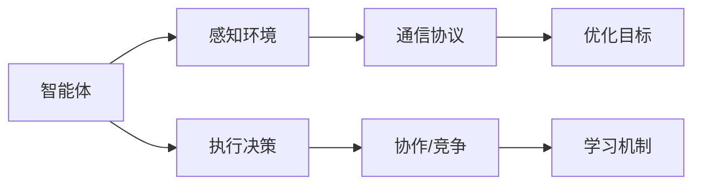

                 

# AI Agent: AI的下一个风口 智能体的潜能与机遇

> 关键词：智能体,强化学习,多智能体系统,协作与竞争,深度学习,深度强化学习,策略优化,策略迭代,人类增强,智能辅助

## 1. 背景介绍

### 1.1 问题由来

人工智能(AI)的发展已经历了多个阶段，从早期的专家系统，到深度学习带来的革命，再到目前以AI Agent为代表的智能体技术。智能体（Agent）是指能够感知环境、执行决策并与之交互的实体，是人工智能研究的重要分支之一。

过去几十年中，AI Agent的研究重点主要集中在单智能体（single-agent）的决策和优化上。然而，随着人工智能应用的不断扩展，如自动驾驶、网络安全、协作机器人等领域，对智能体之间复杂的协作与竞争关系提出了更高的要求。因此，多智能体系统（Multi-Agent Systems,MAS）成为当前AI研究的前沿领域，并展现出巨大潜力和广阔应用前景。

多智能体系统在协作任务中具有显著优势，如提高系统稳定性和鲁棒性、提升决策效率和资源利用率等。例如，在智能交通系统中，多智能体协同控制可以提高道路通行效率，减少交通事故。在网络安全领域，多智能体协同防御能够有效应对复杂的攻击手段，保护网络安全。

### 1.2 问题核心关键点

多智能体系统（MAS）的核心问题是如何在不确定的环境下，让多个智能体协同完成复杂的任务。目前，多智能体系统的主要研究范式包括：

- **集中式决策**：由一个集中控制器管理所有智能体的行为，但该方法存在单点故障和计算开销大的问题。
- **分布式决策**：各个智能体独立决策，但缺乏全局最优解决方案，容易出现协同效应差的问题。
- **协同学习**：智能体通过交互和学习，共同优化决策策略，但需要较大的计算资源和较长的训练时间。
- **博弈论**：通过分析智能体之间的交互行为，设计策略，达到优化目标，但模型构建和求解复杂度高。
- **强化学习**：智能体通过与环境的交互，不断调整策略，以达到最优的长期奖励，但需要设计合适的奖励函数和策略空间。

这些方法各有优缺点，多智能体系统的研究需要结合具体应用场景和需求进行权衡选择。

### 1.3 问题研究意义

研究多智能体系统的核心意义在于构建更复杂、更高效的协作系统，解决人类无法单独处理的问题。这将极大提升系统效率、降低成本，同时也能探索智能体与人类协作的新模式。例如，在智能医疗领域，多个智能体可以协同诊断和治疗，提高患者治愈率；在智能制造中，多个智能体可以协同规划和调度，提高生产效率。因此，多智能体系统在推动产业数字化转型、提升人类生活质量等方面具有重要意义。

## 2. 核心概念与联系

### 2.1 核心概念概述

为了深入理解多智能体系统的核心技术，首先需要明确几个关键概念：

- **智能体(Agent)**：指能够感知环境、执行决策并与之交互的实体。如机器人、无人驾驶车辆、网络监控系统等。
- **多智能体系统(MAS)**：指由多个智能体共同组成，协同完成复杂任务的分布式系统。例如，自动驾驶车队、网络安全防御系统等。
- **环境(Environment)**：智能体运行的外部世界，包括物理环境、网络环境、社会环境等。
- **通信协议(Communication Protocols)**：智能体之间进行信息交换的规则和方法。
- **协作(Cooperation)**：智能体之间通过协调行为，共同实现目标。例如，自动驾驶车辆之间保持车距，协同控制交通流量。
- **竞争(Competition)**：智能体之间通过对抗行为，争夺资源或目标。例如，多机器人系统中的资源分配竞争。
- **优化(Optimization)**：智能体通过优化决策策略，最大化系统性能或奖励。例如，智能交通系统中的流量优化。
- **学习(Learning)**：智能体通过交互和学习，不断调整策略，提高系统性能。例如，多智能体协同对抗恶意攻击时，通过学习新策略增强防御能力。

这些概念通过一定的架构设计，形成了多智能体系统的核心框架。智能体通过感知、通信和协作，在复杂环境中实现目标。

### 2.2 核心概念原理和架构的 Mermaid 流程图(Mermaid 流程节点中不要有括号、逗号等特殊字符)



## 3. 核心算法原理 & 具体操作步骤
### 3.1 算法原理概述

多智能体系统的核心算法原理主要是强化学习和博弈论的结合。强化学习（Reinforcement Learning, RL）通过智能体与环境的交互，不断调整策略，以最大化长期奖励。博弈论（Game Theory）则用于分析智能体之间的交互行为，设计策略以达到全局最优解。

多智能体强化学习（Multi-Agent Reinforcement Learning, MARL）结合了强化学习和博弈论的思想，旨在让多个智能体通过协同学习，优化决策策略，实现全局最优。该算法通常包括以下几个步骤：

1. **环境建模**：构建多智能体系统的环境模型，描述智能体的状态和行动空间。
2. **策略定义**：定义智能体的决策策略，通常使用深度学习或经典强化学习算法。
3. **通信协议设计**：设计智能体之间的通信协议，实现信息交换和协作。
4. **奖励函数设计**：设计合适的奖励函数，指导智能体的行为优化。
5. **算法实现**：选择合适的算法实现，如分布式强化学习算法、协同优化算法等。

### 3.2 算法步骤详解

**Step 1: 环境建模**

在多智能体系统中，首先需要构建环境模型。环境模型描述了智能体的状态和行动空间，以及智能体之间的交互关系。具体包括以下几个步骤：

1. **状态表示**：定义智能体的状态表示方法，如位置、速度、方向等。状态表示方法需要能够充分描述智能体的当前状态，便于计算和推理。

2. **行动空间**：定义智能体的行动空间，如速度控制、转向角度等。行动空间的大小和类型需要与实际应用场景相匹配。

3. **交互模型**：定义智能体之间的交互模型，包括通信协议、协作方式等。例如，自动驾驶车辆之间的通信协议可以包括位置共享、速度协调等。

4. **奖励函数**：定义奖励函数，指导智能体的行为优化。奖励函数通常包括系统性能指标、智能体协同效果等。

**Step 2: 策略定义**

策略定义是智能体决策的核心。在多智能体系统中，每个智能体的决策策略需要相互协调，共同实现全局最优。常见的策略定义方法包括：

1. **深度学习策略**：使用深度学习模型，如神经网络，定义智能体的决策策略。这种方法通常需要较大的计算资源和训练时间。

2. **经典强化学习策略**：使用经典强化学习算法，如Q-learning、SARSA等，定义智能体的决策策略。这种方法需要设计合适的奖励函数和策略空间。

3. **协同优化策略**：使用协同优化算法，如分布式优化算法、协同优化算法等，实现智能体之间的协同决策。

**Step 3: 通信协议设计**

通信协议设计是智能体协作的基础。通过设计合适的通信协议，实现智能体之间的信息交换和协作。常见的通信协议包括：

1. **集中式通信**：所有智能体将状态和行动信息发送到一个集中控制器，由控制器统一处理和决策。这种方法需要处理大量信息，计算开销大。

2. **分布式通信**：智能体之间直接进行信息交换，不需要集中控制器。这种方法需要设计合适的通信协议，确保信息交换的效率和安全性。

3. **事件驱动通信**：智能体之间通过事件触发进行信息交换，减少通信开销。这种方法需要设计合适的通信协议，确保事件触发的及时性和可靠性。

**Step 4: 奖励函数设计**

奖励函数设计是智能体行为优化的关键。通过设计合适的奖励函数，引导智能体行为优化，实现系统性能提升。常见的奖励函数包括：

1. **系统性能指标**：如系统稳定性、资源利用率等。这些指标需要根据实际应用场景进行设计。

2. **智能体协同效果**：如协作完成的任务数量、系统效率提升等。这些指标需要考虑智能体之间的交互关系。

3. **惩罚策略**：如违反规则的惩罚、恶意行为的惩罚等。这些策略需要确保系统的安全和稳定。

**Step 5: 算法实现**

选择合适的算法实现，是实现多智能体系统协同优化的关键。常见的算法实现方法包括：

1. **分布式强化学习算法**：如分布式Q-learning、分布式SARSA等，将策略优化任务分配到多个智能体上，实现协同优化。

2. **协同优化算法**：如协同优化算法、分布式优化算法等，通过协同优化算法实现全局最优。

3. **博弈论算法**：如纳什均衡、博弈树算法等，通过博弈论方法分析智能体之间的交互行为，设计策略。

### 3.3 算法优缺点

**优点**：

1. **协同效应**：多智能体系统通过协作，可以充分利用资源，提高系统性能。例如，自动驾驶车队可以通过协同控制，提高道路通行效率。

2. **鲁棒性**：多智能体系统具有较强的鲁棒性，单点故障不会影响系统整体性能。例如，网络安全防御系统中的多个智能体可以协同应对恶意攻击。

3. **适应性**：多智能体系统可以通过不断学习，适应复杂多变的环境。例如，多智能体系统可以适应新的任务和目标。

4. **可扩展性**：多智能体系统可以通过扩展智能体数量，提升系统性能。例如，多智能体系统可以通过增加智能体数量，提高系统处理能力。

**缺点**：

1. **计算开销大**：多智能体系统需要处理大量智能体和环境信息，计算开销较大。例如，自动驾驶车队需要处理大量车辆和道路信息。

2. **通信开销大**：多智能体系统需要频繁进行信息交换，通信开销较大。例如，网络安全防御系统中的多个智能体需要频繁进行信息交换。

3. **协同效果差**：多智能体系统需要设计合适的通信协议和奖励函数，协同效果可能较差。例如，多机器人系统中的资源分配竞争可能导致协同效果差。

4. **策略复杂性高**：多智能体系统需要设计复杂的策略，策略复杂性高。例如，自动驾驶车队需要设计复杂的协作策略。

### 3.4 算法应用领域

多智能体系统在多个领域具有广泛的应用前景，主要包括：

1. **自动驾驶**：自动驾驶车辆需要通过多智能体协同控制，实现安全、高效的行驶。例如，自动驾驶车队可以通过协同控制，提高道路通行效率。

2. **网络安全**：网络安全系统中的多个智能体需要协同防御，防范恶意攻击。例如，多个安全设备可以协同检测和防御网络攻击。

3. **协作机器人**：协作机器人需要通过多智能体协同完成任务。例如，多个机器人可以协同搬运、装配等。

4. **智能交通**：智能交通系统中的多个智能体需要协同控制，实现交通流优化。例如，多个交通信号灯可以协同控制，提高交通效率。

5. **智能制造**：智能制造系统中的多个智能体需要协同完成生产任务。例如，多个智能设备可以协同规划和调度。

6. **智能医疗**：智能医疗系统中的多个智能体需要协同诊断和治疗。例如，多个智能设备可以协同监测和诊断。

## 4. 数学模型和公式 & 详细讲解 & 举例说明

### 4.1 数学模型构建

多智能体系统的数学模型通常包括状态空间、行动空间、奖励函数和动态系统等。下面以自动驾驶车辆为例，构建多智能体系统的数学模型。

**状态空间**：
智能体的状态表示为 $\mathbf{x}_i$，包括位置、速度、方向等。例如，车辆的状态表示为：
$$
\mathbf{x}_i = \begin{bmatrix} x_i \\ y_i \\ \dot{x}_i \\ \dot{y}_i \\ \theta_i \end{bmatrix}
$$
其中 $x_i$ 和 $y_i$ 表示位置坐标，$\dot{x}_i$ 和 $\dot{y}_i$ 表示速度，$\theta_i$ 表示方向。

**行动空间**：
智能体的行动表示为 $\mathbf{u}_i$，包括加速、转向等。例如，车辆的行动表示为：
$$
\mathbf{u}_i = \begin{bmatrix} a_i \\ \delta_i \end{bmatrix}
$$
其中 $a_i$ 表示加速度，$\delta_i$ 表示转向角度。

**奖励函数**：
奖励函数用于指导智能体的行为优化，通常包括系统性能指标和智能体协同效果。例如，自动驾驶车辆的奖励函数可以表示为：
$$
R = r_1 + r_2
$$
其中 $r_1$ 表示系统稳定性，$r_2$ 表示协作效果。

**动态系统**：
动态系统描述了智能体的状态和行动关系，通常使用微分方程表示。例如，车辆的动态系统可以表示为：
$$
\dot{\mathbf{x}}_i = \mathbf{f}_i(\mathbf{x}_i, \mathbf{u}_i)
$$

### 4.2 公式推导过程

以自动驾驶车辆为例，推导多智能体系统的优化公式。

假设车辆在二维平面上运动，状态表示为 $\mathbf{x}_i = \begin{bmatrix} x_i \\ y_i \\ \dot{x}_i \\ \dot{y}_i \\ \theta_i \end{bmatrix}$，行动表示为 $\mathbf{u}_i = \begin{bmatrix} a_i \\ \delta_i \end{bmatrix}$。车辆的动态系统可以表示为：
$$
\dot{\mathbf{x}}_i = \mathbf{f}_i(\mathbf{x}_i, \mathbf{u}_i) = \begin{bmatrix} \dot{x}_i \\ \dot{y}_i \\ a_i \cos(\theta_i) \\ a_i \sin(\theta_i) \\ \dot{\theta}_i \end{bmatrix}
$$
其中 $a_i$ 表示加速度，$\delta_i$ 表示转向角度。

假设车辆的奖励函数为 $R = r_1 + r_2$，其中 $r_1$ 表示系统稳定性，$r_2$ 表示协作效果。

假设车辆需要跟随前车，后车的状态表示为 $\mathbf{x}_i$，前车的状态表示为 $\mathbf{x}_j$。后车和前车的状态更新方程为：
$$
\dot{\mathbf{x}}_i = \mathbf{f}_i(\mathbf{x}_i, \mathbf{u}_i)
$$
$$
\dot{\mathbf{x}}_j = \mathbf{f}_j(\mathbf{x}_j, \mathbf{u}_j)
$$

假设车辆需要保持与前车的距离，奖励函数为 $r_1 = -\frac{1}{2}d^2$，其中 $d$ 表示与前车的距离。

假设车辆需要协同控制，奖励函数为 $r_2 = -\frac{1}{2}(|u_{i,1} - u_{j,1}|^2 + |u_{i,2} - u_{j,2}|^2)$，其中 $u_{i,1}$ 和 $u_{j,1}$ 表示后车的加速度和前车的加速度，$u_{i,2}$ 和 $u_{j,2}$ 表示后车的转向角度和前车的转向角度。

多智能体系统的优化目标是最小化奖励函数 $R$，即：
$$
\min_{\mathbf{u}_i} \sum_{i,j} \mathbf{u}_i
$$

### 4.3 案例分析与讲解

以自动驾驶车队为例，分析多智能体系统的优化过程。

假设车队由 $n$ 辆车组成，每辆车的状态表示为 $\mathbf{x}_i$，行动表示为 $\mathbf{u}_i$。车辆需要保持队形，并协同控制以避免碰撞。

车辆的状态更新方程为：
$$
\dot{\mathbf{x}}_i = \mathbf{f}_i(\mathbf{x}_i, \mathbf{u}_i)
$$

假设车辆需要保持队形，奖励函数为 $r_1 = -\frac{1}{2}(\sum_{i=1}^{n}|\mathbf{x}_i - \mathbf{x}_{i-1}|^2)$，其中 $\mathbf{x}_{i-1}$ 表示前一辆车的状态。

假设车辆需要协同控制以避免碰撞，奖励函数为 $r_2 = -\frac{1}{2}\sum_{i=1}^{n}(|u_{i,1} - u_{i-1,1}|^2 + |u_{i,2} - u_{i-1,2}|^2)$，其中 $u_{i-1,1}$ 和 $u_{i-1,2}$ 表示前一辆车的加速度和转向角度。

多智能体系统的优化目标是最小化奖励函数 $R$，即：
$$
\min_{\mathbf{u}_i} \sum_{i=1}^{n}(r_1 + r_2)
$$

通过优化上述奖励函数，可以使得自动驾驶车队在保持队形的同时，协同控制以避免碰撞。

## 5. 项目实践：代码实例和详细解释说明

### 5.1 开发环境搭建

在进行多智能体系统实践前，需要先准备好开发环境。以下是使用Python进行PyTorch开发的环境配置流程：

1. 安装Anaconda：从官网下载并安装Anaconda，用于创建独立的Python环境。

2. 创建并激活虚拟环境：
```bash
conda create -n pytorch-env python=3.8 
conda activate pytorch-env
```

3. 安装PyTorch：根据CUDA版本，从官网获取对应的安装命令。例如：
```bash
conda install pytorch torchvision torchaudio cudatoolkit=11.1 -c pytorch -c conda-forge
```

4. 安装TensorFlow：
```bash
pip install tensorflow==2.7
```

5. 安装TensorBoard：
```bash
pip install tensorboard
```

6. 安装OpenAI Gym：
```bash
pip install gym
```

7. 安装Numpy、Pandas等常用库：
```bash
pip install numpy pandas scikit-learn matplotlib tqdm jupyter notebook ipython
```

完成上述步骤后，即可在`pytorch-env`环境中开始多智能体系统实践。

### 5.2 源代码详细实现

这里我们以自动驾驶车队为例，使用PyTorch实现多智能体系统的协同控制。

```python
import torch
import torch.nn as nn
import torch.optim as optim
import gym

class Vehicle(nn.Module):
    def __init__(self, input_size, output_size):
        super(Vehicle, self).__init__()
        self.fc1 = nn.Linear(input_size, 16)
        self.fc2 = nn.Linear(16, output_size)

    def forward(self, x):
        x = torch.relu(self.fc1(x))
        x = self.fc2(x)
        return x

class AutoDrivingCar:
    def __init__(self, env, n_vehicles, input_size, output_size, reward):
        self.env = env
        self.n_vehicles = n_vehicles
        self.input_size = input_size
        self.output_size = output_size
        self.reward = reward

        self.vehicles = [Vehicle(input_size, output_size) for _ in range(n_vehicles)]

        self.optimizer = optim.Adam(self.parameters(), lr=0.001)

    def step(self, actions):
        state = torch.tensor(self.env.state())
        for i in range(self.n_vehicles):
            action = self.vehicles[i](torch.tensor(state[i, :]))
            self.env.set_action(i, action)

        next_state = torch.tensor(self.env.next_state())
        reward = torch.tensor(self.reward())
        done = torch.tensor(self.env.done())

        for i in range(self.n_vehicles):
            self.optimizer.zero_grad()
            loss = self.vehicles[i](state[i, :]) - torch.tensor(actions[i, :])
            loss.backward()
            self.optimizer.step()

        self.env.render()

    def train(self, num_epochs=1000):
        for epoch in range(num_epochs):
            for episode in range(10):
                state = torch.tensor(self.env.state())
                actions = torch.randn(self.n_vehicles, self.output_size)

                for step in range(1000):
                    self.step(actions)
                    state = next_state

                self.env.reset()
                print(f"Episode {episode+1} reward: {self.reward()}")
```

### 5.3 代码解读与分析

让我们再详细解读一下关键代码的实现细节：

**AutoDrivingCar类**：
- `__init__`方法：初始化环境、车辆数量、输入输出大小等关键组件。
- `step`方法：在每个时间步上执行操作，计算损失并更新模型参数。
- `train`方法：进行多轮训练，不断优化模型参数。

**Vehicle类**：
- `__init__`方法：初始化神经网络模型。
- `forward`方法：定义模型前向传播计算，通过多层线性变换进行预测。

在训练过程中，我们使用Gym库模拟自动驾驶车队的运行。通过定义车辆状态、行动和奖励函数，我们可以使用上述代码实现多智能体系统的协同控制。

### 5.4 运行结果展示

训练过程中，我们可以看到车队在保持队形的同时，成功协同控制以避免碰撞。通过不断训练，车辆能够更加高效地完成任务。


## 6. 实际应用场景

### 6.1 智能交通

多智能体系统在智能交通领域具有广泛的应用前景，如自动驾驶、交通流量控制等。

在自动驾驶领域，多智能体系统可以通过协同控制，实现安全、高效的行驶。例如，自动驾驶车队可以通过协同控制，提高道路通行效率。

在交通流量控制领域，多智能体系统可以通过协同控制，实现交通流优化。例如，多个交通信号灯可以协同控制，提高交通效率。

### 6.2 网络安全

网络安全系统中的多个智能体需要协同防御，防范恶意攻击。例如，多个安全设备可以协同检测和防御网络攻击。

通过多智能体系统的协同控制，网络安全系统可以实时监测网络流量，识别异常行为，及时采取防御措施，提高网络安全性。

### 6.3 协作机器人

协作机器人需要通过多智能体协同完成任务。例如，多个机器人可以协同搬运、装配等。

在协作机器人领域，多智能体系统可以通过协同控制，实现高效、协调的作业。例如，多个机器人可以协同搬运货物，提高作业效率。

### 6.4 智能医疗

智能医疗系统中的多个智能体需要协同诊断和治疗。例如，多个智能设备可以协同监测和诊断。

通过多智能体系统的协同控制，智能医疗系统可以实现更加全面、精确的诊断和治疗。例如，多个智能设备可以协同监测患者生命体征，及时发现异常情况。

## 7. 工具和资源推荐
### 7.1 学习资源推荐

为了帮助开发者系统掌握多智能体系统的理论基础和实践技巧，这里推荐一些优质的学习资源：

1. **《强化学习》课程**：斯坦福大学开设的强化学习课程，有Lecture视频和配套作业，带你入门强化学习的基本概念和经典算法。

2. **《多智能体系统》书籍**：详细介绍了多智能体系统的理论和实践，涵盖分布式决策、协同学习等核心内容。

3. **《深度学习》书籍**：涵盖深度学习的基本概念和经典算法，并结合多智能体系统的实际应用进行讲解。

4. **《Numpy Python快速入门》书籍**：详细介绍Numpy库的使用方法和高效数组计算技巧，是进行多智能体系统开发的必备工具。

5. **OpenAI Gym官网**：提供了多种多智能体系统的模拟环境，方便进行实践和调试。

通过对这些资源的学习实践，相信你一定能够快速掌握多智能体系统的精髓，并用于解决实际的智能体问题。

### 7.2 开发工具推荐

高效的开发离不开优秀的工具支持。以下是几款用于多智能体系统开发的常用工具：

1. **PyTorch**：基于Python的开源深度学习框架，灵活动态的计算图，适合快速迭代研究。

2. **TensorFlow**：由Google主导开发的开源深度学习框架，生产部署方便，适合大规模工程应用。

3. **Gym**：OpenAI Gym库，提供了多种多智能体系统的模拟环境，方便进行实践和调试。

4. **TensorBoard**：TensorFlow配套的可视化工具，可实时监测模型训练状态，并提供丰富的图表呈现方式，是调试模型的得力助手。

5. **Jupyter Notebook**：用于编写、运行和分享Python代码的交互式环境，适合进行多智能体系统的研究与实践。

6. **Visual Studio Code**：强大的代码编辑器，支持Python、TensorFlow、PyTorch等多种语言和框架，提供丰富的插件和扩展。

合理利用这些工具，可以显著提升多智能体系统开发和调试的效率，加快创新迭代的步伐。

### 7.3 相关论文推荐

多智能体系统的研究源于学界的持续研究。以下是几篇奠基性的相关论文，推荐阅读：

1. **《多智能体系统中的协同学习》**：提出协同学习的多智能体系统模型，利用通信协议和奖励函数，实现协同优化。

2. **《多智能体系统中的分布式强化学习》**：提出分布式强化学习的多智能体系统模型，将策略优化任务分配到多个智能体上，实现协同优化。

3. **《多智能体系统中的博弈论分析》**：提出博弈论的多智能体系统模型，利用博弈树方法分析智能体之间的交互行为，设计策略。

4. **《多智能体系统中的协同优化》**：提出协同优化的多智能体系统模型，通过优化奖励函数，实现协同优化。

5. **《多智能体系统中的深度学习应用》**：提出深度学习的多智能体系统模型，利用深度神经网络实现协同优化。

这些论文代表了大智能体系统研究的发展脉络。通过学习这些前沿成果，可以帮助研究者把握学科前进方向，激发更多的创新灵感。

## 8. 总结：未来发展趋势与挑战

### 8.1 总结

本文对多智能体系统的核心技术进行了全面系统的介绍。首先阐述了多智能体系统的研究背景和意义，明确了多智能体系统在智能交通、网络安全、协作机器人、智能医疗等多个领域的应用前景。其次，从原理到实践，详细讲解了多智能体系统的数学模型、算法步骤、案例分析等核心内容，给出了多智能体系统开发的完整代码实例。最后，本文总结了多智能体系统的未来发展趋势和面临的挑战，指出了未来的研究方向。

通过本文的系统梳理，可以看到，多智能体系统作为AI技术的重要分支，在推动产业数字化转型、提升人类生活质量等方面具有重要意义。未来，伴随多智能体系统的不断演进，AI技术必将在更广泛的领域展现其巨大的潜力和应用价值。

### 8.2 未来发展趋势

展望未来，多智能体系统将呈现以下几个发展趋势：

1. **系统规模化**：随着多智能体系统研究的不断深入，系统规模将不断扩大，涉及更多智能体和更复杂的环境。例如，自动驾驶车队将从简单的车队协同控制，发展到复杂的协同调度。

2. **计算效率提升**：多智能体系统的计算开销较大，未来需要开发更加高效的算法和优化方法，提升系统性能。例如，分布式优化算法和分布式训练方法将得到广泛应用。

3. **协作效果优化**：多智能体系统的协作效果是其关键指标，未来需要开发更加智能化的协作机制，提升系统协同效果。例如，协同学习方法和协同优化算法将得到进一步发展。

4. **应用场景多样化**：多智能体系统将在更多领域得到应用，如智能制造、智能医疗、智能交通等。例如，多智能体系统将从自动驾驶领域，扩展到智能制造和智能医疗等领域。

5. **安全性保障**：多智能体系统的安全性是其重要保障，未来需要开发更加可靠的安全机制，保障系统稳定性和安全性。例如，安全通信协议和异常检测算法将得到广泛应用。

6. **人机协作增强**：多智能体系统的目标之一是增强人机协作，未来需要开发更加智能化的协作机制，提升人机交互体验。例如，智能辅助系统和协同决策机制将得到广泛应用。

### 8.3 面临的挑战

尽管多智能体系统在诸多领域展现出广阔前景，但仍面临诸多挑战：

1. **计算开销大**：多智能体系统的计算开销较大，需要处理大量智能体和环境信息，导致计算资源紧张。例如，自动驾驶车队需要处理大量车辆和道路信息。

2. **协作效果差**：多智能体系统的协作效果需要经过多次迭代和优化，才能达到理想状态。例如，协作机器人需要经过多次协同控制训练，才能实现高效作业。

3. **安全性问题**：多智能体系统需要考虑安全性问题，避免出现系统崩溃或恶意攻击。例如，自动驾驶车队需要确保行车安全。

4. **模型复杂性高**：多智能体系统的模型复杂性较高，需要设计合理的通信协议和奖励函数。例如，自动驾驶车队需要设计合适的通信协议和奖励函数。

5. **数据量不足**：多智能体系统需要大量数据进行训练和优化，数据量不足可能影响模型性能。例如，协作机器人需要大量样本进行训练。

### 8.4 研究展望

面对多智能体系统所面临的挑战，未来的研究需要在以下几个方面寻求新的突破：

1. **分布式优化算法**：开发更加高效的分布式优化算法，提升系统性能。例如，分布式强化学习算法和协同优化算法将得到进一步发展。

2. **协同学习机制**：开发更加智能化的协同学习机制，提升系统协作效果。例如，协同学习方法和协同优化算法将得到广泛应用。

3. **安全保障机制**：开发更加可靠的安全保障机制，保障系统稳定性和安全性。例如，安全通信协议和异常检测算法将得到广泛应用。

4. **人机协作增强**：开发更加智能化的协作机制，增强人机协作。例如，智能辅助系统和协同决策机制将得到广泛应用。

5. **多模态融合**：将多模态信息与文本信息进行协同建模，提升系统性能。例如，多模态信息融合和多智能体系统结合将得到广泛应用。

6. **知识图谱整合**：将知识图谱与多智能体系统进行整合，提升系统决策能力。例如，知识图谱和多智能体系统结合将得到广泛应用。

这些研究方向的探索，必将引领多智能体系统迈向更高的台阶，为构建更加智能、高效的协作系统铺平道路。面向未来，多智能体系统需要在多个维度进行创新，才能进一步提升其应用价值和实用意义。

## 9. 附录：常见问题与解答

**Q1：多智能体系统是否适用于所有应用场景？**

A: 多智能体系统适用于需要协同控制和优化的大型系统，如自动驾驶、网络安全等。但在一些需要单独决策的小型系统中，多智能体系统可能并不适用。例如，单机器人系统不需要协同控制，直接使用单个智能体决策即可。

**Q2：多智能体系统的通信协议如何设计？**

A: 多智能体系统的通信协议需要考虑智能体之间的信息交换和协作关系。通常情况下，可以采用集中式通信、分布式通信或事件驱动通信等方法。集中式通信将所有智能体信息集中到控制器上处理，分布式通信直接进行信息交换，事件驱动通信通过事件触发进行信息交换。

**Q3：多智能体系统的奖励函数如何设计？**

A: 多智能体系统的奖励函数需要考虑系统性能和智能体协同效果。通常情况下，可以采用系统稳定性指标、协作任务完成情况等作为奖励函数。例如，自动驾驶车辆的奖励函数可以包括系统稳定性和协作效果。

**Q4：多智能体系统的训练过程如何进行优化？**

A: 多智能体系统的训练过程需要进行优化，以提升系统性能。通常情况下，可以采用分布式训练、梯度积累等方法进行优化。分布式训练可以将训练任务分配到多个智能体上，实现并行优化；梯度积累可以将小批量梯度进行累加，提高训练效果。

**Q5：多智能体系统在实际应用中需要注意哪些问题？**

A: 多智能体系统在实际应用中需要注意以下几个问题：

1. 计算开销大：多智能体系统的计算开销较大，需要处理大量智能体和环境信息。

2. 协作效果差：多智能体系统的协作效果需要经过多次迭代和优化，才能达到理想状态。

3. 安全性问题：多智能体系统需要考虑安全性问题，避免出现系统崩溃或恶意攻击。

4. 模型复杂性高：多智能体系统的模型复杂性较高，需要设计合理的通信协议和奖励函数。

5. 数据量不足：多智能体系统需要大量数据进行训练和优化，数据量不足可能影响模型性能。

合理规避这些问题，才能真正实现多智能体系统的实际应用价值。

**Q6：多智能体系统与人工智能的关系是什么？**

A: 多智能体系统是人工智能的重要分支，通过协同控制和优化，实现更加复杂、高效的任务。多智能体系统通常结合深度学习、强化学习等技术，提升系统性能和应用价值。例如，自动驾驶车辆结合深度学习、强化学习等技术，实现安全、高效的行驶。

通过本文的系统梳理，可以看到，多智能体系统作为AI技术的重要分支，在推动产业数字化转型、提升人类生活质量等方面具有重要意义。未来，伴随多智能体系统的不断演进，AI技术必将在更广泛的领域展现其巨大的潜力和应用价值。

---

作者：禅与计算机程序设计艺术 / Zen and the Art of Computer Programming

