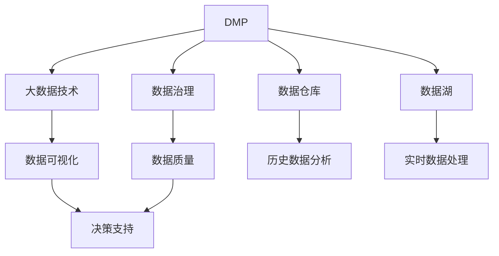

                 

# AI DMP 数据基建的挑战与机遇

> 关键词：AI DMP, 数据基建, 数据治理, 数据管理, 大数据技术

## 1. 背景介绍

### 1.1 问题由来

在数字营销领域，用户数据管理平台（DMP）是整合和分析用户数据的中心枢纽，其重要性不言而喻。AI DMP 是指在 DMP 的基础上，通过人工智能技术进一步提升数据处理、分析和应用能力，实现精准营销、个性化推荐、客户洞察等高级应用。AI DMP 不仅要对海量用户数据进行高效存储和处理，还要实现数据的深度挖掘和智能应用，这对数据基建提出了更高的要求。

AI DMP 的数据基建主要包括以下几个方面：
1. **数据采集与清洗**：从各类数据源中采集并清洗数据，确保数据质量。
2. **数据存储与索引**：建立高效的数据存储架构，便于快速查询和访问。
3. **数据处理与计算**：使用分布式计算框架处理大规模数据，实现数据管道和实时计算。
4. **数据治理与监控**：建立完善的数据治理体系，保证数据安全、合规与质量。

### 1.2 问题核心关键点

AI DMP 的数据基建面临的关键问题包括：
1. **数据量大且复杂**：用户数据包括行为数据、属性数据、关系数据等，数据量大且结构复杂。
2. **数据质量问题**：数据采集、存储、传输过程中存在缺失、错误、重复等问题，影响数据质量。
3. **数据安全与隐私**：如何处理数据隐私保护与用户隐私权，是构建 AI DMP 的重大挑战。
4. **实时性要求高**：实时数据处理和实时推荐系统对数据基建的实时性和延迟要求较高。
5. **可扩展性和成本控制**：需要构建可扩展的数据基建架构，同时控制成本。

## 2. 核心概念与联系

### 2.1 核心概念概述

为更好地理解 AI DMP 的数据基建，本节将介绍几个关键概念及其相互联系：

- **数据管理平台（DMP）**：整合和管理用户数据的中心枢纽，提供数据的采集、存储、清洗、查询等功能。
- **数据治理（Data Governance）**：确保数据的质量、安全、合规等，制定数据管理政策和规范。
- **数据仓库（Data Warehouse）**：集中存储企业历史数据，支持多维数据分析。
- **数据湖（Data Lake）**：存储海量的原始数据，支持大规模数据处理和分析。
- **大数据技术（Big Data Technologies）**：如 Hadoop、Spark、Kafka 等，用于高效处理大规模数据。
- **数据可视化（Data Visualization）**：通过可视化工具呈现数据分析结果，辅助决策。
- **AI 技术**：包括机器学习、深度学习、自然语言处理等，用于数据分析和应用。

这些核心概念之间的联系可以通过以下 Mermaid 流程图来展示：



这个流程图展示了大数据基础设施的各个组件及其相互关系：

1. **DMP** 作为数据管理中心，整合和管理用户数据，是其他组件的基础。
2. **数据治理** 确保数据质量和安全，是构建 AI DMP 的必要条件。
3. **数据仓库** 存储企业历史数据，用于多维数据分析和历史数据查询。
4. **数据湖** 存储海量的原始数据，用于大规模数据处理和分析。
5. **大数据技术** 提供高效的数据处理和计算能力，支持 DMP 的数据采集与存储。
6. **数据可视化** 将数据分析结果直观呈现，辅助决策。
7. **AI 技术** 用于数据分析和应用，提升 DMP 的智能功能。

这些组件共同构成了 AI DMP 的数据基建架构，确保了数据的有效管理、分析和应用。

## 3. 核心算法原理 & 具体操作步骤
### 3.1 算法原理概述

AI DMP 的数据基建主要基于以下算法原理：

- **数据采集与清洗**：通过 ETL（Extract, Transform, Load）流程，从多源数据中采集数据，并经过清洗、转换，去除噪声和冗余，确保数据质量。
- **数据存储与索引**：采用分布式存储架构，如 Hadoop、Spark、Hive 等，实现数据的高效存储和快速访问。
- **数据处理与计算**：使用大数据技术进行数据管道和实时计算，支持大规模数据处理需求。
- **数据治理与监控**：建立数据治理体系，确保数据的质量、安全和合规性，通过数据监控和告警，及时发现和处理数据问题。

### 3.2 算法步骤详解

**Step 1: 数据采集与清洗**
- 确定数据源，如网站日志、社交媒体、交易数据等。
- 使用数据采集工具，如 Apache Kafka、Flume 等，采集原始数据。
- 对采集到的数据进行预处理，如去重、格式化、缺失值填充等。
- 对清洗后的数据进行特征工程，如特征选择、数据转换等。

**Step 2: 数据存储与索引**
- 选择合适的存储架构，如 Hadoop、Spark、NoSQL 等，建立数据存储体系。
- 使用数据索引技术，如 Apache Hive、Apache Cassandra 等，实现数据的高效查询和访问。
- 对数据进行分区和分片，提高存储和查询效率。

**Step 3: 数据处理与计算**
- 使用大数据技术，如 Hadoop、Spark 等，进行数据管道建设。
- 采用批处理和流处理技术，实现数据的定时计算和实时处理。
- 使用机器学习算法，进行特征提取和模型训练，提升数据处理能力。

**Step 4: 数据治理与监控**
- 建立数据治理体系，包括数据质量管理、数据安全管理、数据合规管理等。
- 使用数据监控工具，如 Apache Ambari、Apache Kafka 等，实时监测数据状态和性能。
- 设置告警机制，及时发现和处理数据异常。

### 3.3 算法优缺点

**优点**：
- **高效处理大规模数据**：通过分布式计算和大数据技术，能够高效处理大规模数据。
- **实时数据处理能力**：实时数据管道和流处理技术，支持实时数据分析和应用。
- **数据质量保证**：通过数据清洗和治理，确保数据质量和安全。

**缺点**：
- **技术复杂性高**：大数据技术和数据治理体系的建设需要较高的技术门槛。
- **成本投入大**：构建和维护大规模数据基建需要大量的人力和物力资源。
- **数据隐私问题**：如何处理数据隐私和用户隐私权，是构建 AI DMP 的重大挑战。

### 3.4 算法应用领域

AI DMP 的数据基建主要应用于以下领域：

1. **精准营销**：通过分析用户数据，实现个性化推荐和精准营销。
2. **客户洞察**：从用户数据中挖掘客户行为、偏好等，辅助决策。
3. **数据分析与可视化**：对用户数据进行多维分析，生成可视化报表，辅助决策。
4. **风险控制**：通过对用户数据的分析，实现风险控制和欺诈检测。
5. **推荐系统**：基于用户数据，构建推荐系统，提升用户体验。

## 4. 数学模型和公式 & 详细讲解 & 举例说明

### 4.1 数学模型构建

本节将使用数学语言对 AI DMP 的数据基建过程进行更加严格的刻画。

记原始数据集为 $D=\{(x_i, y_i)\}_{i=1}^N$，其中 $x_i$ 为输入特征，$y_i$ 为标签。

定义数据采集与清洗过程为 $P_{ETL}(D)$，数据存储与索引过程为 $P_{DB}(D)$，数据处理与计算过程为 $P_{Compute}(D)$，数据治理与监控过程为 $P_{Governance}(D)$。则 AI DMP 的数据基建流程可以表示为：

$$
\begin{aligned}
&\min_{D'} \mathcal{L}(D', P_{ETL}(D)) + \mathcal{L}(D', P_{DB}(D)) + \mathcal{L}(D', P_{Compute}(D)) + \mathcal{L}(D', P_{Governance}(D)) \\
&\text{s.t.} \quad \{P_{ETL}, P_{DB}, P_{Compute}, P_{Governance}\} \text{ 为数据基建流程}
\end{aligned}
$$

其中 $\mathcal{L}$ 为损失函数，衡量数据处理过程与期望结果之间的差异。

### 4.2 公式推导过程

以下我们以用户行为数据分析为例，推导机器学习模型的训练过程。

假设输入特征 $x_i$ 为用户的浏览、点击、购买等行为数据，标签 $y_i$ 为用户的购买行为（0 或 1）。我们使用二分类模型 $f(x_i; \theta)$ 对用户行为进行分析，模型参数 $\theta$ 需要最小化损失函数：

$$
\mathcal{L}(\theta) = -\frac{1}{N} \sum_{i=1}^N \log f(x_i; \theta) y_i
$$

模型的训练过程为梯度下降算法，更新参数 $\theta$：

$$
\theta \leftarrow \theta - \eta \nabla_{\theta}\mathcal{L}(\theta)
$$

其中 $\eta$ 为学习率。

### 4.3 案例分析与讲解

以电商平台为例，分析 AI DMP 在电商平台中的具体应用。

1. **数据采集与清洗**：
   - 从电商网站采集用户浏览、点击、购买等行为数据。
   - 清洗数据，去除缺失值、重复数据等。
   - 进行特征工程，提取用户行为特征，如浏览时长、浏览次数、购买频率等。

2. **数据存储与索引**：
   - 使用 Hadoop 存储大规模行为数据。
   - 使用 Apache Cassandra 进行数据索引，提高查询效率。

3. **数据处理与计算**：
   - 使用 Spark 进行实时数据处理和分析。
   - 构建推荐系统，使用协同过滤、基于内容的推荐算法等。

4. **数据治理与监控**：
   - 建立数据治理体系，包括数据质量管理、数据安全管理、数据合规管理等。
   - 使用 Apache Ambari 监控数据处理和存储状态，设置告警机制。

通过以上步骤，AI DMP 可以在电商平台中实现用户行为分析、个性化推荐等功能，提升用户体验和销售转化率。

## 5. 项目实践：代码实例和详细解释说明
### 5.1 开发环境搭建

在进行数据基建实践前，我们需要准备好开发环境。以下是使用 Python 进行 PySpark 开发的环境配置流程：

1. 安装 Apache Spark：从官网下载并安装 Apache Spark，适用于大数据处理和计算。

2. 安装 Python 的 Spark API：使用 pip 安装 pyspark，方便在 Python 中调用 Spark 的功能。

3. 安装其他必要的 Python 库：如 NumPy、Pandas、Matplotlib 等，用于数据处理和可视化。

4. 搭建 Hadoop 集群：安装 Hadoop 环境，包括 HDFS、YARN 等组件，用于分布式数据存储和计算。

完成上述步骤后，即可在 PySpark 环境下进行数据基建实践。

### 5.2 源代码详细实现

下面我们以用户行为数据分析为例，给出使用 PySpark 进行数据清洗和特征工程的 PySpark 代码实现。

首先，定义数据清洗函数：

```python
from pyspark.sql import SparkSession

spark = SparkSession.builder.appName("UserBehaviorAnalysis").getOrCreate()

def clean_data(df):
    # 去除缺失值
    df = df.dropna()
    # 去除重复数据
    df = df.dropDuplicates()
    # 数据类型转换
    df = df.withColumn("click_time", df["click_time"].cast("timestamp"))
    # 数据归一化
    df = df.withColumn("click_duration", (df["click_duration"] / 60).cast("float"))
    return df
```

然后，定义特征工程函数：

```python
def feature_engineering(df):
    # 提取用户行为特征
    df["click_frequency"] = df.groupby("user_id").count()["click_id"].cast("int")
    df["purchase_frequency"] = df.groupby("user_id").count()["purchase_id"].cast("int")
    df["average_click_duration"] = df["click_duration"].mean().cast("float")
    df["average_purchase_duration"] = df["purchase_duration"].mean().cast("float")
    df["average_order_value"] = df.groupby("user_id").sum()["order_value"].mean().cast("float")
    return df
```

最后，在数据清洗和特征工程的基础上，进行数据分析和建模：

```python
# 数据采集
df = spark.read.json("user_behavior.json")

# 数据清洗
df = clean_data(df)

# 特征工程
df = feature_engineering(df)

# 数据建模
from pyspark.ml.classification import LogisticRegression
from pyspark.ml.evaluation import BinaryClassificationEvaluator

model = LogisticRegression(maxIter=10, regParam=0.3, elasticNetParam=0.8)
model.fit(df, ["purchase_id"])
```

以上就是使用 PySpark 进行用户行为数据分析的完整代码实现。可以看到，PySpark 提供了丰富的数据处理和计算功能，使得数据基建的过程变得简洁高效。

### 5.3 代码解读与分析

让我们再详细解读一下关键代码的实现细节：

**clean_data 函数**：
- 去除缺失值：使用 `dropna()` 函数去除 DataFrame 中的缺失值。
- 去除重复数据：使用 `dropDuplicates()` 函数去除重复数据。
- 数据类型转换：使用 `cast()` 函数将数据类型转换为指定类型，如时间戳、浮点数等。
- 数据归一化：使用 `mean()` 函数计算平均数，并将结果转换为指定类型。

**feature_engineering 函数**：
- 提取用户行为特征：使用 `groupby()` 函数和 `count()` 函数，计算用户的行为频率和平均行为时长等特征。
- 特征转换：使用 `mean()` 函数和 `cast()` 函数，将计算结果转换为指定类型。

**数据建模**：
- 使用 PySpark 的 Logistic Regression 模型进行建模，设置迭代次数、正则化参数等。
- 使用 BinaryClassificationEvaluator 评估模型性能，如 AUC、精确率、召回率等。

通过以上步骤，PySpark 可以高效地进行数据清洗、特征工程和建模，为 AI DMP 的数据基建提供了坚实的基础。

## 6. 实际应用场景
### 6.1 电商推荐系统

在电商推荐系统中，AI DMP 的数据基建技术可以发挥重要作用。通过对用户行为数据的分析，AI DMP 能够生成用户画像，实现个性化推荐，提升用户体验和销售转化率。

具体而言，可以采集用户的历史浏览、点击、购买等行为数据，进行数据清洗和特征工程，建立用户画像。然后使用协同过滤、基于内容的推荐算法等，生成个性化推荐列表。通过实时监控和反馈，AI DMP 可以不断优化推荐模型，提升推荐效果。

### 6.2 智能客服系统

在智能客服系统中，AI DMP 的数据基建技术可以用于用户行为分析和意图识别。通过对用户的历史对话数据进行分析，AI DMP 能够识别用户的意图，提供个性化的客服回复，提升客户满意度。

具体而言，可以采集用户的对话数据，进行数据清洗和特征工程，建立用户画像。然后使用意图识别算法，识别用户的意图，并提供相应的回复。通过实时监控和反馈，AI DMP 可以不断优化意图识别模型，提升客服系统的智能化水平。

### 6.3 健康管理平台

在健康管理平台中，AI DMP 的数据基建技术可以用于用户健康数据的分析和管理。通过对用户的历史健康数据进行分析，AI DMP 能够提供个性化的健康管理建议，提升用户健康水平。

具体而言，可以采集用户的健康数据，如体重、血压、运动量等，进行数据清洗和特征工程，建立用户画像。然后使用健康数据分析算法，生成个性化的健康管理建议。通过实时监控和反馈，AI DMP 可以不断优化健康管理模型，提升健康管理效果。

### 6.4 未来应用展望

随着 AI DMP 数据基建技术的不断发展，其在更多领域的应用前景将更加广阔。未来，AI DMP 有望在金融、医疗、教育、交通等领域大放异彩，为各行各业带来新的变革。

在金融领域，AI DMP 可以用于风险控制和欺诈检测，提升金融系统的安全性和稳定性。在医疗领域，AI DMP 可以用于疾病预测和个性化治疗，提升医疗服务的精准性和有效性。在教育领域，AI DMP 可以用于学习分析和学习推荐，提升教育效果和个性化程度。在交通领域，AI DMP 可以用于交通数据分析和智能调度，提升交通系统的效率和安全性。

## 7. 工具和资源推荐
### 7.1 学习资源推荐

为了帮助开发者系统掌握 AI DMP 数据基建的理论基础和实践技巧，这里推荐一些优质的学习资源：

1. **《大数据技术与数据管理》课程**：国内多所高校开设的精品课程，涵盖大数据技术和数据管理的核心内容。
2. **《Apache Spark 实战》书籍**：全面介绍 Apache Spark 的使用方法和最佳实践，适合初学者和进阶者。
3. **《大数据技术在实际项目中的应用》博客**：知名大牛的技术博客，分享大数据技术在实际项目中的应用经验。
4. **《数据治理和数据管理》书籍**：介绍数据治理和数据管理的核心概念和方法，适合数据管理工程师。
5. **《数据可视化工具与技术》课程**：学习常用的数据可视化工具和技术，如 Tableau、Power BI 等。

通过对这些资源的学习实践，相信你一定能够快速掌握 AI DMP 数据基建的精髓，并用于解决实际的业务问题。

### 7.2 开发工具推荐

高效的开发离不开优秀的工具支持。以下是几款用于 AI DMP 数据基建开发的常用工具：

1. **Apache Spark**：基于内存计算和分布式计算的快速数据处理平台，支持大规模数据处理。
2. **Apache Hadoop**：基于分布式存储和计算的大数据平台，支持大规模数据存储和处理。
3. **Apache Kafka**：高性能、分布式的消息队列，支持实时数据处理和流处理。
4. **Apache Hive**：基于 SQL 的数据仓库系统，支持大规模数据查询和分析。
5. **Apache Cassandra**：分布式的 NoSQL 数据库，支持大规模数据存储和索引。
6. **Jupyter Notebook**：交互式编程环境，支持数据处理、可视化和建模。
7. **Databricks**：基于 Apache Spark 的云数据平台，提供一站式数据开发、分析和可视化。

合理利用这些工具，可以显著提升 AI DMP 数据基建任务的开发效率，加快创新迭代的步伐。

### 7.3 相关论文推荐

AI DMP 数据基建技术的发展离不开学界的持续研究。以下是几篇奠基性的相关论文，推荐阅读：

1. **《数据管理技术》（数据管理技术的综述）**：涵盖数据管理的核心技术和方法，是学习数据管理的必备文献。
2. **《大数据技术与数据科学》**：介绍大数据技术和数据科学的核心概念和方法，适合数据科学家。
3. **《数据治理框架》**：提出数据治理的核心框架和方法，为构建数据治理体系提供指导。
4. **《分布式数据处理技术》**：介绍分布式数据处理的核心技术和方法，适合大数据工程师。
5. **《数据可视化技术与应用》**：介绍数据可视化的核心技术和应用方法，适合数据科学家和业务分析师。

这些论文代表了大数据基础设施的发展脉络。通过学习这些前沿成果，可以帮助研究者把握学科前进方向，激发更多的创新灵感。

## 8. 总结：未来发展趋势与挑战
### 8.1 总结

本文对 AI DMP 数据基建的挑战与机遇进行了全面系统的介绍。首先阐述了 AI DMP 数据基建的重要性，明确了其在数据采集、清洗、存储、处理、治理等方面的关键点。其次，从原理到实践，详细讲解了 AI DMP 数据基建的技术流程，给出了具体的数据处理和建模实现。同时，本文还广泛探讨了 AI DMP 在电商、智能客服、健康管理等多个领域的应用前景，展示了数据基建技术在实际业务中的广泛应用。最后，本文精选了数据基建技术的各类学习资源，力求为读者提供全方位的技术指引。

通过本文的系统梳理，可以看到，AI DMP 数据基建技术正在成为数据管理领域的重要范式，极大地提升了数据处理、分析和应用的效率和智能化水平。未来，伴随数据基建技术的持续演进，数据管理能力将进一步提升，为各行各业带来更多的创新突破。

### 8.2 未来发展趋势

展望未来，AI DMP 数据基建技术将呈现以下几个发展趋势：

1. **数据质量提升**：通过数据清洗和治理，进一步提升数据质量，确保数据一致性和完整性。
2. **数据治理体系完善**：建立完善的数据治理体系，确保数据的安全性、合规性和可追溯性。
3. **数据实时处理能力增强**：通过实时数据管道和流处理技术，提升数据的实时处理和分析能力。
4. **数据隐私保护加强**：加强数据隐私保护，确保用户隐私权和数据安全。
5. **数据可视化与决策支持**：通过数据可视化工具，提升数据分析结果的直观性和决策支持能力。
6. **跨领域数据整合**：实现不同数据源和数据类型的整合，提升数据的多维分析和应用能力。

以上趋势凸显了 AI DMP 数据基建技术的广阔前景。这些方向的探索发展，必将进一步提升数据管理和分析的智能化水平，为各行各业带来更多的创新突破。

### 8.3 面临的挑战

尽管 AI DMP 数据基建技术已经取得了显著进展，但在迈向更加智能化、普适化应用的过程中，它仍面临诸多挑战：

1. **技术复杂性高**：数据基建技术的复杂性高，需要较高的技术门槛和专业知识。
2. **数据隐私问题**：如何处理数据隐私和用户隐私权，是构建 AI DMP 的重大挑战。
3. **数据质量问题**：数据采集、存储、传输过程中存在缺失、错误、重复等问题，影响数据质量。
4. **资源投入大**：构建和维护大规模数据基建需要大量的人力和物力资源。
5. **系统可扩展性**：如何在保证系统性能的同时，实现系统的可扩展性和成本控制。

正视数据基建面临的这些挑战，积极应对并寻求突破，将使 AI DMP 数据基建技术更加成熟，实现数据管理的智能化和自动化。

### 8.4 研究展望

面对 AI DMP 数据基建所面临的挑战，未来的研究需要在以下几个方面寻求新的突破：

1. **数据质量提升技术**：开发更加高效的数据清洗和治理算法，提升数据质量。
2. **数据隐私保护技术**：开发数据隐私保护算法和工具，确保用户隐私权和数据安全。
3. **跨领域数据整合技术**：开发数据整合算法和工具，实现不同数据源和数据类型的整合。
4. **数据实时处理技术**：开发高效的数据流处理算法和工具，提升数据的实时处理和分析能力。
5. **数据可视化技术**：开发更加直观、高效的数据可视化工具，提升数据分析结果的直观性和决策支持能力。

这些研究方向将引领 AI DMP 数据基建技术的进一步发展，为构建高效、智能、安全的数据管理平台提供有力支持。面向未来，数据基建技术需要与其他人工智能技术进行更深入的融合，如自然语言处理、机器学习、知识图谱等，多路径协同发力，共同推动数据管理和分析技术的进步。只有勇于创新、敢于突破，才能不断拓展数据管理的边界，让数据驱动决策更加智能化和精准化。

## 9. 附录：常见问题与解答

**Q1：如何选择合适的数据清洗工具？**

A: 选择合适的数据清洗工具需要考虑数据的类型、规模和质量等因素。常见的数据清洗工具包括 OpenRefine、Trifacta、Pandas 等。对于小规模数据，可以使用 Pandas 进行手动清洗；对于大规模数据，可以使用 OpenRefine 进行批量清洗；对于复杂的数据清洗任务，可以使用 Trifacta 进行自动化清洗。

**Q2：如何进行数据治理和监控？**

A: 数据治理和监控是数据基建的重要组成部分，包括以下几个方面：
1. 数据质量管理：建立数据质量标准，定期进行数据质量评估，发现并修复数据问题。
2. 数据安全管理：确保数据存储和传输的安全性，防止数据泄露和未授权访问。
3. 数据合规管理：确保数据使用符合法律法规，如 GDPR、CCPA 等。
4. 数据监控和告警：使用数据监控工具，实时监控数据处理和存储状态，设置告警机制，及时发现和处理数据异常。

**Q3：如何使用 PySpark 进行大规模数据处理？**

A: 使用 PySpark 进行大规模数据处理，可以遵循以下步骤：
1. 安装 PySpark，建立 PySpark 环境。
2. 使用 PySpark 的 DataFrame 和 RDD 进行数据处理。
3. 使用 PySpark 的 Spark SQL 进行 SQL 查询。
4. 使用 PySpark 的 MLlib 进行机器学习建模。
5. 使用 PySpark 的 Streaming 进行实时数据处理和流处理。

通过以上步骤，PySpark 可以高效地进行大规模数据处理和分析，为 AI DMP 的数据基建提供强有力的支持。

**Q4：如何实现跨领域数据整合？**

A: 实现跨领域数据整合，需要遵循以下步骤：
1. 确定不同数据源的数据格式和标准，进行数据格式转换。
2. 使用数据整合工具，如 Apache Nifi、Apache Beam 等，进行数据整合和转换。
3. 建立数据仓库和数据湖，存储和查询整合后的数据。
4. 使用数据治理和监控工具，确保数据整合的一致性和完整性。

通过以上步骤，可以实现不同数据源和数据类型的整合，提升数据的多维分析和应用能力。

**Q5：如何实现数据实时处理和分析？**

A: 实现数据实时处理和分析，可以遵循以下步骤：
1. 使用实时数据采集工具，如 Apache Kafka、Apache Flink 等，实时采集数据。
2. 使用实时数据处理工具，如 Apache Spark Streaming、Apache Flink 等，进行实时数据处理和分析。
3. 使用实时数据存储工具，如 Apache Cassandra、Apache Hive 等，存储实时数据。
4. 使用实时数据监控工具，如 Apache Ambari、Apache Kafka 等，实时监控数据处理状态。

通过以上步骤，可以实现数据的实时处理和分析，为 AI DMP 的数据基建提供实时数据支持。

---

作者：禅与计算机程序设计艺术 / Zen and the Art of Computer Programming

