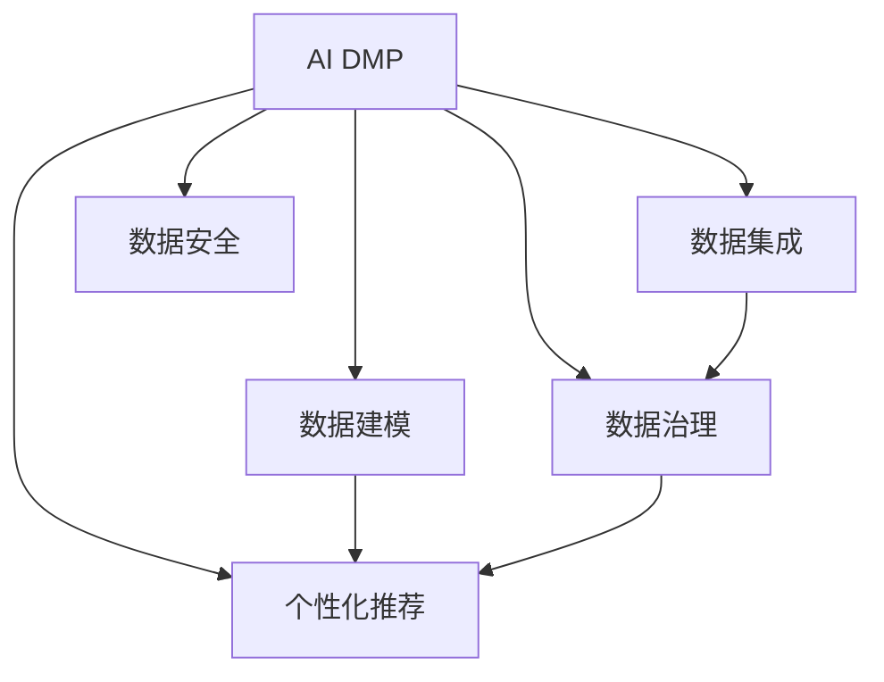

                 

# AI DMP 数据基建：如何利用数据提升营销效率

> 关键词：AI DMP, 数据基建, 用户行为分析, 个性化推荐, 数据治理, 营销效率

## 1. 背景介绍

### 1.1 问题由来
在数字经济时代，数据成为企业获取竞争优势的关键资源。然而，数据量的大幅增长并未带来相应的效率提升，反而导致了数据治理的复杂性和数据价值的流失。数据孤岛、数据质量问题、数据隐私保护等难题，阻碍了数据在营销决策中的深入应用。在这样的背景下，AI驱动的数据管理平台（AI DMP）应运而生，通过智能化的数据治理、分析和推荐技术，大幅提升了数据的营销价值和利用效率。

### 1.2 问题核心关键点
AI DMP的核心在于将用户数据进行高效组织和深度分析，提炼用户画像和行为特征，从而实现个性化推荐和精准营销。其关键点包括：
- 数据集成：将来自不同渠道和来源的数据进行清洗、合并和统一。
- 数据治理：确保数据的准确性、完整性和一致性，为数据分析和推荐提供可靠基础。
- 数据建模：使用机器学习等技术，挖掘用户行为模式和偏好。
- 数据安全：保护用户隐私，合规使用数据。
- 数据应用：通过智能推荐系统，将数据转化为实际营销效果。

本文将系统介绍AI DMP的数据基建方法，探讨如何利用数据提升营销效率，并展望其未来的发展方向。

## 2. 核心概念与联系

### 2.1 核心概念概述

为更好地理解AI DMP的数据基建方法，本节将介绍几个关键概念及其相互关系：

- AI DMP（人工智能驱动的数据管理平台）：通过AI技术实现用户数据的深度分析和精准营销，涵盖数据收集、治理、分析和应用等多个环节。
- 数据基建（Data Infrastructure）：构建稳定可靠的数据处理和管理体系，确保数据的高效流动和使用。
- 用户行为分析（User Behavior Analysis）：通过数据挖掘和机器学习技术，发现用户的行为模式和偏好。
- 个性化推荐（Personalized Recommendation）：基于用户画像和行为特征，智能推荐产品和服务，提升用户体验和营销效果。
- 数据治理（Data Governance）：通过规范化的数据管理流程，确保数据的准确性、完整性和合规性。
- 数据安全（Data Security）：保护用户隐私，确保数据在采集、存储和处理过程中的安全性。

这些概念之间的逻辑关系可以通过以下Mermaid流程图来展示：



这个流程图展示了AI DMP的数据基建过程：从数据集成开始，经过治理、建模、推荐等环节，最终确保数据安全。各环节相互关联，共同构成AI DMP的核心功能。

## 3. 核心算法原理 & 具体操作步骤
### 3.1 算法原理概述

AI DMP的数据基建方法，基于数据科学和机器学习技术，通过一系列算法实现数据的深度分析和精准营销。其核心算法包括数据集成、数据治理、数据建模和个性化推荐等。

- **数据集成**：通过ETL（Extract, Transform, Load）流程，将来自不同渠道和来源的数据进行清洗、合并和统一，确保数据的一致性和完整性。
- **数据治理**：使用数据质量管理工具，对数据进行标准化、去重、清洗等操作，确保数据的准确性和一致性。
- **数据建模**：基于机器学习算法，构建用户画像和行为特征模型，挖掘用户的行为模式和偏好。
- **个性化推荐**：通过协同过滤、内容推荐等技术，智能推荐产品和服务，提升用户体验和营销效果。

### 3.2 算法步骤详解

以下是AI DMP数据基建的详细操作步骤：

**Step 1: 数据收集与集成**
- 确定数据来源，如网站、社交媒体、CRM系统等。
- 使用ETL工具进行数据采集、清洗和转换。
- 建立统一的数据模型，确保数据的格式和结构一致。

**Step 2: 数据治理与优化**
- 实施数据质量管理流程，包括数据标准化、去重、清洗等。
- 应用数据治理工具，监控数据质量指标，如完整性、准确性、一致性等。
- 定期进行数据清洗和更新，保证数据的实时性。

**Step 3: 数据建模与分析**
- 使用机器学习算法，构建用户画像和行为特征模型。
- 挖掘用户行为模式，识别兴趣点、消费习惯等。
- 应用先进算法如深度学习、强化学习，提高模型预测精度。

**Step 4: 个性化推荐与营销**
- 基于用户画像和行为特征，智能推荐产品和服务。
- 使用多臂老虎机算法、排序学习等技术，优化推荐效果。
- 设计个性化营销策略，如定向广告、优惠券等，提升转化率。

**Step 5: 监控与优化**
- 实时监控推荐效果和营销指标，如点击率、转化率等。
- 收集用户反馈，优化推荐算法和策略。
- 定期评估数据质量和模型效果，进行迭代优化。

### 3.3 算法优缺点

AI DMP的数据基建方法具有以下优点：
1. 高效性：通过数据集成和治理，提升数据的完整性和一致性，保证后续分析的准确性。
2. 精确性：利用数据建模技术，挖掘用户行为模式和偏好，提高推荐的个性化和精准性。
3. 可扩展性：数据基建方法可应用于多种营销场景，如电商、金融、医疗等。
4. 实时性：通过实时数据流处理，实现动态推荐和实时营销，提升用户体验。

同时，该方法也存在一些局限性：
1. 对数据质量要求高：数据集成和治理过程需要大量人工干预，对数据质量依赖较大。
2. 技术门槛高：涉及复杂的机器学习和数据建模技术，需要专业团队进行开发和维护。
3. 隐私风险：数据治理和分析过程中，需注意用户隐私保护，避免数据泄露。

尽管存在这些局限性，但总体而言，AI DMP的数据基建方法在提升数据利用效率和营销效果方面具有显著优势。

### 3.4 算法应用领域

AI DMP的数据基建方法，已经在多个领域得到了广泛应用，如：

- 电商：通过用户行为分析和个性化推荐，提升用户体验和购买转化率。
- 金融：利用数据建模和风险预测，进行精准客户细分和智能投顾服务。
- 医疗：基于用户健康数据，进行个性化诊疗和精准营销。
- 媒体：通过内容推荐和定向广告，提升用户黏性和广告效果。

此外，AI DMP在教育、旅游、电信等诸多领域也有着广泛的应用前景。随着数据量的不断增长和AI技术的进步，AI DMP的潜力将进一步释放，助力企业在数字经济时代占据竞争优势。

## 4. 数学模型和公式 & 详细讲解 & 举例说明

### 4.1 数学模型构建

AI DMP的数据基建过程，涉及多个数学模型，如用户行为分析模型、个性化推荐模型等。这里以用户行为分析为例，介绍基本数学模型构建和推导。

假设用户的历史行为数据为 $D=\{x_i,y_i\}_{i=1}^N$，其中 $x_i$ 表示用户行为，$y_i$ 表示用户兴趣。我们的目标是构建一个用户行为分析模型 $M$，使其能够预测用户未来行为 $y^*$。

定义用户行为分析模型的预测函数为 $f(x_i;\theta)$，其中 $\theta$ 为模型参数。我们的目标是最大化预测准确率，即最小化预测误差 $e$。

### 4.2 公式推导过程

用户行为分析模型的目标函数可以表示为：

$$
\mathcal{L}(\theta) = \frac{1}{N}\sum_{i=1}^N e(y_i, f(x_i;\theta))
$$

其中 $e(y_i, f(x_i;\theta))$ 表示预测误差。常见的误差函数包括均方误差（MSE）、绝对误差（MAE）等。这里以均方误差为例，推导公式：

$$
\mathcal{L}(\theta) = \frac{1}{N}\sum_{i=1}^N (y_i - f(x_i;\theta))^2
$$

最小化目标函数 $\mathcal{L}(\theta)$ 的过程，可以使用梯度下降算法进行求解：

$$
\theta_{t+1} = \theta_t - \eta \nabla_{\theta}\mathcal{L}(\theta)
$$

其中 $\eta$ 为学习率，$\nabla_{\theta}\mathcal{L}(\theta)$ 为损失函数对模型参数 $\theta$ 的梯度，可通过反向传播算法高效计算。

### 4.3 案例分析与讲解

以电商平台为例，用户行为分析模型可以基于用户的浏览历史、购买记录、评价等数据，预测用户的购买意图和偏好。具体实现步骤如下：

1. 数据收集：收集用户的行为数据，如浏览商品ID、浏览时长、购买商品ID等。
2. 特征提取：从行为数据中提取关键特征，如商品类别、用户ID、浏览次数等。
3. 模型训练：使用机器学习算法，如决策树、随机森林、深度学习等，训练用户行为分析模型。
4. 预测应用：将新用户的浏览记录输入模型，预测其购买意向，并进行个性化推荐。

在实际应用中，还需要考虑数据平衡性、特征重要性、模型复杂度等因素，进行模型调参和优化。

## 5. 项目实践：代码实例和详细解释说明

### 5.1 开发环境搭建

在进行数据基建实践前，我们需要准备好开发环境。以下是使用Python进行TensorFlow开发的环境配置流程：

1. 安装Anaconda：从官网下载并安装Anaconda，用于创建独立的Python环境。

2. 创建并激活虚拟环境：
```bash
conda create -n tf-env python=3.8 
conda activate tf-env
```

3. 安装TensorFlow：根据CUDA版本，从官网获取对应的安装命令。例如：
```bash
conda install tensorflow -c pytorch -c conda-forge
```

4. 安装其他依赖包：
```bash
pip install numpy pandas scikit-learn tqdm jupyter notebook ipython
```

完成上述步骤后，即可在`tf-env`环境中开始数据基建实践。

### 5.2 源代码详细实现

这里以电商平台的个性化推荐系统为例，给出使用TensorFlow实现数据基建的PyTorch代码实现。

首先，定义推荐系统的训练函数：

```python
import tensorflow as tf
from tensorflow.keras.layers import Input, Embedding, Flatten, Dense, LSTM
from tensorflow.keras.models import Model

def build_recommender_model():
    input_user = Input(shape=(1,), dtype=tf.int32, name='user_input')
    user_embed = Embedding(input_dim=num_users, output_dim=embedding_dim)(input_user)
    user_flatten = Flatten()(user_embed)
    
    input_item = Input(shape=(1,), dtype=tf.int32, name='item_input')
    item_embed = Embedding(input_dim=num_items, output_dim=embedding_dim)(input_item)
    item_flatten = Flatten()(item_embed)
    
    concat = tf.concat([user_flatten, item_flatten], axis=-1)
    lstm = LSTM(units=hidden_units, return_sequences=True)(concat)
    out = Dense(num_items, activation='softmax')(lstm)
    
    model = Model(inputs=[input_user, input_item], outputs=out)
    return model

def train_recommender(model, train_data, epochs):
    model.compile(optimizer=tf.keras.optimizers.Adam(), loss='categorical_crossentropy', metrics=['accuracy'])
    model.fit(train_data, epochs=epochs)
```

然后，定义数据处理和加载函数：

```python
def load_data():
    train_data = []
    for user_id, item_id in train_data:
        user_idx = user_id_to_idx[user_id]
        item_idx = item_id_to_idx[item_id]
        train_data.append([user_idx, item_idx])
    train_data = tf.data.Dataset.from_tensor_slices(train_data).batch(batch_size)
    return train_data
```

最后，启动训练流程：

```python
model = build_recommender_model()
train_data = load_data()
epochs = 10

model.fit(train_data, epochs=epochs)
```

以上就是使用TensorFlow对电商推荐系统进行数据基建的完整代码实现。可以看到，TensorFlow提供了强大的API和工具，使得模型构建和训练过程变得简洁高效。

### 5.3 代码解读与分析

让我们再详细解读一下关键代码的实现细节：

**build_recommender_model函数**：
- 定义了推荐系统的输入层、嵌入层、展平层、LSTM层和输出层，构建了一个完整的模型。

**train_recommender函数**：
- 定义了模型的编译过程，使用Adam优化器和交叉熵损失函数。
- 定义了模型的训练过程，使用categorical_crossentropy损失函数，优化模型参数，以最大化推荐准确率。

**load_data函数**：
- 将用户和商品ID转换为模型所需的索引，并构建数据集，按批次加载数据。

**模型训练过程**：
- 在数据集上进行多次迭代训练，每次迭代训练一批数据，更新模型参数。
- 周期性评估模型在验证集上的性能，确保模型没有过拟合。
- 重复上述步骤直到满足预设的迭代轮数。

通过上述代码实现，我们可以看到，TensorFlow提供了一站式的端到端开发框架，可以轻松构建、训练和部署推荐系统。开发者可以将更多精力放在数据处理和模型优化上，而不必过多关注底层的实现细节。

当然，工业级的系统实现还需考虑更多因素，如模型的保存和部署、超参数的自动搜索、更灵活的模型结构等。但核心的数据基建流程基本与此类似。

## 6. 实际应用场景
### 6.1 电商推荐

AI DMP在电商推荐系统中的应用，可以显著提升用户购物体验和商家销售转化率。通过数据基建，电商平台可以构建用户画像和商品特征模型，智能推荐用户可能感兴趣的商品，提高用户点击和购买率。

具体实现时，可以收集用户的浏览、点击、购买记录等行为数据，构建用户画像和商品特征模型，利用协同过滤、内容推荐等技术，实时生成个性化推荐列表。对于新用户的加入和商品的下架，模型能够即时更新并给出动态推荐。

### 6.2 金融风控

AI DMP在金融风控中的应用，可以提升风险评估和客户分类的精准度。通过数据基建，金融公司可以构建用户画像和风险特征模型，智能预测用户信用等级和潜在风险。

具体实现时，可以收集用户的交易记录、信用卡使用情况、社交信息等数据，构建用户画像和风险特征模型，利用分类和回归算法，预测用户的信用等级和贷款风险。对于高风险用户，模型可以发出预警，并进行定向提示，提升风险控制效果。

### 6.3 智慧医疗

AI DMP在智慧医疗中的应用，可以提升诊疗效率和个性化推荐效果。通过数据基建，医疗机构可以构建用户健康数据模型，智能推荐个性化诊疗方案和健康建议。

具体实现时，可以收集用户的病历记录、健康数据、生活方式等信息，构建用户健康数据模型，利用分类和回归算法，预测用户的健康状况和疾病风险。对于患病用户，模型可以推荐个性化的诊疗方案和健康建议，提升诊疗效果。

### 6.4 未来应用展望

随着AI DMP的不断发展，其应用场景将进一步拓展，带来更大的商业和社会价值。

- 在智能城市治理中，AI DMP可以用于交通流量分析、公共安全监测等，提升城市管理水平。
- 在智能制造中，AI DMP可以用于设备维护预测、供应链优化等，提升生产效率和质量。
- 在智能农业中，AI DMP可以用于气象预测、土壤分析等，提升农业生产效率。
- 在智能教育中，AI DMP可以用于个性化学习推荐、作业批改等，提升教育质量。

此外，AI DMP在个性化推荐、智能决策、智能服务等多个领域的应用前景广阔，将推动人工智能技术在各行各业的深入应用。

## 7. 工具和资源推荐
### 7.1 学习资源推荐

为了帮助开发者系统掌握AI DMP的数据基建方法，这里推荐一些优质的学习资源：

1. 《TensorFlow从入门到实战》系列博文：由TensorFlow官方文档和社区博客撰写，详细介绍TensorFlow的基本概念和应用场景。

2. 《Keras深度学习实践》书籍：详细介绍了Keras深度学习框架的使用方法和实际应用案例，适合快速上手实践。

3. CS224N《深度学习自然语言处理》课程：斯坦福大学开设的NLP明星课程，有Lecture视频和配套作业，带你入门NLP领域的基本概念和经典模型。

4. 《TensorFlow官方文档》：官方文档是学习TensorFlow的最佳资源，提供全面的API文档和示例代码。

5. Kaggle竞赛平台：参与Kaggle竞赛，实践机器学习和数据治理技术，提升解决实际问题的能力。

通过对这些资源的学习实践，相信你一定能够快速掌握AI DMP的数据基建精髓，并用于解决实际的营销问题。

### 7.2 开发工具推荐

高效的开发离不开优秀的工具支持。以下是几款用于AI DMP数据基建开发的常用工具：

1. TensorFlow：由Google主导开发的开源深度学习框架，生产部署方便，适合大规模工程应用。
2. PyTorch：基于Python的开源深度学习框架，灵活动态的计算图，适合快速迭代研究。
3. Keras：由Google开发的高级神经网络API，易于使用，适合初学者和快速原型开发。
4. Jupyter Notebook：交互式的数据科学和机器学习开发环境，支持代码执行和可视化。
5. Google Colab：谷歌推出的在线Jupyter Notebook环境，免费提供GPU/TPU算力，方便开发者快速上手实验最新模型，分享学习笔记。

合理利用这些工具，可以显著提升AI DMP数据基建的开发效率，加快创新迭代的步伐。

### 7.3 相关论文推荐

AI DMP的数据基建方法，源于学界的持续研究。以下是几篇奠基性的相关论文，推荐阅读：

1. "Deep Multi-Task Learning with TensorFlow"：介绍TensorFlow在深度学习中的应用，包括推荐系统、自然语言处理等。
2. "Neural Networks and Deep Learning"：由深度学习专家Michael Nielsen撰写，全面介绍神经网络原理和实践。
3. "Learning to Recommend with Side Information"：介绍协同过滤等推荐算法在电商推荐中的应用。
4. "Probabilistic Graphical Models for Clustering and Classification"：介绍图模型在数据挖掘中的应用，包括社交网络分析和推荐系统。

这些论文代表了大数据和AI技术的发展脉络。通过学习这些前沿成果，可以帮助研究者把握学科前进方向，激发更多的创新灵感。

## 8. 总结：未来发展趋势与挑战

### 8.1 总结

本文对AI DMP的数据基建方法进行了全面系统的介绍。首先阐述了AI DMP的数据基建过程，探讨了如何利用数据提升营销效率，并展望了其未来的发展方向。AI DMP的数据基建方法，通过数据集成、治理、建模和推荐等环节，构建稳定可靠的数据处理和管理体系，确保数据的高效流动和使用。在提升数据利用效率和营销效果方面，AI DMP具有显著优势。

通过本文的系统梳理，可以看到，AI DMP的数据基建方法在提升营销决策效率和用户满意度方面具有巨大潜力。伴随数据量的不断增长和AI技术的持续进步，AI DMP必将在各行各业深入应用，为数字经济的全面发展提供强大动力。

### 8.2 未来发展趋势

展望未来，AI DMP的数据基建方法将呈现以下几个发展趋势：

1. 数据融合与多源协同：未来的数据基建将更加注重数据融合和多源协同，通过集成多种数据源，实现更全面的用户画像和更精准的推荐。
2. 智能决策与优化：未来的数据基建将与智能决策系统深度结合，通过AI算法优化数据流和推荐策略，提升决策效率和效果。
3. 隐私保护与合规性：未来的数据基建将更加注重隐私保护和合规性，通过加密技术和合规工具，保障数据的安全和合规使用。
4. 实时处理与流式计算：未来的数据基建将引入实时处理和流式计算技术，实现动态数据流和实时推荐，提升用户体验和营销效果。
5. 联邦学习与分布式计算：未来的数据基建将引入联邦学习和分布式计算技术，通过分布式数据处理，提升数据基建的可扩展性和效率。

以上趋势凸显了AI DMP数据基建技术的广阔前景。这些方向的探索发展，必将进一步提升数据利用效率和营销效果，为数字经济时代的企业提供更加精准的决策支持。

### 8.3 面临的挑战

尽管AI DMP的数据基建方法已经取得了显著进展，但在迈向更加智能化、普适化应用的过程中，仍面临诸多挑战：

1. 数据质量问题：数据集成和治理过程中，数据质量问题依然存在，如数据不一致、数据缺失等，影响数据基建效果。
2. 计算资源限制：大规模数据处理和实时推荐，需要强大的计算资源支持，如何高效利用计算资源，是未来需要解决的问题。
3. 隐私和安全问题：数据基建过程中，需要考虑用户隐私保护和数据安全，避免数据泄露和滥用。
4. 模型复杂性：数据基建涉及复杂的机器学习算法和数据模型，如何简化模型结构，提高模型效率，是未来需要突破的难题。
5. 法规和标准问题：数据基建过程中，需要遵循各种法规和标准，如GDPR、CCPA等，如何适应法规变化，是未来需要考虑的问题。

尽管存在这些挑战，但总体而言，AI DMP的数据基建方法在提升数据利用效率和营销效果方面具有显著优势。相信随着技术的发展和实践的深入，这些挑战终将一一被克服，AI DMP必将在数字经济时代发挥更大的作用。

### 8.4 研究展望

未来的研究需要在以下几个方面寻求新的突破：

1. 数据融合与多源协同：通过联邦学习、联邦协同学习等技术，实现多源数据的融合和协同建模。
2. 智能决策与优化：引入强化学习、因果推断等技术，提升推荐系统的智能决策能力，优化推荐效果。
3. 隐私保护与合规性：引入差分隐私、联邦学习等技术，保护用户隐私，确保数据合规使用。
4. 实时处理与流式计算：引入流式计算技术，实现动态数据流和实时推荐，提升用户体验和营销效果。
5. 联邦学习与分布式计算：通过联邦学习和分布式计算技术，提升数据基建的扩展性和效率，减少计算资源压力。

这些研究方向的探索，必将引领AI DMP数据基建技术迈向更高的台阶，为数字经济时代的企业提供更加精准的决策支持。只有勇于创新、敢于突破，才能不断拓展数据基建技术的边界，让AI DMP发挥更大的作用。

## 9. 附录：常见问题与解答

**Q1：AI DMP的数据基建方法是否适用于所有行业？**

A: AI DMP的数据基建方法具有普遍适用性，可以应用于电商、金融、医疗、媒体等多个行业。不同行业的具体应用场景略有差异，但核心数据基建流程是一致的。

**Q2：如何选择合适的机器学习算法？**

A: 选择合适的机器学习算法，需要考虑数据特征、业务需求和算法特性。一般而言，对于推荐系统，可以优先考虑协同过滤、内容推荐等算法；对于分类任务，可以考虑决策树、随机森林、深度学习等算法。实际应用中，还需进行模型调参和优化，确保算法选择和模型效果的均衡。

**Q3：数据基建过程中，如何保证数据的质量和一致性？**

A: 数据质量管理和数据治理是数据基建的重要环节，主要包括以下步骤：
1. 数据清洗：去除重复数据、异常值等，保证数据准确性。
2. 数据标准化：统一数据格式和编码，确保数据一致性。
3. 数据验证：定期进行数据质量验证，确保数据完整性和准确性。
4. 数据监控：建立数据监控体系，实时监控数据质量指标，及时发现和处理异常数据。

通过这些步骤，可以最大限度地提升数据质量和一致性，确保数据基建的效果。

**Q4：AI DMP在应用过程中，如何保证用户隐私和数据安全？**

A: 数据基建过程中，需遵循数据隐私保护和数据安全的相关法规和标准，如GDPR、CCPA等。具体措施包括：
1. 数据加密：使用加密技术保护数据传输和存储安全。
2. 匿名化处理：对用户数据进行匿名化处理，确保用户隐私。
3. 访问控制：建立严格的访问控制机制，限制数据访问权限。
4. 合规审查：定期进行合规审查，确保数据使用合规。

通过这些措施，可以最大程度地保护用户隐私和数据安全。

**Q5：AI DMP在实际应用中，如何优化推荐算法和策略？**

A: 推荐算法的优化和策略设计是提升AI DMP效果的关键。主要包括以下步骤：
1. 模型调参：通过A/B测试等方法，不断优化推荐模型的参数和超参数，提高模型精度。
2. 特征工程：通过特征选择和特征组合，提升模型的预测效果。
3. 算法集成：采用多种推荐算法集成策略，提升推荐效果和系统稳定性。
4. 实时更新：根据用户反馈和业务需求，实时更新推荐算法和策略。

通过这些优化措施，可以最大化AI DMP在推荐系统中的应用效果，提升用户体验和营销效果。

---

作者：禅与计算机程序设计艺术 / Zen and the Art of Computer Programming

