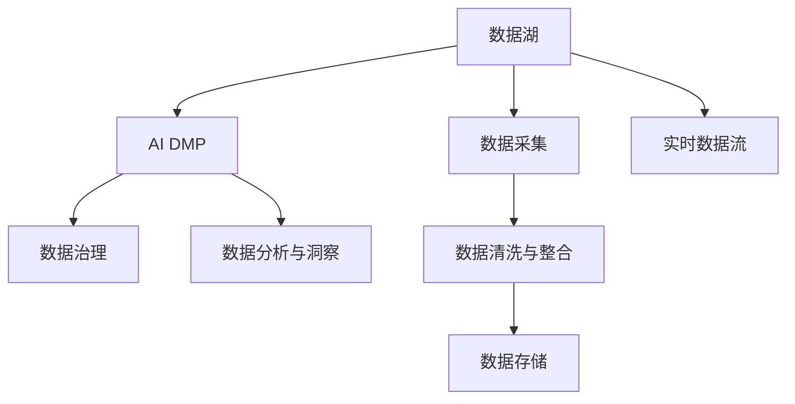

                 

# AI DMP 数据基建：数据分析与洞察

## 1. 背景介绍

### 1.1 问题由来

数字营销行业正在经历着前所未有的变革。随着数字化转型步伐的加快，广告主和营销人员越来越依赖数据驱动的洞察来优化营销策略、提升广告效果。然而，现有的数据采集、分析和应用工具往往存在诸多局限性，难以满足高要求的营销需求。这其中，数据管理和利用是核心挑战。

### 1.2 问题核心关键点

数据管理和利用是当前数字营销的核心问题。具体包括：
- 数据质量差：由于数据采集来源多样、格式不一，导致数据存在缺失、冗余、不一致等问题。
- 数据孤岛：各业务部门的数据系统孤立，难以进行跨部门的数据整合和分析。
- 分析效率低：现有分析工具在处理大规模数据时效率低下，难以快速响应市场变化。
- 数据价值低：数据挖掘深度不足，未能充分利用数据的丰富信息，导致决策依据不足。

因此，亟需一种高效的数据管理解决方案，以提升数据分析效率、改善数据质量，并充分发挥数据价值，驱动营销效果优化。人工智能驱动的数据管理系统（AI DMP）应运而生。

## 2. 核心概念与联系

### 2.1 核心概念概述

为更好地理解AI DMP，需要首先了解几个关键概念：

- **数据管理平台（DMP）**：用于整合和管理用户数据，支持数据采集、存储、治理和分析，实现数据的价值最大化。
- **AI DMP**：在DMP的基础上，引入人工智能技术，通过数据分析、机器学习、深度学习等方法，自动发现和挖掘数据中的潜在价值，提升数据分析的深度和效率。
- **数据湖（Data Lake）**：大规模、可扩展的数据存储平台，支持多种数据源的接入和数据处理，为AI DMP提供数据支持。
- **数据治理**：通过规则和流程，确保数据的质量、安全性和合规性，为数据的管理和利用提供保障。
- **数据分析与洞察**：基于数据湖和AI DMP的分析平台，实现对数据的深度挖掘和智能分析，生成可操作的营销洞察。

这些概念之间的逻辑关系可以通过以下Mermaid流程图来展示：



这个流程图展示了数据管理平台、AI DMP和数据分析与洞察之间的紧密联系：

1. 数据湖是AI DMP和数据分析的基础，支持大规模数据的存储和处理。
2. AI DMP利用人工智能技术对数据进行治理和深度分析，生成高质量的洞察。
3. 数据治理确保数据的质量和安全，为AI DMP提供规则支持。
4. 数据分析与洞察则是AI DMP的应用目标，帮助营销人员发现数据中的规律和趋势，优化营销决策。

## 3. 核心算法原理 & 具体操作步骤
### 3.1 算法原理概述

AI DMP的核心算法原理主要围绕以下几个方面：

- **数据预处理**：对原始数据进行清洗、去重、归一化等处理，提升数据质量。
- **特征工程**：通过构建特征集，挖掘数据中的潜在价值，生成有意义的特征向量。
- **机器学习与深度学习**：利用机器学习算法和深度学习模型，对数据进行分类、聚类、回归等处理，发现数据中的规律和趋势。
- **自然语言处理（NLP）**：对文本数据进行分词、情感分析、实体识别等处理，提取文本中的关键信息。
- **推荐系统**：利用协同过滤、内容推荐等方法，对用户进行个性化推荐，提升用户体验。

### 3.2 算法步骤详解

AI DMP的实现步骤通常包括：

1. **数据采集与清洗**：
   - 收集用户行为数据、网站访问数据、社交媒体数据等，进行去重、去噪、缺失值填充等处理。
   - 使用数据清洗工具（如ETL工具），保证数据的格式统一和质量一致。

2. **特征工程**：
   - 提取用户特征，如人口统计信息、行为特征、兴趣标签等。
   - 构建特征向量，使用PCA、LDA等降维方法，减少维度，提高特征质量。

3. **模型训练与优化**：
   - 使用机器学习算法（如决策树、随机森林、XGBoost等）训练分类、聚类、回归模型。
   - 使用深度学习模型（如CNN、RNN、Transformer等）训练NLP模型和推荐模型。
   - 通过交叉验证等方法进行模型调优，提升模型性能。

4. **数据可视化与分析**：
   - 使用可视化工具（如Tableau、Power BI等），将分析结果转化为可操作的洞察。
   - 生成报表、仪表盘等可视化内容，帮助营销人员理解数据中的趋势和规律。

5. **实时数据流与决策优化**：
   - 使用实时数据流平台（如Kafka、Flink等），实现数据的实时采集和处理。
   - 利用决策优化算法（如强化学习、多臂赌博机等），实现智能决策。

### 3.3 算法优缺点

AI DMP的优势在于：

- **自动化处理**：通过自动化的算法和模型，提升数据处理的效率和质量。
- **深度分析**：利用机器学习和深度学习技术，挖掘数据中的潜在价值，提升数据分析的深度和精度。
- **实时响应**：通过实时数据流处理，快速响应市场变化，提升决策的时效性。

但AI DMP也存在一些缺点：

- **算法复杂度高**：AI DMP需要复杂的算法和模型，对数据科学家和技术架构师的要求较高。
- **数据依赖性强**：AI DMP的效果依赖于数据的质量和丰富度，数据采集和处理的成本较高。
- **模型解释性差**：AI DMP中的黑盒模型难以解释其内部工作机制，缺乏可解释性。
- **隐私风险高**：AI DMP处理大量个人数据，隐私风险较高，需要严格的数据治理和安全措施。

### 3.4 算法应用领域

AI DMP在多个领域具有广泛的应用，例如：

- **广告投放优化**：通过分析用户行为数据，生成高精度的用户画像，优化广告定向和投放策略。
- **客户关系管理（CRM）**：利用数据分析结果，制定个性化的营销方案，提升客户满意度。
- **市场细分与定位**：基于用户特征和行为数据，进行市场细分和用户定位，优化市场策略。
- **产品推荐系统**：利用推荐算法，为用户推荐个性化产品，提升用户体验。
- **营销效果分析**：通过数据分析，评估营销活动的效果，指导后续的优化策略。

## 4. 数学模型和公式 & 详细讲解 & 举例说明

### 4.1 数学模型构建

AI DMP的核心数学模型通常包括以下几类：

- **回归模型**：用于预测连续数值，如点击率、转化率等。常见的回归模型包括线性回归、多项式回归、岭回归等。
- **分类模型**：用于预测离散类别，如用户是否流失、广告是否有效等。常见的分类模型包括决策树、随机森林、SVM等。
- **聚类模型**：用于对数据进行分组，发现数据中的共性。常见的聚类模型包括K-means、层次聚类、DBSCAN等。
- **推荐系统模型**：用于预测用户对商品的偏好。常见的推荐系统模型包括协同过滤、基于内容的推荐、矩阵分解等。

### 4.2 公式推导过程

以线性回归模型为例，公式推导如下：

设训练集为 $(x_i, y_i)$，其中 $x_i \in \mathbb{R}^n$ 为输入向量， $y_i \in \mathbb{R}$ 为输出向量。假设模型为 $f(x) = w^T x + b$，其中 $w \in \mathbb{R}^n$ 为权重向量，$b \in \mathbb{R}$ 为偏置项。

根据最小二乘法，优化目标为：

$$
\min_{w,b} \sum_{i=1}^N (y_i - f(x_i))^2
$$

其梯度为：

$$
\nabla_{w,b} L = \begin{bmatrix}
\frac{\partial L}{\partial w_1} \\
\frac{\partial L}{\partial w_2} \\
\vdots \\
\frac{\partial L}{\partial w_n} \\
\frac{\partial L}{\partial b}
\end{bmatrix} = \begin{bmatrix}
\frac{2}{N} \sum_{i=1}^N (y_i - f(x_i)) x_{i1} \\
\frac{2}{N} \sum_{i=1}^N (y_i - f(x_i)) x_{i2} \\
\vdots \\
\frac{2}{N} \sum_{i=1}^N (y_i - f(x_i)) x_{in} \\
\frac{2}{N} \sum_{i=1}^N (y_i - f(x_i))
\end{bmatrix}
$$

通过求解上述梯度方程，即可得到最优的权重向量 $w$ 和偏置项 $b$。

### 4.3 案例分析与讲解

假设我们有一个电商平台的用户行为数据，目标预测用户的购买概率。我们可以使用线性回归模型来构建预测模型。

首先，收集用户行为数据，如浏览记录、点击记录、购买记录等。对数据进行清洗和归一化处理，得到输入向量 $x_i$。

其次，设置输出向量 $y_i$ 为用户的购买概率，如果用户购买了商品，$y_i=1$；否则 $y_i=0$。

然后，使用训练集数据 $(x_i, y_i)$ 训练线性回归模型，得到最优的权重向量 $w$ 和偏置项 $b$。

最后，使用测试集数据 $x$ 预测用户的购买概率 $f(x)$。

以下是一个使用Python的实现示例：

```python
import pandas as pd
import numpy as np
from sklearn.linear_model import LinearRegression

# 加载数据集
data = pd.read_csv('user_behavior.csv')

# 数据预处理
X = data.drop(['id', 'time'], axis=1)
y = data['purchase']

# 分割数据集
X_train, X_test, y_train, y_test = train_test_split(X, y, test_size=0.2, random_state=42)

# 训练模型
model = LinearRegression()
model.fit(X_train, y_train)

# 预测
y_pred = model.predict(X_test)
```

通过上述示例，可以看出线性回归模型在用户购买概率预测中的应用。

## 5. 项目实践：代码实例和详细解释说明

### 5.1 开发环境搭建

在进行AI DMP项目实践前，需要准备好开发环境。以下是使用Python进行PyTorch开发的环境配置流程：

1. 安装Anaconda：从官网下载并安装Anaconda，用于创建独立的Python环境。

2. 创建并激活虚拟环境：
```bash
conda create -n ai_dmp python=3.8 
conda activate ai_dmp
```

3. 安装PyTorch：根据CUDA版本，从官网获取对应的安装命令。例如：
```bash
conda install pytorch torchvision torchaudio cudatoolkit=11.1 -c pytorch -c conda-forge
```

4. 安装TensorFlow：从官网下载并安装TensorFlow，或使用Anaconda安装命令。例如：
```bash
conda install tensorflow
```

5. 安装各类工具包：
```bash
pip install numpy pandas scikit-learn matplotlib tqdm jupyter notebook ipython
```

完成上述步骤后，即可在`ai_dmp`环境中开始AI DMP项目实践。

### 5.2 源代码详细实现

接下来，我们将展示一个简单的基于Python和Scikit-learn的AI DMP项目实践，实现一个用户购买行为预测模型。

首先，定义数据处理函数：

```python
from sklearn.model_selection import train_test_split
from sklearn.linear_model import LinearRegression
from sklearn.metrics import accuracy_score

def preprocess_data(data):
    # 数据预处理，包括去除缺失值、归一化等
    X = data.drop(['id', 'time'], axis=1)
    y = data['purchase']
    return X, y
```

然后，定义模型训练和评估函数：

```python
def train_model(X, y):
    # 分割数据集
    X_train, X_test, y_train, y_test = train_test_split(X, y, test_size=0.2, random_state=42)
    
    # 训练模型
    model = LinearRegression()
    model.fit(X_train, y_train)
    
    # 评估模型
    y_pred = model.predict(X_test)
    accuracy = accuracy_score(y_test, y_pred)
    return accuracy
```

最后，启动模型训练流程并评估：

```python
# 加载数据集
data = pd.read_csv('user_behavior.csv')

# 数据预处理
X, y = preprocess_data(data)

# 模型训练
accuracy = train_model(X, y)
print(f'模型准确率为: {accuracy:.3f}')
```

以上就是使用Scikit-learn实现一个简单的用户购买行为预测模型的完整代码实现。可以看到，通过Scikit-learn，我们可以很方便地实现线性回归模型的训练和评估。

### 5.3 代码解读与分析

让我们再详细解读一下关键代码的实现细节：

**preprocess_data函数**：
- `drop`方法：去除不需要的列，如用户ID和时间戳。
- `split`方法：将数据集分割为训练集和测试集。

**train_model函数**：
- `LinearRegression`类：定义线性回归模型。
- `fit`方法：训练模型。
- `predict`方法：预测用户购买概率。
- `accuracy_score`函数：计算模型准确率。

**训练流程**：
- 加载数据集。
- 数据预处理。
- 模型训练。
- 模型评估。

可以看到，Scikit-learn提供了简单易用的接口，使得数据预处理、模型训练、评估等任务变得方便快捷。

当然，实际应用中，还需要考虑更多因素，如模型调优、超参数搜索、模型集成等。但核心的AI DMP范式基本与此类似。

## 6. 实际应用场景

### 6.1 智能推荐系统

AI DMP在智能推荐系统中的应用非常广泛。通过分析用户的历史行为数据，AI DMP可以生成高精度的用户画像，实现个性化推荐。具体而言：

- **数据采集与清洗**：收集用户浏览、点击、购买等行为数据，进行清洗和预处理。
- **特征工程**：提取用户特征，如浏览记录、点击次数、购买频率等。
- **模型训练**：使用协同过滤、基于内容的推荐等方法，训练推荐模型。
- **实时推荐**：利用实时数据流平台，实现用户实时推荐。

通过智能推荐系统，电商、社交媒体、视频平台等业务可以为用户提供更加个性化、精准的推荐内容，提升用户体验和留存率。

### 6.2 客户细分与定位

AI DMP可以用于客户细分和用户定位，帮助企业制定更有针对性的营销策略。具体而言：

- **数据采集与清洗**：收集用户行为数据，如浏览记录、购买记录等，进行清洗和预处理。
- **特征工程**：提取用户特征，如年龄、性别、地域等。
- **聚类分析**：使用K-means等聚类算法，对用户进行分组。
- **细分与定位**：基于聚类结果，制定个性化的营销方案，提升客户满意度。

通过客户细分和用户定位，企业可以更好地理解目标用户群体，制定有针对性的营销策略，提升营销效果和用户黏性。

### 6.3 广告投放优化

AI DMP可以用于广告投放优化，提高广告效果和投放效率。具体而言：

- **数据采集与清洗**：收集用户行为数据，如网站访问记录、搜索记录等，进行清洗和预处理。
- **特征工程**：提取用户特征，如年龄、地域、兴趣等。
- **模型训练**：使用决策树、随机森林等算法，训练广告定向模型。
- **实时优化**：利用实时数据流平台，实现广告投放优化。

通过广告投放优化，广告主可以更精准地定位目标用户，提升广告效果，降低投放成本。

### 6.4 未来应用展望

未来，AI DMP将呈现以下几个发展趋势：

1. **数据融合与跨领域应用**：AI DMP将不仅仅局限于单一领域，而是通过跨领域数据融合，实现更全面的用户画像。
2. **实时数据流与智能化决策**：利用实时数据流平台，实现数据的高效处理和智能化决策，提升响应速度和决策效率。
3. **多模态数据融合**：将文本、图像、音频等多模态数据进行融合，提升数据分析的深度和精度。
4. **模型自适应与动态调整**：利用自适应学习算法，根据市场变化动态调整模型参数，保持模型的高效性和适应性。
5. **自动化与自动化**：通过自动化工具和流程，简化数据分析和应用过程，提升工作效率和质量。
6. **隐私保护与合规性**：引入隐私保护技术，确保数据的安全性和合规性，保护用户隐私。

## 7. 工具和资源推荐

### 7.1 学习资源推荐

为了帮助开发者系统掌握AI DMP的理论基础和实践技巧，这里推荐一些优质的学习资源：

1. **《数据科学手册》**：由权威数据科学家撰写，全面介绍了数据管理、数据治理、数据分析等前沿话题。
2. **《机器学习实战》**：由著名机器学习专家撰写，详细讲解了机器学习算法的原理和实现，包括分类、聚类、回归等。
3. **《深度学习》**：由深度学习领域的权威专家撰写，全面介绍了深度学习模型的原理和实现，包括神经网络、卷积神经网络、循环神经网络等。
4. **《Python数据科学手册》**：由Python数据科学社区领袖撰写，全面介绍了Python在数据分析、可视化、机器学习等领域的应用。
5. **《TensorFlow实战》**：由TensorFlow官方团队撰写，详细讲解了TensorFlow的架构和应用，包括数据流、模型构建、优化等。

通过对这些资源的学习实践，相信你一定能够快速掌握AI DMP的精髓，并用于解决实际的营销问题。

### 7.2 开发工具推荐

高效的开发离不开优秀的工具支持。以下是几款用于AI DMP开发的常用工具：

1. **Python**：开源、高效、易用的编程语言，广泛用于数据科学、机器学习等领域。
2. **Scikit-learn**：Python机器学习库，提供了简单易用的接口，支持多种机器学习算法。
3. **TensorFlow**：开源的深度学习框架，支持分布式计算和模型优化，广泛应用于深度学习领域。
4. **Pandas**：Python数据处理库，支持大规模数据处理和分析。
5. **NumPy**：Python科学计算库，支持高效的数学计算和数组操作。
6. **Jupyter Notebook**：Python交互式编程环境，支持代码块执行和可视化输出。

合理利用这些工具，可以显著提升AI DMP的开发效率，加快创新迭代的步伐。

### 7.3 相关论文推荐

AI DMP领域的研究源于学界的持续研究。以下是几篇奠基性的相关论文，推荐阅读：

1. **《数据挖掘：概念与技术》**：详细介绍了数据挖掘的基本概念和常用技术，涵盖分类、聚类、关联规则等。
2. **《大规模在线学习》**：介绍了大规模在线学习的原理和应用，涵盖了协同过滤、内容推荐等。
3. **《深度学习入门》**：介绍了深度学习的基本概念和常用模型，涵盖了卷积神经网络、循环神经网络等。
4. **《强化学习》**：介绍了强化学习的基本概念和常用算法，涵盖了多臂赌博机、Q-learning等。
5. **《计算机视觉：模型、学习和推理》**：介绍了计算机视觉的基本概念和常用模型，涵盖了卷积神经网络、图像分类等。

这些论文代表了大规模在线学习的最新发展，涵盖了数据挖掘、推荐系统、深度学习、强化学习等多个领域，为AI DMP的研究提供了坚实的基础。

## 8. 总结：未来发展趋势与挑战

### 8.1 研究成果总结

本文对AI DMP数据基建进行了全面系统的介绍。首先，阐述了AI DMP在数据管理中的重要性和核心问题，明确了AI DMP在优化数据分析效率、改善数据质量方面的独特价值。其次，从原理到实践，详细讲解了AI DMP的核心算法和操作步骤，给出了AI DMP项目开发的完整代码实例。同时，本文还广泛探讨了AI DMP在智能推荐、客户细分、广告投放等领域的实际应用，展示了AI DMP的广泛应用前景。此外，本文精选了AI DMP领域的各类学习资源，力求为读者提供全方位的技术指引。

通过本文的系统梳理，可以看到，AI DMP正在成为数据管理平台的重要工具，极大地提升了数据分析的深度和效率，促进了营销效果的优化。未来，伴随技术的不断发展，AI DMP必将在更多的领域得到应用，为数字营销带来革命性影响。

### 8.2 未来发展趋势

展望未来，AI DMP将呈现以下几个发展趋势：

1. **数据融合与跨领域应用**：AI DMP将不仅仅局限于单一领域，而是通过跨领域数据融合，实现更全面的用户画像。
2. **实时数据流与智能化决策**：利用实时数据流平台，实现数据的高效处理和智能化决策，提升响应速度和决策效率。
3. **多模态数据融合**：将文本、图像、音频等多模态数据进行融合，提升数据分析的深度和精度。
4. **模型自适应与动态调整**：利用自适应学习算法，根据市场变化动态调整模型参数，保持模型的高效性和适应性。
5. **自动化与自动化**：通过自动化工具和流程，简化数据分析和应用过程，提升工作效率和质量。
6. **隐私保护与合规性**：引入隐私保护技术，确保数据的安全性和合规性，保护用户隐私。

以上趋势凸显了AI DMP在数据管理中的广阔前景。这些方向的探索发展，必将进一步提升AI DMP的效率和效果，为数字营销带来更广泛的应用。

### 8.3 面临的挑战

尽管AI DMP技术已经取得了瞩目成就，但在迈向更加智能化、普适化应用的过程中，它仍面临诸多挑战：

1. **算法复杂度高**：AI DMP需要复杂的算法和模型，对数据科学家和技术架构师的要求较高。
2. **数据依赖性强**：AI DMP的效果依赖于数据的质量和丰富度，数据采集和处理的成本较高。
3. **模型解释性差**：AI DMP中的黑盒模型难以解释其内部工作机制，缺乏可解释性。
4. **隐私风险高**：AI DMP处理大量个人数据，隐私风险较高，需要严格的数据治理和安全措施。

正视AI DMP面临的这些挑战，积极应对并寻求突破，将使AI DMP技术迈向更加成熟。

### 8.4 研究展望

面对AI DMP所面临的挑战，未来的研究需要在以下几个方面寻求新的突破：

1. **简化算法与模型**：开发更加简单易用的算法和模型，降低技术门槛，提升模型的可解释性。
2. **增强数据采集与处理能力**：提高数据采集和处理的自动化水平，降低人工干预，提升数据质量。
3. **引入更多先验知识**：将符号化的先验知识，如知识图谱、逻辑规则等，与神经网络模型进行巧妙融合，提升模型效果。
4. **引入隐私保护技术**：引入隐私保护技术，如差分隐私、联邦学习等，保护用户隐私。
5. **引入更多模态数据**：将文本、图像、音频等多模态数据进行融合，提升数据分析的深度和精度。
6. **引入更多学习范式**：引入更多学习范式，如半监督学习、自监督学习等，提升模型的泛化能力。

这些研究方向的探索，必将引领AI DMP技术迈向更高的台阶，为数字营销带来更广泛的变革。面向未来，AI DMP技术还需要与其他AI技术进行更深入的融合，如知识表示、因果推理、强化学习等，多路径协同发力，共同推动数字营销的发展。

## 9. 附录：常见问题与解答

**Q1：AI DMP和传统DMP有何区别？**

A: AI DMP在传统DMP的基础上，引入了人工智能技术，通过数据预处理、特征工程、模型训练等步骤，提升数据分析的深度和精度。传统DMP则主要关注数据的整合和管理，缺乏对数据价值深度的挖掘。

**Q2：AI DMP在实际应用中面临哪些挑战？**

A: AI DMP在实际应用中面临以下挑战：
- 算法复杂度高，对数据科学家和技术架构师的要求较高。
- 数据依赖性强，数据采集和处理的成本较高。
- 模型解释性差，难以解释其内部工作机制。
- 隐私风险高，需要严格的数据治理和安全措施。

**Q3：AI DMP如何提升营销效果？**

A: AI DMP通过分析用户行为数据，生成高精度的用户画像，实现个性化推荐。具体而言：
- 数据采集与清洗：收集用户行为数据，进行清洗和预处理。
- 特征工程：提取用户特征，如浏览记录、点击次数等。
- 模型训练：使用协同过滤、基于内容的推荐等方法，训练推荐模型。
- 实时推荐：利用实时数据流平台，实现用户实时推荐。

通过智能推荐系统，电商、社交媒体、视频平台等业务可以为用户提供更加个性化、精准的推荐内容，提升用户体验和留存率。

**Q4：AI DMP如何进行数据治理？**

A: AI DMP的数据治理主要通过以下几个方面实现：
- 数据质量管理：对数据进行清洗、去重、归一化等处理，保证数据的质量和一致性。
- 数据安全管理：引入数据加密、脱敏等技术，确保数据的安全性。
- 数据合规管理：确保数据的使用符合相关法律法规，如GDPR等。

通过数据治理，AI DMP可以确保数据的规范性和安全性，保护用户隐私和数据安全。

---

作者：禅与计算机程序设计艺术 / Zen and the Art of Computer Programming

