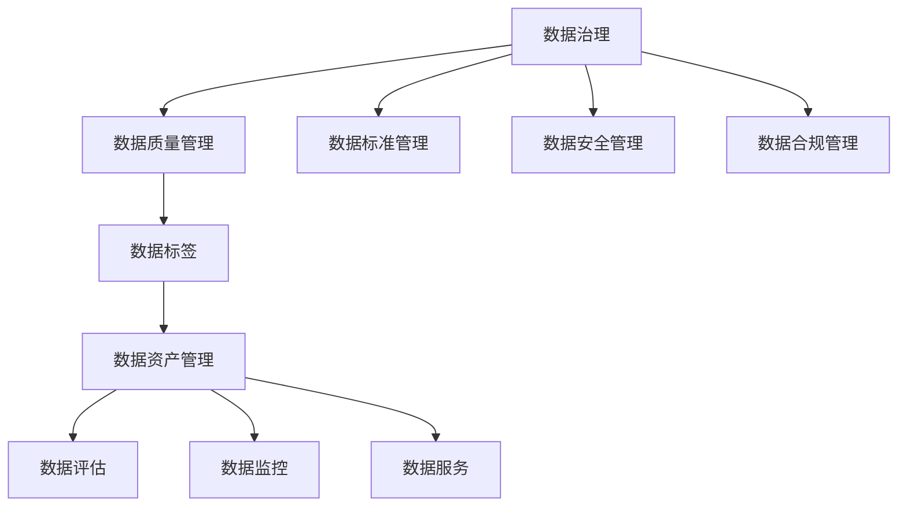

                 

# AI DMP 数据基建：数据质量与数据标准

> 关键词：AI DMP, 数据质量, 数据标准, 数据治理, 数据标签, 数据资产管理

## 1. 背景介绍

### 1.1 问题由来
在数字化转型的浪潮中，人工智能（AI）和大数据（Big Data）技术的应用日益普及。人工智能驱动的个性化推荐系统、智能广告投放、精准营销等领域取得了显著的成果。然而，这些应用的背后，是海量用户行为数据的积累和分析。数据的质量、标准和治理能力，直接决定了AI系统的性能和可靠性。

AI决策模型（AI DMP）作为AI系统的核心组件，承担着数据聚合、整合、加工和转换的任务。其数据质量、标准和治理水平，直接影响了AI系统的决策准确性和效果。然而，当前数据基础设施在数据质量、标准和治理方面仍存在诸多挑战。本文将重点探讨这些问题，并提出相应的解决方案。

### 1.2 问题核心关键点
1. **数据质量**：数据的准确性、完整性、一致性和时效性，对AI DMP的决策效果有直接影响。
2. **数据标准**：数据存储、传输和处理的统一标准，对于数据治理和系统集成至关重要。
3. **数据治理**：数据的采集、存储、管理和使用的规范和策略，是数据质量提升和标准维护的基础。
4. **数据标签**：对数据的属性、特征和元数据进行标准化描述，是数据治理的重要工具。
5. **数据资产管理**：对数据资源进行分类、评估和评估，确保数据资产的价值最大化。

## 2. 核心概念与联系

### 2.1 核心概念概述

为了更好地理解数据治理和AI DMP的关系，我们需要明确几个核心概念：

- **数据治理（Data Governance）**：数据治理是指在数据的全生命周期中，通过制定政策、流程和技术手段，确保数据的正确性、可用性和合规性。数据治理包括数据质量管理、数据标准管理、数据安全管理、数据合规管理等。

- **数据标准（Data Standard）**：数据标准是数据处理的统一规则和规范，包括数据格式、数据模型、数据指标等。数据标准有助于提高数据一致性、可比较性和可理解性。

- **数据质量（Data Quality）**：数据质量是指数据满足业务需求的程度，包括准确性、完整性、一致性、时效性等。数据质量对决策模型的输出结果有直接影响。

- **数据标签（Data Tagging）**：数据标签是对数据的属性、特征和元数据进行标准化描述，如用户画像、商品属性、行为记录等。数据标签有助于数据分类、索引和搜索。

- **数据资产管理（Data Asset Management）**：数据资产管理是指对数据资源进行分类、评估和利用，确保数据资产的价值最大化。数据资产管理包括数据评估、数据监控、数据服务等。

这些核心概念之间的关系可以通过以下Mermaid流程图来展示：



这个流程图展示了一体化的数据治理流程，从数据质量管理到数据标准管理，再到数据资产管理，各个环节互相支撑，共同提升数据治理能力。

## 3. 核心算法原理 & 具体操作步骤
### 3.1 算法原理概述

AI DMP的数据治理涉及数据采集、数据整合、数据清洗、数据转换和数据存储等多个环节。这些环节都需要遵循一定的数据标准，通过数据质量管理技术手段，确保数据的一致性和准确性。

AI DMP的数据治理过程一般包括以下几个关键步骤：

- **数据采集**：从不同来源采集数据，确保数据全面性和多样性。
- **数据整合**：将异构数据进行统一处理，确保数据格式和结构一致。
- **数据清洗**：去除重复、错误和无效数据，确保数据质量。
- **数据转换**：将原始数据转换为可用于AI模型的格式和结构，如特征工程。
- **数据存储**：将处理后的数据存储在高效的数据仓库或数据湖中，确保数据可访问和可分析。

### 3.2 算法步骤详解

以下以数据清洗为例，详细讲解数据治理的算法步骤：

**Step 1: 数据识别和分类**
- 识别数据中的缺失值、重复值、异常值等异常情况。
- 根据数据的属性和特征，进行分类和分组，如用户行为数据、商品交易数据等。

**Step 2: 数据清洗**
- 去除缺失值和异常值，确保数据完整性。
- 对重复值进行去重处理，确保数据唯一性。
- 对数据进行格式转换，确保数据一致性。

**Step 3: 数据验证和测试**
- 使用数据质量评估指标，如准确率、完整性、一致性等，评估数据清洗效果。
- 进行数据测试，确保数据清洗后的数据符合业务需求。

**Step 4: 数据存储**
- 将清洗后的数据存储在高效的数据仓库或数据湖中，如Hadoop、Spark等。
- 使用数据分片、索引等技术，提高数据查询和分析的效率。

**Step 5: 数据监控和维护**
- 实时监控数据质量，及时发现和处理数据问题。
- 定期进行数据清洗和更新，确保数据的时效性和准确性。

### 3.3 算法优缺点

数据治理的算法具有以下优点：
1. **提高数据一致性**：通过统一数据标准，确保数据的一致性和可比较性。
2. **提升数据质量**：通过数据清洗和质量管理，提高数据的准确性和完整性。
3. **保障数据安全**：通过数据合规和安全性管理，确保数据的安全性和隐私保护。
4. **增强决策可靠性**：通过数据治理，提升AI DMP的决策准确性和效果。

同时，该算法也存在一定的局限性：
1. **复杂度高**：数据治理涉及多个环节，操作复杂，需要投入大量人力和资源。
2. **成本高**：数据清洗和质量管理需要大量计算资源，成本较高。
3. **依赖人工**：数据治理依赖人工干预，易受主观因素影响。
4. **更新频率高**：数据来源和业务需求变化频繁，需要定期更新数据标准和治理策略。

尽管存在这些局限性，但数据治理作为数据治理的核心环节，仍然是大数据和AI系统建设的基石。未来相关研究的重点在于如何进一步降低数据治理的成本，提高数据治理的自动化和智能化水平。

### 3.4 算法应用领域

数据治理的算法在以下几个领域得到了广泛应用：

- **个性化推荐系统**：通过数据清洗和标准化，提升推荐算法的准确性和效果。
- **智能广告投放**：通过数据治理，确保广告投放的精准性和合规性。
- **精准营销**：通过数据标签和资产管理，提升营销活动的效果和ROI。
- **智能客服**：通过数据治理，提升客服系统的响应速度和准确性。
- **金融风控**：通过数据治理，确保金融数据的安全性和合规性。

## 4. 数学模型和公式 & 详细讲解 & 举例说明

### 4.1 数学模型构建

数据治理涉及多个环节，各环节的数据处理可以抽象为数学模型。以下以数据清洗为例，构建数学模型。

**数据清洗模型**：

设原始数据集为 $D=\{(x_i, y_i)\}_{i=1}^N$，其中 $x_i$ 为输入数据， $y_i$ 为输出标签。数据清洗的目标是找到一个最优的映射函数 $f$，使得 $f(x_i)$ 处理后的数据满足业务需求。

数据清洗的过程可以表示为：

$$
f(x_i) = \begin{cases}
x_i, & x_i \text{符合业务需求} \\
null, & x_i \text{不符合业务需求}
\end{cases}
$$

其中，$x_i$ 符合业务需求的条件可以表示为：

$$
x_i \in \{x_i' | x_i' \text{为清洗后的数据}
$$

### 4.2 公式推导过程

数据清洗的数学模型可以进一步细化为以下步骤：

**Step 1: 数据预处理**
- 将原始数据转换为标准格式，如日期、数字等。
- 对异常值进行处理，如填补缺失值、平滑数据等。

**Step 2: 数据清洗**
- 去除重复数据，确保数据唯一性。
- 去重去噪，确保数据完整性和准确性。

**Step 3: 数据验证**
- 使用数据质量评估指标，如准确率、完整性、一致性等，评估数据清洗效果。

**Step 4: 数据存储**
- 将清洗后的数据存储在高效的数据仓库或数据湖中。

### 4.3 案例分析与讲解

以一个电商平台的用户行为数据为例，进行数据清洗和标准化的分析。

**原始数据**：
- 用户ID：用户标识
- 购买时间：用户购买商品的日期时间
- 购买金额：用户购买商品的金额
- 商品ID：商品标识
- 商品类别：商品所属分类

**数据清洗步骤**：

**Step 1: 数据预处理**
- 将日期时间转换为标准格式，如 YYYY-MM-DD HH:mm:ss。
- 对异常值进行处理，如填补缺失值、平滑数据等。

**Step 2: 数据清洗**
- 去除重复数据，确保数据唯一性。
- 去重去噪，确保数据完整性和准确性。

**Step 3: 数据验证**
- 使用数据质量评估指标，如准确率、完整性、一致性等，评估数据清洗效果。

**Step 4: 数据存储**
- 将清洗后的数据存储在高效的数据仓库或数据湖中。

通过数据清洗和标准化，可以显著提升电商平台的推荐系统效果，提升用户体验和转化率。

## 5. 项目实践：代码实例和详细解释说明
### 5.1 开发环境搭建

在进行数据治理项目实践前，我们需要准备好开发环境。以下是使用Python进行Pandas开发的环境配置流程：

1. 安装Anaconda：从官网下载并安装Anaconda，用于创建独立的Python环境。

2. 创建并激活虚拟环境：
```bash
conda create -n data-governance-env python=3.8 
conda activate data-governance-env
```

3. 安装Pandas：
```bash
pip install pandas
```

4. 安装其他工具包：
```bash
pip install numpy matplotlib scikit-learn tqdm jupyter notebook ipython
```

完成上述步骤后，即可在`data-governance-env`环境中开始数据治理实践。

### 5.2 源代码详细实现

以下是一个基于Pandas进行数据清洗的代码实现。

首先，定义数据清洗函数：

```python
import pandas as pd

def data_cleaning(data, features):
    cleaned_data = pd.DataFrame()
    for feature in features:
        cleaned_feature = data[feature].dropna().replace(r'^[-]?', '', regex=True)
        cleaned_data[feature] = cleaned_feature
    return cleaned_data
```

然后，对数据进行清洗：

```python
data = pd.read_csv('data.csv')
features = ['购买时间', '购买金额', '商品ID', '商品类别']

cleaned_data = data_cleaning(data, features)

cleaned_data.to_csv('cleaned_data.csv', index=False)
```

以上就是使用Pandas对数据进行清洗的完整代码实现。可以看到，Pandas提供了丰富的数据处理功能，使得数据清洗操作变得简洁高效。

### 5.3 代码解读与分析

让我们再详细解读一下关键代码的实现细节：

**data_cleaning函数**：
- 接受原始数据集和需要清洗的特征列。
- 对每个特征列进行预处理，如去除缺失值、去除噪声等。
- 返回清洗后的数据集。

**Pandas库**：
- Pandas是Python中常用的数据分析库，提供了DataFrame和Series等数据结构，支持数据清洗、筛选、转换等操作。
- Pandas的replace方法可以用于字符串去噪和去除正负号，使用regex参数可以指定正则表达式。
- Pandas的dropna方法可以用于去除缺失值，确保数据完整性。

**数据清洗步骤**：
- 读取原始数据集。
- 定义需要清洗的特征列。
- 调用数据清洗函数，对每个特征列进行处理。
- 将清洗后的数据集保存为CSV文件。

通过Pandas库，可以高效地对数据进行清洗和标准化，提升数据治理的效果。

## 6. 实际应用场景
### 6.1 智能广告投放

在智能广告投放中，数据治理对于广告投放的效果和精准性至关重要。广告投放平台需要收集用户的浏览、点击、购买等行为数据，并进行数据清洗和标准化，以确保广告投放的精准性和合规性。

具体而言，可以使用数据治理技术对用户的浏览记录、点击记录、购买记录等数据进行清洗和标准化。通过数据治理，广告投放平台可以获取用户的兴趣偏好、行为习惯等详细信息，从而实现精准投放和优化广告效果。

### 6.2 金融风控

金融风控需要收集大量的用户行为数据，进行风险评估和预测。数据治理可以确保数据的质量和一致性，提升金融风控系统的决策准确性和效果。

在金融风控中，可以使用数据治理技术对用户的账户信息、交易记录、还款记录等数据进行清洗和标准化。通过数据治理，金融风控系统可以准确评估用户风险，识别欺诈行为，提升金融系统的安全性。

### 6.3 智能客服

智能客服系统需要收集用户的问题和反馈，进行数据清洗和标准化，以提升客服系统的响应速度和准确性。数据治理可以确保数据的质量和一致性，提升智能客服系统的用户体验和满意度。

在智能客服中，可以使用数据治理技术对用户的问题、反馈、聊天记录等数据进行清洗和标准化。通过数据治理，智能客服系统可以准确理解用户需求，生成合理回复，提升客服系统的智能化水平。

### 6.4 未来应用展望

随着数据治理技术的不断发展，数据治理的应用领域将进一步扩展，为更多行业带来变革性影响。

在智慧医疗领域，数据治理可以为医疗决策提供更准确、可靠的数据支持，提升医疗系统的智能化水平，辅助医生诊疗，加速新药开发进程。

在智能教育领域，数据治理可以用于学情分析、知识推荐等方面，因材施教，促进教育公平，提高教学质量。

在智慧城市治理中，数据治理可以为城市事件监测、舆情分析、应急指挥等环节提供高效的数据支持，提高城市管理的自动化和智能化水平，构建更安全、高效的未来城市。

此外，在企业生产、社会治理、文娱传媒等众多领域，数据治理技术也将不断涌现，为传统行业数字化转型升级提供新的技术路径。相信随着技术的日益成熟，数据治理必将在构建人机协同的智能时代中扮演越来越重要的角色。

## 7. 工具和资源推荐
### 7.1 学习资源推荐

为了帮助开发者系统掌握数据治理的理论基础和实践技巧，这里推荐一些优质的学习资源：

1. 《数据治理与大数据》系列博文：由数据治理技术专家撰写，深入浅出地介绍了数据治理原理、方法和技术。

2. KDD《大数据治理》课程：斯坦福大学开设的大数据治理课程，有Lecture视频和配套作业，带你入门大数据治理领域的基本概念和经典模型。

3. 《数据治理与管理》书籍：详细介绍了数据治理的定义、方法和实践，是数据治理领域的经典教材。

4. TED Talks《数据治理：现代企业的关键》：TED Talks视频，深度讨论了数据治理的重要性，以及如何在企业中实施数据治理。

5. DataHack社区：专注于数据治理和数据科学的在线社区，提供丰富的学习资源和实践案例。

通过对这些资源的学习实践，相信你一定能够快速掌握数据治理的精髓，并用于解决实际的数据治理问题。

### 7.2 开发工具推荐

高效的数据治理离不开优秀的工具支持。以下是几款用于数据治理开发的常用工具：

1. Apache Spark：基于内存计算的大数据处理引擎，支持大规模数据集的处理和分析。

2. Apache Hadoop：开源的分布式计算框架，适用于大规模数据存储和处理。

3. Apache Flink：分布式流处理框架，支持实时数据处理和分析。

4. Apache Kafka：分布式流处理平台，适用于数据采集、存储和处理。

5. Apache Cassandra：开源的分布式数据库，适用于大规模数据的存储和管理。

6. Apache Hive：基于Hadoop的数据仓库，支持大规模数据的存储和查询。

合理利用这些工具，可以显著提升数据治理任务的开发效率，加快创新迭代的步伐。

### 7.3 相关论文推荐

数据治理技术的发展源于学界的持续研究。以下是几篇奠基性的相关论文，推荐阅读：

1. A Survey on Data Governance in Big Data Analytics：综述了数据治理在Big Data中的重要性和应用，总结了当前数据治理的技术和方法。

2. Data Governance Process: A Reference Model for Enterprise Information Quality Management：提出了一种数据治理过程模型，用于企业信息质量管理。

3. Data Governance Frameworks and Best Practices：讨论了数据治理的框架和最佳实践，为企业实施数据治理提供了指导。

4. Data Governance: A Roadmap for Successful Implementation：提供了一套数据治理实施指南，帮助企业成功实施数据治理。

这些论文代表了大数据和AI系统建设的数据治理发展脉络。通过学习这些前沿成果，可以帮助研究者把握学科前进方向，激发更多的创新灵感。

## 8. 总结：未来发展趋势与挑战

### 8.1 总结

本文对基于数据治理的AI DMP数据基建进行了全面系统的介绍。首先阐述了数据治理和AI DMP的关系，明确了数据治理在数据质量、标准和治理方面的重要性和价值。其次，从原理到实践，详细讲解了数据治理的算法步骤和关键技术，给出了数据治理任务开发的完整代码实例。同时，本文还广泛探讨了数据治理技术在多个行业领域的应用前景，展示了数据治理范式的巨大潜力。此外，本文精选了数据治理技术的各类学习资源，力求为读者提供全方位的技术指引。

通过本文的系统梳理，可以看到，数据治理作为数据治理的核心环节，已经成为大数据和AI系统建设的基石。数据治理需要开发者根据具体任务，不断迭代和优化数据、算法和系统，方能得到理想的效果。

### 8.2 未来发展趋势

展望未来，数据治理技术将呈现以下几个发展趋势：

1. **自动化和智能化**：未来的数据治理将更加自动化和智能化，通过机器学习、人工智能等技术手段，实现数据清洗、标准化的自动化。

2. **实时性和动态性**：未来的数据治理将更加实时和动态，能够及时捕捉数据变化，进行动态调整和优化。

3. **跨领域和跨模态**：未来的数据治理将更加跨领域和跨模态，能够整合不同来源和类型的数据，实现全面的数据治理。

4. **数据安全性和隐私保护**：未来的数据治理将更加注重数据安全性和隐私保护，确保数据在采集、存储、传输和使用过程中的安全性。

5. **数据资产化和智能化**：未来的数据治理将更加注重数据资产化和智能化，通过数据资产管理，提升数据的价值和利用效率。

以上趋势凸显了数据治理技术的广阔前景。这些方向的探索发展，必将进一步提升数据治理的能力和效果，为构建安全、可靠、高效的数据治理体系提供新的技术支持。

### 8.3 面临的挑战

尽管数据治理技术已经取得了一定的进展，但在迈向更加智能化、普适化应用的过程中，仍面临诸多挑战：

1. **复杂度高**：数据治理涉及多个环节，操作复杂，需要投入大量人力和资源。

2. **成本高**：数据清洗和质量管理需要大量计算资源，成本较高。

3. **依赖人工**：数据治理依赖人工干预，易受主观因素影响。

4. **更新频率高**：数据来源和业务需求变化频繁，需要定期更新数据标准和治理策略。

5. **数据安全性和隐私保护**：数据治理需要确保数据的安全性和隐私保护，防止数据泄露和滥用。

6. **数据治理技术成熟度不足**：当前数据治理技术在自动化、智能化等方面仍需进一步提升。

尽管存在这些挑战，但数据治理作为数据治理的核心环节，仍然是大数据和AI系统建设的基石。未来相关研究的重点在于如何进一步降低数据治理的成本，提高数据治理的自动化和智能化水平。

### 8.4 研究展望

面对数据治理所面临的挑战，未来的研究需要在以下几个方面寻求新的突破：

1. **探索无监督和半监督数据治理方法**：摆脱对大规模标注数据的依赖，利用自监督学习、主动学习等无监督和半监督范式，最大限度利用非结构化数据，实现更加灵活高效的数据治理。

2. **研究自动化和智能化数据治理方法**：开发更加自动化和智能化的数据治理方法，通过机器学习、人工智能等技术手段，实现数据清洗、标准化的自动化。

3. **融合跨领域和跨模态数据治理方法**：通过数据治理技术的创新，整合不同来源和类型的数据，实现全面的数据治理。

4. **提升数据治理的安全性和隐私保护**：通过数据治理技术，确保数据在采集、存储、传输和使用过程中的安全性，防止数据泄露和滥用。

5. **增强数据治理的实时性和动态性**：通过数据治理技术，及时捕捉数据变化，进行动态调整和优化，提升数据治理的实时性和动态性。

6. **优化数据治理的成本和资源消耗**：通过数据治理技术的优化，降低数据治理的成本和资源消耗，提高数据治理的效率和效果。

这些研究方向将进一步提升数据治理的技术水平，为构建安全、可靠、高效的数据治理体系提供新的技术支持。面向未来，数据治理技术还需要与其他人工智能技术进行更深入的融合，如知识表示、因果推理、强化学习等，多路径协同发力，共同推动数据治理技术的进步。只有勇于创新、敢于突破，才能不断拓展数据治理的边界，让数据治理技术更好地造福人类社会。

## 9. 附录：常见问题与解答

**Q1：数据治理和AI DMP是什么关系？**

A: 数据治理是AI DMP的核心组成部分。AI DMP承担着数据聚合、整合、加工和转换的任务，通过数据治理技术，确保数据的准确性、完整性、一致性和时效性，提升AI DMP的决策效果。

**Q2：数据治理的流程和方法有哪些？**

A: 数据治理的流程和方法包括以下几个环节：
1. 数据采集：从不同来源采集数据，确保数据全面性和多样性。
2. 数据整合：将异构数据进行统一处理，确保数据格式和结构一致。
3. 数据清洗：去除重复、错误和无效数据，确保数据质量。
4. 数据转换：将原始数据转换为可用于AI模型的格式和结构，如特征工程。
5. 数据存储：将处理后的数据存储在高效的数据仓库或数据湖中，确保数据可访问和可分析。

**Q3：数据治理如何确保数据质量？**

A: 数据治理通过数据清洗、标准化和验证，确保数据质量。数据清洗包括去除重复、错误和无效数据，确保数据完整性。数据标准化包括数据格式和结构的统一，确保数据一致性。数据验证包括使用数据质量评估指标，如准确率、完整性、一致性等，评估数据清洗效果。

**Q4：数据治理的成本和资源消耗有哪些？**

A: 数据治理的成本和资源消耗主要包括：
1. 数据采集成本：从不同来源采集数据，需要投入大量人力和资源。
2. 数据清洗成本：去除重复、错误和无效数据，需要大量计算资源。
3. 数据存储成本：将处理后的数据存储在高效的数据仓库或数据湖中，需要大量存储资源。

**Q5：数据治理如何提升AI DMP的决策效果？**

A: 数据治理通过数据清洗和标准化，确保数据的一致性和准确性，提升AI DMP的决策效果。通过数据治理，AI DMP可以获取高质量、多样化的数据，进行更加精准的决策和推荐，提升用户体验和效果。

---

作者：禅与计算机程序设计艺术 / Zen and the Art of Computer Programming

