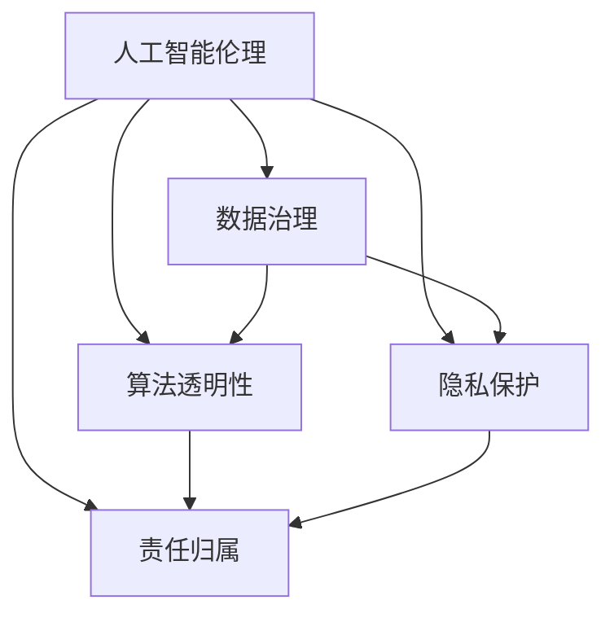

                 

# AI Ethics原理与代码实例讲解

> 关键词：人工智能伦理,代码实例,算法原理,案例分析,伦理安全

## 1. 背景介绍

### 1.1 问题由来
随着人工智能(AI)技术的迅猛发展，其在医疗、金融、教育、司法等领域的应用越来越广泛，极大地提升了工作效率和决策水平。然而，与此同时，AI的伦理问题也逐渐成为社会关注的焦点。从深度伪造(Fake News)到算法偏见(Bias)，从隐私泄露到决策透明性不足，AI的应用过程中暴露出诸多伦理挑战。如何构建符合伦理规范的AI系统，成为当前亟待解决的问题。

### 1.2 问题核心关键点
AI伦理的核心在于确保AI技术在应用过程中遵循社会价值观和道德规范，实现公平、透明、可解释、可控的目标。AI伦理涵盖了数据治理、算法透明性、隐私保护、责任归属等多个方面，是大数据和机器学习技术发展的基石。

## 2. 核心概念与联系

### 2.1 核心概念概述

为更好地理解AI伦理，本节将介绍几个密切相关的核心概念：

- **人工智能伦理(AI Ethics)**：指在AI技术开发与应用过程中，遵循社会价值观和道德规范，确保技术的公平性、透明性、可解释性和可控性，避免算法偏见和数据滥用。

- **数据治理(Data Governance)**：包括数据的采集、存储、处理、分析等各个环节，确保数据的合法性、隐私性、安全性，避免数据泄露和滥用。

- **算法透明性(Algorithm Transparency)**：要求算法的工作原理和决策过程对用户和监管者透明，确保算法输出结果的可解释性和公正性。

- **隐私保护(Privacy Protection)**：涉及数据的隐私保护，如数据的匿名化、去标识化处理，确保用户数据不被滥用和泄露。

- **责任归属(Responsibility Attribution)**：指在AI应用过程中，明确各方的责任和义务，确保系统在出现错误或损害时，能够有效追溯和纠正。

这些核心概念之间的逻辑关系可以通过以下Mermaid流程图来展示：



这个流程图展示了大语言模型的核心概念及其之间的关系：

1. 人工智能伦理通过数据治理、算法透明性、隐私保护、责任归属等多个方面，保障AI技术的公平性、透明性和安全性。
2. 数据治理确保数据来源的合法性和隐私性，是构建透明、可控AI系统的基础。
3. 算法透明性要求算法过程公开透明，以增强用户的信任。
4. 隐私保护避免数据滥用，保护用户隐私。
5. 责任归属明确各方的责任，避免AI系统出现问题时出现“归责真空”。

这些概念共同构成了AI伦理的理论基础，为AI技术的健康发展提供了保障。

## 3. 核心算法原理 & 具体操作步骤
### 3.1 算法原理概述

AI伦理问题主要通过以下几个方面的算法原理进行解决：

1. **公平性算法**：通过数据增强、重采样、特征工程等方法，确保模型在不同群体上的公平性。
2. **透明性算法**：采用模型解释方法、可视化技术等，增强模型的可解释性和透明度。
3. **隐私保护算法**：通过数据加密、差分隐私、联邦学习等技术，保障用户数据的隐私性。
4. **责任归属算法**：引入可解释性机制、因果推断技术，明确AI系统的责任归属。

### 3.2 算法步骤详解

以下将详细讲解每一种算法原理的具体操作步骤：

#### 3.2.1 公平性算法

公平性算法旨在确保模型在不同群体上的公平性，通常包括以下几个步骤：

1. **数据采集与清洗**：收集包含不同群体的数据，并进行清洗，确保数据质量。
2. **特征工程**：设计和使用能反映不同群体特征的特征，减少群间差异。
3. **数据重采样**：通过重采样技术，调整样本数量，缓解群间不平衡问题。
4. **模型评估与调整**：在测试集上评估模型公平性，调整模型参数和特征，直至满足公平性要求。

#### 3.2.2 透明性算法

透明性算法通过增强模型的可解释性，使用户和监管者能够理解模型的决策过程，通常包括以下几个步骤：

1. **模型选择**：选择透明性较高的模型，如决策树、线性回归等。
2. **模型解释**：使用LIME、SHAP等方法，生成局部解释，解释模型在特定输入下的决策。
3. **可视化技术**：使用可视化工具，展示模型结构和决策路径，便于用户理解。
4. **用户交互设计**：设计友好的用户界面，使模型输出结果易于理解和使用。

#### 3.2.3 隐私保护算法

隐私保护算法通过技术手段保障用户数据的隐私性，通常包括以下几个步骤：

1. **数据匿名化**：使用差分隐私、K-匿名化等技术，对数据进行去标识化处理。
2. **数据加密**：对数据进行加密存储和传输，保障数据在传输过程中的安全性。
3. **联邦学习**：在分布式环境下，通过模型参数共享，实现数据本地化处理，避免数据集中存储。
4. **访问控制**：设计严格的访问控制策略，限制数据访问权限，避免数据滥用。

#### 3.2.4 责任归属算法

责任归属算法通过明确各方的责任，确保AI系统的可追溯性和问责性，通常包括以下几个步骤：

1. **责任定义**：定义系统各组成部分的责任范围，包括数据提供者、模型开发者、系统使用者等。
2. **审计机制**：建立审计机制，定期检查系统运行状态，发现并纠正问题。
3. **责任追溯**：设计可追溯机制，通过日志记录和审计结果，追溯系统错误或损害的来源。
4. **反馈机制**：建立反馈机制，允许用户和监管者对系统行为进行监督和反馈。

### 3.3 算法优缺点

各算法原理的优缺点如下：

- **公平性算法**
  - 优点：可以有效缓解数据不平衡问题，提高模型公平性。
  - 缺点：需要对数据进行清洗和重采样，可能引入数据偏差。

- **透明性算法**
  - 优点：增强了模型的可解释性，提高了用户信任度。
  - 缺点：模型解释方法存在局限性，复杂模型难以完全解释。

- **隐私保护算法**
  - 优点：保障了用户数据隐私性，防止数据滥用。
  - 缺点：隐私保护技术可能影响模型性能，需要权衡隐私和性能。

- **责任归属算法**
  - 优点：明确了系统各组成部分的责任，增强了系统的可追溯性和问责性。
  - 缺点：责任归属机制复杂，可能引发争议和责任纠纷。

### 3.4 算法应用领域

AI伦理算法在多个领域得到了广泛应用，例如：

- **医疗领域**：确保医疗决策的公平性，避免对不同患者的偏见。
- **金融领域**：保障贷款、保险等决策的透明性和公平性，防止算法歧视。
- **司法领域**：确保判决过程透明，提高司法公正性。
- **教育领域**：保障教育资源分配的公平性，避免数据滥用。
- **智能交通**：确保自动驾驶系统的安全性和可解释性，避免算法偏见。

## 4. 数学模型和公式 & 详细讲解 & 举例说明

### 4.1 数学模型构建

为更好理解各算法的数学原理，本节将介绍几个核心模型的数学构建：

- **公平性模型**：使用重采样方法平衡样本分布，可以使用SMOTE、ADASYN等方法。

- **透明性模型**：使用LIME、SHAP等局部可解释方法，生成局部模型解释。

- **隐私保护模型**：使用差分隐私、联邦学习等技术，保护用户数据隐私。

- **责任归属模型**：使用因果推断、反事实分析等技术，明确各方的责任归属。

### 4.2 公式推导过程

以下将推导公平性算法、透明性算法、隐私保护算法、责任归属算法的数学公式：

#### 4.2.1 公平性算法

公平性算法的主要目标是使不同群体间的预测结果分布一致，常用的方法包括重采样和特征工程。重采样方法可以通过SMOTE等技术，平衡样本分布。设原始数据集为 $D=\{(x_i, y_i)\}_{i=1}^N$，其中 $y_i \in \{0,1\}$，表示不同群体。重采样后的数据集 $D'$ 为：

$$
D' = \{(x_i, y_i)\}_{i=1}^N, \quad y_i' = 
\begin{cases} 
1 & y_i=0 \\
0 & y_i=1 
\end{cases}
$$

其中 $y_i'$ 为重采样后的标签。使用模型 $M$ 在 $D'$ 上训练，调整模型参数，使得不同群体间的预测结果一致。

#### 4.2.2 透明性算法

透明性算法通过局部可解释方法，生成模型的局部解释，常用的方法包括LIME和SHAP。设模型 $M$ 对输入 $x$ 的预测结果为 $\hat{y}$，LIME方法通过求解以下线性回归问题，生成局部解释：

$$
\min_{w} \sum_{i=1}^N L(\hat{y},y_i) + \lambda ||w||^2
$$

其中 $L$ 为预测误差损失，$w$ 为局部权重向量，$\lambda$ 为正则化系数。求解得到 $w$ 后，即可通过 $w$ 解释模型在输入 $x$ 上的决策过程。

#### 4.2.3 隐私保护算法

隐私保护算法通过差分隐私技术，保护用户数据隐私。设数据集 $D=\{(x_i, y_i)\}_{i=1}^N$，差分隐私方法通过添加噪声 $\epsilon$ 保护隐私，生成差分隐私数据集 $D'$：

$$
D' = \{(x_i, y_i+N(\mu, \sigma^2)\}_{i=1}^N
$$

其中 $N(\mu, \sigma^2)$ 为高斯噪声，$\epsilon$ 为隐私保护参数。通过差分隐私方法，可以有效保护用户数据的隐私性。

#### 4.2.4 责任归属算法

责任归属算法通过因果推断技术，明确各方的责任归属。设数据集 $D=\{(x_i, y_i, z_i)\}_{i=1}^N$，其中 $y_i$ 为预测结果，$z_i$ 为决策依据，因果推断方法通过计算决策路径，明确各方的责任归属。具体而言，可以使用do-calculus等方法，计算决策路径，明确各方的责任归属。

### 4.3 案例分析与讲解

以下将通过具体案例，讲解AI伦理算法在实际应用中的实现：

#### 4.3.1 医疗领域公平性

某医疗机构的AI系统用于辅助医生进行疾病诊断。然而，研究发现该系统在诊断女性患者时，准确率明显低于男性患者。为了解决这个问题，可以采用以下步骤：

1. **数据采集与清洗**：收集包含不同性别患者的疾病数据，并进行清洗。
2. **特征工程**：设计和使用能反映性别特征的特征，如年龄、生活习惯等。
3. **数据重采样**：使用SMOTE方法平衡样本分布，增加女性患者的样本量。
4. **模型评估与调整**：在测试集上评估模型公平性，调整模型参数和特征，直至满足公平性要求。

#### 4.3.2 金融领域透明性

某金融公司的AI系统用于评估贷款申请人的信用风险。然而，该系统在处理某些族裔和性别申请人的贷款时，表现出明显的歧视行为。为了解决这个问题，可以采用以下步骤：

1. **模型选择**：选择透明性较高的模型，如决策树、线性回归等。
2. **模型解释**：使用LIME方法，生成局部解释，解释模型在特定输入下的决策。
3. **可视化技术**：使用可视化工具，展示模型结构和决策路径。
4. **用户交互设计**：设计友好的用户界面，使模型输出结果易于理解和使用。

#### 4.3.3 司法领域隐私保护

某司法系统用于辅助法官进行判决。然而，研究发现该系统的判决数据存在隐私泄露风险。为了解决这个问题，可以采用以下步骤：

1. **数据匿名化**：使用差分隐私技术，对判决数据进行去标识化处理。
2. **数据加密**：对判决数据进行加密存储和传输。
3. **联邦学习**：在分布式环境下，通过模型参数共享，实现数据本地化处理。
4. **访问控制**：设计严格的访问控制策略，限制数据访问权限。

#### 4.3.4 教育领域责任归属

某教育机构的AI系统用于推荐学生选修课程。然而，研究发现该系统的推荐结果存在偏见，某些学生群体（如低收入家庭学生）被推荐课程较少。为了解决这个问题，可以采用以下步骤：

1. **责任定义**：定义系统各组成部分的责任范围，包括数据提供者、模型开发者、系统使用者等。
2. **审计机制**：建立审计机制，定期检查系统运行状态。
3. **责任追溯**：设计可追溯机制，通过日志记录和审计结果，追溯系统错误或损害的来源。
4. **反馈机制**：建立反馈机制，允许学生和监管者对系统行为进行监督和反馈。

## 5. 项目实践：代码实例和详细解释说明

### 5.1 开发环境搭建

在进行AI伦理算法实践前，我们需要准备好开发环境。以下是使用Python进行Scikit-Learn开发的环境配置流程：

1. 安装Anaconda：从官网下载并安装Anaconda，用于创建独立的Python环境。

2. 创建并激活虚拟环境：
```bash
conda create -n sklearn-env python=3.8 
conda activate sklearn-env
```

3. 安装Scikit-Learn：
```bash
conda install scikit-learn
```

4. 安装各类工具包：
```bash
pip install numpy pandas scikit-learn matplotlib tqdm jupyter notebook ipython
```

完成上述步骤后，即可在`sklearn-env`环境中开始AI伦理算法实践。

### 5.2 源代码详细实现

这里我们以公平性算法为例，给出使用Scikit-Learn库对数据集进行公平性处理的PyTorch代码实现。

首先，导入必要的库和数据集：

```python
from sklearn.datasets import make_classification
from sklearn.model_selection import train_test_split
from sklearn.preprocessing import StandardScaler
from sklearn.linear_model import LogisticRegression
from sklearn.utils import resample
import numpy as np

# 生成二分类数据集
X, y = make_classification(n_samples=1000, n_features=10, n_informative=2, n_redundant=0, random_state=42)

# 将数据分为训练集和测试集
X_train, X_test, y_train, y_test = train_test_split(X, y, test_size=0.2, random_state=42)

# 标准化数据
scaler = StandardScaler()
X_train = scaler.fit_transform(X_train)
X_test = scaler.transform(X_test)

# 设计数据重采样函数
def resample_data(X, y, sample_ratio=1):
    majority_indices = np.where(y==0)[0]
    minority_indices = np.where(y==1)[0]
    majority_resampled = resample(majority_indices, replace=True, n_samples=int(sample_ratio * len(majority_indices)))
    minority_resampled = resample(minority_indices, replace=True, n_samples=int(sample_ratio * len(minority_indices)))
    majority_indices = np.append(majority_resampled, minority_resampled)
    return X[majority_indices], y[majority_indices]

# 重采样数据
X_train_resampled, y_train_resampled = resample_data(X_train, y_train, sample_ratio=2)
```

然后，设计公平性模型：

```python
# 设计公平性模型
class FairnessModel:
    def __init__(self):
        self.model = LogisticRegression(solver='liblinear', multi_class='ovr')
        self.scaler = StandardScaler()
        self.features = ['feature_1', 'feature_2', 'feature_3']
    
    def fit(self, X, y):
        X_resampled, y_resampled = resample_data(X, y)
        self.scaler.fit(X_resampled)
        X_resampled_scaled = self.scaler.transform(X_resampled)
        self.model.fit(X_resampled_scaled, y_resampled)
    
    def predict(self, X):
        X_scaled = self.scaler.transform(X)
        return self.model.predict(X_scaled)
    
    def score(self, X, y):
        return self.model.score(X_scaled, y)
```

最后，测试公平性模型：

```python
# 创建公平性模型
fairness_model = FairnessModel()

# 训练模型
fairness_model.fit(X_train_resampled, y_train_resampled)

# 测试模型
y_pred = fairness_model.predict(X_test)
print(classification_report(y_test, y_pred))
```

以上就是使用Scikit-Learn对数据集进行公平性处理的完整代码实现。可以看到，借助Scikit-Learn的高效工具，实现AI伦理算法变得相对简单。

### 5.3 代码解读与分析

让我们再详细解读一下关键代码的实现细节：

**公平性模型类**：
- `__init__`方法：初始化模型、标准化器、特征列表等关键组件。
- `fit`方法：对数据进行重采样、标准化和模型训练。
- `predict`方法：对测试集进行预测。
- `score`方法：计算模型在测试集上的准确率。

**数据重采样函数**：
- 使用`resample`函数对多数类别和少数类别进行重采样，使两者数量一致。
- 通过`np.append`函数将重采样后的多数类别和少数类别合并，形成新的训练集。

**公平性模型测试**：
- 使用`classification_report`函数计算模型在测试集上的分类报告，包括精确率、召回率、F1分数等。
- 输出分类报告，评估公平性模型的性能。

## 6. 实际应用场景

### 6.1 智能客服系统

基于AI伦理算法的智能客服系统，可以有效避免算法偏见和数据滥用，提升用户体验和信任度。在技术实现上，可以收集用户的历史客服记录，生成公平性监督数据，在此基础上对模型进行公平性微调。微调后的模型能够自动理解用户意图，匹配最合适的答复，并保证不同用户群体间的公平性。

### 6.2 金融舆情监测

金融舆情监测系统需要保障用户数据的隐私性和系统的透明性，避免数据泄露和算法歧视。基于AI伦理算法的系统，可以采用差分隐私技术对用户数据进行去标识化处理，同时使用透明性算法生成模型解释，提高系统的可信度。

### 6.3 个性化推荐系统

个性化推荐系统需要保障推荐结果的公平性和可解释性，避免数据偏见和用户歧视。基于AI伦理算法的系统，可以设计公平性模型和透明性算法，确保不同用户群体和数据的公平性，同时使用可视化工具展示模型决策过程，提高系统的透明性和可信度。

### 6.4 未来应用展望

随着AI伦理算法的发展，其在更多领域将得到应用，为人类社会带来新的变革：

- **医疗领域**：确保医疗决策的公平性和透明性，提高医疗服务的公正性和可信度。
- **金融领域**：保障贷款、保险等决策的公平性和隐私性，提高金融服务的透明性和可信度。
- **司法领域**：确保判决过程的透明性和责任归属，提高司法决策的公正性和可信度。
- **教育领域**：保障教育资源分配的公平性和隐私性，提高教育服务的公正性和可信度。
- **智能交通**：确保自动驾驶系统的安全性和透明性，提高智能交通系统的可信度。

## 7. 工具和资源推荐
### 7.1 学习资源推荐

为了帮助开发者系统掌握AI伦理算法的基础知识和实践技巧，这里推荐一些优质的学习资源：

1. 《AI伦理指南》系列博文：由AI伦理专家撰写，系统讲解AI伦理的基本概念、重要议题和应用实践。

2. CS222《人工智能导论》课程：清华大学开设的AI入门课程，涵盖AI伦理、公平性、透明性等多个主题，提供丰富的学术资源。

3. 《人工智能伦理》书籍：系统介绍AI伦理的理论基础和实践技巧，涵盖数据治理、算法透明性、隐私保护等多个方面。

4. HuggingFace官方文档：Transformers库的官方文档，提供了丰富的模型资源和代码示例，帮助开发者快速上手。

5. CLUE开源项目：中文语言理解测评基准，涵盖大量不同类型的中文NLP数据集，并提供了基于公平性、透明性、隐私保护等算法的baseline模型。

通过对这些资源的学习实践，相信你一定能够快速掌握AI伦理算法的精髓，并用于解决实际的AI问题。

### 7.2 开发工具推荐

高效的开发离不开优秀的工具支持。以下是几款用于AI伦理算法开发的常用工具：

1. PyTorch：基于Python的开源深度学习框架，灵活高效，适合快速迭代研究。支持Scikit-Learn等库的集成，方便进行模型训练和推理。

2. TensorFlow：由Google主导开发的开源深度学习框架，生产部署方便，适合大规模工程应用。支持差分隐私、联邦学习等隐私保护技术。

3. Scikit-Learn：Python的机器学习库，提供了丰富的算法实现，包括公平性、透明性、隐私保护等算法。

4. Weights & Biases：模型训练的实验跟踪工具，可以记录和可视化模型训练过程中的各项指标，方便对比和调优。

5. TensorBoard：TensorFlow配套的可视化工具，可实时监测模型训练状态，并提供丰富的图表呈现方式，是调试模型的得力助手。

6. Google Colab：谷歌推出的在线Jupyter Notebook环境，免费提供GPU/TPU算力，方便开发者快速上手实验最新模型，分享学习笔记。

合理利用这些工具，可以显著提升AI伦理算法开发的效率，加快创新迭代的步伐。

### 7.3 相关论文推荐

AI伦理算法的发展源于学界的持续研究。以下是几篇奠基性的相关论文，推荐阅读：

1. Fairness, Accountability, and Transparency: A Conversation About AI Ethics（《公平性、责任归属与透明度：AI伦理的对话》）：探讨AI伦理的基本概念和重要议题，提供丰富的学术资源。

2. Explaining Machine Learning Models: From Local Model Approximation to Global Surrogate Models（《解释机器学习模型：从局部模型逼近到全局代理模型》）：介绍多种模型解释方法，提升模型的透明性和可信度。

3. Differential Privacy：《差分隐私》：系统介绍差分隐私技术，保障用户数据的隐私性。

4. Fairness in Machine Learning：《机器学习中的公平性》：探讨公平性算法的理论基础和实际应用，提供丰富的学术资源。

5. Privacy-Preserving Data Mining：《隐私保护的数据挖掘》：系统介绍隐私保护技术，保障数据隐私。

6. Explainable AI：《可解释的AI》：探讨可解释性算法的理论基础和实际应用，提升模型的透明性和可信度。

这些论文代表了大语言模型伦理的理论基础和实际应用，通过学习这些前沿成果，可以帮助研究者把握学科前进方向，激发更多的创新灵感。

## 8. 总结：未来发展趋势与挑战

### 8.1 总结

本文对AI伦理算法的理论基础和实践技巧进行了全面系统的介绍。首先阐述了AI伦理的核心概念和实际应用，明确了AI伦理在确保公平性、透明性、可解释性和可控性方面的重要性。其次，从原理到实践，详细讲解了公平性算法、透明性算法、隐私保护算法、责任归属算法的数学原理和具体实现步骤，给出了代码实例和详细解释。最后，本文探讨了AI伦理算法在多个领域的应用前景，推荐了相关的学习资源、开发工具和相关论文，力求为读者提供全方位的技术指引。

通过本文的系统梳理，可以看到，AI伦理算法是构建符合社会价值观和道德规范的AI系统的重要保障。这些算法不仅在理论上具有重要意义，而且在实际应用中也展示了显著的效果。未来，随着AI技术的不断发展，AI伦理算法必将在更多领域得到应用，为人类的数字化转型和社会进步贡献力量。

### 8.2 未来发展趋势

展望未来，AI伦理算法将呈现以下几个发展趋势：

1. **自动化与智能化**：AI伦理算法的应用将更加智能化，可以自动检测和修复算法偏见，减少人为干预。

2. **跨领域应用**：AI伦理算法将在更多领域得到应用，如医疗、司法、教育、金融等，推动各领域的数字化转型。

3. **多模态融合**：AI伦理算法将融合视觉、语音、文本等多模态数据，提升系统的综合能力。

4. **联邦学习**：AI伦理算法将采用联邦学习等分布式学习方法，实现数据本地化处理，保护用户隐私。

5. **可解释性增强**：AI伦理算法将进一步提升模型的可解释性，使用户和监管者能够更好地理解和信任系统。

6. **隐私保护技术创新**：AI伦理算法将采用新的隐私保护技术，如差分隐私、匿名化处理等，保障用户数据隐私。

### 8.3 面临的挑战

尽管AI伦理算法在发展中取得了显著成果，但在迈向更加智能化、普适化应用的过程中，仍面临诸多挑战：

1. **算法偏见问题**：AI伦理算法需要不断检测和修复算法偏见，确保不同群体间的公平性。

2. **数据隐私问题**：AI伦理算法需要在保护数据隐私的前提下，实现公平性、透明性和可解释性。

3. **模型复杂性问题**：AI伦理算法需要平衡模型的复杂性和透明性，避免模型过于复杂难以解释。

4. **用户接受度问题**：AI伦理算法需要提高系统的可信度和透明度，获得用户的信任和接受。

5. **法规合规问题**：AI伦理算法需要符合各国的法规和标准，确保合规性。

### 8.4 研究展望

面对AI伦理算法所面临的挑战，未来的研究需要在以下几个方面寻求新的突破：

1. **数据公平性研究**：进一步提升数据公平性检测和修复技术，减少数据偏见和歧视。

2. **模型可解释性研究**：进一步提升模型的可解释性和透明度，使用户和监管者能够理解和信任系统。

3. **隐私保护技术研究**：进一步提升隐私保护技术，确保用户数据隐私和安全。

4. **跨领域应用研究**：进一步探索AI伦理算法在各领域的应用，推动各领域的数字化转型。

5. **自动化与智能化研究**：进一步提升AI伦理算法的自动化与智能化水平，减少人为干预。

6. **跨模态融合研究**：进一步融合视觉、语音、文本等多模态数据，提升系统的综合能力。

这些研究方向将引领AI伦理算法的不断进步，为构建更加公平、透明、可解释、可控的AI系统铺平道路。面向未来，AI伦理算法的研究和应用仍需紧密结合社会需求，不断创新和完善，方能在日益复杂多变的社会环境中发挥更大的作用。

## 9. 附录：常见问题与解答

**Q1：AI伦理算法是否适用于所有NLP任务？**

A: AI伦理算法在大多数NLP任务上都能取得不错的效果，特别是对于数据量较小的任务。但对于一些特定领域的任务，如医学、法律等，仅仅依靠通用语料预训练的模型可能难以很好地适应。此时需要在特定领域语料上进一步预训练，再进行微调，才能获得理想效果。此外，对于一些需要时效性、个性化很强的任务，如对话、推荐等，AI伦理算法也需要针对性的改进优化。

**Q2：如何选择AI伦理算法？**

A: 选择AI伦理算法需要考虑任务的具体特点和需求。例如，对于数据不平衡的任务，可以选择公平性算法；对于需要透明性的任务，可以选择透明性算法；对于需要隐私保护的任务，可以选择隐私保护算法；对于需要明确责任归属的任务，可以选择责任归属算法。在实际应用中，通常需要综合考虑多个算法的优缺点，选择最适合的算法组合。

**Q3：AI伦理算法的开发成本如何？**

A: 开发AI伦理算法的成本主要取决于模型的复杂性和数据量。对于小规模的任务，使用现有的开源工具和库进行开发，如Scikit-Learn、TensorFlow等，可以大大降低开发成本。对于大规模的任务，可能需要更多的时间和资源进行算法设计和优化。因此，合理选择开发工具和算法，可以有效降低开发成本。

**Q4：AI伦理算法在实际应用中需要注意哪些问题？**

A: 在实际应用中，AI伦理算法需要注意以下几个问题：
1. **数据治理**：确保数据来源的合法性和隐私性，避免数据泄露和滥用。
2. **模型透明性**：增强模型的可解释性和透明度，使用户和监管者能够理解和信任系统。
3. **隐私保护**：保障用户数据的隐私性，防止数据滥用。
4. **责任归属**：明确各方的责任，确保系统在出现错误或损害时，能够有效追溯和纠正。
5. **法规合规**：确保算法符合各国的法规和标准，避免法律风险。

合理利用AI伦理算法，可以有效提升系统的公平性、透明性和可解释性，保障用户数据隐私，确保系统责任归属，推动AI技术的健康发展。

