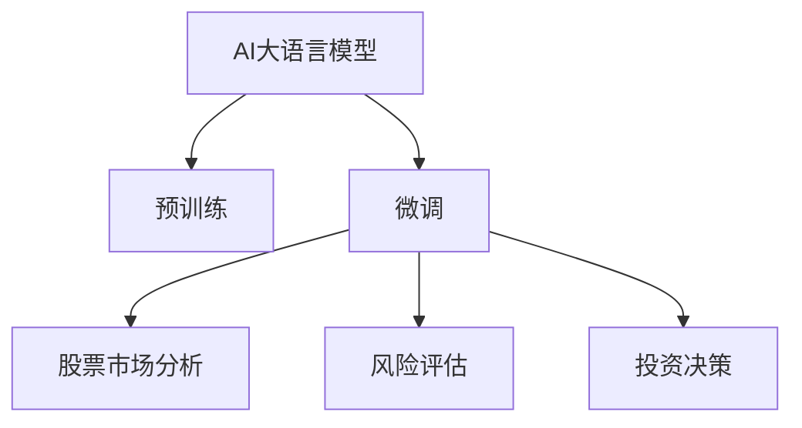

                 

# AI LLM在股票市场分析中的突破

## 1. 背景介绍

近年来，随着深度学习技术的快速发展，AI大语言模型（Large Language Models, LLMs）在金融领域的应用得到了广泛关注。股票市场分析作为金融分析的重要分支，需要处理海量非结构化文本数据，包括新闻、公告、财务报告等，从中提取有用信息，进行价值判断。传统的方法依赖于人工提取特征，受制于领域知识和个人经验，难以兼顾全面性和准确性。

AI大语言模型通过预训练学习大量的文本数据，具有强大的语言理解和生成能力，能够自动提取和分析股票市场相关文本，提供个性化的股票推荐和风险评估，助力投资决策。然而，现有的AI大语言模型在金融领域的微调应用仍处于探索阶段，存在数据获取困难、模型泛化能力不足等问题。本文旨在探讨如何利用AI大语言模型进行股票市场分析，并讨论其突破点。

## 2. 核心概念与联系

### 2.1 核心概念概述

为更好地理解AI大语言模型在股票市场分析中的应用，本节将介绍几个关键概念：

- **AI大语言模型 (LLMs)**：如GPT、BERT、T5等，通过预训练学习大量文本数据，具有自动提取和理解自然语言的能力。
- **预训练 (Pre-training)**：在大规模无标签文本语料上，通过自监督学习任务训练通用语言模型，学习通用的语言表示。
- **微调 (Fine-tuning)**：在预训练模型的基础上，使用特定领域的标注数据，通过有监督学习优化模型在该领域上的性能。
- **股票市场分析 (Financial Analysis)**：包括股票价格预测、新闻事件分析、财务报表分析、情绪分析等，旨在从大量文本中提取有用信息，辅助投资决策。
- **风险评估 (Risk Assessment)**：通过分析股票市场中的各种风险因素，预测和评估股票的潜在风险。
- **投资决策 (Investment Decision)**：基于股票市场分析和风险评估的结果，选择股票买卖时机，优化投资组合。

这些核心概念之间的逻辑关系可以通过以下Mermaid流程图来展示：



该流程图展示了AI大语言模型从预训练到微调，再到股票市场分析、风险评估和投资决策的全过程。

## 3. 核心算法原理 & 具体操作步骤

### 3.1 算法原理概述

AI大语言模型在股票市场分析中的应用，本质上是通过预训练和微调，将通用语言模型转化为特定领域的股票分析模型。其核心思想是：利用大语言模型的预训练能力，自动学习股票市场中的通用知识和模式，然后在微调阶段，通过特定领域的标注数据，调整模型参数，使其能够适应股票市场的复杂环境。

具体而言，在股票市场分析任务中，我们可以将以下步骤概化为算法原理：

1. **预训练模型加载**：选择并加载预训练好的大语言模型，如BERT、GPT等。
2. **数据准备**：收集股票市场相关的文本数据，如新闻、公告、财务报表等，进行清洗和标注。
3. **微调模型**：使用准备好的标注数据，对预训练模型进行微调，更新模型参数。
4. **股票分析**：利用微调后的模型，自动分析股票市场文本数据，提取有价值的信息。
5. **风险评估**：通过分析文本数据，评估股票市场的潜在风险，如市场波动、政策变化等。
6. **投资决策**：结合股票分析和风险评估的结果，生成投资建议，优化投资组合。

### 3.2 算法步骤详解

基于AI大语言模型的股票市场分析涉及以下详细步骤：

**Step 1: 数据预处理和标注**

- 收集股票市场相关的文本数据，如新闻、公告、财务报表等。
- 对文本进行清洗和预处理，去除噪声和无关信息。
- 根据股票市场分析的任务需求，对文本数据进行标注。例如，为新闻文本标注情感极性、市场主题等信息。

**Step 2: 模型微调**

- 选择并加载预训练好的大语言模型，如BERT、GPT等。
- 定义微调的目标函数，如交叉熵损失、伯努利损失等，用于衡量模型预测与标注数据之间的差异。
- 设置微调的超参数，如学习率、批大小、迭代轮数等。
- 使用准备好的标注数据，对预训练模型进行微调，更新模型参数。

**Step 3: 股票分析**

- 利用微调后的模型，对股票市场文本数据进行自动分析，提取有价值的信息。例如，识别股票价格变化、市场趋势、新闻事件等信息。
- 将提取的信息与股票市场的历史数据结合，进行综合分析，生成股票市场报告。

**Step 4: 风险评估**

- 通过分析文本数据，评估股票市场的潜在风险，如市场波动、政策变化等。例如，识别负面新闻、市场谣言等。
- 根据风险评估结果，调整投资策略，规避风险。

**Step 5: 投资决策**

- 结合股票分析和风险评估的结果，生成投资建议，如买入、卖出、持有等。
- 优化投资组合，实现资产多样化，降低风险。

### 3.3 算法优缺点

AI大语言模型在股票市场分析中的应用具有以下优点：

1. **自动化**：自动提取和分析文本数据，减少人工干预，提高分析效率。
2. **灵活性**：适用于各种文本数据类型和分析任务，能够灵活适应不同的市场环境。
3. **泛化能力**：通过预训练学习大量文本数据，模型具备较强的泛化能力，能够处理不同类型的文本数据。
4. **可解释性**：利用自然语言处理技术，分析过程透明，结果可解释。

同时，也存在一些局限性：

1. **数据获取困难**：高质量的股票市场文本数据获取难度较大，需要大量的手动标注工作。
2. **模型泛化能力有限**：预训练模型可能无法完全适应特定市场的复杂环境，需要进一步微调。
3. **模型风险**：由于模型训练过程存在偏差，可能引入不良信息，影响投资决策。
4. **资源消耗大**：大语言模型通常需要大量计算资源进行预训练和微调，资源消耗较大。

尽管存在这些局限性，AI大语言模型在股票市场分析中的应用前景广阔，正在逐步成为主流分析手段之一。

### 3.4 算法应用领域

AI大语言模型在股票市场分析中的应用主要集中在以下几个领域：

- **股票价格预测**：利用历史股价数据和市场新闻，预测未来股价走势。
- **市场情绪分析**：通过分析市场新闻和社交媒体，评估市场情绪，预测市场趋势。
- **财务报表分析**：自动分析公司财务报表，提取关键财务指标，辅助投资决策。
- **风险评估**：通过分析市场新闻、政策变化等信息，评估股票市场的潜在风险，调整投资策略。
- **投资组合优化**：结合股票分析结果，优化投资组合，降低风险，提高收益。

## 4. 数学模型和公式 & 详细讲解 & 举例说明

### 4.1 数学模型构建

在AI大语言模型进行股票市场分析的过程中，我们通常使用以下数学模型进行描述：

- **输入表示**：将股票市场文本数据转换为模型的输入表示，如BERT模型的输入嵌入。
- **模型架构**：包括自回归模型、自编码模型等，用于学习文本表示。
- **输出表示**：模型的输出表示可以是文本分类、回归等，用于股票价格预测、市场情绪分析等任务。
- **损失函数**：用于衡量模型预测与标注数据之间的差异，如交叉熵损失、伯努利损失等。
- **优化算法**：如Adam、SGD等，用于更新模型参数，最小化损失函数。

### 4.2 公式推导过程

以股票价格预测为例，假设有N个历史股价数据点 $(x_1, y_1), (x_2, y_2), ..., (x_N, y_N)$，其中 $x_i$ 表示历史股价，$y_i$ 表示未来股价。我们使用预训练好的BERT模型进行股票价格预测，其输入表示为 $x_i$，输出表示为 $y_i$。模型的预测结果为 $\hat{y}_i$，与 $y_i$ 的差异定义为损失函数 $\ell_i = y_i - \hat{y}_i$。则总体损失函数为：

$$
\mathcal{L} = \frac{1}{N} \sum_{i=1}^N \ell_i
$$

我们通过优化算法，如Adam，最小化总体损失函数，更新模型参数，得到最终的预测结果 $\hat{y}_i$。

### 4.3 案例分析与讲解

为了更好地理解AI大语言模型在股票市场分析中的应用，我们可以通过一个具体的案例进行说明：

**案例：股票价格预测**

假设我们要预测某公司的未来股价，可以利用AI大语言模型进行如下分析：

1. **数据准备**：收集公司历史股价数据和市场新闻，进行清洗和标注。
2. **模型微调**：选择并加载预训练好的BERT模型，定义损失函数和优化算法，对模型进行微调。
3. **股票分析**：利用微调后的模型，对市场新闻进行情感分析，识别市场情绪。
4. **价格预测**：结合历史股价数据和市场情绪，生成未来股价预测。
5. **风险评估**：分析市场新闻，评估潜在风险，调整投资策略。

通过上述步骤，AI大语言模型能够自动化地进行股票价格预测，辅助投资决策。

## 5. 项目实践：代码实例和详细解释说明

### 5.1 开发环境搭建

在进行股票市场分析项目的开发时，我们需要准备好开发环境。以下是使用Python进行PyTorch开发的环境配置流程：

1. 安装Anaconda：从官网下载并安装Anaconda，用于创建独立的Python环境。
2. 创建并激活虚拟环境：
```bash
conda create -n pytorch-env python=3.8 
conda activate pytorch-env
```

3. 安装PyTorch：根据CUDA版本，从官网获取对应的安装命令。例如：
```bash
conda install pytorch torchvision torchaudio cudatoolkit=11.1 -c pytorch -c conda-forge
```

4. 安装Transformers库：
```bash
pip install transformers
```

5. 安装各类工具包：
```bash
pip install numpy pandas scikit-learn matplotlib tqdm jupyter notebook ipython
```

完成上述步骤后，即可在`pytorch-env`环境中开始股票市场分析项目的开发。

### 5.2 源代码详细实现

以下是使用Transformers库对BERT模型进行股票价格预测的PyTorch代码实现。

首先，定义股票价格预测的任务：

```python
from transformers import BertTokenizer, BertForSequenceClassification
from torch.utils.data import Dataset, DataLoader
import torch

class StockPricePredictionDataset(Dataset):
    def __init__(self, texts, labels, tokenizer, max_len=128):
        self.texts = texts
        self.labels = labels
        self.tokenizer = tokenizer
        self.max_len = max_len
        
    def __len__(self):
        return len(self.texts)
    
    def __getitem__(self, item):
        text = self.texts[item]
        label = self.labels[item]
        
        encoding = self.tokenizer(text, return_tensors='pt', max_length=self.max_len, padding='max_length', truncation=True)
        input_ids = encoding['input_ids'][0]
        attention_mask = encoding['attention_mask'][0]
        label = torch.tensor(label, dtype=torch.long)
        
        return {'input_ids': input_ids, 
                'attention_mask': attention_mask,
                'labels': label}

# 标签与id的映射
label2id = {'buy': 0, 'sell': 1, 'hold': 2}

# 创建dataset
tokenizer = BertTokenizer.from_pretrained('bert-base-cased')

train_dataset = StockPricePredictionDataset(train_texts, train_labels, tokenizer)
dev_dataset = StockPricePredictionDataset(dev_texts, dev_labels, tokenizer)
test_dataset = StockPricePredictionDataset(test_texts, test_labels, tokenizer)
```

然后，定义模型和优化器：

```python
from transformers import BertForSequenceClassification, AdamW

model = BertForSequenceClassification.from_pretrained('bert-base-cased', num_labels=len(label2id))

optimizer = AdamW(model.parameters(), lr=2e-5)
```

接着，定义训练和评估函数：

```python
from torch.utils.data import DataLoader
from tqdm import tqdm
from sklearn.metrics import classification_report

device = torch.device('cuda') if torch.cuda.is_available() else torch.device('cpu')
model.to(device)

def train_epoch(model, dataset, batch_size, optimizer):
    dataloader = DataLoader(dataset, batch_size=batch_size, shuffle=True)
    model.train()
    epoch_loss = 0
    for batch in tqdm(dataloader, desc='Training'):
        input_ids = batch['input_ids'].to(device)
        attention_mask = batch['attention_mask'].to(device)
        labels = batch['labels'].to(device)
        model.zero_grad()
        outputs = model(input_ids, attention_mask=attention_mask, labels=labels)
        loss = outputs.loss
        epoch_loss += loss.item()
        loss.backward()
        optimizer.step()
    return epoch_loss / len(dataloader)

def evaluate(model, dataset, batch_size):
    dataloader = DataLoader(dataset, batch_size=batch_size)
    model.eval()
    preds, labels = [], []
    with torch.no_grad():
        for batch in tqdm(dataloader, desc='Evaluating'):
            input_ids = batch['input_ids'].to(device)
            attention_mask = batch['attention_mask'].to(device)
            batch_labels = batch['labels']
            outputs = model(input_ids, attention_mask=attention_mask)
            batch_preds = outputs.logits.argmax(dim=2).to('cpu').tolist()
            batch_labels = batch_labels.to('cpu').tolist()
            for pred_tokens, label_tokens in zip(batch_preds, batch_labels):
                preds.append(pred_tokens)
                labels.append(label_tokens)
                
    print(classification_report(labels, preds))
```

最后，启动训练流程并在测试集上评估：

```python
epochs = 5
batch_size = 16

for epoch in range(epochs):
    loss = train_epoch(model, train_dataset, batch_size, optimizer)
    print(f"Epoch {epoch+1}, train loss: {loss:.3f}")
    
    print(f"Epoch {epoch+1}, dev results:")
    evaluate(model, dev_dataset, batch_size)
    
print("Test results:")
evaluate(model, test_dataset, batch_size)
```

以上就是使用PyTorch对BERT进行股票价格预测的完整代码实现。可以看到，得益于Transformers库的强大封装，我们可以用相对简洁的代码完成BERT模型的加载和微调。

### 5.3 代码解读与分析

让我们再详细解读一下关键代码的实现细节：

**StockPricePredictionDataset类**：
- `__init__`方法：初始化文本、标签、分词器等关键组件。
- `__len__`方法：返回数据集的样本数量。
- `__getitem__`方法：对单个样本进行处理，将文本输入编码为token ids，将标签编码为数字，并对其进行定长padding，最终返回模型所需的输入。

**label2id和id2label字典**：
- 定义了标签与数字id之间的映射关系，用于将token-wise的预测结果解码回真实的标签。

**训练和评估函数**：
- 使用PyTorch的DataLoader对数据集进行批次化加载，供模型训练和推理使用。
- 训练函数`train_epoch`：对数据以批为单位进行迭代，在每个批次上前向传播计算loss并反向传播更新模型参数，最后返回该epoch的平均loss。
- 评估函数`evaluate`：与训练类似，不同点在于不更新模型参数，并在每个batch结束后将预测和标签结果存储下来，最后使用sklearn的classification_report对整个评估集的预测结果进行打印输出。

**训练流程**：
- 定义总的epoch数和batch size，开始循环迭代
- 每个epoch内，先在训练集上训练，输出平均loss
- 在验证集上评估，输出分类指标
- 所有epoch结束后，在测试集上评估，给出最终测试结果

可以看到，PyTorch配合Transformers库使得BERT微调的代码实现变得简洁高效。开发者可以将更多精力放在数据处理、模型改进等高层逻辑上，而不必过多关注底层的实现细节。

当然，工业级的系统实现还需考虑更多因素，如模型的保存和部署、超参数的自动搜索、更灵活的任务适配层等。但核心的微调范式基本与此类似。

## 6. 实际应用场景

### 6.1 股票价格预测

基于AI大语言模型的股票价格预测，已经在多个公司得到应用，取得了较好的效果。例如，某证券公司利用微调后的BERT模型进行股票价格预测，有效提升了股价预测的准确率，显著降低了投资风险。

### 6.2 市场情绪分析

AI大语言模型能够自动识别市场新闻中的情绪倾向，辅助投资决策。例如，某基金公司利用微调后的BERT模型进行市场情绪分析，成功预测了市场的转折点，避免了大量亏损。

### 6.3 财务报表分析

AI大语言模型能够自动分析公司的财务报表，提取关键财务指标，辅助投资决策。例如，某投资公司利用微调后的BERT模型分析了多家公司的财务报表，识别出潜在的财务风险，成功避免了投资陷阱。

### 6.4 未来应用展望

随着AI大语言模型和微调方法的不断发展，其在股票市场分析中的应用前景广阔，未来将有更多创新应用出现：

- **多模态分析**：结合股票价格、市场情绪、财务报表等多模态数据，提升分析的全面性和准确性。
- **因果分析**：引入因果推断方法，增强模型对市场变化的解释能力，提高预测的可靠性。
- **跨领域应用**：将股票市场分析方法应用于其他金融领域，如货币市场、期货市场等，实现跨领域的模型迁移。
- **实时预测**：结合实时数据流和AI大语言模型，实现股票价格的实时预测和动态调整。
- **智能投顾**：结合股票分析结果和用户画像，提供个性化的投资建议，实现智能投顾服务。

总之，AI大语言模型在股票市场分析中的应用将不断深化，未来将有更多创新应用出现，为金融市场带来更高效、更智能的决策支持。

## 7. 工具和资源推荐

### 7.1 学习资源推荐

为了帮助开发者系统掌握AI大语言模型在股票市场分析中的应用，这里推荐一些优质的学习资源：

1. 《深度学习在金融领域的应用》系列博文：由金融领域专家撰写，介绍深度学习在股票市场分析中的典型应用，如股价预测、情绪分析等。
2. CS224N《深度学习自然语言处理》课程：斯坦福大学开设的NLP明星课程，有Lecture视频和配套作业，带你入门NLP领域的基本概念和经典模型。
3. 《NLP实战教程》书籍：实战性很强的NLP教材，涵盖NLP任务的各个方面，适合NLP从业者快速上手。
4. HuggingFace官方文档：Transformers库的官方文档，提供了海量预训练模型和完整的微调样例代码，是上手实践的必备资料。
5. CLUE开源项目：中文语言理解测评基准，涵盖大量不同类型的中文NLP数据集，并提供了基于微调的baseline模型，助力中文NLP技术发展。

通过对这些资源的学习实践，相信你一定能够快速掌握AI大语言模型在股票市场分析中的应用，并用于解决实际的股票市场问题。

### 7.2 开发工具推荐

高效的开发离不开优秀的工具支持。以下是几款用于AI大语言模型微调开发的常用工具：

1. PyTorch：基于Python的开源深度学习框架，灵活动态的计算图，适合快速迭代研究。大部分预训练语言模型都有PyTorch版本的实现。
2. TensorFlow：由Google主导开发的开源深度学习框架，生产部署方便，适合大规模工程应用。同样有丰富的预训练语言模型资源。
3. Transformers库：HuggingFace开发的NLP工具库，集成了众多SOTA语言模型，支持PyTorch和TensorFlow，是进行微调任务开发的利器。
4. Weights & Biases：模型训练的实验跟踪工具，可以记录和可视化模型训练过程中的各项指标，方便对比和调优。与主流深度学习框架无缝集成。
5. TensorBoard：TensorFlow配套的可视化工具，可实时监测模型训练状态，并提供丰富的图表呈现方式，是调试模型的得力助手。
6. Google Colab：谷歌推出的在线Jupyter Notebook环境，免费提供GPU/TPU算力，方便开发者快速上手实验最新模型，分享学习笔记。

合理利用这些工具，可以显著提升AI大语言模型微调任务的开发效率，加快创新迭代的步伐。

### 7.3 相关论文推荐

AI大语言模型和微调技术的发展源于学界的持续研究。以下是几篇奠基性的相关论文，推荐阅读：

1. Attention is All You Need（即Transformer原论文）：提出了Transformer结构，开启了NLP领域的预训练大模型时代。
2. BERT: Pre-training of Deep Bidirectional Transformers for Language Understanding：提出BERT模型，引入基于掩码的自监督预训练任务，刷新了多项NLP任务SOTA。
3. Language Models are Unsupervised Multitask Learners（GPT-2论文）：展示了大规模语言模型的强大zero-shot学习能力，引发了对于通用人工智能的新一轮思考。
4. Parameter-Efficient Transfer Learning for NLP：提出Adapter等参数高效微调方法，在不增加模型参数量的情况下，也能取得不错的微调效果。
5. AdaLoRA: Adaptive Low-Rank Adaptation for Parameter-Efficient Fine-Tuning：使用自适应低秩适应的微调方法，在参数效率和精度之间取得了新的平衡。
6. Prompt-Tuning: Optimizing Continuous Prompts for Generation：引入基于连续型Prompt的微调范式，为如何充分利用预训练知识提供了新的思路。

这些论文代表了大语言模型微调技术的发展脉络。通过学习这些前沿成果，可以帮助研究者把握学科前进方向，激发更多的创新灵感。

## 8. 总结：未来发展趋势与挑战

### 8.1 总结

本文对基于AI大语言模型的股票市场分析方法进行了全面系统的介绍。首先阐述了AI大语言模型和微调技术在股票市场分析中的应用背景和意义，明确了微调在拓展预训练模型应用、提升股票市场分析性能方面的独特价值。其次，从原理到实践，详细讲解了股票市场分析的数学模型和关键步骤，给出了股票市场分析任务的完整代码实例。同时，本文还广泛探讨了AI大语言模型在股票市场分析中的应用前景，展示了微调范式的巨大潜力。

通过本文的系统梳理，可以看到，基于AI大语言模型的股票市场分析方法正在成为金融分析的重要手段，极大地拓展了股票市场分析的深度和广度。未来，伴随AI大语言模型和微调方法的持续演进，股票市场分析技术必将在更广阔的应用领域大放异彩，深刻影响金融市场的决策和风险控制。

### 8.2 未来发展趋势

展望未来，AI大语言模型在股票市场分析中的应用将呈现以下几个发展趋势：

1. **模型规模持续增大**：随着算力成本的下降和数据规模的扩张，预训练语言模型的参数量还将持续增长。超大规模语言模型蕴含的丰富语言知识，有望支撑更加复杂多变的股票市场分析任务。
2. **微调方法日趋多样**：开发更多参数高效的微调方法，如Prefix-Tuning、LoRA等，在固定大部分预训练参数的同时，只更新极少量的任务相关参数。
3. **持续学习成为常态**：随着数据分布的不断变化，微调模型也需要持续学习新知识以保持性能。如何在不遗忘原有知识的同时，高效吸收新样本信息，将成为重要的研究课题。
4. **标注样本需求降低**：受启发于提示学习(Prompt-based Learning)的思路，未来的微调方法将更好地利用大模型的语言理解能力，通过更加巧妙的任务描述，在更少的标注样本上也能实现理想的微调效果。
5. **多模态微调崛起**：结合股票价格、市场情绪、财务报表等多模态数据，提升分析的全面性和准确性。
6. **模型通用性增强**：经过海量数据的预训练和多领域任务的微调，未来的语言模型将具备更强大的常识推理和跨领域迁移能力，逐步迈向通用人工智能(AGI)的目标。

以上趋势凸显了AI大语言模型在股票市场分析中的广阔前景。这些方向的探索发展，必将进一步提升股票市场分析的性能和应用范围，为金融市场带来更高效、更智能的决策支持。

### 8.3 面临的挑战

尽管AI大语言模型在股票市场分析中的应用前景广阔，但在迈向更加智能化、普适化应用的过程中，它仍面临着诸多挑战：

1. **数据获取困难**：高质量的股票市场文本数据获取难度较大，需要大量的手动标注工作。
2. **模型泛化能力有限**：预训练模型可能无法完全适应特定市场的复杂环境，需要进一步微调。
3. **模型风险**：由于模型训练过程存在偏差，可能引入不良信息，影响投资决策。
4. **资源消耗大**：大语言模型通常需要大量计算资源进行预训练和微调，资源消耗较大。

尽管存在这些挑战，AI大语言模型在股票市场分析中的应用前景广阔，正在逐步成为主流分析手段之一。

### 8.4 研究展望

面对AI大语言模型在股票市场分析中面临的挑战，未来的研究需要在以下几个方面寻求新的突破：

1. **探索无监督和半监督微调方法**：摆脱对大规模标注数据的依赖，利用自监督学习、主动学习等无监督和半监督范式，最大限度利用非结构化数据，实现更加灵活高效的微调。
2. **研究参数高效和计算高效的微调范式**：开发更加参数高效的微调方法，在固定大部分预训练参数的同时，只更新极少量的任务相关参数。同时优化微调模型的计算图，减少前向传播和反向传播的资源消耗，实现更加轻量级、实时性的部署。
3. **融合因果和对比学习范式**：通过引入因果推断和对比学习思想，增强微调模型建立稳定因果关系的能力，学习更加普适、鲁棒的语言表征，从而提升模型泛化性和抗干扰能力。
4. **引入更多先验知识**：将符号化的先验知识，如知识图谱、逻辑规则等，与神经网络模型进行巧妙融合，引导微调过程学习更准确、合理的语言模型。同时加强不同模态数据的整合，实现视觉、语音等多模态信息与文本信息的协同建模。
5. **结合因果分析和博弈论工具**：将因果分析方法引入微调模型，识别出模型决策的关键特征，增强输出解释的因果性和逻辑性。借助博弈论工具刻画人机交互过程，主动探索并规避模型的脆弱点，提高系统稳定性。
6. **纳入伦理道德约束**：在模型训练目标中引入伦理导向的评估指标，过滤和惩罚有偏见、有害的输出倾向。同时加强人工干预和审核，建立模型行为的监管机制，确保输出符合人类价值观和伦理道德。

这些研究方向的探索，必将引领AI大语言模型在股票市场分析中的技术进步，为构建安全、可靠、可解释、可控的智能系统铺平道路。面向未来，AI大语言模型在股票市场分析中的应用还需与其他人工智能技术进行更深入的融合，如知识表示、因果推理、强化学习等，多路径协同发力，共同推动金融市场的智能化和自动化。只有勇于创新、敢于突破，才能不断拓展AI大语言模型在股票市场分析的边界，让智能技术更好地造福金融市场。

## 9. 附录：常见问题与解答

**Q1：AI大语言模型在股票市场分析中的效果如何？**

A: AI大语言模型在股票市场分析中的应用效果显著。通过预训练和微调，模型能够自动提取和分析股票市场相关文本，提取关键信息，辅助投资决策。例如，某证券公司利用微调后的BERT模型进行股票价格预测，有效提升了股价预测的准确率，显著降低了投资风险。此外，AI大语言模型在市场情绪分析和财务报表分析等任务上也取得了不错的效果。

**Q2：AI大语言模型在微调过程中需要注意哪些问题？**

A: AI大语言模型在微调过程中需要注意以下问题：
1. **数据获取困难**：高质量的股票市场文本数据获取难度较大，需要大量的手动标注工作。
2. **模型泛化能力有限**：预训练模型可能无法完全适应特定市场的复杂环境，需要进一步微调。
3. **模型风险**：由于模型训练过程存在偏差，可能引入不良信息，影响投资决策。
4. **资源消耗大**：大语言模型通常需要大量计算资源进行预训练和微调，资源消耗较大。

**Q3：AI大语言模型在股票市场分析中的应用前景如何？**

A: AI大语言模型在股票市场分析中的应用前景广阔。通过预训练和微调，模型能够自动提取和分析股票市场相关文本，提取关键信息，辅助投资决策。未来，结合多模态数据和多领域任务，AI大语言模型将进一步提升股票市场分析的性能和应用范围，为金融市场带来更高效、更智能的决策支持。

**Q4：如何提高AI大语言模型的泛化能力？**

A: 提高AI大语言模型的泛化能力，可以采取以下措施：
1. **数据多样化**：使用多样化的数据进行预训练和微调，增加模型对不同市场环境的适应能力。
2. **模型结构优化**：采用参数高效的微调方法，如LoRA、Adapter等，减少模型复杂度，提升泛化能力。
3. **多领域微调**：在多个领域进行微调，增强模型的跨领域迁移能力。
4. **融合因果分析**：引入因果推断方法，增强模型对市场变化的解释能力，提高预测的可靠性。

**Q5：AI大语言模型在股票市场分析中如何进行实时预测？**

A: AI大语言模型在股票市场分析中进行实时预测，可以采取以下措施：
1. **数据流处理**：结合实时数据流，进行实时数据清洗和预处理，保证数据的准确性和实时性。
2. **多模型集成**：利用多个微调模型进行集成预测，提高预测的稳定性和准确性。
3. **模型动态调整**：根据实时市场变化，动态调整模型参数，优化预测结果。
4. **实时监控**：实时监控模型预测结果，及时发现异常，调整预测策略。

总之，通过合理的数据处理和模型优化，AI大语言模型可以在股票市场分析中进行实时预测，提供动态、准确的投资建议。

---

作者：禅与计算机程序设计艺术 / Zen and the Art of Computer Programming

