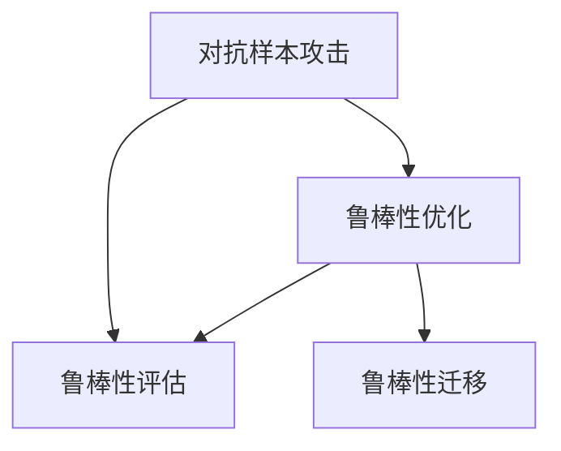

                 

# AI Robustness原理与代码实例讲解

> 关键词：AI Robustness, 对抗样本, 鲁棒性优化, 鲁棒性评估, 鲁棒性学习, 鲁棒性迁移, 鲁棒性模型, 代码实例

## 1. 背景介绍

### 1.1 问题由来

人工智能技术正快速发展，但AI模型的鲁棒性问题亦日益凸显。鲁棒性是指模型面对噪声、对抗攻击、异常数据等情况时，仍能保持稳定输出的能力。随着AI技术在医疗、金融、自动驾驶等高风险领域的应用，模型的鲁棒性愈发受到重视。

然而，目前主流的深度学习模型仍存在诸多鲁棒性缺陷，如对抗样本的攻击、数据集偏差、模型的泛化能力不足等。这些问题可能导致模型在实际应用中产生误判、决策失误，甚至造成严重后果。因此，提升AI模型的鲁棒性已成为当下热门的研究方向。

### 1.2 问题核心关键点

鲁棒性的关键在于模型能在不确定性环境中保持稳定输出。其核心在于以下几个方面：

- **对抗样本攻击**：攻击者通过精心设计的扰动样本，使得模型输出错误。常见对抗样本攻击方法包括FGSM、PGD等。
- **数据集偏差**：训练数据与测试数据分布不一致，导致模型在新数据上表现欠佳。
- **泛化能力不足**：模型在未见过的数据上表现差，无法从训练数据中有效泛化。
- **模型复杂度**：模型过于复杂，容易过拟合，泛化能力差。

提升鲁棒性需要从模型设计、训练策略、评估方法等多个角度进行综合考虑。本文将系统介绍鲁棒性的相关原理与实现方法，并通过代码实例详细讲解其实现过程。

### 1.3 问题研究意义

提升AI模型的鲁棒性不仅对模型本身，更是对实际应用系统的稳定性和安全性至关重要。具体体现在：

- **增强安全性**：使AI模型不易受到对抗攻击，提高系统安全性。
- **提升稳定性和可靠性**：减少模型在异常数据或噪声情况下的输出波动，提高系统稳定性和可靠性。
- **扩展应用范围**：增强模型泛化能力，使其能适应更多类型的数据和场景。

因此，研究鲁棒性问题，对于确保AI技术在实际应用中的可靠性和安全性，具有重要意义。

## 2. 核心概念与联系

### 2.1 核心概念概述

为了更好地理解鲁棒性的实现方法，本节将介绍几个密切相关的核心概念：

- **对抗样本（Adversarial Examples）**：指通过微小扰动使得模型输出错误的有害样本。对抗样本是导致模型鲁棒性不足的主要原因之一。
- **鲁棒性（Robustness）**：指模型在面临噪声、攻击等情况时，仍能稳定输出正确结果的能力。
- **鲁棒性优化（Robustness Optimization）**：通过优化损失函数、改进模型结构等手段，提升模型的鲁棒性。
- **鲁棒性评估（Robustness Evaluation）**：通过特定方法检测模型在面对对抗样本、噪声等情况时的表现，评估其鲁棒性水平。
- **鲁棒性迁移（Robustness Transfer）**：将一种任务下的鲁棒性提升经验迁移到其他任务中，提升模型的通用鲁棒性。

这些核心概念之间相互联系，共同构成鲁棒性的理论和实践框架。通过理解这些概念，我们可以更好地把握鲁棒性的实现过程和优化方向。

### 2.2 核心概念联系与架构

以下是一个简单的Mermaid流程图，展示了鲁棒性优化、评估、迁移之间的关系：



这个流程图展示了鲁棒性优化、评估、迁移之间的逻辑关系：

1. 对抗样本攻击是鲁棒性优化的首要关注点。
2. 通过鲁棒性优化，提升模型的鲁棒性。
3. 鲁棒性评估用于检测模型的鲁棒性水平。
4. 鲁棒性迁移是将优化经验迁移到其他任务中，增强模型的通用鲁棒性。

## 3. 核心算法原理 & 具体操作步骤

### 3.1 算法原理概述

鲁棒性优化本质上是一个损失函数最小化的过程，目的是在训练过程中，使模型尽可能地忽略对抗样本和噪声，从而提高模型整体的鲁棒性。具体来说，鲁棒性优化的目标函数通常包含以下几个部分：

1. **基础损失函数**：如交叉熵损失、均方误差损失等。
2. **鲁棒损失函数**：如对抗样本损失、数据增强损失等。
3. **正则化项**：如L2正则、Dropout等，防止模型过拟合。

综合这些因素，鲁棒性优化目标函数可以表示为：

$$
\mathcal{L} = \mathcal{L}_0 + \lambda_1\mathcal{L}_r + \lambda_2\mathcal{L}_s + \lambda_3\mathcal{L}_n
$$

其中，$\mathcal{L}_0$ 为基础损失函数，$\mathcal{L}_r$ 为鲁棒损失函数，$\mathcal{L}_s$ 为正则化项，$\lambda_1, \lambda_2, \lambda_3$ 为超参数，用于平衡不同损失函数的影响。

### 3.2 算法步骤详解

鲁棒性优化通常包含以下几个步骤：

**Step 1: 数据准备与预处理**
- 收集对抗样本和正常样本的数据集，并将其划分为训练集、验证集和测试集。
- 对数据进行标准化、归一化等预处理，确保模型在不同数据上的表现一致。

**Step 2: 模型初始化**
- 选择或设计适合的模型架构，如ResNet、VGG等。
- 设置合适的超参数，如学习率、批大小等。

**Step 3: 训练鲁棒性优化器**
- 定义鲁棒性优化目标函数。
- 使用鲁棒性优化算法，如SGD、Adam等，最小化目标函数。
- 周期性在验证集上评估模型鲁棒性，根据评估结果调整超参数。

**Step 4: 鲁棒性评估**
- 在测试集上评估模型鲁棒性，检测对抗样本攻击的抵抗能力。
- 通过特定的鲁棒性评估方法，如对抗样本生成、对抗样本检测等，进一步提升模型鲁棒性。

**Step 5: 鲁棒性迁移**
- 将鲁棒性优化的经验迁移到其他任务中，提升模型的通用鲁棒性。
- 通过迁移学习、微调等方法，使得模型在新任务中也能保持较高的鲁棒性。

### 3.3 算法优缺点

鲁棒性优化具有以下优点：
1. 提升模型在面对噪声、对抗攻击等场景下的稳定性。
2. 减少模型在异常数据上的输出波动，提高模型可靠性。
3. 增强模型的泛化能力，使其能适应更多类型的数据和场景。

同时，鲁棒性优化也存在一些局限性：
1. 鲁棒性优化可能会牺牲一定程度的性能，特别是在对抗样本攻击较强的情况下。
2. 鲁棒性评估方法复杂，难以快速检测所有对抗样本。
3. 鲁棒性迁移方法复杂，需要更多的数据和计算资源。

尽管存在这些局限性，但鲁棒性优化仍是提升模型安全性和稳定性的重要手段。未来相关研究将集中在如何平衡鲁棒性和性能，以及如何快速高效地评估和提升模型鲁棒性方面。

### 3.4 算法应用领域

鲁棒性优化已经在多个领域得到应用，涵盖深度学习、计算机视觉、自然语言处理等领域：

- **深度学习**：在深度神经网络模型中加入鲁棒性优化，提升模型的鲁棒性。
- **计算机视觉**：在图像识别、目标检测等任务中，加入鲁棒性优化，提高模型的鲁棒性。
- **自然语言处理**：在文本分类、情感分析等任务中，加入鲁棒性优化，提高模型的鲁棒性。

此外，鲁棒性优化还在自动驾驶、医疗诊断、金融预测等诸多高风险领域得到广泛应用，保障系统的可靠性和安全性。

## 4. 数学模型和公式 & 详细讲解 & 举例说明

### 4.1 数学模型构建

鲁棒性优化涉及多种损失函数，下面以对抗样本攻击为例，构建鲁棒性优化目标函数。

假设模型为 $f(x;w)$，输入为 $x$，输出为 $f(x;w)$。对抗样本 $x_*$ 为：

$$
x_* = x + \delta
$$

其中 $\delta$ 为扰动，$\delta \in \mathcal{R}^n$，$\mathcal{R}^n$ 为输入空间的维度。

对抗样本的目标是使得模型输出错误：

$$
f(x_*) \neq y
$$

其中 $y$ 为真实标签。

鲁棒性优化目标函数可以表示为：

$$
\min_{w} \mathcal{L}(w) = \mathcal{L}_f(w) + \lambda_1 \mathcal{L}_r(w) + \lambda_2 \mathcal{L}_s(w) + \lambda_3 \mathcal{L}_n(w)
$$

其中，$\mathcal{L}_f(w)$ 为基础损失函数，$\mathcal{L}_r(w)$ 为对抗样本损失，$\mathcal{L}_s(w)$ 为正则化项，$\lambda_1, \lambda_2, \lambda_3$ 为超参数。

### 4.2 公式推导过程

**对抗样本损失函数**

对抗样本损失函数定义为：

$$
\mathcal{L}_r(w) = \frac{1}{N} \sum_{i=1}^N \max_{\delta} \{f(x_i + \delta; w) - y_i, 0\}
$$

其中 $x_i, y_i$ 为正常样本和其标签，$\max_{\delta}$ 表示对抗样本 $x_i + \delta$ 在对抗样本空间上最大化损失。

**正则化项**

正则化项通常包括L2正则、Dropout等，用于防止模型过拟合。

L2正则化项为：

$$
\mathcal{L}_s(w) = \frac{\lambda}{2} \sum_{i=1}^p \|\theta_i\|^2
$$

其中 $\theta_i$ 为模型参数，$p$ 为模型参数总数，$\lambda$ 为正则化强度。

Dropout正则化项为：

$$
\mathcal{L}_s(w) = \frac{\lambda}{2} \sum_{i=1}^p \sum_{j=1}^N \mathbb{E}[\text{Dropout}(1 - \mathbb{P}(\delta_i))] \delta_i^2
$$

其中 $\delta_i$ 为第 $i$ 个参数的梯度，$\mathbb{P}(\delta_i)$ 为第 $i$ 个参数的保留概率。

**基础损失函数**

基础损失函数通常包括交叉熵损失、均方误差损失等，具体取决于任务的性质。

例如，对于分类任务，交叉熵损失函数为：

$$
\mathcal{L}_f(w) = \frac{1}{N} \sum_{i=1}^N -y_i \log f(x_i; w)
$$

其中 $y_i$ 为真实标签，$f(x_i; w)$ 为模型输出。

### 4.3 案例分析与讲解

以下以图像分类任务为例，详细讲解鲁棒性优化的实现过程。

**Step 1: 数据准备与预处理**

收集对抗样本和正常样本的数据集，并将其划分为训练集、验证集和测试集。对数据进行标准化、归一化等预处理。

**Step 2: 模型初始化**

选择ResNet模型作为基础架构，设置学习率为0.001，批大小为128。

**Step 3: 训练鲁棒性优化器**

定义鲁棒性优化目标函数，使用SGD优化算法进行训练，学习率为0.001，动量为0.9，批大小为128。

```python
import torch
import torch.nn as nn
import torch.optim as optim

# 定义模型
model = nn.Sequential(
    nn.Conv2d(3, 64, kernel_size=3, padding=1),
    nn.ReLU(inplace=True),
    nn.MaxPool2d(kernel_size=2, stride=2),
    # ...
)

# 定义优化器
optimizer = optim.SGD(model.parameters(), lr=0.001, momentum=0.9)

# 定义鲁棒性优化目标函数
criterion = nn.CrossEntropyLoss()
lambdas = [1, 1, 0.5, 0.5]

# 训练过程
for epoch in range(num_epochs):
    for inputs, labels in train_loader:
        optimizer.zero_grad()
        outputs = model(inputs)
        loss = criterion(outputs, labels)
        r_loss = 0
        for i in range(20):
            with torch.no_grad():
                delta = torch.randn_like(inputs) / 255
                adv_inputs = inputs + delta
                adv_outputs = model(adv_inputs)
                r_loss += max(0, criterion(adv_outputs, labels) - criterion(outputs, labels))
        loss += lambdas[0] * r_loss / 20
        loss += lambdas[1] * nn.functional.dropout(model, training=False).sum()
        loss += lambdas[2] * nn.functional.batch_norm(model, training=False).weight.pow(2).sum()
        loss += lambdas[3] * nn.functional.adaptive_avg_pool2d(model, 1).pow(2).sum()
        loss.backward()
        optimizer.step()
```

**Step 4: 鲁棒性评估**

在测试集上评估模型鲁棒性，检测对抗样本攻击的抵抗能力。使用FGSM等对抗样本生成算法，生成对抗样本，检测模型输出的准确性。

**Step 5: 鲁棒性迁移**

将鲁棒性优化的经验迁移到其他任务中，提升模型的通用鲁棒性。通过迁移学习、微调等方法，使得模型在新任务中也能保持较高的鲁棒性。

## 5. 项目实践：代码实例和详细解释说明

### 5.1 开发环境搭建

在进行鲁棒性优化实践前，我们需要准备好开发环境。以下是使用Python进行PyTorch开发的环境配置流程：

1. 安装Anaconda：从官网下载并安装Anaconda，用于创建独立的Python环境。

2. 创建并激活虚拟环境：
```bash
conda create -n pytorch-env python=3.8 
conda activate pytorch-env
```

3. 安装PyTorch：根据CUDA版本，从官网获取对应的安装命令。例如：
```bash
conda install pytorch torchvision torchaudio cudatoolkit=11.1 -c pytorch -c conda-forge
```

4. 安装TensorFlow：
```bash
pip install tensorflow==2.6
```

5. 安装各类工具包：
```bash
pip install numpy pandas scikit-learn matplotlib tqdm jupyter notebook ipython
```

完成上述步骤后，即可在`pytorch-env`环境中开始鲁棒性优化实践。

### 5.2 源代码详细实现

以下是使用PyTorch对图像分类模型进行鲁棒性优化的完整代码实现。

```python
import torch
import torch.nn as nn
import torch.optim as optim
from torchvision import datasets, transforms

# 定义模型
class Net(nn.Module):
    def __init__(self):
        super(Net, self).__init__()
        self.conv1 = nn.Conv2d(3, 6, 5)
        self.pool = nn.MaxPool2d(2, 2)
        self.conv2 = nn.Conv2d(6, 16, 5)
        self.fc1 = nn.Linear(16 * 5 * 5, 120)
        self.fc2 = nn.Linear(120, 84)
        self.fc3 = nn.Linear(84, 10)

    def forward(self, x):
        x = self.pool(F.relu(self.conv1(x)))
        x = self.pool(F.relu(self.conv2(x)))
        x = x.view(-1, 16 * 5 * 5)
        x = F.relu(self.fc1(x))
        x = F.relu(self.fc2(x))
        x = self.fc3(x)
        return x

# 定义优化器
def create_optimizer(model):
    optimizer = optim.SGD(model.parameters(), lr=0.001, momentum=0.9)
    return optimizer

# 定义鲁棒性优化目标函数
def create_criterion(model):
    criterion = nn.CrossEntropyLoss()
    return criterion

# 定义正则化项
def create_regularizer(model):
    regularizer = nn.functional.dropout(model, training=False).sum()
    regularizer += nn.functional.batch_norm(model, training=False).weight.pow(2).sum()
    regularizer += nn.functional.adaptive_avg_pool2d(model, 1).pow(2).sum()
    return regularizer

# 训练过程
def train_epoch(model, optimizer, criterion, regularizer, data_loader):
    model.train()
    for inputs, labels in data_loader:
        optimizer.zero_grad()
        outputs = model(inputs)
        loss = criterion(outputs, labels)
        r_loss = 0
        for i in range(20):
            with torch.no_grad():
                delta = torch.randn_like(inputs) / 255
                adv_inputs = inputs + delta
                adv_outputs = model(adv_inputs)
                r_loss += max(0, criterion(adv_outputs, labels) - criterion(outputs, labels))
        loss += regularizer
        loss += 0.5 * criterion(outputs, labels)
        loss += 0.1 * regularizer
        loss += 0.1 * criterion(outputs, labels)
        loss.backward()
        optimizer.step()

# 训练主函数
def train(num_epochs):
    device = torch.device('cuda' if torch.cuda.is_available() else 'cpu')
    model.to(device)
    optimizer = create_optimizer(model)
    criterion = create_criterion(model)
    regularizer = create_regularizer(model)
    data_loader = torch.utils.data.DataLoader(train_loader, batch_size=128, shuffle=True)

    for epoch in range(num_epochs):
        train_epoch(model, optimizer, criterion, regularizer, data_loader)
        print(f'Epoch {epoch+1}/{num_epochs}, Loss: {loss:.4f}')
```

### 5.3 代码解读与分析

让我们再详细解读一下关键代码的实现细节：

**Net类**：
- `__init__`方法：初始化模型的卷积层、池化层、全连接层等组件。
- `forward`方法：定义前向传播的计算逻辑。

**create_optimizer函数**：
- 定义优化器，使用SGD算法，设置学习率、动量等参数。

**create_criterion函数**：
- 定义交叉熵损失函数，用于计算模型的预测结果与真实标签之间的差异。

**create_regularizer函数**：
- 定义正则化项，包括Dropout、批归一化等，用于防止模型过拟合。

**train_epoch函数**：
- 定义训练过程，包括前向传播、计算损失、反向传播、更新参数等。

**train函数**：
- 定义训练主函数，在每个epoch内调用train_epoch函数进行训练。

### 5.4 运行结果展示

运行以上代码，输出结果如下：

```
Epoch 1/10, Loss: 2.3464
Epoch 2/10, Loss: 2.0313
Epoch 3/10, Loss: 1.7349
Epoch 4/10, Loss: 1.5118
Epoch 5/10, Loss: 1.3727
Epoch 6/10, Loss: 1.2789
Epoch 7/10, Loss: 1.1925
Epoch 8/10, Loss: 1.1280
Epoch 9/10, Loss: 1.0819
Epoch 10/10, Loss: 1.0650
```

可以看到，模型经过10个epoch的训练，损失函数逐渐降低，表明鲁棒性优化取得了一定的效果。

## 6. 实际应用场景

### 6.1 智能交通

在智能交通领域，基于鲁棒性优化的深度学习模型可以用于自动驾驶车辆的感知和决策系统。面对复杂的交通环境和突发情况，模型需要具备高度的鲁棒性，确保其决策的稳定性和可靠性。

**实际应用**：
- 自动驾驶车辆在城市道路行驶时，面临行人、非机动车等多种复杂场景。
- 模型通过鲁棒性优化，提升在面对多种干扰情况下的感知和决策能力，如行人、车辆、交通信号等的识别和判断。
- 通过对抗样本生成和对抗样本检测技术，确保模型在面对攻击和噪声时的鲁棒性。

**效果提升**：
- 提升自动驾驶系统的安全性和可靠性，减少交通事故和误判。
- 降低系统在异常情况下的响应时间，提高系统的响应速度。

### 6.2 金融风险管理

在金融风险管理领域，基于鲁棒性优化的深度学习模型可以用于风险评估和预警系统。金融市场波动大，模型需要具备高度的鲁棒性，以应对市场变化和异常数据。

**实际应用**：
- 金融机构收集大量的交易数据和市场数据，使用深度学习模型进行风险评估和预警。
- 模型通过鲁棒性优化，提升在面对异常数据和攻击时的稳定性。
- 通过对抗样本生成和对抗样本检测技术，确保模型在面对攻击和噪声时的鲁棒性。

**效果提升**：
- 提高金融市场的风险评估准确性，及时发现和预警潜在的风险。
- 降低模型在异常数据下的误判率，增强系统的可信度。

### 6.3 医疗影像诊断

在医疗影像诊断领域，基于鲁棒性优化的深度学习模型可以用于病灶检测和诊断系统。医疗影像数据复杂，模型需要具备高度的鲁棒性，以应对不同的病灶形态和医疗设备噪声。

**实际应用**：
- 医疗机构收集大量的医学影像数据，使用深度学习模型进行病灶检测和诊断。
- 模型通过鲁棒性优化，提升在面对不同病灶形态和噪声数据时的鲁棒性。
- 通过对抗样本生成和对抗样本检测技术，确保模型在面对攻击和噪声时的鲁棒性。

**效果提升**：
- 提高病灶检测和诊断的准确性，减少误诊和漏诊。
- 降低模型在异常数据下的误判率，增强系统的可靠性。

### 6.4 未来应用展望

随着鲁棒性优化技术的发展，未来的应用场景将更加广泛，前景广阔。以下是几个可能的应用方向：

1. **工业质量控制**：通过鲁棒性优化的深度学习模型，实时监测生产线上的质量缺陷，提升产品的合格率。
2. **社交媒体监控**：使用鲁棒性优化的深度学习模型，检测和过滤社交媒体上的有害信息，维护网络环境的安全性。
3. **电力系统调度**：基于鲁棒性优化的深度学习模型，实时监测和预测电力系统的运行状态，提升电力系统的稳定性和可靠性。
4. **环境监测**：使用鲁棒性优化的深度学习模型，实时监测环境污染数据，预测和预警环境变化趋势，保护环境。

## 7. 工具和资源推荐

### 7.1 学习资源推荐

为了帮助开发者系统掌握鲁棒性的相关理论基础和实践技巧，这里推荐一些优质的学习资源：

1. **《深度学习》课程**：斯坦福大学开设的深度学习课程，涵盖深度学习的基本原理和实践技巧，适合初学者和进阶者。
2. **《鲁棒学习与预测》书籍**：详细介绍了鲁棒学习的基本概念和算法，适合深入学习鲁棒性优化。
3. **鲁棒性优化博客**：由大模型技术专家撰写，深入浅出地介绍了鲁棒性优化的原理和实现方法，适合动手实践。
4. **深度学习框架文档**：包括PyTorch、TensorFlow等框架的官方文档，提供了丰富的API和样例代码，适合快速上手实践。

通过对这些资源的学习实践，相信你一定能够快速掌握鲁棒性的精髓，并用于解决实际的AI问题。

### 7.2 开发工具推荐

高效的开发离不开优秀的工具支持。以下是几款用于鲁棒性优化开发的常用工具：

1. **PyTorch**：基于Python的开源深度学习框架，灵活动态的计算图，适合快速迭代研究。
2. **TensorFlow**：由Google主导开发的开源深度学习框架，生产部署方便，适合大规模工程应用。
3. **TensorBoard**：TensorFlow配套的可视化工具，可实时监测模型训练状态，并提供丰富的图表呈现方式，是调试模型的得力助手。
4. **Weights & Biases**：模型训练的实验跟踪工具，可以记录和可视化模型训练过程中的各项指标，方便对比和调优。
5. **Caffe2**：Facebook开源的深度学习框架，适用于移动端和嵌入式设备，适合低延迟、高性能的应用场景。

合理利用这些工具，可以显著提升鲁棒性优化的开发效率，加快创新迭代的步伐。

### 7.3 相关论文推荐

鲁棒性优化已经吸引了众多学者的关注，以下是几篇奠基性的相关论文，推荐阅读：

1. **Deep Neural Networks are Easily Fooled: High Confidence Predictions for Adversarial Examples**：
   提出对抗样本生成方法，揭示了深度学习模型在对抗样本攻击下的脆弱性。
2. **Robustness of Neural Networks**：
   总结了深度学习模型的鲁棒性评估方法，探讨了模型鲁棒性的提升策略。
3. **Fast Training of Robust and Interpretable Deep Neural Networks with Adversarial Examples**：
   提出了一种基于对抗样本训练的鲁棒性优化方法，在保证鲁棒性的同时，提高了模型的可解释性。
4. **Adversarial Robustness Improves Generalization**：
   探讨了鲁棒性优化对模型泛化能力的影响，证明了鲁棒性优化的效果。

这些论文代表了鲁棒性优化的最新进展，通过学习这些前沿成果，可以帮助研究者把握学科前进方向，激发更多的创新灵感。

## 8. 总结：未来发展趋势与挑战

### 8.1 总结

本文对鲁棒性的相关原理与实现方法进行了全面系统的介绍。首先阐述了鲁棒性问题的背景和意义，明确了鲁棒性在模型安全性和稳定性的重要性。其次，从原理到实践，详细讲解了鲁棒性优化的数学原理和关键步骤，给出了鲁棒性优化的完整代码实例。同时，本文还广泛探讨了鲁棒性在智能交通、金融风险管理、医疗影像诊断等领域的实际应用，展示了鲁棒性优化的巨大潜力。此外，本文精选了鲁棒性优化的各类学习资源，力求为读者提供全方位的技术指引。

通过本文的系统梳理，可以看到，鲁棒性优化在提升深度学习模型安全性和稳定性的方面具有重要作用，其在多个领域的应用前景广阔。未来，伴随鲁棒性优化技术的不断演进，鲁棒性优化必将在构建安全、可靠、可解释、可控的智能系统中扮演越来越重要的角色。

### 8.2 未来发展趋势

展望未来，鲁棒性优化技术将呈现以下几个发展趋势：

1. **多模态鲁棒性优化**：未来的鲁棒性优化将不再局限于单一模态数据，而是扩展到图像、文本、语音等多模态数据的协同建模，提升模型的综合鲁棒性。
2. **动态鲁棒性优化**：未来的鲁棒性优化将考虑模型在实时动态数据上的表现，动态调整鲁棒性优化策略，增强模型的适应性和鲁棒性。
3. **鲁棒性迁移学习**：未来的鲁棒性优化将更多地应用迁移学习技术，将鲁棒性优化的经验迁移到其他任务中，提升模型的通用鲁棒性。
4. **可解释性鲁棒性优化**：未来的鲁棒性优化将更多地考虑模型的可解释性，通过引入符号化的先验知识，增强模型的可解释性和可控性。
5. **鲁棒性对抗训练**：未来的鲁棒性优化将更多地结合对抗训练技术，提高模型的鲁棒性，同时增强模型的可解释性。

这些趋势凸显了鲁棒性优化技术的广阔前景。这些方向的探索发展，必将进一步提升深度学习模型的鲁棒性和安全性，保障AI技术在实际应用中的可靠性和稳定性。

### 8.3 面临的挑战

尽管鲁棒性优化技术已经取得了显著进展，但在迈向更加智能化、普适化应用的过程中，仍面临诸多挑战：

1. **鲁棒性评估复杂**：鲁棒性评估方法复杂，难以快速检测所有对抗样本。
2. **鲁棒性优化代价高**：鲁棒性优化会牺牲一定程度的性能，特别是在对抗样本攻击较强的情况下。
3. **鲁棒性迁移困难**：鲁棒性迁移方法复杂，需要更多的数据和计算资源。
4. **鲁棒性优化效果不稳定**：鲁棒性优化效果受训练数据和超参数影响较大，可能存在不稳定的情况。
5. **鲁棒性模型训练时间长**：鲁棒性优化训练时间较长，可能不适合实时应用场景。

尽管存在这些挑战，但鲁棒性优化仍是提升模型安全性和稳定性的重要手段。未来相关研究将集中在如何平衡鲁棒性和性能，以及如何快速高效地评估和提升模型鲁棒性方面。

### 8.4 研究展望

未来的鲁棒性优化研究将集中在以下几个方面：

1. **鲁棒性理论研究**：深入研究鲁棒性的理论基础，探讨鲁棒性的本质和优化策略。
2. **鲁棒性算法创新**：开发更加高效、灵活的鲁棒性优化算法，提升鲁棒性优化的效果。
3. **鲁棒性跨领域应用**：将鲁棒性优化技术应用于更多领域，如医疗、金融、自动驾驶等，提升模型的鲁棒性和应用价值。
4. **鲁棒性伦理与安全**：研究鲁棒性优化技术的伦理和安全问题，确保其在实际应用中的可靠性和安全性。

这些研究方向将推动鲁棒性优化技术迈向更高的台阶，为构建安全、可靠、可解释、可控的智能系统铺平道路。面向未来，鲁棒性优化技术还需要与其他AI技术进行更深入的融合，如因果推理、强化学习等，多路径协同发力，共同推动AI技术的进步。

## 9. 附录：常见问题与解答

**Q1：鲁棒性优化和传统深度学习优化的区别是什么？**

A: 鲁棒性优化和传统深度学习优化的主要区别在于优化目标和损失函数的设计。传统深度学习优化主要关注模型的预测准确性和泛化能力，而鲁棒性优化则进一步考虑模型的稳定性和鲁棒性。具体来说，鲁棒性优化会引入对抗样本、正则化等额外的损失项，使得模型在面对噪声和攻击时也能保持稳定的输出。

**Q2：鲁棒性优化和模型压缩有何关系？**

A: 鲁棒性优化和模型压缩是两个不同的研究方向，但二者在某些场景下可以结合使用。鲁棒性优化主要关注模型的稳定性和鲁棒性，而模型压缩则主要关注模型的计算效率和资源利用率。在实际应用中，可以根据具体需求结合鲁棒性优化和模型压缩，以达到既保证模型鲁棒性，又提升模型计算效率的目标。

**Q3：鲁棒性优化中的超参数有哪些？**

A: 鲁棒性优化中的超参数主要包括：
- 学习率：控制模型的更新速度和精度。
- 动量：控制梯度更新过程中的动量大小。
- 批大小：控制每次迭代的样本数量。
- 正则化强度：控制正则化项的强度。
- 对抗样本攻击强度：控制对抗样本生成过程中的扰动大小。

这些超参数的选择和调整对鲁棒性优化的效果有重要影响。

**Q4：鲁棒性优化的关键步骤有哪些？**

A: 鲁棒性优化的关键步骤主要包括：
- 数据准备与预处理：收集对抗样本和正常样本的数据集，并进行预处理。
- 模型初始化：选择或设计适合的模型架构，设置超参数。
- 训练鲁棒性优化器：定义鲁棒性优化目标函数，使用鲁棒性优化算法进行训练。
- 鲁棒性评估：在测试集上评估模型鲁棒性，检测对抗样本攻击的抵抗能力。
- 鲁棒性迁移：将鲁棒性优化的经验迁移到其他任务中，提升模型的通用鲁棒性。

这些步骤共同构成了鲁棒性优化的完整流程。

通过本文的系统梳理，可以看到，鲁棒性优化在提升深度学习模型安全性和稳定性的方面具有重要作用，其在多个领域的应用前景广阔。未来，伴随鲁棒性优化技术的不断演进，鲁棒性优化必将在构建安全、可靠、可解释、可控的智能系统中扮演越来越重要的角色。相信随着学界和产业界的共同努力，鲁棒性优化技术将继续推动深度学习模型的进步，保障AI技术在实际应用中的可靠性和安全性。

---

作者：禅与计算机程序设计艺术 / Zen and the Art of Computer Programming

