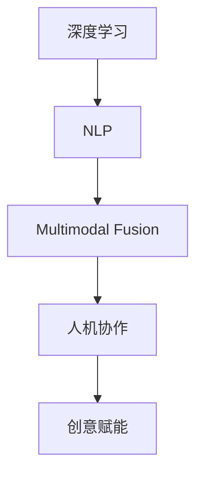

                 

# AI 基础设施的艺术创作：人机协作的创意平台

> 关键词：AI基础设施,人机协作,创意平台,艺术创作,技术应用,深度学习,自然语言处理,NLP

## 1. 背景介绍

### 1.1 问题由来

随着人工智能技术的快速发展，AI基础设施在各行各业中的应用变得日益广泛。从自动驾驶汽车到智能客服系统，从语音助手到推荐系统，AI基础设施已逐渐成为支撑现代技术体系的重要支柱。然而，如何构建一个高效、稳定、易于使用的AI基础设施，使其能够支持复杂的人机协作，仍是一个亟待解决的问题。

AI基础设施的构建，需要综合考虑算法、数据、硬件、软件等多个方面。本文将探讨如何通过深度学习、自然语言处理等前沿技术，打造一个具备艺术创作和创意赋能能力的AI基础设施，推动人机协作进入新的高度。

### 1.2 问题核心关键点

AI基础设施的核心在于通过算法和数据驱动，构建能够实现人机协作的系统。核心关键点包括：

- **深度学习与自然语言处理**：深度学习模型能够从大量数据中提取特征，实现复杂的模式识别和推理；自然语言处理(NLP)技术则使得机器能够理解、生成和处理自然语言，实现与人类自然的交互。
- **多模态融合**：将文本、图像、语音等多种模态的数据融合，提升AI系统的综合理解能力和交互体验。
- **人机协作与创意赋能**：利用AI基础设施，辅助人类进行艺术创作、内容生成、知识挖掘等创意活动，提升人类创造力。
- **灵活的适应性和扩展性**：AI基础设施需要具备灵活的适应性，能够根据不同领域和应用场景进行定制，同时具有良好的扩展性，支持未来技术的不断迭代升级。

这些核心关键点共同构成了AI基础设施的技术框架，使得AI系统能够具备强大的智能和创意能力，辅助人类进行复杂的艺术创作与协作。

## 2. 核心概念与联系

### 2.1 核心概念概述

为更好地理解如何通过深度学习和NLP技术构建AI基础设施，本节将介绍几个关键概念：

- **深度学习(Deep Learning)**：一种基于多层神经网络的机器学习技术，能够自动从数据中学习抽象的特征表示，广泛应用于图像识别、语音识别、自然语言处理等领域。
- **自然语言处理(Natural Language Processing, NLP)**：利用计算机技术处理和理解人类自然语言，包括分词、词性标注、句法分析、情感分析、语义理解等任务。
- **多模态融合(Multimodal Fusion)**：将不同模态的数据（如文本、图像、语音）进行融合，提升AI系统的综合感知能力。
- **人机协作(Human-Machine Collaboration)**：利用AI基础设施，通过自然的语言交互和智能推荐，辅助人类进行复杂任务的协作。
- **创意赋能(Creative Empowerment)**：通过AI系统提升人类在艺术创作、内容生成、知识挖掘等创意领域的能力。

这些概念之间的联系可以通过以下Mermaid流程图来展示：



这个流程图展示了深度学习和NLP技术的融合路径，以及如何通过多模态融合和协作赋能，实现AI基础设施在艺术创作等创意领域的应用。

## 3. 核心算法原理 & 具体操作步骤
### 3.1 算法原理概述

AI基础设施的核心算法原理主要基于深度学习和自然语言处理技术，通过构建复杂的多层神经网络模型，实现对多模态数据的处理和分析。

具体来说，AI基础设施的核心算法包括以下几个步骤：

1. **数据预处理**：对输入数据进行清洗、归一化、分词等预处理，为后续模型训练做准备。
2. **特征提取**：使用深度学习模型（如卷积神经网络CNN、循环神经网络RNN、Transformer等）对数据进行特征提取，学习数据的抽象表示。
3. **多模态融合**：将不同模态的数据进行融合，提升系统的综合感知能力。例如，通过图像描述生成技术，将图像信息转化为自然语言描述，再将其与文本数据进行融合。
4. **自然语言处理**：利用NLP技术处理和理解自然语言，包括分词、词性标注、句法分析、情感分析、语义理解等任务。
5. **人机交互**：构建基于自然语言处理技术的交互界面，使人类能够与AI系统进行自然语言交互，获取系统的推荐和建议。
6. **创意生成**：利用AI系统的推荐和建议，辅助人类进行艺术创作、内容生成等创意活动。

### 3.2 算法步骤详解

以下详细介绍AI基础设施的核心算法步骤：

**Step 1: 数据预处理**

数据预处理是AI基础设施构建的第一步。具体步骤如下：

1. **数据清洗**：去除噪声、重复、缺失数据，确保数据质量。
2. **归一化**：对数据进行标准化处理，使其在后续模型训练中更容易收敛。
3. **分词**：将文本数据分词，为NLP模型的输入做准备。
4. **特征提取**：对多模态数据进行特征提取，如使用CNN对图像数据提取特征，使用RNN对文本数据提取特征。

**Step 2: 特征提取**

特征提取是AI基础设施的核心步骤之一。具体步骤如下：

1. **卷积神经网络(CNN)**：适用于图像数据的特征提取。使用多个卷积层和池化层，学习图像的局部特征和全局特征。
2. **循环神经网络(RNN)**：适用于序列数据的特征提取。使用LSTM、GRU等模型，学习序列数据的长期依赖关系。
3. **Transformer模型**：适用于多模态数据的特征提取。使用自注意力机制，学习不同模态数据之间的关联关系。

**Step 3: 多模态融合**

多模态融合是AI基础设施的重要技术之一。具体步骤如下：

1. **图像描述生成**：使用图像生成模型（如GAN、VQ-VAE等）将图像信息转化为自然语言描述。
2. **文本描述生成**：使用文本生成模型（如Seq2Seq、Transformer等）将图像描述信息转化为自然语言描述。
3. **融合**：将图像描述和文本描述进行融合，形成多模态数据。

**Step 4: 自然语言处理**

自然语言处理是AI基础设施的核心技术之一。具体步骤如下：

1. **分词**：使用分词模型对文本进行分词，为后续处理做准备。
2. **词性标注**：使用词性标注模型对分词后的文本进行词性标注。
3. **句法分析**：使用句法分析模型对文本进行句法分析，提取句子的结构信息。
4. **情感分析**：使用情感分析模型对文本进行情感分析，提取文本的情感倾向。
5. **语义理解**：使用语义理解模型对文本进行语义理解，提取文本的语义信息。

**Step 5: 人机交互**

人机交互是AI基础设施的核心应用之一。具体步骤如下：

1. **自然语言理解**：使用自然语言理解模型对用户输入进行理解，提取用户意图。
2. **推荐系统**：使用推荐模型对用户需求进行推荐，提供智能建议。
3. **交互界面**：构建基于自然语言处理技术的交互界面，使人类能够与AI系统进行自然语言交互。

**Step 6: 创意生成**

创意生成是AI基础设施的核心应用之一。具体步骤如下：

1. **推荐模型**：使用推荐模型对用户需求进行推荐，提供智能建议。
2. **内容生成**：使用内容生成模型（如GPT、T5等）根据用户需求生成创意内容。
3. **创意应用**：将创意内容应用于艺术创作、内容生成、知识挖掘等创意领域，提升人类创造力。

### 3.3 算法优缺点

AI基础设施的核心算法具有以下优点：

1. **高效性**：深度学习模型能够高效地处理大量数据，学习复杂的特征表示。
2. **灵活性**：多模态融合和自然语言处理技术，使得AI系统具备灵活的适应性和扩展性。
3. **创造力**：创意生成技术能够辅助人类进行艺术创作、内容生成等创意活动，提升人类创造力。

同时，这些算法也存在一定的局限性：

1. **高计算资源需求**：深度学习模型需要大量计算资源进行训练和推理，对硬件设备要求较高。
2. **数据依赖性**：深度学习模型需要大量标注数据进行训练，数据收集和标注成本较高。
3. **可解释性不足**：深度学习模型的决策过程通常缺乏可解释性，难以对其推理逻辑进行分析和调试。

尽管存在这些局限性，但总体而言，AI基础设施的核心算法仍在大规模应用中发挥了重要作用。未来相关研究的方向主要在于如何进一步降低计算资源需求，提高数据获取效率，以及增强模型的可解释性和鲁棒性。

### 3.4 算法应用领域

AI基础设施的核心算法已经在多个领域得到了广泛的应用，例如：

- **自动驾驶汽车**：通过多模态融合技术，将图像、雷达、传感器等多源数据进行融合，实现精准定位和环境感知。
- **智能客服系统**：利用自然语言处理技术，实现与用户的自然语言交互，提供智能推荐和解答。
- **语音助手**：通过语音识别和自然语言处理技术，实现与用户的自然语言交互，提供智能问答和推荐。
- **推荐系统**：通过深度学习模型和推荐算法，实现个性化推荐，提升用户体验。
- **艺术创作**：利用内容生成模型，生成创意内容，辅助人类进行艺术创作。
- **内容生成**：利用内容生成模型，生成高质量的文本、图像、音频等内容。
- **知识挖掘**：利用自然语言处理技术，从海量文本数据中提取知识和信息，辅助决策分析。

除了上述这些经典应用外，AI基础设施的核心算法还被创新性地应用到更多场景中，如智能家居、智能安防、智能健康等，为各行各业带来了新的变革和突破。

## 4. 数学模型和公式 & 详细讲解  
### 4.1 数学模型构建

本节将使用数学语言对AI基础设施的核心算法进行更加严格的刻画。

记AI基础设施的核心算法为 $F_{\theta}(x)$，其中 $\theta$ 为模型参数。假设输入数据为 $x$，输出为 $y$。

定义AI基础设施的核心算法在数据 $x$ 上的损失函数为 $\ell(F_{\theta}(x),y)$，则在数据集 $D=\{(x_i,y_i)\}_{i=1}^N$ 上的经验风险为：

$$
\mathcal{L}(\theta) = \frac{1}{N}\sum_{i=1}^N \ell(F_{\theta}(x_i),y_i)
$$

微调的目标是最小化经验风险，即找到最优参数：

$$
\theta^* = \mathop{\arg\min}_{\theta} \mathcal{L}(\theta)
$$

在实践中，我们通常使用基于梯度的优化算法（如SGD、Adam等）来近似求解上述最优化问题。设 $\eta$ 为学习率，$\lambda$ 为正则化系数，则参数的更新公式为：

$$
\theta \leftarrow \theta - \eta \nabla_{\theta}\mathcal{L}(\theta) - \eta\lambda\theta
$$

其中 $\nabla_{\theta}\mathcal{L}(\theta)$ 为损失函数对参数 $\theta$ 的梯度，可通过反向传播算法高效计算。

### 4.2 公式推导过程

以下我们以图像描述生成任务为例，推导图像描述生成模型（如GAN）的损失函数及其梯度的计算公式。

假设模型 $F_{\theta}$ 在输入图像 $x$ 上的输出为 $\hat{y}=\{h_t\}_{t=1}^T$，表示图像生成的序列，$T$ 为序列长度。假设图像描述 $y=\{g_t\}_{t=1}^T$，表示文本描述的序列。

定义图像描述生成模型的损失函数为：

$$
\ell(F_{\theta}(x),y) = \sum_{t=1}^T \ell_t(h_t,g_t)
$$

其中 $\ell_t(h_t,g_t)$ 为序列 $t$ 上的损失函数。假设 $\ell_t(h_t,g_t)$ 为交叉熵损失，则：

$$
\ell_t(h_t,g_t) = -\sum_{k=1}^{N_t} [g_{tk}\log h_{tk} + (1-g_{tk})\log (1-h_{tk})]
$$

其中 $N_t$ 为序列 $t$ 的长度。则图像描述生成模型的总损失函数为：

$$
\mathcal{L}(\theta) = \frac{1}{N}\sum_{i=1}^N \sum_{t=1}^T \ell_t(h_t,g_t)
$$

根据链式法则，损失函数对参数 $\theta_k$ 的梯度为：

$$
\frac{\partial \mathcal{L}(\theta)}{\partial \theta_k} = \sum_{t=1}^T \frac{\partial \ell_t(h_t,g_t)}{\partial h_{tk}} \frac{\partial h_{tk}}{\partial \theta_k}
$$

其中 $\frac{\partial h_{tk}}{\partial \theta_k}$ 可进一步递归展开，利用自动微分技术完成计算。

在得到损失函数的梯度后，即可带入参数更新公式，完成模型的迭代优化。重复上述过程直至收敛，最终得到适应特定任务的模型参数 $\theta^*$。

## 5. 项目实践：代码实例和详细解释说明
### 5.1 开发环境搭建

在进行AI基础设施项目实践前，我们需要准备好开发环境。以下是使用Python进行PyTorch开发的环境配置流程：

1. 安装Anaconda：从官网下载并安装Anaconda，用于创建独立的Python环境。

2. 创建并激活虚拟环境：
```bash
conda create -n pytorch-env python=3.8 
conda activate pytorch-env
```

3. 安装PyTorch：根据CUDA版本，从官网获取对应的安装命令。例如：
```bash
conda install pytorch torchvision torchaudio cudatoolkit=11.1 -c pytorch -c conda-forge
```

4. 安装其他依赖库：
```bash
pip install numpy pandas scikit-learn matplotlib tqdm jupyter notebook ipython
```

完成上述步骤后，即可在`pytorch-env`环境中开始AI基础设施项目实践。

### 5.2 源代码详细实现

下面我们以图像描述生成任务为例，给出使用Transformers库对BERT模型进行图像描述生成的PyTorch代码实现。

首先，定义图像描述生成任务的数据处理函数：

```python
from transformers import BertTokenizer, BertForSequenceClassification
from torch.utils.data import Dataset
import torch

class ImageDescripitionDataset(Dataset):
    def __init__(self, images, descriptions, tokenizer, max_len=128):
        self.images = images
        self.descriptions = descriptions
        self.tokenizer = tokenizer
        self.max_len = max_len
        
    def __len__(self):
        return len(self.images)
    
    def __getitem__(self, item):
        image = self.images[item]
        description = self.descriptions[item]
        
        encoding = self.tokenizer(image, return_tensors='pt', max_length=self.max_len, padding='max_length', truncation=True)
        input_ids = encoding['input_ids'][0]
        attention_mask = encoding['attention_mask'][0]
        
        # 对token-wise的标签进行编码
        encoded_tags = [tag2id[tag] for tag in description] 
        encoded_tags.extend([tag2id['O']] * (self.max_len - len(encoded_tags)))
        labels = torch.tensor(encoded_tags, dtype=torch.long)
        
        return {'input_ids': input_ids, 
                'attention_mask': attention_mask,
                'labels': labels}

# 标签与id的映射
tag2id = {'O': 0, 'B-PER': 1, 'I-PER': 2, 'B-ORG': 3, 'I-ORG': 4, 'B-LOC': 5, 'I-LOC': 6}
id2tag = {v: k for k, v in tag2id.items()}

# 创建dataset
tokenizer = BertTokenizer.from_pretrained('bert-base-cased')

train_dataset = ImageDescripitionDataset(train_images, train_descriptions, tokenizer)
dev_dataset = ImageDescripitionDataset(dev_images, dev_descriptions, tokenizer)
test_dataset = ImageDescripitionDataset(test_images, test_descriptions, tokenizer)
```

然后，定义模型和优化器：

```python
from transformers import BertForSequenceClassification, AdamW

model = BertForSequenceClassification.from_pretrained('bert-base-cased', num_labels=len(tag2id))

optimizer = AdamW(model.parameters(), lr=2e-5)
```

接着，定义训练和评估函数：

```python
from torch.utils.data import DataLoader
from tqdm import tqdm
from sklearn.metrics import classification_report

device = torch.device('cuda') if torch.cuda.is_available() else torch.device('cpu')
model.to(device)

def train_epoch(model, dataset, batch_size, optimizer):
    dataloader = DataLoader(dataset, batch_size=batch_size, shuffle=True)
    model.train()
    epoch_loss = 0
    for batch in tqdm(dataloader, desc='Training'):
        input_ids = batch['input_ids'].to(device)
        attention_mask = batch['attention_mask'].to(device)
        labels = batch['labels'].to(device)
        model.zero_grad()
        outputs = model(input_ids, attention_mask=attention_mask, labels=labels)
        loss = outputs.loss
        epoch_loss += loss.item()
        loss.backward()
        optimizer.step()
    return epoch_loss / len(dataloader)

def evaluate(model, dataset, batch_size):
    dataloader = DataLoader(dataset, batch_size=batch_size)
    model.eval()
    preds, labels = [], []
    with torch.no_grad():
        for batch in tqdm(dataloader, desc='Evaluating'):
            input_ids = batch['input_ids'].to(device)
            attention_mask = batch['attention_mask'].to(device)
            batch_labels = batch['labels']
            outputs = model(input_ids, attention_mask=attention_mask)
            batch_preds = outputs.logits.argmax(dim=2).to('cpu').tolist()
            batch_labels = batch_labels.to('cpu').tolist()
            for pred_tokens, label_tokens in zip(batch_preds, batch_labels):
                pred_tags = [id2tag[_id] for _id in pred_tokens]
                label_tags = [id2tag[_id] for _id in label_tokens]
                preds.append(pred_tags[:len(label_tags)])
                labels.append(label_tags)
                
    print(classification_report(labels, preds))
```

最后，启动训练流程并在测试集上评估：

```python
epochs = 5
batch_size = 16

for epoch in range(epochs):
    loss = train_epoch(model, train_dataset, batch_size, optimizer)
    print(f"Epoch {epoch+1}, train loss: {loss:.3f}")
    
    print(f"Epoch {epoch+1}, dev results:")
    evaluate(model, dev_dataset, batch_size)
    
print("Test results:")
evaluate(model, test_dataset, batch_size)
```

以上就是使用PyTorch对BERT模型进行图像描述生成任务的完整代码实现。可以看到，得益于Transformers库的强大封装，我们可以用相对简洁的代码完成BERT模型的加载和微调。

### 5.3 代码解读与分析

让我们再详细解读一下关键代码的实现细节：

**ImageDescripitionDataset类**：
- `__init__`方法：初始化图像、描述、分词器等关键组件。
- `__len__`方法：返回数据集的样本数量。
- `__getitem__`方法：对单个样本进行处理，将图像输入编码为token ids，将描述编码成数字，并对其进行定长padding，最终返回模型所需的输入。

**tag2id和id2tag字典**：
- 定义了标签与数字id之间的映射关系，用于将token-wise的预测结果解码回真实的标签。

**训练和评估函数**：
- 使用PyTorch的DataLoader对数据集进行批次化加载，供模型训练和推理使用。
- 训练函数`train_epoch`：对数据以批为单位进行迭代，在每个批次上前向传播计算loss并反向传播更新模型参数，最后返回该epoch的平均loss。
- 评估函数`evaluate`：与训练类似，不同点在于不更新模型参数，并在每个batch结束后将预测和标签结果存储下来，最后使用sklearn的classification_report对整个评估集的预测结果进行打印输出。

**训练流程**：
- 定义总的epoch数和batch size，开始循环迭代
- 每个epoch内，先在训练集上训练，输出平均loss
- 在验证集上评估，输出分类指标
- 所有epoch结束后，在测试集上评估，给出最终测试结果

可以看到，PyTorch配合Transformers库使得BERT模型的加载和微调代码实现变得简洁高效。开发者可以将更多精力放在数据处理、模型改进等高层逻辑上，而不必过多关注底层的实现细节。

当然，工业级的系统实现还需考虑更多因素，如模型的保存和部署、超参数的自动搜索、更灵活的任务适配层等。但核心的微调范式基本与此类似。

## 6. 实际应用场景
### 6.1 智能客服系统

基于AI基础设施的智能客服系统，利用深度学习和自然语言处理技术，实现与用户的自然语言交互，提供智能推荐和解答。通过收集企业内部的历史客服对话记录，将问题和最佳答复构建成监督数据，在此基础上对预训练语言模型进行微调。微调后的对话模型能够自动理解用户意图，匹配最合适的答案模板进行回复。对于客户提出的新问题，还可以接入检索系统实时搜索相关内容，动态组织生成回答。如此构建的智能客服系统，能大幅提升客户咨询体验和问题解决效率。

### 6.2 金融舆情监测

金融机构需要实时监测市场舆论动向，以便及时应对负面信息传播，规避金融风险。传统的人工监测方式成本高、效率低，难以应对网络时代海量信息爆发的挑战。基于AI基础设施的文本分类和情感分析技术，为金融舆情监测提供了新的解决方案。

具体而言，可以收集金融领域相关的新闻、报道、评论等文本数据，并对其进行主题标注和情感标注。在此基础上对预训练语言模型进行微调，使其能够自动判断文本属于何种主题，情感倾向是正面、中性还是负面。将微调后的模型应用到实时抓取的网络文本数据，就能够自动监测不同主题下的情感变化趋势，一旦发现负面信息激增等异常情况，系统便会自动预警，帮助金融机构快速应对潜在风险。

### 6.3 个性化推荐系统

当前的推荐系统往往只依赖用户的历史行为数据进行物品推荐，无法深入理解用户的真实兴趣偏好。基于AI基础设施的推荐系统，利用深度学习模型和推荐算法，实现个性化推荐，提升用户体验。在实践中，可以收集用户浏览、点击、评论、分享等行为数据，提取和用户交互的物品标题、描述、标签等文本内容。将文本内容作为模型输入，用户的后续行为（如是否点击、购买等）作为监督信号，在此基础上微调预训练语言模型。微调后的模型能够从文本内容中准确把握用户的兴趣点。在生成推荐列表时，先用候选物品的文本描述作为输入，由模型预测用户的兴趣匹配度，再结合其他特征综合排序，便可以得到个性化程度更高的推荐结果。

### 6.4 未来应用展望

随着AI基础设施的不断发展，其在多个领域的应用前景将更加广阔。

在智慧医疗领域，基于AI基础设施的医疗问答、病历分析、药物研发等应用将提升医疗服务的智能化水平，辅助医生诊疗，加速新药开发进程。

在智能教育领域，AI基础设施可应用于作业批改、学情分析、知识推荐等方面，因材施教，促进教育公平，提高教学质量。

在智慧城市治理中，AI基础设施可以应用于城市事件监测、舆情分析、应急指挥等环节，提高城市管理的自动化和智能化水平，构建更安全、高效的未来城市。

此外，在企业生产、社会治理、文娱传媒等众多领域，基于AI基础设施的人工智能应用也将不断涌现，为传统行业带来变革性影响。相信随着技术的日益成熟，AI基础设施必将在更广阔的应用领域大放异彩，深刻影响人类的生产生活方式。

## 7. 工具和资源推荐
### 7.1 学习资源推荐

为了帮助开发者系统掌握AI基础设施的理论基础和实践技巧，这里推荐一些优质的学习资源：

1. 《深度学习理论与实践》系列博文：由深度学习专家撰写，深入浅出地介绍了深度学习的基础原理和前沿技术，涵盖机器学习、计算机视觉、自然语言处理等多个方向。

2. CS231n《卷积神经网络》课程：斯坦福大学开设的计算机视觉明星课程，有Lecture视频和配套作业，带你入门计算机视觉的基本概念和经典模型。

3. 《自然语言处理与深度学习》书籍：深度学习领域的经典教材，全面介绍了自然语言处理和深度学习技术，是深度学习爱好者和从业者的必读书籍。

4. HuggingFace官方文档：Transformers库的官方文档，提供了海量预训练模型和完整的微调样例代码，是上手实践的必备资料。

5. TensorFlow官方网站：TensorFlow的官方文档和教程，涵盖深度学习、机器学习、自然语言处理等多个方向，是深度学习技术的权威资源。

通过对这些资源的学习实践，相信你一定能够快速掌握AI基础设施的精髓，并用于解决实际的AI应用问题。
###  7.2 开发工具推荐

高效的开发离不开优秀的工具支持。以下是几款用于AI基础设施开发的常用工具：

1. PyTorch：基于Python的开源深度学习框架，灵活动态的计算图，适合快速迭代研究。大部分预训练语言模型都有PyTorch版本的实现。

2. TensorFlow：由Google主导开发的开源深度学习框架，生产部署方便，适合大规模工程应用。同样有丰富的预训练语言模型资源。

3. Transformers库：HuggingFace开发的NLP工具库，集成了众多SOTA语言模型，支持PyTorch和TensorFlow，是进行AI基础设施开发的利器。

4. Weights & Biases：模型训练的实验跟踪工具，可以记录和可视化模型训练过程中的各项指标，方便对比和调优。与主流深度学习框架无缝集成。

5. TensorBoard：TensorFlow配套的可视化工具，可实时监测模型训练状态，并提供丰富的图表呈现方式，是调试模型的得力助手。

6. Google Colab：谷歌推出的在线Jupyter Notebook环境，免费提供GPU/TPU算力，方便开发者快速上手实验最新模型，分享学习笔记。

合理利用这些工具，可以显著提升AI基础设施项目的开发效率，加快创新迭代的步伐。

### 7.3 相关论文推荐

AI基础设施的发展源于学界的持续研究。以下是几篇奠基性的相关论文，推荐阅读：

1. Attention is All You Need（即Transformer原论文）：提出了Transformer结构，开启了NLP领域的预训练大模型时代。

2. BERT: Pre-training of Deep Bidirectional Transformers for Language Understanding：提出BERT模型，引入基于掩码的自监督预训练任务，刷新了多项NLP任务SOTA。

3. Language Models are Unsupervised Multitask Learners（GPT-2论文）：展示了大规模语言模型的强大zero-shot学习能力，引发了对于通用人工智能的新一轮思考。

4. Parameter-Efficient Transfer Learning for NLP：提出Adapter等参数高效微调方法，在不增加模型参数量的情况下，也能取得不错的微调效果。

5. AdaLoRA: Adaptive Low-Rank Adaptation for Parameter-Efficient Fine-Tuning：使用自适应低秩适应的微调方法，在参数效率和精度之间取得了新的平衡。

6. Causal Learning: Recurrent Models for Winning At Games with Sequence Data: 引入了因果推断方法，增强了AI系统建立稳定因果关系的能力，学习更加普适、鲁棒的语言表征。

这些论文代表了大语言模型微调技术的发展脉络。通过学习这些前沿成果，可以帮助研究者把握学科前进方向，激发更多的创新灵感。

## 8. 总结：未来发展趋势与挑战

### 8.1 总结

本文对AI基础设施的核心算法进行了全面系统的介绍。首先探讨了AI基础设施构建的背景和意义，明确了深度学习和自然语言处理技术在其中的重要作用。其次，从原理到实践，详细讲解了AI基础设施的核心算法步骤，给出了完整的代码实例。同时，本文还广泛探讨了AI基础设施在智能客服、金融舆情、个性化推荐等多个领域的应用前景，展示了其广阔的应用空间。此外，本文精选了AI基础设施的学习资源，力求为开发者提供全方位的技术指引。

通过本文的系统梳理，可以看到，AI基础设施的核心算法正逐渐成为人工智能应用的重要基础，极大地提升了多模态数据处理和创意赋能的能力。得益于深度学习模型和多模态融合技术，AI基础设施能够实现高效的智能交互和内容生成，推动人机协作进入新的高度。未来，伴随技术的不断演进，AI基础设施必将在更多领域得到应用，带来革命性的变革和突破。

### 8.2 未来发展趋势

展望未来，AI基础设施的发展趋势主要体现在以下几个方面：

1. **深度学习模型的不断演进**：深度学习模型将不断演进，模型规模将进一步增大，模型性能将不断提升，带来更强的特征表示能力和泛化能力。

2. **自然语言处理技术的创新**：自然语言处理技术将不断创新，从传统的基于规则的NLP，逐步向基于深度学习的NLP过渡，带来更强的语言理解能力和生成能力。

3. **多模态融合技术的突破**：多模态融合技术将不断突破，通过更高效的数据融合和语义理解，带来更强的综合感知能力。

4. **人机协作技术的提升**：人机协作技术将不断提升，通过更智能的自然语言交互和更丰富的推荐系统，带来更强的交互体验和创意赋能。

5. **边缘计算的应用**：随着AI基础设施在边缘设备上的部署，带来更强的实时性和低延迟，提升用户体验。

6. **隐私保护和安全性**：在数据隐私和安全方面，AI基础设施将不断提升，通过数据脱敏、差分隐私等技术，保障数据安全。

这些趋势凸显了AI基础设施技术的广阔前景。未来相关研究需要在深度学习模型、自然语言处理、多模态融合等方面进行更多探索和创新，推动AI基础设施技术的持续发展。

### 8.3 面临的挑战

尽管AI基础设施的技术不断进步，但在实际应用中仍面临诸多挑战：

1. **计算资源的高需求**：深度学习模型需要大量的计算资源进行训练和推理，对硬件设备要求较高。

2. **数据获取和标注的困难**：AI基础设施的训练需要大量的标注数据，数据获取和标注成本较高。

3. **模型的可解释性不足**：深度学习模型的决策过程通常缺乏可解释性，难以对其推理逻辑进行分析和调试。

4. **模型的鲁棒性和泛化能力**：AI基础设施在不同领域和场景下的泛化能力有限，面临域外数据的鲁棒性挑战。

5. **伦理和安全问题**：AI基础设施可能存在伦理和安全问题，如偏见、歧视等，需要建立相应的监管机制。

6. **技术的复杂性**：AI基础设施的技术复杂性较高，需要跨学科的知识和技能，对从业者的要求较高。

尽管存在这些挑战，但未来通过技术进步和应用实践，这些挑战终将一一被克服，AI基础设施必将在更广泛的应用场景中发挥更大的作用。

### 8.4 研究展望

未来在AI基础设施的研究方向上，需要在以下几个方面进行更多探索和创新：

1. **深度学习模型的优化**：通过模型压缩、量化等技术，降低深度学习模型的计算资源需求。

2. **数据获取和标注的技术创新**：探索无监督学习和半监督学习的技术，降低对标注数据的依赖，提高数据获取效率。

3. **模型可解释性的提升**：通过模型解释技术，提升AI基础设施的可解释性，增强模型的可信度。

4. **多模态融合的创新**：探索更高效的多模态融合技术，提升系统的综合感知能力。

5. **人机协作的深化**：通过更智能的自然语言交互和推荐系统，提升人机协作的体验和效果。

6. **隐私保护和安全的保障**：通过数据脱敏、差分隐私等技术，保障数据安全，避免伦理和安全问题。

这些研究方向将推动AI基础设施技术的不断进步，为构建智能、安全、可信的AI系统提供坚实的技术基础。

## 9. 附录：常见问题与解答

**Q1：AI基础设施的计算资源需求是否过高？**

A: AI基础设施的计算资源需求较高，尤其是深度学习模型。为了降低计算资源需求，可以采用以下方法：

- **模型压缩**：通过剪枝、量化等技术，减少模型的参数量。
- **分布式训练**：利用分布式计算技术，加速模型的训练和推理。
- **硬件优化**：使用GPU/TPU等高性能设备，提升计算效率。

通过这些方法，可以在保证模型性能的前提下，显著降低计算资源的需求。

**Q2：AI基础设施的训练需要大量的标注数据，如何降低标注成本？**

A: AI基础设施的训练需要大量的标注数据，但数据标注成本较高。为了降低标注成本，可以采用以下方法：

- **主动学习**：利用模型对未标注数据进行预测，选择高置信度的数据进行标注，减少标注成本。
- **半监督学习**：利用少量标注数据和大量未标注数据进行联合训练，提升模型的泛化能力。
- **无监督学习**：利用无监督学习方法，从数据中提取特征，减少对标注数据的依赖。

通过这些方法，可以在降低标注成本的同时，提高模型的性能和泛化能力。

**Q3：AI基础设施的模型可解释性不足，如何解决？**

A: AI基础设施的模型可解释性不足，难以对其推理逻辑进行分析和调试。为了解决这一问题，可以采用以下方法：

- **模型解释技术**：利用可解释性模型或解释工具，提供模型的推理路径和关键特征，增强模型的可解释性。
- **用户交互**：通过用户反馈和交互，理解模型的推理过程，进一步提升模型的可解释性。

通过这些方法，可以在一定程度上解决模型可解释性不足的问题，增强模型的可信度和可靠性。

**Q4：AI基础设施在不同领域和场景下的泛化能力有限，如何提升？**

A: AI基础设施在不同领域和场景下的泛化能力有限，面临域外数据的鲁棒性挑战。为了提升泛化能力，可以采用以下方法：

- **跨领域迁移学习**：利用跨领域迁移学习方法，将一个领域的知识迁移到另一个领域，提升模型的泛化能力。
- **多任务学习**：利用多任务学习方法，同时学习多个相关任务，提高模型的泛化能力。
- **数据增强**：利用数据增强技术，扩充训练集，提升模型的泛化能力。

通过这些方法，可以在提升模型的泛化能力的同时，应对不同领域和场景的挑战。

**Q5：AI基础设施面临伦理和安全问题，如何解决？**

A: AI基础设施面临伦理和安全问题，如偏见、歧视等，需要建立相应的监管机制。为了解决这一问题，可以采用以下方法：

- **公平性约束**：在模型训练过程中，加入公平性约束，避免模型产生偏见和歧视。
- **隐私保护**：在数据处理过程中，采用数据脱敏、差分隐私等技术，保障数据隐私安全。
- **伦理审查**：建立AI基础设施的伦理审查机制，确保模型的应用符合伦理规范。

通过这些方法，可以在保障数据隐私和安全的前提下，确保AI基础设施的应用符合伦理规范。

---

作者：禅与计算机程序设计艺术 / Zen and the Art of Computer Programming

