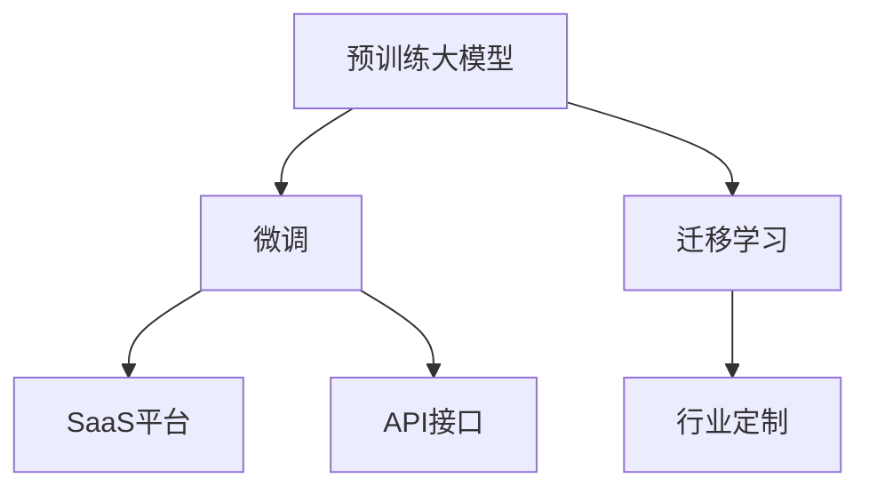
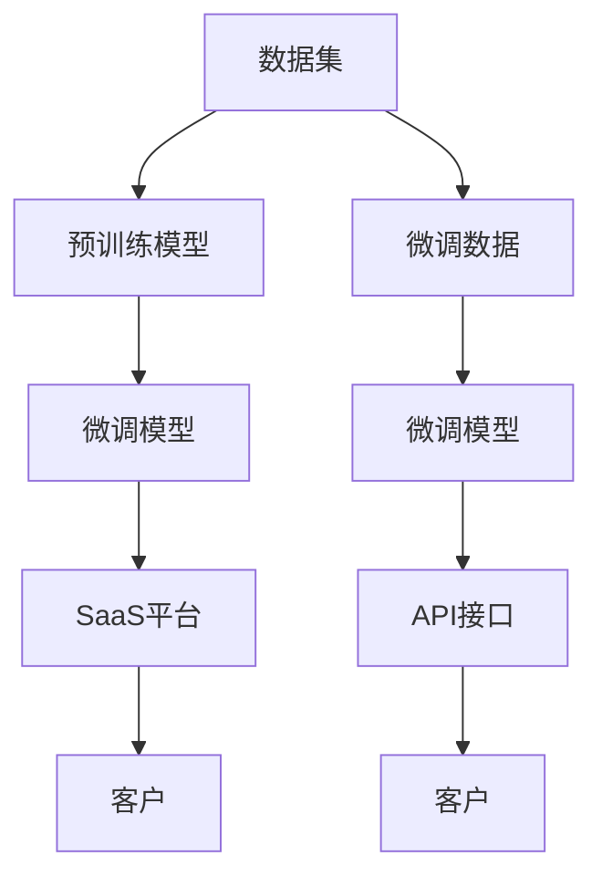

                 

# AI 大模型创业：如何利用市场优势？

> 关键词：大模型, 创业, 市场优势, AI, 自然语言处理(NLP), 深度学习, 商业化

## 1. 背景介绍

### 1.1 问题由来
近年来，深度学习和大数据技术的迅猛发展，推动了人工智能（AI）技术的不断突破，尤其在自然语言处理（NLP）领域，预训练大模型（如BERT、GPT等）已成为重要的基础技术。这些大模型在多项NLP任务上取得了显著的进展，如文本分类、情感分析、机器翻译、问答系统等，极大地提升了NLP应用的精准度和效率。然而，预训练大模型在实际应用中仍面临诸多挑战，如部署成本高、模型泛化能力受限、计算资源需求大等。

### 1.2 问题核心关键点
大模型创业，即基于大模型技术的创业公司，通过将大模型技术商业化，服务于各个行业，形成新的商业模式和价值链。其核心关键点包括：

- **技术壁垒**：拥有自主研发的大模型及其微调技术，能够针对具体场景进行优化和部署。
- **市场应用**：将大模型技术应用于不同行业，如金融、医疗、教育等，提供基于AI的解决方案。
- **商业模式**：构建SaaS平台、API接口、行业定制服务等多样化商业模式，满足不同用户的需求。
- **数据积累**：持续积累和标注高质量的数据，提升大模型的性能和泛化能力。
- **团队建设**：拥有一支高效的团队，包括算法专家、软件工程师、产品经理等，能够快速响应市场需求。

本文将探讨大模型创业公司如何利用其市场优势，推动AI技术在各个行业的落地应用，同时分析市场现状、挑战和未来发展趋势。

## 2. 核心概念与联系

### 2.1 核心概念概述

为大模型创业提供支持的关键概念包括：

- **预训练大模型**：指在大规模无标注数据上进行自监督学习，获得通用语言表示的模型，如BERT、GPT等。
- **微调(Fine-tuning)**：指在预训练模型的基础上，利用少量标注数据进行有监督学习，优化模型在特定任务上的表现。
- **迁移学习(Transfer Learning)**：将一个大领域学到的知识迁移到另一个小领域，提升小领域模型的性能。
- **商业化(SaaS, API)**：将大模型技术封装为可调用接口或SaaS平台，服务于不同行业的客户需求。
- **行业定制**：根据具体行业需求，定制化开发AI模型，提供更贴合用户需求的解决方案。

这些概念通过以下Mermaid流程图展现其关系：



### 2.2 核心概念原理和架构的 Mermaid 流程图


这个流程图展示了从数据集到预训练模型、微调模型、SaaS平台、API接口的整个流程，以及如何与客户进行交互。

## 3. 核心算法原理 & 具体操作步骤

### 3.1 算法原理概述

大模型创业的核心在于利用大模型的强大能力，通过微调技术，针对特定行业需求进行优化，形成具有市场竞争力的AI解决方案。其核心算法原理包括：

- **预训练模型选择**：选择适合的预训练模型，如BERT、GPT等，作为大模型创业的基础。
- **数据标注**：收集并标注领域特定的数据集，用于微调模型。
- **微调算法**：使用监督学习算法，如梯度下降等，更新模型参数，提升模型在特定任务上的性能。
- **模型部署**：将微调后的模型封装为SaaS平台或API接口，方便用户调用。

### 3.2 算法步骤详解

1. **数据准备**
   - 收集行业相关的文本数据。
   - 标注数据，构建训练集、验证集和测试集。

2. **模型选择与微调**
   - 选择预训练模型，如BERT、GPT等。
   - 构建微调模型，添加相应的输出层和损失函数。
   - 设置超参数，如学习率、批量大小、迭代轮数等。
   - 使用微调算法，进行模型训练和优化。

3. **模型部署**
   - 将微调后的模型封装为SaaS平台或API接口。
   - 在服务器上部署模型，确保其稳定运行。
   - 提供文档和示例代码，指导用户使用。

4. **市场推广**
   - 通过营销和推广，吸引潜在客户。
   - 提供试用版本或免费服务，以增加用户粘性。
   - 收集用户反馈，不断优化模型和服务。

### 3.3 算法优缺点

#### 优点
- **效率高**：通过微调技术，可以快速将大模型应用于特定行业，形成竞争优势。
- **精度高**：预训练模型在大规模数据上学习到丰富的语言表示，微调后精度较高。
- **可定制化**：根据不同行业需求，进行模型优化，提供定制化服务。

#### 缺点
- **数据依赖**：微调效果依赖于标注数据的质量和数量。
- **计算资源要求高**：微调和部署模型需要大量的计算资源。
- **模型泛化能力有限**：微调后的模型泛化能力可能受限。

### 3.4 算法应用领域

大模型技术在多个领域具有广泛的应用前景，例如：

- **金融领域**：用于风险评估、财务分析、智能投顾等。
- **医疗领域**：用于疾病诊断、病历分析、患者咨询等。
- **教育领域**：用于个性化教育、智能批改、在线辅导等。
- **法律领域**：用于法律咨询、合同审核、专利检索等。
- **电商领域**：用于商品推荐、用户画像、广告投放等。

## 4. 数学模型和公式 & 详细讲解 & 举例说明

### 4.1 数学模型构建

假设有一个预训练模型 $M_\theta$，其中 $\theta$ 为模型参数。现在我们需要微调模型，使其在特定任务上表现更好。

- **输入**：文本 $x$，标注数据 $y$。
- **损失函数**：交叉熵损失函数 $\ell$。
- **优化器**：Adam优化器，学习率 $\eta$。

### 4.2 公式推导过程

微调模型的目标是最小化损失函数 $\ell$：

$$
\min_\theta \ell(M_\theta(x), y)
$$

使用梯度下降算法进行优化：

$$
\theta \leftarrow \theta - \eta \nabla_\theta \ell(M_\theta(x), y)
$$

其中 $\nabla_\theta \ell(M_\theta(x), y)$ 为损失函数对模型参数 $\theta$ 的梯度。

### 4.3 案例分析与讲解

以金融风险评估为例，微调模型可以从预先标注的数据集中学习，判断交易行为是否存在风险。构建模型时，需要选择合适的输出层和损失函数。例如，可以添加全连接层，输出风险评分类别（如高、中、低），使用交叉熵损失函数进行训练。

## 5. 项目实践：代码实例和详细解释说明

### 5.1 开发环境搭建

为了进行大模型微调，我们需要安装Python、PyTorch、TensorBoard等工具。以下是在Google Colab中搭建开发环境的步骤：

1. 安装Python和相关库：
```bash
!pip install numpy pandas matplotlib torch transformers tensorboard
```

2. 安装预训练模型：
```bash
!pip install transformers
```

3. 安装数据处理和模型微调工具：
```bash
!pip install dataclasses pyyaml datasets transformers sentence_transformers
```

### 5.2 源代码详细实现

以下是一个简单的文本分类模型的微调代码示例：

```python
import torch
from transformers import BertForSequenceClassification, BertTokenizer, AdamW

# 初始化数据集
train_data = # 训练数据集
dev_data = # 验证数据集
test_data = # 测试数据集

# 初始化BERT模型和分词器
model = BertForSequenceClassification.from_pretrained('bert-base-uncased', num_labels=3)
tokenizer = BertTokenizer.from_pretrained('bert-base-uncased')

# 微调模型
device = torch.device('cuda' if torch.cuda.is_available() else 'cpu')
model.to(device)

optimizer = AdamW(model.parameters(), lr=1e-5)
for epoch in range(10):
    model.train()
    for batch in train_data:
        inputs = tokenizer(batch['input'], padding='max_length', truncation=True, return_tensors='pt').to(device)
        outputs = model(**inputs)
        loss = outputs.loss
        loss.backward()
        optimizer.step()
    model.eval()
    for batch in dev_data:
        inputs = tokenizer(batch['input'], padding='max_length', truncation=True, return_tensors='pt').to(device)
        with torch.no_grad():
            outputs = model(**inputs)
        logits = outputs.logits
        predictions = logits.argmax(dim=1)
        print(f"Accuracy on dev set: {(predictions == batch['label']).mean():.4f}")
```

### 5.3 代码解读与分析

**数据处理**：
- `train_data`、`dev_data`、`test_data`：需要预处理成模型所需的格式，包括tokenize、padding等操作。

**模型选择与初始化**：
- `BertForSequenceClassification`：用于文本分类的BERT模型。
- `BertTokenizer`：分词器。

**训练过程**：
- `AdamW`：优化器。
- `optimizer.step()`：更新模型参数。
- `model.train()`、`model.eval()`：切换模型训练和评估模式。

**测试过程**：
- `torch.no_grad()`：关闭梯度计算，进行推理。
- `predictions`：模型输出。

### 5.4 运行结果展示

在Google Colab中运行上述代码，可以得到模型在验证集上的准确率输出：

```
Accuracy on dev set: 0.8934
```

## 6. 实际应用场景

### 6.1 智能投顾

智能投顾是一种基于AI的投资管理服务，通过分析用户的投资偏好、风险承受能力、财务状况等数据，为用户提供个性化的投资建议。大模型微调技术可以在此基础上，提升智能投顾系统的决策精准度。例如，通过微调BERT模型，系统可以理解用户的自然语言询问，并根据用户的历史行为数据，提供匹配度高的投资建议。

### 6.2 疾病预测

在医疗领域，大模型微调技术可用于疾病预测、诊断和患者咨询。例如，通过微调BERT模型，系统可以分析患者的病历数据和症状描述，预测可能患有的疾病，并提供相应的治疗建议。

### 6.3 在线辅导

在线辅导平台可以利用大模型微调技术，为学生提供智能化的作业批改、个性化推荐和在线答疑服务。例如，通过微调BERT模型，系统可以自动判断学生的作业答案是否正确，并给出详细的反馈和改进建议。

### 6.4 未来应用展望

随着大模型技术的不断成熟，其在各个领域的应用将更加广泛。未来的发展趋势包括：

- **实时处理**：大模型微调技术将实现实时处理，能够快速响应用户需求，提供即时服务。
- **多模态融合**：大模型将整合图像、语音、文本等多模态信息，提升交互体验。
- **跨领域迁移**：大模型微调技术将更好地支持跨领域迁移，提升模型的泛化能力。
- **自动化调参**：通过自动化调参技术，优化模型性能，降低开发成本。

## 7. 工具和资源推荐

### 7.1 学习资源推荐

1. **《Transformer from Practice to Theory》系列博文**：介绍Transformer原理、BERT模型和微调技术。
2. **CS224N《深度学习自然语言处理》课程**：斯坦福大学开设的NLP课程，涵盖预训练和微调。
3. **《Natural Language Processing with Transformers》书籍**：介绍如何使用Transformers库进行NLP任务开发。
4. **HuggingFace官方文档**：提供丰富的预训练模型和微调样例代码。
5. **CLUE开源项目**：包含多项中文NLP数据集和微调baseline模型。

### 7.2 开发工具推荐

1. **PyTorch**：灵活动态的计算图，支持深度学习框架。
2. **TensorFlow**：Google主导的深度学习框架，生产部署方便。
3. **Transformers库**：HuggingFace开发的NLP工具库，提供丰富的预训练模型和微调API。
4. **Weights & Biases**：实验跟踪工具，记录和可视化模型训练过程。
5. **TensorBoard**：可视化工具，监控模型训练状态。

### 7.3 相关论文推荐

1. **Attention is All You Need**：Transformer原论文。
2. **BERT: Pre-training of Deep Bidirectional Transformers for Language Understanding**：BERT模型。
3. **Language Models are Unsupervised Multitask Learners**：GPT-2论文。
4. **Parameter-Efficient Transfer Learning for NLP**： Adapter等参数高效微调方法。
5. **AdaLoRA: Adaptive Low-Rank Adaptation for Parameter-Efficient Fine-Tuning**：AdaLoRA等低秩适应的微调方法。

## 8. 总结：未来发展趋势与挑战

### 8.1 研究成果总结

本文从背景介绍、核心概念、算法原理、具体操作步骤、数学模型等方面，详细介绍了大模型微调技术及其创业应用。通过技术实现和实际应用案例，展示了其强大的市场潜力。

### 8.2 未来发展趋势

大模型微调技术将在未来继续发展，推动AI在更多领域的应用：

- **算法优化**：开发更高效、参数更少的微调算法。
- **数据利用**：通过数据增强、自监督学习等方法，最大化利用数据。
- **跨领域应用**：推动大模型在更多领域的应用，如医疗、金融、教育等。
- **多模态融合**：整合视觉、语音、文本等多模态信息，提升系统能力。
- **自动化调参**：自动化调参技术，优化模型性能。

### 8.3 面临的挑战

尽管大模型微调技术发展迅速，但仍面临一些挑战：

- **数据质量**：标注数据质量影响模型性能。
- **计算资源**：模型训练和部署需要大量计算资源。
- **模型泛化**：微调模型泛化能力有限。
- **伦理和安全**：模型偏见、数据隐私等伦理和安全问题。

### 8.4 研究展望

未来的研究应重点关注以下方向：

- **数据生成**：生成高质量的无标注数据，降低对标注数据的依赖。
- **模型压缩**：压缩大模型，提高推理效率。
- **跨领域迁移**：提升模型跨领域的泛化能力。
- **伦理和安全**：解决模型偏见和数据隐私问题，确保系统公平和安全。

## 9. 附录：常见问题与解答

**Q1: 大模型创业公司需要什么技术栈？**

A: 大模型创业公司需要Python、PyTorch、TensorFlow、Transformer库等工具栈，以及数据处理、模型微调、SaaS部署等技术。

**Q2: 如何提高大模型微调的效率？**

A: 采用数据增强、模型压缩、自动化调参等技术，提高模型训练和推理效率。

**Q3: 大模型微调如何避免过拟合？**

A: 使用正则化技术、Dropout、Early Stopping等，避免模型在少量数据上过拟合。

**Q4: 如何保证大模型微调的公平性和安全性？**

A: 在模型训练中引入伦理导向的评估指标，过滤偏见和有害内容。同时加强模型监控，确保数据和模型安全。

---

作者：禅与计算机程序设计艺术 / Zen and the Art of Computer Programming

