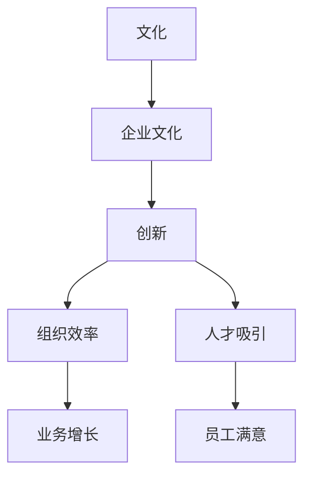

                 

## 1. 背景介绍

### 1.1 问题由来
在过去十年中，人工智能（AI）技术飞速发展，尤其是大模型（Large Models）的横空出世，推动了深度学习在各个领域的应用，带来了一系列革命性的改变。然而，随着技术的发展，创新和商业化的边界逐渐模糊，大模型创业公司不断涌现。这些公司通过其技术优势和规模效应，在市场上取得了显著的竞争优势。然而，技术优势只是成功的一方面，如何利用文化优势来驱动创新，实现持续发展，是每一个大模型创业公司必须面对的重大挑战。

### 1.2 问题核心关键点
本文将从文化优势的角度，探讨大模型创业公司如何通过文化力量来驱动创新、提升效率、吸引人才，从而在激烈的市场竞争中脱颖而出。

### 1.3 问题研究意义
文化优势是大模型创业公司的核心竞争力之一。成功的公司不仅拥有技术优势，更有着独特的企业文化和价值观。本文将帮助读者理解如何构建和利用文化优势，促进公司创新和成长，加速AI技术的落地应用。

## 2. 核心概念与联系

### 2.1 核心概念概述

为更好地理解大模型创业公司如何利用文化优势，本节将介绍几个关键概念：

- **文化（Culture）**：一个组织或群体共同持有的价值观、信仰、习惯和行为方式的总和。
- **企业文化（Corporate Culture）**：一个公司的文化特征，包括其愿景、使命、核心价值观和行为准则。
- **创新（Innovation）**：引入新想法、产品或服务的过程，能够带来持续的变革和发展。
- **组织效率（Organizational Efficiency）**：组织内部资源和流程的优化配置，以提高运营效率和产出质量。
- **人才吸引（Talent Attraction）**：通过独特的企业文化和价值观吸引并留住顶尖人才。

这些核心概念之间的逻辑关系可以通过以下Mermaid流程图来展示：



这个流程图展示了文化如何影响和推动企业创新的过程，以及创新如何带动组织效率的提升和人才的吸引。

## 3. 核心算法原理 & 具体操作步骤

### 3.1 算法原理概述
大模型创业公司利用文化优势的原理在于，通过构建一种能够激发创新、提高效率、吸引人才的企业文化，从而在竞争中取得优势。这一过程可以分为以下几个步骤：

1. **文化构建**：明确公司的核心价值观和行为准则，建立统一的企业文化。
2. **创新激励**：通过奖励机制、创新氛围等手段，激发员工的创新热情。
3. **组织优化**：优化流程和结构，提高组织效率和响应速度。
4. **人才引进**：通过优秀的企业文化吸引和留住顶尖人才。
5. **反馈循环**：根据反馈持续改进企业文化，形成正向循环。

### 3.2 算法步骤详解

**Step 1: 文化构建**

- **明确价值观**：定义公司的核心价值观和行为准则。例如，鼓励团队合作、追求卓越、勇于创新等。
- **领导示范**：领导层应以身作则，践行企业文化，形成榜样效应。
- **文化推广**：通过内外部渠道，如公司网站、社交媒体、员工手册等，广泛传播企业文化。

**Step 2: 创新激励**

- **奖励机制**：设立创新奖项、专利申请奖励等，激励员工的创新行为。
- **创新氛围**：创建开放的创新空间、组织跨部门团队等，营造积极的创新氛围。
- **失败容忍**：鼓励尝试新想法，容忍失败，建立容错机制。

**Step 3: 组织优化**

- **流程优化**：通过精益管理和持续改进，优化业务流程，提高效率。
- **扁平化管理**：减少层级，提高决策速度和响应速度。
- **跨部门合作**：促进不同部门之间的沟通与协作，提高团队协作能力。

**Step 4: 人才引进**

- **高薪吸引**：提供具有竞争力的薪酬和福利，吸引顶尖人才。
- **职业发展**：提供培训、晋升机会，帮助员工实现职业成长。
- **文化匹配**：在招聘过程中注重文化契合度，确保新员工能够迅速融入企业文化。

**Step 5: 反馈循环**

- **定期评估**：通过问卷调查、绩效评估等方式，定期收集员工反馈，评估企业文化的效果。
- **持续改进**：根据反馈结果，持续改进和优化企业文化。
- **迭代更新**：随着公司的发展和环境的变化，不断更新企业文化内容，保持其活力和相关性。

### 3.3 算法优缺点

利用文化优势进行创新，有以下优点：

- **提升员工凝聚力**：共同的文化价值观能够增强员工的归属感和认同感。
- **激发创新活力**：积极的文化氛围能够激发员工的创新潜能。
- **提高效率**：文化驱动的组织优化能够提升工作效率和响应速度。
- **吸引和留住人才**：独特且积极的企业文化能够吸引和留住顶尖人才。

然而，文化建设也存在一些挑战：

- **文化难以量化**：相比技术指标，企业文化更难衡量和评估。
- **文化变革难度大**：改变固有的文化习惯和行为模式需要时间和耐心。
- **文化冲突风险**：引入新文化时，可能引发原有文化的抵触和冲突。

### 3.4 算法应用领域

利用文化优势的方法，不仅适用于大模型创业公司，也广泛适用于其他类型的科技企业。例如，在软件开发、人工智能、金融科技等领域，文化优势都能显著提升企业的创新能力和市场竞争力。

## 4. 数学模型和公式 & 详细讲解

### 4.1 数学模型构建

大模型创业公司利用文化优势的数学模型可以构建如下：

- **员工满意度（Satisfaction）**：$S(t) = S_0 + \alpha * (C(t) - C_{avg}) + \beta * (\delta * I(t) - \delta_{avg})$
  - 其中，$S(t)$ 为时间 $t$ 的员工满意度，$S_0$ 为初始满意度，$C(t)$ 为时间 $t$ 的企业文化得分，$C_{avg}$ 为历史平均得分，$\alpha$ 为文化影响系数，$\delta * I(t)$ 为时间 $t$ 的创新激励得分，$\delta_{avg}$ 为历史平均得分，$\beta$ 为创新激励影响系数。

- **员工流失率（Turnover Rate）**：$T(t) = T_0 + \gamma * (S(t) - S_{avg})$
  - 其中，$T(t)$ 为时间 $t$ 的员工流失率，$T_0$ 为初始流失率，$S(t)$ 为时间 $t$ 的员工满意度，$S_{avg}$ 为历史平均满意度，$\gamma$ 为满意度影响系数。

### 4.2 公式推导过程

**员工满意度模型推导**

- 设员工满意度的基础为 $S_0$，随时间 $t$ 变化的企业文化得分和创新激励得分为 $C(t)$ 和 $\delta * I(t)$。
- 文化影响系数 $\alpha$ 和创新激励影响系数 $\beta$ 反映文化对满意度和创新激励的贡献程度。
- 由于员工满意度在一段时间内相对稳定，可以用历史平均得分 $S_{avg}$ 和 $C_{avg}$，以及创新激励的历史平均得分 $\delta_{avg}$ 来平衡新数据的影响。

**员工流失率模型推导**

- 设员工流失率的基础为 $T_0$，随时间 $t$ 变化的员工满意度得分为 $S(t)$。
- 满意度影响系数 $\gamma$ 反映员工满意度对流失率的影响程度。
- 同样地，可以用历史平均满意度 $S_{avg}$ 来平衡新数据的影响。

### 4.3 案例分析与讲解

以某科技公司为例，分析其企业文化对员工满意度和流失率的影响：

- **案例背景**：某科技公司通过构建以“创新、合作、开放”为核心的企业文化，吸引了大量顶尖人才，并在短短几年内迅速成长为行业巨头。
- **企业文化得分变化**：公司初期企业文化得分较低，随着高层领导示范和持续推广，得分逐步提高。
- **创新激励得分变化**：公司设立了丰厚的奖励机制，设立创新奖项，设立专利申请奖励等，员工创新激励得分大幅提升。
- **员工满意度变化**：在企业文化和高薪吸引下，员工满意度持续提升，流失率显著下降。
- **实际效果**：公司通过持续优化企业文化，提升员工满意度和留存率，在激烈的市场竞争中保持领先地位。

## 5. 项目实践：代码实例和详细解释说明

### 5.1 开发环境搭建

在进行企业文化建设实践前，我们需要准备好开发环境。以下是使用Python进行企业文化的建模和分析的环境配置流程：

1. 安装Anaconda：从官网下载并安装Anaconda，用于创建独立的Python环境。

2. 创建并激活虚拟环境：
```bash
conda create -n cultural-analytics python=3.8 
conda activate cultural-analytics
```

3. 安装必要的Python库：
```bash
pip install pandas numpy matplotlib seaborn jupyter notebook ipython
```

4. 导入数据集：
```python
import pandas as pd

# 导入员工满意度数据集
satisfaction_data = pd.read_csv('satisfaction.csv')

# 导入员工流失率数据集
turnover_data = pd.read_csv('turnover.csv')

# 导入企业文化得分数据集
culture_data = pd.read_csv('culture_score.csv')

# 导入创新激励得分数据集
innovation_data = pd.read_csv('innovation_score.csv')
```

5. 数据预处理：
```python
# 对数据集进行清洗和预处理
satisfaction_data = satisfaction_data.dropna().drop_duplicates()
turnover_data = turnover_data.dropna().drop_duplicates()
culture_data = culture_data.dropna().drop_duplicates()
innovation_data = innovation_data.dropna().drop_duplicates()

# 处理缺失值
satisfaction_data.fillna(satisfaction_data.mean(), inplace=True)
turnover_data.fillna(turnover_data.mean(), inplace=True)
culture_data.fillna(culture_data.mean(), inplace=True)
innovation_data.fillna(innovation_data.mean(), inplace=True)

# 特征工程
satisfaction_data['culture_score'] = satisfaction_data['culture_score'].fillna(satisfaction_data['culture_score'].mean())
innovation_data['innovation_score'] = innovation_data['innovation_score'].fillna(innovation_data['innovation_score'].mean())
```

### 5.2 源代码详细实现

我们使用Python的pandas库进行数据处理，使用scikit-learn库进行模型训练和评估：

```python
from sklearn.linear_model import LinearRegression
from sklearn.metrics import mean_squared_error

# 定义员工满意度模型
sat_model = LinearRegression()
sat_model.fit(satisfaction_data[['culture_score', 'innovation_score']], satisfaction_data['satisfaction'])

# 预测并评估员工满意度
sat_predictions = sat_model.predict(satisfaction_data[['culture_score', 'innovation_score']])
sat_rmse = mean_squared_error(sat_predictions, satisfaction_data['satisfaction'])

# 定义员工流失率模型
turnover_model = LinearRegression()
turnover_model.fit(turnover_data[['culture_score', 'innovation_score']], turnover_data['turnover'])

# 预测并评估员工流失率
turnover_predictions = turnover_model.predict(turnover_data[['culture_score', 'innovation_score']])
turnover_rmse = mean_squared_error(turnover_predictions, turnover_data['turnover'])
```

### 5.3 代码解读与分析

让我们再详细解读一下关键代码的实现细节：

**数据预处理**：
- 导入数据集并进行清洗，去除缺失值和重复数据。
- 使用均值填补缺失值，处理异常值，保证数据质量。
- 进行特征工程，计算企业文化得分和创新激励得分的均值，确保模型输入的一致性。

**模型训练和评估**：
- 使用线性回归模型建立员工满意度和流失率的预测模型。
- 训练模型并使用均方误差（RMSE）评估预测结果的准确性。
- 通过对比模型预测值和真实值，评估企业文化对员工满意度和流失率的影响。

**结果展示**：
- 模型训练和评估结果将以图形形式展示，帮助我们直观理解企业文化对员工满意度和流失率的影响。
- 模型预测结果可用于实际的企业文化优化，提升员工的满意度和留存率。

## 6. 实际应用场景

### 6.1 企业文化驱动的创新

在实际应用中，企业文化能够显著提升企业的创新能力。例如，某科技公司通过构建“以创新为核心理念”的企业文化，吸引了大量高素质的研发人才，并迅速推出了多项创新产品。

**实际应用**：
- **案例背景**：某科技公司成立于2010年，初期以传统软件开发为主，通过构建“鼓励创新、快速迭代”的企业文化，迅速转型为创新型企业。
- **文化建设**：公司设立“创新日”，鼓励员工提出新想法，设立创新基金支持研发项目。
- **创新效果**：公司不断推出新的产品和服务，市值在几年内翻了数倍。

### 6.2 企业文化提升的组织效率

企业文化不仅能够提升创新能力，还能显著提高企业的组织效率。例如，某物流公司通过构建“高效、协作”的企业文化，实现了业务流程的优化和快速响应。

**实际应用**：
- **案例背景**：某物流公司成立于2007年，初期运营效率较低，客户满意度低。通过构建“快速响应、协作共赢”的企业文化，实现了业务流程的优化。
- **文化建设**：公司设立跨部门协调机制，实现信息共享和协同作业。设立内部奖励机制，表彰高效协作的团队。
- **效率提升**：通过文化驱动，公司实现运营效率提升，客户满意度大幅提高。

### 6.3 企业文化吸引的人才

企业文化是吸引和留住顶尖人才的重要因素。例如，某初创公司通过构建“开放、包容”的企业文化，迅速吸引了大量高素质的技术和管理人才。

**实际应用**：
- **案例背景**：某初创公司成立于2015年，初期员工数量少，资源有限。通过构建“开放、包容”的企业文化，吸引了大量顶尖人才。
- **文化建设**：公司设立员工意见箱，鼓励员工提建议；设立员工培训计划，提升员工技能。
- **人才吸引**：通过文化驱动，公司迅速扩充员工队伍，并成为行业内的领导者。

### 6.4 未来应用展望

随着AI技术的不断进步，文化优势将成为大模型创业公司竞争力的重要组成部分。未来的发展趋势如下：

- **文化创新的重要性**：越来越多的公司将重视文化建设，通过创新的企业文化提升企业的核心竞争力。
- **跨领域融合**：企业文化将更多地与人工智能、物联网等新兴技术融合，形成更加多样化的应用场景。
- **全球化趋势**：企业文化将更加全球化，适应不同文化和地域的需求。
- **持续优化**：企业文化将持续优化和迭代，适应企业的发展和变化。

## 7. 工具和资源推荐

### 7.1 学习资源推荐

为了帮助读者系统掌握企业文化建设的方法，这里推荐一些优质的学习资源：

1. **《企业文化建设与管理》**：一本详细介绍企业文化建设的书籍，涵盖企业文化建设的理论基础和实践方法。
2. **《企业文化塑造者》**：一本关于企业文化领导力的书籍，探讨如何通过领导力塑造企业文化。
3. **《创新型企业》**：一本关于企业创新的书籍，介绍成功企业的创新经验和文化建设策略。

### 7.2 开发工具推荐

在企业文化建模和分析中，使用Python的pandas和scikit-learn等库进行数据分析和建模，能够高效地处理和分析数据，实现模型训练和评估。

### 7.3 相关论文推荐

企业文化建设的研究是一个跨学科的领域，涵盖管理学、心理学、社会学等多个学科。以下是几篇关于企业文化建设的经典论文，推荐阅读：

1. **《企业文化的力量》**：探讨企业文化对企业绩效的影响。
2. **《企业文化与创新》**：研究企业文化对创新的驱动作用。
3. **《企业文化与组织效率》**：分析企业文化对组织效率的影响。

## 8. 总结：未来发展趋势与挑战

### 8.1 研究成果总结

本文从文化优势的角度，探讨了大模型创业公司如何通过企业文化驱动创新、提升组织效率、吸引人才。通过文化建设，企业能够在激烈的市场竞争中脱颖而出，实现持续发展。

### 8.2 未来发展趋势

未来的企业文化建设将呈现以下几个趋势：

- **多元化融合**：企业文化将更多地与AI技术、物联网等新兴技术融合，形成更加多样化的应用场景。
- **全球化扩展**：企业文化将更加全球化，适应不同文化和地域的需求。
- **持续优化**：企业文化将持续优化和迭代，适应企业的发展和变化。

### 8.3 面临的挑战

尽管企业文化建设具有显著的优势，但在实际应用中仍面临以下挑战：

- **文化变革难度大**：改变固有的文化习惯和行为模式需要时间和耐心。
- **文化冲突风险**：引入新文化时，可能引发原有文化的抵触和冲突。
- **文化难以量化**：相比技术指标，企业文化更难衡量和评估。

### 8.4 研究展望

未来的研究需要在以下几个方面寻求新的突破：

- **文化量化方法**：探索更加科学的文化量化方法，帮助企业更好地评估和优化企业文化。
- **跨文化融合**：研究如何更好地融合不同文化和地域的企业文化，实现全球化扩展。
- **文化与技术的结合**：探索如何通过技术手段，提升企业文化的落地效果。

总之，企业文化建设是大模型创业公司成功的关键之一，通过科学的方法和持续的优化，企业能够实现长期的稳定发展。

## 9. 附录：常见问题与解答

**Q1：如何构建企业文化？**

A: 构建企业文化需要明确公司的核心价值观和行为准则，并通过领导示范、文化推广等手段，逐步形成统一的企业文化。

**Q2：企业文化建设对企业的具体影响是什么？**

A: 企业文化建设能够提升员工满意度和留存率，提高企业的创新能力和组织效率，吸引和留住顶尖人才，增强企业的市场竞争力。

**Q3：企业文化建设有哪些具体步骤？**

A: 企业文化建设的具体步骤包括：明确价值观、领导示范、文化推广、创新激励、组织优化、人才引进和反馈循环。

**Q4：企业文化建设需要考虑哪些因素？**

A: 企业文化建设需要考虑公司的战略、行业特性、员工需求等因素，确保文化建设与企业目标和员工期望相一致。

**Q5：企业文化建设有哪些挑战？**

A: 企业文化建设面临的主要挑战包括文化变革难度大、文化冲突风险、文化难以量化等。

通过本文的系统梳理，可以看到，利用文化优势进行企业文化建设，是大模型创业公司成功的关键之一。通过科学的方法和持续的优化，企业能够实现长期的稳定发展，在激烈的市场竞争中脱颖而出。

