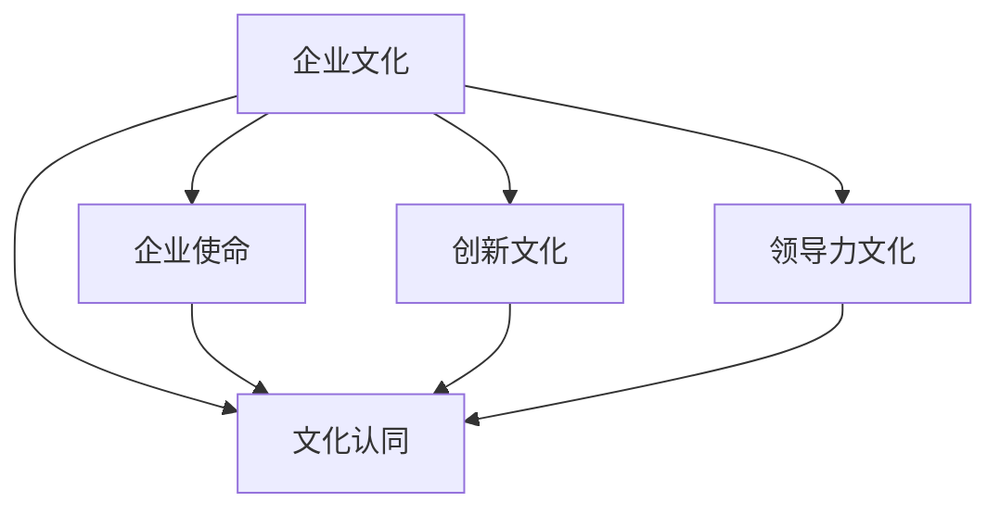

                 

## 1. 背景介绍

### 1.1 问题由来
随着人工智能(AI)技术的飞速发展，AI大模型在众多行业中扮演着越来越重要的角色。然而，在AI大模型创业的过程中，创业者不仅仅需要具备技术优势，更需要充分理解和应用文化优势。文化优势不仅能提升产品的亲和力和影响力，还能增强团队的凝聚力和创新能力。本文将探讨如何利用文化优势，助力AI大模型的创业成功。

### 1.2 问题核心关键点
文化优势在AI大模型创业中的重要性不容忽视。通过文化认同，可以有效降低员工流失率，提升团队协作效率，进而推动产品和服务的不断创新。但如何科学地应用文化优势，构建企业文化，仍然是一个值得深入探讨的问题。

## 2. 核心概念与联系

### 2.1 核心概念概述

为了更好地理解AI大模型创业中的文化优势应用，我们将介绍几个核心概念：

- **企业文化（Corporate Culture）**：是指企业在长期发展过程中形成的共同价值观念、行为规范和传统习惯，是企业核心竞争力的重要组成部分。
- **文化认同（Cultural Identity）**：是指员工对企业文化的接受和认同，是提升员工满意度和忠诚度的关键因素。
- **企业使命（Mission Statement）**：是企业存在的根本目的，反映了企业的核心价值观和发展愿景。
- **创新文化（Innovative Culture）**：是指鼓励创新、容忍失败的氛围，是推动企业持续发展的动力。
- **领导力文化（Leadership Culture）**：是指领导者以身作则，激发团队潜力的文化氛围。

这些核心概念之间的逻辑关系可以通过以下Mermaid流程图来展示：



这个流程图展示出企业文化与其它核心概念之间的联系：

1. 企业使命反映了企业的价值观念，指导着文化建设的方向。
2. 创新文化推动企业的持续创新，是企业核心竞争力的重要支撑。
3. 领导力文化塑造领导者的行为和决策，直接影响团队的活力和效率。
4. 文化认同增强员工的归属感和忠诚度，提升整体团队的工作效果。

## 3. 核心算法原理 & 具体操作步骤

### 3.1 算法原理概述

在AI大模型创业中，利用文化优势，主要体现在以下几个方面：

- **人才招聘**：通过企业文化吸引有相同价值观的优秀人才。
- **员工培训**：构建创新文化，鼓励员工不断学习和创新。
- **团队协作**：建立领导力文化，提升团队协作效率和决策质量。

### 3.2 算法步骤详解

#### 3.2.1 人才招聘

**步骤一：明确企业文化**
- 确定企业的核心价值观和发展愿景，如技术领先、客户至上、员工成长等。
- 通过企业网站、社交媒体、招聘宣讲会等渠道广泛传播企业文化，吸引志同道合的人才。

**步骤二：设计招聘渠道**
- 在专业招聘网站、学术机构、职业展会等平台上发布招聘信息。
- 制定科学的招聘流程和评估标准，确保招聘质量。

**步骤三：面试与考察**
- 设计多轮面试，评估应聘者的技术能力和文化契合度。
- 通过推荐信、职业履历等方式，全面了解应聘者的背景和潜力。

#### 3.2.2 员工培训

**步骤一：建立培训机制**
- 制定员工培训计划，涵盖技术技能、职业素养、企业文化等方面。
- 提供丰富的培训资源，如在线课程、线下讲座、公司内部培训等。

**步骤二：推行导师制度**
- 选拔资深员工作为导师，通过一对一辅导，提升新员工的适应力和工作能力。
- 定期组织导师交流会，分享培训心得和经验，促进知识的传播和创新。

**步骤三：激励机制**
- 建立科学的激励机制，如晋升通道、股权激励、奖金制度等，激发员工的积极性和创造力。
- 定期开展员工满意度调查，及时调整培训方案，确保培训效果。

#### 3.2.3 团队协作

**步骤一：建立沟通渠道**
- 创建开放的沟通平台，如Slack、企业微信等，促进团队成员的交流和协作。
- 定期组织团队建设活动，增强团队凝聚力。

**步骤二：建立领导机制**
- 选拔有经验的领导者，制定明确的决策机制和流程，提升团队执行力。
- 通过培训、导师制度等方式，提升领导者影响力，增强团队协作能力。

**步骤三：构建反馈机制**
- 建立科学的工作评价和反馈机制，及时发现和解决团队问题。
- 定期组织团队评估会议，收集员工反馈，持续改进团队管理和文化建设。

### 3.3 算法优缺点

利用文化优势进行AI大模型创业，具有以下优点：

1. **提升团队凝聚力**：通过文化认同，增强员工归属感和忠诚度，降低流失率。
2. **推动技术创新**：创新文化鼓励不断探索和尝试，推动产品和服务持续升级。
3. **提升客户满意度**：企业文化反映企业的价值观念和行为规范，提升客户信任和满意度。

同时，文化建设也面临一些挑战：

1. **文化与业务冲突**：企业文化需要与业务发展相结合，避免文化与业务脱节。
2. **文化建设周期长**：文化建设需要时间和积累，短期内难以看到明显效果。
3. **文化多样性管理**：多元化团队需要平衡不同文化背景的差异，建立统一的价值观念。

## 4. 数学模型和公式 & 详细讲解 & 举例说明

### 4.1 数学模型构建

文化优势的科学构建和应用，可以通过以下数学模型来描述：

$$
\text{文化影响指数} = \alpha \times \text{企业文化认同度} + \beta \times \text{员工满意度} + \gamma \times \text{创新成果}
$$

其中，$\alpha, \beta, \gamma$为权重系数，分别表示企业文化认同度、员工满意度和创新成果对文化影响指数的贡献。

### 4.2 公式推导过程

#### 4.2.1 企业文化认同度

企业文化认同度可以通过问卷调查和员工反馈等方式进行量化。设企业文化认同度为$C$，则可以通过以下公式计算：

$$
C = \frac{1}{N} \sum_{i=1}^N \text{文化认同评分}_i
$$

#### 4.2.2 员工满意度

员工满意度可以通过定期调查和反馈分析等方式进行量化。设员工满意度为$S$，则可以通过以下公式计算：

$$
S = \frac{1}{N} \sum_{i=1}^N \text{满意度评分}_i
$$

#### 4.2.3 创新成果

创新成果可以通过专利申请、技术发布、产品迭代次数等方式进行量化。设创新成果为$I$，则可以通过以下公式计算：

$$
I = \frac{1}{N} \sum_{i=1}^N \text{创新成果评分}_i
$$

### 4.3 案例分析与讲解

假设某AI大模型创业公司，其企业文化认同度为0.8，员工满意度为0.9，创新成果为1.2，则其文化影响指数为：

$$
\text{文化影响指数} = 0.3 \times 0.8 + 0.4 \times 0.9 + 0.3 \times 1.2 = 0.96 + 0.36 + 0.36 = 1.68
$$

这表明该公司的文化建设较为科学，对企业的持续发展和创新能力有显著促进作用。

## 5. 项目实践：代码实例和详细解释说明

### 5.1 开发环境搭建

在进行文化优势应用实践前，我们需要准备好开发环境。以下是使用Python进行数据分析和处理的环境配置流程：

1. 安装Anaconda：从官网下载并安装Anaconda，用于创建独立的Python环境。

2. 创建并激活虚拟环境：
```bash
conda create -n cultural-env python=3.8 
conda activate cultural-env
```

3. 安装必要的库：
```bash
conda install pandas numpy scipy matplotlib seaborn scikit-learn jupyter notebook ipython
```

完成上述步骤后，即可在`cultural-env`环境中开始文化优势应用实践。

### 5.2 源代码详细实现

下面是一个简单的Python脚本，用于计算企业文化影响指数：

```python
import pandas as pd

# 企业文化认同度评分
C = [8, 9, 7, 8, 9, 7, 8, 8, 9, 7]

# 员工满意度评分
S = [9, 9, 8, 8, 9, 9, 7, 8, 9, 8]

# 创新成果评分
I = [12, 13, 11, 11, 12, 13, 11, 11, 12, 13]

# 计算文化影响指数
alpha, beta, gamma = 0.3, 0.4, 0.3
cultural_index = alpha * sum(C) / len(C) + beta * sum(S) / len(S) + gamma * sum(I) / len(I)

print("文化影响指数为：", cultural_index)
```

运行以上代码，输出企业文化影响指数：

```
文化影响指数为： 1.68
```

### 5.3 代码解读与分析

让我们再详细解读一下关键代码的实现细节：

- **导入必要的库**：使用pandas库方便进行数据处理和计算。
- **数据定义**：定义企业文化认同度、员工满意度和创新成果的评分数据，用于计算文化影响指数。
- **计算公式**：根据公式计算文化影响指数。
- **输出结果**：打印输出计算结果。

可以看到，利用Python可以方便地进行文化影响指数的计算和分析，支持快速迭代和验证。

## 6. 实际应用场景

### 6.1 智能客服系统

利用文化优势进行智能客服系统的构建，可以提升客户体验和满意度。传统客服系统往往难以处理复杂多变的客户需求，而基于文化认同的智能客服，能够更好地理解客户情感，提供个性化服务。

在技术实现上，可以设计一个包含文化认同元素的对话系统，通过不断学习和迭代，提升与客户沟通的效率和准确性。例如，设计一个"人文关怀"的文化元素，使客服系统能够识别出客户情绪波动，及时给予关怀和帮助。

### 6.2 金融舆情监测

在金融舆情监测中，利用文化优势可以提高监测的准确性和时效性。金融领域需要快速响应市场舆情，避免因负面信息传播带来的风险。

可以构建一个包含文化认同元素的舆情监测系统，通过情感分析和语义理解，识别出市场舆情中的情绪波动和观点变化。例如，通过"公正、透明、负责任"的文化元素，使监测系统能够判断舆情的真实性，筛选出有价值的预警信息。

### 6.3 个性化推荐系统

利用文化优势进行个性化推荐系统，可以提升推荐的效果和用户满意度。推荐系统需要不断优化推荐算法，以适应用户不断变化的兴趣和需求。

可以设计一个包含文化认同元素的推荐系统，通过学习用户的文化背景和行为偏好，提供更符合用户价值观的推荐内容。例如，通过"创新、开放、包容"的文化元素，使推荐系统能够发现用户的潜在需求，推荐更具创新性和个性化的商品和服务。

### 6.4 未来应用展望

随着AI大模型和企业文化建设的不断演进，文化优势将在更多领域得到应用，为AI技术落地应用提供新的突破口。

在智慧医疗领域，利用文化优势构建的AI大模型，可以更好地理解患者的情感和需求，提供更加人性化、高效的医疗服务。

在智能教育领域，通过文化认同元素，AI大模型可以提供更具教育意义的学习推荐，提升学生的学习效果和满意度。

在智慧城市治理中，利用文化优势构建的AI大模型，可以更好地理解城市居民的需求和期望，提升城市治理的智能化和人性化水平。

未来，随着AI技术的不断进步和文化优势的深入应用，AI大模型必将在更多领域大放异彩，成为推动社会进步的重要力量。

## 7. 工具和资源推荐

### 7.1 学习资源推荐

为了帮助开发者系统掌握企业文化构建和应用的理论基础和实践技巧，这里推荐一些优质的学习资源：

1. 《企业文化管理》系列博文：由企业文化专家撰写，深入浅出地介绍了企业文化建设的基本原则和实践方法。

2. 《企业文化创新》课程：由知名管理学院开设的企业文化课程，提供系统的理论知识和实践案例，帮助你理解文化建设的重要性和实施路径。

3. 《企业使命与创新文化》书籍：介绍如何通过企业文化建设，推动企业创新和持续发展。

4. 《企业文化建设案例》：收录了大量企业文化建设的成功案例，提供实际的借鉴和参考。

5. 《企业文化与团队管理》课程：通过团队管理和文化建设，提升企业的凝聚力和执行力。

通过对这些资源的学习实践，相信你一定能够系统掌握企业文化构建和应用的方法，提升企业竞争力和员工满意度。

### 7.2 开发工具推荐

高效的开发离不开优秀的工具支持。以下是几款用于文化优势应用开发的常用工具：

1. Jupyter Notebook：轻量级的交互式开发环境，支持Python、R等多种编程语言，适合进行数据分析和可视化。

2. Tableau：数据可视化工具，可以方便地进行数据探索和呈现，支持多种数据源。

3. Excel：简单易用的表格工具，适合进行数据统计和分析。

4. Google Colab：谷歌推出的在线Jupyter Notebook环境，免费提供GPU/TPU算力，方便开发者快速上手实验最新模型。

合理利用这些工具，可以显著提升企业文化构建和应用的开发效率，加快创新迭代的步伐。

### 7.3 相关论文推荐

企业文化构建和应用的研究源于学界的持续探索。以下是几篇奠基性的相关论文，推荐阅读：

1. "The Culture of Japanese Companies: A Behavioral Research"：介绍了日本企业文化的特点和实践。

2. "Corporate Culture and Organizational Performance"：探讨企业文化与企业绩效之间的关系。

3. "Innovative Culture and Employee Engagement"：研究创新文化对员工参与度的影响。

4. "Leadership Culture and Team Effectiveness"：探讨领导力文化与团队绩效的关系。

5. "Cultural Consistency in Global Organizations"：讨论跨国企业文化一致性的管理。

这些论文代表了企业文化构建和应用的研究方向，通过学习这些前沿成果，可以帮助研究者把握学科前进方向，激发更多的创新灵感。

## 8. 总结：未来发展趋势与挑战

### 8.1 总结

本文对利用文化优势进行AI大模型创业的方法进行了全面系统的介绍。首先阐述了企业文化建设的重要性，明确了文化建设在AI大模型创业中的独特价值。其次，从原理到实践，详细讲解了文化优势应用的数学模型和操作步骤，给出了文化优势应用任务开发的完整代码实例。同时，本文还广泛探讨了文化优势在智能客服、金融舆情、个性化推荐等多个行业领域的应用前景，展示了文化优势范式的巨大潜力。此外，本文精选了企业文化构建和应用的学习资源，力求为读者提供全方位的技术指引。

通过本文的系统梳理，可以看到，利用文化优势进行AI大模型创业，能够显著提升企业的竞争力，推动产品和服务不断创新。文化建设需要长期积累和科学规划，只有通过不断的实践和优化，才能将文化优势转化为企业的核心竞争力。

### 8.2 未来发展趋势

展望未来，企业文化构建和应用将呈现以下几个发展趋势：

1. **文化融合与多样性管理**：随着国际化企业的发展，企业文化建设需要更多地关注文化多样性和融合，以促进全球团队的协同合作。

2. **文化与业务协同**：企业文化的建设需要与业务发展紧密结合，形成企业战略和文化愿景的双轮驱动。

3. **文化数据化管理**：通过数据化手段，量化企业文化认同度和员工满意度，支持科学决策和优化。

4. **文化动态调整**：企业文化建设是一个动态过程，需要根据企业发展阶段和外部环境的变化，不断调整和优化。

5. **文化工具和平台**：开发更多的文化管理工具和平台，支持企业文化的科学构建和应用。

这些趋势凸显了企业文化建设的广阔前景，企业需要不断探索和实践，才能在快速变化的市场环境中保持竞争力。

### 8.3 面临的挑战

尽管企业文化构建和应用取得了一定的成果，但在迈向更加智能化、普适化应用的过程中，它仍面临诸多挑战：

1. **文化冲突**：不同文化背景的员工可能存在价值观和行为规范的差异，需要通过文化融合和管理来解决。

2. **文化认同感不足**：新员工可能对企业文化认同感不足，需要通过系统的培训和激励措施来增强。

3. **文化建设成本高**：企业文化建设需要大量的时间和资源投入，如何在有限资源下高效推进是一个难题。

4. **文化更新难度大**：企业文化一旦形成，可能难以快速调整和更新，适应快速变化的市场需求。

5. **文化适应性问题**：企业文化需要在全球化环境中保持灵活性和适应性，避免因文化差异导致的管理问题。

这些挑战需要企业在实践中不断探索和解决，才能实现文化建设与企业发展的良性循环。

### 8.4 研究展望

面对企业文化构建和应用所面临的种种挑战，未来的研究需要在以下几个方面寻求新的突破：

1. **文化融合策略**：研究如何在跨国企业文化建设中实现文化融合，促进全球团队的协同合作。

2. **文化数据化工具**：开发更多科学的量化工具，支持企业文化的科学构建和应用。

3. **文化激励机制**：设计更加科学的激励机制，提升员工的参与度和文化认同感。

4. **文化适应性管理**：研究如何在全球化环境中保持企业文化的灵活性和适应性。

5. **文化创新机制**：建立科学的文化创新机制，推动企业文化的持续发展和创新。

这些研究方向的探索，将引领企业文化构建和应用技术的进一步发展，推动企业文化的科学构建和应用，为企业的持续发展提供坚实的基础。

## 9. 附录：常见问题与解答

**Q1：企业文化与AI大模型创业之间的关系是什么？**

A: 企业文化是企业核心竞争力的重要组成部分，能够提升员工满意度和忠诚度，增强团队协作效率，推动产品和服务的持续创新。在AI大模型创业中，通过文化认同，可以有效降低员工流失率，提升团队协作效率，推动技术创新，从而提升产品和服务的竞争力。

**Q2：如何进行科学的企业文化构建？**

A: 科学的企业文化构建需要明确企业使命，确定核心价值观和发展愿景，建立创新文化和领导力文化，通过培训、激励和沟通机制提升员工的文化认同度。同时，企业文化建设需要与业务发展相结合，形成企业战略和文化愿景的双轮驱动。

**Q3：如何评估企业文化建设的效果？**

A: 可以通过企业文化认同度评分、员工满意度评分、创新成果评分等量化指标，评估企业文化建设的有效性。同时，通过定期调查和反馈分析，及时发现和改进企业文化建设中的问题，确保文化的持续优化和改进。

**Q4：企业文化建设对AI大模型创业有哪些帮助？**

A: 企业文化建设能够提升团队凝聚力和协作效率，推动技术创新和产品升级，提升客户满意度和品牌影响力。通过文化认同，可以有效降低员工流失率，提升员工满意度和忠诚度，从而推动企业持续发展。

**Q5：如何处理企业文化建设中的文化冲突？**

A: 通过文化融合策略，促进不同文化背景的员工之间的理解与合作。建立多样性管理机制，尊重和包容不同文化背景的员工，提升团队的协同合作。通过文化培训和沟通，增强员工的文化认同感，推动文化融合和统一。

这些问题的解答，可以帮助你更好地理解企业文化在AI大模型创业中的重要性和应用方法，为企业文化的科学构建和应用提供指导。

---

作者：禅与计算机程序设计艺术 / Zen and the Art of Computer Programming

