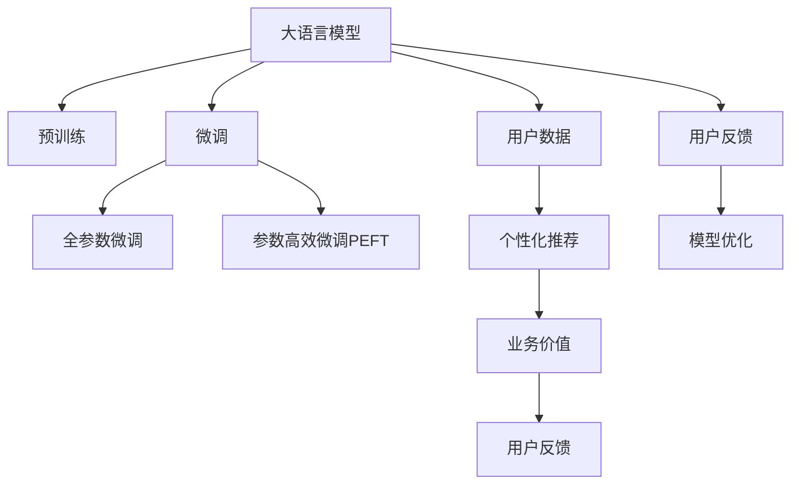

                 

# AI 大模型创业：如何利用用户优势？

> 关键词：AI 大模型,用户优势,创业策略,数据驱动,个性化推荐,反哺训练,模型优化,业务价值

## 1. 背景介绍

### 1.1 问题由来
近年来，人工智能(AI)和大模型在各个行业的应用日益广泛，从金融、医疗到电商、教育，大模型的影子无处不在。这些大模型通常基于海量的数据进行预训练，具备强大的语言理解、图像识别、生成能力。在实际应用中，企业通常会基于这些大模型进行微调，以适应特定的业务需求。但如何有效利用用户数据进行微调，并从用户反馈中提取价值，成为大模型创业团队面临的重要挑战。

### 1.2 问题核心关键点
1. **用户数据质量**：高质量的用户数据是大模型微调的基础。数据的丰富度、多样性、真实性直接影响微调效果。
2. **数据隐私与合规**：在获取和使用用户数据时，必须严格遵守相关隐私法律法规，如GDPR、CCPA等。
3. **数据反哺与优化**：利用用户反馈对模型进行持续优化，是提升模型性能的关键。
4. **个性化推荐与业务价值**：基于大模型的个性化推荐系统，可以大幅提升用户满意度和业务收益。
5. **算法透明性与可解释性**：大模型在实际应用中的决策过程需要透明可解释，以满足用户的信任需求。

### 1.3 问题研究意义
通过系统地研究如何利用用户优势，本文旨在为大模型创业团队提供实用的指导，帮助他们更好地理解和应用用户数据，提升模型性能，创造业务价值。

## 2. 核心概念与联系

### 2.1 核心概念概述

为更好地理解大模型在创业场景下的应用，本节将介绍几个密切相关的核心概念：

- **大模型(大语言模型)**：以自回归(如GPT)或自编码(如BERT)模型为代表的大规模预训练语言模型。通过在海量无标签文本语料上进行预训练，学习通用的语言表示，具备强大的语言理解和生成能力。

- **微调(Fine-tuning)**：指在预训练模型的基础上，使用下游任务的少量标注数据，通过有监督学习优化模型在特定任务上的性能。通常只需要调整顶层分类器或解码器，并以较小的学习率更新全部或部分的模型参数。

- **用户数据(User Data)**：用户在应用平台上的行为数据、反馈数据等，是大模型微调的重要来源。

- **个性化推荐(Recommendation System)**：基于用户历史行为和偏好，生成个性化内容推荐，提升用户满意度和转化率。

- **用户反馈(User Feedback)**：用户在应用中的评分、评论等反馈数据，是大模型优化和改进的重要依据。

- **业务价值(Business Value)**：大模型在实际应用中带来的商业价值，包括提高用户留存率、增加营收等。

这些核心概念之间的逻辑关系可以通过以下Mermaid流程图来展示：



这个流程图展示了大模型微调的各个关键组件及其之间的联系：

1. 大模型通过预训练获得基础能力。
2. 微调是对预训练模型进行任务特定的优化，可以分为全参数微调和参数高效微调。
3. 利用用户数据进行微调，实现个性化推荐，提升业务价值。
4. 用户反馈用于模型优化，不断提升模型性能。
5. 业务价值与模型表现密切相关。

这些概念共同构成了大模型创业的应用框架，为大模型创业团队提供了系统化的思路和方向。

## 3. 核心算法原理 & 具体操作步骤
### 3.1 算法原理概述

基于用户数据的大模型微调方法，核心思想是利用用户数据进行有监督学习，优化模型在特定任务上的性能，同时实现个性化推荐，提升业务价值。具体而言，可以包括以下几个步骤：

1. **数据收集与预处理**：从用户应用中收集行为数据、反馈数据等，清洗和标准化数据，得到可用于微调的训练集。
2. **任务适配与模型微调**：根据具体任务需求，设计任务适配层，在预训练模型的基础上进行微调，以适应特定任务。
3. **个性化推荐系统构建**：利用微调后的模型进行个性化推荐，提升用户满意度。
4. **业务价值评估与迭代**：通过业务指标评估微调效果，根据用户反馈调整模型参数，实现模型的持续优化。

### 3.2 算法步骤详解

以下是详细的操作步骤：

**Step 1: 数据收集与预处理**

1. **用户行为数据收集**：从用户应用中收集用户的点击、浏览、购买、评论等行为数据，保存为结构化或非结构化格式。
2. **数据清洗与标准化**：去除重复、噪声、异常数据，标准化数据格式，包括时间戳、字段命名等。
3. **数据划分**：将数据划分为训练集、验证集和测试集，确保数据的多样性和代表性。
4. **特征工程**：设计特征变量，包括用户ID、时间戳、物品ID、行为类型等，提取有意义的特征。

**Step 2: 任务适配与模型微调**

1. **选择微调模型**：根据任务需求选择合适的预训练语言模型，如BERT、GPT等。
2. **设计任务适配层**：根据任务类型设计适配层，如分类任务设计线性分类器，生成任务设计解码器。
3. **设置微调超参数**：选择合适的优化算法及其参数，如AdamW、SGD等，设置学习率、批大小、迭代轮数等。
4. **执行梯度训练**：使用用户行为数据进行微调，优化模型在特定任务上的性能。

**Step 3: 个性化推荐系统构建**

1. **构建推荐模型**：使用微调后的模型进行推荐，生成个性化推荐列表。
2. **评估推荐效果**：使用评估指标如点击率、转化率、用户满意度等，评估推荐效果。
3. **持续优化推荐模型**：根据用户反馈，动态调整推荐模型，提升推荐精度。

**Step 4: 业务价值评估与迭代**

1. **定义业务指标**：如用户留存率、客户满意度、转化率等，定义业务价值评估指标。
2. **评估微调效果**：通过业务指标评估微调效果，评估模型对业务价值的提升。
3. **调整微调参数**：根据用户反馈和业务指标，调整微调参数，持续优化模型。

### 3.3 算法优缺点

基于用户数据的大模型微调方法具有以下优点：

1. **数据驱动**：利用用户数据进行微调，能够更贴近用户需求，提升模型效果。
2. **高效优化**：通过持续优化，不断提升模型性能，满足业务需求。
3. **个性化推荐**：利用微调模型进行个性化推荐，提升用户满意度，增加业务收益。
4. **可解释性强**：通过用户反馈优化模型，提升模型的可解释性。

同时，该方法也存在一定的局限性：

1. **用户隐私问题**：用户数据的收集和处理必须严格遵守隐私法律法规，确保数据安全和隐私保护。
2. **数据质量问题**：用户数据的收集和标准化需要投入大量时间和资源，数据质量直接影响微调效果。
3. **模型泛化能力**：用户数据的多样性和真实性决定了模型泛化能力，处理不当可能导致模型过拟合。

尽管存在这些局限性，但通过合理的数据处理和模型设计，仍能最大限度地发挥用户数据在模型微调中的价值，提升大模型的性能和业务价值。

### 3.4 算法应用领域

基于用户数据的大模型微调方法，在以下几个领域中得到了广泛应用：

- **个性化推荐系统**：如电商平台、视频平台、音乐平台等，通过微调模型实现个性化推荐，提升用户体验和转化率。
- **智能客服系统**：如银行、电商、物流等行业，利用微调模型提高客服系统的智能化水平，提升用户满意度。
- **金融风险管理**：如银行、保险公司，通过微调模型进行信用评分、风险评估，提升风险管理能力。
- **广告推荐系统**：如互联网广告、社交媒体等，利用微调模型优化广告投放策略，提高广告点击率。
- **医疗健康应用**：如在线医疗、健康管理等，利用微调模型进行疾病诊断、健康推荐，提升用户健康管理水平。

除了这些领域，大模型微调技术还在新闻推荐、旅游推荐、教育推荐等多个行业得到应用，为传统行业带来了新的发展机遇。

## 4. 数学模型和公式 & 详细讲解  
### 4.1 数学模型构建

假设用户数据集为 $D=\{(x_i,y_i)\}_{i=1}^N, x_i \in \mathcal{X}, y_i \in \mathcal{Y}$，其中 $\mathcal{X}$ 为用户行为特征向量，$\mathcal{Y}$ 为推荐结果标签。微调任务的损失函数为：

$$
\mathcal{L}(\theta) = \frac{1}{N} \sum_{i=1}^N \ell(M_{\theta}(x_i),y_i)
$$

其中 $\ell$ 为损失函数，$M_{\theta}$ 为微调后的模型，$x_i$ 为用户行为特征向量，$y_i$ 为推荐结果标签。

微调的优化目标是最小化经验风险，即找到最优参数：

$$
\theta^* = \mathop{\arg\min}_{\theta} \mathcal{L}(\theta)
$$

在实践中，我们通常使用基于梯度的优化算法（如SGD、Adam等）来近似求解上述最优化问题。设 $\eta$ 为学习率，$\lambda$ 为正则化系数，则参数的更新公式为：

$$
\theta \leftarrow \theta - \eta \nabla_{\theta}\mathcal{L}(\theta) - \eta\lambda\theta
$$

其中 $\nabla_{\theta}\mathcal{L}(\theta)$ 为损失函数对参数 $\theta$ 的梯度，可通过反向传播算法高效计算。

### 4.2 公式推导过程

以下我们以推荐任务为例，推导交叉熵损失函数及其梯度的计算公式。

假设模型 $M_{\theta}$ 在用户行为特征 $x$ 上的推荐结果为 $\hat{y}=M_{\theta}(x) \in [0,1]$，表示用户对物品 $y$ 的兴趣程度。真实标签 $y \in \{0,1\}$。则二分类交叉熵损失函数定义为：

$$
\ell(M_{\theta}(x),y) = -[y\log \hat{y} + (1-y)\log (1-\hat{y})]
$$

将其代入经验风险公式，得：

$$
\mathcal{L}(\theta) = -\frac{1}{N}\sum_{i=1}^N [y_i\log M_{\theta}(x_i)+(1-y_i)\log(1-M_{\theta}(x_i))]
$$

根据链式法则，损失函数对参数 $\theta_k$ 的梯度为：

$$
\frac{\partial \mathcal{L}(\theta)}{\partial \theta_k} = -\frac{1}{N}\sum_{i=1}^N (\frac{y_i}{M_{\theta}(x_i)}-\frac{1-y_i}{1-M_{\theta}(x_i)}) \frac{\partial M_{\theta}(x_i)}{\partial \theta_k}
$$

其中 $\frac{\partial M_{\theta}(x_i)}{\partial \theta_k}$ 可进一步递归展开，利用自动微分技术完成计算。

在得到损失函数的梯度后，即可带入参数更新公式，完成模型的迭代优化。重复上述过程直至收敛，最终得到适应下游任务的最优模型参数 $\theta^*$。

## 5. 项目实践：代码实例和详细解释说明
### 5.1 开发环境搭建

在进行微调实践前，我们需要准备好开发环境。以下是使用Python进行PyTorch开发的环境配置流程：

1. 安装Anaconda：从官网下载并安装Anaconda，用于创建独立的Python环境。

2. 创建并激活虚拟环境：
```bash
conda create -n pytorch-env python=3.8 
conda activate pytorch-env
```

3. 安装PyTorch：根据CUDA版本，从官网获取对应的安装命令。例如：
```bash
conda install pytorch torchvision torchaudio cudatoolkit=11.1 -c pytorch -c conda-forge
```

4. 安装Transformers库：
```bash
pip install transformers
```

5. 安装各类工具包：
```bash
pip install numpy pandas scikit-learn matplotlib tqdm jupyter notebook ipython
```

完成上述步骤后，即可在`pytorch-env`环境中开始微调实践。

### 5.2 源代码详细实现

下面我们以推荐任务为例，给出使用Transformers库对BERT模型进行微调的PyTorch代码实现。

首先，定义推荐任务的数据处理函数：

```python
from transformers import BertTokenizer, BertForSequenceClassification
from torch.utils.data import Dataset
import torch

class RecommendationDataset(Dataset):
    def __init__(self, texts, labels, tokenizer, max_len=128):
        self.texts = texts
        self.labels = labels
        self.tokenizer = tokenizer
        self.max_len = max_len
        
    def __len__(self):
        return len(self.texts)
    
    def __getitem__(self, item):
        text = self.texts[item]
        label = self.labels[item]
        
        encoding = self.tokenizer(text, return_tensors='pt', max_length=self.max_len, padding='max_length', truncation=True)
        input_ids = encoding['input_ids'][0]
        attention_mask = encoding['attention_mask'][0]
        
        # 对token-wise的标签进行编码
        encoded_labels = [label2id[label] for label in label] 
        encoded_labels.extend([label2id['0']] * (self.max_len - len(encoded_labels)))
        labels = torch.tensor(encoded_labels, dtype=torch.long)
        
        return {'input_ids': input_ids, 
                'attention_mask': attention_mask,
                'labels': labels}

# 标签与id的映射
label2id = {'0': 0, '1': 1}
id2label = {v: k for k, v in label2id.items()}

# 创建dataset
tokenizer = BertTokenizer.from_pretrained('bert-base-cased')

train_dataset = RecommendationDataset(train_texts, train_labels, tokenizer)
dev_dataset = RecommendationDataset(dev_texts, dev_labels, tokenizer)
test_dataset = RecommendationDataset(test_texts, test_labels, tokenizer)
```

然后，定义模型和优化器：

```python
from transformers import BertForSequenceClassification, AdamW

model = BertForSequenceClassification.from_pretrained('bert-base-cased', num_labels=len(label2id))

optimizer = AdamW(model.parameters(), lr=2e-5)
```

接着，定义训练和评估函数：

```python
from torch.utils.data import DataLoader
from tqdm import tqdm
from sklearn.metrics import accuracy_score

device = torch.device('cuda') if torch.cuda.is_available() else torch.device('cpu')
model.to(device)

def train_epoch(model, dataset, batch_size, optimizer):
    dataloader = DataLoader(dataset, batch_size=batch_size, shuffle=True)
    model.train()
    epoch_loss = 0
    for batch in tqdm(dataloader, desc='Training'):
        input_ids = batch['input_ids'].to(device)
        attention_mask = batch['attention_mask'].to(device)
        labels = batch['labels'].to(device)
        model.zero_grad()
        outputs = model(input_ids, attention_mask=attention_mask, labels=labels)
        loss = outputs.loss
        epoch_loss += loss.item()
        loss.backward()
        optimizer.step()
    return epoch_loss / len(dataloader)

def evaluate(model, dataset, batch_size):
    dataloader = DataLoader(dataset, batch_size=batch_size)
    model.eval()
    preds, labels = [], []
    with torch.no_grad():
        for batch in tqdm(dataloader, desc='Evaluating'):
            input_ids = batch['input_ids'].to(device)
            attention_mask = batch['attention_mask'].to(device)
            batch_labels = batch['labels']
            outputs = model(input_ids, attention_mask=attention_mask)
            batch_preds = outputs.logits.argmax(dim=2).to('cpu').tolist()
            batch_labels = batch_labels.to('cpu').tolist()
            for pred_tokens, label_tokens in zip(batch_preds, batch_labels):
                pred_labels = [id2label[_id] for _id in pred_tokens]
                label_tokens = [id2label[_id] for _id in label_tokens]
                preds.append(pred_labels[:len(label_tokens)])
                labels.append(label_tokens)
                
    print(f'Accuracy: {accuracy_score(labels, preds)}')
```

最后，启动训练流程并在测试集上评估：

```python
epochs = 5
batch_size = 16

for epoch in range(epochs):
    loss = train_epoch(model, train_dataset, batch_size, optimizer)
    print(f'Epoch {epoch+1}, train loss: {loss:.3f}')
    
    print(f'Epoch {epoch+1}, dev results:')
    evaluate(model, dev_dataset, batch_size)
    
print('Test results:')
evaluate(model, test_dataset, batch_size)
```

以上就是使用PyTorch对BERT进行推荐任务微调的完整代码实现。可以看到，得益于Transformers库的强大封装，我们可以用相对简洁的代码完成BERT模型的加载和微调。

### 5.3 代码解读与分析

让我们再详细解读一下关键代码的实现细节：

**RecommendationDataset类**：
- `__init__`方法：初始化文本、标签、分词器等关键组件。
- `__len__`方法：返回数据集的样本数量。
- `__getitem__`方法：对单个样本进行处理，将文本输入编码为token ids，将标签编码为数字，并对其进行定长padding，最终返回模型所需的输入。

**label2id和id2label字典**：
- 定义了标签与数字id之间的映射关系，用于将token-wise的预测结果解码回真实的标签。

**训练和评估函数**：
- 使用PyTorch的DataLoader对数据集进行批次化加载，供模型训练和推理使用。
- 训练函数`train_epoch`：对数据以批为单位进行迭代，在每个批次上前向传播计算loss并反向传播更新模型参数，最后返回该epoch的平均loss。
- 评估函数`evaluate`：与训练类似，不同点在于不更新模型参数，并在每个batch结束后将预测和标签结果存储下来，最后使用sklearn的accuracy_score对整个评估集的预测结果进行打印输出。

**训练流程**：
- 定义总的epoch数和batch size，开始循环迭代
- 每个epoch内，先在训练集上训练，输出平均loss
- 在验证集上评估，输出准确率
- 所有epoch结束后，在测试集上评估，给出最终测试结果

可以看到，PyTorch配合Transformers库使得BERT微调的代码实现变得简洁高效。开发者可以将更多精力放在数据处理、模型改进等高层逻辑上，而不必过多关注底层的实现细节。

当然，工业级的系统实现还需考虑更多因素，如模型的保存和部署、超参数的自动搜索、更灵活的任务适配层等。但核心的微调范式基本与此类似。

## 6. 实际应用场景
### 6.1 电商平台推荐

基于大语言模型微调的推荐系统，可以广泛应用于电商平台。传统的推荐系统往往只依赖用户的历史行为数据进行物品推荐，无法深入理解用户的兴趣偏好。利用微调后的推荐模型，可以显著提升推荐效果，提升用户满意度和转化率。

在技术实现上，可以收集用户浏览、点击、购买等行为数据，提取和物品相关的特征，在此基础上对预训练模型进行微调。微调后的模型能够从行为数据中学习用户兴趣点，生成个性化推荐列表。对于用户提出的新需求，还可以接入检索系统实时搜索相关商品，动态生成推荐结果。如此构建的推荐系统，能大幅提升用户的购物体验，提高用户留存率和营收。

### 6.2 视频平台推荐

视频平台推荐系统是另一个大模型微调的典型应用场景。视频平台推荐系统不仅要推荐视频内容，还要推荐相关的电影、电视剧、导演等，以满足用户的多样化需求。利用微调后的推荐模型，可以更准确地识别用户对视频内容的兴趣，从而推荐高质量、符合用户口味的视频内容。

在技术实现上，可以收集用户的观看历史、评分、收藏、分享等行为数据，提取视频、导演、演员等特征，在此基础上对预训练模型进行微调。微调后的模型能够从多模态数据中学习用户兴趣，生成个性化视频推荐列表。对于用户提出的新需求，还可以实时搜索相关视频，动态生成推荐结果。

### 6.3 音乐平台推荐

音乐平台推荐系统通过微调后的推荐模型，可以为用户提供个性化的音乐推荐。音乐平台推荐系统不仅要推荐歌曲，还要推荐音乐风格、歌手、专辑等，以满足用户的个性化需求。利用微调后的推荐模型，可以更准确地识别用户对音乐的兴趣，从而推荐高质量、符合用户口味的音乐内容。

在技术实现上，可以收集用户的听歌历史、评分、收藏、分享等行为数据，提取歌曲、歌手、专辑等特征，在此基础上对预训练模型进行微调。微调后的模型能够从多模态数据中学习用户兴趣，生成个性化音乐推荐列表。对于用户提出的新需求，还可以实时搜索相关音乐，动态生成推荐结果。

### 6.4 智能客服系统推荐

智能客服系统通过微调后的推荐模型，可以为用户提供个性化的服务推荐。智能客服系统不仅要推荐常见的服务，还要推荐相关的产品、服务等，以满足用户的需求。利用微调后的推荐模型，可以更准确地识别用户的需求，从而推荐最适合的服务。

在技术实现上，可以收集用户的历史服务记录、评分、评价等数据，提取服务、产品、价格等特征，在此基础上对预训练模型进行微调。微调后的模型能够从用户数据中学习用户需求，生成个性化服务推荐列表。对于用户提出的新需求，还可以实时搜索相关服务，动态生成推荐结果。

### 6.5 智能广告推荐

智能广告推荐系统通过微调后的推荐模型，可以为用户推荐高质量的广告内容。智能广告推荐系统不仅要推荐广告内容，还要推荐广告位、广告形式等，以满足用户的多样化需求。利用微调后的推荐模型，可以更准确地识别用户对广告的兴趣，从而推荐高质量、符合用户口味的广告内容。

在技术实现上，可以收集用户的浏览历史、点击行为、购买记录等数据，提取广告内容、广告位、广告形式等特征，在此基础上对预训练模型进行微调。微调后的模型能够从多模态数据中学习用户兴趣，生成个性化广告推荐列表。对于用户提出的新需求，还可以实时搜索相关广告，动态生成推荐结果。

### 6.6 社交媒体推荐

社交媒体推荐系统通过微调后的推荐模型，可以为用户提供个性化的内容推荐。社交媒体推荐系统不仅要推荐文章、图片、视频等，还要推荐作者、标签、话题等，以满足用户的多样化需求。利用微调后的推荐模型，可以更准确地识别用户对内容的兴趣，从而推荐高质量、符合用户口味的内容。

在技术实现上，可以收集用户的浏览历史、点赞、评论、分享等数据，提取内容、作者、标签等特征，在此基础上对预训练模型进行微调。微调后的模型能够从多模态数据中学习用户兴趣，生成个性化内容推荐列表。对于用户提出的新需求，还可以实时搜索相关内容，动态生成推荐结果。

## 7. 工具和资源推荐
### 7.1 学习资源推荐

为了帮助开发者系统掌握大语言模型微调的理论基础和实践技巧，这里推荐一些优质的学习资源：

1. 《Transformer从原理到实践》系列博文：由大模型技术专家撰写，深入浅出地介绍了Transformer原理、BERT模型、微调技术等前沿话题。

2. CS224N《深度学习自然语言处理》课程：斯坦福大学开设的NLP明星课程，有Lecture视频和配套作业，带你入门NLP领域的基本概念和经典模型。

3. 《Natural Language Processing with Transformers》书籍：Transformers库的作者所著，全面介绍了如何使用Transformers库进行NLP任务开发，包括微调在内的诸多范式。

4. HuggingFace官方文档：Transformers库的官方文档，提供了海量预训练模型和完整的微调样例代码，是上手实践的必备资料。

5. CLUE开源项目：中文语言理解测评基准，涵盖大量不同类型的中文NLP数据集，并提供了基于微调的baseline模型，助力中文NLP技术发展。

通过对这些资源的学习实践，相信你一定能够快速掌握大语言模型微调的精髓，并用于解决实际的NLP问题。
###  7.2 开发工具推荐

高效的开发离不开优秀的工具支持。以下是几款用于大语言模型微调开发的常用工具：

1. PyTorch：基于Python的开源深度学习框架，灵活动态的计算图，适合快速迭代研究。大部分预训练语言模型都有PyTorch版本的实现。

2. TensorFlow：由Google主导开发的开源深度学习框架，生产部署方便，适合大规模工程应用。同样有丰富的预训练语言模型资源。

3. Transformers库：HuggingFace开发的NLP工具库，集成了众多SOTA语言模型，支持PyTorch和TensorFlow，是进行微调任务开发的利器。

4. Weights & Biases：模型训练的实验跟踪工具，可以记录和可视化模型训练过程中的各项指标，方便对比和调优。与主流深度学习框架无缝集成。

5. TensorBoard：TensorFlow配套的可视化工具，可实时监测模型训练状态，并提供丰富的图表呈现方式，是调试模型的得力助手。

6. Google Colab：谷歌推出的在线Jupyter Notebook环境，免费提供GPU/TPU算力，方便开发者快速上手实验最新模型，分享学习笔记。

合理利用这些工具，可以显著提升大语言模型微调任务的开发效率，加快创新迭代的步伐。

### 7.3 相关论文推荐

大语言模型和微调技术的发展源于学界的持续研究。以下是几篇奠基性的相关论文，推荐阅读：

1. Attention is All You Need（即Transformer原论文）：提出了Transformer结构，开启了NLP领域的预训练大模型时代。

2. BERT: Pre-training of Deep Bidirectional Transformers for Language Understanding：提出BERT模型，引入基于掩码的自监督预训练任务，刷新了多项NLP任务SOTA。

3. Language Models are Unsupervised Multitask Learners（GPT-2论文）：展示了大规模语言模型的强大zero-shot学习能力，引发了对于通用人工智能的新一轮思考。

4. Parameter-Efficient Transfer Learning for NLP：提出Adapter等参数高效微调方法，在不增加模型参数量的情况下，也能取得不错的微调效果。

5. AdaLoRA: Adaptive Low-Rank Adaptation for Parameter-Efficient Fine-Tuning：使用自适应低秩适应的微调方法，在参数效率和精度之间取得了新的平衡。

这些论文代表了大语言模型微调技术的发展脉络。通过学习这些前沿成果，可以帮助研究者把握学科前进方向，激发更多的创新灵感。

## 8. 总结：未来发展趋势与挑战

### 8.1 总结

本文对基于用户数据的大语言模型微调方法进行了全面系统的介绍。首先阐述了用户数据在大模型微调中的重要作用，明确了利用用户数据进行微调的优势和挑战。其次，从原理到实践，详细讲解了微调的数学原理和关键步骤，给出了微调任务开发的完整代码实例。同时，本文还广泛探讨了微调方法在多个行业领域的应用前景，展示了微调范式的巨大潜力。此外，本文精选了微调技术的各类学习资源，力求为读者提供全方位的技术指引。

通过本文的系统梳理，可以看到，基于大模型微调的用户数据驱动方法正在成为NLP领域的重要范式，极大地拓展了预训练语言模型的应用边界，催生了更多的落地场景。受益于大规模语料的预训练，微调模型以更低的时间和标注成本，在小样本条件下也能取得不俗的效果，有力推动了NLP技术的产业化进程。未来，伴随预训练语言模型和微调方法的持续演进，相信NLP技术将在更广阔的应用领域大放异彩，深刻影响人类的生产生活方式。

### 8.2 未来发展趋势

展望未来，大语言模型微调技术将呈现以下几个发展趋势：

1. **数据驱动**：随着用户数据量的不断增长，基于用户数据进行微调的方法将进一步提升模型性能。用户数据的丰富度、多样性和真实性，直接影响微调效果。

2. **参数高效**：未来的微调方法将更加注重参数高效性，通过 Adapter、LoRA 等方法，在固定大部分预训练参数的情况下，只更新少量的任务相关参数，实现更高效的微调。

3. **多模态融合**：未来的微调方法将更好地融合多模态数据，提升模型对现实世界的理解和建模能力。通过图像、语音、文本等多模态信息的协同建模，进一步提升微调效果。

4. **跨领域迁移**：未来的微调方法将更加注重跨领域迁移能力，通过迁移学习，在相似领域之间进行知识共享和复用，提高模型泛化能力。

5. **实时性优化**：未来的微调方法将更加注重实时性优化，通过分布式训练、量化加速等方法，实现更高效的推理和部署。

6. **安全与隐私**：未来的微调方法将更加注重安全与隐私保护，通过差分隐私、联邦学习等技术，确保用户数据的安全和隐私。

以上趋势凸显了大语言模型微调技术的广阔前景。这些方向的探索发展，必将进一步提升模型性能和业务价值，推动大模型在更多领域的落地应用。

### 8.3 面临的挑战

尽管大语言模型微调技术已经取得了瞩目成就，但在迈向更加智能化、普适化应用的过程中，它仍面临着诸多挑战：

1. **数据质量问题**：用户数据的收集和标准化需要投入大量时间和资源，数据质量直接影响微调效果。如何高效获取高质量用户数据，是微调面临的主要挑战。

2. **数据隐私问题**：用户数据的收集和处理必须严格遵守隐私法律法规，确保数据安全和隐私保护。如何在数据利用和隐私保护之间找到平衡，是微调技术必须解决的重要问题。

3. **模型泛化能力**：用户数据的分布可能与训练数据差异较大，如何提高模型的泛化能力，是微调技术必须解决的难题。

4. **实时性问题**：用户在应用中的实时反馈需要及时处理，如何提升模型的实时性，满足用户的即时需求，是微调技术必须解决的问题。

5. **业务适配问题**：不同行业的业务需求差异较大，如何设计适配层和微调策略，以适应不同行业的特点，是微调技术必须解决的问题。

尽管存在这些挑战，但通过合理的数据处理和模型设计，仍能最大限度地发挥用户数据在模型微调中的价值，提升大模型的性能和业务价值。

### 8.4 研究展望

面对大语言模型微调所面临的种种挑战，未来的研究需要在以下几个方面寻求新的突破：

1. **数据增强与生成**：利用生成对抗网络（GAN）等技术，生成高质量的用户数据，以提高微调效果。

2. **多模态融合**：结合图像、语音、文本等多模态数据，提升模型对现实世界的理解和建模能力。

3. **联邦学习与差分隐私**：通过联邦学习、差分隐私等技术，确保用户数据的安全和隐私。

4. **因果推断与强化学习**：引入因果推断、强化学习等技术，提高模型的解释性和鲁棒性。

5. **跨领域迁移学习**：通过迁移学习，在不同领域之间进行知识共享和复用，提升模型的泛化能力。

6. **业务适配与实时性优化**：设计更加灵活的适配层和微调策略，以适应不同行业的特点，并提升模型的实时性。

这些研究方向的探索，必将引领大语言模型微调技术迈向更高的台阶，为构建安全、可靠、可解释、可控的智能系统铺平道路。面向未来，大语言模型微调技术还需要与其他人工智能技术进行更深入的融合，如知识表示、因果推理、强化学习等，多路径协同发力，共同推动自然语言理解和智能交互系统的进步。只有勇于创新、敢于突破，才能不断拓展语言模型的边界，让智能技术更好地造福人类社会。

## 9. 附录：常见问题与解答

**Q1：大语言模型微调是否适用于所有NLP任务？**

A: 大语言模型微调在大多数NLP任务上都能取得不错的效果，特别是对于数据量较小的任务。但对于一些特定领域的任务，如医学、法律等，仅仅依靠通用语料预训练的模型可能难以很好地适应。此时需要在特定领域语料上进一步预训练，再进行微调，才能获得理想效果。此外，对于一些需要时效性、个性化很强的任务，如对话、推荐等，微调方法也需要针对性的改进优化。

**Q2：微调过程中如何选择合适的学习率？**

A: 微调的学习率一般要比预训练时小1-2个数量级，如果使用过大的学习率，容易破坏预训练权重，导致过拟合。一般建议从1e-5开始调参，逐步减小学习率，直至收敛。也可以使用warmup策略，在开始阶段使用较小的学习率，再逐渐过渡到预设值。需要注意的是，不同的优化器(如AdamW、Adafactor等)以及不同的学习率调度策略，可能需要设置不同的学习率阈值。

**Q3：采用大模型微调时会面临哪些资源瓶颈？**

A: 目前主流的预训练大模型动辄以亿计的参数规模，对算力、内存、存储都提出了很高的要求。GPU/TPU等高性能设备是必不可少的，但即便如此，超大批次的训练和推理也可能遇到显存不足的问题。因此需要采用一些资源优化技术，如梯度积累、混合精度训练、模型并行等，来突破硬件瓶颈。同时，模型的存储和读取也可能占用大量时间和空间，需要采用模型压缩、稀疏化存储等方法进行优化。

**Q4：如何缓解微调过程中的过拟合问题？**

A: 过拟合是微调面临的主要挑战，尤其是在标注数据不足的情况下。常见的缓解策略包括：
1. 数据增强：通过回译、近义替换等方式扩充训练集
2. 正则化：使用L2正则、Dropout、Early Stopping等避免过拟合
3. 对抗训练：引入对抗样本，提高模型鲁棒性
4. 参数高效微调：只调整少量参数(如Adapter、Prefix等)，减小过拟合风险
5. 多模型集成：训练多个微调模型，取平均输出，抑制过拟合

这些策略往往需要根据具体任务和数据特点进行灵活组合。只有在数据、模型、训练、推理等各环节进行全面优化，才能最大限度地发挥大模型微调的威力。

**Q5：微调模型在落地部署时需要注意哪些问题？**

A: 将微调模型转化为实际应用，还需要考虑以下因素：
1. 模型裁剪：去除不必要的层和参数，减小模型尺寸，加快推理速度
2. 量化加速：将浮点模型转为定点模型，压缩存储空间，提高计算效率
3. 服务化封装：将模型封装为标准化服务接口，便于集成调用
4. 弹性伸缩：根据请求流量动态调整资源配置，平衡服务质量和成本
5. 监控告警：实时采集系统指标，设置异常告警阈值，确保服务稳定性
6. 安全防护：采用访问鉴权、数据脱敏等措施，保障数据和模型安全

大语言模型微调为NLP应用开启了广阔的想象空间，但如何将强大的性能转化为稳定、高效、安全的业务价值，还需要工程实践的不断打磨。唯有从数据、算法、工程、业务等多个维度协同发力，才能真正实现人工智能技术在垂直行业的规模化落地。总之，微调需要开发者根据具体任务，不断迭代和优化模型、数据和算法，方能得到理想的效果。

---

作者：禅与计算机程序设计艺术 / Zen and the Art of Computer Programming

