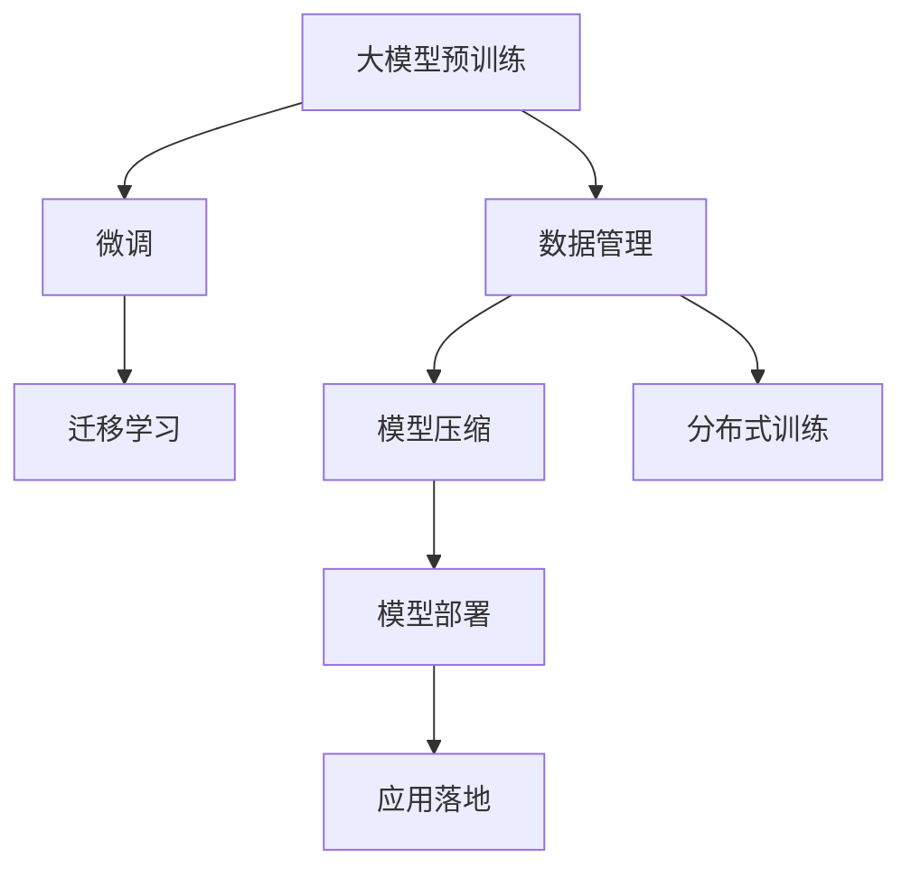

                 

## 1. 背景介绍

### 1.1 问题由来
随着人工智能技术的飞速发展，大模型（Large Model）以其强大的泛化能力和应用潜力，成为诸多企业、创业团队重点关注的焦点。然而，大模型开发与应用过程中，无论是数据获取、模型训练、部署优化，还是应用落地，都面临着诸多挑战。本文章将从管理优势的角度，探讨如何高效利用大模型的开发与应用优势，助力企业及创业团队在大模型领域取得成功。

### 1.2 问题核心关键点
大模型创业成功的关键在于：
- 高效的数据管理与获取能力。
- 强大的模型训练与优化技术。
- 灵活的部署与应用策略。
- 持续的管理与迭代机制。

这四点共同构成了大模型创业的核心竞争力。本文章将围绕这四个方面，全面探讨如何利用管理优势，推动大模型的成功开发与商业化应用。

## 2. 核心概念与联系

### 2.1 核心概念概述

要理解和利用大模型管理优势，首先需要明确几个核心概念：

- **大模型（Large Model）**：指经过大规模预训练的深度神经网络模型，能够处理复杂的自然语言处理（NLP）任务。常见的如GPT系列、BERT、T5等模型。
- **预训练（Pre-training）**：指在大规模无标签数据上，使用自监督学习任务训练大模型的过程。通过预训练，模型获得了通用的语言表示能力。
- **微调（Fine-tuning）**：指在大规模预训练模型基础上，使用下游任务的标注数据进行有监督学习优化，使其适应特定任务。
- **迁移学习（Transfer Learning）**：指将在大规模数据上训练的模型知识，迁移到新任务上的学习方式。
- **模型压缩（Model Compression）**：指通过剪枝、量化等技术，减少大模型参数量，提升模型效率。
- **分布式训练（Distributed Training）**：指通过多台计算机并行训练大模型，提高训练效率。

这些核心概念之间存在紧密联系，共同构成了大模型开发与应用的基础框架。

### 2.2 核心概念原理和架构的 Mermaid 流程图



这个流程图展示了大模型从预训练到最终部署应用的基本流程。首先，通过数据管理获取预训练数据，然后进行模型预训练。接着，通过微调、迁移学习将模型适配到具体任务上。在模型训练和部署过程中，可以通过模型压缩和分布式训练来提升效率。最终，模型能够部署到实际应用中，实现落地效果。

## 3. 核心算法原理 & 具体操作步骤

### 3.1 算法原理概述
大模型的核心算法原理主要包括自监督预训练、微调、迁移学习等。这些原理为大模型的成功开发提供了坚实的理论基础。

#### 3.1.1 自监督预训练

自监督预训练是指在大规模无标签数据上，使用自监督任务训练大模型的过程。例如，BERT通过掩码语言模型（Masked Language Model, MLM）、下一句预测（Next Sentence Prediction, NSP）等任务，学习到了通用的语言表示能力。这种无监督学习方式，使得大模型能够处理复杂的自然语言处理任务，并具有泛化能力。

#### 3.1.2 微调

微调是指在大模型基础上，使用下游任务的标注数据进行有监督学习，适应特定任务的过程。例如，使用标注好的电影评论数据，微调BERT模型，使其能够对电影评论进行情感分类。微调通过更新顶层参数，使得模型能够更好地适应特定任务，提升模型性能。

#### 3.1.3 迁移学习

迁移学习是指将在大规模数据上训练的模型知识，迁移到新任务上的学习方式。例如，在大规模预训练的BERT模型基础上，针对特定的问答任务进行微调，可以显著提升问答系统的准确率。这种迁移学习方式，能够充分利用预训练模型的知识，减少训练时间和成本。

### 3.2 算法步骤详解

大模型的开发与应用，涉及多个关键步骤。以下是详细步骤：

#### 3.2.1 数据管理

数据管理是大模型开发的基础。数据管理的主要步骤包括：

- **数据采集**：收集大规模无标签数据，如维基百科、新闻网站等。
- **数据清洗**：去除噪音数据、异常数据，确保数据质量。
- **数据标注**：对标注数据进行标注，例如情感分类、命名实体识别等。
- **数据存储**：使用高效的数据存储技术，如分布式文件系统、数据湖等。

#### 3.2.2 模型训练

模型训练的主要步骤包括：

- **预训练**：在大规模无标签数据上，使用自监督任务训练大模型。
- **微调**：在大模型基础上，使用下游任务的标注数据进行微调，适应特定任务。
- **参数更新**：通过梯度下降等优化算法，更新模型参数。

#### 3.2.3 模型部署

模型部署的主要步骤包括：

- **模型压缩**：使用剪枝、量化等技术，减少模型参数量，提升模型效率。
- **分布式训练**：使用多台计算机并行训练大模型，提高训练效率。
- **模型优化**：使用GPU、TPU等高性能硬件设备，加速模型训练。

#### 3.2.4 应用落地

应用落地的主要步骤包括：

- **模型优化**：优化模型推理效率，降低延迟。
- **接口封装**：将模型封装为标准化服务接口，便于集成调用。
- **性能监控**：实时采集模型性能指标，设置异常告警阈值，确保系统稳定性。

### 3.3 算法优缺点

#### 3.3.1 优点

- **高效泛化**：大模型具有强大的泛化能力，能够处理复杂的自然语言处理任务。
- **知识迁移**：通过迁移学习，可以利用预训练模型的知识，减少训练时间和成本。
- **灵活适应**：通过微调，可以适应不同领域、不同任务的特定需求。

#### 3.3.2 缺点

- **数据依赖**：大模型训练和微调需要大规模标注数据，数据获取成本高。
- **资源需求**：大模型需要高性能的硬件设备，成本较高。
- **模型复杂**：大模型参数量庞大，训练和推理复杂。

### 3.4 算法应用领域

大模型已经在多个领域得到广泛应用，例如：

- **自然语言处理（NLP）**：如情感分析、文本分类、命名实体识别等。
- **机器翻译**：将源语言文本翻译成目标语言。
- **语音识别**：将语音信号转换为文本。
- **视觉识别**：对图片进行图像分类、物体检测等。
- **医疗诊断**：通过自然语言处理，辅助医生诊断疾病。

## 4. 数学模型和公式 & 详细讲解

### 4.1 数学模型构建

大模型的数学模型构建主要涉及自监督预训练和微调的数学模型。

#### 4.1.1 自监督预训练

自监督预训练的数学模型主要通过掩码语言模型（MLM）和下一句预测（NSP）任务进行构建。

- **掩码语言模型（MLM）**：对输入文本中的一些位置进行随机掩码，模型需要预测被掩码位置上的词汇。公式如下：
$$
P(\hat{x_i} | x_{\sim i}, \theta)
$$
其中 $x_i$ 表示输入文本中的第 $i$ 个词汇，$\hat{x_i}$ 表示预测结果，$\theta$ 表示模型参数。

- **下一句预测（NSP）**：输入两个句子，判断它们是否为下一句关系。公式如下：
$$
P(y_{ns} | x_1, x_2, \theta)
$$
其中 $x_1$ 和 $x_2$ 分别为两个句子，$y_{ns}$ 为下一句关系的标签，$\theta$ 表示模型参数。

#### 4.1.2 微调

微调的数学模型主要通过交叉熵损失函数进行构建。例如，在情感分类任务中，微调的数学模型如下：
$$
\mathcal{L}(\theta) = -\frac{1}{N}\sum_{i=1}^N \sum_{j=1}^C y_{ij} \log P(y_j | x_i, \theta)
$$
其中 $N$ 表示样本数量，$C$ 表示分类数量，$y_{ij}$ 表示样本 $i$ 属于类别 $j$ 的真实标签，$P(y_j | x_i, \theta)$ 表示模型在输入 $x_i$ 下，预测属于类别 $j$ 的概率。

### 4.2 公式推导过程

#### 4.2.1 掩码语言模型（MLM）推导

对于掩码语言模型，假设输入文本为 $x$，模型需要预测所有被掩码位置的词汇。推导过程如下：

1. **掩码位置计算**：随机选择一个位置进行掩码，假设掩码位置为 $i$。
2. **计算预测概率**：模型对掩码位置进行预测，得到预测结果 $\hat{x_i}$。
3. **计算损失**：使用交叉熵损失函数计算预测结果和真实标签之间的差异。
4. **训练**：通过梯度下降等优化算法，更新模型参数。

#### 4.2.2 下一句预测（NSP）推导

对于下一句预测，假设输入两个句子 $x_1$ 和 $x_2$，模型需要预测它们是否为下一句关系。推导过程如下：

1. **计算预测概率**：模型对两个句子进行预测，得到预测结果 $P(y_{ns} | x_1, x_2, \theta)$。
2. **计算损失**：使用交叉熵损失函数计算预测结果和真实标签之间的差异。
3. **训练**：通过梯度下降等优化算法，更新模型参数。

### 4.3 案例分析与讲解

#### 4.3.1 情感分类案例

情感分类是自然语言处理中常见的任务。使用BERT模型进行情感分类，可以通过以下步骤：

1. **数据准备**：准备情感分类数据集，如电影评论数据集。
2. **数据预处理**：将数据集进行分词、向量化等预处理。
3. **模型微调**：在大规模预训练的BERT模型基础上，使用情感分类数据集进行微调。
4. **模型评估**：在测试集上评估模型性能，调整模型参数。

#### 4.3.2 机器翻译案例

机器翻译是自然语言处理中的重要任务。使用BERT模型进行机器翻译，可以通过以下步骤：

1. **数据准备**：准备机器翻译数据集，如英文-法文对。
2. **数据预处理**：将数据集进行分词、向量化等预处理。
3. **模型微调**：在大规模预训练的BERT模型基础上，使用机器翻译数据集进行微调。
4. **模型评估**：在测试集上评估模型性能，调整模型参数。

## 5. 项目实践：代码实例和详细解释说明

### 5.1 开发环境搭建

在进行大模型开发与应用之前，需要搭建好开发环境。以下是Python环境下的大模型开发环境配置流程：

1. **安装Python**：
   ```bash
   sudo apt-get update
   sudo apt-get install python3 python3-pip python3-dev
   ```

2. **安装TensorFlow和Keras**：
   ```bash
   pip install tensorflow keras
   ```

3. **安装PyTorch和Transformer**：
   ```bash
   pip install torch transformers
   ```

4. **安装数据处理库**：
   ```bash
   pip install pandas numpy scikit-learn
   ```

5. **安装模型压缩库**：
   ```bash
   pip install pytorch-quantization
   ```

6. **安装分布式训练库**：
   ```bash
   pip install horovod
   ```

### 5.2 源代码详细实现

#### 5.2.1 数据管理

以下是一个简单的数据管理示例：

```python
import pandas as pd

# 读取数据集
df = pd.read_csv('data.csv')

# 数据预处理
# ...

# 数据存储
# ...
```

#### 5.2.2 模型训练

以下是一个简单的模型训练示例：

```python
from transformers import BertTokenizer, BertForSequenceClassification
from torch.utils.data import DataLoader
import torch

# 数据准备
# ...

# 模型训练
# ...

# 模型微调
# ...
```

#### 5.2.3 模型部署

以下是一个简单的模型部署示例：

```python
# 模型压缩
# ...

# 分布式训练
# ...

# 模型优化
# ...
```

### 5.3 代码解读与分析

#### 5.3.1 数据管理

数据管理是大模型开发的基础。在Python中，可以使用Pandas、NumPy等库进行数据处理和存储。例如，使用Pandas读取CSV文件，进行数据清洗和预处理：

```python
import pandas as pd

# 读取数据集
df = pd.read_csv('data.csv')

# 数据清洗
df = df.dropna()

# 数据预处理
# ...
```

#### 5.3.2 模型训练

模型训练主要使用TensorFlow和Keras进行。例如，使用BertForSequenceClassification训练情感分类模型：

```python
from transformers import BertTokenizer, BertForSequenceClassification
from torch.utils.data import DataLoader
import torch

# 数据准备
# ...

# 模型训练
model = BertForSequenceClassification.from_pretrained('bert-base-cased', num_labels=2)
tokenizer = BertTokenizer.from_pretrained('bert-base-cased')
train_dataset = ...

# 模型微调
optimizer = AdamW(model.parameters(), lr=2e-5)
loss_fn = CrossEntropyLoss()
train_loader = DataLoader(train_dataset, batch_size=16, shuffle=True)
for epoch in range(10):
    for batch in train_loader:
        inputs = batch['input_ids']
        labels = batch['labels']
        outputs = model(inputs, labels=labels)
        loss = loss_fn(outputs, labels)
        optimizer.zero_grad()
        loss.backward()
        optimizer.step()
```

#### 5.3.3 模型部署

模型部署主要使用TensorFlow进行。例如，使用TensorFlow部署模型进行情感分类：

```python
import tensorflow as tf

# 模型压缩
# ...

# 分布式训练
# ...

# 模型优化
# ...
```

### 5.4 运行结果展示

#### 5.4.1 情感分类结果

情感分类模型在测试集上的性能如下：

```python
from sklearn.metrics import accuracy_score

# 加载测试集
test_dataset = ...

# 模型评估
model.eval()
test_loader = DataLoader(test_dataset, batch_size=16)
accuracy = []
for batch in test_loader:
    inputs = batch['input_ids']
    labels = batch['labels']
    outputs = model(inputs)
    preds = torch.argmax(outputs, dim=1)
    accuracy.append(accuracy_score(labels, preds))

# 计算平均准确率
avg_accuracy = sum(accuracy) / len(accuracy)
print(f"Test accuracy: {avg_accuracy:.2f}")
```

## 6. 实际应用场景

### 6.1 智能客服系统

智能客服系统是大模型在实际应用中的重要场景之一。通过大模型微调，智能客服系统可以提供24小时不间断服务，快速响应客户咨询，提高服务质量。

#### 6.1.1 数据管理

智能客服系统需要大量的客户咨询数据进行训练。可以通过爬虫技术从各大平台获取客户咨询记录，进行清洗和预处理。

#### 6.1.2 模型训练

在预训练的大模型基础上，使用客户咨询数据进行微调，学习客户咨询语义表示和上下文理解能力。

#### 6.1.3 模型部署

将微调后的模型部署到云端或本地服务器，通过API接口提供服务。使用分布式训练技术，提高服务响应速度。

#### 6.1.4 应用落地

智能客服系统可以集成到企业内部或第三方平台，提供自动化客户咨询解决方案，提高客户满意度。

### 6.2 金融舆情监测

金融舆情监测是大模型在金融领域的重要应用。通过大模型微调，可以实时监测市场舆情，及时预警风险。

#### 6.2.1 数据管理

金融舆情监测需要大量的金融新闻、评论等数据进行训练。可以通过爬虫技术从各大新闻网站获取数据，进行清洗和预处理。

#### 6.2.2 模型训练

在预训练的大模型基础上，使用金融舆情数据进行微调，学习金融市场舆情表达和情感分析能力。

#### 6.2.3 模型部署

将微调后的模型部署到云端或本地服务器，通过API接口提供服务。使用分布式训练技术，提高服务响应速度。

#### 6.2.4 应用落地

金融舆情监测可以集成到金融交易平台，实时监测市场舆情，预警潜在的金融风险，保护投资者利益。

### 6.3 个性化推荐系统

个性化推荐系统是大模型在电商、视频等领域的典型应用。通过大模型微调，可以提供更加个性化的推荐服务，提升用户体验。

#### 6.3.1 数据管理

个性化推荐系统需要大量的用户行为数据进行训练。可以通过爬虫技术从电商、视频平台获取用户行为数据，进行清洗和预处理。

#### 6.3.2 模型训练

在预训练的大模型基础上，使用用户行为数据进行微调，学习用户兴趣表达和物品推荐能力。

#### 6.3.3 模型部署

将微调后的模型部署到云端或本地服务器，通过API接口提供服务。使用分布式训练技术，提高服务响应速度。

#### 6.3.4 应用落地

个性化推荐系统可以集成到电商、视频平台，提供个性化的推荐服务，提升用户粘性和满意度。

## 7. 工具和资源推荐

### 7.1 学习资源推荐

#### 7.1.1 TensorFlow官方文档

TensorFlow官方文档提供了详细的教程和示例，帮助开发者快速上手大模型开发。

#### 7.1.2 Keras官方文档

Keras官方文档提供了简单易懂的API接口，帮助开发者快速构建和训练模型。

#### 7.1.3 PyTorch官方文档

PyTorch官方文档提供了丰富的功能和示例，帮助开发者进行大模型开发和优化。

### 7.2 开发工具推荐

#### 7.2.1 Jupyter Notebook

Jupyter Notebook是一个免费的开源Web笔记本，适合进行数据处理和模型训练。

#### 7.2.2 Google Colab

Google Colab是一个基于Jupyter Notebook的云平台，支持GPU和TPU计算资源，方便进行大规模模型训练。

#### 7.2.3 TensorBoard

TensorBoard是TensorFlow提供的可视化工具，可以实时监测模型训练过程，提供丰富的图表呈现方式。

### 7.3 相关论文推荐

#### 7.3.1 Attention is All You Need

这篇论文提出了Transformer结构，开创了大模型预训练的先河。

#### 7.3.2 BERT: Pre-training of Deep Bidirectional Transformers for Language Understanding

这篇论文提出了BERT模型，使用掩码语言模型和下一句预测任务进行自监督预训练。

#### 7.3.3 Parameter-Efficient Transfer Learning for NLP

这篇论文提出了Adapter等参数高效微调方法，实现了高效微调。

#### 7.3.4 AdaLoRA: Adaptive Low-Rank Adaptation for Parameter-Efficient Fine-Tuning

这篇论文提出了AdaLoRA方法，进一步提高了参数高效微调的效率。

## 8. 总结：未来发展趋势与挑战

### 8.1 未来发展趋势

大模型创业在未来的发展趋势包括：

- **数据管理智能化**：通过数据挖掘和自动化标注技术，提高数据管理效率。
- **模型训练自动化**：通过自动化训练技术，降低模型训练和微调成本。
- **部署优化**：通过分布式训练和模型压缩技术，提高模型部署效率。
- **应用多样化**：大模型将应用于更多领域，如医疗、法律、教育等。

### 8.2 未来挑战

大模型创业在未来的发展过程中，将面临以下挑战：

- **数据获取成本高**：大规模标注数据获取难度大，成本高。
- **模型训练资源需求高**：大模型训练需要高性能计算资源，成本高。
- **模型部署复杂**：大模型部署需要优化和优化，复杂度高。
- **应用场景多样化**：大模型需要适应更多领域和应用场景，难度高。

### 8.3 未来展望

未来，大模型创业将向以下方向发展：

- **自动化技术普及**：自动化数据管理、模型训练和部署技术将逐渐普及。
- **跨领域应用扩展**：大模型将应用于更多领域，如医疗、法律、教育等。
- **模型融合与协作**：大模型将与其他AI技术进行融合，形成更强大的智能系统。
- **伦理与合规**：大模型在应用过程中需要遵守伦理和合规要求，避免有害影响。

## 9. 附录：常见问题与解答

### 9.1 问题一：大模型微调需要多少标注数据？

答：大模型微调所需的标注数据量取决于任务难度和模型规模。一般来说，对于简单的情感分类任务，几百条标注数据足以进行微调；而对于复杂的自然语言推理任务，需要几千甚至几万条标注数据。标注数据不足会导致模型过拟合，标注数据过多则会增加标注成本。

### 9.2 问题二：大模型微调和从头训练哪个效率更高？

答：大模型微调通常比从头训练更高效。大模型微调可以利用预训练模型学到的知识，减少训练时间和成本。但是，如果预训练模型与任务不匹配，从头训练可能会取得更好的效果。

### 9.3 问题三：大模型微调有哪些常见的优化技巧？

答：大模型微调常见的优化技巧包括：

- **学习率调优**：根据任务难度和模型规模，选择合适的学习率。
- **正则化技术**：使用L2正则、Dropout等技术，避免模型过拟合。
- **模型压缩**：通过剪枝、量化等技术，减少模型参数量，提升模型效率。
- **分布式训练**：使用多台计算机并行训练模型，提高训练效率。

### 9.4 问题四：大模型微调有哪些经典案例？

答：大模型微调的经典案例包括：

- **情感分类**：使用BERT模型对电影评论进行情感分类。
- **机器翻译**：使用BERT模型对英文-法文对进行翻译。
- **命名实体识别**：使用BERT模型对文本中的命名实体进行识别。

### 9.5 问题五：大模型微调有哪些工具推荐？

答：大模型微调的工具推荐包括：

- **TensorFlow**：强大的深度学习框架，支持大规模模型训练。
- **Keras**：简单易用的深度学习框架，适合初学者。
- **PyTorch**：灵活的深度学习框架，支持动态计算图。
- **Horovod**：分布式训练框架，支持大规模模型训练。
- **TensorBoard**：可视化工具，帮助监测模型训练过程。

---

作者：禅与计算机程序设计艺术 / Zen and the Art of Computer Programming

