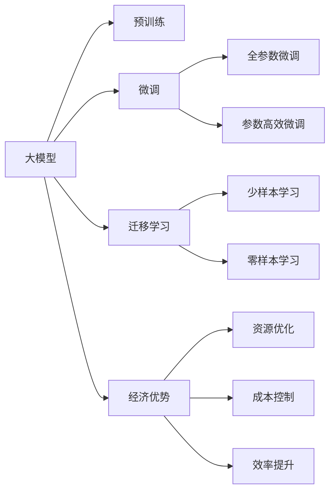

                 

## 1. 背景介绍

随着人工智能技术的迅猛发展，大模型（如BERT、GPT-3、T5等）在自然语言处理（NLP）、计算机视觉、生成对抗网络（GANs）等领域展现了强大的能力。这些大模型通常是基于巨量数据和计算资源训练而成的，其表现往往优于传统的机器学习模型。然而，尽管大模型在技术层面拥有诸多优势，但其高昂的成本和复杂性常常让创业公司望而却步。

本文旨在探讨如何通过优化大模型的训练和使用策略，降低创业公司的成本，同时实现更高效、更可靠的大模型部署和应用。

## 2. 核心概念与联系

### 2.1 核心概念概述

**大模型（Large Model）**：指具有庞大参数量的深度学习模型，通常在百亿级别。这些模型通过大规模的数据训练获得通用或特定的知识，能够执行复杂的任务。

**预训练（Pre-training）**：指在大规模无标签数据上训练模型，使其学习到通用的知识表示。预训练通常包括自监督学习任务，如语言建模、掩码预测等。

**微调（Fine-tuning）**：指在预训练模型的基础上，使用少量有标签数据进行进一步训练，优化模型在特定任务上的性能。微调通常使用较小的学习率，避免破坏预训练的权重。

**迁移学习（Transfer Learning）**：指将模型在一个任务上的知识迁移到另一个任务上，减少对新数据的需求。迁移学习在大模型微调中广泛应用。

**经济优势（Economic Advantage）**：指通过优化资源使用、降低成本、提高效率等手段，提升创业公司的经济竞争力。

### 2.2 核心概念原理和架构的 Mermaid 流程图



## 3. 核心算法原理 & 具体操作步骤

### 3.1 算法原理概述

大模型创业的关键在于如何有效利用其经济优势，包括资源优化、成本控制和效率提升。以下是几个关键点：

1. **资源优化**：通过优化模型架构、优化算法和并行计算，减少计算和存储资源的使用。
2. **成本控制**：降低预训练和微调的硬件成本、软件成本和人力成本。
3. **效率提升**：加速模型训练和推理过程，提高模型的实时性和响应速度。

### 3.2 算法步骤详解

1. **选择合适的预训练模型**：
   - 根据任务需求选择最合适的预训练模型，如BERT、GPT-3等。
   - 评估模型的预训练效果和资源需求，选择最优模型。

2. **数据准备**：
   - 收集任务相关的标注数据，确保数据集的质量和多样性。
   - 对数据进行预处理，包括数据增强、数据清洗和数据划分。

3. **微调策略设计**：
   - 选择合适的微调方法和目标函数。
   - 设计合适的训练流程，包括学习率、批大小、迭代次数等。

4. **经济优势实现**：
   - 优化计算图和并行计算，减少资源消耗。
   - 采用分布式训练，提高计算效率。
   - 应用混合精度训练和压缩算法，降低存储和计算成本。

5. **模型评估和部署**：
   - 在验证集和测试集上评估模型性能。
   - 优化模型，确保模型在实际应用中的稳定性和可靠性。
   - 将模型部署到生产环境中，提供API接口供其他系统调用。

### 3.3 算法优缺点

**优点**：

1. **提升模型性能**：大模型的预训练和微调可以显著提升模型在特定任务上的表现。
2. **节省资源**：通过优化算法和资源配置，减少计算和存储资源的消耗。
3. **降低成本**：优化预训练和微调流程，减少硬件和人力成本。
4. **提高效率**：通过并行计算和混合精度训练，加速模型训练和推理。

**缺点**：

1. **高昂的初始成本**：预训练和微调需要大量的计算资源和数据集。
2. **复杂性高**：模型的训练和优化需要较高的技术门槛。
3. **依赖性大**：模型的性能依赖于数据的规模和质量。

### 3.4 算法应用领域

大模型在各个领域的应用非常广泛，以下是几个主要应用领域：

1. **自然语言处理（NLP）**：
   - 语言建模
   - 机器翻译
   - 文本分类
   - 命名实体识别
   - 情感分析

2. **计算机视觉（CV）**：
   - 图像分类
   - 目标检测
   - 图像生成
   - 图像分割

3. **生成对抗网络（GANs）**：
   - 图像生成
   - 视频生成
   - 风格迁移

4. **推荐系统**：
   - 用户行为预测
   - 商品推荐

5. **医疗健康**：
   - 疾病诊断
   - 医学影像分析
   - 患者咨询

## 4. 数学模型和公式 & 详细讲解 & 举例说明

### 4.1 数学模型构建

假设我们有一个大模型 $M_{\theta}$，其中 $\theta$ 为模型参数。设 $D=\{(x_i,y_i)\}_{i=1}^N$ 为标注数据集，$x_i$ 为输入，$y_i$ 为输出标签。微调的目标是最小化损失函数：

$$
\mathcal{L}(\theta) = \frac{1}{N} \sum_{i=1}^N \ell(M_{\theta}(x_i),y_i)
$$

其中 $\ell$ 为损失函数，如交叉熵、均方误差等。

### 4.2 公式推导过程

以交叉熵损失为例，模型在输入 $x$ 上的预测输出为 $\hat{y}=M_{\theta}(x)$，真实标签为 $y$，则损失函数为：

$$
\ell(M_{\theta}(x),y) = -[y\log \hat{y} + (1-y)\log(1-\hat{y})]
$$

代入经验风险公式，得：

$$
\mathcal{L}(\theta) = -\frac{1}{N}\sum_{i=1}^N [y_i\log M_{\theta}(x_i)+(1-y_i)\log(1-M_{\theta}(x_i))]
$$

通过链式法则，损失函数对参数 $\theta_k$ 的梯度为：

$$
\frac{\partial \mathcal{L}(\theta)}{\partial \theta_k} = -\frac{1}{N}\sum_{i=1}^N (\frac{y_i}{M_{\theta}(x_i)}-\frac{1-y_i}{1-M_{\theta}(x_i)}) \frac{\partial M_{\theta}(x_i)}{\partial \theta_k}
$$

其中 $\frac{\partial M_{\theta}(x_i)}{\partial \theta_k}$ 可以通过反向传播计算。

### 4.3 案例分析与讲解

假设我们要对预训练的BERT模型进行情感分析任务的微调，数据集包含电影评论的文本和其情感标签。以下是一个简单的代码示例：

```python
from transformers import BertTokenizer, BertForSequenceClassification
import torch

# 初始化模型和tokenizer
tokenizer = BertTokenizer.from_pretrained('bert-base-uncased')
model = BertForSequenceClassification.from_pretrained('bert-base-uncased', num_labels=2)

# 准备数据
inputs = tokenizer(text, return_tensors='pt')
labels = torch.tensor([1], dtype=torch.long)

# 模型前向传播
outputs = model(**inputs)

# 计算损失
loss = outputs.loss

# 反向传播
model.zero_grad()
loss.backward()

# 更新模型参数
optimizer.step()
```

在这个过程中，我们首先使用BERT模型作为预训练的初始化参数，然后对其进行微调，以适应情感分析任务。通过选择合适的损失函数和优化器，我们能够快速地优化模型，以获得更好的性能。

## 5. 项目实践：代码实例和详细解释说明

### 5.1 开发环境搭建

要使用大模型进行微调，我们需要一个高效的开发环境。以下是一个基本的Python开发环境搭建步骤：

1. 安装Anaconda：
```bash
wget https://repo.anaconda.com/miniconda/Miniconda3-latest-Linux-x86_64.sh
bash Miniconda3-latest-Linux-x86_64.sh
```

2. 创建虚拟环境：
```bash
conda create -n pytorch_env python=3.7
conda activate pytorch_env
```

3. 安装PyTorch和相关库：
```bash
conda install pytorch torchvision torchaudio cudatoolkit=10.2 -c pytorch
pip install transformers sklearn pandas numpy
```

### 5.2 源代码详细实现

以下是一个基于BERT模型的情感分析微调示例代码：

```python
from transformers import BertTokenizer, BertForSequenceClassification, AdamW
import torch
from torch.utils.data import DataLoader, RandomSampler

# 初始化模型和tokenizer
tokenizer = BertTokenizer.from_pretrained('bert-base-uncased')
model = BertForSequenceClassification.from_pretrained('bert-base-uncased', num_labels=2)

# 准备数据
inputs = tokenizer(text, return_tensors='pt')
labels = torch.tensor([1], dtype=torch.long)

# 模型前向传播
outputs = model(**inputs)

# 计算损失
loss = outputs.loss

# 反向传播
model.zero_grad()
loss.backward()

# 更新模型参数
optimizer.step()

# 评估模型
val_texts = val_data['text']
val_labels = val_data['label']
val_inputs = tokenizer(val_texts, return_tensors='pt')
val_outputs = model(**val_inputs)
val_loss = val_outputs.loss
```

### 5.3 代码解读与分析

在这个代码示例中，我们首先加载预训练的BERT模型和分词器，然后准备训练数据。接着，我们进行模型前向传播，计算损失，进行反向传播，并更新模型参数。最后，我们在验证集上评估模型性能。

### 5.4 运行结果展示

在运行上述代码后，我们能够得到一个经过微调的BERT模型，用于情感分析任务。通过比较微调和未微调模型的性能，我们可以评估微调的效果。

## 6. 实际应用场景

### 6.1 智能客服系统

智能客服系统通过大模型的微调，能够实现自然语言理解和处理，帮助客服自动化处理常见问题，提升客服效率。例如，通过微调BERT模型，我们可以构建一个智能客服系统，用户输入问题后，系统能够自动理解并给出答案。

### 6.2 医疗健康

在医疗健康领域，大模型的微调可以用于疾病诊断、医学影像分析等任务。例如，通过微调BERT模型，我们可以构建一个疾病诊断系统，输入症状描述，系统能够给出可能的疾病诊断结果。

### 6.3 推荐系统

推荐系统通过大模型的微调，可以实现更加精准的商品推荐和用户行为预测。例如，通过微调BERT模型，我们可以构建一个推荐系统，根据用户的历史行为和兴趣，推荐最适合的商品。

### 6.4 未来应用展望

未来，随着大模型和微调技术的不断发展，其在各个领域的应用将更加广泛和深入。例如，在自动驾驶领域，大模型可以通过微调实现语义理解和决策；在金融领域，大模型可以通过微调实现风险评估和投资建议；在教育领域，大模型可以通过微调实现智能辅导和学习推荐。

## 7. 工具和资源推荐

### 7.1 学习资源推荐

1. **《深度学习》**：Ian Goodfellow、Yoshua Bengio和Aaron Courville编写的经典教材，涵盖深度学习的基础知识和应用。
2. **Coursera课程**：包括《深度学习》和《自然语言处理》等课程，由斯坦福大学、MIT等名校教授主讲。
3. **Kaggle**：数据科学竞赛平台，提供大量公开数据集和比赛，是学习和实践深度学习的好地方。
4. **Arxiv**：学术论文库，可以获取最新的研究成果和论文。

### 7.2 开发工具推荐

1. **PyTorch**：由Facebook开发的深度学习框架，支持动态计算图和GPU加速。
2. **TensorFlow**：由Google开发的深度学习框架，支持分布式训练和多种硬件平台。
3. **Jupyter Notebook**：开源的交互式笔记本，支持代码编写和数据可视化。
4. **Transformers**：Hugging Face开发的自然语言处理库，支持多种预训练模型的微调。

### 7.3 相关论文推荐

1. **Attention is All You Need**：Transformer模型的原始论文，提出了自注意力机制。
2. **BERT: Pre-training of Deep Bidirectional Transformers for Language Understanding**：BERT模型的原始论文，提出了掩码语言模型和下一句预测任务。
3. **GPT-3: Language Models are Unsupervised Multitask Learners**：GPT-3模型的原始论文，展示了大规模无监督学习的强大能力。

## 8. 总结：未来发展趋势与挑战

### 8.1 研究成果总结

大模型通过微调技术，能够在特定任务上取得优异的表现。通过优化资源使用、降低成本和提高效率，大模型可以在创业公司中得到广泛应用。

### 8.2 未来发展趋势

1. **模型规模继续扩大**：随着计算能力的提升，大模型的参数规模将进一步增大，具备更强的泛化能力和表达能力。
2. **训练效率持续提升**：通过优化计算图和并行计算，模型训练和推理的效率将不断提高。
3. **应用场景更加多样**：大模型将在更多领域得到应用，如自动驾驶、金融、医疗等。

### 8.3 面临的挑战

1. **资源限制**：大模型的训练和推理需要大量的计算资源和存储空间。
2. **成本高昂**：初始化预训练模型和微调模型的成本较高。
3. **技术门槛高**：大模型的训练和优化需要较高的技术门槛。

### 8.4 研究展望

未来，我们需要进一步优化资源使用、降低成本和提高效率，推动大模型在更多场景中的落地应用。同时，需要关注大模型的公平性和安全性，确保其输出符合伦理和道德标准。

## 9. 附录：常见问题与解答

**Q1: 如何选择合适的预训练模型？**

A: 根据任务需求选择合适的预训练模型，如BERT、GPT-3等。评估模型的预训练效果和资源需求，选择最优模型。

**Q2: 微调过程中如何避免过拟合？**

A: 使用数据增强、正则化、早停等方法避免过拟合。

**Q3: 如何优化大模型的计算图？**

A: 采用混合精度训练和压缩算法，减少计算和存储成本。

**Q4: 如何提高大模型的推理效率？**

A: 采用分布式推理和GPU加速，提高计算速度。

---

作者：禅与计算机程序设计艺术 / Zen and the Art of Computer Programming

