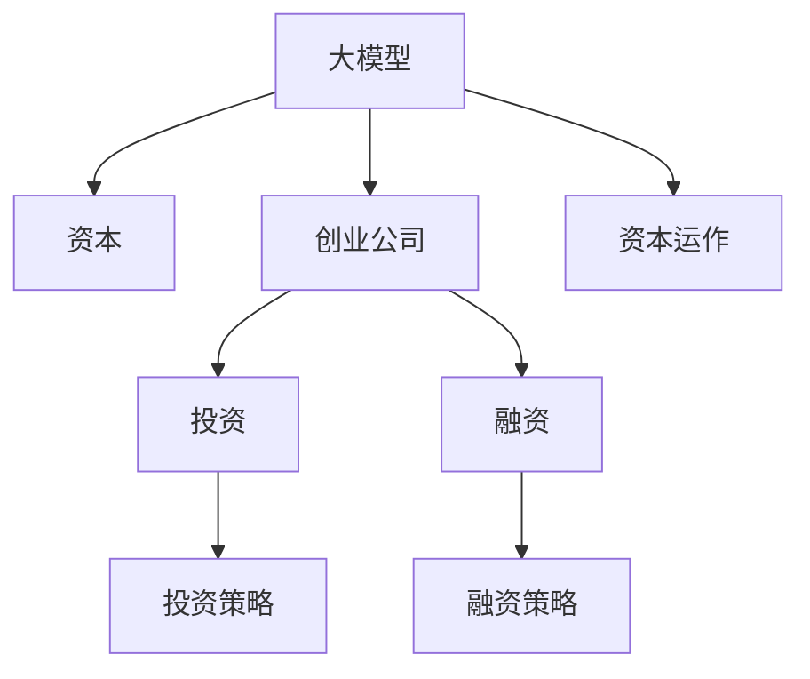

                 

# AI 大模型创业：如何利用资本优势？

> 关键词：人工智能, 创业, 大模型, 资本, 投资, 融资, 策略

## 1. 背景介绍

### 1.1 问题由来
近年来，随着人工智能技术的飞速发展，特别是深度学习和大规模预训练模型在自然语言处理(NLP)、计算机视觉(CV)、语音识别等领域取得了显著进展，催生了一大批具有潜力的创业公司。这些创业公司大多以大模型为技术核心，利用先进的AI技术解决实际问题，提供各种智能化的产品和服务。然而，如何高效利用资本优势，推动公司的持续发展和壮大，成为了许多创业公司面临的共同挑战。

### 1.2 问题核心关键点
资本对于创业公司的重要性不言而喻，尤其是在大模型创业的领域。大模型本身需要大量的数据和计算资源进行预训练和微调，而大规模部署和维护大模型也需要庞大的资金支持。如何通过有效的资本运作策略，最大限度地利用资本优势，是大模型创业公司需要认真思考的问题。

### 1.3 问题研究意义
研究如何利用资本优势进行大模型创业，对于提升公司的发展速度和市场竞争力，推动AI技术的实际应用，具有重要意义：

1. 加速技术迭代。资本可以支持公司的持续研发投入，加速技术的快速迭代，保持技术领先优势。
2. 提升品牌影响力。足够的资本可以提升公司的品牌形象和市场认可度，吸引更多的客户和用户。
3. 扩大市场份额。通过并购、投资等资本运作手段，可以快速扩展业务范围和市场份额，增强公司的竞争力。
4. 降低运营风险。充足的资本可以保障公司的日常运营，降低资金短缺带来的风险。
5. 拓展应用场景。资本支持下的技术创新，可以应用于更多领域，提升公司的市场适应性和应用广度。

## 2. 核心概念与联系

### 2.1 核心概念概述

为更好地理解如何利用资本优势进行大模型创业，本节将介绍几个密切相关的核心概念：

- **大模型（Large Model）**：指具有大规模参数量（通常超过十亿）的深度学习模型，用于从大规模无标签数据中进行预训练，并在特定任务上通过微调进行优化，以实现高性能的通用或专用能力。
- **资本（Capital）**：指公司运营和发展所需的财务资源，包括但不限于种子轮、天使轮、A轮、B轮、C轮等各阶段的融资，以及公司自身积累的资金。
- **创业公司（Startup）**：指初创阶段的公司，通常专注于某一项技术或业务，尚未实现大规模盈利。
- **投资（Investment）**：指投资者向公司投入资金，以换取公司股权或债券，获得公司增值收益的行为。
- **融资（Funding）**：指公司通过发行股票、债券等方式获取资金，以支持公司的运营和发展。
- **融资策略（Funding Strategy）**：指公司根据自身发展阶段和市场环境，选择不同的融资方式和时机，进行资本运作的策略。
- **资本运作（Capital Operation）**：指公司通过资本的合理运用，实现公司资产的增值和业务规模的扩张。

这些核心概念之间的逻辑关系可以通过以下Mermaid流程图来展示：



这个流程图展示了大模型、创业公司、资本和投资、融资、融资策略、资本运作等概念之间的联系和运作逻辑：

1. 大模型是创业公司的技术核心。
2. 资本是创业公司发展的财务支撑。
3. 投资和融资是公司获取资本的两种主要方式。
4. 投资策略和融资策略是公司资本运作的重要指导。
5. 资本运作是大模型创业公司实现业务扩张的关键。

## 3. 核心算法原理 & 具体操作步骤
### 3.1 算法原理概述

在大模型创业中，如何有效利用资本优势，是一个多层次、多维度的系统性问题。核心在于将资本优势转化为公司的技术优势、市场优势和运营优势，从而实现公司的快速发展和市场领先。

### 3.2 算法步骤详解

基于上述概念，大模型创业公司在利用资本优势时，可以遵循以下步骤：

**Step 1: 确定资本需求**

- **分析市场规模**：评估目标市场的大小和增长潜力，确定公司的市场目标。
- **预估运营成本**：估算公司在不同发展阶段的运营成本，包括技术研发、数据采集、基础设施、市场营销等。
- **确定融资目标**：基于市场规模和运营成本，制定合理的融资目标，包括各轮次融资的金额和时间计划。

**Step 2: 制定融资策略**

- **选择合适的融资方式**：根据公司的发展阶段和市场环境，选择合适的融资方式，如天使投资、风险投资、公开发行等。
- **确定投资者目标**：明确公司需要投资者的什么资源，是资金、技术、市场还是行业经验等。
- **制定融资计划**：制定详细的融资计划，包括融资轮次、时间节点、预期投资回报等。

**Step 3: 实施融资行动**

- **准备融资材料**：准备公司的商业计划书、财务报表、市场分析、技术资料等，充分展示公司的价值和潜力。
- **进行路演和谈判**：参加投资方的路演和谈判，详细介绍公司的业务模式、市场前景、团队优势等。
- **签署投资协议**：与投资方达成投资意向，签署投资协议，明确双方的权利和义务。

**Step 4: 资本运作**

- **技术投资**：使用部分融资用于技术研发，提升模型的精度、可解释性、性能等。
- **数据投资**：投资于大规模数据采集和清洗，扩展数据规模和质量。
- **市场拓展**：利用资本进行市场推广和品牌建设，提升公司的市场认知度和影响力。
- **并购合作**：通过收购或合作的方式，扩展公司的业务范围和市场份额。
- **技术创新**：支持公司的技术创新和产品迭代，保持公司的技术领先性。

### 3.3 算法优缺点

利用资本优势进行大模型创业，具有以下优点：

1. **加速技术研发**：资本可以支持公司进行大规模的研发投入，加速模型的训练和优化。
2. **提升市场竞争力**：充足的资本可以提升公司的品牌形象和市场影响力，吸引更多的客户和用户。
3. **降低运营风险**：资本保障公司的日常运营，降低资金短缺带来的风险。
4. **扩大市场份额**：通过并购、投资等资本运作手段，快速扩展业务范围和市场份额。

然而，这种方法也存在一些缺点：

1. **资本依赖性强**：大模型创业公司对资本的依赖性强，一旦融资受阻，可能会影响公司的正常运营和发展。
2. **资金使用效率**：资本运作需要精细化的管理，避免资金浪费和投资风险。
3. **市场不确定性**：市场环境和技术发展的不确定性，可能导致资本运作的风险。
4. **法律和伦理风险**：资本运作需要遵守法律法规，避免潜在的法律和伦理风险。

### 3.4 算法应用领域

大模型创业公司在利用资本优势时，可以应用于以下多个领域：

- **技术研发**：用于模型的预训练和微调，提升模型的精度和性能。
- **数据采集**：投资于大规模数据采集和清洗，扩展数据规模和质量。
- **市场推广**：利用资本进行市场推广和品牌建设，提升公司的市场认知度和影响力。
- **并购合作**：通过收购或合作的方式，扩展公司的业务范围和市场份额。
- **技术创新**：支持公司的技术创新和产品迭代，保持公司的技术领先性。

## 4. 数学模型和公式 & 详细讲解  
### 4.1 数学模型构建

在大模型创业的资本运作过程中，可以构建以下数学模型来描述公司资本的投入和产出：

设公司初始资本为 $C_0$，各轮次融资金额分别为 $I_1, I_2, \ldots, I_n$，各轮次投资回报率分别为 $r_1, r_2, \ldots, r_n$，公司在第 $t$ 轮次后的总资本为 $C_t$。则有：

$$
C_t = C_0 + I_1 + I_2 + \ldots + I_n - (C_0 + I_1 + I_2 + \ldots + I_t) \sum_{k=1}^t r_k
$$

其中，$\sum_{k=1}^t r_k$ 表示公司所有融资投资在各轮次后的累计回报。

### 4.2 公式推导过程

假设公司每轮次融资金额 $I_k$ 相等，各轮次投资回报率 $r_k$ 也相等，记为 $r$。则有：

$$
C_t = C_0 + nI - (C_0 + (t-1)I) \sum_{k=1}^{t-1} r
$$

化简得：

$$
C_t = (1 - r^{t-1})C_0 + (1 - r^t)nI
$$

从公式可以看出，公司资本的增长主要受两个因素影响：

1. **初始资本**：初始资本 $C_0$ 越大，公司资本的增长潜力也越大。
2. **投资回报率**：投资回报率 $r$ 越高，公司资本的增长速度也越快。

### 4.3 案例分析与讲解

以 OpenAI 公司为例，分析其利用资本优势的策略：

1. **初始资本**：OpenAI 在早期依靠 Y Combinator 的种子轮和 AngelList 的天使投资，获取了初期资本 $C_0$。
2. **融资策略**：OpenAI 通过多轮风险投资，逐步获取了更多的资本 $I$。
3. **资本运作**：OpenAI 在技术研发、数据采集、市场推广等方面进行了大量投资，并进行了多次并购，扩大了公司的业务范围和市场影响力。
4. **投资回报**：OpenAI 通过其技术的广泛应用，取得了较高的市场占有率和投资回报率 $r$。

## 5. 项目实践：代码实例和详细解释说明
### 5.1 开发环境搭建

在进行大模型创业的资本运作分析时，我们需要准备好开发环境。以下是使用Python进行数据分析的环境配置流程：

1. 安装Anaconda：从官网下载并安装Anaconda，用于创建独立的Python环境。

2. 创建并激活虚拟环境：
```bash
conda create -n capital-env python=3.8 
conda activate capital-env
```

3. 安装相关库：
```bash
pip install numpy pandas scipy sympy
```

完成上述步骤后，即可在`capital-env`环境中开始资本运作的分析工作。

### 5.2 源代码详细实现

下面以一个简单的资本运作模型为例，给出使用Python进行资本运作分析的代码实现。

```python
import numpy as np

# 定义各轮次融资金额和回报率
n = 5
I = 100
r = 0.2

# 计算第t轮次后的总资本
def calculate_capital(t):
    return (1 - r**t) * n * I

# 测试不同轮次后的资本
for t in range(1, n+1):
    capital = calculate_capital(t)
    print(f"第{t}轮次后的总资本：{capital}")
```

### 5.3 代码解读与分析

让我们再详细解读一下关键代码的实现细节：

**calculate_capital函数**：
- 定义了一个计算公司总资本的函数，输入为轮次 $t$，返回第 $t$ 轮次后的总资本 $C_t$。
- 使用公式 $C_t = (1 - r^{t-1})C_0 + (1 - r^t)nI$ 进行计算，其中 $C_0$ 为初始资本，$I$ 为各轮次融资金额，$r$ 为投资回报率。

**测试不同轮次后的资本**：
- 使用一个循环，遍历1到5轮次，计算并打印每个轮次后的总资本。

可以看到，这个简单的代码示例展示了如何使用Python进行资本运作分析。实际应用中，根据公司具体的情况和需求，可能需要更复杂的模型和算法，但基本的思路和方法是一样的。

## 6. 实际应用场景
### 6.1 智能医疗

在智能医疗领域，大模型创业公司可以利用资本优势，进行大规模医疗数据的采集和清洗，提升模型的精度和性能。例如，利用资本进行多中心数据采集，投资于医疗图像、电子病历等数据，构建高质量的医疗大模型，用于疾病预测、诊断辅助、治疗方案推荐等。

### 6.2 自动驾驶

在自动驾驶领域，大模型创业公司可以利用资本优势，进行大规模路测数据的采集和处理，提升模型的感知和决策能力。例如，利用资本进行车路协同数据采集，投资于高精度地图、传感器数据等，构建高性能的自动驾驶大模型，用于路径规划、交通避障、安全监控等。

### 6.3 金融科技

在金融科技领域，大模型创业公司可以利用资本优势，进行大规模金融数据的采集和分析，提升模型的风险预测和投资决策能力。例如，利用资本进行金融市场数据的采集，投资于自然语言处理、时间序列分析等技术，构建高精度的金融科技大模型，用于风险评估、智能投顾、反欺诈检测等。

### 6.4 未来应用展望

随着人工智能技术的不断进步，大模型创业公司可以利用资本优势，拓展更多应用场景，推动技术的实际应用：

1. **智慧城市**：利用资本进行城市数据的采集和分析，构建智慧城市大模型，用于交通管理、环境监测、公共安全等。
2. **教育科技**：利用资本进行教育数据的采集和处理，构建教育科技大模型，用于个性化学习、智能评估、教育辅助等。
3. **工业互联网**：利用资本进行工业数据的采集和分析，构建工业互联网大模型，用于设备监控、预测维护、智能制造等。
4. **农业科技**：利用资本进行农业数据的采集和处理，构建农业科技大模型，用于作物识别、病虫害预测、精准农业等。

## 7. 工具和资源推荐
### 7.1 学习资源推荐

为了帮助开发者系统掌握大模型创业的资本运作理论基础和实践技巧，这里推荐一些优质的学习资源：

1. **《创业资本运作》系列博文**：由大模型创业领域的专家撰写，深入浅出地介绍了资本运作的基本概念、策略和案例。
2. **CS356《创业与创新》课程**：斯坦福大学开设的创业管理课程，有Lecture视频和配套作业，带你了解创业的基本原理和资本运作技巧。
3. **《创业投资管理》书籍**：知名创业投资专家所著，全面介绍了创业投资的基本概念、流程和策略，适合创业者系统学习。
4. **Crunchbase**：创业投资领域的权威数据平台，提供大量创业公司、投资机构、融资信息等，是了解资本运作的重要资源。

通过对这些资源的学习实践，相信你一定能够快速掌握大模型创业的资本运作精髓，并用于解决实际的资本运作问题。

### 7.2 开发工具推荐

高效的资本运作分析离不开优秀的工具支持。以下是几款用于资本运作分析开发的常用工具：

1. **Excel**：微软办公软件，提供强大的数据分析和可视化功能，适合制作资本运作的财务报表和图表。
2. **Tableau**：数据可视化工具，支持复杂的数据分析和报表生成，适合进行详细的资本运作分析。
3. **Power BI**：微软的商业智能工具，支持实时数据更新和报表展示，适合进行动态资本运作分析。
4. **Python**：开源编程语言，提供丰富的数据分析和计算库，适合进行复杂的资本运作模型开发。

合理利用这些工具，可以显著提升资本运作分析的效率和准确性，加快创新迭代的步伐。

### 7.3 相关论文推荐

大模型创业公司可以利用资本优势进行资本运作研究，以下是几篇奠基性的相关论文，推荐阅读：

1. **《资本运作的财务分析》**：介绍了资本运作的财务分析方法，包括资本结构、财务杠杆、投资回报率等。
2. **《创业融资的策略与实践》**：分析了不同融资阶段和融资方式的优缺点，提供了详细的融资策略建议。
3. **《人工智能初创公司的资本运作》**：探讨了大模型创业公司如何利用资本优势进行技术研发、数据采集和市场推广。
4. **《风险投资与创业公司》**：分析了风险投资对大模型创业公司的影响，探讨了如何建立良好的投融资关系。

这些论文代表了大模型创业公司资本运作的发展脉络。通过学习这些前沿成果，可以帮助研究者把握学科前进方向，激发更多的创新灵感。

## 8. 总结：未来发展趋势与挑战
### 8.1 研究成果总结

本文对大模型创业公司如何利用资本优势进行了系统介绍。首先阐述了资本在大模型创业中的重要性，明确了资本运作在大模型创业中的关键作用。其次，从理论到实践，详细讲解了大模型创业公司资本运作的基本步骤和方法，给出了资本运作的数学模型和公式，并进行了案例分析。最后，本文还探讨了资本运作在大模型创业中的应用场景，并推荐了相关学习资源和工具。

通过本文的系统梳理，可以看到，大模型创业公司可以通过有效的资本运作策略，最大限度地利用资本优势，加速技术研发、提升市场竞争力、降低运营风险、扩大市场份额。未来，伴随资本运作的持续优化和创新，大模型创业公司必将在更多领域实现突破，推动AI技术的实际应用。

### 8.2 未来发展趋势

展望未来，大模型创业公司的资本运作将呈现以下几个发展趋势：

1. **数字化与智能化**：利用大数据和人工智能技术，提升资本运作的效率和精准性，实现智能化的资本管理。
2. **全球化与本土化**：结合全球资本市场和本土市场需求，进行跨区域的资本运作，拓展公司的国际影响力。
3. **多层次与多渠道**：综合运用股权、债权、公开发行等多种融资方式，多元化获取资本，降低资本运作风险。
4. **技术驱动与市场导向**：将技术研发和市场推广相结合，推动公司实现技术创新和市场拓展的双重目标。
5. **生态建设与合作共赢**：构建良好的投融资生态，与各类投资者、合作伙伴建立互利共赢的合作关系，共同推动公司的成长。

这些趋势将推动大模型创业公司向更高水平发展，实现更大规模的创新和突破。

### 8.3 面临的挑战

尽管大模型创业公司可以利用资本优势进行资本运作，但在实现过程中仍面临诸多挑战：

1. **资本市场波动**：资本市场的波动性可能对公司的资本运作产生负面影响，需要进行风险控制。
2. **融资成本高**：获取资本的成本较高，需要合理的资本运作策略进行成本控制。
3. **信息不对称**：投资者与公司之间的信息不对称可能导致资本运作的误解和信任危机。
4. **法律和监管风险**：资本运作需要遵守法律法规，避免潜在的法律和监管风险。
5. **技术风险**：大模型创业公司的高风险性可能导致资本运作的失败。

### 8.4 研究展望

为了应对这些挑战，大模型创业公司需要在以下方面进行深入研究：

1. **资本市场研究**：研究资本市场的趋势和规律，制定科学的资本运作策略，降低资本市场波动带来的风险。
2. **融资成本控制**：研究不同的融资方式和融资成本，制定合理的资本运作方案，降低融资成本。
3. **信息披露与透明度**：建立透明的信息披露机制，增强投资者与公司之间的信任和合作。
4. **法律合规与风险管理**：研究法律法规和监管要求，建立健全的法律合规和风险管理机制。
5. **技术创新与市场拓展**：持续推动技术创新和市场拓展，提升公司的市场竞争力和创新能力。

只有不断优化和创新资本运作策略，大模型创业公司才能在激烈的市场竞争中脱颖而出，实现持续发展。

## 9. 附录：常见问题与解答
### Q1: 大模型创业公司如何选择合适的融资方式？

A: 大模型创业公司应根据自身的发展阶段、市场环境和融资需求，选择合适的融资方式。通常情况下，种子轮和天使轮适合获取初期的启动资金，风险投资适合中期发展，公开发行适合大规模扩展。同时，可以根据投资者的背景和资源，选择与其进行战略合作的投资者。

### Q2: 大模型创业公司如何管理资本运作的风险？

A: 大模型创业公司可以通过以下方式管理资本运作的风险：
1. 制定科学的融资计划和资本运作策略，避免过度的资本投入和浪费。
2. 建立透明的信息披露机制，增强投资者与公司之间的信任和合作。
3. 研究市场趋势和法律法规，避免潜在的法律和监管风险。
4. 进行风险控制和资本配置优化，降低资本运作的波动性。

### Q3: 大模型创业公司如何利用资本优势进行技术研发？

A: 大模型创业公司可以通过以下方式利用资本优势进行技术研发：
1. 投资于大规模数据采集和清洗，提升模型的精度和性能。
2. 进行技术研发和产品迭代的资金支持，推动模型的快速迭代和优化。
3. 引入高水平的技术团队和科研人员，提升公司的技术创新能力。

### Q4: 大模型创业公司如何扩展市场份额？

A: 大模型创业公司可以通过以下方式扩展市场份额：
1. 进行市场推广和品牌建设，提升公司的市场认知度和影响力。
2. 通过并购或合作的方式，快速扩展业务范围和市场份额。
3. 提供高质量的产品和服务，满足客户需求，提升客户满意度。

### Q5: 大模型创业公司如何构建良好的投融资生态？

A: 大模型创业公司可以通过以下方式构建良好的投融资生态：
1. 建立透明的信息披露机制，增强投资者与公司之间的信任和合作。
2. 与各类投资者、合作伙伴建立互利共赢的合作关系，共同推动公司的成长。
3. 研究市场趋势和法律法规，避免潜在的法律和监管风险。

作者：禅与计算机程序设计艺术 / Zen and the Art of Computer Programming

