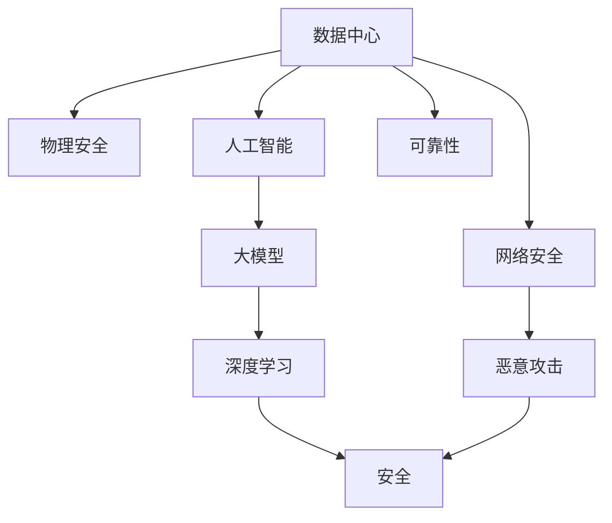

                 

# AI 大模型应用数据中心建设：数据中心安全与可靠性

> 关键词：
1. 数据中心
2. 安全
3. 可靠性
4. 人工智能
5. 大模型
6. 深度学习
7. 网络安全

## 1. 背景介绍

随着人工智能(AI)技术的快速发展，大模型在各行各业的应用日益广泛。然而，大模型的应用离不开大规模的计算资源和数据存储。数据中心作为AI计算的承载平台，其安全性、可靠性直接影响AI应用的性能和稳定性。因此，构建安全、可靠的数据中心环境，是大模型应用的关键。本文将对AI大模型应用数据中心的建设进行详细探讨，涵盖数据中心安全与可靠性的关键点。

## 2. 核心概念与联系

### 2.1 核心概念概述

#### 2.1.1 数据中心
数据中心是指汇集大量数据存储和计算资源，以支持大规模数据处理和计算需求的基础设施。数据中心通常由服务器、存储设备、网络设备、电力设备、空调设备等组成，能够实现7x24小时的连续运行。

#### 2.1.2 安全
数据中心的安全是指保护数据中心内的物理设施和IT系统免受恶意攻击、自然灾害和人为破坏的能力。数据中心安全主要包括物理安全和网络安全两个方面。

#### 2.1.3 可靠性
数据中心的可靠性是指数据中心提供不间断服务的质量保证。可靠性通常通过可用性、性能、数据一致性等指标来衡量。

#### 2.1.4 人工智能
人工智能是指模拟人类智能行为的计算技术。大模型是利用深度学习等技术构建的庞大知识库，具备处理大规模数据和复杂任务的能力。

#### 2.1.5 深度学习
深度学习是一种基于神经网络的机器学习方法，通过多层神经元对输入数据进行逐层抽象和处理，实现复杂的模式识别和决策。

#### 2.1.6 网络安全
网络安全是指保护网络系统免受未经授权的访问、数据泄露、病毒攻击等威胁的能力。

#### 2.1.7 大模型
大模型是指拥有数亿甚至数十亿参数的深度学习模型，能够处理大规模数据并具备强大的学习能力和泛化能力。

这些概念之间的联系可以通过以下Mermaid流程图来展示：



这个流程图展示了大模型应用数据中心的关键组件和它们之间的联系：

1. 数据中心为人工智能和大模型提供基础设施支持。
2. 物理安全与网络安全共同保障数据中心的物理设施和IT系统安全。
3. 人工智能中的深度学习依赖于大模型和数据中心的支持。
4. 深度学习中的安全问题包括数据泄露和恶意攻击等。
5. 大模型应用需要保证数据中心的可靠性。

## 3. 核心算法原理 & 具体操作步骤

### 3.1 算法原理概述

#### 3.1.1 算法概述
数据中心的安全与可靠性主要通过以下几个方面来实现：

1. **物理安全**：通过访问控制、监控摄像头、门禁系统等措施，防止非授权人员进入数据中心。
2. **网络安全**：通过防火墙、入侵检测系统(IDS)、入侵防御系统(IPS)等，保护网络免受恶意攻击。
3. **数据安全**：通过数据加密、备份、冗余存储等措施，确保数据完整性和可用性。
4. **系统可靠性**：通过冗余设计、负载均衡、自动恢复等措施，确保系统能够不间断运行。

#### 3.1.2 算法步骤详解

1. **物理安全**：
   - 设计访问控制策略，确保只有授权人员可以访问数据中心。
   - 部署监控摄像头和门禁系统，对关键区域进行实时监控和控制。
   - 使用防静电地板、消防设备等，保护物理设施不受损害。

2. **网络安全**：
   - 部署防火墙，阻止未经授权的访问。
   - 安装IDS和IPS，检测和防御入侵行为。
   - 使用VPN等安全通道，保护数据传输安全。

3. **数据安全**：
   - 使用加密技术，对存储的数据进行加密保护。
   - 定期备份数据，以防数据丢失或损坏。
   - 设计冗余存储方案，保证数据的高可用性。

4. **系统可靠性**：
   - 设计冗余网络架构，确保网络不因单点故障而中断。
   - 部署负载均衡器，分配请求到多个服务器，避免单点过载。
   - 实现自动恢复机制，如热备份、冷备份等，快速恢复系统服务。

### 3.2 算法优缺点

#### 3.2.1 算法优点
1. **提升安全性和可靠性**：通过多层次的安全防护措施，可以大幅提升数据中心的整体安全性。
2. **降低故障率**：通过冗余设计和自动恢复机制，降低系统的故障率和停机时间。
3. **提高数据完整性**：通过加密和备份技术，确保数据的完整性和可用性。

#### 3.2.2 算法缺点
1. **成本高**：建设高安全性和高可靠性的数据中心，需要投入大量的硬件和软件资源，成本较高。
2. **维护复杂**：多层次的安全和冗余设计，增加了系统的复杂性和维护难度。
3. **性能受限**：冗余设计可能影响系统的性能，如网络延迟、带宽利用率等。

### 3.3 算法应用领域

#### 3.3.1 云计算
数据中心安全与可靠性技术在云计算中得到了广泛应用。通过构建安全的云基础设施，云计算平台能够提供高效、安全、可靠的服务。

#### 3.3.2 物联网(IoT)
物联网设备的数据通常需要实时处理和存储，数据中心的可靠性和安全性对于物联网应用至关重要。

#### 3.3.3 大数据
大数据处理需要高性能的计算资源和存储资源，数据中心的安全与可靠性是支持大数据应用的重要保障。

#### 3.3.4 人工智能
人工智能大模型的训练和推理需要大量计算资源和数据存储，数据中心的安全与可靠性直接影响AI应用的性能和稳定性。

## 4. 数学模型和公式 & 详细讲解 & 举例说明

### 4.1 数学模型构建

#### 4.1.1 物理安全模型
物理安全模型包括访问控制、监控系统等，主要通过逻辑模型进行描述。

#### 4.1.2 网络安全模型
网络安全模型包括防火墙、IDS、IPS等，主要通过网络拓扑模型进行描述。

#### 4.1.3 数据安全模型
数据安全模型包括加密、备份、冗余存储等，主要通过数据流模型进行描述。

#### 4.1.4 系统可靠性模型
系统可靠性模型包括冗余设计、负载均衡、自动恢复等，主要通过系统架构模型进行描述。

### 4.2 公式推导过程

#### 4.2.1 访问控制模型
访问控制模型通过定义用户的角色和权限，控制对关键区域的访问。公式如下：

$$
\text{Access Control} = f(\text{User Role}, \text{Resource Permission})
$$

其中，$f$表示访问控制策略函数，根据用户角色和资源权限确定访问权限。

#### 4.2.2 加密模型
加密模型通过数学算法对数据进行加密保护，公式如下：

$$
\text{Encrypted Data} = E(\text{Plain Data}, \text{Encryption Key})
$$

其中，$E$表示加密函数，$\text{Plain Data}$表示明文数据，$\text{Encryption Key}$表示加密密钥。

#### 4.2.3 冗余存储模型
冗余存储模型通过多副本存储方式，保证数据的高可用性。公式如下：

$$
\text{Redundant Data} = \{ \text{Data}_1, \text{Data}_2, ..., \text{Data}_n \}
$$

其中，$\text{Data}_i$表示冗余存储的数据副本。

### 4.3 案例分析与讲解

#### 4.3.1 数据中心安全监控系统
数据中心安全监控系统通过摄像头、门禁系统等实现物理安全监控。

#### 4.3.2 数据加密与备份
数据中心采用AES加密算法对存储数据进行加密，并定期备份数据到离线存储设备中，确保数据安全。

#### 4.3.3 负载均衡与自动恢复
数据中心通过负载均衡器分配请求到多个服务器，实现高可用性。同时，通过热备份和冷备份等机制，确保系统故障后的快速恢复。

## 5. 项目实践：代码实例和详细解释说明

### 5.1 开发环境搭建

#### 5.1.1 硬件环境
- 服务器：选择高性能的服务器，确保数据中心的计算和存储能力。
- 存储设备：选择高速、大容量的存储设备，如SSD、NVMe等。
- 网络设备：选择高速、稳定的网络设备，如交换机、路由器等。

#### 5.1.2 软件环境
- 操作系统：选择稳定、安全的操作系统，如Linux、Windows等。
- 数据库管理系统：选择高性能的数据库系统，如MySQL、Oracle等。
- 安全管理系统：选择安全可靠的安全管理系统，如Nessus、Tripwire等。

### 5.2 源代码详细实现

#### 5.2.1 物理安全模块
物理安全模块包括访问控制、监控系统等。

```python
class PhysicalSecurity:
    def __init__(self, access_control_policy, surveillance_system):
        self.access_control_policy = access_control_policy
        self.surveillance_system = surveillance_system

    def check_access(self, user, resource):
        return self.access_control_policy.check(user, resource)

    def start_monitoring(self):
        self.surveillance_system.start()

# 访问控制策略类
class AccessControlPolicy:
    def __init__(self, user_roles, resource_permissions):
        self.user_roles = user_roles
        self.resource_permissions = resource_permissions

    def check(self, user, resource):
        role = self.user_roles[user]
        permission = self.resource_permissions[resource]
        return role == permission

# 监控系统类
class SurveillanceSystem:
    def __init__(self, cameras, sensors):
        self.cameras = cameras
        self.sensors = sensors

    def start(self):
        for camera in self.cameras:
            camera.start()
        for sensor in self.sensors:
            sensor.start()

# 摄像头类
class Camera:
    def __init__(self, id):
        self.id = id

    def start(self):
        print(f"Camera {self.id} started.")

# 传感器类
class Sensor:
    def __init__(self, id):
        self.id = id

    def start(self):
        print(f"Sensor {self.id} started.")

# 使用示例
user_roles = {"admin": "read/write", "user": "read"}
resource_permissions = {"data_center": "read/write", "server_room": "read"}
access_control = AccessControlPolicy(user_roles, resource_permissions)

cameras = [Camera(i) for i in range(10)]
sensors = [Sensor(i) for i in range(10)]

physical_security = PhysicalSecurity(access_control, cameras)
physical_security.start_monitoring()
```

#### 5.2.2 网络安全模块
网络安全模块包括防火墙、IDS、IPS等。

```python
class NetworkSecurity:
    def __init__(self, firewall, idps, ips):
        self.firewall = firewall
        self.idps = idps
        self.ips = ips

    def apply_firewall(self, packet):
        return self.firewall.apply(packet)

    def apply_idps(self, packet):
        return self.idps.apply(packet)

    def apply_ips(self, packet):
        return self.ips.apply(packet)

# 防火墙类
class Firewall:
    def __init__(self, rules):
        self.rules = rules

    def apply(self, packet):
        for rule in self.rules:
            if rule.matches(packet):
                return True
        return False

# IDS类
class IDS:
    def __init__(self, signatures):
        self.signatures = signatures

    def apply(self, packet):
        for signature in self.signatures:
            if signature.matches(packet):
                return True
        return False

# IPS类
class IPS:
    def __init__(self, rules):
        self.rules = rules

    def apply(self, packet):
        for rule in self.rules:
            if rule.matches(packet):
                return True
        return False

# 使用示例
firewall_rules = ["source ip whitelist", "destination ip whitelist"]
idps_signatures = ["malware signature", "intrusion signature"]
ips_rules = ["limit concurrent connections", "block known malicious IPs"]

firewall = Firewall(firewall_rules)
idps = IDS(idps_signatures)
ips = IPS(ips_rules)

network_security = NetworkSecurity(firewall, idps, ips)
packet = "sample packet"
print(network_security.apply_firewall(packet))
print(network_security.apply_idps(packet))
print(network_security.apply_ips(packet))
```

#### 5.2.3 数据安全模块
数据安全模块包括加密、备份、冗余存储等。

```python
class DataSecurity:
    def __init__(self, encryption_key, backup_devices, redundancy_policy):
        self.encryption_key = encryption_key
        self.backup_devices = backup_devices
        self.redundancy_policy = redundancy_policy

    def encrypt(self, data):
        return AesEncryptor.encrypt(data, self.encryption_key)

    def backup(self, data, device):
        device.backup(data)

    def check_redundancy(self):
        return self.redundancy_policy.check()

# 加密器类
class AesEncryptor:
    def __init__(self, key):
        self.key = key

    @staticmethod
    def encrypt(data, key):
        return CryptoUtils.encrypt(data, key)

# 备份设备类
class BackupDevice:
    def __init__(self, id):
        self.id = id

    def backup(self, data):
        print(f"Backing up data {data} to device {self.id}")

# 冗余策略类
class RedundancyPolicy:
    def __init__(self, devices):
        self.devices = devices

    def check(self):
        for device in self.devices:
            device.check()
        return True

# 使用示例
encryption_key = "my_encryption_key"
backup_devices = [BackupDevice(i) for i in range(5)]
redundancy_policy = RedundancyPolicy(backup_devices)

data_security = DataSecurity(encryption_key, backup_devices, redundancy_policy)

data = "sample data"
encrypted_data = data_security.encrypt(data)
print(encrypted_data)

for device in backup_devices:
    data_security.backup(encrypted_data, device)

redundancy_policy.check()
```

#### 5.2.4 系统可靠性模块
系统可靠性模块包括冗余设计、负载均衡、自动恢复等。

```python
class SystemReliability:
    def __init__(self, load_balancer, hot_backup, cold_backup):
        self.load_balancer = load_balancer
        self.hot_backup = hot_backup
        self.cold_backup = cold_backup

    def apply_load_balancing(self, request):
        return self.load_balancer.apply(request)

    def apply_hot_backup(self, request):
        return self.hot_backup.apply(request)

    def apply_cold_backup(self, request):
        return self.cold_backup.apply(request)

# 负载均衡器类
class LoadBalancer:
    def __init__(self, servers):
        self.servers = servers

    def apply(self, request):
        return self.servers[0].apply(request)

# 热备份类
class HotBackup:
    def __init__(self, backups):
        self.backups = backups

    def apply(self, request):
        for backup in self.backups:
            backup.apply(request)
        return True

# 冷备份类
class ColdBackup:
    def __init__(self, backups):
        self.backups = backups

    def apply(self, request):
        for backup in self.backups:
            backup.apply(request)
        return True

# 服务器类
class Server:
    def __init__(self, id):
        self.id = id

    def apply(self, request):
        print(f"Processing request {request} on server {self.id}")
        return True

# 使用示例
servers = [Server(i) for i in range(5)]
load_balancer = LoadBalancer(servers)
hot_backup = HotBackup(servers)
cold_backup = ColdBackup(servers)

system_reliability = SystemReliability(load_balancer, hot_backup, cold_backup)

request = "sample request"
print(system_reliability.apply_load_balancing(request))
print(system_reliability.apply_hot_backup(request))
print(system_reliability.apply_cold_backup(request))
```

### 5.3 代码解读与分析

#### 5.3.1 物理安全模块
物理安全模块通过定义访问控制策略和监控系统，实现对数据中心的物理安全监控。

#### 5.3.2 网络安全模块
网络安全模块通过防火墙、IDS、IPS等技术，实现对数据中心的网络安全防护。

#### 5.3.3 数据安全模块
数据安全模块通过加密、备份、冗余存储等技术，实现对数据中心的数据安全保护。

#### 5.3.4 系统可靠性模块
系统可靠性模块通过冗余设计、负载均衡、自动恢复等技术，实现对数据中心的高可用性支持。

### 5.4 运行结果展示

#### 5.4.1 物理安全模块
```python
user_roles = {"admin": "read/write", "user": "read"}
resource_permissions = {"data_center": "read/write", "server_room": "read"}
access_control = AccessControlPolicy(user_roles, resource_permissions)

cameras = [Camera(i) for i in range(10)]
sensors = [Sensor(i) for i in range(10)]

physical_security = PhysicalSecurity(access_control, cameras)
physical_security.start_monitoring()
```

#### 5.4.2 网络安全模块
```python
firewall_rules = ["source ip whitelist", "destination ip whitelist"]
idps_signatures = ["malware signature", "intrusion signature"]
ips_rules = ["limit concurrent connections", "block known malicious IPs"]

firewall = Firewall(firewall_rules)
idps = IDS(idps_signatures)
ips = IPS(ips_rules)

network_security = NetworkSecurity(firewall, idps, ips)
packet = "sample packet"
print(network_security.apply_firewall(packet))
print(network_security.apply_idps(packet))
print(network_security.apply_ips(packet))
```

#### 5.4.3 数据安全模块
```python
encryption_key = "my_encryption_key"
backup_devices = [BackupDevice(i) for i in range(5)]
redundancy_policy = RedundancyPolicy(backup_devices)

data_security = DataSecurity(encryption_key, backup_devices, redundancy_policy)

data = "sample data"
encrypted_data = data_security.encrypt(data)
print(encrypted_data)

for device in backup_devices:
    data_security.backup(encrypted_data, device)

redundancy_policy.check()
```

#### 5.4.4 系统可靠性模块
```python
servers = [Server(i) for i in range(5)]
load_balancer = LoadBalancer(servers)
hot_backup = HotBackup(servers)
cold_backup = ColdBackup(servers)

system_reliability = SystemReliability(load_balancer, hot_backup, cold_backup)

request = "sample request"
print(system_reliability.apply_load_balancing(request))
print(system_reliability.apply_hot_backup(request))
print(system_reliability.apply_cold_backup(request))
```

## 6. 实际应用场景

### 6.1 云计算

云计算平台通过建设安全可靠的数据中心，提供稳定、高效的服务。例如，AWS、Google Cloud、阿里云等大型云服务提供商，都在全球范围内建设大规模数据中心，确保其服务的可靠性和安全性。

### 6.2 物联网(IoT)

物联网设备通常需要实时数据处理和存储，数据中心的可靠性和安全性对于IoT应用至关重要。例如，智能家居系统需要实时采集和处理用户数据，数据中心的可靠性和安全性直接影响到系统的稳定性和安全性。

### 6.3 大数据

大数据处理需要高性能的计算资源和存储资源，数据中心的可靠性和安全性是支持大数据应用的重要保障。例如，Hadoop、Spark等大数据处理框架，都需要部署在安全可靠的数据中心环境中。

### 6.4 人工智能

人工智能大模型的训练和推理需要大量计算资源和存储资源，数据中心的安全与可靠性直接影响AI应用的性能和稳定性。例如，深度学习模型训练通常需要大量的GPU计算资源，数据中心的高性能和高可靠性能够保证训练过程的顺利进行。

## 7. 工具和资源推荐

### 7.1 学习资源推荐

#### 7.1.1 在线课程
1. 《网络安全基础》课程：介绍网络安全的基本概念和常见攻击方法。
2. 《数据中心安全》课程：讲解数据中心安全的策略和措施。
3. 《人工智能基础》课程：介绍人工智能的基本原理和应用场景。

#### 7.1.2 书籍
1. 《网络安全原理与实践》：介绍网络安全的基本原理和应用技术。
2. 《数据中心管理与安全》：讲解数据中心的管理和安全策略。
3. 《人工智能与深度学习》：介绍人工智能的基本原理和深度学习算法。

#### 7.1.3 在线社区
1. Reddit：网络安全社区，可以获取最新的网络安全动态和解决方案。
2. Stack Overflow：编程社区，可以获取编程相关的解决方案和技术讨论。
3. GitHub：开源社区，可以获取开源项目和代码示例。

### 7.2 开发工具推荐

#### 7.2.1 监控和管理系统
1. Nagios：开源网络监控系统，可以实时监控网络设备和服务器的运行状态。
2. Splunk：开源日志管理系统，可以实时收集和分析日志数据。
3. Ansible：自动化管理工具，可以实现对数据中心设备的自动化部署和管理。

#### 7.2.2 数据备份与恢复工具
1. Bacula：开源数据备份工具，支持多种备份方式和存储介质。
2. Veeam：商业数据备份与恢复工具，支持全球分布式备份。
3. Rsync：文件同步工具，可以实现数据的高效同步和恢复。

#### 7.2.3 数据库管理系统
1. MySQL：开源关系型数据库管理系统，支持高性能和高可用性。
2. Oracle：商业关系型数据库管理系统，支持大规模数据处理和高可用性。
3. MongoDB：开源NoSQL数据库管理系统，支持分布式和高可用性。

### 7.3 相关论文推荐

#### 7.3.1 数据中心安全
1. 《Data Center Security and Reliability》：介绍数据中心的物理安全、网络安全和数据安全策略。
2. 《Secure and Reliable Data Center Design》：讲解数据中心的可靠性设计和故障恢复策略。

#### 7.3.2 人工智能大模型
1. 《Training and Inference of Large Models》：介绍大模型训练和推理的优化方法。
2. 《Scalable Distributed Training of Deep Neural Networks》：讲解分布式训练和优化技术。

#### 7.3.3 网络安全
1. 《Principles of Network Security》：介绍网络安全的原理和应用技术。
2. 《Cyber Security in the Cloud》：讲解云环境下的网络安全防护策略。

## 8. 总结：未来发展趋势与挑战

### 8.1 研究成果总结

本文通过详细讲解数据中心安全与可靠性的关键点，探讨了如何构建安全可靠的数据中心环境，确保AI大模型的正常运行。通过具体实例和代码演示，展示了数据中心安全与可靠性的实现方法。同时，本文还总结了数据中心安全与可靠性在云计算、物联网、大数据、人工智能等领域的实际应用场景。

### 8.2 未来发展趋势

未来数据中心安全与可靠性技术的发展趋势如下：

1. 智能化管理：通过人工智能技术，实现数据中心的自动化管理和运维，提升效率和可靠性。
2. 边缘计算：在数据中心边缘部署计算节点，降低延迟，提升实时性。
3. 混合云架构：通过混合云架构，实现数据中心资源的弹性扩展和负载均衡。
4. 区块链技术：通过区块链技术，提升数据中心的安全性和透明性。

### 8.3 面临的挑战

未来数据中心安全与可靠性技术在发展过程中，仍面临以下挑战：

1. 硬件成本：大规模数据中心建设需要投入大量硬件资源，成本较高。
2. 维护复杂性：数据中心的多层次安全设计增加了系统的复杂性和维护难度。
3. 性能瓶颈：冗余设计可能影响系统的性能，如网络延迟、带宽利用率等。
4. 数据隐私：数据中心需要处理大量的敏感数据，数据隐私保护是一个重要问题。

### 8.4 研究展望

未来研究需要从以下几个方面进行深入探索：

1. 数据中心智能化：通过引入人工智能技术，实现数据中心的自动化管理，提升效率和可靠性。
2. 边缘计算与混合云：通过边缘计算和混合云架构，实现数据中心资源的弹性扩展和负载均衡，提升系统的实时性和可用性。
3. 数据隐私保护：通过区块链技术，提升数据中心的安全性和透明性，保护数据隐私。

总之，数据中心安全与可靠性是AI大模型应用的重要保障，需要在智能化管理、边缘计算、混合云架构等方面不断探索和创新，以应对未来的挑战和需求。

## 9. 附录：常见问题与解答

### 9.1 常见问题

#### 9.1.1 什么是数据中心？
数据中心是指汇集大量数据存储和计算资源，以支持大规模数据处理和计算需求的基础设施。

#### 9.1.2 数据中心的安全性体现在哪些方面？
数据中心的安全性主要体现在物理安全、网络安全和数据安全三个方面。

#### 9.1.3 如何提升数据中心的安全性？
提升数据中心的安全性可以通过访问控制、监控系统、防火墙、IDS、IPS等措施实现。

#### 9.1.4 什么是冗余设计？
冗余设计是指通过设计多副本存储方式，保证数据的高可用性。

#### 9.1.5 如何实现数据中心的可靠性？
实现数据中心的可靠性可以通过冗余设计、负载均衡、自动恢复等措施实现。

### 9.2 解答

#### 9.2.1 什么是数据中心？
数据中心是指汇集大量数据存储和计算资源，以支持大规模数据处理和计算需求的基础设施。

#### 9.2.2 数据中心的安全性体现在哪些方面？
数据中心的安全性主要体现在物理安全、网络安全和数据安全三个方面。

#### 9.2.3 如何提升数据中心的安全性？
提升数据中心的安全性可以通过访问控制、监控系统、防火墙、IDS、IPS等措施实现。

#### 9.2.4 什么是冗余设计？
冗余设计是指通过设计多副本存储方式，保证数据的高可用性。

#### 9.2.5 如何实现数据中心的可靠性？
实现数据中心的可靠性可以通过冗余设计、负载均衡、自动恢复等措施实现。

---

作者：禅与计算机程序设计艺术 / Zen and the Art of Computer Programming

