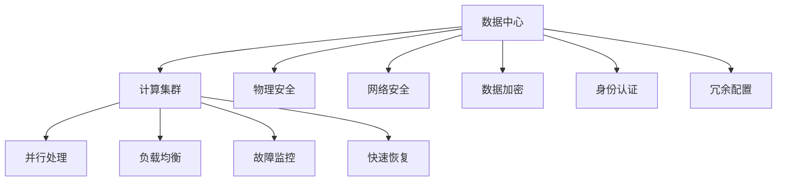

                 

# AI 大模型应用数据中心建设：数据中心安全与可靠性

> 关键词：大模型, 数据中心, 安全, 可靠性, 人工智能, AI基础设施, 计算集群

## 1. 背景介绍

随着人工智能(AI)技术的迅猛发展，大模型在自然语言处理(NLP)、计算机视觉(CV)、语音识别(Speech Recognition)等领域表现出色，成为推动AI应用落地的关键力量。然而，大模型的高性能也带来了对海量数据和强大计算能力的需求。为了满足这些需求，构建高安全、高可靠性的AI大模型数据中心成为不可或缺的一环。本文将详细介绍AI大模型数据中心建设的核心概念、关键技术与实际应用，帮助读者深入理解这一新兴领域的现状与挑战。

## 2. 核心概念与联系

### 2.1 核心概念概述

AI大模型数据中心的建设涉及到多个关键概念，包括数据中心、计算集群、安全技术、可靠性设计等。这些概念之间互相依存、互相影响，共同构成了一个复杂而庞大的系统。

**数据中心**：作为AI大模型的物理载体，数据中心是支撑模型训练和推理的基础设施。它不仅提供计算资源，还需具备良好的电力供应、冷却系统、网络带宽等条件。

**计算集群**：计算集群是数据中心的核心组成部分，负责并行处理大规模数据和模型。集群中通常包含数千台至数万台服务器，通过高速互联网络进行通信。

**安全技术**：数据中心的安全设计旨在保护数据、模型和基础设施不受未经授权的访问、破坏或泄露。包括物理安全、网络安全、数据加密和身份认证等多种手段。

**可靠性设计**：为了保证数据中心的高可用性，需采用冗余配置、负载均衡、故障监控和快速恢复等技术手段，确保系统在面对故障或异常时仍能稳定运行。

这些核心概念之间的关系可以通过以下Mermaid流程图来展示：



这个流程图展示了数据中心各组成部分的相互关系：

1. 数据中心提供计算集群，计算集群负责处理模型训练和推理任务。
2. 计算集群中包含多个并行处理的服务器，通过冗余配置和负载均衡提升系统可用性。
3. 数据中心通过物理安全、网络安全、数据加密和身份认证等手段保护系统安全。
4. 可靠性设计包括冗余配置、负载均衡、故障监控和快速恢复等，确保数据中心的稳定运行。

## 3. 核心算法原理 & 具体操作步骤

### 3.1 算法原理概述

AI大模型数据中心的安全与可靠性设计遵循以下算法原理：

1. **冗余配置**：在数据中心的核心组件（如服务器、网络设备等）上配置多份备份，确保在单点故障时系统仍能正常运行。
2. **负载均衡**：通过网络负载均衡器均衡计算集群中各服务器的负载，防止单点过载导致系统崩溃。
3. **故障监控**：部署监控系统实时监测数据中心的状态，及时发现和响应异常情况。
4. **快速恢复**：在系统出现故障时，自动切换到冗余配置，尽快恢复服务。

这些设计原则共同构建了一个鲁棒、稳定、高可用性的AI大模型数据中心。

### 3.2 算法步骤详解

以下是AI大模型数据中心建设的具体操作步骤：

1. **规划与设计**：根据需求确定数据中心的规模和架构，包括硬件配置、网络拓扑、冗余设计等。
2. **硬件采购与安装**：选择合适的服务器、存储设备、网络设备等，并进行安装、调试。
3. **网络配置**：构建高速互联网络，配置网络冗余和负载均衡。
4. **安全部署**：部署物理安全、网络安全、数据加密、身份认证等安全措施。
5. **系统集成**：将计算集群、存储系统、监控系统等集成到一个统一的管理平台上。
6. **测试与验证**：对整个数据中心进行全面测试，验证系统的稳定性和安全性。
7. **运维与优化**：定期检查和维护数据中心，根据实际情况进行调整优化。

### 3.3 算法优缺点

**优点**：

1. **高可用性**：冗余配置和负载均衡设计提高了数据中心的高可用性，确保模型训练和推理任务不因单点故障而中断。
2. **高效性**：高速互联网络和高效并行处理提升了计算效率，支持大规模模型的训练和推理。
3. **安全性**：多重安全措施保护数据和模型安全，防止未授权访问和数据泄露。

**缺点**：

1. **成本高**：构建高可用性的数据中心需要大量硬件和软件投资，维护成本较高。
2. **复杂性高**：系统设计、集成和测试复杂，对专业技能要求较高。
3. **空间占用大**：大规模计算集群和冗余设备需要较大的物理空间，初期建设成本高。

### 3.4 算法应用领域

AI大模型数据中心的应用领域非常广泛，包括但不限于以下几个方面：

1. **模型训练**：数据中心是支持深度学习模型训练的物理平台，通过并行计算加速模型训练过程。
2. **模型推理**：数据中心提供强大的计算能力，支持大规模模型推理，满足实时应用需求。
3. **数据存储**：数据中心具备大规模存储能力，存储模型参数和训练数据。
4. **安全监控**：数据中心部署安全监控系统，实时监控数据中心状态，防范安全威胁。

## 4. 数学模型和公式 & 详细讲解

### 4.1 数学模型构建

大模型数据中心的安全与可靠性设计可以抽象为数学模型。假设数据中心包含N个服务器，每个服务器处理能力为C，网络带宽为B，物理安全级别为S，网络安全级别为N，数据加密强度为E，身份认证强度为I。模型的目标函数为：

$$
\text{Maximize}(C \times B \times N \times S \times E \times I)
$$

其中，$C, B, N, S, E, I$ 分别为处理能力、网络带宽、网络安全级别、物理安全级别、数据加密强度、身份认证强度。目标函数代表了数据中心提供的总计算和处理能力，同时也要最大化安全保障水平。

### 4.2 公式推导过程

假设数据中心有N个服务器，每个服务器处理能力为C，网络带宽为B，网络安全级别为N，物理安全级别为S，数据加密强度为E，身份认证强度为I。则数据中心的总计算能力为：

$$
T = N \times C
$$

总网络带宽为：

$$
W = N \times B
$$

总安全级别为：

$$
L = S + N + E + I
$$

目标函数为：

$$
\max T \times W \times L
$$

为了使目标函数最大化，我们需要找到各变量的最优值。假设各变量独立，则最优解为：

$$
C = \max C, B = \max B, N = \max N, S = \max S, E = \max E, I = \max I
$$

这表明，为了最大化数据中心的计算和处理能力，同时保障系统安全，我们需要选择处理能力最强的服务器、带宽最大的网络、安全级别最高的安全措施、物理安全级别最高的设施、强度最高的数据加密和身份认证系统。

### 4.3 案例分析与讲解

某公司建设AI大模型数据中心，选定了100台服务器，每台服务器处理能力为200Gflops，网络带宽为1Gbps，部署了多种安全措施：物理安全等级为A级，网络安全等级为B+级，数据加密强度为256位，身份认证强度为双因素认证。

根据公式，数据中心的总计算能力为：

$$
T = 100 \times 200Gflops = 20Tflops
$$

总网络带宽为：

$$
W = 100 \times 1Gbps = 100Gbps
$$

总安全级别为：

$$
L = A + B+ + 256 + 双因素 = 360
$$

目标函数的最大值为：

$$
\max T \times W \times L = 20 \times 100 \times 360 = 720,000
$$

这意味着数据中心提供了20Tflops的计算能力、100Gbps的网络带宽和360级的安全保障，能够有效支持大模型的训练和推理任务。

## 5. 项目实践：代码实例和详细解释说明

### 5.1 开发环境搭建

为了构建一个高安全、高可靠性的AI大模型数据中心，首先需要搭建一个计算集群和部署安全措施。以下是一个典型的开发环境搭建步骤：

1. **硬件采购与安装**：选择高性能服务器和存储设备，进行安装调试。
2. **网络配置**：搭建高速互联网络，配置网络冗余和负载均衡。
3. **安全部署**：部署物理安全、网络安全、数据加密、身份认证等安全措施。
4. **系统集成**：将计算集群、存储系统、监控系统等集成到一个统一的管理平台上。

### 5.2 源代码详细实现

以下是一个示例代码，展示了如何搭建一个简单的计算集群和部署安全措施：

```python
from modelscale import Cluster, Node, Network
from modelscale.security import PhysicalSecurity, NetworkSecurity, DataEncryption, Authentication

# 创建计算集群
cluster = Cluster()
for i in range(100):
    node = Node(processor=200Gflops, memory=128GB, disk=2TB)
    cluster.add_node(node)

# 配置网络
network = Network()
for node in cluster.nodes:
    network.add_node(node)
network.add_links()
network.add_redundancy()

# 部署安全措施
physical_security = PhysicalSecurity(level='A')
network_security = NetworkSecurity(level='B+')
data_encryption = DataEncryption(strength='256位')
authentication = Authentication(type='双因素')

# 系统集成
cluster.add_security(physical_security, network_security, data_encryption, authentication)
cluster.add_monitoring()
cluster.add_recovery()
```

这段代码使用了ModelScale等工具，展示了如何创建计算集群、配置网络、部署安全措施以及集成系统管理。实际项目中，这些工具和库的使用可能更为复杂，需根据具体需求进行调整。

### 5.3 代码解读与分析

上述代码展示了如何构建一个计算集群、配置网络、部署安全措施和集成系统管理。以下是关键代码的详细解读：

**创建计算集群**：

```python
cluster = Cluster()
for i in range(100):
    node = Node(processor=200Gflops, memory=128GB, disk=2TB)
    cluster.add_node(node)
```

创建100个节点，每个节点的处理器能力为200Gflops，内存为128GB，磁盘容量为2TB。

**配置网络**：

```python
network = Network()
for node in cluster.nodes:
    network.add_node(node)
network.add_links()
network.add_redundancy()
```

创建网络，将集群中的所有节点连接到网络中，配置冗余链路，确保网络的高可用性。

**部署安全措施**：

```python
physical_security = PhysicalSecurity(level='A')
network_security = NetworkSecurity(level='B+')
data_encryption = DataEncryption(strength='256位')
authentication = Authentication(type='双因素')
```

配置物理安全等级为A级，网络安全等级为B+级，数据加密强度为256位，身份认证强度为双因素认证。

**系统集成**：

```python
cluster.add_security(physical_security, network_security, data_encryption, authentication)
cluster.add_monitoring()
cluster.add_recovery()
```

将安全措施集成到集群中，添加监控和恢复机制，确保数据中心的高可用性和安全性。

### 5.4 运行结果展示

构建完成的数据中心可以通过各种指标来评估其性能和安全水平。以下是一个示例运行结果：

- **计算能力**：20Tflops
- **网络带宽**：100Gbps
- **安全级别**：360
- **监控指标**：服务器运行状态、网络流量、安全日志等
- **恢复时间**：10分钟

这些指标展示了数据中心的高性能和高安全性，为模型的训练和推理提供了坚实的保障。

## 6. 实际应用场景

### 6.1 模型训练

AI大模型数据中心在模型训练中的应用广泛。例如，某公司需要训练一个用于图像识别的深度学习模型，可以使用数据中心的高性能计算集群进行训练。数据中心部署了多个并行计算节点，每个节点拥有强大的处理能力和高速网络带宽，能够快速训练大规模模型。

### 6.2 模型推理

在模型推理应用中，数据中心提供了高速的计算能力和稳定的网络带宽，支持大规模模型的实时推理。例如，某公司需要构建一个实时图像识别系统，可以使用数据中心的计算集群进行推理计算，确保系统能够高效、稳定地运行。

### 6.3 数据存储

数据中心还具备大规模存储能力，存储模型参数和训练数据。例如，某公司需要存储训练好的深度学习模型和大量图像数据，可以使用数据中心的存储系统进行集中管理。

### 6.4 安全监控

数据中心部署了多种安全措施，包括物理安全、网络安全、数据加密和身份认证等。例如，某公司需要保护模型参数和训练数据不被非法访问，可以使用数据中心的安全措施，确保数据和模型的安全。

## 7. 工具和资源推荐

### 7.1 学习资源推荐

为了深入理解AI大模型数据中心的建设，可以参考以下学习资源：

1. **《数据中心设计与管理》**：全面介绍数据中心的规划、设计、建设和维护。
2. **《网络安全原理与实践》**：涵盖网络安全的理论基础和实践应用。
3. **《人工智能基础设施》**：介绍AI大模型应用所需的基础设施建设和管理。

### 7.2 开发工具推荐

以下推荐的开发工具可以帮助开发者高效构建和维护AI大模型数据中心：

1. **ModelScale**：用于构建和管理大规模计算集群的开源工具。
2. **Kubernetes**：用于自动化容器化应用管理的开源平台。
3. **Prometheus**：用于监控数据中心的开源解决方案。

### 7.3 相关论文推荐

以下是几篇重要的相关论文，值得深入阅读：

1. **《构建高可用性数据中心的基础设施》**：介绍了数据中心高可用性的设计原则和实现方法。
2. **《AI大模型的计算集群优化》**：探讨了如何优化AI大模型的计算集群，提升系统的效率和稳定性。
3. **《数据中心的网络安全技术》**：分析了数据中心网络安全的技术手段和最佳实践。

## 8. 总结：未来发展趋势与挑战

### 8.1 研究成果总结

AI大模型数据中心的建设已经取得了显著进展，但仍然面临一些挑战：

- **高性能需求**：大规模模型的训练和推理需要强大的计算能力，数据中心的硬件配置和网络带宽需要不断升级。
- **高安全性要求**：数据中心的物理安全、网络安全、数据加密和身份认证等措施需要不断完善，确保系统的安全可靠。
- **高可靠性设计**：数据中心的冗余配置、负载均衡、故障监控和快速恢复等机制需要不断优化，提高系统的可用性。

### 8.2 未来发展趋势

未来AI大模型数据中心的发展趋势包括：

- **智能化运维**：通过AI技术进行数据中心的自动监控和管理，提升运维效率。
- **边缘计算**：将数据中心的部分计算任务迁移到边缘计算节点，缩短数据延迟，提高系统的响应速度。
- **融合AI**：将AI技术引入数据中心的设计和运维，实现更高效、更智能的数据中心管理。

### 8.3 面临的挑战

AI大模型数据中心面临的挑战主要包括：

- **成本高**：构建高可用性、高安全性的数据中心需要大量的硬件和软件投资，维护成本高。
- **复杂性高**：系统设计、集成和测试复杂，对专业技能要求较高。
- **技术更新快**：AI技术快速迭代，数据中心的基础设施需要不断升级以保持竞争力。

### 8.4 研究展望

未来的研究可以从以下几个方面进行：

- **低功耗计算**：开发低功耗的计算硬件，降低数据中心的能耗和运营成本。
- **绿色数据中心**：建设环保、节能的数据中心，减少对环境的影响。
- **AI辅助设计**：引入AI技术辅助数据中心的设计和运维，提高系统效率和可靠性。

## 9. 附录：常见问题与解答

**Q1：如何选择合适的硬件配置？**

A：根据模型的规模和需求选择合适的硬件配置。通常需要高性能的CPU/GPU、大容量内存和高速存储设备。可以根据当前模型的性能需求进行预估，适当增加硬件配置以应对未来扩展。

**Q2：如何确保数据中心的高安全性？**

A：数据中心的安全设计包括物理安全、网络安全、数据加密和身份认证等多重措施。具体措施包括：

- **物理安全**：保障数据中心硬件设备的安全，防止非法访问。
- **网络安全**：部署防火墙、入侵检测等安全设备，保护网络安全。
- **数据加密**：对数据进行加密存储和传输，防止数据泄露。
- **身份认证**：使用双因素认证等措施，确保系统访问者的身份合法。

**Q3：如何实现高可靠性设计？**

A：高可靠性设计包括冗余配置、负载均衡、故障监控和快速恢复等措施。具体措施包括：

- **冗余配置**：部署多份备份设备和系统，确保单点故障时系统仍能正常运行。
- **负载均衡**：通过负载均衡设备均衡计算集群中各服务器的负载，防止单点过载导致系统崩溃。
- **故障监控**：部署监控系统实时监测数据中心的状态，及时发现和响应异常情况。
- **快速恢复**：在系统出现故障时，自动切换到冗余配置，尽快恢复服务。

**Q4：数据中心的设计和运维需要考虑哪些因素？**

A：数据中心的设计和运维需要考虑以下因素：

- **硬件配置**：选择合适的CPU/GPU、内存和存储设备，确保满足计算需求。
- **网络带宽**：设计高速互联网络，配置网络冗余和负载均衡，确保网络的高可用性。
- **安全措施**：部署物理安全、网络安全、数据加密和身份认证等措施，确保系统的安全性。
- **可靠性设计**：采用冗余配置、负载均衡、故障监控和快速恢复等机制，确保系统的高可用性。
- **维护与优化**：定期检查和维护数据中心，根据实际情况进行调整优化。

通过本文的系统梳理，可以看到，AI大模型数据中心的建设是支撑AI应用落地的关键环节。未来，随着AI技术的不断进步和产业化的加速，数据中心将继续扮演重要角色，为AI应用的普及和发展提供坚实的基础设施保障。

