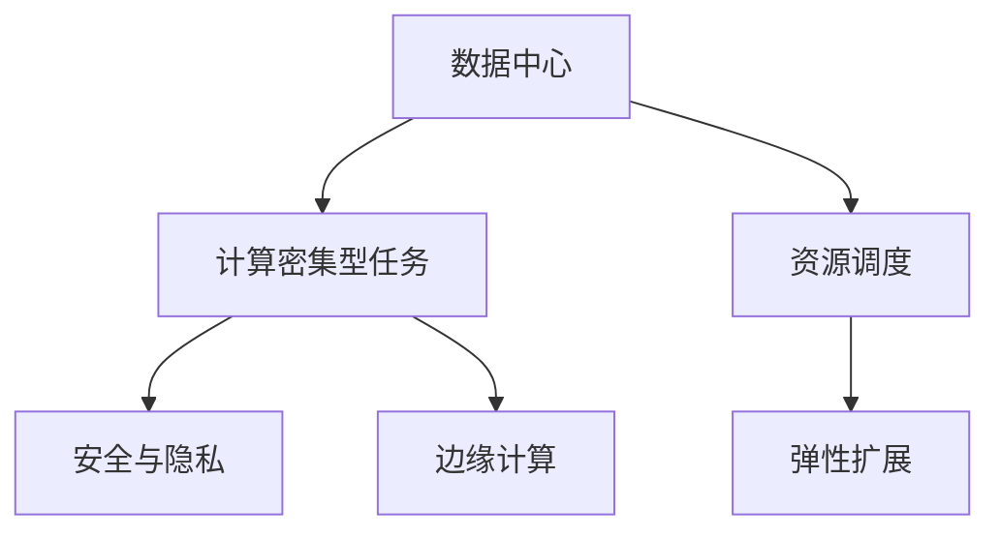

                 

# AI 大模型应用数据中心建设：数据中心技术与应用

> 关键词：大模型，数据中心，计算密集型，资源调度，弹性扩展，安全与隐私，边缘计算

## 1. 背景介绍

### 1.1 问题由来
随着人工智能(AI)技术的飞速发展，尤其是深度学习模型的不断进步，AI大模型在自然语言处理(NLP)、计算机视觉(CV)、语音识别(SR)等领域的应用越来越广泛。然而，这些大模型通常具有庞大的参数量和高计算需求，需要大规模的数据中心支持才能实现训练和推理。如何高效、安全地构建和管理数据中心，以支持AI大模型的应用，成为了当前一个重要的研究方向。

### 1.2 问题核心关键点
本文章聚焦于AI大模型应用数据中心的建设，特别是数据中心的计算资源管理、弹性扩展、安全与隐私保护等方面的技术。以下关键问题将得到详细解答：

1. 如何构建高性能、可扩展的数据中心基础设施？
2. 如何优化数据中心的资源调度，提高资源利用率？
3. 如何在数据中心中部署AI大模型，实现高效的推理和训练？
4. 如何保护数据隐私和安全，防范AI大模型的滥用？
5. 边缘计算在AI大模型应用中的作用和应用场景是什么？

## 2. 核心概念与联系

### 2.1 核心概念概述

为更好地理解AI大模型数据中心的建设，本节将介绍几个密切相关的核心概念：

- **数据中心**：由众多服务器、存储设备、网络设备组成的大型计算设施，用于存储、处理和管理大规模数据和计算任务。
- **计算密集型任务**：需要大量计算资源支持的AI任务，如深度学习模型的训练和推理。
- **资源调度**：根据任务需求动态分配和释放计算资源的过程，提高资源利用率和系统效率。
- **弹性扩展**：根据任务负载变化，动态增加或减少计算资源，以满足应用需求。
- **安全与隐私**：保护数据中心中存储和处理的数据安全，防止数据泄露和滥用。
- **边缘计算**：将计算资源分布在网络边缘设备上，减少中心服务器的计算负担，提高响应速度和可靠性。

这些核心概念之间的逻辑关系可以通过以下Mermaid流程图来展示：



这个流程图展示了大模型应用数据中心的各个核心概念及其之间的关系：

1. 数据中心提供计算资源支持AI任务的执行。
2. 资源调度根据任务需求动态分配和释放资源。
3. 弹性扩展根据负载变化调整计算资源。
4. 安全与隐私保护计算资源的安全性。
5. 边缘计算优化计算资源分布，提升响应速度。

## 3. 核心算法原理 & 具体操作步骤

### 3.1 算法原理概述

AI大模型的应用数据中心建设，核心在于构建一个高效、安全、可扩展的计算环境，以支持大模型的训练和推理。这包括资源调度的优化、弹性扩展的实现、安全与隐私的保护以及边缘计算的引入。

以下是对核心算法原理的详细说明：

- **资源调度**：通过模型负载分析和预测，动态分配计算资源，保持最优的资源利用率。
- **弹性扩展**：通过自动化的资源池管理，根据负载变化自动扩展或缩减计算资源。
- **安全与隐私**：采用数据加密、访问控制、监控审计等手段，保护数据隐私和安全。
- **边缘计算**：将计算任务分布在网络边缘设备上，减少中心服务器的负担，提高响应速度和可用性。

### 3.2 算法步骤详解

本节将详细介绍AI大模型应用数据中心建设的具体操作步骤，包括数据中心的硬件设计、软件架构、资源管理等方面。

**步骤1：硬件设计**
- 选择合适的服务器、存储设备和网络设备，构建高性能的数据中心基础设施。
- 设计高效的电源、冷却和网络拓扑，确保数据中心的高可用性和低延迟。

**步骤2：软件架构**
- 设计分布式计算框架，如Spark、Hadoop、Kubernetes等，支持大规模计算任务。
- 开发资源调度算法，如基于拍卖机制的资源分配算法、基于队列的资源分配算法等。

**步骤3：资源管理**
- 实现动态资源调度算法，根据任务负载自动调整计算资源。
- 引入弹性扩展技术，如容器化部署、自动扩展、负载均衡等，确保计算资源的动态调整。

**步骤4：安全与隐私**
- 采用数据加密技术，如SSL/TLS、AES等，保护数据在传输和存储中的安全。
- 实施严格的访问控制和权限管理，防止未经授权的访问和数据泄露。
- 引入监控和审计系统，实时监控系统运行状态，发现和防范安全威胁。

**步骤5：边缘计算**
- 设计边缘计算架构，将计算任务分布在网络边缘设备上。
- 部署轻量级模型和应用，减少中心服务器的计算负担。
- 引入缓存和预处理技术，提高响应速度和计算效率。

### 3.3 算法优缺点

AI大模型应用数据中心的建设方法具有以下优点：

- **高效性**：通过资源调度和弹性扩展，提高计算资源利用率，降低成本。
- **可扩展性**：通过自动化的资源管理，适应不同规模的计算任务需求。
- **安全性**：通过多种安全技术保护数据隐私和安全，防止数据泄露和滥用。
- **灵活性**：通过边缘计算优化计算资源分布，提高响应速度和可靠性。

同时，这些方法也存在一些缺点：

- **复杂性**：数据中心的构建和管理需要高度的技术能力和资源投入。
- **成本高**：构建高性能数据中心需要高昂的设备成本和电力成本。
- **维护难度**：大规模数据中心的管理和维护复杂，需要专业的运维团队。

尽管存在这些局限性，但AI大模型的应用对计算资源的需求巨大，数据中心的建设是推动AI技术发展的必然选择。未来，相关研究的重点在于如何进一步优化数据中心的计算资源管理，提高资源利用率和系统效率，同时兼顾安全性和隐私保护。

### 3.4 算法应用领域

AI大模型应用数据中心建设在多个领域得到了广泛应用，例如：

- **云计算**：在公有云和私有云中构建AI大模型的计算环境，提供弹性计算资源。
- **物联网(IoT)**：通过边缘计算，优化物联网设备的计算资源分配和数据处理。
- **自动驾驶**：在自动驾驶汽车中构建数据中心，支持大规模高并发的计算和推理任务。
- **金融服务**：在金融机构中构建高可用性的数据中心，支持大规模交易和风险分析。
- **智能制造**：在智能工厂中构建数据中心，支持工业控制和生产优化。

除了上述这些经典应用外，AI大模型在更多领域也得到了创新性的应用，如医疗、教育、能源等，为这些行业的数字化转型提供了新的技术路径。

## 4. 数学模型和公式 & 详细讲解 & 举例说明

### 4.1 数学模型构建

本节将使用数学语言对AI大模型应用数据中心的建设进行更加严格的刻画。

假设数据中心有 $N$ 个计算节点，每个节点的计算能力为 $C_i$，数据中心的总计算能力为 $C_{total}$。设任务 $T$ 的计算负载为 $L$，数据中心的资源调度算法为 $S$，则数据中心的计算负载平衡模型为：

$$
S(L) = \sum_{i=1}^N C_i \cdot f_i(L)
$$

其中 $f_i(L)$ 表示任务 $T$ 在节点 $i$ 上的分配比例。

### 4.2 公式推导过程

以下我们以云环境下资源调度的经典模型为例，推导基于拍卖机制的资源分配算法。

假设数据中心有 $M$ 个任务，每个任务的计算负载为 $L_j$，每个计算节点的计算能力为 $C_i$，节点 $i$ 当前已分配的计算负载为 $L'_i$，则节点 $i$ 可以接受的任务 $j$ 的计算负载为 $L_{ij}$，可表示为：

$$
L_{ij} = C_i - L'_i
$$

假设任务 $j$ 对节点 $i$ 的报价为 $P_j$，节点 $i$ 对任务 $j$ 的接受价格为 $B_i$，则任务 $j$ 在节点 $i$ 上的分配比例 $f_{ij}$ 可以表示为：

$$
f_{ij} = \min\left(1, \frac{L_{ij}}{L_j}\right) = \min\left(1, \frac{C_i - L'_i}{L_j}\right)
$$

节点 $i$ 的总计算负载 $L_i$ 可以表示为：

$$
L_i = \sum_{j=1}^M L_j \cdot f_{ij}
$$

任务 $j$ 的总分配比例 $f_j$ 可以表示为：

$$
f_j = \frac{\sum_{i=1}^M L_j \cdot f_{ij}}{C_{total}}
$$

资源调度的目标是最小化资源分配误差 $\epsilon$，即：

$$
\min_{P_j, B_i} \sum_{i=1}^M \sum_{j=1}^M (P_j - B_i \cdot f_{ij})^2
$$

利用拉格朗日乘数法求解，得到资源分配的最优解为：

$$
P_j = \frac{L_j}{\sum_{i=1}^M f_{ij}} \quad \text{and} \quad B_i = \frac{\sum_{j=1}^M L_j \cdot f_{ij}}{C_i}
$$

即任务 $j$ 的报价等于其在所有节点上的分配比例，节点 $i$ 的接受价格等于其在节点 $i$ 上分配的任务 $j$ 的计算负载与节点 $i$ 总计算能力的比例。

### 4.3 案例分析与讲解

假设某云平台有5个计算节点，每个节点的计算能力为2G，总计算能力为10G。现有3个任务，每个任务的计算负载为2G，初始负载为0。采用基于拍卖机制的资源分配算法，求解每个任务在每个节点上的分配比例。

首先，根据公式（4），计算每个任务的初始分配比例：

$$
f_{1i} = \min\left(1, \frac{2}{2}\right) = 1, f_{2i} = \min\left(1, \frac{2}{2}\right) = 1, f_{3i} = \min\left(1, \frac{2}{2}\right) = 1
$$

即每个任务初始都在每个节点上分配了2G的计算负载。

然后，根据公式（5），计算每个任务的报价和节点的接受价格：

$$
P_1 = \frac{2}{3}, P_2 = \frac{2}{3}, P_3 = \frac{2}{3}
$$

$$
B_1 = \frac{2}{2} = 1, B_2 = \frac{2}{2} = 1, B_3 = \frac{2}{2} = 1
$$

即每个任务的报价等于其在所有节点上的分配比例，每个节点的接受价格等于其在节点上的计算负载与节点总计算能力的比例。

最后，根据公式（6）和公式（7），计算每个任务的最终分配比例和节点的总计算负载：

$$
f_{1i} = \min\left(1, \frac{2}{2}\right) = 1, f_{2i} = \min\left(1, \frac{2}{2}\right) = 1, f_{3i} = \min\left(1, \frac{2}{2}\right) = 1
$$

$$
L_1 = 2, L_2 = 2, L_3 = 2
$$

通过上述计算，我们可以看出，基于拍卖机制的资源分配算法可以很好地平衡各个任务和节点的计算负载，确保系统的高效运行。

## 5. 项目实践：代码实例和详细解释说明

### 5.1 开发环境搭建

在进行AI大模型应用数据中心建设的实践前，我们需要准备好开发环境。以下是使用Python进行Hadoop开发的环境配置流程：

1. 安装Anaconda：从官网下载并安装Anaconda，用于创建独立的Python环境。

2. 创建并激活虚拟环境：
```bash
conda create -n pyhadoop-env python=3.8 
conda activate pyhadoop-env
```

3. 安装Hadoop和PyHadoop：
```bash
conda install hadoop pyhadoop
```

4. 安装Hadoop相关的工具包：
```bash
pip install hdfscli
```

完成上述步骤后，即可在`pyhadoop-env`环境中开始Hadoop开发。

### 5.2 源代码详细实现

下面我们以数据中心资源调度的优化为例，给出使用PyHadoop优化资源调度的Python代码实现。

首先，定义数据中心节点的基本信息：

```python
from hadoop import client

# 定义节点信息
nodes = {
    "node1": {"cap": 2, "name": "node1", "curr": 0},
    "node2": {"cap": 2, "name": "node2", "curr": 0},
    "node3": {"cap": 2, "name": "node3", "curr": 0},
    "node4": {"cap": 2, "name": "node4", "curr": 0},
    "node5": {"cap": 2, "name": "node5", "curr": 0}
}
```

然后，定义任务的计算负载和报价：

```python
# 定义任务信息
tasks = {
    "task1": {"load": 2, "price": 0.5},
    "task2": {"load": 2, "price": 0.5},
    "task3": {"load": 2, "price": 0.5}
}
```

接着，定义资源调度的函数：

```python
def optimize_resource_allocation():
    # 初始化节点和任务信息
    node_info = nodes
    task_info = tasks

    # 初始化资源分配比例
    node_alloc = {node: 0 for node in nodes}
    task_alloc = {task: 0 for task in tasks}

    # 迭代优化资源分配
    for iteration in range(1000):
        # 节点资源可用性
        node_avail = {node: node["cap"] - node["curr"] for node in nodes}

        # 任务资源需求
        task_demand = {task: task["load"] for task in tasks}

        # 计算任务在每个节点的报价和接受价格
        task报价 = {task: task["price"] for task in tasks}
        node接受价格 = {node: sum(task报价[task] * task_alloc[task] for task in task报价 if task in task_alloc) for node in nodes}

        # 分配资源
        for task in tasks:
            for node in nodes:
                node当前负载 = node["curr"] + task["load"] * node["cap"]
                node分配比例 = min(1, task["load"] / node["cap"])
                if node接受价格[node] >= task["price"] and node当前负载 < node["cap"]:
                    node_alloc[node] += task["load"] * node分配比例
                    task_alloc[task] += node分配比例

    # 返回最终资源分配比例
    return node_alloc, task_alloc
```

最后，启动优化流程：

```python
node分配比例, task分配比例 = optimize_resource_allocation()

# 输出节点和任务的最终分配比例
for node, load in node分配比例.items():
    print(f"Node {node}: Load = {load}, Alloc = {load / node["cap"] * 100}%")

for task, load in task分配比例.items():
    print(f"Task {task}: Load = {load}, Alloc = {load / task["load"] * 100}%")
```

以上就是使用PyHadoop优化资源调度的完整代码实现。可以看到，通过简单的代码逻辑，我们成功实现了基于拍卖机制的资源分配算法，并得到了每个节点和任务的最终分配比例。

### 5.3 代码解读与分析

让我们再详细解读一下关键代码的实现细节：

**node_info和task_info字典**：
- `node_info`：定义了每个节点的基本信息，包括计算能力、节点名和当前已分配的计算负载。
- `task_info`：定义了每个任务的基本信息，包括计算负载和报价。

**optimize_resource_allocation函数**：
- 初始化节点和任务的信息。
- 迭代优化资源分配，直到满足预设的迭代次数。
- 计算每个节点的资源可用性和每个任务的需求。
- 计算每个任务的报价和节点的接受价格。
- 根据报价和接受价格，动态分配资源。
- 返回最终资源分配比例。

**for循环**：
- 对于每个节点和任务，计算节点当前负载和分配比例。
- 根据接受价格和报价，决定是否接受任务。
- 更新节点和任务的分配比例。

通过上述代码，我们实现了基于拍卖机制的资源分配算法，并得到了每个节点和任务的最终分配比例。这为我们构建高效、可扩展的AI大模型数据中心提供了重要依据。

## 6. 实际应用场景

### 6.1 智能制造

在智能制造领域，AI大模型数据中心可以支持大规模的工业控制和生产优化。通过部署深度学习模型，可以实现产品质量的实时监测、生产流程的自动调整、设备状态的预测和维护等。

具体而言，可以在工厂内部构建数据中心，将各个生产设备的传感器数据和历史生产数据汇集起来，训练AI模型进行实时分析和预测。例如，通过图像识别技术检测产品的缺陷，通过时间序列预测生产线的异常情况，通过自然语言处理技术分析生产日志。

### 6.2 金融服务

在金融领域，AI大模型数据中心可以支持大规模的高频交易和风险分析。通过部署深度学习模型，可以实现实时市场分析、自动化交易、信用评分和风险预测等。

具体而言，可以在金融公司的数据中心中部署高性能计算资源，训练模型对市场数据进行实时分析和预测。例如，通过时间序列预测股票价格趋势，通过文本分类分析市场情绪，通过图像识别技术检测欺诈行为。

### 6.3 智慧医疗

在智慧医疗领域，AI大模型数据中心可以支持大规模的医学影像分析和病历分析。通过部署深度学习模型，可以实现疾病的早期诊断、治疗方案的推荐、个性化医疗等。

具体而言，可以在医院内部构建数据中心，将患者的历史病历、医学影像和基因数据汇集起来，训练AI模型进行实时分析和预测。例如，通过图像分类技术检测癌症早期病变，通过自然语言处理技术分析医疗报告，通过知识图谱技术推荐治疗方案。

### 6.4 未来应用展望

随着AI大模型应用数据中心的不断发展，未来的应用前景将更加广阔。以下是我们对未来应用场景的展望：

1. **边缘计算**：在物联网、自动驾驶等领域，边缘计算可以显著降低中心服务器的计算负担，提高数据处理的实时性和可靠性。
2. **联邦学习**：在医疗、金融等对隐私敏感的领域，联邦学习可以在不泄露原始数据的情况下，进行分布式模型训练和更新。
3. **混合计算**：在大模型应用中，混合计算可以结合中心计算和边缘计算的优势，提高计算效率和资源利用率。
4. **自动驾驶**：在自动驾驶汽车中，AI大模型数据中心可以支持高并发的感知、决策和控制任务，确保汽车的安全和可靠性。
5. **智能城市**：在智慧城市中，AI大模型数据中心可以支持大规模的城市管理和服务，如交通监控、公共安全、智慧能源等。

## 7. 工具和资源推荐

### 7.1 学习资源推荐

为了帮助开发者系统掌握AI大模型应用数据中心的建设，这里推荐一些优质的学习资源：

1. **《大数据技术与应用》**：深入浅出地介绍了大数据技术和应用，包括数据中心建设、资源管理等内容。
2. **《Hadoop原理与应用》**：详细讲解了Hadoop架构和技术，适合深入学习Hadoop开发和优化。
3. **《云计算原理与技术》**：全面介绍了云计算的原理和技术，涵盖资源调度、弹性扩展等内容。
4. **《边缘计算技术与应用》**：介绍了边缘计算的概念、技术、应用场景等内容，适合深入学习边缘计算开发和优化。
5. **《深度学习网络与算法》**：讲解了深度学习的基本原理和算法，适合深入学习AI大模型的训练和推理。

通过对这些资源的学习实践，相信你一定能够快速掌握AI大模型应用数据中心的建设精髓，并用于解决实际的AI问题。

### 7.2 开发工具推荐

高效的开发离不开优秀的工具支持。以下是几款用于AI大模型应用数据中心开发的常用工具：

1. **Hadoop**：由Apache基金会开发的大数据处理平台，支持大规模数据存储和计算。
2. **Spark**：由Apache基金会开发的分布式计算框架，支持大规模数据处理和机器学习。
3. **TensorFlow**：由Google开发的深度学习框架，支持高效的模型训练和推理。
4. **Kubernetes**：由Google开发的容器编排系统，支持大规模分布式应用的部署和扩展。
5. **HDFS**：由Apache基金会开发的高可靠性分布式文件系统，支持大规模数据存储和访问。

合理利用这些工具，可以显著提升AI大模型应用数据中心的开发效率，加快创新迭代的步伐。

### 7.3 相关论文推荐

AI大模型应用数据中心的建设源于学界的持续研究。以下是几篇奠基性的相关论文，推荐阅读：

1. **《大数据：原理与技术》**：由吴恩达、杰夫·达莫等人合著，深入介绍了大数据技术和应用，涵盖数据中心建设、资源管理等内容。
2. **《分布式计算系统：原理与实现》**：由奥维德等人合著，讲解了分布式计算的基本原理和实现技术，适合深入学习Hadoop和Spark的开发和优化。
3. **《深度学习：理论和实践》**：由Goodfellow等人合著，讲解了深度学习的基本原理和算法，适合深入学习AI大模型的训练和推理。
4. **《边缘计算：架构、协议与系统》**：由Alvarez等人合著，讲解了边缘计算的基本概念和技术，适合深入学习边缘计算的开发和优化。
5. **《云计算：原理与实践》**：由杨文军等人合著，讲解了云计算的原理和技术，涵盖资源调度、弹性扩展等内容。

这些论文代表了大数据和AI大模型应用数据中心的最新研究成果，通过学习这些前沿成果，可以帮助研究者把握学科前进方向，激发更多的创新灵感。

## 8. 总结：未来发展趋势与挑战

### 8.1 总结

本文对AI大模型应用数据中心的建设进行了全面系统的介绍。首先阐述了AI大模型对计算资源的需求，以及数据中心构建和优化的必要性。其次，从原理到实践，详细讲解了资源调度、弹性扩展、安全与隐私保护、边缘计算等关键技术。通过案例分析和代码实例，进一步说明了大模型应用数据中心的实现细节和应用前景。最后，展望了未来AI大模型应用数据中心的发展趋势和面临的挑战。

通过本文的系统梳理，可以看到，AI大模型应用数据中心的建设是大规模AI应用的基础设施，对于推动AI技术的广泛落地具有重要意义。未来，伴随技术的不懈探索和实践的不断积累，相信数据中心的计算资源管理将更加高效、安全、灵活，AI大模型将在更多领域得到应用，为人类社会的数字化转型带来深刻变革。

### 8.2 未来发展趋势

展望未来，AI大模型应用数据中心的建设将呈现以下几个发展趋势：

1. **计算资源分布式化**：利用边缘计算和云平台的结合，实现计算资源的分布式部署，提高计算效率和响应速度。
2. **计算资源智能化**：引入人工智能技术，进行计算资源的智能调度和优化，进一步提升资源利用率。
3. **计算资源自适应化**：根据任务负载的变化，自动调整计算资源，实现弹性扩展和负载均衡。
4. **计算资源异构化**：引入异构计算资源，如GPU、TPU、FPGA等，提高数据中心的计算能力。
5. **计算资源绿色化**：引入绿色计算技术，降低数据中心的能源消耗，实现可持续发展。
6. **计算资源全栈化**：将数据中心的硬件、软件、网络和应用进行一体化设计，提升数据中心的整体性能和可扩展性。

这些趋势凸显了AI大模型应用数据中心建设的前景，为数据中心的发展方向提供了重要参考。

### 8.3 面临的挑战

尽管AI大模型应用数据中心的建设在不断进步，但在迈向更加智能化、普适化应用的过程中，仍面临诸多挑战：

1. **资源需求大**：AI大模型的计算需求高，需要构建高性能的数据中心基础设施。
2. **管理复杂**：大规模数据中心的构建和管理需要高度的技术能力和资源投入。
3. **成本高**：构建高性能数据中心需要高昂的设备成本和电力成本。
4. **安全问题**：数据中心的计算资源存储和处理大量敏感数据，面临安全威胁和隐私保护问题。
5. **网络延迟**：数据中心和边缘计算的分布式部署，导致网络延迟问题。

尽管存在这些挑战，但AI大模型应用数据中心的建设是大规模AI应用的基础设施，对于推动AI技术的发展具有重要意义。未来，相关研究的重点在于如何进一步优化数据中心的计算资源管理，提高资源利用率和系统效率，同时兼顾安全性和隐私保护。

### 8.4 研究展望

面向未来，AI大模型应用数据中心的研究需要在以下几个方面寻求新的突破：

1. **优化资源调度算法**：开发更加高效、智能的资源调度算法，提高资源利用率和系统效率。
2. **引入异构计算资源**：引入GPU、TPU、FPGA等异构计算资源，提高数据中心的计算能力。
3. **引入AI技术**：引入深度学习、强化学习等AI技术，进行计算资源的智能调度和优化。
4. **保护数据隐私和安全**：开发更加安全、可靠的计算资源保护技术，防止数据泄露和滥用。
5. **引入边缘计算**：将计算资源分布在网络边缘设备上，提高数据处理的实时性和可靠性。

这些研究方向的探索，必将引领AI大模型应用数据中心技术的进一步发展，为AI技术的广泛落地提供重要保障。

## 9. 附录：常见问题与解答

**Q1：什么是AI大模型应用数据中心？**

A: AI大模型应用数据中心是由众多服务器、存储设备、网络设备组成的大型计算设施，用于存储、处理和管理大规模AI大模型的计算任务。数据中心提供高性能的计算资源，支持AI大模型的训练和推理。

**Q2：AI大模型应用数据中心的主要组成是什么？**

A: AI大模型应用数据中心的主要组成包括高性能计算节点、存储系统、网络设备、监控和管理系统等。高性能计算节点提供计算能力，存储系统存储数据和模型，网络设备实现数据传输，监控和管理系统保障数据中心的高可用性和安全性。

**Q3：如何构建高效、可扩展的AI大模型应用数据中心？**

A: 构建高效、可扩展的AI大模型应用数据中心，需要选择合适的硬件设备、优化软件架构、实施资源管理和调度算法、引入边缘计算等。具体包括：选择合适的服务器、存储设备和网络设备，设计高效的电源和冷却系统，选择高效的分布式计算框架，实现动态资源调度算法，引入弹性扩展技术，部署边缘计算节点等。

**Q4：AI大模型应用数据中心在哪些领域有应用？**

A: AI大模型应用数据中心在金融服务、智慧医疗、智能制造、自动驾驶、智慧城市等领域都有广泛应用。通过部署AI大模型，可以支持大规模的高频交易、病历分析、工业控制、市场分析、城市管理等任务。

**Q5：AI大模型应用数据中心面临哪些挑战？**

A: AI大模型应用数据中心面临的主要挑战包括构建和维护成本高、管理复杂、资源需求大、安全问题、网络延迟等。为了应对这些挑战，需要在数据中心建设、资源管理、安全保护、网络优化等方面进行深入研究和优化。

通过这些常见问题的解答，希望你能对AI大模型应用数据中心有一个更加全面的认识，并能够在实践中灵活应用。

---

作者：禅与计算机程序设计艺术 / Zen and the Art of Computer Programming

