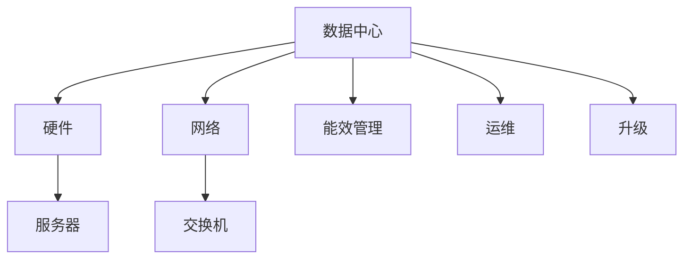

                 

## 1. 背景介绍

### 1.1 问题由来

在人工智能(AI)和大模型蓬勃发展的当下，数据中心(DC)作为承载模型训练与推理的核心基础设施，其投资和建设的重要性日益凸显。然而，数据中心的建设与运营涉及大量资源投入，且其复杂度与投资规模不成比例，需建立一套完整的方法论以指导实践。本文聚焦于AI大模型数据中心的建设，从多个维度探讨了数据中心的投资与建设策略。

### 1.2 问题核心关键点

数据中心建设涉及众多方面，包括选址、硬件选型、网络架构、能效管理等。本文将从数据中心投资、建设、运维、升级等多个维度进行详细探讨，提出一套系统化的方法论，以供开发者和企业参考。

### 1.3 问题研究意义

研究数据中心的投资与建设方法论，对于提升AI大模型应用的效率与效果，减少资源浪费，具有重要意义。

1. **减少资源浪费**：合理的数据中心规划可以显著降低投资成本，避免资源闲置和浪费。
2. **提升应用效率**：优化数据中心硬件配置与网络架构，可以大幅提升AI模型的训练与推理效率。
3. **保障系统稳定**：科学的数据中心运维策略可以确保系统的可靠性和高可用性。
4. **推动技术创新**：随着数据中心技术的不断演进，可以为AI大模型的发展提供新的技术支持。

## 2. 核心概念与联系

### 2.1 核心概念概述

- **数据中心**：通常指互联网数据传输、交换、计算和存储的中心设施，用于处理大规模数据和提供高效计算能力。
- **硬件**：指构成数据中心基础的物理组件，包括服务器、存储设备、网络交换机等。
- **网络**：数据中心内部的数据传输网络，包括带宽、延迟、可靠性和扩展性等方面。
- **能效**：指数据中心在运营过程中所消耗的能源和电力。
- **运维**：包括数据中心的日常管理、监控、故障处理等。
- **升级**：指在数据中心发展过程中进行的硬件、软件、网络等技术升级。

### 2.2 核心概念原理和架构的 Mermaid 流程图

以上流程图展示了数据中心的几个核心组件及其相互关系：硬件设备在数据中心内部通过网络进行通信，能效管理贯穿整个数据中心运营，运维确保系统的稳定可靠，升级则是数据中心技术演进的必然过程。

## 3. 核心算法原理 & 具体操作步骤

### 3.1 算法原理概述

数据中心投资与建设的核心在于综合考虑各要素，构建一个既满足当前需求，又能适应未来发展的设施。该过程可以分为几个步骤：

1. **需求分析**：明确数据中心的预期功能与业务需求。
2. **硬件选型**：选择合适的硬件设备以支持数据中心的正常运行。
3. **网络规划**：设计高效稳定的网络架构。
4. **能效管理**：采用节能技术，降低能源消耗。
5. **运维策略**：建立规范化的运维流程。
6. **升级路径**：制定长远的技术升级规划。

### 3.2 算法步骤详解

#### 步骤一：需求分析

需求分析是数据中心规划的起点，需要详细了解业务需求：

- **存储需求**：数据中心需要存储多少数据，数据的重要性和生命周期。
- **计算需求**：预计数据中心的计算负载，如模型训练、推理任务的并发量。
- **扩展性需求**：未来业务增长对数据中心的扩展要求。
- **安全需求**：数据中心的物理安全、网络安全与数据隐私保护要求。
- **能效需求**：数据中心对能效的期望值，如PUE值等。

#### 步骤二：硬件选型

根据需求分析结果选择合适的硬件设备：

- **服务器**：选择高性能、高可扩展的服务器，如Intel、AMD等高性能处理器，以及大容量内存、高速存储等。
- **网络设备**：选择高速、低延迟的网络交换机和路由器，确保网络带宽与可靠性。
- **存储设备**：选择高速、大容量、高可靠性的存储设备，如SSD、HDD等。
- **冷却设备**：选择高效能的冷却系统，如冷水机组、自然冷却等。

#### 步骤三：网络规划

设计高效的网络架构，确保数据中心内部各组件之间的高效通信：

- **网络拓扑**：设计冗余、分层的网络拓扑结构。
- **网络带宽**：确保内部通信带宽足够大，支持高并发需求。
- **网络延迟**：优化网络路径，降低网络延迟。
- **负载均衡**：实现网络负载均衡，避免单点故障。

#### 步骤四：能效管理

采用节能技术，降低数据中心的能源消耗：

- **能源管理**：使用能效管理系统监测能耗，优化能源使用。
- **制冷系统**：选择高效制冷系统，如自然冷却、液冷、热管冷却等。
- **照明系统**：使用高效LED照明，减少能源消耗。

#### 步骤五：运维策略

建立规范化的运维流程，保障数据中心的稳定运行：

- **监控系统**：使用监控系统实时监测硬件状态与网络性能。
- **备份策略**：定期备份数据中心关键数据，确保数据安全。
- **故障处理**：建立快速响应的故障处理机制。
- **人员培训**：定期对运维人员进行技能培训。

#### 步骤六：升级路径

制定长远的技术升级规划，确保数据中心能够持续发展：

- **硬件升级**：根据业务需求，逐步升级硬件设备。
- **软件升级**：升级数据中心管理软件与监控系统，提升管理效率。
- **网络升级**：根据业务增长需求，逐步扩展网络带宽。

### 3.3 算法优缺点

#### 优点

- **降低成本**：合理规划可以减少资源浪费，降低初期投资成本。
- **提高效率**：优化硬件与网络配置，提升训练与推理效率。
- **保障稳定**：规范化运维策略保障系统高可用性。
- **推动创新**：技术升级与更新保持数据中心技术领先。

#### 缺点

- **复杂度高**：数据中心规划涉及多个技术领域，复杂度较高。
- **前期投入大**：初始阶段需大量资金投入。
- **风险管理**：新技术的引入存在一定风险，需慎重评估。

### 3.4 算法应用领域

数据中心投资与建设方法论不仅适用于AI大模型，还广泛应用于云计算、大数据、物联网等领域，具有广泛的应用前景。

- **云计算**：数据中心是云计算基础设施的核心，为云服务提供计算与存储资源。
- **大数据**：数据中心的存储能力是处理海量数据的关键。
- **物联网**：物联网设备的运行数据需要高效的数据中心进行存储与处理。

## 4. 数学模型和公式 & 详细讲解 & 举例说明

### 4.1 数学模型构建

数据中心的投资与建设涉及多个变量，构建数学模型以量化这些变量之间的关系：

- **投资成本**：$C_{invest}$，包括硬件采购、网络建设、能效系统等成本。
- **运营成本**：$C_{operate}$，包括人员工资、电力消耗、网络维护等成本。
- **能效**：$PUE$，即数据中心电力消耗与IT负载之比。
- **扩展成本**：$C_{scale}$，扩展时需要增加的设备与基础设施成本。

### 4.2 公式推导过程

设数据中心的初始计算负载为$L_{init}$，扩展系数为$k$，假设每台服务器的初始计算能力为$C_{server}$，每台服务器年耗电为$E_{server}$，数据中心年电力消耗为$P_{elec}$，年网络维护费用为$C_{net_maint}$，假设每台服务器初始存储容量为$S_{server}$，每TB存储的年维护费用为$C_{storage_maint}$，假设年能源管理费用为$C_{energy_mgt}$，每小时网络带宽为$B_{bandwidth}$，每兆比特每秒的网络维护费用为$C_{bandwidth_maint}$。

根据以上假设，可以构建如下数学模型：

$$
C_{invest} = C_{server} \times n_{server} + C_{network} + C_{cooling} + C_{energy_mgt}
$$

$$
C_{operate} = P_{elec} + C_{net_maint} + C_{storage_maint} + C_{energy_mgt}
$$

$$
PUE = \frac{P_{elec}}{C_{server} \times n_{server}}
$$

$$
C_{scale} = C_{server} \times n_{server} \times k
$$

其中$n_{server}$为服务器数量。

### 4.3 案例分析与讲解

以一个典型的AI大模型训练中心为例，假设其初始计算负载为$L_{init}=100TFLOPS$，每台服务器计算能力为$C_{server}=10TFLOPS$，假设每台服务器年耗电为$E_{server}=5kW$，假设数据中心年电力消耗为$P_{elec}=2MW$，假设每台服务器初始存储容量为$S_{server}=10TB$，假设每TB存储的年维护费用为$C_{storage_maint}=100$元/年，假设年能源管理费用为$C_{energy_mgt}=10万元/年，假设每小时网络带宽为$B_{bandwidth}=10Gbps$，假设每兆比特每秒的网络维护费用为$C_{bandwidth_maint}=0.1$元/MBps。

代入公式计算：

$$
n_{server} = \frac{L_{init}}{C_{server}} = 10
$$

$$
C_{invest} = C_{server} \times n_{server} + C_{network} + C_{cooling} + C_{energy_mgt} = 10 \times 5 + C_{network} + C_{cooling} + 10
$$

$$
PUE = \frac{P_{elec}}{C_{server} \times n_{server}} = \frac{2 \times 10^6}{10 \times 5} = 80
$$

$$
C_{scale} = C_{server} \times n_{server} \times k = 10 \times 10 \times k
$$

根据计算结果，可以进一步分析数据中心投资与建设的各个要素，并制定合理的策略。

## 5. 项目实践：代码实例和详细解释说明

### 5.1 开发环境搭建

- **服务器**：使用高性能的服务器，如Intel Xeon Platinum、AMD Epyc系列。
- **存储设备**：使用高速SSD存储，如三星PM9A3M2K。
- **网络设备**：使用Cisco ACI交换机和路由器，提供高速稳定的网络环境。
- **冷却系统**：使用液冷系统，如Thermaltake Aeropower。

### 5.2 源代码详细实现

由于数据中心建设涉及大量硬件设备和系统集成，其代码实现依赖于多个厂商提供的技术文档与接口，因此无法提供一个完整的代码实例。但以下是一些关键步骤：

- **硬件采购**：通过调研市场，对比各厂商硬件配置与价格，选择合适的设备。
- **网络规划**：使用网络模拟器进行网络拓扑规划，确保网络带宽与延迟符合要求。
- **能效管理**：使用能源管理系统对数据中心的能耗进行实时监测与优化。
- **运维策略**：使用监控系统（如Nagios、Zabbix）对数据中心进行实时监控。

### 5.3 代码解读与分析

由于数据中心建设的复杂性，大部分工作涉及硬件配置、系统集成等环节，这些环节难以通过代码实现。但一些关键工具与系统提供了相应的API接口，开发者可以通过编程调用来优化数据中心的建设与管理。

## 6. 实际应用场景

### 6.1 智能训练中心

智能训练中心是AI大模型数据中心的典型应用场景。构建一个智能训练中心，需要综合考虑计算负载、存储需求、网络带宽等因素，通过合理规划硬件选型与网络拓扑，确保模型的高效训练与推理。

### 6.2 企业云平台

企业云平台需要具备高可用性、高扩展性、高安全性的特点，数据中心建设需要兼顾计算、存储、网络、安全等多方面需求。

### 6.3 工业互联网平台

工业互联网平台涉及海量数据处理与实时计算，数据中心的建设需要考虑高性能计算、高速网络、大数据存储等需求。

### 6.4 未来应用展望

未来，数据中心建设将向智能、绿色、可扩展的方向发展：

- **智能数据中心**：通过自动化运维、AI优化、智能监控等手段提升数据中心管理效率。
- **绿色数据中心**：采用高效能制冷系统、太阳能供电等绿色技术，降低能耗。
- **可扩展数据中心**：设计模块化、易于扩展的数据中心架构，适应未来业务需求。

## 7. 工具和资源推荐

### 7.1 学习资源推荐

1. **《数据中心设计与优化》**：介绍数据中心的规划、设计、优化与运营的全面书籍。
2. **《数据中心运维实战》**：提供数据中心运维管理的实践案例与工具。
3. **《AI大模型应用指南》**：介绍AI大模型的应用场景与技术细节。
4. **HPC-LSL（高性能计算）**：提供高性能计算技术的学习与实践资源。
5. **Open Compute Project**：提供数据中心技术分享与最佳实践。

### 7.2 开发工具推荐

1. **Cisco ACI**：数据中心网络规划与设计工具。
2. **Nagios**：数据中心监控系统。
3. **Zabbix**：数据中心监控系统。
4. **Google Cloud**：提供云平台设计与运维工具。
5. **AWS**：提供云平台设计与运维工具。

### 7.3 相关论文推荐

1. **《高效数据中心设计》**：介绍数据中心设计的高效性与经济性。
2. **《能效优化与节能技术》**：介绍数据中心的能效优化技术。
3. **《智能数据中心运维》**：介绍智能运维技术在数据中心中的应用。
4. **《AI大模型与数据中心》**：介绍AI大模型与数据中心的结合应用。
5. **《云计算与数据中心》**：介绍云计算与数据中心的技术与实践。

## 8. 总结：未来发展趋势与挑战

### 8.1 研究成果总结

本文从多个维度探讨了AI大模型应用数据中心的投资与建设方法论，提出了一套系统化的规划策略。通过案例分析，展示了数据中心在AI大模型应用中的实际应用场景与优化策略。

### 8.2 未来发展趋势

未来数据中心的建设将向智能、绿色、可扩展的方向发展：

1. **智能运维**：通过自动化运维、AI优化等手段提升管理效率。
2. **绿色技术**：采用高效能制冷系统、太阳能供电等绿色技术，降低能耗。
3. **可扩展架构**：设计模块化、易于扩展的数据中心架构，适应未来业务需求。

### 8.3 面临的挑战

尽管数据中心建设已取得一定进展，但仍面临诸多挑战：

1. **初期投资高**：初始阶段需大量资金投入。
2. **技术复杂**：涉及硬件配置、系统集成、能效管理等多方面。
3. **运营成本高**：数据中心运营成本较高，需长期投入。
4. **技术更新快**：数据中心技术更新迅速，需持续跟进。

### 8.4 研究展望

未来，数据中心建设将更加注重智能化、绿色化、可扩展化，以适应AI大模型的需求变化。需要从多个角度进行深入研究：

1. **智能运维**：探索智能运维技术，提高管理效率。
2. **绿色技术**：研究高效能制冷系统、太阳能供电等绿色技术。
3. **可扩展架构**：设计模块化、易于扩展的数据中心架构。
4. **能效优化**：研究能效优化技术，降低能耗。

## 9. 附录：常见问题与解答

### 附录一：投资与建设决策

**Q1：数据中心投资决策需要考虑哪些关键因素？**

A1: 数据中心投资决策需要考虑以下关键因素：

1. **计算需求**：根据业务需求确定计算负载。
2. **存储需求**：确定数据中心存储容量与性能要求。
3. **网络需求**：根据业务需求确定网络带宽与延迟要求。
4. **能效需求**：确定数据中心PUE值，选择高效能制冷系统。
5. **扩展需求**：考虑未来业务增长，设计可扩展架构。
6. **安全需求**：考虑数据中心的物理安全与网络安全要求。

### 附录二：硬件选型

**Q2：如何选择适合数据中心的高性能服务器？**

A2: 选择适合数据中心的高性能服务器需要考虑以下因素：

1. **计算能力**：选择高性能处理器，如Intel Xeon Platinum、AMD Epyc系列。
2. **内存大小**：选择大容量内存，如64GB、128GB等。
3. **存储性能**：选择高速SSD存储，如三星PM9A3M2K。
4. **可靠性**：选择高可靠性的服务器硬件，如冗余电源、冗余网络等。

### 附录三：网络规划

**Q3：数据中心网络规划需要考虑哪些关键因素？**

A3: 数据中心网络规划需要考虑以下关键因素：

1. **带宽需求**：根据业务需求确定网络带宽。
2. **延迟要求**：根据业务需求优化网络路径，降低延迟。
3. **扩展性**：设计冗余、分层的网络拓扑结构。
4. **负载均衡**：实现网络负载均衡，避免单点故障。

### 附录四：能效管理

**Q4：数据中心能效管理有哪些关键技术？**

A4: 数据中心能效管理的关键技术包括：

1. **能源监测**：使用能效管理系统对数据中心的电力消耗进行实时监测。
2. **制冷系统**：选择高效能制冷系统，如自然冷却、液冷、热管冷却等。
3. **照明系统**：使用高效LED照明，减少能源消耗。

### 附录五：运维策略

**Q5：数据中心运维策略需要考虑哪些关键因素？**

A5: 数据中心运维策略需要考虑以下关键因素：

1. **监控系统**：使用监控系统实时监测硬件状态与网络性能。
2. **备份策略**：定期备份数据中心关键数据，确保数据安全。
3. **故障处理**：建立快速响应的故障处理机制。
4. **人员培训**：定期对运维人员进行技能培训。

### 附录六：升级路径

**Q6：数据中心升级需要考虑哪些关键因素？**

A6: 数据中心升级需要考虑以下关键因素：

1. **硬件升级**：根据业务需求，逐步升级硬件设备。
2. **软件升级**：升级数据中心管理软件与监控系统。
3. **网络升级**：根据业务增长需求，逐步扩展网络带宽。

---

作者：禅与计算机程序设计艺术 / Zen and the Art of Computer Programming

