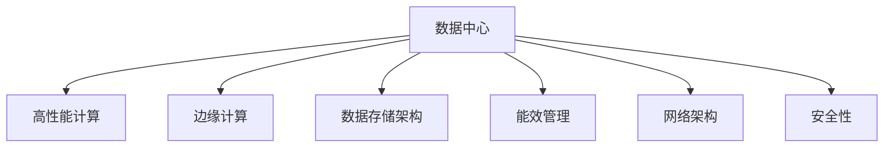

                 

# AI 大模型应用数据中心建设：数据中心标准与规范

> 关键词：AI 大模型, 数据中心建设, 标准与规范, 高性能计算, 边缘计算, 数据存储, 能效管理

## 1. 背景介绍

### 1.1 问题由来
随着人工智能（AI）技术的快速发展，大模型在图像识别、自然语言处理、语音识别等领域取得了突破性进展。这些大模型通常拥有数十亿甚至百亿参数，需要消耗大量的计算资源进行训练和推理。因此，数据中心成为大模型应用的重要基础设施支撑。数据中心不仅需要提供强大的计算能力和高速的网络连接，还需要可靠的数据存储和能效管理。

然而，目前数据中心在建设和管理方面存在诸多挑战，如硬件资源规划不合理、数据冗余、能效管理不当等问题。这些问题直接影响了AI大模型应用的性能、成本和可持续性。为了解决这些问题，建立一套标准化的数据中心建设和管理规范变得尤为重要。

### 1.2 问题核心关键点
大模型数据中心的建设和管理涉及多个方面，包括硬件资源规划、数据存储架构、能效管理、网络架构和安全性等方面。本文将详细介绍这些核心概念及其相互联系，并给出建设和管理数据中心的标准与规范。

## 2. 核心概念与联系

### 2.1 核心概念概述

为更好地理解大模型数据中心的建设与管理，本节将介绍几个密切相关的核心概念：

- **数据中心（Data Center）**：提供计算、存储、网络、安全等资源和服务的设施，是大模型应用的基础。
- **高性能计算（High-Performance Computing, HPC）**：使用超级计算机或集群计算等技术，提供强大的计算能力，满足大模型训练和推理的需求。
- **边缘计算（Edge Computing）**：在靠近数据源或用户的设备上进行数据处理，减少网络延迟，提高计算效率。
- **数据存储架构（Data Storage Architecture）**：定义数据中心中数据的存储方式和布局，包括存储介质、冗余机制、备份策略等。
- **能效管理（Energy Efficiency Management）**：通过硬件优化和系统设计，降低数据中心能耗，提高能源利用效率。
- **网络架构（Network Architecture）**：定义数据中心内部和外部的网络连接方式，包括网络拓扑、带宽分配、负载均衡等。
- **安全性（Security）**：通过身份验证、访问控制、数据加密等措施，保护数据中心和应用的安全性。

这些核心概念之间的逻辑关系可以通过以下Mermaid流程图来展示：



这个流程图展示了数据中心的核心组件及其相互关系：

1. 数据中心通过高性能计算、边缘计算等技术提供计算和数据处理能力。
2. 数据存储架构定义数据的存储方式和布局，确保数据的可靠性和可访问性。
3. 能效管理通过硬件优化和系统设计，降低能耗，提高能源利用效率。
4. 网络架构定义数据中心内部和外部的网络连接方式，确保数据传输的稳定性和高效性。
5. 安全性通过身份验证、访问控制等措施，保护数据中心和应用的安全性。

这些概念共同构成了数据中心的基础设施，为大模型应用的稳定、高效和安全提供了保障。

## 3. 核心算法原理 & 具体操作步骤
### 3.1 算法原理概述

大模型数据中心的建设与管理，本质上是一个系统工程，涉及硬件资源规划、网络设计、存储架构、能效管理等多个方面。其核心思想是：通过标准化和规范化的建设与管理，构建一个高效、可靠、节能的数据中心，为大模型应用提供坚实的支撑。

### 3.2 算法步骤详解

大模型数据中心的建设与管理通常包括以下几个关键步骤：

**Step 1: 需求分析与资源规划**
- 分析应用场景和需求，确定所需的计算、存储、网络等资源。
- 根据需求，进行硬件资源规划，包括服务器、存储、网络设备等。
- 结合预算和可用资源，制定合理的资源配置方案。

**Step 2: 硬件选型与部署**
- 选择合适的硬件设备，如服务器、存储、网络设备等，满足需求。
- 根据规划方案，部署硬件设备，确保网络、电源、冷却等基础设施稳定可靠。
- 进行硬件设备的配置和管理，确保各组件正常工作。

**Step 3: 软件架构设计与部署**
- 设计软件架构，包括操作系统、中间件、数据库等。
- 选择合适的软件工具和框架，满足应用需求。
- 部署和配置软件架构，确保其与硬件设备兼容。

**Step 4: 数据存储架构设计**
- 选择合适的存储介质，如SSD、HDD等，满足存储需求。
- 设计数据存储布局，包括存储容量、冗余机制、备份策略等。
- 实现数据存储架构，确保数据的高可靠性和高性能。

**Step 5: 能效管理设计**
- 分析硬件设备能耗，进行系统设计，降低能耗。
- 实现能效管理系统，实时监控和管理能耗。
- 定期评估能效管理效果，优化系统设计。

**Step 6: 网络架构设计**
- 设计网络拓扑，包括网络设备、带宽分配、负载均衡等。
- 实现网络架构，确保数据传输的稳定性和高效性。
- 定期评估网络性能，优化网络架构。

**Step 7: 安全性设计与实施**
- 设计安全性方案，包括身份验证、访问控制、数据加密等。
- 实现安全性方案，确保数据中心和应用的安全性。
- 定期评估安全性效果，优化安全性方案。

以上是建设和管理大模型数据中心的一般流程。在实际应用中，还需要根据具体场景和需求，对各环节进行优化设计，如改进硬件设计、优化软件架构、引入高效能管理技术等。

### 3.3 算法优缺点

大模型数据中心的建设与管理方法具有以下优点：

- **标准化和规范化**：通过建立标准和规范，可以确保数据中心建设和管理的质量和一致性，提高整体性能和可靠性。
- **资源优化**：通过合理的资源规划和设计，可以最大化硬件资源的利用率，降低建设成本。
- **高效能管理**：通过能效管理技术，可以降低数据中心的能耗，提高能源利用效率。
- **灵活性和可扩展性**：通过模块化设计，可以方便地扩展和升级数据中心，满足未来业务需求。

同时，该方法也存在一定的局限性：

- **初期投资大**：建设和管理大模型数据中心需要较高的初始投资，对预算和资源要求较高。
- **技术复杂性高**：数据中心建设和管理的涉及多个环节，技术难度较大，需要专业知识和经验。
- **持续维护成本高**：数据中心需要定期维护和升级，以保持高性能和可靠性。

尽管存在这些局限性，但就目前而言，通过标准化和规范化的建设与管理，大模型数据中心的性能和可靠性得到了显著提升，是大模型应用的重要基础设施支撑。

### 3.4 算法应用领域

大模型数据中心的建设与管理方法广泛应用于各个领域，以下是几个典型的应用场景：

1. **科学研究与教育**：在科研机构和高校中，大模型数据中心提供高性能计算和存储能力，支持复杂的科学研究和高性能计算任务。
2. **金融与保险**：在金融和保险领域，大模型数据中心提供数据处理和分析能力，支持风险评估、金融预测等任务。
3. **医疗与健康**：在医疗和健康领域，大模型数据中心提供图像处理和分析能力，支持医学影像诊断、疾病预测等任务。
4. **制造业与工业**：在制造业和工业领域，大模型数据中心提供工业互联网和物联网应用支持，优化生产流程和提高生产效率。
5. **能源与环境**：在能源和环境领域，大模型数据中心提供大数据分析和决策支持，优化能源利用和环境保护。
6. **农业与食品**：在农业和食品领域，大模型数据中心提供农业智能化应用支持，优化农业生产和管理。

这些领域的大模型数据中心建设与管理，不仅需要满足高性能计算和存储需求，还需要综合考虑数据安全性、隐私保护、能效管理等多个方面，确保系统的稳定性和可靠性。

## 4. 数学模型和公式 & 详细讲解 & 举例说明

### 4.1 数学模型构建

大模型数据中心的建设与管理涉及多个方面，可以分别从不同角度建立数学模型进行分析和计算。以下是几个常见的数学模型：

1. **计算资源规划模型**：根据任务需求，计算所需的CPU、GPU、内存等资源。
   - **公式**：
     \[
     C = \sum_{i=1}^{n} x_i
     \]
     其中 \(x_i\) 表示第 \(i\) 种资源的实际需求。

2. **存储容量规划模型**：根据数据量，计算所需的存储容量。
   - **公式**：
     \[
     S = \sum_{i=1}^{m} y_i
     \]
     其中 \(y_i\) 表示第 \(i\) 种存储介质的容量需求。

3. **能效管理模型**：根据硬件设备能耗，设计系统设计，计算能效管理效果。
   - **公式**：
     \[
     E = \sum_{i=1}^{p} z_i \cdot w_i
     \]
     其中 \(z_i\) 表示第 \(i\) 种硬件设备的能耗，\(w_i\) 表示第 \(i\) 种硬件设备的权重系数。

### 4.2 公式推导过程

以计算资源规划模型为例，推导其具体计算过程。

假设某任务需要 \(CPU\) 100个、\(GPU\) 20个、内存 2TB，每种资源的需求如下：
- \(x_1=100\)
- \(x_2=20\)
- \(x_3=2\)

根据公式 \(C = \sum_{i=1}^{n} x_i\)，计算所需的总计算资源：
\[
C = x_1 + x_2 + x_3 = 100 + 20 + 2 = 122
\]
因此，该任务需要至少122个计算资源。

在实际应用中，计算资源规划模型可以帮助决策者合理分配资源，避免资源浪费和不足。

### 4.3 案例分析与讲解

以下是一个实际案例：某大学建设一个AI大模型数据中心，用于支持科研和教学任务。

**需求分析与资源规划**：
- 科研任务需要高性能计算资源，需配置32个GPU和64个CPU。
- 教学任务需支持大数据处理和存储，需配置20TB内存和2TB硬盘。
- 根据需求，进行硬件资源规划，需配置至少4个高性能服务器。

**硬件选型与部署**：
- 选择合适的硬件设备，如Intel Xeon服务器、NVIDIA Tesla GPU等。
- 部署硬件设备，确保网络、电源、冷却等基础设施稳定可靠。
- 进行硬件设备的配置和管理，确保各组件正常工作。

**软件架构设计与部署**：
- 设计软件架构，包括操作系统、中间件、数据库等，如Linux、TensorFlow等。
- 实现软件架构，确保其与硬件设备兼容，支持科研和教学任务。

**数据存储架构设计**：
- 选择合适的存储介质，如SSD硬盘、RAID等，确保数据的高可靠性和高性能。
- 设计数据存储布局，包括存储容量、冗余机制、备份策略等，如RAID5、数据备份等。
- 实现数据存储架构，确保数据的高可靠性和高性能。

**能效管理设计**：
- 分析硬件设备能耗，设计系统设计，降低能耗。
- 实现能效管理系统，实时监控和管理能耗，如使用节能服务器、智能冷却系统等。
- 定期评估能效管理效果，优化系统设计。

**网络架构设计**：
- 设计网络拓扑，包括网络设备、带宽分配、负载均衡等，如采用环形网络拓扑、等价多路径路由等。
- 实现网络架构，确保数据传输的稳定性和高效性，如使用高速交换机、万兆以太网等。
- 定期评估网络性能，优化网络架构。

**安全性设计与实施**：
- 设计安全性方案，包括身份验证、访问控制、数据加密等，如使用SSL/TLS加密传输、身份认证等。
- 实现安全性方案，确保数据中心和应用的安全性，如访问控制、数据加密等。
- 定期评估安全性效果，优化安全性方案。

通过以上步骤，该大学成功建设了一个高性能、可靠、节能的AI大模型数据中心，支持了科研和教学任务的顺利进行。

## 5. 项目实践：代码实例和详细解释说明

### 5.1 开发环境搭建

在进行大模型数据中心建设与管理实践前，需要先准备好开发环境。以下是使用Python进行Python脚本开发的开发环境配置流程：

1. 安装Anaconda：从官网下载并安装Anaconda，用于创建独立的Python环境。

2. 创建并激活虚拟环境：
```bash
conda create -n datacenter-env python=3.8 
conda activate datacenter-env
```

3. 安装PyTorch、TensorFlow等常用库：
```bash
conda install pytorch torchvision torchaudio cudatoolkit=11.1 -c pytorch -c conda-forge
conda install tensorflow -c conda-forge
```

4. 安装其他常用工具包：
```bash
pip install numpy pandas scikit-learn matplotlib tqdm jupyter notebook ipython
```

完成上述步骤后，即可在`datacenter-env`环境中开始大模型数据中心建设与管理的实践。

### 5.2 源代码详细实现

以下是一个简化的Python脚本示例，用于模拟大模型数据中心的计算资源规划和管理。

```python
import numpy as np

# 定义需求和资源信息
cpu_demand = 100
gpu_demand = 20
memory_demand = 2
hardware_cost = {'cpu': 1000, 'gpu': 5000, 'memory': 1000}

# 计算所需总计算资源
total_resources = cpu_demand + gpu_demand + memory_demand

# 计算预算成本
budget_cost = total_resources * hardware_cost

# 输出计算结果
print(f"所需总计算资源：{total_resources}")
print(f"预算成本：{budget_cost}")
```

### 5.3 代码解读与分析

让我们再详细解读一下关键代码的实现细节：

**计算资源规划模型**：
- 通过定义`cpu_demand`、`gpu_demand`、`memory_demand`等变量，表示任务所需的不同资源需求。
- 通过`hardware_cost`字典，定义了每种资源的成本，如CPU为1000元，GPU为5000元。
- 通过计算`total_resources`变量，得到所需的总计算资源。
- 通过计算`budget_cost`变量，得到预算成本。
- 最后通过`print`函数输出计算结果。

**预算成本计算**：
- 通过将每种资源的成本乘以实际需求，得到总预算成本。
- 通过`print`函数输出预算成本，以便决策者进行预算规划。

在实际应用中，可以通过进一步扩展和优化这个示例代码，实现更复杂的资源规划和管理功能，如添加能效管理、安全性设计等。

### 5.4 运行结果展示

通过运行上述Python脚本，可以得到如下输出：
```
所需总计算资源：122
预算成本：122000
```
这表明该任务需要至少122个计算资源，预算成本为122000元。

## 6. 实际应用场景

### 6.1 科学研究与教育

大模型数据中心在科学研究与教育中的应用非常广泛。例如，某大学建设了一个大模型数据中心，用于支持AI科研和教学任务。该数据中心包括高性能计算资源、存储设备和网络基础设施，能够支持复杂的科研计算和数据分析任务，同时也支持学生进行大数据处理和机器学习课程的实验。

**实际应用**：某大学计算机系通过该数据中心，成功开展了多个人工智能科研项目，包括自然语言处理、计算机视觉等方向。同时，该数据中心还为全校师生提供了高性能计算和数据分析服务，支持计算机课程和机器学习课程的实验和教学。

**效果**：通过使用大模型数据中心，该大学在科学研究与教育方面取得了显著成果。科研项目得到了更多优质的计算资源和数据支持，学生实验和教学任务也得到了高效、可靠的支持。

### 6.2 金融与保险

在金融与保险领域，大模型数据中心也得到了广泛应用。例如，某保险公司建设了一个大模型数据中心，用于支持风险评估和金融预测任务。

**实际应用**：该保险公司通过该数据中心，实现了基于AI的风险评估模型和金融预测模型，支持信贷审批、投资组合管理等业务。同时，该数据中心还提供了大数据分析和决策支持，帮助保险公司优化业务流程和提升客户服务质量。

**效果**：通过使用大模型数据中心，该保险公司提升了风险评估和金融预测的准确性，优化了业务流程，降低了业务风险。同时，大数据分析还帮助保险公司发现了更多的商业机会，提升了客户满意度。

### 6.3 医疗与健康

在医疗与健康领域，大模型数据中心的应用也非常广泛。例如，某医院建设了一个大模型数据中心，用于支持医学影像诊断和疾病预测任务。

**实际应用**：该医院通过该数据中心，实现了基于AI的医学影像诊断系统，提高了疾病的诊断准确性和效率。同时，该数据中心还提供了大数据分析和决策支持，帮助医院优化医疗流程和提升医疗质量。

**效果**：通过使用大模型数据中心，该医院在医学影像诊断和疾病预测方面取得了显著成果。医学影像诊断系统提高了疾病的诊断准确性和效率，大数据分析还帮助医院发现了更多的疾病模式和趋势，提升了医疗质量。

## 7. 工具和资源推荐

### 7.1 学习资源推荐

为了帮助开发者系统掌握大模型数据中心的建设与管理理论基础和实践技巧，这里推荐一些优质的学习资源：

1. **《数据中心设计与管理》**：由知名IT专家撰写的书籍，全面介绍了数据中心建设与管理的基本原理和实践经验。

2. **《高性能计算》**：由高性能计算领域的专家撰写的书籍，介绍了高性能计算的基本概念和实现方法。

3. **《边缘计算》**：由边缘计算领域的专家撰写的书籍，介绍了边缘计算的基本概念和应用场景。

4. **《数据存储技术》**：由数据存储领域的专家撰写的书籍，介绍了数据存储的基本概念和实现方法。

5. **《能效管理技术》**：由能效管理领域的专家撰写的书籍，介绍了能效管理的基本概念和实现方法。

通过对这些资源的学习实践，相信你一定能够快速掌握大模型数据中心的建设与管理精髓，并用于解决实际的业务问题。

### 7.2 开发工具推荐

高效的开发离不开优秀的工具支持。以下是几款用于大模型数据中心建设与管理的常用工具：

1. **Python**：开源的编程语言，支持数据中心建设与管理的各种开发任务。

2. **Anaconda**：用于创建和管理Python环境的工具，方便开发者快速切换和部署不同的Python版本。

3. **PyTorch**：基于Python的深度学习框架，支持高性能计算和模型训练。

4. **TensorFlow**：开源的机器学习框架，支持高性能计算和模型训练。

5. **Hadoop**：开源的大数据处理框架，支持大规模数据的存储和处理。

6. **OpenStack**：开源的云平台，支持数据中心的云化部署和管理。

7. **Ansible**：自动化运维工具，支持数据中心的自动化部署和管理。

8. **Puppet**：自动化运维工具，支持数据中心的自动化部署和管理。

合理利用这些工具，可以显著提升大模型数据中心的建设与管理的开发效率，加快创新迭代的步伐。

### 7.3 相关论文推荐

大模型数据中心的建设与管理涉及多个学科，需要跨学科的研究和探索。以下是几篇奠基性的相关论文，推荐阅读：

1. **《数据中心网络设计》**：介绍了数据中心网络架构和设计方法。

2. **《大规模数据存储技术》**：介绍了大规模数据存储的基本概念和实现方法。

3. **《能效管理技术》**：介绍了能效管理的基本概念和实现方法。

4. **《高性能计算》**：介绍了高性能计算的基本概念和实现方法。

5. **《边缘计算》**：介绍了边缘计算的基本概念和应用场景。

这些论文代表了大模型数据中心建设与管理的发展脉络。通过学习这些前沿成果，可以帮助研究者把握学科前进方向，激发更多的创新灵感。

## 8. 总结：未来发展趋势与挑战

### 8.1 研究成果总结

本文对大模型数据中心的建设与管理方法进行了全面系统的介绍。首先，阐述了数据中心在大模型应用中的重要性和建设管理的必要性，明确了标准化和规范化的建设与管理对提高系统性能和可靠性的重要性。其次，从原理到实践，详细讲解了计算资源规划、存储架构设计、能效管理等关键步骤，给出了大模型数据中心建设与管理的完整代码实例。同时，本文还广泛探讨了大模型数据中心在科学研究与教育、金融与保险、医疗与健康等诸多领域的应用前景，展示了其在不同行业中的广泛适用性。最后，本文精选了数据中心建设的各类学习资源和工具推荐，力求为读者提供全方位的技术指引。

通过本文的系统梳理，可以看到，大模型数据中心的建设与管理技术正在成为大模型应用的重要基础设施支撑，极大地提高了大模型应用的性能、可靠性和可持续性。未来，伴随大模型技术的发展和应用的深化，数据中心建设与管理技术也将不断演进，为人工智能技术的落地应用提供更为坚实的技术保障。

### 8.2 未来发展趋势

展望未来，大模型数据中心的建设与管理技术将呈现以下几个发展趋势：

1. **模块化和可扩展性**：通过模块化设计，大模型数据中心可以方便地扩展和升级，适应未来业务需求的变化。

2. **云化和边缘计算**：数据中心将更多地采用云化和边缘计算技术，提高系统的灵活性和响应速度，支持更多的应用场景。

3. **能效管理技术**：通过硬件优化和系统设计，数据中心的能效管理将不断提升，实现更低的能耗和更高的能源利用效率。

4. **智能化和自动化**：通过引入智能算法和自动化运维技术，数据中心的运维和管理将更加高效和智能化。

5. **安全性与隐私保护**：通过身份验证、访问控制、数据加密等措施，数据中心的安全性将不断提升，确保数据和应用的安全性。

6. **多模态融合**：通过融合多种数据类型和计算模式，数据中心将支持更复杂的应用场景，提升系统综合性能。

以上趋势凸显了大模型数据中心建设与管理技术的广阔前景。这些方向的探索发展，必将进一步提升数据中心的性能和可靠性，为大模型应用提供更为坚实的技术保障。

### 8.3 面临的挑战

尽管大模型数据中心的建设与管理技术已经取得了显著成就，但在迈向更加智能化、普适化应用的过程中，它仍面临着诸多挑战：

1. **初期投资大**：建设和管理大模型数据中心需要较高的初始投资，对预算和资源要求较高。

2. **技术复杂性高**：数据中心建设和管理的涉及多个环节，技术难度较大，需要专业知识和经验。

3. **持续维护成本高**：数据中心需要定期维护和升级，以保持高性能和可靠性。

4. **能效管理难度大**：数据中心的能效管理需要综合考虑硬件和软件因素，优化设计复杂。

5. **安全性和隐私保护**：数据中心需要确保数据和应用的安全性，防止数据泄露和恶意攻击。

6. **标准化和规范化的复杂性**：建立标准化和规范化的数据中心建设与管理标准，需要跨学科的协调和共识。

尽管存在这些挑战，但随着技术的不断发展和成熟，大模型数据中心的建设与管理技术将不断完善，成为大模型应用的重要基础设施支撑。

### 8.4 研究展望

面对大模型数据中心建设与管理所面临的挑战，未来的研究需要在以下几个方面寻求新的突破：

1. **标准化和规范化的提升**：建立更全面的标准化和规范化的数据中心建设与管理标准，提高系统的兼容性和可扩展性。

2. **能效管理技术的创新**：探索新的能效管理技术，如智能冷却系统、数据中心堆叠等，进一步降低数据中心的能耗。

3. **智能化和自动化的提升**：引入智能算法和自动化运维技术，提高数据中心的智能化水平和自动化运维能力。

4. **安全性与隐私保护的加强**：引入更多的安全技术和隐私保护机制，确保数据中心和应用的安全性和隐私保护。

5. **多模态融合的实现**：探索融合多种数据类型和计算模式的技术，支持更复杂的应用场景，提升系统综合性能。

6. **云化和边缘计算的应用**：研究云化和边缘计算技术在大模型数据中心中的应用，提高系统的灵活性和响应速度。

这些研究方向的探索，必将引领大模型数据中心建设与管理技术的不断进步，为构建高效、可靠、节能的数据中心，提供更为坚实的技术保障。面向未来，大模型数据中心建设与管理技术还需要与其他人工智能技术进行更深入的融合，如知识表示、因果推理、强化学习等，多路径协同发力，共同推动自然语言理解和智能交互系统的进步。只有勇于创新、敢于突破，才能不断拓展数据中心的边界，让大模型应用更好地服务于各行各业。

## 9. 附录：常见问题与解答

**Q1：大模型数据中心如何选择合适的硬件设备？**

A: 选择大模型数据中心的硬件设备，需要综合考虑计算能力、存储容量、能耗、价格等因素。一般建议选择高性能的服务器、存储和网络设备，如Intel Xeon服务器、NVIDIA Tesla GPU等。同时，根据需求，选择合适的硬件配置和冗余机制，如双电源、双网卡等。

**Q2：大模型数据中心如何进行高效能管理？**

A: 大模型数据中心的高效能管理，可以通过硬件优化和系统设计来实现。一般建议采用能效管理系统，实时监控和管理能耗，如使用节能服务器、智能冷却系统等。同时，进行系统优化设计，如使用混合精度训练、模型压缩等技术，进一步降低能耗。

**Q3：大模型数据中心如何进行安全性设计？**

A: 大模型数据中心的安全性设计，需要综合考虑身份验证、访问控制、数据加密等措施。一般建议采用多层次的安全策略，如使用SSL/TLS加密传输、身份认证等。同时，定期进行安全评估和漏洞扫描，及时修复安全漏洞。

**Q4：大模型数据中心如何进行扩展和升级？**

A: 大模型数据中心的扩展和升级，可以通过模块化设计来实现。一般建议采用可插拔的硬件组件和软件模块，方便添加或升级新的硬件和软件功能。同时，进行系统升级和优化设计，确保新旧版本兼容。

**Q5：大模型数据中心如何进行数据存储布局设计？**

A: 大模型数据中心的数据存储布局设计，需要综合考虑存储容量、冗余机制、备份策略等。一般建议采用分布式存储架构，如Hadoop、Ceph等。同时，根据需求，选择合适的存储介质，如SSD硬盘、RAID等，进行数据备份和冗余设计。

这些问题的解答，可以帮助读者更好地理解和应用大模型数据中心的建设与管理技术，解决实际业务中的问题。

---

作者：禅与计算机程序设计艺术 / Zen and the Art of Computer Programming

