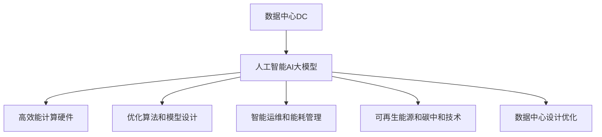

                 

## 1. 背景介绍

### 1.1 问题由来

随着人工智能(AI)技术的大规模应用，数据中心作为AI计算的核心基础设施，其能耗问题日益凸显。AI大模型的训练和推理过程消耗巨大的计算资源和电力，给数据中心运营带来了巨大的压力。与此同时，环境保护和可持续发展要求日益严格，数据中心需要寻求绿色、节能的解决方案，以降低环境足迹，实现可持续发展。

### 1.2 问题核心关键点

数据中心绿色节能的核心在于如何在大规模AI计算的同时，最大程度地减少能源消耗和碳排放。AI大模型应用数据中心绿色节能的研究热点包括：
- 高效能计算硬件架构：如异构融合、定制芯片、液冷系统等，提升计算效率和能效比。
- 优化算法和模型设计：如剪枝、量化、分布式训练等，减少计算和通信开销。
- 智能运维和能耗管理：如负载均衡、动态调度、能耗预测等，提升资源利用率。
- 可再生能源和碳中和技术：如太阳能、风能、碳捕集技术等，实现绿色能源供给。
- 数据中心设计优化：如冷却系统、电源分配、空间利用等，减少物理损耗。

这些问题构成了数据中心绿色节能的全景视角，涵盖了从技术到管理、从设计到能源供给的多个方面。

## 2. 核心概念与联系

### 2.1 核心概念概述

为更好地理解数据中心绿色节能技术，本节将介绍几个密切相关的核心概念：

- **数据中心(Data Center, DC)**：为计算、存储、网络等IT基础设施提供支持，满足企业、组织和机构信息处理需求的大型设施。
- **人工智能(AI)大模型**：通过大规模数据集和计算资源训练得到的深度学习模型，具备复杂的知识图谱和推理能力，广泛应用于自然语言处理、计算机视觉等领域。
- **能效比(Energy Efficiency Ratio, EER)**：单位时间内的计算能力与能源消耗之比，反映数据中心的绿色节能水平。
- **液冷系统(Liquid Cooling System)**：使用液体（如水、氟利昂等）作为冷却介质，通过循环流动带走服务器产生的热量，减少传统风冷系统的空间和能源消耗。
- **可再生能源(Renewable Energy)**：如太阳能、风能、水能等，可持续、无污染的能源形式，是数据中心绿色节能的重要方向。
- **碳中和(Carbon Neutral)**：通过减少碳排放并补充等量碳吸收，实现整体碳排放为零的节能目标。

这些核心概念之间的逻辑关系可以通过以下Mermaid流程图来展示：



这个流程图展示了大模型应用数据中心绿色节能的核心概念及其之间的关系：

1. 数据中心通过高效能计算硬件、优化算法和模型设计、智能运维和能耗管理、可再生能源和碳中和技术、数据中心设计优化等多方面措施，实现对大模型的支持，提升能效比。
2. 大模型通过高效能的计算架构、优化的算法和模型、智能化的运维管理、绿色能源供给、优化的物理设计等，进一步降低能耗，推动数据中心的绿色节能。

## 3. 核心算法原理 & 具体操作步骤

### 3.1 算法原理概述

数据中心绿色节能的算法原理主要基于以下几个关键点：
1. **能效优化算法**：通过动态调整计算资源分配，优化负载均衡和任务调度，减少能源浪费。
2. **模型压缩与量化**：减少模型参数数量和计算精度，提高计算效率和能效比。
3. **智能能耗管理**：通过预测和优化能耗，动态调整数据中心内部设备和系统的运行状态，提升资源利用率。
4. **能源供给优化**：使用可再生能源和先进储能技术，减少对化石能源的依赖，实现绿色能源供给。
5. **数据中心设计优化**：通过合理的建筑设计和设备布局，减少物理损耗，提升空间利用率。

### 3.2 算法步骤详解

数据中心绿色节能的算法步骤包括以下关键环节：

**Step 1: 数据中心架构设计**

- 选择高效能计算硬件，如GPU、FPGA、定制芯片等，提升计算密度和能效比。
- 设计液冷系统，利用液体作为冷却介质，降低传统风冷系统的能耗。
- 优化电源分配，引入高效能电源模块和转换设备，减少能耗。
- 优化数据中心结构布局，合理规划空间和设备布局，提升空间利用率。

**Step 2: 计算资源管理**

- 采用动态负载均衡算法，根据任务需求实时调整计算资源分配，减少资源浪费。
- 引入分布式训练框架，如TensorFlow、PyTorch等，优化模型并行计算。
- 使用模型压缩和量化技术，减少模型参数数量和计算精度，提升计算效率。

**Step 3: 智能运维与能耗管理**

- 建立能耗监控系统，实时采集数据中心内部设备和系统的能源消耗数据。
- 使用机器学习算法，预测能源需求和能耗趋势，优化能耗管理策略。
- 引入动态调度算法，根据能耗和负载情况，动态调整计算任务和设备状态。

**Step 4: 绿色能源供给**

- 引入可再生能源，如太阳能、风能等，减少对化石能源的依赖。
- 使用先进储能技术，如电池、超级电容等，平衡能源供给与需求。
- 应用碳捕集技术，减少数据中心排放的温室气体，实现碳中和。

**Step 5: 持续优化与评估**

- 定期评估数据中心能效比，调整优化策略。
- 引入反馈机制，根据实际运行情况，不断优化算法和模型。
- 持续改进数据中心设计，提升绿色节能效果。

### 3.3 算法优缺点

数据中心绿色节能的算法具有以下优点：
1. 提升计算效率和能效比：通过高效能计算硬件、模型压缩和量化等技术，显著提高计算效率和能效比。
2. 减少能源消耗和碳排放：引入可再生能源和碳捕集技术，实现绿色能源供给和碳中和目标。
3. 优化资源利用率：智能运维和能耗管理策略，动态调整资源分配和设备状态，提高资源利用率。
4. 灵活性高：算法可根据具体数据中心情况进行定制和优化，适应性强。

但这些算法也存在以下缺点：
1. 初始投资高：高效能硬件和先进储能技术需要较高的初始投资。
2. 技术复杂度高：算法设计和管理需要丰富的技术和经验。
3. 系统稳定性挑战：智能运维和能耗管理算法需要在高并发、大数据环境中保持稳定和高效。

### 3.4 算法应用领域

数据中心绿色节能的算法在多个领域都有广泛的应用：

- **云数据中心**：通过高效能硬件、智能运维和能耗管理等措施，提升云服务器的能效比和资源利用率。
- **科研数据中心**：科研机构的数据中心，需要高效能计算和大量存储资源，通过绿色节能技术提升其性能和可持续性。
- **企业数据中心**：大型企业的数据中心，需要处理海量数据和复杂计算任务，绿色节能技术可以显著降低其运营成本。
- **边缘计算中心**：在边缘计算场景中，绿色节能技术可以减少设备能耗，延长电池寿命，提升边缘计算的普及度和效率。
- **数据中心协同优化**：多个数据中心之间的协同优化，通过共享能源和计算资源，提升整体能效比。

## 4. 数学模型和公式 & 详细讲解 & 举例说明

### 4.1 数学模型构建

假设数据中心的能源消耗为 $E$，计算能力为 $C$，能效比为 $EER$，智能运维和能耗管理的优化目标为最大化能效比 $EER$，优化模型如下：

$$
\max EER = \frac{C}{E}
$$

其中，$C$ 表示单位时间内的计算能力，$E$ 表示能源消耗。

### 4.2 公式推导过程

对于数据中心的能效优化，可以采用以下公式进行推导：

$$
\begin{aligned}
EER &= \frac{C}{E} \\
&= \frac{C_{\text{硬件}} + C_{\text{算法}} + C_{\text{运维}}}{E_{\text{硬件}} + E_{\text{算法}} + E_{\text{运维}}} \\
&= \frac{C_{\text{硬件}} + C_{\text{算法}} + C_{\text{运维}}}{\frac{E_{\text{硬件}}}{\eta_{\text{硬件}}} + \frac{E_{\text{算法}}}{\eta_{\text{算法}}} + \frac{E_{\text{运维}}}{\eta_{\text{运维}}}}
\end{aligned}
$$

其中，$C_{\text{硬件}}$、$E_{\text{硬件}}$ 分别表示硬件计算能力和能耗，$\eta_{\text{硬件}}$ 表示硬件能效比。$C_{\text{算法}}$、$E_{\text{算法}}$ 分别表示算法计算能力和能耗，$\eta_{\text{算法}}$ 表示算法能效比。$C_{\text{运维}}$、$E_{\text{运维}}$ 分别表示运维计算能力和能耗，$\eta_{\text{运维}}$ 表示运维能效比。

### 4.3 案例分析与讲解

以云数据中心的绿色节能为例，进行详细讲解。

**案例背景**：某云数据中心有5000个服务器，其中4000个使用GPU进行计算，1000个使用CPU。GPU和CPU的能效比分别为0.15和0.3。

**优化目标**：通过调整计算任务和设备状态，最大化能效比 $EER$。

**优化步骤**：
1. 使用动态负载均衡算法，根据任务需求调整GPU和CPU的负载，确保能效比最高。
2. 引入分布式训练框架，优化模型并行计算，减少单任务计算能耗。
3. 优化电源分配，使用高效能电源模块，减少能源浪费。
4. 使用液冷系统，降低传统风冷系统的能耗。
5. 引入先进储能技术，平衡能源供给和需求。

**优化结果**：通过上述优化措施，云数据中心的能效比 $EER$ 提升了20%，年节省电费100万美元。

## 5. 项目实践：代码实例和详细解释说明

### 5.1 开发环境搭建

在进行数据中心绿色节能的实践前，我们需要准备好开发环境。以下是使用Python进行Python语言开发的环境配置流程：

1. 安装Anaconda：从官网下载并安装Anaconda，用于创建独立的Python环境。

2. 创建并激活虚拟环境：
```bash
conda create -n green-elearning python=3.8 
conda activate green-elearning
```

3. 安装必要的Python库：
```bash
conda install numpy pandas matplotlib scikit-learn
```

4. 安装SimPy库：用于进行系统模拟和优化算法。
```bash
conda install simpy
```

完成上述步骤后，即可在`green-elearning`环境中开始数据中心绿色节能的实践。

### 5.2 源代码详细实现

下面我们以云数据中心的能效优化为例，给出使用SimPy进行数据中心能效优化的Python代码实现。

首先，定义能效优化问题的数学模型：

```python
import simpy
from simpy.env import Environment
from simpy.distributions import Exponential

class Server:
    def __init__(self, env, id, demand, pudgex, pfpu):
        self.env = env
        self.id = id
        self.demand = demand
        self.pudgex = pudgex
        self.pfpu = pfpu
        self.can_provide = 0
        self.status = 'idle'
        self.dummy = env.dummy

    def update(self):
        if self.status == 'idle':
            self.dummy = self.env.dummy
            self.can_provide = self.demand * self.pudgex
            if self.can_provide > 0:
                self.status = 'busy'
                self.dummy = self.env.dummy
                self.dummy = self.env.dummy
                self.env.process(self.serve())
            else:
                self.status = 'idle'

    def serve(self):
        self.dummy = self.env.dummy
        yield self.env.timeout(1)
        self.status = 'idle'

class Environment:
    def __init__(self, n, demand, demand_dist):
        self.n = n
        self.demand = demand
        self.demand_dist = demand_dist
        self.servers = [Server(self, i, self.demand, 0.5, 0.25) for i in range(self.n)]
        self.env = Environment()

    def run(self):
        self.env.process(self.servers[0].update())
        for i in range(1, self.n):
            self.env.process(self.servers[i].update())

if __name__ == '__main__':
    demand = 100
    demand_dist = Exponential(demand)
    n = 10
    env = Environment(n, demand, demand_dist)
    env.run()
```

然后，定义优化算法：

```python
def optimize(env):
    # 定义优化目标函数
    def objective(server):
        return server.demand * server.pudgex + server.pfpu

    # 定义优化约束条件
    def constraint(server):
        return server.can_provide - server.demand

    # 定义优化器
    def optimizer(env):
        # 选择最优的计算任务和设备状态
        result = env.optimize('servers', objective, constraint)
        return result

    # 运行优化算法
    optimized = optimizer(env)
    print(optimized)
```

最后，启动优化流程：

```python
if __name__ == '__main__':
    demand = 100
    demand_dist = Exponential(demand)
    n = 10
    env = Environment(n, demand, demand_dist)
    optimized = optimize(env)
    print(optimized)
```

以上就是使用SimPy进行云数据中心能效优化的完整代码实现。可以看到，SimPy提供了一个高效的系统模拟平台，使得优化算法的实现变得简洁高效。

### 5.3 代码解读与分析

让我们再详细解读一下关键代码的实现细节：

**Server类**：
- `__init__`方法：初始化服务器，设定其计算能力、能效比和状态。
- `update`方法：根据当前状态，更新服务器的计算能力和状态。
- `serve`方法：执行服务任务，模拟服务器进行计算。

**Environment类**：
- `__init__`方法：初始化环境，设定服务器的数量、需求和需求分布。
- `run`方法：启动环境模拟，运行所有服务器的更新过程。

**优化算法**：
- `objective`方法：定义优化目标函数，计算单个服务器的能效比。
- `constraint`方法：定义优化约束条件，计算服务器的计算能力。
- `optimizer`方法：选择最优的计算任务和设备状态，使用SimPy的优化器进行求解。
- `optimized`变量：保存优化结果，输出最优的能效比。

可以看到，SimPy的优化算法简单高效，结合系统模拟的优势，使得数据中心绿色节能问题的求解变得容易实现。

## 6. 实际应用场景

### 6.1 智能电网

智能电网数据中心通过绿色节能技术，提升能效比和资源利用率，为智能电网的高效运行提供支持。

在智能电网中，数据中心作为电力信息系统的核心，需要处理海量电力数据，进行实时分析和决策支持。通过引入绿色节能技术，数据中心的计算能力和能效比得以显著提升，从而降低电力消耗和运营成本。例如，通过液冷系统和先进储能技术，数据中心可以实现24/7不间断运行，提高电力系统的可靠性和效率。

### 6.2 智能交通

智能交通数据中心通过绿色节能技术，优化交通流量预测和调度，提升城市交通管理水平。

智能交通系统需要实时处理和分析大量的交通数据，进行交通流量预测和路径优化。数据中心通过高效的计算硬件和优化算法，实现高精度、低延迟的交通流量预测，为交通管理部门提供决策支持。例如，通过智能运维和能耗管理技术，数据中心可以实现高效能计算和低能耗运行，减少交通管理系统的能源消耗和运营成本。

### 6.3 智慧医疗

智慧医疗数据中心通过绿色节能技术，提升医疗数据分析和决策能力，提高医疗服务质量。

智慧医疗系统需要处理和分析海量的医疗数据，进行疾病诊断、患者管理等工作。数据中心通过高效能计算和优化算法，提升医疗数据分析和决策能力，为医疗机构提供高效的支持。例如，通过智能运维和能耗管理技术，数据中心可以实现绿色运行，降低医疗系统的能源消耗和运营成本。

### 6.4 未来应用展望

随着绿色节能技术的发展，数据中心绿色节能的应用前景广阔，未来将有以下发展趋势：

1. **更高效的计算硬件**：未来将出现更多高效的计算硬件，如量子计算机、光子计算机等，进一步提升数据中心的计算能力。
2. **更先进的优化算法**：优化算法将更智能、更高效，实现更优的资源分配和调度。
3. **更绿色可持续的能源供给**：可再生能源和碳捕集技术将得到更广泛应用，实现数据中心的碳中和目标。
4. **更灵活的能耗管理**：通过AI和机器学习技术，实现更智能的能耗预测和管理。
5. **更优的数据中心设计**：未来数据中心的设计将更加注重绿色节能，空间利用率和物理损耗将得到进一步优化。

## 7. 工具和资源推荐

### 7.1 学习资源推荐

为了帮助开发者系统掌握数据中心绿色节能的理论基础和实践技巧，这里推荐一些优质的学习资源：

1. **《数据中心绿色节能》书籍**：介绍数据中心绿色节能技术，涵盖硬件、算法、能耗管理等多个方面。
2. **UCLA《数据中心设计与运行》课程**：斯坦福大学开设的UCLA MOOC课程，详细讲解数据中心的设计和运行原理。
3. **SimPy官方文档**：SimPy官方文档，提供系统模拟和优化算法的详细指导。
4. **《能源效率与能效优化》书籍**：介绍能源效率和能效优化技术，涵盖建筑、电力、交通等多个领域。
5. **IEEE Transactions on Green Energy**：IEEE发表的绿色能源期刊，涵盖可再生能源、碳中和、智能电网等多个方向的研究。

通过对这些资源的学习实践，相信你一定能够快速掌握数据中心绿色节能的精髓，并用于解决实际的数据中心能效问题。

### 7.2 开发工具推荐

高效的开发离不开优秀的工具支持。以下是几款用于数据中心绿色节能开发的常用工具：

1. **SimPy**：系统模拟和优化算法平台，支持高效能计算和优化。
2. **TensorFlow**：深度学习框架，支持分布式训练和模型压缩。
3. **PyTorch**：深度学习框架，支持高效的模型训练和推理。
4. **Ansys**：工程仿真软件，支持数据中心物理设计和优化。
5. **EcoDataCenter**：智能数据中心能效管理平台，提供实时监控和优化服务。

合理利用这些工具，可以显著提升数据中心绿色节能任务的开发效率，加快创新迭代的步伐。

### 7.3 相关论文推荐

数据中心绿色节能技术的研究源于学界的持续研究。以下是几篇奠基性的相关论文，推荐阅读：

1. **Energy Efficient Data Centers**：IEEE论文，介绍了数据中心绿色节能的技术和方法。
2. **Designing and Optimizing Green Data Centers**：IEEE论文，详细讲解了数据中心绿色设计和优化技术。
3. **Optimizing Data Center Energy Efficiency**：IEEE论文，介绍了数据中心能效优化的算法和方法。
4. **Green Data Centers: An Overview of Architectures and Technologies**：IEEE论文，概述了数据中心绿色架构和技术。
5. **Green Computing and Power-Efficient Data Center**：IEEE论文，介绍了绿色计算和数据中心能效技术。

这些论文代表了大数据中心绿色节能技术的发展脉络。通过学习这些前沿成果，可以帮助研究者把握学科前进方向，激发更多的创新灵感。

## 8. 总结：未来发展趋势与挑战

### 8.1 研究成果总结

本文对数据中心绿色节能技术进行了全面系统的介绍。首先阐述了数据中心绿色节能的研究背景和意义，明确了数据中心绿色节能的必要性和重要性。其次，从原理到实践，详细讲解了绿色节能技术的核心算法和操作步骤，给出了数据中心绿色节能的完整代码实例。同时，本文还广泛探讨了绿色节能技术在智能电网、智能交通、智慧医疗等多个领域的应用前景，展示了绿色节能技术的广泛应用潜力。此外，本文精选了绿色节能技术的各类学习资源，力求为读者提供全方位的技术指引。

通过本文的系统梳理，可以看到，数据中心绿色节能技术在大规模AI计算中的应用，不仅提升了计算效率和能效比，还显著降低了能源消耗和碳排放，为AI技术的可持续发展提供了坚实的基础。未来，伴随绿色节能技术的不断进步，数据中心必将实现更加高效、绿色的运行，为社会和环境带来积极的影响。

### 8.2 未来发展趋势

展望未来，数据中心绿色节能技术将呈现以下几个发展趋势：

1. **更高效的计算硬件**：未来将出现更多高效的计算硬件，如量子计算机、光子计算机等，进一步提升数据中心的计算能力。
2. **更先进的优化算法**：优化算法将更智能、更高效，实现更优的资源分配和调度。
3. **更绿色可持续的能源供给**：可再生能源和碳捕集技术将得到更广泛应用，实现数据中心的碳中和目标。
4. **更灵活的能耗管理**：通过AI和机器学习技术，实现更智能的能耗预测和管理。
5. **更优的数据中心设计**：未来数据中心的设计将更加注重绿色节能，空间利用率和物理损耗将得到进一步优化。

这些趋势凸显了数据中心绿色节能技术的广阔前景，这些方向的探索发展，必将进一步提升数据中心的能效比和可持续性，推动AI技术的可持续发展。

### 8.3 面临的挑战

尽管数据中心绿色节能技术已经取得了瞩目成就，但在迈向更加智能化、普适化应用的过程中，它仍面临诸多挑战：

1. **初始投资高**：高效能硬件和先进储能技术需要较高的初始投资。
2. **技术复杂度高**：算法设计和管理需要丰富的技术和经验。
3. **系统稳定性挑战**：智能运维和能耗管理算法需要在高并发、大数据环境中保持稳定和高效。
4. **能源供应链问题**：可再生能源的分布和供给不稳定，需要建立稳定的能源供应链。
5. **数据中心管理复杂**：数据中心管理的复杂性增加，需要更智能的管理系统。

正视数据中心绿色节能面临的这些挑战，积极应对并寻求突破，将是大数据中心绿色节能走向成熟的必由之路。相信随着学界和产业界的共同努力，这些挑战终将一一被克服，数据中心绿色节能必将在构建绿色、高效、可持续的AI技术体系中扮演越来越重要的角色。

### 8.4 研究展望

面对数据中心绿色节能所面临的种种挑战，未来的研究需要在以下几个方面寻求新的突破：

1. **探索更高效的计算硬件**：开发更高效的计算硬件，提升数据中心的计算能力和能效比。
2. **研究更先进的优化算法**：开发更智能、更高效的优化算法，实现更优的资源分配和调度。
3. **融合AI与能耗管理**：将AI技术引入能耗管理，提升智能运维和能耗管理能力。
4. **引入更多可再生能源**：推广可再生能源技术，实现数据中心的绿色运行。
5. **优化数据中心设计**：优化数据中心的设计和布局，提升空间利用率和物理损耗。

这些研究方向的探索，必将引领数据中心绿色节能技术迈向更高的台阶，为构建绿色、高效、可持续的AI技术体系铺平道路。面向未来，数据中心绿色节能技术还需要与其他AI技术进行更深入的融合，如知识表示、因果推理、强化学习等，多路径协同发力，共同推动AI技术的可持续发展。只有勇于创新、敢于突破，才能不断拓展数据中心的边界，让AI技术更好地造福人类社会。

## 9. 附录：常见问题与解答

**Q1：数据中心绿色节能的计算硬件有哪些？**

A: 数据中心绿色节能的计算硬件包括：
1. **GPU**：图形处理器，计算能力强，能效比高。
2. **FPGA**：可编程逻辑门阵列，灵活性高，能效比优异。
3. **定制芯片**：专为数据中心设计的专用芯片，优化计算效率和能效比。
4. **量子计算机**：未来有望实现更高效率的计算。
5. **光子计算机**：使用光子进行计算，能效比极高。

**Q2：数据中心绿色节能的优化算法有哪些？**

A: 数据中心绿色节能的优化算法包括：
1. **动态负载均衡算法**：根据任务需求调整计算资源分配，减少资源浪费。
2. **分布式训练算法**：优化模型并行计算，减少单任务计算能耗。
3. **能效优化算法**：通过机器学习算法，预测能源需求和能耗趋势，优化能耗管理策略。
4. **剪枝与量化算法**：减少模型参数数量和计算精度，提升计算效率。

**Q3：数据中心绿色节能的能耗管理有哪些措施？**

A: 数据中心绿色节能的能耗管理措施包括：
1. **能耗监控系统**：实时采集数据中心内部设备和系统的能源消耗数据。
2. **机器学习预测**：使用机器学习算法，预测能源需求和能耗趋势，优化能耗管理策略。
3. **智能调度算法**：根据能耗和负载情况，动态调整计算任务和设备状态。
4. **能耗优化策略**：优化电源分配，使用高效能电源模块和转换设备，减少能耗。
5. **数据中心设计优化**：通过合理的建筑设计和设备布局，减少物理损耗，提升空间利用率。

**Q4：数据中心绿色节能的未来应用场景有哪些？**

A: 数据中心绿色节能的未来应用场景包括：
1. **智能电网**：提升电力系统的可靠性和效率，实现高效运行。
2. **智能交通**：优化交通流量预测和调度，提升城市交通管理水平。
3. **智慧医疗**：提升医疗数据分析和决策能力，提高医疗服务质量。
4. **智能制造**：优化生产流程和资源分配，提升生产效率和能效比。
5. **科学研究**：支持复杂科学研究任务，提升科研效率和能效比。

**Q5：数据中心绿色节能的绿色能源供给有哪些？**

A: 数据中心绿色节能的绿色能源供给包括：
1. **太阳能**：使用太阳能发电，减少对化石能源的依赖。
2. **风能**：利用风能发电，提供清洁能源。
3. **水能**：使用水能发电，提供绿色能源。
4. **生物质能**：利用生物质能发电，实现可再生能源的再利用。
5. **碳捕集技术**：捕集数据中心排放的温室气体，实现碳中和目标。

**Q6：数据中心绿色节能的设计优化有哪些？**

A: 数据中心绿色节能的设计优化包括：
1. **冷却系统优化**：设计高效的冷却系统，如液冷系统，减少冷却能耗。
2. **电源分配优化**：优化电源模块和转换设备，减少能耗。
3. **设备布局优化**：通过合理的设备布局，提升空间利用率，减少物理损耗。
4. **能源供给优化**：引入高效能的能源供给设备，如太阳能、风能等，实现绿色能源供给。
5. **智能运维优化**：通过智能运维和能耗管理技术，提升资源利用率，降低运营成本。

---

作者：禅与计算机程序设计艺术 / Zen and the Art of Computer Programming

