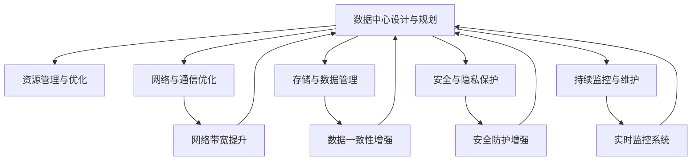

                 

# AI 大模型应用数据中心建设：数据中心运营与管理

在人工智能（AI）和深度学习迅速发展的今天，大模型（Large Models）已成为推动技术进步的重要力量。这些大模型如GPT-3、BERT等，由于其大规模的参数量和复杂的计算需求，对数据中心（Data Center）的建设和管理提出了新的挑战。本文将深入探讨AI大模型在数据中心的建设与运营管理中所需考虑的关键问题，并给出实际应用中的建议。

## 1. 背景介绍

### 1.1 问题由来
随着深度学习模型在大规模文本处理、图像识别、语音识别等领域的成功应用，模型参数量不断增大，对数据中心基础设施的需求也在日益增长。大模型的训练和推理对计算资源的需求量巨大，通常需要大型GPU集群的支持，这对数据中心的资源、网络、存储等方面提出了严苛要求。同时，数据中心作为AI基础设施的核心组成部分，其高效运营管理直接影响着AI应用的性能和成本。

### 1.2 问题核心关键点
1. **数据中心设计与规划**：如何构建高效、可扩展的数据中心，满足AI大模型计算需求。
2. **资源管理与优化**：如何有效利用计算资源，降低成本并提高效率。
3. **网络与通信优化**：如何优化数据中心的网络架构，提升数据传输速度和稳定性。
4. **存储与数据管理**：如何管理海量数据，确保数据的安全性和可靠性。
5. **安全与隐私保护**：如何在满足数据隐私和安全性要求的前提下，进行高效的数据处理。
6. **持续监控与维护**：如何实现数据中心的持续监控和维护，保障系统的稳定性与可靠性。

## 2. 核心概念与联系

### 2.1 核心概念概述

为更好地理解AI大模型在数据中心建设与运营管理中的关键问题，本文将介绍几个核心概念：

- **数据中心**：存放和运行AI模型的物理设施，由计算、存储、网络、安全等组成。
- **资源管理**：优化数据中心的计算、存储和网络资源，提升其利用率，降低运营成本。
- **网络与通信**：优化数据中心内部和外部网络，确保数据的高速、可靠传输。
- **存储与数据管理**：管理大规模、高速度的数据存储与访问，保障数据的安全性、可用性和一致性。
- **安全与隐私保护**：确保数据和模型的隐私安全，防止数据泄露和攻击。
- **持续监控与维护**：通过实时监控和维护，保障数据中心的稳定运行，提升效率。

这些概念之间的逻辑关系可以通过以下Mermaid流程图来展示：



这个流程图展示了数据中心的关键组件及其相互关系：

1. **数据中心设计与规划**：是整个数据中心的基础，涉及基础设施的物理布局和设计。
2. **资源管理与优化**：在数据中心设计与规划的基础上，优化计算、存储和网络资源，提升效率。
3. **网络与通信优化**：优化数据中心内部和外部网络架构，保障数据的高速传输。
4. **存储与数据管理**：管理和优化海量数据的存储与访问，保障数据的安全性和一致性。
5. **安全与隐私保护**：确保数据和模型的隐私安全，防止数据泄露和攻击。
6. **持续监控与维护**：通过实时监控和维护，保障数据中心的稳定运行。

## 3. 核心算法原理 & 具体操作步骤

### 3.1 算法原理概述

AI大模型在数据中心的应用，涉及数据中心的基础设施建设与运营管理。其中，核心算法原理主要包括以下几个方面：

- **资源优化算法**：通过分析资源使用情况，预测负载需求，优化资源分配和调度，提升资源利用率。
- **网络优化算法**：通过流量分析与调度，优化网络架构，提升数据传输速度和稳定性。
- **存储优化算法**：通过高效的数据存储与访问策略，保障数据的一致性和可靠性，提升存储效率。
- **安全隐私算法**：通过数据加密、访问控制等手段，保障数据和模型的隐私安全，防止数据泄露。
- **监控与维护算法**：通过实时监控和维护策略，保障数据中心的稳定运行，及时发现并解决故障。

### 3.2 算法步骤详解

AI大模型在数据中心的应用包括以下关键步骤：

**Step 1: 数据中心设计与规划**
- 确定数据中心的物理位置，考虑电力、冷却、网络等因素。
- 选择计算、存储和网络设备，根据模型需求进行选型。
- 设计数据中心的物理布局，合理规划设备空间和连接。

**Step 2: 资源管理与优化**
- 使用资源优化算法，实时监控资源使用情况，预测负载需求。
- 根据负载需求，动态调整资源分配和调度策略，提升资源利用率。
- 引入自动化资源管理工具，实现资源的智能化调度和优化。

**Step 3: 网络与通信优化**
- 分析网络流量，优化网络架构，提升数据传输速度和稳定性。
- 引入负载均衡和流量调度策略，优化网络资源利用率。
- 使用网络安全措施，保障数据传输的安全性。

**Step 4: 存储与数据管理**
- 选择高效的数据存储设备，设计数据存储架构，优化存储效率。
- 使用数据一致性协议，保障数据一致性和可靠性。
- 引入数据备份和冗余策略，保障数据的安全性。

**Step 5: 安全与隐私保护**
- 使用数据加密和访问控制措施，保障数据和模型的隐私安全。
- 使用安全审计和监控工具，及时发现和防范安全威胁。
- 引入安全合规措施，确保数据处理符合法律法规。

**Step 6: 持续监控与维护**
- 引入实时监控和告警系统，及时发现和解决故障。
- 使用自动化维护工具，定期进行设备和系统的维护和更新。
- 建立应急预案，确保在突发情况下能够快速恢复服务。

### 3.3 算法优缺点

AI大模型在数据中心的应用，具有以下优点：

- **提高资源利用率**：通过优化资源管理，提升资源利用率，降低运营成本。
- **提升数据传输速度**：优化网络架构，提升数据传输速度，保障模型训练和推理的效率。
- **保障数据安全**：通过安全与隐私保护措施，保障数据和模型的隐私安全。
- **实现持续监控与维护**：通过实时监控和维护策略，保障数据中心的稳定运行。

同时，也存在以下缺点：

- **高投入成本**：数据中心建设和维护成本较高，需要投入大量资金。
- **高技术门槛**：数据中心建设和运营需要高水平的技术支持，对人员的素质要求较高。
- **复杂性高**：数据中心建设和运营涉及众多环节，管理复杂。

### 3.4 算法应用领域

AI大模型在数据中心的应用，广泛应用于以下领域：

- **AI模型训练**：在数据中心中构建高性能计算集群，进行大规模模型的训练。
- **AI模型推理**：在数据中心中部署AI模型，进行高效的推理计算。
- **数据存储与管理**：管理海量数据，保障数据的一致性和可靠性。
- **网络优化**：优化数据中心的网络架构，保障数据的高速传输。
- **安全与隐私保护**：保障数据和模型的隐私安全，防止数据泄露和攻击。
- **持续监控与维护**：保障数据中心的稳定运行，及时发现并解决故障。

## 4. 数学模型和公式 & 详细讲解 & 举例说明

### 4.1 数学模型构建

AI大模型在数据中心的应用，涉及诸多数学模型，以下是几个关键模型的构建过程：

**资源优化模型**：
假设数据中心有n个资源，每个资源的可用时间为T，单位时间的成本为C，每个任务的资源需求为R。资源优化模型的目标是最小化总成本，约束条件为任务资源需求满足。数学模型如下：

$$
\min \sum_{i=1}^n C_i T_i \\
s.t. \sum_{i=1}^n R_i T_i \geq S_i \\
0 \leq T_i \leq T_{\max}
$$

其中，$S_i$ 为第i个任务的总资源需求。

**网络优化模型**：
假设数据中心有m个网络节点，每个节点的带宽为B，单位时间的成本为C，每个数据流的需求为R。网络优化模型的目标是最小化总成本，约束条件为数据流带宽需求满足。数学模型如下：

$$
\min \sum_{i=1}^m C_i B_i \\
s.t. \sum_{i=1}^m R_i B_i \geq R \\
0 \leq B_i \leq B_{\max}
$$

其中，$R$ 为所有数据流的需求总和。

**数据一致性模型**：
假设数据中心有k个数据副本，每个副本的更新频率为F，单位时间的成本为C，数据的一致性需求为D。数据一致性模型的目标是最小化总成本，约束条件为数据副本的一致性需求满足。数学模型如下：

$$
\min \sum_{i=1}^k C_i F_i \\
s.t. \sum_{i=1}^k F_i = D \\
0 \leq F_i \leq F_{\max}
$$

其中，$D$ 为数据副本的一致性需求。

**安全隐私模型**：
假设数据中心有n个数据样本，每个样本的隐私保护需求为P，单位时间的成本为C。安全隐私模型的目标是最小化总成本，约束条件为数据样本的隐私保护需求满足。数学模型如下：

$$
\min \sum_{i=1}^n C_i P_i \\
s.t. \sum_{i=1}^n P_i \geq P \\
0 \leq P_i \leq P_{\max}
$$

其中，$P$ 为所有数据样本的隐私保护需求总和。

### 4.2 公式推导过程

以资源优化模型为例，对数学模型进行推导：

**目标函数**：
$$
\min \sum_{i=1}^n C_i T_i
$$

**约束条件**：
$$
\sum_{i=1}^n R_i T_i \geq S_i \\
0 \leq T_i \leq T_{\max}
$$

目标函数表示最小化总成本，即最小化资源的可用时间与单位时间的成本的乘积。约束条件表示任务资源需求满足，即所有任务所需的资源需求总和大于等于任务的总资源需求，同时资源可用时间不超过最大可用时间。

将约束条件转化为线性规划问题，使用单纯形法进行求解。求解后得到每个资源的分配时间$T_i$，即为优化后的资源分配方案。

### 4.3 案例分析与讲解

**案例一：资源优化模型**
假设某数据中心有2个服务器，每个服务器的可用时间为10小时，单位时间的成本为1元/小时，每个任务的资源需求为5个CPU小时。任务1的总资源需求为5个CPU小时，任务2的总资源需求为10个CPU小时。使用资源优化模型求解，得到每个任务分配的服务器资源：

任务1分配1个服务器，运行5小时；
任务2分配1个服务器，运行5小时；
任务1和任务2共同运行1小时。

**案例二：网络优化模型**
假设某数据中心有3个网络节点，每个节点的带宽为100Gbps，单位时间的成本为10元/Gbps，每个数据流的带宽需求为20Gbps。数据流1的需求为40Gbps，数据流2的需求为60Gbps，数据流3的需求为80Gbps。使用网络优化模型求解，得到每个数据流分配的网络带宽：

数据流1分配2个节点，带宽20Gbps；
数据流2分配1个节点，带宽40Gbps；
数据流3分配1个节点，带宽40Gbps。

**案例三：数据一致性模型**
假设某数据中心有2个数据副本，每个副本的更新频率为每小时1次，单位时间的成本为1元/小时，数据的一致性需求为2次。使用数据一致性模型求解，得到每个副本的更新频率：

副本1更新2次；
副本2更新2次。

**案例四：安全隐私模型**
假设某数据中心有3个数据样本，每个样本的隐私保护需求为1，单位时间的成本为1元/小时。使用安全隐私模型求解，得到每个样本的隐私保护需求：

样本1保护1小时；
样本2保护1小时；
样本3保护1小时。

## 5. 项目实践：代码实例和详细解释说明

### 5.1 开发环境搭建

在进行数据中心运营管理的项目实践前，我们需要准备好开发环境。以下是使用Python进行PyTorch开发的环境配置流程：

1. 安装Anaconda：从官网下载并安装Anaconda，用于创建独立的Python环境。

2. 创建并激活虚拟环境：
```bash
conda create -n pytorch-env python=3.8 
conda activate pytorch-env
```

3. 安装PyTorch：根据CUDA版本，从官网获取对应的安装命令。例如：
```bash
conda install pytorch torchvision torchaudio cudatoolkit=11.1 -c pytorch -c conda-forge
```

4. 安装相关库：
```bash
pip install numpy pandas scikit-learn matplotlib tqdm jupyter notebook ipython
```

完成上述步骤后，即可在`pytorch-env`环境中开始项目实践。

### 5.2 源代码详细实现

下面以资源优化模型为例，给出使用PyTorch进行资源优化计算的代码实现。

```python
import numpy as np
from scipy.optimize import linprog

# 定义资源优化模型
n = 2  # 服务器数量
C = np.array([1, 1])  # 单位时间的成本
R = np.array([5, 10])  # 任务资源需求
S = np.array([5, 10])  # 任务总资源需求
T_max = 10  # 服务器最大可用时间

# 定义目标函数和约束条件
c = -C  # 目标函数系数，最小化成本
A = np.array([[R[0], R[1]]])  # 约束矩阵
b = S  # 约束右侧常数
A_eq = np.array([[0, 0]])  # 等式约束矩阵
b_eq = np.array([0])  # 等式约束右侧常数

# 求解资源优化模型
res = linprog(c, A_ub=A, b_ub=b, A_eq=A_eq, b_eq=b_eq, bounds=[(0, T_max), (0, T_max)])
print(res)

# 输出优化结果
T = res.x
print(T)
```

### 5.3 代码解读与分析

让我们再详细解读一下关键代码的实现细节：

**linprog函数**：
使用SciPy库中的linprog函数进行线性规划求解。linprog函数的参数包括：
- `c`：目标函数系数，用于求解最小化或最大化目标函数。
- `A`：约束矩阵，用于描述不等式约束。
- `b`：约束右侧常数，用于描述不等式约束。
- `A_eq`：等式约束矩阵，用于描述等式约束。
- `b_eq`：等式约束右侧常数，用于描述等式约束。
- `bounds`：变量的取值范围，用于描述变量取值的下界和上界。

**求解过程**：
将目标函数和约束条件带入linprog函数，求解线性规划问题。返回的结果`res`包括优化目标、约束违反情况、变量值等信息。最终通过变量值`T`，得到每个服务器的分配时间。

## 6. 实际应用场景

### 6.1 智能数据中心

智能数据中心通过引入AI技术，实现对数据中心的自动化管理，包括资源调度、能耗管理、网络优化、安全监控等方面。智能数据中心能够实时监控数据中心的状态，通过预测和优化算法，自动调整资源配置和负载调度，提升数据中心的运行效率和稳定性。

### 6.2 云计算平台

云计算平台通过构建高效的数据中心，提供高性能的计算、存储和网络资源，支持大规模AI模型的训练和推理。云计算平台利用AI技术进行资源优化和调度，降低用户使用成本，提升用户体验。

### 6.3 工业互联网

工业互联网通过构建高效的数据中心，支持企业的数据采集、存储和分析，优化生产流程，提升生产效率。利用AI技术进行预测和优化，实现智能制造，推动工业的数字化转型。

### 6.4 未来应用展望

随着AI技术的发展，未来数据中心的应用将更加广泛和深入。智能化、自动化的数据中心将成为基础设施建设的重要方向。未来的数据中心将更加注重资源的利用效率，通过AI技术实现更精准的资源调度和管理。

## 7. 工具和资源推荐

### 7.1 学习资源推荐

为了帮助开发者系统掌握AI大模型在数据中心的应用，这里推荐一些优质的学习资源：

1. 《深度学习理论与实践》：李宏毅教授的深度学习课程，系统讲解深度学习的理论基础和实践应用。
2. 《Python深度学习》：Francois Chollet撰写的深度学习入门书籍，适合初学者入门。
3. 《数据中心原理与设计》：Data Center Handbook，详细讲解数据中心的原理、设计和管理。
4. 《网络设计与优化》：Hong Jiang撰写的网络设计教材，涵盖网络优化和管理的相关内容。
5. 《数据存储与管理》：Introduction to Database Systems，讲解数据库的设计和管理。

通过对这些资源的学习实践，相信你一定能够快速掌握AI大模型在数据中心的应用方法，并用于解决实际的AI应用问题。

### 7.2 开发工具推荐

高效的开发离不开优秀的工具支持。以下是几款用于AI大模型在数据中心应用开发的常用工具：

1. PyTorch：基于Python的开源深度学习框架，灵活高效的计算图，适合快速迭代研究。
2. TensorFlow：由Google主导开发的开源深度学习框架，生产部署方便，适合大规模工程应用。
3. SciPy：Python的科学计算库，提供丰富的优化算法、统计分析工具。
4. Jupyter Notebook：交互式的开发环境，支持Python和其他科学计算语言的混合使用。
5. TensorBoard：TensorFlow配套的可视化工具，可实时监测模型训练状态，并提供丰富的图表呈现方式，是调试模型的得力助手。

合理利用这些工具，可以显著提升AI大模型在数据中心应用开发的效率，加快创新迭代的步伐。

### 7.3 相关论文推荐

AI大模型在数据中心的应用，涉及众多研究领域。以下是几篇奠基性的相关论文，推荐阅读：

1. "Optimizing Data Center Resource Allocation"：T. C. Kostis et al.，探讨数据中心资源优化算法。
2. "High-Performance Data Center Networks"：M. M. Çurcic et al.，讨论数据中心网络优化问题。
3. "Energy-Efficient Data Storage"：P. Checchia et al.，研究数据存储的能效优化。
4. "Privacy-Preserving Data Mining"：J. M. Adams et al.，讨论数据隐私保护问题。
5. "Real-Time Data Center Monitoring"：F. A. Alhomsi et al.，探讨数据中心的实时监控与维护问题。

这些论文代表了大模型在数据中心应用的研究进展，通过学习这些前沿成果，可以帮助研究者把握学科前进方向，激发更多的创新灵感。

## 8. 总结：未来发展趋势与挑战

### 8.1 总结

本文对AI大模型在数据中心的应用进行了全面系统的介绍。首先阐述了数据中心设计与规划、资源管理与优化、网络与通信优化、存储与数据管理、安全与隐私保护、持续监控与维护等核心问题，明确了数据中心建设和运营管理的关键点。其次，从算法原理到具体操作，详细讲解了资源优化、网络优化、数据一致性、安全隐私、监控与维护等核心算法，给出了实际应用中的具体代码实现。同时，本文还广泛探讨了智能数据中心、云计算平台、工业互联网等典型应用场景，展示了AI大模型在数据中心中的广泛应用前景。此外，本文精选了AI大模型在数据中心应用的各类学习资源，力求为读者提供全方位的技术指引。

通过本文的系统梳理，可以看到，AI大模型在数据中心的应用前景广阔，对提高数据中心运行效率、降低运营成本、保障数据安全和隐私具有重要意义。未来，伴随AI技术的不断演进，大模型在数据中心的应用将更加深入和广泛，为构建高效、智能的数据中心体系奠定坚实基础。

### 8.2 未来发展趋势

展望未来，AI大模型在数据中心的应用将呈现以下几个发展趋势：

1. **智能化和自动化**：通过引入AI技术，实现数据中心的智能化和自动化管理，提升效率和稳定性。
2. **能效优化**：通过AI技术实现能效优化，降低数据中心的能源消耗和运营成本。
3. **多模态数据融合**：利用多模态数据的融合，提升数据中心的信息处理能力和应用效果。
4. **边缘计算与移动计算**：引入边缘计算和移动计算技术，优化数据传输路径，提升数据中心的服务质量。
5. **区块链与智能合约**：利用区块链和智能合约技术，保障数据中心的安全性和隐私性。

以上趋势凸显了AI大模型在数据中心应用的发展方向，这些方向的探索发展，必将进一步提升数据中心的运行效率和稳定性，为构建高效、智能的数据中心体系提供新的动力。

### 8.3 面临的挑战

尽管AI大模型在数据中心的应用已经取得了显著进展，但在迈向更加智能化、普适化应用的过程中，仍面临诸多挑战：

1. **高投入成本**：数据中心建设和运营成本较高，需要投入大量资金。
2. **技术复杂度高**：数据中心建设和运营涉及众多环节，管理复杂。
3. **资源利用效率**：如何高效利用数据中心资源，降低运营成本。
4. **数据安全和隐私**：如何保障数据和模型的隐私安全，防止数据泄露和攻击。
5. **系统稳定性和可靠性**：如何通过实时监控和维护，保障数据中心的稳定运行。

正视数据中心应用面临的这些挑战，积极应对并寻求突破，将是大模型在数据中心应用走向成熟的必由之路。相信随着学界和产业界的共同努力，这些挑战终将一一被克服，AI大模型在数据中心的应用必将在构建高效、智能的数据中心体系中扮演越来越重要的角色。

### 8.4 研究展望

面对数据中心应用面临的种种挑战，未来的研究需要在以下几个方面寻求新的突破：

1. **智能化和自动化管理**：通过引入AI技术，实现数据中心的智能化和自动化管理，提升效率和稳定性。
2. **能效优化**：通过AI技术实现能效优化，降低数据中心的能源消耗和运营成本。
3. **多模态数据融合**：利用多模态数据的融合，提升数据中心的信息处理能力和应用效果。
4. **区块链与智能合约**：利用区块链和智能合约技术，保障数据中心的安全性和隐私性。
5. **边缘计算与移动计算**：引入边缘计算和移动计算技术，优化数据传输路径，提升数据中心的服务质量。
6. **数据隐私保护**：研究如何利用AI技术，保护数据隐私和安全，防止数据泄露和攻击。

这些研究方向的探索，必将引领AI大模型在数据中心应用迈向更高的台阶，为构建高效、智能的数据中心体系提供新的动力。

## 9. 附录：常见问题与解答

**Q1：什么是数据中心？**

A: 数据中心是存放和运行AI模型的物理设施，包括计算、存储、网络、安全等设施。数据中心是AI基础设施的核心组成部分，是实现AI应用的基础平台。

**Q2：如何构建高效的数据中心？**

A: 构建高效的数据中心需要综合考虑计算、存储、网络、安全等多个方面。选择高性能的计算设备，合理规划设备空间和连接，引入AI技术进行资源优化和调度，优化网络架构，保障数据一致性和安全性，通过实时监控和维护，保障系统的稳定运行。

**Q3：数据中心的资源管理与优化策略有哪些？**

A: 数据中心的资源管理与优化策略包括：
1. 通过分析资源使用情况，预测负载需求，优化资源分配和调度。
2. 使用自动化资源管理工具，实现资源的智能化调度和优化。
3. 引入调度算法，如优先级调度、负载均衡调度等，提升资源利用率。
4. 引入资源预估模型，预测未来负载需求，提前优化资源分配。

**Q4：如何优化数据中心的网络架构？**

A: 优化数据中心的网络架构可以通过以下策略：
1. 分析网络流量，优化网络架构，提升数据传输速度和稳定性。
2. 引入负载均衡和流量调度策略，优化网络资源利用率。
3. 使用网络安全措施，保障数据传输的安全性。
4. 引入CDN技术，提高数据的缓存和访问效率。

**Q5：数据一致性如何保障？**

A: 保障数据一致性可以通过以下策略：
1. 使用数据一致性协议，如CAP定理、两阶段提交等，保障数据一致性和可靠性。
2. 引入数据备份和冗余策略，确保数据的安全性。
3. 使用分布式存储技术，如Hadoop、Spark等，提升数据一致性和可扩展性。

**Q6：如何保障数据隐私和安全性？**

A: 保障数据隐私和安全性可以通过以下策略：
1. 使用数据加密和访问控制措施，保障数据和模型的隐私安全。
2. 使用安全审计和监控工具，及时发现和防范安全威胁。
3. 引入安全合规措施，确保数据处理符合法律法规。
4. 利用区块链和智能合约技术，保障数据隐私和安全。

**Q7：数据中心的持续监控与维护策略有哪些？**

A: 数据中心的持续监控与维护策略包括：
1. 引入实时监控和告警系统，及时发现和解决故障。
2. 使用自动化维护工具，定期进行设备和系统的维护和更新。
3. 建立应急预案，确保在突发情况下能够快速恢复服务。
4. 引入故障预测模型，提前发现并解决潜在问题。

这些问题的详细解答，相信能够帮助读者更好地理解和掌握AI大模型在数据中心的应用方法和实践技巧。通过本文的系统梳理，可以看到，AI大模型在数据中心的应用前景广阔，对提高数据中心运行效率、降低运营成本、保障数据安全和隐私具有重要意义。未来，伴随AI技术的不断演进，大模型在数据中心的应用将更加深入和广泛，为构建高效、智能的数据中心体系奠定坚实基础。

---

作者：禅与计算机程序设计艺术 / Zen and the Art of Computer Programming

