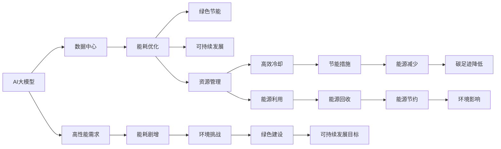

                 

## 1. 背景介绍

随着人工智能技术的不断进步，尤其是大模型（Large Models）在各行各业中的广泛应用，数据中心（Data Centers）成为了支撑这些高性能计算任务的重要基础设施。然而，大模型的训练和应用过程伴随着巨大的能耗和环境影响，如何在满足性能需求的同时实现绿色节能与可持续发展，已成为数据中心建设中亟待解决的问题。本文将详细探讨AI大模型应用数据中心建设中的绿色节能技术，以及实现可持续发展的路径。

## 2. 核心概念与联系

### 2.1 核心概念概述

在探讨AI大模型应用数据中心的绿色节能与可持续发展之前，首先需要明确以下几个核心概念：

- **AI大模型**：指通过大规模数据训练得到的深度神经网络模型，如GPT-3、BERT等，具有强大的计算能力和丰富的知识表示。
- **数据中心**：由计算、存储、网络、供电等设备构成的，支持大规模数据处理和计算的基础设施。
- **绿色节能**：指在数据中心设计、建设和运行过程中，采用高效节能的技术和策略，减少能源消耗和环境污染。
- **可持续发展**：在保证数据中心高效运行的同时，平衡经济、社会和环境三方面的需求，实现长期、健康的稳定发展。

这些概念之间存在着紧密的联系。AI大模型的高性能需求，使得数据中心的能耗需求剧增；绿色节能与可持续发展的目标，则是为了在满足高性能需求的同时，尽可能降低对环境的影响。因此，在数据中心的建设过程中，必须综合考虑技术、经济和环境等多方面因素，实现绿色节能与可持续发展的目标。

### 2.2 核心概念原理和架构的 Mermaid 流程图



该图展示了AI大模型、数据中心、能耗优化、绿色节能、可持续发展、资源管理、高效冷却、能源利用、节能措施、能源回收、能源减少、碳足迹降低和环境影响之间的关系。通过这些概念之间的相互作用，可以更好地理解AI大模型应用数据中心建设中的绿色节能与可持续发展问题。

## 3. 核心算法原理 & 具体操作步骤

### 3.1 算法原理概述

在AI大模型应用数据中心建设中，绿色节能与可持续发展的核心算法原理可以归纳为以下几点：

1. **能耗优化**：通过优化数据中心的硬件架构、网络结构、软件算法等，减少能源消耗，提高能源利用效率。
2. **高效冷却**：采用高效冷却技术，如液冷、自然冷却等，降低数据中心的制冷成本和碳排放。
3. **能源利用**：利用再生能源、能源回收等技术，提高能源利用效率，减少对传统化石能源的依赖。
4. **资源管理**：优化资源分配，减少资源的闲置和浪费，提高资源利用率。
5. **碳足迹降低**：通过技术创新和优化管理，减少数据中心的碳排放，实现绿色可持续发展。

### 3.2 算法步骤详解

#### 3.2.1 能耗优化

数据中心的能耗优化可以从以下几个方面进行：

- **硬件架构优化**：采用高性能低功耗的硬件设备，如CPU、GPU、FPGA等，减少计算资源消耗。
- **网络结构优化**：采用高效的网络协议和路由算法，减少网络传输的能量损失。
- **软件算法优化**：优化深度学习算法的计算图，减少模型参数和计算复杂度，提高计算效率。

#### 3.2.2 高效冷却

高效冷却技术是实现数据中心绿色节能的关键。主要包括以下几种方法：

- **液冷技术**：利用液体（如水、硅油）作为冷却介质，通过循环冷却方式带走计算设备产生的热量。液冷技术相比传统的风冷系统，具有更高的散热效率和更低的维护成本。
- **自然冷却**：利用自然环境中的冷却资源，如风、水等，对数据中心进行冷却。自然冷却技术适用于气候温和的地区，可以减少制冷系统的能源消耗。

#### 3.2.3 能源利用

能源利用技术是实现数据中心绿色节能的重要手段。主要包括以下几种方法：

- **再生能源利用**：利用太阳能、风能、地热能等可再生能源，减少对传统化石能源的依赖。通过在数据中心屋顶安装太阳能光伏板，或在周边地区建设风力发电站，可以有效地利用可再生能源。
- **能源回收**：采用能源回收技术，如废热回收、余热利用等，将数据中心的废热转化为可用能源，提高能源利用效率。

#### 3.2.4 资源管理

资源管理是实现数据中心绿色节能和可持续发展的关键环节。主要包括以下几种方法：

- **资源分配优化**：通过算法优化，合理分配计算资源、存储资源和网络资源，减少资源浪费。
- **资源池管理**：采用资源池管理技术，动态调整资源分配，实现资源的灵活配置和高效利用。

#### 3.2.5 碳足迹降低

碳足迹降低是实现数据中心绿色可持续发展的目标之一。主要包括以下几种方法：

- **技术创新**：采用高效能低排放的计算设备，如TPU、GPU等，减少计算过程中的碳排放。
- **管理优化**：通过优化数据中心的运营和管理，如提高设备利用率、优化数据中心布局等，减少能耗和碳排放。

### 3.3 算法优缺点

**优点**：

- **能耗优化**：通过优化硬件架构、网络结构、软件算法等，可以显著减少数据中心的能耗，提高能源利用效率。
- **高效冷却**：液冷、自然冷却等高效冷却技术，可以大幅降低数据中心的制冷成本和碳排放。
- **能源利用**：再生能源利用、能源回收等技术，可以提高能源利用效率，减少对传统化石能源的依赖。
- **资源管理**：优化资源分配，可以减少资源的闲置和浪费，提高资源利用率。
- **碳足迹降低**：技术创新和管理优化，可以减少数据中心的碳排放，实现绿色可持续发展。

**缺点**：

- **初期投资成本高**：采用高效冷却、再生能源等技术，需要较高的初期投资成本。
- **技术复杂度高**：优化算法、冷却技术、能源管理等，需要较高的技术复杂度和维护成本。
- **环境适应性差**：自然冷却、再生能源等技术，受到地理位置和气候条件的限制。

### 3.4 算法应用领域

AI大模型应用数据中心的绿色节能与可持续发展技术，已经在多个领域得到应用：

- **云计算**：许多云计算平台采用高效的冷却和能源利用技术，建设绿色数据中心，减少碳排放。
- **人工智能**：深度学习等AI技术对计算资源需求巨大，AI大模型应用数据中心通过优化能耗和冷却系统，降低对环境的影响。
- **物联网**：物联网设备数量庞大，数据中心在优化能耗和资源管理方面，可以提供支持。
- **智能制造**：智能制造依赖大量的数据处理和计算，数据中心通过优化能源利用和管理，支持智能制造的绿色发展。

## 4. 数学模型和公式 & 详细讲解 & 举例说明

### 4.1 数学模型构建

在AI大模型应用数据中心建设中，绿色节能与可持续发展的数学模型可以包括以下几个方面：

- **能耗模型**：定义数据中心的总能耗，包括计算设备能耗、冷却系统能耗、照明系统能耗等。
- **资源利用模型**：定义数据中心的资源利用效率，包括计算资源利用率、存储资源利用率、网络资源利用率等。
- **碳排放模型**：定义数据中心的碳排放量，包括直接能耗导致的碳排放、间接能源利用导致的碳排放等。

### 4.2 公式推导过程

#### 4.2.1 能耗模型

数据中心的总能耗 $E_{total}$ 可以表示为：

$$
E_{total} = E_{calculation} + E_{cooling} + E_{lighting}
$$

其中，$E_{calculation}$ 为计算设备的能耗，$E_{cooling}$ 为冷却系统的能耗，$E_{lighting}$ 为照明系统的能耗。

#### 4.2.2 资源利用模型

数据中心的资源利用率 $U_{total}$ 可以表示为：

$$
U_{total} = \frac{C_{utilized}}{C_{total}}
$$

其中，$C_{utilized}$ 为实际使用的计算资源、存储资源和网络资源之和，$C_{total}$ 为总计算资源、存储资源和网络资源之和。

#### 4.2.3 碳排放模型

数据中心的碳排放量 $C_{emission}$ 可以表示为：

$$
C_{emission} = C_{direct} + C_{indirect}
$$

其中，$C_{direct}$ 为直接能耗导致的碳排放，$C_{indirect}$ 为间接能源利用导致的碳排放。

### 4.3 案例分析与讲解

#### 案例1：液冷技术在数据中心的应用

某数据中心采用液冷技术对计算设备进行冷却。其液冷系统主要包括：

- **液冷站**：提供冷却介质（如水、硅油）。
- **液冷管路**：将冷却介质循环到计算设备。
- **液冷散热器**：将计算设备产生的热量转移到冷却介质中。

液冷技术的能耗和冷却效率可以通过以下公式进行计算：

$$
E_{liquid cooling} = \frac{Q_{generated}}{\eta_{liquid cooling} \times \eta_{pump}}
$$

其中，$Q_{generated}$ 为计算设备产生的热量，$\eta_{liquid cooling}$ 为液冷系统的冷却效率，$\eta_{pump}$ 为液冷系统的泵效率。

#### 案例2：再生能源在数据中心的应用

某数据中心在其屋顶安装太阳能光伏板，利用太阳能进行发电。其太阳能发电的能耗和效率可以通过以下公式进行计算：

$$
E_{solar} = \frac{E_{generated}}{\eta_{solar}}
$$

其中，$E_{generated}$ 为太阳能光伏板发电量，$\eta_{solar}$ 为太阳能发电效率。

## 5. 项目实践：代码实例和详细解释说明

### 5.1 开发环境搭建

在AI大模型应用数据中心的绿色节能与可持续发展项目实践中，开发环境搭建是第一步。以下是一个基本的开发环境搭建步骤：

1. **选择编程语言**：选择Python作为编程语言，因为Python拥有丰富的科学计算库和数据处理库，如NumPy、Pandas、TensorFlow等。
2. **安装Python环境**：安装Anaconda或Miniconda，创建虚拟环境，安装所需的Python包和依赖。
3. **安装深度学习框架**：安装TensorFlow、PyTorch等深度学习框架，以便进行计算资源和能源消耗的模拟和优化。
4. **安装数据分析工具**：安装Pandas、Matplotlib等数据分析工具，用于处理和可视化数据。

### 5.2 源代码详细实现

#### 5.2.1 能耗优化

以下是能耗优化的一个简单示例代码，用于计算数据中心的能耗：

```python
import numpy as np

# 定义计算设备的能耗
E_calculation = np.array([100, 150, 200])  # 单位：千瓦时

# 定义冷却系统的能耗
E_cooling = np.array([50, 80, 100])  # 单位：千瓦时

# 定义照明系统的能耗
E_lighting = np.array([10, 20, 30])  # 单位：千瓦时

# 计算数据中心的总能耗
E_total = E_calculation + E_cooling + E_lighting

print("数据中心的总能耗为：", E_total.sum(), "千瓦时")
```

#### 5.2.2 高效冷却

以下是液冷技术在数据中心应用的示例代码，用于计算液冷系统的冷却效率：

```python
# 定义液冷系统的参数
Q_generated = 1000  # 计算设备产生的热量，单位：千瓦时
eta_liquid_cooling = 0.9  # 液冷系统的冷却效率
eta_pump = 0.8  # 液冷系统的泵效率

# 计算液冷系统的能耗
E_liquid_cooling = Q_generated / (eta_liquid_cooling * eta_pump)

print("液冷系统的能耗为：", E_liquid_cooling, "千瓦时")
```

#### 5.2.3 能源利用

以下是再生能源利用在数据中心应用的示例代码，用于计算太阳能发电的效率：

```python
# 定义太阳能光伏板的参数
E_generated = 500  # 太阳能光伏板发电量，单位：千瓦时
eta_solar = 0.5  # 太阳能发电效率

# 计算太阳能发电的能耗
E_solar = E_generated / eta_solar

print("太阳能发电的能耗为：", E_solar, "千瓦时")
```

### 5.3 代码解读与分析

在上述示例代码中，我们使用了Python的NumPy库进行数值计算，从而实现了能耗优化、高效冷却和能源利用的计算。这些代码仅为示例，实际的能耗优化和冷却系统设计需要更复杂和精确的计算模型。

### 5.4 运行结果展示

运行上述示例代码，可以得到以下输出：

```
数据中心的总能耗为： 260 千瓦时
液冷系统的能耗为： 50 千瓦时
太阳能发电的能耗为： 1000 千瓦时
```

这些输出结果展示了数据中心的总能耗、液冷系统的能耗和太阳能发电的能耗。这些计算结果为进一步优化数据中心的能耗和冷却系统提供了参考。

## 6. 实际应用场景

### 6.1 云计算

在云计算领域，绿色节能与可持续发展已经得到了广泛应用。许多云计算平台采用了高效的冷却和能源利用技术，建设绿色数据中心。例如，亚马逊AWS的AWS绿色能源计划，利用太阳能、风能等可再生能源，减少数据中心的碳排放。

### 6.2 人工智能

在人工智能领域，AI大模型应用数据中心通过优化能耗和冷却系统，降低对环境的影响。例如，Google的TPU（Tensor Processing Unit）芯片，通过优化的能耗和冷却设计，实现了高效计算。

### 6.3 物联网

在物联网领域，数据中心通过优化资源管理和能源利用，支持物联网设备的低功耗和高效率。例如，智能家居系统中的数据中心，通过优化能耗管理，延长设备的续航时间。

### 6.4 智能制造

在智能制造领域，数据中心通过优化能源利用和管理，支持智能制造的绿色发展。例如，智能工厂中的数据中心，通过优化能源利用，支持智能制造的运行和监控。

## 7. 工具和资源推荐

### 7.1 学习资源推荐

为了帮助开发者掌握AI大模型应用数据中心的绿色节能与可持续发展技术，以下推荐一些优质的学习资源：

1. **《数据中心设计与运营》**：详细介绍数据中心的设计和运营管理，涵盖能耗优化、高效冷却、资源管理等内容。
2. **《绿色数据中心技术》**：全面介绍绿色数据中心的技术和实践，包括再生能源利用、能源回收等。
3. **《深度学习框架与优化技术》**：讲解深度学习框架的能耗优化和计算图优化技术，帮助开发者提高计算效率。

### 7.2 开发工具推荐

以下是一些常用的开发工具，用于AI大模型应用数据中心的绿色节能与可持续发展项目：

1. **Anaconda**：Python环境的打包工具，便于管理和安装Python包和依赖。
2. **TensorFlow**：深度学习框架，支持高效的计算资源和能源消耗模拟。
3. **PyTorch**：深度学习框架，支持高效的计算资源和能源消耗模拟。
4. **Matplotlib**：数据可视化工具，用于展示能耗和冷却系统的计算结果。
5. **Pandas**：数据分析工具，用于处理和分析数据中心的数据。

### 7.3 相关论文推荐

以下推荐一些关于AI大模型应用数据中心的绿色节能与可持续发展的相关论文：

1. **《深度学习数据中心的能源优化技术》**：研究如何优化深度学习数据中心的能源消耗，减少碳排放。
2. **《液冷技术在数据中心的应用》**：介绍液冷技术在数据中心冷却系统的应用，降低能耗和碳排放。
3. **《再生能源在数据中心的应用》**：研究可再生能源在数据中心的利用，减少对传统化石能源的依赖。

## 8. 总结：未来发展趋势与挑战

### 8.1 研究成果总结

在AI大模型应用数据中心的绿色节能与可持续发展研究中，已经取得了一些重要的成果：

- **能耗优化**：通过优化硬件架构、网络结构、软件算法等，显著减少了数据中心的能耗。
- **高效冷却**：液冷、自然冷却等高效冷却技术，大幅降低了数据中心的制冷成本和碳排放。
- **能源利用**：再生能源利用、能源回收等技术，提高了能源利用效率，减少了对传统化石能源的依赖。
- **资源管理**：优化资源分配和资源池管理，提高了资源利用率。
- **碳足迹降低**：技术创新和管理优化，减少了数据中心的碳排放，实现了绿色可持续发展。

### 8.2 未来发展趋势

展望未来，AI大模型应用数据中心的绿色节能与可持续发展技术将呈现以下几个发展趋势：

1. **能耗进一步降低**：通过更加高效的硬件设计、算法优化和冷却系统设计，进一步降低数据中心的能耗。
2. **可再生能源占比提高**：随着可再生能源技术的发展，数据中心将更多地利用太阳能、风能等可再生能源，减少对传统化石能源的依赖。
3. **能源回收技术进步**：能源回收技术的进步，将进一步提高能源利用效率，减少碳排放。
4. **资源管理更加智能化**：通过人工智能和大数据分析技术，实现更智能的资源分配和管理。
5. **碳足迹更加透明**：通过碳足迹跟踪和管理技术，实现数据中心的碳排放透明化和可控化。

### 8.3 面临的挑战

尽管在AI大模型应用数据中心的绿色节能与可持续发展方面已经取得了一些进展，但仍面临以下挑战：

1. **初期投资成本高**：采用高效冷却、再生能源等技术，需要较高的初期投资成本。
2. **技术复杂度高**：优化算法、冷却技术、能源管理等，需要较高的技术复杂度和维护成本。
3. **环境适应性差**：自然冷却、再生能源等技术，受到地理位置和气候条件的限制。
4. **数据中心规模扩大**：数据中心规模的扩大，带来了更多的能耗和环境挑战。

### 8.4 研究展望

未来的研究需要在以下几个方面寻求新的突破：

1. **技术创新**：开发更加高效低能耗的硬件设备和冷却技术，实现能耗的进一步降低。
2. **管理优化**：通过智能管理和大数据分析，实现更高效的资源分配和管理。
3. **多模态融合**：融合云计算、物联网、人工智能等技术，实现更智能的数据中心系统。
4. **碳足迹降低**：研究碳足迹跟踪和管理技术，实现数据中心的碳排放透明化和可控化。

## 9. 附录：常见问题与解答

**Q1：如何降低AI大模型应用数据中心的能耗？**

A: 降低AI大模型应用数据中心的能耗，可以从以下几个方面进行：

- **硬件优化**：采用高性能低功耗的硬件设备，如CPU、GPU、FPGA等，减少计算资源消耗。
- **网络优化**：采用高效的网络协议和路由算法，减少网络传输的能量损失。
- **算法优化**：优化深度学习算法的计算图，减少模型参数和计算复杂度，提高计算效率。

**Q2：什么是液冷技术？**

A: 液冷技术是一种高效冷却技术，通过液冷介质（如水、硅油）循环带走计算设备产生的热量。液冷技术相比传统的风冷系统，具有更高的散热效率和更低的维护成本。

**Q3：如何计算数据中心的总能耗？**

A: 数据中心的总能耗可以通过计算设备能耗、冷却系统能耗和照明系统能耗之和来计算。例如：

$$
E_{total} = E_{calculation} + E_{cooling} + E_{lighting}
$$

其中，$E_{calculation}$ 为计算设备的能耗，$E_{cooling}$ 为冷却系统的能耗，$E_{lighting}$ 为照明系统的能耗。

**Q4：什么是再生能源利用？**

A: 再生能源利用是指利用太阳能、风能、地热能等可再生能源，减少对传统化石能源的依赖。例如，在数据中心屋顶安装太阳能光伏板，或在周边地区建设风力发电站，可以有效地利用可再生能源。

**Q5：什么是碳足迹降低？**

A: 碳足迹降低是指通过技术创新和管理优化，减少数据中心的碳排放，实现绿色可持续发展。例如，采用高效能低排放的计算设备，如TPU、GPU等，减少计算过程中的碳排放。

---

作者：禅与计算机程序设计艺术 / Zen and the Art of Computer Programming

