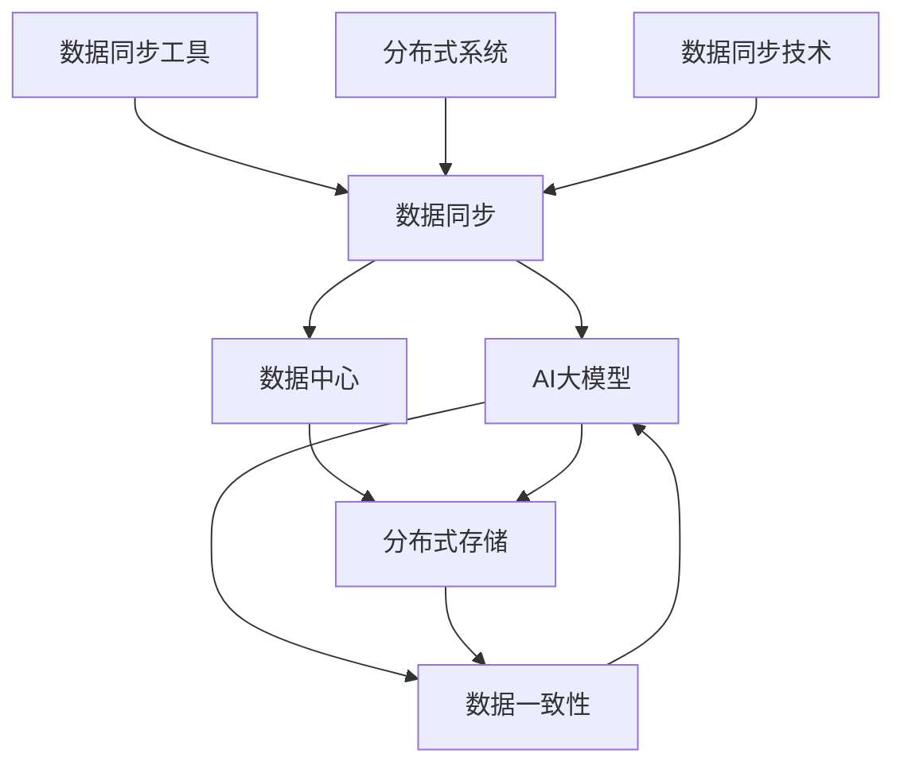

                 

# AI 大模型应用数据中心的数据同步架构

> 关键词：数据同步, AI大模型, 数据中心, 分布式存储, 数据一致性, 数据同步工具, 分布式系统, 数据同步技术

## 1. 背景介绍

在人工智能(AI)的浪潮下，大模型成为了行业关注的焦点。这些模型通常需要海量数据来训练，从而具有强大的推理能力。而在大模型训练和推理中，数据同步是一个关键环节，直接影响到AI应用的性能和可靠性。

数据中心是支撑大模型训练和推理的基础设施，其数据同步架构的设计和优化，对提升AI应用的效率和稳定性至关重要。然而，由于数据规模庞大、分布广泛、访问模式复杂，数据同步架构的实现往往面临诸多挑战。

本文旨在深入探讨AI大模型应用数据中心的数据同步架构，包括其核心概念、关键技术和实际应用场景，旨在为业界提供有价值的参考。

## 2. 核心概念与联系

### 2.1 核心概念概述

数据同步是指在分布式系统中，将数据从一个节点或进程复制到另一个节点或进程的过程。在大模型应用数据中心中，数据同步架构主要用于支持模型的训练和推理，确保模型能够高效、可靠地访问数据。

- **数据同步**：分布式系统中，确保数据一致性的过程。
- **AI大模型**：指用于特定AI任务的预训练模型，如BERT、GPT等。
- **数据中心**：承载数据存储、处理、分析等功能的物理或虚拟基础设施。
- **分布式存储**：指将数据分布在多个存储节点上，以提升数据访问性能和可靠性。
- **数据一致性**：在分布式系统中，保证数据在多个节点上的一致性。
- **数据同步工具**：用于实现数据同步的软件和工具，如Raft、Paxos等。
- **分布式系统**：多个节点或进程协同工作的系统，如Hadoop、Kubernetes等。
- **数据同步技术**：实现数据同步的各种技术和方法，如二阶段提交、阻塞式复制等。

### 2.2 核心概念原理和架构的 Mermaid 流程图



该图展示了数据同步在AI大模型应用数据中心中的作用。数据同步架构连接AI大模型和数据中心，通过分布式存储实现数据的分布和访问，并借助数据同步工具和技术保证数据一致性和可靠性。

## 3. 核心算法原理 & 具体操作步骤

### 3.1 算法原理概述

在大模型应用数据中心，数据同步架构的设计和优化需要考虑以下几个关键点：

- **数据分布**：数据应均匀分布在多个存储节点上，以提升访问性能和可靠性。
- **数据访问模式**：模型对数据的访问模式（读、写、更新等），需要与数据同步策略相结合。
- **数据一致性要求**：数据同步应满足不同的数据一致性级别（强一致性、弱一致性等）。
- **数据同步技术**：选择适合的数据同步技术，如二阶段提交、同步复制、异步复制等。

### 3.2 算法步骤详解

#### 3.2.1 数据分布和访问模式设计

1. **数据分布设计**：
   - **均匀分布**：将数据均匀地分布在多个存储节点上，以确保负载均衡。
   - **数据分区**：根据数据的类型、大小、访问模式等因素，将数据分区存储，方便管理和访问。
   - **数据冗余**：通过数据冗余，提升数据访问的可靠性和容错性。

2. **数据访问模式设计**：
   - **读-写分离**：将数据的读写操作分离，减少数据冲突和延迟。
   - **本地缓存**：在数据节点上设置缓存，减少数据访问时网络延迟。
   - **分布式文件系统**：使用Hadoop Distributed File System (HDFS)、Amazon S3等分布式文件系统，提供高效的数据访问和存储服务。

#### 3.2.2 数据同步策略设计

1. **同步复制**：
   - **强一致性**：在数据同步过程中，确保数据在不同节点上的状态完全一致。
   - **阻塞式复制**：在复制过程中阻塞当前操作，确保数据同步的准确性。
   - **乐观锁**：在数据同步时，先进行锁操作，再进行复制，减少数据冲突。

2. **异步复制**：
   - **弱一致性**：在数据同步过程中，允许节点之间存在短暂的数据不一致。
   - **非阻塞式复制**：在复制过程中不阻塞当前操作，提高系统性能。
   - **版本控制**：记录数据的版本信息，确保数据的历史一致性。

#### 3.2.3 数据一致性实现

1. **强一致性实现**：
   - **二阶段提交**：在数据同步时，先进行事务预提交，再进行数据写入，确保数据的一致性。
   - **阻塞式复制**：在数据同步时，阻塞当前操作，确保数据的一致性。
   - **两阶段锁**：在数据同步时，先进行锁操作，再进行复制，减少数据冲突。

2. **弱一致性实现**：
   - **乐观锁**：在数据同步时，先进行锁操作，再进行复制，减少数据冲突。
   - **版本控制**：记录数据的版本信息，确保数据的历史一致性。
   - **分布式一致性协议**：如Paxos、Raft等，用于实现分布式系统中的数据一致性。

### 3.3 算法优缺点

**优点**：
- **高效性**：通过数据分布和访问模式设计，可以提升数据访问的性能和效率。
- **可靠性**：通过数据同步策略设计，可以提升数据的一致性和可靠性。
- **可扩展性**：通过分布式存储和数据同步技术，可以支持大规模数据的存储和访问。

**缺点**：
- **复杂性**：数据同步架构的设计和实现相对复杂，需要考虑多个因素。
- **性能开销**：数据同步过程中存在一定的性能开销，影响系统性能。
- **一致性维护**：数据同步过程中需要保证数据一致性，难度较大。

### 3.4 算法应用领域

数据同步架构在大模型应用数据中心中有着广泛的应用，包括但不限于以下几个领域：

- **AI训练**：在AI模型训练过程中，数据同步架构保证模型的数据访问效率和一致性。
- **AI推理**：在AI模型推理过程中，数据同步架构保证推理结果的准确性和可靠性。
- **大数据分析**：在大数据分析过程中，数据同步架构支持大规模数据的存储和访问。
- **分布式计算**：在分布式计算环境中，数据同步架构保证计算节点间的数据一致性。

## 4. 数学模型和公式 & 详细讲解 & 举例说明

### 4.1 数学模型构建

在大模型应用数据中心，数据同步架构的设计和优化可以采用数学模型来进行建模和分析。

设数据分布为 $D$，数据同步策略为 $S$，数据一致性要求为 $C$，数据同步技术为 $T$。数据同步过程可以用以下模型进行描述：

$$
\begin{aligned}
& \text{数据分布} \in D \\
& \text{数据同步策略} \in S \\
& \text{数据一致性要求} \in C \\
& \text{数据同步技术} \in T \\
& \text{数据同步过程} \in f(D, S, C, T) \\
& \text{数据同步性能} \in g(D, S, C, T)
\end{aligned}
$$

其中，$f$ 表示数据同步过程的映射函数，$g$ 表示数据同步性能的评估函数。

### 4.2 公式推导过程

以**二阶段提交**为例，推导数据同步过程的数学模型：

1. **数据提交**：
   $$
   \begin{aligned}
   & \text{数据提交} \rightarrow D_{commit} \\
   & D_{commit} = \{data_1, data_2, \ldots, data_n\}
   \end{aligned}
   $$

2. **预提交**：
   $$
   \begin{aligned}
   & \text{预提交} \rightarrow D_{pre-commit} \\
   & D_{pre-commit} = \{(data_i, commit_i) | 1 \leq i \leq n\}
   \end{aligned}
   $$

3. **提交确认**：
   $$
   \begin{aligned}
   & \text{提交确认} \rightarrow D_{commit-confirm} \\
   & D_{commit-confirm} = \{commit_i | 1 \leq i \leq n\}
   \end{aligned}
   $$

4. **数据同步**：
   $$
   \begin{aligned}
   & \text{数据同步} \rightarrow D_{sync} \\
   & D_{sync} = \{(data_i, commit_i) | commit_i \in D_{commit-confirm}, 1 \leq i \leq n\}
   \end{aligned}
   $$

5. **数据一致性**：
   $$
   \begin{aligned}
   & \text{数据一致性} \rightarrow C \\
   & C = \{data_i | (data_i, commit_i) \in D_{sync}, 1 \leq i \leq n\}
   \end{aligned}
   $$

6. **数据同步性能**：
   $$
   \begin{aligned}
   & \text{数据同步性能} \rightarrow g(D, S, C, T) \\
   & g(D, S, C, T) = f(D, S, C, T)
   \end{aligned}
   $$

通过以上数学模型，可以系统地分析和优化数据同步架构，提升其性能和可靠性。

### 4.3 案例分析与讲解

#### 4.3.1 案例：数据同步技术的选择

某数据中心使用多个节点存储海量数据，数据同步技术的选择直接影响系统的性能和可靠性。假设选择**同步复制**，并使用**阻塞式复制**和**两阶段锁**来保证数据一致性。

1. **阻塞式复制**：
   $$
   \begin{aligned}
   & \text{阻塞式复制} \rightarrow T_{block} \\
   & T_{block} = \{(data_i, commit_i) | commit_i \in D_{commit-confirm}, 1 \leq i \leq n\}
   \end{aligned}
   $$

2. **两阶段锁**：
   $$
   \begin{aligned}
   & \text{两阶段锁} \rightarrow L \\
   & L = \{lock_i | 1 \leq i \leq n\}
   \end{aligned}
   $$

3. **数据同步性能**：
   $$
   \begin{aligned}
   & \text{数据同步性能} \rightarrow g(D, S, C, T) \\
   & g(D, S, C, T) = f(D, S, C, T_{block}, L)
   \end{aligned}
   $$

通过选择阻塞式复制和两阶段锁，可以保证数据一致性，但同时会带来一定的性能开销。在实际应用中，需要根据系统需求和数据特点进行合理选择和调整。

#### 4.3.2 案例：数据一致性要求的设计

某AI训练任务需要频繁读取和写入数据，数据一致性要求较高。假设选择**强一致性**，并使用**二阶段提交**和**阻塞式复制**来保证数据一致性。

1. **二阶段提交**：
   $$
   \begin{aligned}
   & \text{二阶段提交} \rightarrow C_{strong} \\
   & C_{strong} = \{commit_i | commit_i \in D_{commit-confirm}, 1 \leq i \leq n\}
   \end{aligned}
   $$

2. **阻塞式复制**：
   $$
   \begin{aligned}
   & \text{阻塞式复制} \rightarrow T_{block} \\
   & T_{block} = \{(data_i, commit_i) | commit_i \in C_{strong}, 1 \leq i \leq n\}
   \end{aligned}
   $$

3. **数据一致性**：
   $$
   \begin{aligned}
   & \text{数据一致性} \rightarrow C \\
   & C = \{data_i | (data_i, commit_i) \in T_{block}, 1 \leq i \leq n\}
   \end{aligned}
   $$

通过选择二阶段提交和阻塞式复制，可以保证数据的强一致性，但同时会带来一定的性能开销。在实际应用中，需要根据系统需求和数据特点进行合理选择和调整。

## 5. 项目实践：代码实例和详细解释说明

### 5.1 开发环境搭建

在进行数据同步实践前，我们需要准备好开发环境。以下是使用Python进行Hadoop环境配置的环境配置流程：

1. 安装Anaconda：从官网下载并安装Anaconda，用于创建独立的Python环境。

2. 创建并激活虚拟环境：
```bash
conda create -n pyhadoop-env python=3.8 
conda activate pyhadoop-env
```

3. 安装Hadoop：从官网下载并安装Hadoop，并配置环境变量。

4. 安装PyHadoop：
```bash
pip install pyhadoop
```

5. 安装Hive：
```bash
pip install hive
```

6. 安装Pyspark：
```bash
pip install pyspark
```

完成上述步骤后，即可在`pyhadoop-env`环境中开始数据同步实践。

### 5.2 源代码详细实现

这里我们以Hadoop中的数据同步工具HDFS为例，给出数据同步的PyHadoop代码实现。

首先，定义数据同步的类：

```python
from pyhadoop.conf import Configuration
from pyhadoop.fs import FileSystem

class DataSync:
    def __init__(self, fs=None):
        if not fs:
            fs = FileSystem()
        self.fs = fs

    def sync_data(self, src_path, dst_path, num_retries=3):
        try:
            self.fs.copyFromLocalFile(src_path, dst_path)
            return True
        except Exception as e:
            if num_retries > 0:
                return self.sync_data(src_path, dst_path, num_retries - 1)
            else:
                raise e
```

然后，定义数据同步的函数：

```python
def sync_data(data_sync, src_path, dst_path, num_retries=3):
    return data_sync.sync_data(src_path, dst_path, num_retries)
```

接着，启动数据同步流程：

```python
conf = Configuration()
data_sync = DataSync(conf)

src_path = '/home/user/data/source/'
dst_path = '/home/user/data/destination/'

print(sync_data(data_sync, src_path, dst_path))
```

以上就是使用PyHadoop实现数据同步的完整代码实现。可以看到，PyHadoop的API提供了简单易用的接口，方便开发者进行数据同步实践。

### 5.3 代码解读与分析

让我们再详细解读一下关键代码的实现细节：

**DataSync类**：
- `__init__`方法：初始化数据同步对象，如果没有传入文件系统对象，则默认使用Hadoop的默认文件系统。
- `sync_data`方法：实现数据同步的核心逻辑，通过`copyFromLocalFile`方法将本地数据复制到目标路径。

**sync_data函数**：
- 将`DataSync`对象、源路径、目标路径和重试次数作为参数，方便调用数据同步方法。

**启动数据同步流程**：
- 创建`Configuration`对象，配置Hadoop环境。
- 创建`DataSync`对象，实例化数据同步对象。
- 定义源路径和目标路径，调用`sync_data`方法进行数据同步。

可以看到，PyHadoop的API提供了简单易用的接口，方便开发者进行数据同步实践。开发者可以根据具体需求，进一步优化数据同步的实现细节。

## 6. 实际应用场景

### 6.1 智能客服系统

在大模型应用数据中心中，智能客服系统的数据同步架构设计至关重要。智能客服系统需要频繁读取和写入用户数据，保证数据的实时性和一致性。

假设某智能客服系统使用Hadoop和HDFS存储用户数据，使用Spark进行数据处理。在数据同步过程中，需要考虑以下几个关键点：

1. **数据分布**：将用户数据均匀分布在多个HDFS节点上，提升数据访问性能和可靠性。
2. **数据访问模式**：采用**读-写分离**策略，减少数据冲突和延迟。
3. **数据同步技术**：选择**同步复制**和**阻塞式复制**，保证数据一致性。
4. **数据一致性要求**：采用**强一致性**，确保数据在多个节点上的状态完全一致。

通过以上设计，可以构建高效、可靠的数据同步架构，支持智能客服系统的稳定运行。

### 6.2 金融舆情监测

在大模型应用数据中心中，金融舆情监测系统的数据同步架构设计同样重要。金融舆情监测系统需要频繁读取和写入金融数据，保证数据的实时性和一致性。

假设某金融舆情监测系统使用Hadoop和HDFS存储金融数据，使用Spark进行数据处理。在数据同步过程中，需要考虑以下几个关键点：

1. **数据分布**：将金融数据均匀分布在多个HDFS节点上，提升数据访问性能和可靠性。
2. **数据访问模式**：采用**读-写分离**策略，减少数据冲突和延迟。
3. **数据同步技术**：选择**同步复制**和**阻塞式复制**，保证数据一致性。
4. **数据一致性要求**：采用**强一致性**，确保数据在多个节点上的状态完全一致。

通过以上设计，可以构建高效、可靠的数据同步架构，支持金融舆情监测系统的稳定运行。

### 6.3 个性化推荐系统

在大模型应用数据中心中，个性化推荐系统的数据同步架构设计同样重要。个性化推荐系统需要频繁读取和写入用户数据，保证数据的实时性和一致性。

假设某个性化推荐系统使用Hadoop和HDFS存储用户数据，使用Spark进行数据处理。在数据同步过程中，需要考虑以下几个关键点：

1. **数据分布**：将用户数据均匀分布在多个HDFS节点上，提升数据访问性能和可靠性。
2. **数据访问模式**：采用**读-写分离**策略，减少数据冲突和延迟。
3. **数据同步技术**：选择**同步复制**和**阻塞式复制**，保证数据一致性。
4. **数据一致性要求**：采用**强一致性**，确保数据在多个节点上的状态完全一致。

通过以上设计，可以构建高效、可靠的数据同步架构，支持个性化推荐系统的稳定运行。

### 6.4 未来应用展望

随着AI大模型的应用不断扩展，数据同步架构的设计和优化将面临更多的挑战和机遇。未来，数据同步架构将向以下几个方向发展：

1. **云原生**：云原生架构将推动数据同步技术的发展，提升系统的弹性、可扩展性和安全性。
2. **边缘计算**：边缘计算技术将使数据同步更加高效、实时，满足低延迟、高带宽的应用需求。
3. **分布式文件系统**：分布式文件系统如Hadoop Distributed File System (HDFS)、Amazon S3等，将继续发展，提升数据存储和访问性能。
4. **分布式数据库**：分布式数据库如Apache Cassandra、Google Spanner等，将提供更加灵活、高效的数据存储和查询服务。

这些方向的发展，将推动数据同步技术迈向更高的台阶，为AI大模型的应用提供更强大的支持。

## 7. 工具和资源推荐

### 7.1 学习资源推荐

为了帮助开发者系统掌握数据同步的理论基础和实践技巧，这里推荐一些优质的学习资源：

1. 《分布式系统原理与实践》：陈宇佳著，全面介绍了分布式系统的设计原理和实现方法，适合初学者阅读。
2. 《数据同步与一致性管理》：唐志华著，深入讲解了数据同步和一致性管理的核心概念和关键技术，适合进阶读者阅读。
3. 《Hadoop核心技术》：张宏刚著，详细介绍了Hadoop集群搭建、数据存储和处理等核心技术，适合开发者学习。
4. 《Spark大数据处理实战》：朱杰著，全面讲解了Spark的使用方法和最佳实践，适合实战开发者阅读。
5. 《大数据存储与处理技术》：王斌著，介绍了多种大数据存储和处理技术的实现原理和应用场景，适合数据分析工程师学习。

通过对这些资源的学习实践，相信你一定能够快速掌握数据同步技术的精髓，并用于解决实际的AI大模型应用问题。

### 7.2 开发工具推荐

高效的开发离不开优秀的工具支持。以下是几款用于数据同步开发的常用工具：

1. Hadoop：开源的分布式存储和计算框架，提供了高效的分布式文件系统HDFS和分布式计算平台MapReduce。
2. PyHadoop：Python语言实现的Hadoop客户端库，提供了简单易用的API，方便开发者进行数据同步实践。
3. Spark：开源的大数据处理框架，支持分布式数据处理和机器学习算法，提供了高性能的分布式计算平台。
4. PySpark：Python语言实现的Spark客户端库，提供了简单易用的API，方便开发者进行数据处理和机器学习实践。
5. Hive：基于Hadoop的数据仓库系统，提供了数据存储和查询功能，适合数据分析和数据同步。

合理利用这些工具，可以显著提升数据同步任务的开发效率，加快创新迭代的步伐。

### 7.3 相关论文推荐

数据同步技术的发展源于学界的持续研究。以下是几篇奠基性的相关论文，推荐阅读：

1. Paxos：Leslie Lamport著，介绍了Paxos算法，解决分布式系统中的数据一致性问题。
2. Raft：Oakley, Liskov, Ousterhout, Shavit, Snoek, Smith, Zhuang著，介绍了Raft算法，解决分布式系统中的数据一致性问题。
3. Zab：Oleg Zabartov著，介绍了Zab算法，解决分布式系统中的数据一致性问题。
4. Two-Phase Commit：Maurice T. Starer著，介绍了二阶段提交协议，解决分布式系统中的数据一致性问题。
5. Consensus Algorithms in a Stable Failure Detector Model：Leslie Lamport著，介绍了分布式系统中的共识算法。

这些论文代表了大数据同步技术的发展脉络。通过学习这些前沿成果，可以帮助研究者把握学科前进方向，激发更多的创新灵感。

## 8. 总结：未来发展趋势与挑战

### 8.1 总结

本文对AI大模型应用数据中心的数据同步架构进行了全面系统的介绍。首先阐述了数据同步在大模型应用中的重要性，明确了数据同步在大模型应用数据中心的地位和作用。其次，从原理到实践，详细讲解了数据同步的核心概念和关键技术，给出了数据同步任务开发的完整代码实例。同时，本文还广泛探讨了数据同步方法在智能客服、金融舆情、个性化推荐等多个领域的应用前景，展示了数据同步范式的广泛适用性。此外，本文精选了数据同步技术的各类学习资源，力求为开发者提供全方位的技术指引。

通过本文的系统梳理，可以看到，数据同步架构在大模型应用数据中心中具有重要的地位，其设计和优化对AI应用的性能和可靠性有着深远的影响。

### 8.2 未来发展趋势

展望未来，数据同步架构将呈现以下几个发展趋势：

1. **云原生化**：云原生架构将推动数据同步技术的发展，提升系统的弹性、可扩展性和安全性。
2. **边缘计算**：边缘计算技术将使数据同步更加高效、实时，满足低延迟、高带宽的应用需求。
3. **分布式文件系统**：分布式文件系统如Hadoop Distributed File System (HDFS)、Amazon S3等，将继续发展，提升数据存储和访问性能。
4. **分布式数据库**：分布式数据库如Apache Cassandra、Google Spanner等，将提供更加灵活、高效的数据存储和查询服务。

这些方向的发展，将推动数据同步技术迈向更高的台阶，为AI大模型的应用提供更强大的支持。

### 8.3 面临的挑战

尽管数据同步技术已经取得了显著进展，但在迈向更加智能化、普适化应用的过程中，它仍面临诸多挑战：

1. **数据一致性难题**：在分布式系统中，数据一致性问题仍然是一个复杂且难以解决的问题，需要不断优化和改进。
2. **系统复杂性**：数据同步架构的设计和实现相对复杂，需要考虑多个因素，如数据分布、访问模式、同步技术等。
3. **性能开销**：数据同步过程中存在一定的性能开销，影响系统性能，需要不断优化和改进。
4. **数据同步延迟**：数据同步延迟问题仍然存在，需要通过技术手段进一步优化。

### 8.4 研究展望

面对数据同步面临的挑战，未来的研究需要在以下几个方面寻求新的突破：

1. **分布式一致性协议**：进一步优化和改进分布式一致性协议，如Paxos、Raft等，解决数据一致性难题。
2. **分布式文件系统**：进一步优化和改进分布式文件系统，提升数据存储和访问性能。
3. **数据同步技术**：开发更加高效、可靠的数据同步技术，如边缘计算、分布式数据库等，满足不同应用需求。

这些研究方向的发展，将推动数据同步技术迈向更高的台阶，为AI大模型的应用提供更强大的支持。

## 9. 附录：常见问题与解答

**Q1：数据同步架构的设计和实现涉及哪些关键点？**

A: 数据同步架构的设计和实现涉及以下几个关键点：

1. **数据分布**：将数据均匀分布在多个存储节点上，提升数据访问性能和可靠性。
2. **数据访问模式**：采用读-写分离策略，减少数据冲突和延迟。
3. **数据同步技术**：选择适合的数据同步技术，如同步复制、异步复制等。
4. **数据一致性要求**：确定数据同步需要满足的数据一致性级别，如强一致性、弱一致性等。

**Q2：数据同步架构如何应对数据规模的增长？**

A: 数据同步架构应对数据规模增长的关键在于设计合理的分布式存储和数据同步策略：

1. **数据分区**：将大规模数据分区存储，便于管理和访问。
2. **数据冗余**：通过数据冗余，提升数据访问的可靠性和容错性。
3. **数据同步技术**：选择高效、可靠的数据同步技术，如同步复制、异步复制等。

**Q3：如何优化数据同步架构的性能？**

A: 优化数据同步架构的性能可以从以下几个方面入手：

1. **数据本地化**：尽量将数据存储在本地节点，减少数据传输的延迟和带宽消耗。
2. **缓存技术**：使用缓存技术，减少数据访问的延迟。
3. **分布式算法**：选择高效的分布式算法，优化数据同步过程。
4. **异步同步**：采用异步同步技术，提高数据同步的效率。

**Q4：数据同步架构如何应对数据一致性要求？**

A: 应对数据一致性要求可以从以下几个方面入手：

1. **强一致性**：在数据同步过程中，确保数据在不同节点上的状态完全一致。
2. **弱一致性**：在数据同步过程中，允许节点之间存在短暂的数据不一致。
3. **版本控制**：记录数据的版本信息，确保数据的历史一致性。
4. **分布式一致性协议**：如Paxos、Raft等，用于实现分布式系统中的数据一致性。

**Q5：数据同步架构在实际应用中需要注意哪些问题？**

A: 数据同步架构在实际应用中需要注意以下几个问题：

1. **系统复杂性**：数据同步架构的设计和实现相对复杂，需要考虑多个因素，如数据分布、访问模式、同步技术等。
2. **性能开销**：数据同步过程中存在一定的性能开销，影响系统性能。
3. **数据同步延迟**：数据同步延迟问题仍然存在，需要通过技术手段进一步优化。
4. **数据一致性**：数据同步过程中需要保证数据一致性，难度较大。

---

作者：禅与计算机程序设计艺术 / Zen and the Art of Computer Programming

