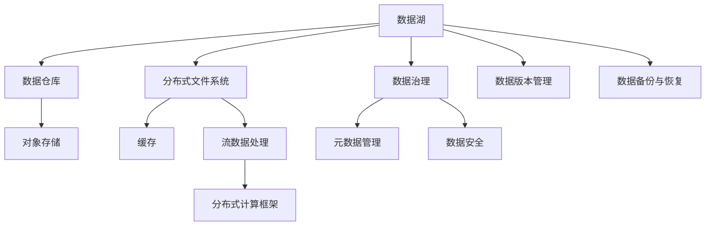

                 

# AI 大模型应用数据中心的数据架构

## 1. 背景介绍

### 1.1 问题由来

在人工智能（AI）领域，尤其是深度学习（Deep Learning）的迅猛发展中，大模型（Large Models）的概念日益受到重视。大模型通常指具有大量参数和层数的深度神经网络，它们在诸如语言理解、图像识别、推荐系统等领域展现出卓越的性能。然而，这些模型的训练与部署依赖于大量的数据和计算资源，这对数据中心的数据架构提出了新的要求。

### 1.2 问题核心关键点

构建高效、安全、可扩展的数据中心数据架构，成为大模型应用过程中必须解决的关键问题。核心点包括：
1. **数据存储与访问：** 高效的数据存储机制和大规模数据访问能力是大模型训练的基础。
2. **数据传输与带宽：** 大模型在训练和推理过程中需要大量数据传输，带宽和延迟成为瓶颈。
3. **数据隐私与安全：** 大模型涉及大量敏感数据，数据隐私和安全保护是必须考虑的重要因素。
4. **数据分布与冗余：** 数据中心往往分布在全球各地，如何实现数据分布式存储和容错处理是挑战。
5. **数据与模型版本管理：** 模型训练迭代频繁，如何高效管理数据和模型版本，提供一致的服务。

### 1.3 问题研究意义

构建高效的数据中心数据架构，对于推动大模型应用落地，提升AI技术的实际效用具有重要意义：
1. **降低成本：** 优化数据存储和传输机制，提高计算资源的利用率，降低大模型训练和推理的成本。
2. **提升性能：** 通过合理的架构设计，减少数据访问延迟和传输瓶颈，加快模型训练和推理的速度。
3. **保障安全：** 确保数据隐私和安全，避免数据泄露和滥用，增强大模型应用的可信度。
4. **提高可扩展性：** 通过分布式存储和计算，实现数据中心的高效扩展，满足大规模模型和海量数据的需求。

## 2. 核心概念与联系

### 2.1 核心概念概述

在大模型应用数据中心的架构设计中，涉及多个关键概念，包括但不限于：

- **数据湖（Data Lake）：** 集中存储所有原始数据，支持任意数据格式和规模。
- **数据仓库（Data Warehouse）：** 高度结构化的数据存储，便于分析和查询。
- **对象存储（Object Storage）：** 非结构化数据存储，适合大规模文件和图像等数据。
- **分布式文件系统（Distributed File System）：** 支持大规模数据分布式存储，提供高可靠性、高可用性。
- **缓存（Caching）：** 利用高速缓存，提高数据访问速度和系统响应时间。
- **流数据处理（Streaming Data Processing）：** 实时处理和分析大数据流，支持低延迟的数据处理需求。
- **分布式计算框架（Distributed Computing Framework）：** 如Apache Spark、Hadoop等，支持大规模分布式计算。

这些概念相互关联，共同构成了数据中心的完整架构，支撑大模型的训练与推理。

### 2.2 核心概念原理和架构的 Mermaid 流程图



## 3. 核心算法原理 & 具体操作步骤

### 3.1 算法原理概述

大模型应用数据中心的数据架构设计，核心算法原理主要围绕数据存储、数据访问、数据传输和数据安全展开。目标是构建一个高效、安全、可扩展的数据中心，支持大模型的训练和推理需求。

### 3.2 算法步骤详解

构建数据中心数据架构的具体步骤包括以下几个方面：

**Step 1: 数据存储策略**

- **选择数据存储方式：** 根据数据类型和访问频率选择不同的存储方式。例如，常用的数据存储方式包括对象存储（如Amazon S3）、分布式文件系统（如HDFS）和数据仓库（如Redshift）。
- **设计数据冗余策略：** 采用多副本、分布式存储，确保数据的可靠性和可用性。

**Step 2: 数据访问优化**

- **数据本地化：** 将数据存储在计算资源附近，减少数据传输延迟。
- **缓存机制：** 利用高速缓存，如Redis、Memcached，提高数据访问速度。
- **分布式访问控制：** 通过访问控制列表（ACL）和身份验证机制，确保数据访问安全。

**Step 3: 数据传输与带宽优化**

- **数据压缩与解压缩：** 采用数据压缩技术，减少数据传输的带宽需求。
- **网络带宽优化：** 设计合理的流量控制和带宽分配策略，避免网络拥塞。
- **分布式文件传输：** 利用分布式文件传输协议（如HDFS的DistributedCache），提高数据传输效率。

**Step 4: 数据安全与隐私保护**

- **数据加密：** 对存储和传输中的数据进行加密，防止数据泄露。
- **访问控制：** 通过访问控制策略和身份验证机制，确保数据访问的安全性。
- **审计与监控：** 实时监控数据访问行为，设置异常告警，及时发现和处理安全事件。

**Step 5: 数据治理与版本管理**

- **数据治理：** 通过数据质量管理、数据生命周期管理等手段，确保数据一致性和准确性。
- **数据版本管理：** 管理数据和模型的不同版本，提供回滚和恢复功能。
- **数据备份与恢复：** 定期备份数据，提供快速的数据恢复机制。

### 3.3 算法优缺点

构建数据中心数据架构的算法具有以下优点：
1. **高效性：** 通过合理的架构设计，能够显著提高数据访问和传输效率，减少延迟和带宽需求。
2. **可扩展性：** 支持大规模数据存储和分布式计算，能够应对不断增长的数据量。
3. **安全性：** 通过数据加密、访问控制和审计监控等措施，确保数据隐私和安全。

同时，该算法也存在以下缺点：
1. **复杂性：** 设计和管理一个高效的数据架构需要综合考虑多个方面，技术复杂度高。
2. **成本高：** 高效的数据存储和计算资源需要投入大量的资金和人力。
3. **灵活性不足：** 一旦架构设计完成，后续的调整和优化可能受到现有架构的限制。

### 3.4 算法应用领域

构建高效的数据中心数据架构，可以应用于各种大模型应用场景，包括但不限于：

- **自然语言处理（NLP）：** 通过数据湖和数据仓库存储和处理文本数据，支持BERT、GPT等模型的训练和推理。
- **计算机视觉（CV）：** 利用对象存储和分布式文件系统存储图像数据，支持ResNet、CNN等模型的训练和推理。
- **推荐系统：** 通过数据湖和数据仓库存储用户行为数据，支持多模态数据的融合，提升推荐算法的效果。
- **语音识别：** 利用缓存和流数据处理技术，实现实时语音数据的处理和分析，支持语音识别模型。
- **智能医疗：** 通过数据安全和隐私保护措施，存储和处理医疗数据，支持医疗AI模型的训练和推理。

## 4. 数学模型和公式 & 详细讲解 & 举例说明

### 4.1 数学模型构建

在大模型应用数据中心的架构设计中，数学模型主要用于描述数据存储、访问、传输和安全的优化目标。以下是一个简单的数学模型构建示例：

**目标函数：**

$$
\min_{x} \left\{\sum_{i=1}^{n} (x_i - d_i)^2\right\}
$$

其中 $x$ 表示数据访问延迟，$d$ 表示理想延迟值。目标函数表示最小化实际延迟与理想延迟的差异。

**约束条件：**

1. $0 \leq x_i \leq T$
2. $\sum_{i=1}^{n} x_i \leq C$
3. $\sum_{i=1}^{n} x_i = \sum_{i=1}^{n} d_i$

其中 $T$ 表示数据传输时间上限，$C$ 表示带宽上限，$n$ 表示数据访问次数。

### 4.2 公式推导过程

**延迟优化：**

$$
\min_{x} \left\{\sum_{i=1}^{n} (x_i - d_i)^2\right\}
$$

通过拉格朗日乘数法，引入辅助变量 $\lambda$，构建拉格朗日函数：

$$
\mathcal{L}(x, \lambda) = \sum_{i=1}^{n} (x_i - d_i)^2 + \lambda (x_i - T) + \mu (\sum_{i=1}^{n} x_i - C) + \nu (\sum_{i=1}^{n} x_i - \sum_{i=1}^{n} d_i)
$$

对 $x_i$ 和 $\lambda$、$\mu$、$\nu$ 求偏导数，解方程组，得到最优解。

### 4.3 案例分析与讲解

**案例：** 某公司利用分布式文件系统（HDFS）存储大量文本数据，通过对象存储（Amazon S3）存储大量图像数据，设计数据中心架构如下：

1. **数据湖（Hadoop Distributed File System, HDFS）：** 存储原始文本和图像数据。
2. **数据仓库（Amazon Redshift）：** 存储和处理结构化数据，支持SQL查询。
3. **对象存储（Amazon S3）：** 存储大规模非结构化数据，如图像、视频等。
4. **分布式文件缓存（Redis）：** 缓存高频访问的数据，提高数据访问速度。
5. **流数据处理（Apache Kafka）：** 实时处理和分析数据流。
6. **分布式计算框架（Apache Spark）：** 支持大规模分布式计算，加速模型训练和推理。

## 5. 项目实践：代码实例和详细解释说明

### 5.1 开发环境搭建

为了构建高效的数据中心数据架构，首先需要准备好开发环境。以下是使用Python进行Hadoop和Spark的开发环境配置流程：

1. 安装Anaconda：从官网下载并安装Anaconda，用于创建独立的Python环境。

2. 创建并激活虚拟环境：
```bash
conda create -n hadoop-env python=3.8 
conda activate hadoop-env
```

3. 安装Hadoop和Spark：从官网获取对应的安装命令。例如：
```bash
conda install -c conda-forge hadoop
conda install -c conda-forge spark
```

4. 安装各类工具包：
```bash
pip install numpy pandas scikit-learn matplotlib tqdm jupyter notebook ipython
```

完成上述步骤后，即可在`hadoop-env`环境中开始Hadoop和Spark的开发。

### 5.2 源代码详细实现

下面以构建一个简单的大模型应用数据中心为例，展示如何使用Hadoop和Spark进行数据存储和分布式计算。

首先，创建Hadoop集群，包括一个NameNode和一个DataNode：

```bash
hadoop namenode -port 9870
hadoop datanode -port 50020 -conf files/core-site.xml,dfs-site.xml
```

然后，使用Spark进行数据处理：

```python
from pyspark import SparkContext

sc = SparkContext('local[*]', 'Data Processing')

# 读取数据
rdd = sc.textFile('hdfs://localhost:9000/user/hadoop/input.txt')

# 数据处理
def process_data(line):
    # 数据处理逻辑
    return result

rdd.map(process_data).saveAsTextFile('hdfs://localhost:9000/user/hadoop/output.txt')
```

### 5.3 代码解读与分析

**Hadoop集群搭建：**

- `hadoop namenode` 启动NameNode服务，是Hadoop集群的中心节点，管理元数据。
- `hadoop datanode` 启动DataNode服务，负责存储实际数据。

**Spark数据处理：**

- `SparkContext` 初始化Spark环境。
- `sc.textFile` 从Hadoop分布式文件系统读取数据。
- `rdd.map` 对数据进行映射处理。
- `rdd.saveAsTextFile` 将处理结果写入Hadoop分布式文件系统。

通过上述代码，我们可以实现Hadoop和Spark的简单集成，构建一个基本的数据中心数据架构。

### 5.4 运行结果展示

运行上述代码后，数据将被从输入文件读取并处理，结果将保存在输出文件中。可以通过访问Hadoop分布式文件系统查看结果。

## 6. 实际应用场景

### 6.1 智能客服系统

构建高效的数据中心数据架构，可以应用于智能客服系统的构建。传统客服往往需要配备大量人力，高峰期响应缓慢，且一致性和专业性难以保证。而使用高效的数据中心数据架构，可以实现7x24小时不间断服务，快速响应客户咨询，用自然流畅的语言解答各类常见问题。

在技术实现上，可以收集企业内部的历史客服对话记录，将问题和最佳答复构建成监督数据，在此基础上对数据中心数据架构进行微调和优化。微调后的数据中心数据架构能够自动理解用户意图，匹配最合适的答案模板进行回复。对于客户提出的新问题，还可以接入检索系统实时搜索相关内容，动态组织生成回答。如此构建的智能客服系统，能大幅提升客户咨询体验和问题解决效率。

### 6.2 金融舆情监测

金融机构需要实时监测市场舆论动向，以便及时应对负面信息传播，规避金融风险。传统的人工监测方式成本高、效率低，难以应对网络时代海量信息爆发的挑战。利用高效的数据中心数据架构，可以对金融领域相关的新闻、报道、评论等文本数据进行实时处理和分析，自动监测不同主题下的情感变化趋势，一旦发现负面信息激增等异常情况，系统便会自动预警，帮助金融机构快速应对潜在风险。

### 6.3 个性化推荐系统

当前的推荐系统往往只依赖用户的历史行为数据进行物品推荐，无法深入理解用户的真实兴趣偏好。利用高效的数据中心数据架构，可以更好地挖掘用户行为背后的语义信息，从而提供更精准、多样的推荐内容。

在实践中，可以收集用户浏览、点击、评论、分享等行为数据，提取和用户交互的物品标题、描述、标签等文本内容。将文本内容作为模型输入，用户的后续行为（如是否点击、购买等）作为监督信号，在此基础上优化数据中心数据架构，使其能够从文本内容中准确把握用户的兴趣点。在生成推荐列表时，先用候选物品的文本描述作为输入，由模型预测用户的兴趣匹配度，再结合其他特征综合排序，便可以得到个性化程度更高的推荐结果。

### 6.4 未来应用展望

随着数据中心数据架构的不断发展，其在更多领域将得到应用，为传统行业带来变革性影响。

在智慧医疗领域，基于高效的数据中心数据架构的AI诊断系统将提升医疗服务的智能化水平，辅助医生诊疗，加速新药开发进程。

在智能教育领域，数据中心数据架构可用于作业批改、学情分析、知识推荐等方面，因材施教，促进教育公平，提高教学质量。

在智慧城市治理中，数据中心数据架构可用于城市事件监测、舆情分析、应急指挥等环节，提高城市管理的自动化和智能化水平，构建更安全、高效的未来城市。

此外，在企业生产、社会治理、文娱传媒等众多领域，高效的数据中心数据架构也将不断涌现，为传统行业数字化转型升级提供新的技术路径。相信随着技术的日益成熟，数据中心数据架构必将在构建人机协同的智能时代中扮演越来越重要的角色。

## 7. 工具和资源推荐

### 7.1 学习资源推荐

为了帮助开发者系统掌握数据中心数据架构的理论基础和实践技巧，这里推荐一些优质的学习资源：

1. 《大数据技术与应用》系列博文：由大数据专家撰写，深入浅出地介绍了大数据技术的基本原理和实际应用。

2. CS220《大规模数据处理》课程：斯坦福大学开设的课程，介绍大规模数据处理的核心理论和实践方法，包括Hadoop和Spark等技术。

3. 《大数据：技术与应用》书籍：全面介绍了大数据技术，包括数据存储、数据处理、数据可视化等方面。

4. Hadoop和Spark官方文档：详细的API文档和示例代码，是学习和使用这些技术的必备资源。

5. Apache Spark和Hadoop的培训课程：线上线下培训课程，提供实际动手实践的机会，帮助开发者快速上手。

通过对这些资源的学习实践，相信你一定能够快速掌握数据中心数据架构的精髓，并用于解决实际的AI大模型应用问题。

### 7.2 开发工具推荐

高效的开发离不开优秀的工具支持。以下是几款用于数据中心数据架构开发的常用工具：

1. Hadoop和Spark：开源的大数据处理框架，支持分布式计算和数据存储。
2. Kafka：高性能的消息队列系统，支持实时数据流处理。
3. Redis：高速缓存系统，提高数据访问速度和系统响应时间。
4. HBase：分布式数据库，支持大规模数据存储和访问。
5. ElasticSearch：分布式搜索引擎，支持高效的文本搜索和分析。
6. Grafana：数据可视化工具，实时展示数据中心性能指标。

合理利用这些工具，可以显著提升数据中心数据架构的开发效率，加快创新迭代的步伐。

### 7.3 相关论文推荐

数据中心数据架构的发展源于学界的持续研究。以下是几篇奠基性的相关论文，推荐阅读：

1. MapReduce: Simplified Data Processing on Large Clusters：介绍MapReduce计算模型，支持大规模分布式计算。

2. Hadoop: A Distributed File System（HDFS）：介绍Hadoop分布式文件系统，支持大规模数据存储。

3. Apache Spark: The Unified Analytics Engine：介绍Spark分布式计算框架，支持快速数据处理和分析。

4. Kafka: The Log-Processing Toolkit for Streams and Queues：介绍Kafka消息队列系统，支持实时数据流处理。

5. Redis: In-Memory Data-Structure Store：介绍Redis高速缓存系统，支持高效的数据访问和操作。

这些论文代表了大数据处理技术的发展脉络。通过学习这些前沿成果，可以帮助研究者把握学科前进方向，激发更多的创新灵感。

## 8. 总结：未来发展趋势与挑战

### 8.1 总结

本文对构建高效的数据中心数据架构进行了全面系统的介绍。首先阐述了数据中心在大模型应用中的重要性，明确了数据架构在大模型训练和推理中的基础作用。其次，从原理到实践，详细讲解了数据架构的构建过程，给出了数据中心数据架构的完整代码实例。同时，本文还广泛探讨了数据架构在智能客服、金融舆情、个性化推荐等多个行业领域的应用前景，展示了数据中心数据架构的广泛适用性。

通过本文的系统梳理，可以看到，高效的数据中心数据架构为大模型应用提供了坚实的基础，显著提升了模型的训练和推理效率，降低了成本和风险。未来，伴随数据中心技术的发展，大模型应用的落地和扩展将更加迅速，数据中心数据架构也将得到更多的应用和创新。

### 8.2 未来发展趋势

展望未来，数据中心数据架构将呈现以下几个发展趋势：

1. **自动化和智能化：** 通过AI技术，自动优化数据中心资源分配和调度，实现智能化管理。
2. **边缘计算：** 利用边缘计算技术，实现数据就地处理和分析，减少数据传输延迟。
3. **多云协作：** 利用多云协作技术，实现跨云数据共享和应用集成，提升资源利用率。
4. **混合云架构：** 结合公有云和私有云，实现灵活的云资源管理和数据安全。
5. **容器化管理：** 利用容器化技术，实现微服务的自动化部署和扩缩容，提升系统灵活性和可扩展性。

这些趋势凸显了数据中心数据架构的广阔前景。这些方向的探索发展，必将进一步提升数据中心的效率和性能，为大规模AI模型提供更坚实的基础。

### 8.3 面临的挑战

尽管高效的数据中心数据架构已经取得了显著进展，但在迈向更加智能化、普适化应用的过程中，它仍面临诸多挑战：

1. **复杂性：** 数据中心架构设计涉及多方面的考量，如数据存储、访问、传输、安全等，技术复杂度较高。
2. **资源成本：** 高效的数据中心架构需要投入大量的计算和存储资源，初期投入成本较高。
3. **灵活性：** 数据中心架构一旦设计完成，后续的调整和优化可能受到现有架构的限制。
4. **数据安全：** 在处理大量敏感数据时，如何保障数据安全和隐私保护成为重要问题。
5. **扩展性：** 在大规模数据和计算负载下，如何实现高效的数据中心扩展和容错处理。

正视数据中心架构面临的这些挑战，积极应对并寻求突破，将是大规模AI模型应用落地过程中必须解决的问题。

### 8.4 研究展望

面对数据中心架构所面临的挑战，未来的研究需要在以下几个方面寻求新的突破：

1. **自动化优化：** 利用AI技术，自动优化数据中心资源分配和调度，提升系统的灵活性和响应速度。
2. **边缘计算优化：** 针对边缘计算的场景，优化数据传输和处理策略，减少数据传输延迟和带宽消耗。
3. **多云协作技术：** 探索多云协作技术，实现跨云数据共享和应用集成，提高资源利用率。
4. **混合云架构优化：** 结合公有云和私有云，实现灵活的云资源管理和数据安全。
5. **容器化管理优化：** 利用容器化技术，实现微服务的自动化部署和扩缩容，提升系统灵活性和可扩展性。

这些研究方向将进一步推动数据中心架构的发展，为大规模AI模型提供更坚实的基础，助力AI技术在更多领域的落地和应用。

## 9. 附录：常见问题与解答

**Q1: 数据中心数据架构的设计原则是什么？**

A: 数据中心数据架构的设计原则包括：
1. **高可用性：** 确保数据中心的高可用性，避免单点故障，实现数据冗余和容错。
2. **高性能：** 优化数据存储和访问性能，减少数据传输延迟和带宽消耗。
3. **安全性：** 确保数据隐私和安全，防止数据泄露和滥用。
4. **可扩展性：** 实现数据中心的高效扩展，支持大规模数据和计算需求。
5. **成本效益：** 在满足性能和安全要求的前提下，控制数据中心的成本。

**Q2: 数据中心架构中，如何保证数据的一致性和准确性？**

A: 数据一致性和准确性可以通过以下措施保证：
1. **数据治理：** 通过数据质量管理、数据生命周期管理等手段，确保数据的一致性和准确性。
2. **数据校验：** 对数据进行定期校验，发现并纠正数据错误。
3. **版本管理：** 管理数据和模型的不同版本，提供回滚和恢复功能。
4. **数据审计：** 对数据处理过程进行审计，发现并纠正数据处理错误。

**Q3: 数据中心架构中，如何实现数据的快速访问和处理？**

A: 数据的快速访问和处理可以通过以下措施实现：
1. **缓存机制：** 利用高速缓存，如Redis、Memcached，提高数据访问速度。
2. **分布式文件系统：** 采用分布式文件系统，如HDFS、Ceph，实现数据的高效存储和访问。
3. **分布式计算框架：** 利用Spark、Flink等分布式计算框架，加速数据处理和分析。

**Q4: 数据中心架构中，如何实现数据的安全存储和传输？**

A: 数据的安全存储和传输可以通过以下措施实现：
1. **数据加密：** 对存储和传输中的数据进行加密，防止数据泄露。
2. **访问控制：** 通过访问控制策略和身份验证机制，确保数据访问的安全性。
3. **审计与监控：** 实时监控数据访问行为，设置异常告警，及时发现和处理安全事件。

**Q5: 数据中心架构中，如何实现数据的分布式存储和计算？**

A: 数据的分布式存储和计算可以通过以下措施实现：
1. **分布式文件系统：** 采用分布式文件系统，如HDFS、Ceph，实现数据的高效存储和访问。
2. **分布式计算框架：** 利用Spark、Hadoop等分布式计算框架，支持大规模分布式计算。
3. **容器化管理：** 利用容器化技术，实现微服务的自动化部署和扩缩容，提升系统灵活性和可扩展性。

通过上述措施，可以构建高效、安全、可扩展的数据中心数据架构，支撑大规模AI模型的训练和推理需求。

---

作者：禅与计算机程序设计艺术 / Zen and the Art of Computer Programming

