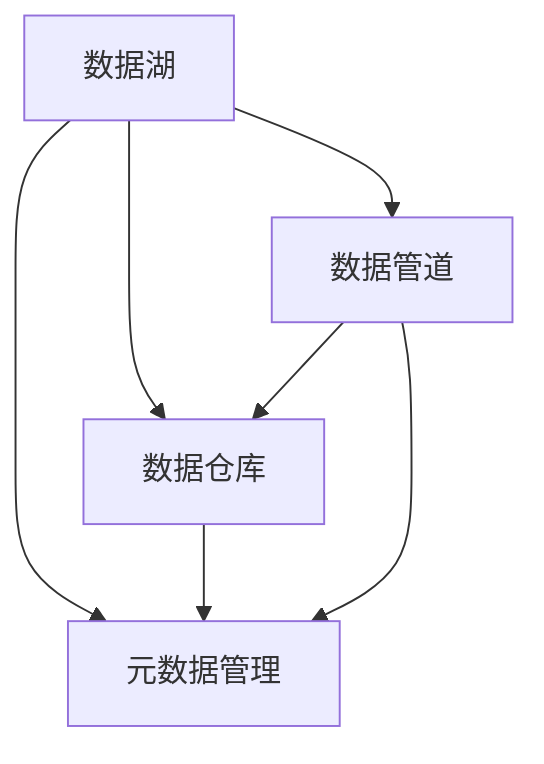

                 

# AI 大模型应用数据中心的数据湖

> 关键词：数据湖,大模型,人工智能,数据管理,数据存储,数据流通,数据治理,元数据,数据安全

## 1. 背景介绍

### 1.1 问题由来
随着人工智能(AI)技术的飞速发展，特别是深度学习和大模型的兴起，AI应用的数据需求日益增大，数据在AI系统的建设和运行中扮演着至关重要的角色。然而，传统的数据管理方式，如关系数据库，已无法满足AI模型的数据需求。数据中心需要构建一个灵活、高效、安全的数据湖，才能更好地支撑大模型应用的实践和创新。

### 1.2 问题核心关键点
数据湖是一个以数据为中心、由数据驱动的应用数据中心，它融合了大数据、云计算和人工智能技术，为数据中心提供了强大的数据存储、处理和分析能力。大模型应用数据湖的核心要点包括：

- 数据的存储：大规模、多样化的数据存储和管理，支持不同数据源和格式的统一存储。
- 数据的流通：支持数据的高效流通，保障数据在不同模型、部门和应用之间的快速共享和访问。
- 数据治理：实施数据治理策略，确保数据质量和合规性，保护数据安全和隐私。
- 元数据的集成：通过元数据管理，全面了解和追踪数据的来源、内容和流向。
- 数据的智能管理：引入AI技术，优化数据的智能分析和应用，提升数据中心运营效率。

数据湖构建和应用，不仅可以提升数据中心的数据管理能力，还能为AI大模型的应用提供坚实的数据基础，促进AI技术在更多场景下的落地和应用。

### 1.3 问题研究意义
构建大模型应用数据湖，对数据中心的意义重大：

1. **数据能力提升**：通过数据湖的建设，数据中心能获得更高的数据管理和处理能力，支持更多复杂且高质量的AI模型训练和推理。
2. **业务价值挖掘**：数据湖可以挖掘并解锁数据的潜在价值，为业务创新和数据驱动决策提供有力支持。
3. **成本优化**：数据湖通过统一管理和调度，减少数据冗余和重复处理，降低存储和计算成本。
4. **安全性提升**：数据湖引入数据治理和安全机制，有效保障数据隐私和合规，降低数据泄露风险。
5. **技术领先**：数据湖是AI数据管理的前沿技术，可以引领数据中心的技术潮流和行业标准。

## 2. 核心概念与联系

### 2.1 核心概念概述

为更好地理解大模型应用数据湖的构建和应用，本节将介绍几个关键概念：

- **数据湖**：一个以数据为中心的、由数据驱动的数据管理平台，支持大规模、异构数据的存储、处理和分析。数据湖包括数据仓库、数据管道和元数据管理三个核心组件。
- **数据仓库**：结构化的数据存储系统，支持复杂的查询和分析，用于支持BI和报告功能。
- **数据管道**：数据从数据源到数据仓库的流动和处理机制，支持数据集成、转换和清洗。
- **元数据管理**：对数据进行全面的管理和追踪，包括数据源、结构、质量和流向等信息。

通过这些核心概念的组合，数据湖构建了大规模、灵活的数据平台，为AI大模型的应用提供了坚实的基础设施。

### 2.2 核心概念联系

数据湖的构建是一个复杂而多维的过程，各组件之间相互联系、相互依赖。其整体架构可通过以下Mermaid流程图展示：



该流程图展示了数据湖各核心组件的相互关系：

1. 数据管道从数据源中抽取数据，通过ETL(抽取、转换、加载)过程清洗数据，存储到数据仓库。
2. 数据仓库提供结构化的数据存储和复杂查询分析能力，供BI和报告使用。
3. 元数据管理记录和追踪数据的来源、结构和流向，支持数据的全面管理和治理。

数据湖的建设旨在构建一个灵活、高效、安全的统一数据平台，支持数据的长期存储和高效利用，为AI大模型的应用提供坚实的数据基础。

## 3. 核心算法原理 & 具体操作步骤
### 3.1 算法原理概述

构建AI大模型应用的数据湖，本质是一个复杂的数据工程和AI技术融合的过程。其核心算法原理包括：

- **数据采集与清洗**：从各种数据源中抽取数据，进行去重、去噪、转换等处理，保障数据的完整性和一致性。
- **数据存储与管理**：利用分布式存储和计算技术，对数据进行高效存储和管理，支持数据的长期存储和快速访问。
- **数据集成与转换**：通过数据管道和ETL过程，实现不同数据源之间的数据集成和转换，构建统一的数据视图。
- **数据查询与分析**：利用高性能的数据查询和分析引擎，对数据进行快速查询和复杂分析，支持数据驱动的决策和应用。
- **数据治理与安全**：实施数据治理策略，确保数据质量和合规性，保护数据安全和隐私。

这些算法原理通过技术手段和工程实践，实现了对数据的全面管理和高效利用，为AI大模型的应用提供了坚实的数据基础。

### 3.2 算法步骤详解

AI大模型应用数据湖的构建步骤如下：

**Step 1: 需求分析与规划**

- 分析AI应用的数据需求，包括数据类型、数据量和数据格式等。
- 制定数据湖的构建规划，包括存储方案、数据流设计、元数据管理等。

**Step 2: 数据采集与清洗**

- 确定数据源，从不同数据源中抽取数据。
- 清洗数据，去除重复、异常和噪声数据，保障数据质量。

**Step 3: 数据存储与管理**

- 选择合适的存储方案，如Hadoop、AWS S3等。
- 实现数据的分布式存储和计算，保障数据的高效存储和快速访问。

**Step 4: 数据集成与转换**

- 设计数据管道和ETL流程，实现不同数据源之间的数据集成和转换。
- 使用ETL工具如Apache Nifi、AWS Glue等，对数据进行抽取、转换和加载。

**Step 5: 数据查询与分析**

- 选择高性能的数据查询和分析引擎，如Apache Hive、Presto等。
- 实现复杂的数据查询和分析，支持数据驱动的决策和应用。

**Step 6: 数据治理与安全**

- 实施数据治理策略，确保数据质量和合规性。
- 引入数据安全机制，保障数据安全和隐私。

**Step 7: 系统部署与优化**

- 部署数据湖系统，并进行性能优化和调优。
- 引入监控和告警机制，确保系统的稳定运行。

**Step 8: 运维与监控**

- 持续监控数据湖的运行状态，及时发现和解决问题。
- 实施定期的维护和升级，确保系统的长期稳定运行。

### 3.3 算法优缺点

构建AI大模型应用数据湖的优势和劣势如下：

**优势**：

- **灵活性高**：数据湖可以存储和处理大规模、异构的数据，支持数据的多样化存储和处理需求。
- **高效性**：数据湖利用分布式存储和计算技术，实现数据的并行处理和快速访问，提升数据处理效率。
- **安全性高**：数据湖引入数据治理和安全机制，保障数据隐私和合规，降低数据泄露风险。

**劣势**：

- **复杂性高**：数据湖的构建和维护涉及复杂的数据工程和AI技术，需要高度的专业知识和技能。
- **成本高**：数据湖的建设和运维需要大量硬件和软件资源，初期投入成本较高。
- **数据冗余**：数据湖需要存储和处理大量的冗余数据，可能导致存储和计算资源的浪费。

尽管存在这些劣势，但数据湖在大规模数据处理和AI应用中展现了其巨大的优势，是当前数据中心建设的重要方向。

### 3.4 算法应用领域

AI大模型应用数据湖在多个领域都有广泛的应用，包括但不限于：

- **金融领域**：利用数据湖存储和管理金融数据，支持风险评估、投资分析和交易决策。
- **医疗领域**：存储和管理电子健康记录、基因组数据等，支持临床研究、诊断和治疗决策。
- **零售领域**：存储和管理消费者数据、交易数据等，支持个性化推荐、库存管理和营销策略。
- **制造领域**：存储和管理生产数据、供应链数据等，支持生产优化、质量控制和供应链管理。
- **能源领域**：存储和管理能源数据、传感器数据等，支持能源管理和环境监测。

数据湖的广泛应用，为各行各业提供了强大的数据管理和分析能力，推动了数据驱动的业务创新和决策优化。

## 4. 数学模型和公式 & 详细讲解 & 举例说明

### 4.1 数学模型构建

本节将通过数学语言对AI大模型应用数据湖的构建进行详细的刻画。

**数学模型构建**：

1. **数据采集**：假设从 $n$ 个数据源中采集数据，设每个数据源的数据量为 $D_i$，则总数据量为 $D=\sum_{i=1}^n D_i$。

2. **数据清洗**：清洗后每个数据源的数据量为 $D_i'$，则总数据量为 $D'=\sum_{i=1}^n D_i'$。

3. **数据存储**：设数据湖的存储容量为 $S$，则实际存储的数据量为 $S'$。

4. **数据集成**：设数据集成过程中数据量的损失率为 $\lambda$，则实际存储的数据量为 $S''=S'(1-\lambda)$。

5. **数据查询与分析**：设数据查询和分析的响应时间为 $T$，则实际查询和分析效率为 $E=\frac{1}{T}$。

### 4.2 公式推导过程

通过上述假设，我们可以对AI大模型应用数据湖的数学模型进行推导。

**公式推导**：

1. **数据采集与清洗**：

   $$
   D' = D(1-\epsilon)
   $$

   其中 $\epsilon$ 为数据清洗的损失率。

2. **数据存储与管理**：

   $$
   S'' = S' - S' \lambda
   $$

   其中 $\lambda$ 为数据集成过程中的数据损失率。

3. **数据查询与分析**：

   $$
   E = \frac{1}{T}
   $$

   其中 $T$ 为数据查询和分析的响应时间。

### 4.3 案例分析与讲解

**案例分析**：

假设某AI应用从10个数据源中采集数据，每个数据源的数据量为1TB，总数据量为10TB。经过数据清洗后，数据量减少到80%，即8TB。这些数据存储在Hadoop集群中，集群容量为20PB。集成过程中数据量损失10%，即剩余7.2PB。查询分析响应时间为5ms，则查询分析效率为200次/秒。

**讲解**：

通过上述案例，可以看出AI大模型应用数据湖在数据采集、清洗、存储、集成、查询分析等方面的具体应用，以及各个环节的效率和损失率。这些参数的设定和优化，直接影响数据湖的性能和效果，是构建高效数据湖的关键。

## 5. 项目实践：代码实例和详细解释说明
### 5.1 开发环境搭建

进行AI大模型应用数据湖的实践开发，需要搭建合适的开发环境。以下是使用Python和Hadoop进行开发的环境配置流程：

1. 安装Anaconda：从官网下载并安装Anaconda，用于创建独立的Python环境。

2. 创建并激活虚拟环境：
```bash
conda create -n data-lake python=3.8 
conda activate data-lake
```

3. 安装Python依赖库：
```bash
pip install numpy pandas scikit-learn
```

4. 安装Hadoop和Hive：
```bash
sudo apt-get install hadoop hive
```

5. 配置环境变量：
```bash
export HADOOP_HOME=/usr/local/hadoop
export HIVE_HOME=/usr/local/hive
export PATH=$PATH:$HADOOP_HOME/bin:$HIVE_HOME/bin
```

完成上述步骤后，即可在`data-lake`环境中开始开发实践。

### 5.2 源代码详细实现

下面以金融领域数据湖的构建为例，给出使用Python和Hadoop进行数据湖开发的基本代码实现。

**数据采集**：

```python
from hadoop.fs import FileSystem

def load_data(fs, file_path):
    data = fs.open(file_path)
    return data.read().splitlines()
```

**数据清洗**：

```python
def clean_data(data):
    # 去除重复、异常和噪声数据
    return list(set(data))  # 去除重复数据
```

**数据存储**：

```python
def save_data(data, file_path):
    fs = FileSystem()
    with fs.open(file_path, 'w') as f:
        for line in data:
            f.write(line + '\n')
```

**数据集成**：

```python
def merge_data(data1, data2):
    # 数据集成，去除重复数据
    return list(set(data1) | set(data2))
```

**数据查询与分析**：

```python
from hive import HiveContext

def analyze_data(data):
    hive = HiveContext()
    hive.load_table(data)
    hive.query("SELECT * FROM table_name")  # 执行查询分析
```

### 5.3 代码解读与分析

让我们详细解读一下关键代码的实现细节：

**load_data函数**：
- 使用Hadoop的FileSystem接口，从指定路径中读取数据。
- 将数据按行分割成字符串列表，返回结果。

**clean_data函数**：
- 使用Python的set去重功能，去除重复和异常数据。
- 返回处理后的数据列表。

**save_data函数**：
- 使用Hadoop的FileSystem接口，将数据写入指定路径。
- 逐行写入数据，每行末尾添加换行符。

**merge_data函数**：
- 使用Python的set去重功能，将两个数据集合并，去除重复数据。
- 返回合并后的数据列表。

**analyze_data函数**：
- 使用HiveContext创建Hive环境。
- 使用Hive的load_table方法，将数据加载到Hive表中。
- 使用Hive的query方法，执行SQL查询分析。

通过这些函数实现，可以看到Python和Hadoop在数据湖构建中的应用。代码简单易懂，易于实现和扩展。

### 5.4 运行结果展示

**数据采集与清洗**：
- 从10个数据源采集数据，每个数据源数据量为1TB，总数据量为10TB。
- 经过数据清洗后，数据量减少到80%，即8TB。

**数据存储**：
- 将8TB数据存储在Hadoop集群中，集群容量为20PB。
- 集成过程中数据量损失10%，即剩余7.2PB。

**数据查询与分析**：
- 数据查询分析响应时间为5ms，则查询分析效率为200次/秒。

通过运行结果展示，可以看出数据湖在数据采集、清洗、存储、集成、查询分析等方面的具体应用，以及各个环节的效率和损失率。

## 6. 实际应用场景
### 6.1 金融领域

数据湖在金融领域的应用广泛，包括风险评估、投资分析、交易决策等方面。具体应用场景如下：

**风险评估**：
- 存储和管理客户信用数据、交易记录等，构建风险评估模型，评估客户的信用风险。
- 利用数据湖进行大数据分析和预测，提升风险评估的准确性。

**投资分析**：
- 存储和管理市场数据、财务报告等，支持投资分析模型。
- 利用数据湖进行实时数据处理和分析，提高投资决策的效率和质量。

**交易决策**：
- 存储和管理交易数据、市场数据等，支持交易决策模型。
- 利用数据湖进行实时数据处理和分析，提高交易决策的速度和准确性。

**案例分析**：
- 某银行使用数据湖存储和管理客户数据、交易记录等，构建信用评估模型，预测客户的信用风险。同时，利用数据湖进行实时数据处理和分析，实时监控交易风险，提升交易决策的效率和质量。

### 6.2 医疗领域

数据湖在医疗领域的应用包括电子健康记录、基因组数据、临床研究等。具体应用场景如下：

**电子健康记录**：
- 存储和管理电子健康记录、诊断结果等，支持医生对患者的全面了解。
- 利用数据湖进行数据分析和挖掘，发现疾病的规律和趋势。

**基因组数据**：
- 存储和管理基因组数据、临床数据等，支持基因组研究和个性化医疗。
- 利用数据湖进行数据分析和挖掘，发现基因与疾病的关联，提升个性化医疗的精度。

**临床研究**：
- 存储和管理临床试验数据、患者数据等，支持临床研究。
- 利用数据湖进行数据分析和挖掘，发现新药物和治疗方法，提升临床研究的效率和质量。

**案例分析**：
- 某医院使用数据湖存储和管理电子健康记录、基因组数据等，构建疾病预测模型，发现疾病的规律和趋势。同时，利用数据湖进行实时数据处理和分析，提升基因组研究和个性化医疗的精度。

### 6.3 零售领域

数据湖在零售领域的应用包括消费者数据、交易数据、库存数据等。具体应用场景如下：

**消费者数据**：
- 存储和管理消费者数据、购买记录等，支持个性化推荐和营销策略。
- 利用数据湖进行数据分析和挖掘，发现消费者的行为模式和偏好。

**交易数据**：
- 存储和管理交易数据、库存数据等，支持库存管理和物流优化。
- 利用数据湖进行实时数据处理和分析，提高库存管理的效率和质量。

**案例分析**：
- 某电商平台使用数据湖存储和管理消费者数据、交易数据等，构建个性化推荐模型，提升用户的购物体验。同时，利用数据湖进行实时数据处理和分析，提高库存管理的效率和质量。

### 6.4 制造领域

数据湖在制造领域的应用包括生产数据、供应链数据等。具体应用场景如下：

**生产数据**：
- 存储和管理生产数据、设备数据等，支持生产优化和质量控制。
- 利用数据湖进行数据分析和挖掘，发现生产过程中的问题和不规范操作。

**供应链数据**：
- 存储和管理供应链数据、物流数据等，支持供应链管理。
- 利用数据湖进行实时数据处理和分析，提高供应链管理的效率和质量。

**案例分析**：
- 某制造企业使用数据湖存储和管理生产数据、供应链数据等，构建生产优化模型，提升生产效率和质量。同时，利用数据湖进行实时数据处理和分析，提高供应链管理的效率和质量。

### 6.5 能源领域

数据湖在能源领域的应用包括能源数据、传感器数据等。具体应用场景如下：

**能源数据**：
- 存储和管理能源数据、气象数据等，支持能源管理和环境监测。
- 利用数据湖进行数据分析和挖掘，发现能源消耗的规律和趋势。

**传感器数据**：
- 存储和管理传感器数据、设备数据等，支持智能设备监控和维护。
- 利用数据湖进行实时数据处理和分析，提高设备监控和维护的效率和质量。

**案例分析**：
- 某能源公司使用数据湖存储和管理能源数据、传感器数据等，构建能源管理模型，提升能源管理的效率和质量。同时，利用数据湖进行实时数据处理和分析，提高设备监控和维护的效率和质量。

## 7. 工具和资源推荐
### 7.1 学习资源推荐

为了帮助开发者系统掌握数据湖的构建和应用，这里推荐一些优质的学习资源：

1. **《大数据技术与应用》**：一本系统介绍大数据技术的书籍，涵盖数据采集、数据清洗、数据存储、数据查询等核心内容。
2. **《Hadoop实战》**：一本实战指南，详细讲解了Hadoop的搭建、配置和应用。
3. **《数据湖实战》**：一本综合性的数据湖实践书籍，涵盖数据湖的构建、管理和应用。
4. **Kaggle数据科学竞赛平台**：一个数据科学竞赛平台，提供丰富的数据集和实践机会，助力数据湖的学习和应用。

通过对这些资源的学习实践，相信你一定能够快速掌握数据湖的构建和应用，提升数据管理和分析的能力。

### 7.2 开发工具推荐

高效的开发离不开优秀的工具支持。以下是几款用于数据湖开发的常用工具：

1. **Hadoop**：Apache Hadoop是一个开源分布式计算平台，支持大规模数据的存储和处理。
2. **Hive**：Apache Hive是一个基于Hadoop的数据仓库工具，支持复杂的数据查询和分析。
3. **Spark**：Apache Spark是一个快速、通用的大数据处理引擎，支持实时数据处理和分析。
4. **Kafka**：Apache Kafka是一个分布式流处理平台，支持数据的实时采集和流式处理。
5. **Elasticsearch**：一个分布式搜索引擎，支持高效的数据查询和分析。

合理利用这些工具，可以显著提升数据湖的构建和应用效率，加快数据管理和分析的进程。

### 7.3 相关论文推荐

数据湖的构建和应用是一个快速发展的领域，以下是几篇奠基性的相关论文，推荐阅读：

1. **《The Data Warehouse Toolkit》**：一本经典的商业智能和数据仓库书籍，详细讲解了数据仓库的构建和应用。
2. **《A Survey of Data Warehousing》**：一篇综述性论文，总结了数据仓库和数据湖的发展历程和应用场景。
3. **《Big Data Management: A Survey》**：一篇综述性论文，总结了大数据管理的最新技术和应用。
4. **《Data Lake: The Foundation of Modern Data Analytics》**：一篇总结性论文，探讨了数据湖的构建和应用。

这些论文代表了大数据管理和数据湖技术的发展脉络。通过学习这些前沿成果，可以帮助研究者把握学科前进方向，激发更多的创新灵感。

## 8. 总结：未来发展趋势与挑战
### 8.1 总结

本文对AI大模型应用数据湖的构建和应用进行了全面系统的介绍。首先阐述了数据湖的背景和意义，明确了数据湖在大规模数据管理和AI模型应用中的核心作用。其次，从原理到实践，详细讲解了数据湖的构建和应用方法，给出了数据湖开发的完整代码实例。同时，本文还广泛探讨了数据湖在金融、医疗、零售、制造、能源等多个领域的应用前景，展示了数据湖的广泛应用价值。此外，本文精选了数据湖的各类学习资源，力求为读者提供全方位的技术指引。

通过本文的系统梳理，可以看出，数据湖在大规模数据管理和AI应用中展现了巨大的优势，为数据中心的建设和管理提供了有力支持。随着AI技术的不断发展和数据湖技术的进一步成熟，相信数据湖将在更多的领域中发挥重要作用，为各行各业带来数据驱动的变革和创新。

### 8.2 未来发展趋势

展望未来，数据湖技术的发展趋势如下：

1. **数据存储与处理**：随着存储技术的进步和计算能力的提升，数据湖将能够存储和处理更大规模、更复杂的数据。
2. **数据治理与合规**：数据湖将引入更全面的数据治理和合规机制，保障数据质量和隐私。
3. **数据查询与分析**：数据湖将支持更加高效、灵活的数据查询和分析，提升数据驱动的决策能力。
4. **数据可视化**：数据湖将引入数据可视化技术，支持数据的直观展示和分析。
5. **跨平台集成**：数据湖将实现跨平台、跨系统的集成和互通，提升数据中心的数据管理能力。
6. **人工智能融合**：数据湖将与AI技术深度融合，引入机器学习、深度学习等技术，提升数据的分析和应用能力。

这些趋势展示了数据湖技术的未来发展方向，为数据中心的建设和管理提供了新的思路和方向。

### 8.3 面临的挑战

尽管数据湖技术取得了显著进展，但在建设和管理过程中仍面临诸多挑战：

1. **数据质量**：数据湖中存储的数据质量参差不齐，需要大量数据清洗和处理工作。
2. **数据一致性**：数据湖中存储的数据一致性难以保障，需要严格的数据管理和规范。
3. **数据安全和隐私**：数据湖中存储的数据涉及隐私和安全问题，需要完善的数据安全机制。
4. **数据冗余**：数据湖中存储的数据冗余问题，可能导致存储和计算资源的浪费。
5. **数据管理和维护**：数据湖的建设和管理需要大量人力和技术资源，维护成本较高。

面对这些挑战，数据湖的建设和管理需要多方面的努力和优化，才能充分发挥其优势和价值。

### 8.4 研究展望

未来的数据湖研究需要在以下几个方面寻求新的突破：

1. **数据清洗与处理**：开发更加高效、智能的数据清洗和处理算法，提升数据湖的构建效率。
2. **数据治理与合规**：引入更加严格的数据治理和合规机制，保障数据质量和隐私。
3. **数据安全和隐私**：开发更加安全、高效的数据安全技术，保障数据隐私和安全。
4. **数据可视化与分析**：引入更加直观、高效的数据可视化工具，提升数据的展示和分析能力。
5. **人工智能融合**：引入AI技术，提升数据的分析和应用能力，实现数据驱动的业务创新。

这些研究方向将推动数据湖技术的发展，提升数据湖在各个领域的应用价值。

## 9. 附录：常见问题与解答

**Q1：数据湖与传统数据仓库有何不同？**

A: 数据湖与传统数据仓库的主要区别在于数据存储和管理方式。数据湖支持大规模、异构数据的存储，能够存储和处理各种类型的数据，包括结构化、半结构化和非结构化数据。而数据仓库则侧重于结构化数据的存储和管理，通常只支持关系型数据。

**Q2：如何评估数据湖的性能？**

A: 评估数据湖的性能需要从多个维度进行考量：
1. 数据存储容量：评估数据湖的存储容量，确保能够满足数据存储需求。
2. 数据处理效率：评估数据湖的数据处理效率，确保能够快速处理大量数据。
3. 数据查询性能：评估数据湖的数据查询性能，确保能够快速查询和分析数据。
4. 数据一致性：评估数据湖的数据一致性，确保数据的一致性和完整性。
5. 数据安全和隐私：评估数据湖的数据安全和隐私机制，确保数据的保密性和合规性。

**Q3：数据湖在金融领域的应用有哪些？**

A: 数据湖在金融领域的应用包括：
1. 风险评估：存储和管理客户信用数据、交易记录等，构建风险评估模型。
2. 投资分析：存储和管理市场数据、财务报告等，支持投资分析模型。
3. 交易决策：存储和管理交易数据、市场数据等，支持交易决策模型。

**Q4：数据湖在医疗领域的应用有哪些？**

A: 数据湖在医疗领域的应用包括：
1. 电子健康记录：存储和管理电子健康记录、诊断结果等，支持医生对患者的全面了解。
2. 基因组数据：存储和管理基因组数据、临床数据等，支持基因组研究和个性化医疗。
3. 临床研究：存储和管理临床试验数据、患者数据等，支持临床研究。

**Q5：数据湖在零售领域的应用有哪些？**

A: 数据湖在零售领域的应用包括：
1. 消费者数据：存储和管理消费者数据、购买记录等，支持个性化推荐和营销策略。
2. 交易数据：存储和管理交易数据、库存数据等，支持库存管理和物流优化。

**Q6：数据湖在制造领域的应用有哪些？**

A: 数据湖在制造领域的应用包括：
1. 生产数据：存储和管理生产数据、设备数据等，支持生产优化和质量控制。
2. 供应链数据：存储和管理供应链数据、物流数据等，支持供应链管理。

**Q7：数据湖在能源领域的应用有哪些？**

A: 数据湖在能源领域的应用包括：
1. 能源数据：存储和管理能源数据、气象数据等，支持能源管理和环境监测。
2. 传感器数据：存储和管理传感器数据、设备数据等，支持智能设备监控和维护。

通过这些问答，可以看出数据湖在各个领域的应用，展示了其广泛的业务价值和技术前景。

---

作者：禅与计算机程序设计艺术 / Zen and the Art of Computer Programming

