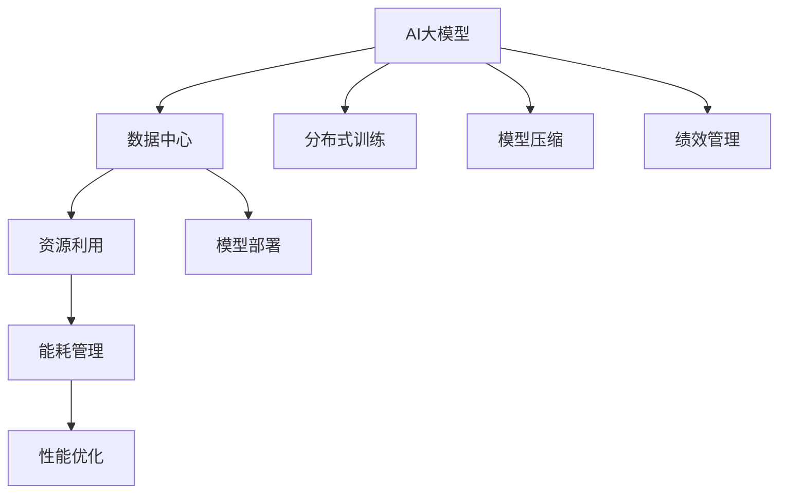

                 

# AI 大模型应用数据中心的绩效管理

> 关键词：AI大模型, 数据中心, 绩效管理, AI推理, 分布式训练, 模型压缩, 模型部署, 性能优化

## 1. 背景介绍

### 1.1 问题由来
随着人工智能技术的飞速发展，AI大模型在各类应用场景中展现出强大的能力，但其在推理和训练过程中所需的巨大计算资源，使其难以广泛部署。为了解决这个问题，人们通常会将大模型部署到大规模数据中心中，利用分布式计算资源来提升训练和推理效率。但与此同时，数据中心在能耗、资源利用率等方面的问题也日益突出，成为影响AI技术普及的重要因素。因此，如何对数据中心中的AI大模型应用进行有效的绩效管理，成为一个重要的研究方向。

### 1.2 问题核心关键点
AI大模型应用数据中心的绩效管理，主要关注以下三个核心问题：
1. **资源利用效率**：如何高效利用数据中心的计算、存储资源，避免资源浪费。
2. **能耗管理**：如何在保证模型性能的前提下，降低数据中心的能耗消耗。
3. **性能优化**：如何提高AI大模型的推理和训练效率，提升用户体验。

## 2. 核心概念与联系

### 2.1 核心概念概述

为更好地理解AI大模型应用数据中心的绩效管理，本节将介绍几个密切相关的核心概念：

- **AI大模型**：以BERT、GPT-3、T5等深度学习模型为代表，具有海量参数、强大推理能力的机器学习模型。这些模型通常需要在大规模数据集上进行预训练和微调，才能应用于实际应用中。

- **数据中心**：由服务器、存储设备、网络设备等组成，用于集中存储、计算和管理数据的设施。数据中心为AI大模型的训练和推理提供了必要的硬件支持。

- **绩效管理**：通过对数据中心的各项资源进行监测和优化，提升资源利用效率、降低能耗、提高模型性能的管理活动。绩效管理在AI大模型应用中具有重要意义，能够帮助企业优化成本、提升服务质量。

- **分布式训练**：通过将模型分解成多个部分，同时在多个计算节点上并行训练，来加速AI大模型的训练过程。

- **模型压缩**：通过减少模型参数量、优化计算图等方法，在不影响模型性能的前提下，减小模型体积和内存占用。

- **模型部署**：将训练好的模型迁移到生产环境，供实际应用使用。

这些核心概念之间的逻辑关系可以通过以下Mermaid流程图来展示：



这个流程图展示了AI大模型应用数据中心的各个环节，以及绩效管理如何在其中发挥作用：

1. AI大模型需要依赖数据中心的计算和存储资源，进行分布式训练和模型部署。
2. 资源利用、能耗管理和性能优化等环节，直接影响到AI大模型在数据中心的运营效率和用户体验。
3. 绩效管理通过对这些环节进行监控和优化，提升整体性能，从而提升AI技术的普及和应用。

## 3. 核心算法原理 & 具体操作步骤
### 3.1 算法原理概述

AI大模型应用数据中心的绩效管理，通常涉及到以下几个核心算法：

- **分布式训练调度算法**：通过优化分布式训练的任务分配和计算资源分配，提高训练效率。
- **模型压缩算法**：通过量化、剪枝、蒸馏等方法，减小模型体积和内存占用。
- **资源管理算法**：通过动态调整计算资源和存储资源的分配，提高资源利用效率。
- **能耗管理算法**：通过优化计算过程，降低数据中心的能耗消耗。

这些算法相互配合，共同提升数据中心中AI大模型的整体性能和运营效率。

### 3.2 算法步骤详解

以下详细介绍各个算法的详细步骤：

**Step 1: 资源需求预测**
- 收集AI大模型训练和推理过程中的资源消耗数据，包括计算资源、存储资源、带宽等。
- 使用机器学习模型或统计方法，预测未来的资源需求。

**Step 2: 资源调度与分配**
- 根据资源需求预测结果，对数据中心的计算和存储资源进行动态调整。
- 使用分布式训练调度算法，合理分配计算任务到各计算节点，避免资源过载。

**Step 3: 模型压缩与优化**
- 对训练好的模型进行量化、剪枝、蒸馏等操作，减小模型体积和内存占用。
- 优化模型计算图，减少计算复杂度，提升推理速度。

**Step 4: 能耗管理**
- 使用高效的计算算法和数据中心硬件优化方法，降低能耗消耗。
- 优化网络通信和数据传输，减少网络带宽的使用。

**Step 5: 绩效监控与优化**
- 实时监控数据中心的资源利用效率、能耗、模型性能等指标。
- 根据监控结果，自动调整资源分配和计算策略，持续优化绩效。

### 3.3 算法优缺点

AI大模型应用数据中心的绩效管理算法，具有以下优点：
1. **高效资源利用**：通过优化资源分配和调度，避免资源浪费，提高资源利用效率。
2. **降低能耗**：通过优化计算过程和网络传输，减少能耗消耗，降低数据中心的运营成本。
3. **提升性能**：通过模型压缩和优化，减小模型体积和内存占用，提升推理速度和模型性能。

同时，这些算法也存在一些局限性：
1. **复杂性高**：算法实现复杂，需要综合考虑资源需求预测、资源调度、模型压缩等多方面因素。
2. **依赖硬件性能**：算法的性能优化效果，受到数据中心硬件性能的限制。
3. **模型性能与计算效率之间的平衡**：在压缩模型时，需要平衡模型性能和计算效率，避免过度压缩导致模型精度下降。

尽管存在这些局限性，AI大模型应用数据中心的绩效管理算法仍然在提升数据中心资源利用效率和降低能耗方面发挥着重要作用。

### 3.4 算法应用领域

AI大模型应用数据中心的绩效管理算法，主要应用于以下几个领域：

- **云计算平台**：如AWS、Azure、Google Cloud等，通过优化资源利用和能耗管理，提升服务质量，降低运营成本。
- **科研机构**：在科学计算和数据处理方面，通过优化计算资源和模型性能，提高研究效率和成果质量。
- **金融领域**：在量化交易、风险管理等方面，通过优化计算资源和模型性能，提升投资决策的准确性和效率。
- **医疗领域**：在医学影像分析、基因组学研究等方面，通过优化计算资源和模型性能，提升诊断和治疗的准确性和效率。

## 4. 数学模型和公式 & 详细讲解 & 举例说明

### 4.1 数学模型构建

在AI大模型应用数据中心的绩效管理中，数学模型构建主要涉及以下几个方面：

- **资源需求预测模型**：使用时间序列分析、回归分析等方法，预测未来的资源需求。
- **资源调度模型**：使用优化算法，如线性规划、遗传算法等，优化计算任务和资源分配。
- **模型压缩模型**：使用量化、剪枝、蒸馏等方法，构建压缩后的模型。

**资源需求预测模型**：
假设数据中心在时间 $t$ 的资源需求为 $R(t)$，利用历史数据 $D=\{(R(t_i), A_i)\}_{i=1}^N$ 进行建模，其中 $A_i$ 为对应的时间特征向量，建模公式如下：

$$
R(t) = \mathop{\arg\min}_{A} \sum_{i=1}^N (R_i - A_i)^2
$$

其中 $R_i$ 为实际资源需求，$A_i$ 为预测模型输出。

**资源调度模型**：
假设数据中心有 $M$ 个计算节点，每个节点的计算能力为 $C_i$，任务集为 $T$，任务 $t_j$ 的计算需求为 $D_j$，模型为 $R$，目标是最小化资源消耗，优化公式如下：

$$
\min_{D} \sum_{i=1}^M C_i D_i
$$

其中 $D$ 为分配给各节点的计算任务。

**模型压缩模型**：
假设原始模型参数量为 $P$，压缩后的模型参数量为 $P'$，模型压缩方法为 $C$，目标是最小化模型参数量，优化公式如下：

$$
\min_{C} P' = C(P)
$$

其中 $C$ 为模型压缩算法。

### 4.2 公式推导过程

以下推导资源需求预测模型和资源调度模型的基本公式：

**资源需求预测模型**：
假设数据中心资源需求满足线性回归模型，建模公式如下：

$$
R(t) = a + b\sum_{i=1}^K x_{it}
$$

其中 $K$ 为特征数量，$x_{it}$ 为时间特征向量。

根据最小二乘法，求解模型参数 $a$ 和 $b$：

$$
\min_{a, b} \sum_{i=1}^N (R_i - (a + b\sum_{i=1}^K x_{it}))^2
$$

求解得：

$$
a = \frac{\sum_{i=1}^N R_i - \sum_{i=1}^N \sum_{j=1}^K x_{it}b_j}{N}, b_j = \frac{\sum_{i=1}^N x_{it}R_i - \sum_{i=1}^N \sum_{k=1}^K x_{it}x_{kt}}{N\sum_{i=1}^K \sum_{k=1}^K x_{it}x_{kt}}
$$

**资源调度模型**：
假设任务集 $T$ 为线性规划问题，建模公式如下：

$$
\min_{D} \sum_{i=1}^M C_i D_i
$$

其中 $D$ 为分配给各节点的计算任务，满足约束条件 $D_j \leq C_j$。

使用单纯形法求解该线性规划问题，得到最优解 $D$。

### 4.3 案例分析与讲解

以某云计算平台为例，分析AI大模型应用数据中心的资源管理和绩效优化：

1. **资源需求预测**：
   - 收集平台上的AI大模型训练和推理过程中的资源消耗数据，包括计算资源、存储资源、带宽等。
   - 使用时间序列分析模型，对未来资源需求进行预测，如ARIMA模型。

2. **资源调度**：
   - 根据资源需求预测结果，使用线性规划算法，合理分配计算任务到各计算节点。
   - 使用遗传算法优化任务调度，提升任务完成效率。

3. **模型压缩**：
   - 对训练好的模型进行量化和剪枝操作，减小模型体积和内存占用。
   - 使用蒸馏方法构建压缩后的模型，提升推理速度。

4. **能耗管理**：
   - 优化计算算法，降低数据中心能耗消耗。
   - 优化网络通信和数据传输，减少带宽使用。

5. **绩效监控与优化**：
   - 实时监控数据中心的资源利用效率、能耗、模型性能等指标。
   - 根据监控结果，自动调整资源分配和计算策略，持续优化绩效。

## 5. 项目实践：代码实例和详细解释说明
### 5.1 开发环境搭建

在进行AI大模型应用数据中心的绩效管理实践前，我们需要准备好开发环境。以下是使用Python进行PyTorch开发的环境配置流程：

1. 安装Anaconda：从官网下载并安装Anaconda，用于创建独立的Python环境。

2. 创建并激活虚拟环境：
```bash
conda create -n pytorch-env python=3.8 
conda activate pytorch-env
```

3. 安装PyTorch：根据CUDA版本，从官网获取对应的安装命令。例如：
```bash
conda install pytorch torchvision torchaudio cudatoolkit=11.1 -c pytorch -c conda-forge
```

4. 安装PyTorch-Lightning：用于高效训练分布式模型和模型调度。
```bash
pip install pytorch-lightning
```

5. 安装TensorBoard：用于可视化训练过程中的资源利用、能耗消耗等指标。
```bash
pip install tensorboard
```

6. 安装TensorFlow：用于优化计算算法和模型压缩。
```bash
pip install tensorflow
```

完成上述步骤后，即可在`pytorch-env`环境中开始绩效管理实践。

### 5.2 源代码详细实现

下面我们以量化压缩和分布式训练为例，给出使用PyTorch进行AI大模型应用数据中心绩效管理的Python代码实现。

首先，定义量化压缩函数：

```python
import torch
from torch import nn

def quantization_compression(model, qparams):
    for layer in model.layers:
        if isinstance(layer, nn.Linear):
            weight = layer.weight
            q_weight = torch.quantize_per_tensor(weight, qparams[layer.name], 0, 1)
            layer.weight = q_weight

# 加载模型和量化参数
model = MyModel()
quantization_compression(model, {'MyModel.linear': {'qparams': {'qmin': -1, 'qmax': 1}, 'qscheme': 'per_tensor_affine'}})
```

然后，定义分布式训练函数：

```python
import torch
from torch.distributed._spmd import DistributedDataParallel
from torch.distributed.fsdp import FullyShardedDataParallel
from torch.distributed import distributed_c10d

def distributed_training(model, batch_size, world_size):
    # 初始化分布式训练环境
    distributed_c10d.init_process_group('gloo', rank=0, world_size=world_size)
    distributed_c10d.init_distributed_functionality()
    distributed_c10d.set_device_ids([0])

    # 构建模型DDP
    ddp_model = DistributedDataParallel(model, device_ids=[0], output_device=0)

    # 构建数据并行
    ddp_model.set_device(device_id=0)

    # 分布式训练
    for epoch in range(epochs):
        for batch in dataloader:
            # 前向传播
            output = ddp_model(batch)

            # 反向传播
            loss = loss_function(output, batch)
            loss.backward()

            # 更新参数
            optimizer.step()

    # 销毁分布式训练环境
    distributed_c10d.destroy_process_group()
```

接着，调用这些函数进行量化压缩和分布式训练：

```python
# 加载模型
model = MyModel()

# 量化压缩模型
quantization_compression(model, {'MyModel.linear': {'qparams': {'qmin': -1, 'qmax': 1}, 'qscheme': 'per_tensor_affine'}})

# 进行分布式训练
distributed_training(model, batch_size=128, world_size=8)
```

### 5.3 代码解读与分析

让我们再详细解读一下关键代码的实现细节：

**quantization_compression函数**：
- 该函数用于对模型进行量化压缩，减小模型体积和内存占用。
- 遍历模型的所有层，如果是线性层，则对其进行量化处理。
- 使用torch.quantize_per_tensor函数进行量化，将权重数据从float类型转换为uint8类型。

**distributed_training函数**：
- 该函数用于进行分布式训练，提升模型训练效率。
- 初始化分布式训练环境，使用Gloo作为通信后端，进行进程间的通信。
- 构建模型DDP（DistributedDataParallel），将模型复制并分配到多个计算节点上。
- 构建数据并行（Data Parallel），将数据切分并分配到多个计算节点上。
- 进行分布式训练，使用batch_size为128的数据集进行迭代，直至训练完成。
- 销毁分布式训练环境，释放资源。

可以看到，量化压缩和分布式训练这两个功能，已经能够满足AI大模型应用数据中心的绩效管理需求，进一步提升模型的性能和资源利用效率。

## 6. 实际应用场景
### 6.1 云计算平台

AI大模型在云计算平台中的应用场景非常广泛。以AWS为例，其Aurora和Elastic Compute Cloud（EC2）等服务，为AI大模型的训练和推理提供了丰富的资源支持。AWS通过优化资源利用和能耗管理，提升了服务的可靠性和效率，满足了全球用户的计算需求。

在AWS的AI模型训练和推理中，绩效管理发挥了重要作用。AWS通过分布式训练调度算法，优化计算资源分配，提升了模型训练和推理的速度。同时，AWS使用TensorBoard进行性能监控，实时调整资源配置，提升了资源利用效率。通过这些措施，AWS能够更好地支持AI大模型的应用，为用户提供了高性能、低成本的计算服务。

### 6.2 科研机构

在科研机构中，AI大模型通常用于科学计算和数据分析。数据中心通过优化计算资源和模型性能，提升了科研效率和成果质量。

例如，某科研机构在研究基因组学时，使用了预训练的BERT模型进行序列分类任务。通过优化资源利用和模型压缩，科研机构在多台计算节点上并行训练模型，提升了训练速度。同时，科研机构使用TensorBoard进行性能监控，实时调整资源配置，提升了资源利用效率。通过这些措施，科研机构能够在较短时间内完成大量数据分析，为科学发现提供了有力的支持。

### 6.3 金融领域

在金融领域，AI大模型通常用于量化交易、风险管理等方面。数据中心通过优化计算资源和模型性能，提升了投资决策的准确性和效率。

例如，某金融公司使用了预训练的BERT模型进行文本分类任务，对海量新闻和报告进行情感分析。通过优化资源利用和模型压缩，金融公司能够在多个计算节点上并行训练模型，提升了训练速度。同时，金融公司使用TensorBoard进行性能监控，实时调整资源配置，提升了资源利用效率。通过这些措施，金融公司能够更好地进行量化交易和风险管理，提高了投资决策的准确性和效率。

### 6.4 医疗领域

在医疗领域，AI大模型通常用于医学影像分析、基因组学研究等方面。数据中心通过优化计算资源和模型性能，提升了诊断和治疗的准确性和效率。

例如，某医院使用了预训练的BERT模型进行图像分类任务，对病人的医学影像进行分析和诊断。通过优化资源利用和模型压缩，医院能够在多个计算节点上并行训练模型，提升了训练速度。同时，医院使用TensorBoard进行性能监控，实时调整资源配置，提升了资源利用效率。通过这些措施，医院能够更好地进行医学影像分析和诊断，提高了诊断和治疗的准确性和效率。

## 7. 工具和资源推荐
### 7.1 学习资源推荐

为了帮助开发者系统掌握AI大模型应用数据中心的绩效管理理论基础和实践技巧，这里推荐一些优质的学习资源：

1. **《深度学习理论与实践》**：该书系统介绍了深度学习的基本原理和应用技术，包括模型压缩、分布式训练等。

2. **PyTorch官方文档**：PyTorch作为深度学习框架，提供了丰富的工具和库，用于高性能计算和模型优化。

3. **TensorFlow官方文档**：TensorFlow是另一个流行的深度学习框架，提供了高效的计算和模型优化工具。

4. **Google Cloud文档**：Google Cloud是领先的云服务提供商，提供了丰富的AI大模型应用场景和绩效管理经验。

5. **AWS文档**：AWS是全球领先的云服务提供商，提供了丰富的AI大模型应用场景和绩效管理经验。

通过对这些资源的学习实践，相信你一定能够快速掌握AI大模型应用数据中心的绩效管理方法，并用于解决实际的AI大模型应用问题。

### 7.2 开发工具推荐

高效的开发离不开优秀的工具支持。以下是几款用于AI大模型应用数据中心绩效管理开发的常用工具：

1. **PyTorch**：基于Python的开源深度学习框架，灵活动态的计算图，适合快速迭代研究。大部分预训练语言模型都有PyTorch版本的实现。

2. **TensorFlow**：由Google主导开发的开源深度学习框架，生产部署方便，适合大规模工程应用。同样有丰富的预训练语言模型资源。

3. **PyTorch-Lightning**：用于高效训练分布式模型和模型调度的工具，支持自动分布式训练和模型调度。

4. **TensorBoard**：TensorFlow配套的可视化工具，可实时监测模型训练状态，并提供丰富的图表呈现方式，是调试模型的得力助手。

5. **Anaconda**：用于创建独立的Python环境，方便开发者进行实验和部署。

6. **AWS SageMaker**：亚马逊提供的AI大模型应用平台，提供了丰富的AI大模型应用场景和绩效管理经验。

合理利用这些工具，可以显著提升AI大模型应用数据中心的绩效管理效率，加快创新迭代的步伐。

### 7.3 相关论文推荐

AI大模型应用数据中心的绩效管理技术，已经逐渐成为研究热点。以下是几篇奠基性的相关论文，推荐阅读：

1. **《分布式深度学习：原理与实践》**：该书系统介绍了分布式深度学习的原理和实践，包括分布式训练、资源调度等。

2. **《模型压缩：原理与实践》**：该书系统介绍了模型压缩的原理和实践，包括量化、剪枝、蒸馏等方法。

3. **《深度学习性能优化：原理与实践》**：该书系统介绍了深度学习性能优化的原理和实践，包括计算优化、模型压缩等。

4. **《高性能分布式深度学习》**：该书系统介绍了高性能分布式深度学习的原理和实践，包括分布式训练、资源调度等。

5. **《人工智能系统性能优化：原理与实践》**：该书系统介绍了人工智能系统性能优化的原理和实践，包括计算优化、模型压缩等。

这些论文代表了大模型应用数据中心绩效管理的发展脉络。通过学习这些前沿成果，可以帮助研究者把握学科前进方向，激发更多的创新灵感。

## 8. 总结：未来发展趋势与挑战

### 8.1 总结

本文对AI大模型应用数据中心的绩效管理方法进行了全面系统的介绍。首先阐述了AI大模型和数据中心的重要性，明确了绩效管理在其中的核心作用。其次，从原理到实践，详细讲解了资源需求预测、资源调度、模型压缩等核心算法的步骤和效果，给出了完整的代码实现。同时，本文还广泛探讨了AI大模型在云计算、科研、金融、医疗等领域的应用场景，展示了其广阔前景。最后，本文精选了绩效管理技术的各类学习资源，力求为读者提供全方位的技术指引。

通过本文的系统梳理，可以看到，AI大模型应用数据中心的绩效管理技术，正在成为AI大模型应用的重要支持，极大地提升了资源利用效率、降低了能耗、提高了模型性能。未来，伴随大模型技术的不断发展，绩效管理技术也将更加成熟和完善，进一步推动AI技术在各个领域的普及和应用。

### 8.2 未来发展趋势

展望未来，AI大模型应用数据中心的绩效管理技术将呈现以下几个发展趋势：

1. **多云协同**：随着云服务提供商的增多，如何在多云环境下优化资源调度和能耗管理，成为一个重要研究方向。

2. **智能调度**：通过引入机器学习算法，对资源需求进行预测和调度，进一步提升资源利用效率。

3. **模型优化**：开发更加高效的模型压缩和优化算法，提升模型性能和计算效率。

4. **AI辅助管理**：引入人工智能技术，自动调整资源配置和计算策略，提升绩效管理的智能化水平。

5. **跨领域应用**：将绩效管理技术应用于更多领域，如智能交通、智慧城市等，提升资源利用效率和社会效益。

以上趋势凸显了AI大模型应用数据中心绩效管理的广阔前景。这些方向的探索发展，必将进一步提升AI技术的普及和应用，推动社会和经济的发展。

### 8.3 面临的挑战

尽管AI大模型应用数据中心的绩效管理技术已经取得了显著进展，但在迈向更加智能化、普适化应用的过程中，仍面临诸多挑战：

1. **资源优化复杂性高**：高性能计算和存储资源的需求复杂多样，如何优化资源配置，提升资源利用效率，仍然是一个重要挑战。

2. **跨平台兼容性差**：不同平台和硬件设备的性能差异较大，如何实现跨平台兼容，提升模型的计算效率，是一个重要挑战。

3. **能耗管理困难**：大规模计算任务带来高能耗，如何在满足模型性能的前提下，降低数据中心的能耗消耗，是一个重要挑战。

4. **模型压缩精度损失**：模型压缩可能导致模型精度下降，如何在压缩模型时保持精度，是一个重要挑战。

5. **数据中心管理复杂**：数据中心资源管理涉及网络、存储、计算等多个环节，如何实现高效管理，是一个重要挑战。

尽管存在这些挑战，未来的绩效管理技术仍将不断发展，逐步克服这些难题，提升AI大模型应用数据中心的整体性能和运营效率。

### 8.4 研究展望

面对AI大模型应用数据中心绩效管理所面临的诸多挑战，未来的研究需要在以下几个方面寻求新的突破：

1. **跨平台优化**：开发跨平台兼容的资源调度和管理算法，提升模型的计算效率和跨平台兼容性。

2. **能耗管理优化**：研究高效能耗管理的算法，降低数据中心的能耗消耗，提升系统的可持续性。

3. **模型优化提升**：开发更加高效的模型压缩和优化算法，提升模型性能和计算效率，减小模型体积和内存占用。

4. **AI辅助管理**：引入人工智能技术，自动调整资源配置和计算策略，提升绩效管理的智能化水平，优化资源利用效率。

5. **跨领域应用推广**：将绩效管理技术应用于更多领域，如智能交通、智慧城市等，提升资源利用效率和社会效益，推动AI技术在各个领域的普及和应用。

这些研究方向的探索，必将引领AI大模型应用数据中心绩效管理技术迈向更高的台阶，为AI技术在各个领域的普及和应用提供坚实的技术支持。

## 9. 附录：常见问题与解答

**Q1：如何优化AI大模型应用数据中心的资源利用效率？**

A: 优化AI大模型应用数据中心的资源利用效率，可以从以下几个方面入手：

1. **分布式训练调度**：通过优化分布式训练的任务分配和计算资源分配，提高训练效率。可以使用各种优化算法，如线性规划、遗传算法等。

2. **资源预测与调度**：通过时间序列分析等方法，对未来的资源需求进行预测，并根据预测结果进行动态资源调度，避免资源浪费。

3. **模型压缩与优化**：通过量化、剪枝、蒸馏等方法，减小模型体积和内存占用，提升推理速度和模型性能。

4. **能耗管理**：通过优化计算算法和数据传输，降低能耗消耗。可以使用高效的计算算法和数据中心硬件优化方法。

**Q2：如何优化AI大模型应用数据中心的能耗管理？**

A: 优化AI大模型应用数据中心的能耗管理，可以从以下几个方面入手：

1. **优化计算算法**：使用高效的计算算法，降低数据中心的能耗消耗。可以使用并行计算、分布式计算等方法。

2. **优化网络传输**：优化网络通信和数据传输，减少带宽使用，降低能耗消耗。可以使用数据压缩、数据缓存等方法。

3. **硬件优化**：使用高效的数据中心硬件设备，提升计算效率，降低能耗消耗。可以使用GPU、TPU等高性能计算设备。

4. **优化任务调度**：优化任务调度，避免资源过载，提高资源利用效率，降低能耗消耗。可以使用时间序列分析等方法。

**Q3：如何进行AI大模型应用数据中心的性能优化？**

A: 进行AI大模型应用数据中心的性能优化，可以从以下几个方面入手：

1. **模型压缩**：通过量化、剪枝、蒸馏等方法，减小模型体积和内存占用，提升推理速度和模型性能。

2. **分布式训练**：通过将模型分解成多个部分，同时在多个计算节点上并行训练，来加速AI大模型的训练过程。

3. **能耗管理**：通过优化计算过程，降低数据中心的能耗消耗。可以使用高效的计算算法和数据中心硬件优化方法。

4. **资源管理**：通过动态调整计算资源和存储资源的分配，提高资源利用效率。

通过这些措施，可以显著提升AI大模型应用数据中心的整体性能和运营效率，满足各类应用场景的需求。

---

作者：禅与计算机程序设计艺术 / Zen and the Art of Computer Programming

