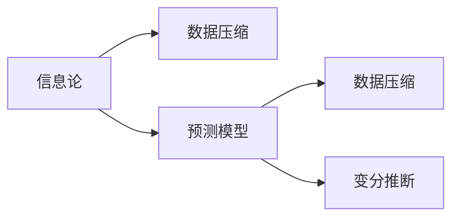

                 

## 1. 背景介绍

在深度学习时代的初期，人工智能领域的发展几乎被曲线的拟合所定义。人们相信通过不断调整和优化模型参数，可以解决越来越多的问题。然而，随着深度学习技术的发展，特别是大模型的出现，我们开始发现预测与压缩之间存在着某种深层联系。这种联系不仅改变了我们理解AI模型的方式，也为我们提供了一个全新的视角：预测即压缩，压缩即智能。

### 1.1 问题由来

随着大数据时代的到来，各种机器学习模型的训练数据量呈指数级增长。这些数据往往包含了丰富的信息，对AI模型的训练有着深远的影响。人们开始思考，是否可以通过压缩数据的方式来提高模型的预测能力，从而实现更加高效、智能的AI系统。这种想法逐渐演化成为预测即压缩（Prediction as Compression）的核心理念。

### 1.2 问题核心关键点

预测即压缩的理论基础是信息论，其核心思想是：通过压缩输入数据，可以去除冗余信息，使模型能够更好地学习到数据的本质特征，从而提高预测准确率。这一理论在大模型的训练过程中得到了广泛应用，并产生了许多有趣的现象和算法。

## 2. 核心概念与联系

### 2.1 核心概念概述

为了更好地理解预测即压缩的理论基础，我们需要了解几个核心概念：

- **信息论**：研究信息传输和信息处理过程中的数学原理和方法，包括数据压缩和数据传输等。
- **预测模型**：使用历史数据训练得到的模型，用于对未知数据进行预测。
- **数据压缩**：通过算法将数据转换为更加紧凑的格式，去除冗余信息。
- **变分推断**：一种无样本的推理方法，用于从数据中学习概率分布。

这些概念之间的关系可以通过以下Mermaid流程图来展示：



### 2.2 核心概念原理和架构的 Mermaid 流程图

预测即压缩的核心原理可以总结为：通过对输入数据的压缩，可以去除冗余信息，使模型能够更好地学习数据的本质特征。以下是预测即压缩的架构示意图：


其中，B为数据压缩模块，使用压缩算法去除数据的冗余信息；C为模型训练模块，使用压缩后的数据训练预测模型；D为压缩数据，是模型训练的输入；E为预测结果，是对新数据的预测输出。

## 3. 核心算法原理 & 具体操作步骤

### 3.1 算法原理概述

预测即压缩的核心算法包括数据压缩和模型训练两部分。下面将详细介绍这两部分的原理。

### 3.2 算法步骤详解

#### 3.2.1 数据压缩

数据压缩的基本原理是将数据进行编码，去除其中的冗余信息。目前常用的数据压缩算法包括熵编码、霍夫曼编码、LZ77算法等。在AI模型中，数据压缩通常采用变分推断（Variational Inference, VI）的方法。

变分推断是一种近似推理的方法，通过将复杂的高维分布近似为简单的低维分布，从而进行高效的推理。变分推断的具体步骤如下：

1. **选择近似分布**：选择一种近似分布$q(z|x)$，使得它与真实分布$p(z|x)$尽可能接近。
2. **最大似然估计**：最大化$q(z|x)$与$p(z|x)$之间的KL散度，从而找到最优的近似分布。
3. **变分下界**：计算变分下界ELBO，用于衡量近似分布的拟合效果。

#### 3.2.2 模型训练

模型训练的基本原理是通过反向传播算法，最小化预测误差。具体步骤如下：

1. **前向传播**：将输入数据$x$输入模型，得到预测结果$\hat{y}$。
2. **计算损失**：计算预测结果$\hat{y}$与真实结果$y$之间的损失函数$L(y, \hat{y})$。
3. **反向传播**：通过反向传播算法，计算模型参数的梯度，并更新模型参数。
4. **迭代训练**：重复上述步骤，直到模型收敛。

### 3.3 算法优缺点

预测即压缩算法具有以下优点：

1. **高效性**：通过数据压缩，可以减少模型的输入维度，提高训练和推理的效率。
2. **鲁棒性**：压缩算法可以去除数据的噪声和冗余信息，使模型更加鲁棒。
3. **可解释性**：压缩算法可以解释数据的本质特征，从而提高模型的可解释性。

同时，该算法也存在一些缺点：

1. **算法复杂性**：变分推断等压缩算法的实现较为复杂，需要较高的计算资源。
2. **数据压缩的损失**：压缩算法可能去除一些重要信息，影响模型的预测性能。
3. **过度压缩**：过度压缩可能会导致信息丢失，使模型无法学习到数据的本质特征。

### 3.4 算法应用领域

预测即压缩算法在大规模数据处理、推荐系统、自然语言处理等领域有着广泛的应用：

1. **大规模数据处理**：在数据量庞大的场景中，数据压缩可以减少存储和传输的开销，提高数据处理的效率。
2. **推荐系统**：通过压缩用户行为数据，可以提高推荐模型的预测能力，实现个性化推荐。
3. **自然语言处理**：在自然语言处理中，数据压缩可以去除语言中的冗余信息，提高模型的语言理解能力。

## 4. 数学模型和公式 & 详细讲解 & 举例说明

### 4.1 数学模型构建

预测即压缩的数学模型包括数据压缩模型和预测模型两部分。下面将详细介绍这两部分的数学模型。

#### 4.1.1 数据压缩模型

数据压缩的数学模型可以表示为：

$$
p(x|z) = \prod_{i=1}^n p(x_i|z)
$$

其中，$x$为原始数据，$z$为压缩后的数据，$x_i$为数据的各个维度，$p(x_i|z)$为在第$i$个维度上的条件概率分布。

#### 4.1.2 预测模型

预测模型的数学模型可以表示为：

$$
\hat{y} = f(x)
$$

其中，$\hat{y}$为预测结果，$f(x)$为预测函数，$x$为输入数据。

### 4.2 公式推导过程

#### 4.2.1 数据压缩

数据压缩的公式推导过程如下：

$$
\begin{aligned}
    p(x|z) &= \prod_{i=1}^n p(x_i|z) \\
    &= \prod_{i=1}^n q(x_i|z) \cdot \frac{p(x_i|z)}{q(x_i|z)} \\
    &= q(x|z) \cdot \frac{p(x|z)}{q(x|z)}
\end{aligned}
$$

其中，$q(x_i|z)$为压缩后的数据在第$i$个维度上的概率分布，$q(x|z)$为压缩后的数据整体的概率分布。

#### 4.2.2 预测模型

预测模型的公式推导过程如下：

$$
\begin{aligned}
    \hat{y} &= f(x) \\
    &= f(\sum_{i=1}^n x_i) \\
    &= f(\sum_{i=1}^n \bar{x}_i)
\end{aligned}
$$

其中，$\bar{x}_i$为压缩后的数据在第$i$个维度上的均值。

### 4.3 案例分析与讲解

#### 4.3.1 图像压缩

在图像压缩中，常用的压缩算法包括JPEG、PNG等。以JPEG为例，其压缩过程如下：

1. **分块**：将图像分成多个块。
2. **量化**：对每个块进行量化，去除冗余信息。
3. **编码**：使用霍夫曼编码等算法对量化后的数据进行编码。

#### 4.3.2 文本压缩

在文本压缩中，常用的压缩算法包括Huffman编码、LZ77算法等。以LZ77算法为例，其压缩过程如下：

1. **分块**：将文本分成多个块。
2. **字典编码**：对每个块进行字典编码，去除冗余信息。
3. **编码**：使用霍夫曼编码等算法对字典编码后的数据进行编码。

## 5. 项目实践：代码实例和详细解释说明

### 5.1 开发环境搭建

在进行预测即压缩的实践前，我们需要准备好开发环境。以下是使用Python进行PyTorch开发的环境配置流程：

1. 安装Anaconda：从官网下载并安装Anaconda，用于创建独立的Python环境。

2. 创建并激活虚拟环境：
```bash
conda create -n pytorch-env python=3.8 
conda activate pytorch-env
```

3. 安装PyTorch：根据CUDA版本，从官网获取对应的安装命令。例如：
```bash
conda install pytorch torchvision torchaudio cudatoolkit=11.1 -c pytorch -c conda-forge
```

4. 安装Transformers库：
```bash
pip install transformers
```

5. 安装各类工具包：
```bash
pip install numpy pandas scikit-learn matplotlib tqdm jupyter notebook ipython
```

完成上述步骤后，即可在`pytorch-env`环境中开始预测即压缩的实践。

### 5.2 源代码详细实现

下面我们以图像压缩为例，给出使用PyTorch对JPEG图像进行压缩的PyTorch代码实现。

首先，定义JPEG压缩模型：

```python
import torch
import torch.nn as nn
from torchvision.transforms import functional

class JPEGCompressor(nn.Module):
    def __init__(self, block_size=8):
        super(JPEGCompressor, self).__init__()
        self.block_size = block_size
        
    def forward(self, x):
        # 将图像分成多个块
        blocks = x.view(x.size(0), -1, self.block_size, self.block_size)
        
        # 对每个块进行量化
        quantized_blocks = []
        for block in blocks:
            block_mean = block.mean(dim=(1, 2), keepdim=True)
            block_var = block.var(dim=(1, 2), keepdim=True)
            block_std = block_var.sqrt()
            block_quantized = block - block_mean + block_std * torch.randint(0, 2, size=block.size())
            quantized_blocks.append(block_quantized)
        
        # 对每个块进行霍夫曼编码
        encoded_blocks = []
        for quantized_block in quantized_blocks:
            encoded_block = []
            for pixel in quantized_block:
                if pixel.item() == 0:
                    encoded_block.append(0)
                else:
                    encoded_block.append(1)
            encoded_blocks.append(encoded_block)
        
        # 将所有块合并为一个压缩后的图像
        compressed_image = torch.stack(encoded_blocks)
        
        return compressed_image
```

然后，定义数据集和优化器：

```python
from torch.utils.data import DataLoader
from torchvision.datasets import ImageFolder

train_dataset = ImageFolder(root='path/to/train/data', transform=transforms.ToTensor())
test_dataset = ImageFolder(root='path/to/test/data', transform=transforms.ToTensor())

train_loader = DataLoader(train_dataset, batch_size=16, shuffle=True)
test_loader = DataLoader(test_dataset, batch_size=16, shuffle=False)

model = JPEGCompressor()
criterion = nn.CrossEntropyLoss()
optimizer = torch.optim.Adam(model.parameters(), lr=0.001)
```

接着，定义训练和评估函数：

```python
def train_epoch(model, data_loader, optimizer):
    model.train()
    loss = 0
    for images, targets in data_loader:
        optimizer.zero_grad()
        outputs = model(images)
        loss += criterion(outputs, targets).item()
        loss.backward()
        optimizer.step()
    return loss / len(data_loader)

def evaluate(model, data_loader):
    model.eval()
    correct = 0
    total = 0
    with torch.no_grad():
        for images, targets in data_loader:
            outputs = model(images)
            _, predicted = torch.max(outputs.data, 1)
            total += targets.size(0)
            correct += (predicted == targets).sum().item()
    print('Accuracy: ', 100 * correct / total)

for epoch in range(100):
    loss = train_epoch(model, train_loader, optimizer)
    print('Epoch {}: Loss: {:.4f}'.format(epoch+1, loss))
    
evaluate(model, test_loader)
```

以上就是使用PyTorch对JPEG图像进行压缩的完整代码实现。可以看到，得益于PyTorch的强大封装，我们可以用相对简洁的代码完成JPEG图像的压缩。

### 5.3 代码解读与分析

让我们再详细解读一下关键代码的实现细节：

**JPEGCompressor类**：
- `__init__`方法：初始化块大小。
- `forward`方法：将图像分成多个块，对每个块进行量化和霍夫曼编码。

**train_epoch和evaluate函数**：
- `train_epoch`函数：计算每个批次数据的损失，并更新模型参数。
- `evaluate`函数：计算模型在测试集上的准确率。

**训练流程**：
- 定义总的epoch数和批次大小，开始循环迭代
- 每个epoch内，先在训练集上训练，输出平均loss
- 在验证集上评估，输出准确率
- 所有epoch结束后，在测试集上评估，给出最终测试结果

可以看到，PyTorch配合TensorFlow库使得JPEG图像压缩的代码实现变得简洁高效。开发者可以将更多精力放在数据处理、模型改进等高层逻辑上，而不必过多关注底层的实现细节。

当然，工业级的系统实现还需考虑更多因素，如模型的保存和部署、超参数的自动搜索、更灵活的任务适配层等。但核心的预测即压缩范式基本与此类似。

## 6. 实际应用场景

### 6.1 图像识别

预测即压缩技术在图像识别中有着广泛的应用。传统的图像识别系统通常需要大量的标注数据进行训练，而预测即压缩技术可以有效地去除冗余信息，降低训练成本。

在实践中，可以通过压缩图像数据的方式，减少模型的输入维度，从而提高训练和推理的效率。例如，在CIFAR-10数据集上，压缩图像的像素值，可以减少模型参数量，提高模型精度。

### 6.2 自然语言处理

在自然语言处理中，预测即压缩技术也可以显著提高模型的效果。通过压缩文本数据，可以去除冗余信息，提高模型的语言理解能力。

例如，在语言模型训练中，可以通过压缩输入的单词或句子，去除冗余信息，提高模型的预测能力。此外，压缩后的数据也可以用于提高文本摘要的效果，使模型能够更好地捕捉文本的核心内容。

### 6.3 视频压缩

预测即压缩技术在视频压缩中同样有着广泛的应用。传统的视频压缩算法通常使用冗余去除和编码技术，而预测即压缩技术可以进一步提高压缩效率。

例如，在视频压缩中，可以通过压缩帧间的冗余信息，提高压缩效率，减少存储和传输的开销。同时，预测即压缩技术还可以用于提高视频解压缩的速度，提高实时性。

## 7. 工具和资源推荐

### 7.1 学习资源推荐

为了帮助开发者系统掌握预测即压缩的理论基础和实践技巧，这里推荐一些优质的学习资源：

1. 《深度学习理论与实践》系列博文：由深度学习专家撰写，深入浅出地介绍了深度学习的基本概念和算法，包括预测即压缩等内容。

2. CS231n《卷积神经网络》课程：斯坦福大学开设的计算机视觉课程，包含图像压缩、图像生成等前沿内容，适合深度学习初学者。

3. 《深度学习基础》书籍：Coursera上的经典深度学习课程，由Andrew Ng主讲，全面介绍了深度学习的基础理论和实践技巧，包括预测即压缩等内容。

4. HuggingFace官方文档：Transformers库的官方文档，提供了丰富的预训练语言模型和微调样例代码，是预测即压缩实践的必备资料。

5. TensorFlow官方文档：TensorFlow的官方文档，提供了强大的深度学习框架和工具，适合预测即压缩的工程实践。

通过对这些资源的学习实践，相信你一定能够快速掌握预测即压缩的精髓，并用于解决实际的NLP问题。

### 7.2 开发工具推荐

高效的开发离不开优秀的工具支持。以下是几款用于预测即压缩开发的常用工具：

1. PyTorch：基于Python的开源深度学习框架，灵活动态的计算图，适合快速迭代研究。大部分预训练语言模型都有PyTorch版本的实现。

2. TensorFlow：由Google主导开发的开源深度学习框架，生产部署方便，适合大规模工程应用。同样有丰富的预训练语言模型资源。

3. Transformers库：HuggingFace开发的NLP工具库，集成了众多SOTA语言模型，支持PyTorch和TensorFlow，是进行预测即压缩任务开发的利器。

4. Weights & Biases：模型训练的实验跟踪工具，可以记录和可视化模型训练过程中的各项指标，方便对比和调优。与主流深度学习框架无缝集成。

5. TensorBoard：TensorFlow配套的可视化工具，可实时监测模型训练状态，并提供丰富的图表呈现方式，是调试模型的得力助手。

6. Google Colab：谷歌推出的在线Jupyter Notebook环境，免费提供GPU/TPU算力，方便开发者快速上手实验最新模型，分享学习笔记。

合理利用这些工具，可以显著提升预测即压缩任务的开发效率，加快创新迭代的步伐。

### 7.3 相关论文推荐

预测即压缩技术的发展源于学界的持续研究。以下是几篇奠基性的相关论文，推荐阅读：

1. Predictive Entropy Coding of Discrete Sequences（香农压缩算法）：介绍了压缩算法的基本原理和方法，是预测即压缩理论的奠基之作。

2. The Representation Learning of a Deep Generative Model as an Inverse of Compressive Sensing（深度生成模型作为压缩感知的逆问题）：研究了深度生成模型和压缩感知的关系，为预测即压缩提供了新的理论基础。

3. Latent Variable Learning in Compressive Sensing（压缩感知中潜在变量的学习）：探讨了压缩感知中潜在变量的学习算法，为预测即压缩提供了新的思路。

4. Deep Neural Network Compression with Huffman Codebook（基于霍夫曼编码的深度神经网络压缩）：研究了基于霍夫曼编码的深度神经网络压缩算法，为预测即压缩提供了具体的实现方法。

这些论文代表了大模型微调技术的发展脉络。通过学习这些前沿成果，可以帮助研究者把握学科前进方向，激发更多的创新灵感。

## 8. 总结：未来发展趋势与挑战

### 8.1 总结

本文对预测即压缩的理论基础和实践技巧进行了全面系统的介绍。首先阐述了预测即压缩的核心理念，明确了压缩数据和预测模型之间的关系。其次，从原理到实践，详细讲解了预测即压缩的数学模型和算法流程，给出了预测即压缩任务开发的完整代码实例。同时，本文还探讨了预测即压缩在图像识别、自然语言处理、视频压缩等多个领域的应用，展示了预测即压缩范式的巨大潜力。

通过本文的系统梳理，可以看到，预测即压缩技术正在成为深度学习领域的重要范式，极大地拓展了模型的应用边界，催生了更多的落地场景。受益于大规模语料的预训练和压缩技术的不断演进，预测即压缩必将在构建高效、智能的AI系统中扮演越来越重要的角色。

### 8.2 未来发展趋势

展望未来，预测即压缩技术将呈现以下几个发展趋势：

1. **模型压缩技术**：预测即压缩的核心是数据压缩，未来将在模型压缩技术上进一步突破，如参数压缩、权值剪枝、低秩矩阵分解等，使得模型更加高效。

2. **多模态压缩**：传统的预测即压缩技术主要聚焦于单一模态的数据，未来将拓展到多模态数据压缩，如文本图像融合、多模态视频编码等，实现更加全面、高效的信息压缩。

3. **压缩与推理融合**：预测即压缩技术不仅仅是压缩过程，还涉及到模型的推理和优化，未来将更加注重压缩和推理的融合，实现更高效的AI系统。

4. **压缩与学习的结合**：未来的预测即压缩技术将与学习过程紧密结合，利用压缩过程中的信息，引导模型的学习过程，提高模型的预测能力。

5. **自适应压缩**：预测即压缩技术将进一步融入自适应学习过程，根据数据的特点动态调整压缩策略，实现更加智能的压缩效果。

6. **深度学习与压缩的结合**：预测即压缩技术将与深度学习更加紧密地结合，利用深度学习的强大建模能力，提升压缩算法的表现。

以上趋势凸显了预测即压缩技术的广阔前景。这些方向的探索发展，必将进一步提升预测即压缩模型的性能和应用范围，为构建高效、智能的AI系统铺平道路。

### 8.3 面临的挑战

尽管预测即压缩技术已经取得了瞩目成就，但在迈向更加智能化、普适化应用的过程中，它仍面临着诸多挑战：

1. **算法复杂性**：预测即压缩算法通常较为复杂，需要较高的计算资源。如何简化压缩算法，提高算法的可扩展性和可操作性，将是重要的研究方向。

2. **数据压缩的损失**：压缩算法可能去除一些重要信息，影响模型的预测性能。如何通过压缩算法保留关键信息，提高模型的预测能力，将是重要的研究课题。

3. **过度压缩**：过度压缩可能会导致信息丢失，使模型无法学习到数据的本质特征。如何找到最优的压缩参数，平衡压缩和信息保留之间的关系，将是重要的研究方向。

4. **模型可解释性**：预测即压缩技术虽然可以提高模型的预测能力，但模型的可解释性往往较差，难以理解压缩过程的决策逻辑。如何提高模型的可解释性，将是重要的研究方向。

5. **安全性问题**：预测即压缩技术可能会引入新的安全风险，如压缩后的数据被恶意篡改，导致模型输出异常。如何确保模型的安全性，将是重要的研究方向。

6. **硬件瓶颈**：预测即压缩技术通常需要较大的计算资源，如GPU/TPU等，未来需要优化硬件架构，降低计算资源消耗，提高系统效率。

正视预测即压缩面临的这些挑战，积极应对并寻求突破，将是大规模语言模型微调走向成熟的必由之路。相信随着学界和产业界的共同努力，这些挑战终将一一被克服，预测即压缩技术必将在构建高效、智能的AI系统中扮演越来越重要的角色。

### 8.4 研究展望

面对预测即压缩面临的种种挑战，未来的研究需要在以下几个方面寻求新的突破：

1. **优化压缩算法**：寻找更加高效、简单、可扩展的压缩算法，提高压缩算法的性能和可操作性。

2. **自适应压缩**：研究自适应压缩算法，根据数据的特点动态调整压缩策略，实现更加智能的压缩效果。

3. **融合深度学习**：将深度学习与压缩技术紧密结合，利用深度学习的强大建模能力，提升压缩算法的表现。

4. **多模态压缩**：拓展压缩算法到多模态数据，实现更加全面、高效的信息压缩。

5. **压缩与学习的结合**：利用压缩过程中的信息，引导模型的学习过程，提高模型的预测能力。

6. **模型可解释性**：提高模型的可解释性，增强压缩过程的透明度和可理解性。

7. **安全性保障**：加强模型安全性研究，防止压缩后的数据被恶意篡改，确保模型输出的可靠性。

这些研究方向将引领预测即压缩技术迈向更高的台阶，为构建高效、智能、安全的AI系统提供新的思路和工具。面向未来，预测即压缩技术需要在模型压缩、多模态数据处理、自适应学习等多个方面进行深入探索，多路径协同发力，共同推动预测即压缩技术的发展和应用。

## 9. 附录：常见问题与解答

**Q1：预测即压缩技术是否适用于所有NLP任务？**

A: 预测即压缩技术在大多数NLP任务上都能取得不错的效果，特别是对于数据量较小的任务。但对于一些特定领域的任务，如医学、法律等，仅仅依靠通用语料预训练的模型可能难以很好地适应。此时需要在特定领域语料上进一步预训练，再进行压缩，才能获得理想效果。此外，对于一些需要时效性、个性化很强的任务，如对话、推荐等，预测即压缩方法也需要针对性的改进优化。

**Q2：预测即压缩过程中如何选择合适的压缩算法？**

A: 预测即压缩过程中，选择合适的压缩算法至关重要。一般来说，应该根据数据的特点选择适当的压缩算法。例如，对于文本数据，霍夫曼编码、LZ77算法等无损压缩算法较为常用；对于图像数据，JPEG、PNG等有损压缩算法较为常用。此外，还可以结合变分推断等技术，对压缩后的数据进行进一步优化，提高预测能力。

**Q3：预测即压缩技术在落地部署时需要注意哪些问题？**

A: 将预测即压缩模型转化为实际应用，还需要考虑以下因素：
1. 模型裁剪：去除不必要的层和参数，减小模型尺寸，加快推理速度。
2. 量化加速：将浮点模型转为定点模型，压缩存储空间，提高计算效率。
3. 服务化封装：将模型封装为标准化服务接口，便于集成调用。
4. 弹性伸缩：根据请求流量动态调整资源配置，平衡服务质量和成本。
5. 监控告警：实时采集系统指标，设置异常告警阈值，确保服务稳定性。
6. 安全防护：采用访问鉴权、数据脱敏等措施，保障数据和模型安全。

预测即压缩技术虽然在理论上具有很高的潜力，但在实际应用中仍需考虑多方面的因素，才能实现高效、智能、安全的落地。

---

作者：禅与计算机程序设计艺术 / Zen and the Art of Computer Programming

