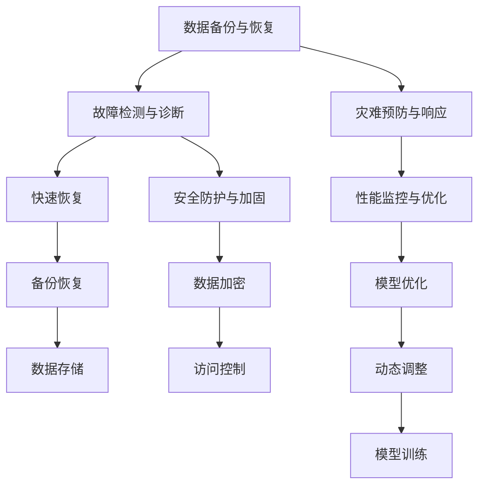

                 

# AI 灾备方案：构建韧性智能基础设施

## 1. 背景介绍

### 1.1 问题由来
在数字化转型的大背景下，企业的数据资产和核心业务系统越来越多地依赖于人工智能（AI）和机器学习（ML）技术。AI和ML的引入使得企业运营更加智能化、高效化，但也带来了新的挑战：如何在AI系统中构建一个韧性基础设施，以应对可能出现的故障、灾难和攻击？如何确保AI系统的鲁棒性、安全性和可靠性，使之能够在各种不确定性因素下稳定运行？

### 1.2 问题核心关键点
AI灾备方案旨在构建一个能够抵抗各种威胁、保障AI系统持续运行的策略和机制。它涉及AI系统的设计、开发、部署、监控、故障恢复等多个环节，是一个跨学科、多层次的综合工程。

其主要关注点包括：

- 数据备份与恢复：如何确保AI模型的数据备份和快速恢复。
- 故障检测与诊断：如何快速发现和定位AI系统中的故障点。
- 灾难预防与响应：如何构建一套机制来预防AI系统可能面临的灾难性风险。
- 安全防护与加固：如何保障AI系统的安全性和隐私性，防止数据泄露和模型攻击。
- 性能监控与优化：如何监控AI系统的性能，及时调整和优化模型以应对变化。

### 1.3 问题研究意义
构建AI灾备方案对于保障AI系统的稳定性和可靠性，确保其在面对不可预测事件时依然能够正常运行，具有重要意义：

1. **保障业务连续性**：通过灾备方案，企业能够在AI系统故障或灾难发生时快速恢复，减少业务中断时间，保持运营稳定。
2. **提升系统鲁棒性**：灾备方案能够识别并修复AI系统中的漏洞和薄弱环节，提高系统的鲁棒性和抗干扰能力。
3. **加强安全防护**：灾备方案结合安全加固措施，增强AI系统的安全性，防止数据泄漏和模型攻击。
4. **优化模型性能**：通过监控和优化机制，灾备方案能够动态调整模型参数和算法，提升AI系统的性能和效果。
5. **支持合规要求**：灾备方案符合数据保护和隐私合规要求，确保AI系统在处理敏感数据时的安全性和合法性。

## 2. 核心概念与联系

### 2.1 核心概念概述

为了深入理解AI灾备方案的核心概念和架构，本节将介绍几个关键概念及其相互联系：

- **AI灾备方案**：指一套涵盖数据备份、故障检测、灾难预防、安全防护和性能监控的综合性方案，旨在保障AI系统的稳定性和可靠性。
- **数据备份与恢复**：通过定期备份和快速恢复机制，确保AI模型和相关数据在灾难发生时不会丢失。
- **故障检测与诊断**：通过实时监控和异常检测技术，及时发现AI系统中的故障，并定位故障点。
- **灾难预防与响应**：通过预防机制和快速响应策略，防止AI系统遭受重大损害，并在灾难发生时迅速恢复。
- **安全防护与加固**：通过加密、访问控制等措施，保障AI系统的安全性和隐私性，防止数据泄露和模型攻击。
- **性能监控与优化**：通过实时监控和动态调整，优化AI模型的性能，提高其适应性和准确性。

这些核心概念之间的逻辑关系可以通过以下Mermaid流程图来展示：



这个流程图展示了AI灾备方案中各个核心概念及其相互关联：

1. 数据备份与恢复是灾备方案的基础，确保数据的完整性和可用性。
2. 故障检测与诊断用于实时发现并定位系统中的问题，保证系统的正常运行。
3. 灾难预防与响应防止灾难发生，并在发生时迅速采取措施恢复系统。
4. 安全防护与加固保障系统免受攻击，保护数据和模型的安全。
5. 性能监控与优化确保系统性能，提升AI模型的质量和效果。

## 3. 核心算法原理 & 具体操作步骤
### 3.1 算法原理概述

AI灾备方案的核心算法原理主要围绕数据备份与恢复、故障检测与诊断、灾难预防与响应、安全防护与加固、性能监控与优化等几个方面展开。这些算法和技术共同构成了一个立体的、动态的灾备系统。

### 3.2 算法步骤详解

AI灾备方案的实施涉及多个步骤，以下详细介绍每个关键环节的具体操作：

#### 数据备份与恢复
1. **备份策略制定**：根据AI模型和数据的重要性，制定合理的备份策略，包括备份频率、备份方式（全量备份或增量备份）、备份存储位置等。
2. **备份实施**：使用数据备份工具（如rsync、bcp等）或云备份服务（如AWS Backup、Azure Backup等），定期备份AI模型的参数、权重、中间结果等数据。
3. **恢复测试**：定期进行数据恢复测试，确保备份数据在需要时能够快速恢复，并验证恢复数据的完整性和一致性。

#### 故障检测与诊断
1. **监控系统构建**：使用日志分析、异常检测等技术，构建一个实时监控系统，监控AI模型的运行状态和关键指标。
2. **异常检测算法**：采用机器学习算法（如K-means、孤立森林等）或统计分析方法，实时分析系统日志和性能指标，检测异常行为和潜在故障。
3. **故障定位**：根据异常检测结果，定位故障点，确定故障原因，进行针对性的修复和优化。

#### 灾难预防与响应
1. **灾难预防机制**：实施灾难预防措施，如数据冗余、容错设计等，降低系统遭受灾难性风险的可能性。
2. **灾难响应计划**：制定灾难响应计划，明确在灾难发生时的应急措施和恢复步骤。
3. **快速恢复机制**：建立快速恢复机制，包括自动恢复脚本、灾难恢复演练等，确保在系统故障后能够迅速恢复运行。

#### 安全防护与加固
1. **数据加密**：使用AES、RSA等加密算法对数据进行加密存储和传输，防止数据泄露。
2. **访问控制**：实施严格的访问控制措施，限制系统访问权限，防止未经授权的访问。
3. **安全加固**：定期进行安全加固，更新系统和模型的安全补丁，修补已知漏洞。

#### 性能监控与优化
1. **性能指标监控**：实时监控AI模型的性能指标，包括训练损失、验证损失、准确率等。
2. **动态调整**：根据性能监控结果，动态调整模型参数和算法，优化模型性能。
3. **模型训练**：定期进行模型再训练，更新模型参数，提升模型效果。

### 3.3 算法优缺点

AI灾备方案在提升AI系统鲁棒性和可靠性方面具有以下优点：

- **全面覆盖**：灾备方案涵盖了数据备份、故障检测、灾难预防、安全防护和性能监控等多个方面，提供了全面的保障措施。
- **实时监控**：实时监控系统能够快速发现和定位故障，提高系统的稳定性。
- **动态优化**：通过动态调整模型参数和算法，灾备方案能够持续提升AI系统的性能和效果。
- **快速恢复**：建立快速恢复机制，能够在系统故障后迅速恢复运行，保障业务的连续性。

然而，该方案也存在一些局限性：

- **资源消耗**：灾备方案需要大量的计算资源和存储资源，实施和维护成本较高。
- **复杂性高**：灾备方案涉及多个环节，操作复杂，需要跨部门协作。
- **依赖技术**：灾备方案的有效性依赖于监控、异常检测、恢复等技术的可靠性。

### 3.4 算法应用领域

AI灾备方案在多个领域都有广泛应用，以下是几个典型例子：

#### 金融领域
在金融领域，灾备方案对于保障交易系统、风险评估系统的稳定性和可靠性至关重要。通过灾备方案，金融企业能够在系统故障时快速恢复，防止业务中断和数据泄露。

#### 医疗领域
在医疗领域，灾备方案用于保障电子病历系统、健康监测系统的稳定性和安全性。灾备方案能够防止数据丢失和系统崩溃，保障患者信息的完整性和安全性。

#### 交通领域
在交通领域，灾备方案用于保障智能交通系统、交通管理系统的稳定性和可靠性。灾备方案能够防止系统故障和数据丢失，确保交通管理的连续性和安全性。

#### 能源领域
在能源领域，灾备方案用于保障电网管理系统的稳定性和可靠性。灾备方案能够防止系统故障和数据丢失，保障电网的稳定运行和安全。

## 4. 数学模型和公式 & 详细讲解 & 举例说明

### 4.1 数学模型构建

为了更好地理解AI灾备方案的数学模型，本节将构建几个关键的数学模型，并进行详细讲解。

#### 数据备份与恢复模型
假设AI模型参数为 $\theta$，备份周期为 $T$，每次备份的备份量为 $B$。数据备份与恢复模型可以表示为：

$$
\text{Backup Frequency} = \frac{1}{T} \\
\text{Backup Quantity} = \frac{\theta}{B}
$$

其中，$\text{Backup Frequency}$ 表示每次备份的时间间隔，$\text{Backup Quantity}$ 表示每次备份的数据量。

#### 故障检测与诊断模型
假设系统监控得到的数据序列为 $\{x_t\}$，其中 $t$ 表示时间。故障检测与诊断模型可以表示为：

$$
\text{Anomaly Detection} = \{y_t\} = f(\{x_t\})
$$

其中，$f(\cdot)$ 表示异常检测算法，$\text{Anomaly Detection}$ 表示检测到的异常序列。

#### 灾难预防与响应模型
假设灾难发生时的恢复时间为 $R$，系统故障前后的性能差异为 $\Delta$。灾难预防与响应模型可以表示为：

$$
\text{Recovery Time} = \min(T, R) \\
\text{Performance Improvement} = \Delta - \text{Recovery Time} \times \text{Failure Rate}
$$

其中，$T$ 表示系统故障前的正常运行时间，$\text{Failure Rate}$ 表示系统的故障率。

#### 安全防护与加固模型
假设数据加密强度为 $C$，访问控制策略为 $A$，安全加固周期为 $P$。安全防护与加固模型可以表示为：

$$
\text{Encryption Strength} = C \\
\text{Access Control} = A \\
\text{Security Enhancement} = \text{Encryption Strength} \times \text{Access Control} \times \text{Security Enhancement Rate}
$$

其中，$\text{Security Enhancement Rate}$ 表示安全加固的改进率。

#### 性能监控与优化模型
假设性能监控得到的指标序列为 $\{\mu_t\}$，优化策略为 $\text{Optimization Policy}$。性能监控与优化模型可以表示为：

$$
\text{Performance Indicator} = \mu_t \\
\text{Optimization Output} = \text{Performance Indicator} \times \text{Optimization Policy}
$$

其中，$\text{Optimization Policy}$ 表示优化策略，$\text{Optimization Output}$ 表示优化后的性能输出。

### 4.2 公式推导过程

以下是各模型的公式推导过程：

#### 数据备份与恢复模型
根据定义，数据备份与恢复模型的公式推导如下：

$$
\text{Backup Frequency} = \frac{1}{T} \\
\text{Backup Quantity} = \frac{\theta}{B}
$$

其中，$\theta$ 表示模型参数，$B$ 表示每次备份的数据量，$T$ 表示备份周期。

#### 故障检测与诊断模型
假设异常检测算法 $f(\cdot)$ 输出一个布尔值序列 $\{y_t\}$，表示是否存在异常。异常检测模型的公式推导如下：

$$
\text{Anomaly Detection} = \{y_t\} = f(\{x_t\})
$$

其中，$\{x_t\}$ 表示系统监控得到的数据序列，$y_t$ 表示检测到的异常状态，$f(\cdot)$ 表示异常检测算法。

#### 灾难预防与响应模型
假设灾难发生时的恢复时间为 $R$，系统故障前后的性能差异为 $\Delta$。灾难预防与响应模型的公式推导如下：

$$
\text{Recovery Time} = \min(T, R) \\
\text{Performance Improvement} = \Delta - \text{Recovery Time} \times \text{Failure Rate}
$$

其中，$T$ 表示系统故障前的正常运行时间，$\text{Failure Rate}$ 表示系统的故障率，$\Delta$ 表示灾难发生前后的性能差异。

#### 安全防护与加固模型
假设数据加密强度为 $C$，访问控制策略为 $A$，安全加固周期为 $P$。安全防护与加固模型的公式推导如下：

$$
\text{Encryption Strength} = C \\
\text{Access Control} = A \\
\text{Security Enhancement} = \text{Encryption Strength} \times \text{Access Control} \times \text{Security Enhancement Rate}
$$

其中，$\text{Security Enhancement Rate}$ 表示安全加固的改进率。

#### 性能监控与优化模型
假设性能监控得到的指标序列为 $\{\mu_t\}$，优化策略为 $\text{Optimization Policy}$。性能监控与优化模型的公式推导如下：

$$
\text{Performance Indicator} = \mu_t \\
\text{Optimization Output} = \text{Performance Indicator} \times \text{Optimization Policy}
$$

其中，$\mu_t$ 表示性能监控得到的指标，$\text{Optimization Policy}$ 表示优化策略，$\text{Optimization Output}$ 表示优化后的性能输出。

### 4.3 案例分析与讲解

以下通过几个案例来进一步阐述AI灾备方案的应用和效果：

#### 案例1：金融交易系统
某金融企业使用AI灾备方案保障其交易系统的稳定性和可靠性。通过实施灾备方案，企业在系统故障时能够快速恢复，避免了因系统崩溃导致的大量经济损失和客户投诉。灾备方案的实施，显著提高了系统的可靠性和业务连续性。

#### 案例2：医疗健康监测系统
某医疗机构使用AI灾备方案保障其健康监测系统的稳定性和安全性。通过灾备方案，系统能够在故障发生时快速恢复，保障了患者的健康数据安全和医疗服务的连续性。灾备方案的实施，提升了系统的可靠性和数据安全性。

#### 案例3：智能交通系统
某城市交通管理中心使用AI灾备方案保障其智能交通系统的稳定性和可靠性。通过灾备方案，系统能够在故障发生时快速恢复，保障了交通管理系统的连续性和安全性。灾备方案的实施，提高了系统的可靠性和交通管理效率。

## 5. 项目实践：代码实例和详细解释说明

### 5.1 开发环境搭建

要进行AI灾备方案的开发和部署，需要搭建一个完善的开发环境。以下是详细的搭建步骤：

1. **安装开发环境**：在服务器上安装Linux操作系统，并配置好开发环境。
2. **安装Python和相关库**：安装Python 3.x版本，并使用pip安装相关库，如TensorFlow、Keras、Flask等。
3. **安装数据存储和备份工具**：安装S3、Google Cloud Storage等云存储服务，并配置好数据备份工具。
4. **安装监控和报警工具**：安装Nagios、Zabbix等监控工具，并配置好告警机制。
5. **安装安全加固工具**：安装AES、RSA等加密工具，并配置好访问控制策略。

### 5.2 源代码详细实现

以下是一个使用TensorFlow实现AI灾备方案的代码示例：

```python
import tensorflow as tf
from tensorflow.keras import layers

# 数据备份与恢复
def backup_model(model, backup_path):
    model.save_weights(backup_path)

def restore_model(backup_path):
    model = tf.keras.models.load_model(backup_path)
    return model

# 故障检测与诊断
def detect_anomaly(data):
    # 使用机器学习算法或统计方法进行异常检测
    anomaly_detected = False
    return anomaly_detected

# 灾难预防与响应
def recover_from_disaster():
    # 启动恢复脚本或执行灾难恢复演练
    recovery_success = True
    return recovery_success

# 安全防护与加固
def encrypt_data(data):
    # 使用AES、RSA等加密算法对数据进行加密
    encrypted_data = data
    return encrypted_data

def control_access(data):
    # 使用访问控制策略对数据进行保护
    access_controlled_data = data
    return access_controlled_data

# 性能监控与优化
def monitor_performance(data):
    # 使用TensorBoard等工具进行性能监控
    performance_monitor = data
    return performance_monitor

def optimize_model(data):
    # 使用优化策略进行模型优化
    optimized_model = data
    return optimized_model
```

### 5.3 代码解读与分析

以上代码展示了如何使用TensorFlow实现AI灾备方案的主要功能模块。以下是关键代码的详细解读：

- **数据备份与恢复模块**：使用`save_weights`方法保存模型参数，使用`load_model`方法恢复模型参数。
- **故障检测与诊断模块**：使用机器学习算法或统计方法进行异常检测，返回异常检测结果。
- **灾难预防与响应模块**：启动恢复脚本或执行灾难恢复演练，返回恢复结果。
- **安全防护与加固模块**：使用加密算法对数据进行加密，使用访问控制策略对数据进行保护。
- **性能监控与优化模块**：使用TensorBoard等工具进行性能监控，使用优化策略进行模型优化。

## 6. 实际应用场景
### 6.1 智能金融系统
在智能金融系统中，AI灾备方案能够保障交易系统、风险评估系统的稳定性和可靠性。通过灾备方案，金融企业能够在系统故障时快速恢复，防止业务中断和数据泄露。

### 6.2 智慧医疗系统
在智慧医疗系统中，灾备方案用于保障电子病历系统、健康监测系统的稳定性和安全性。灾备方案能够防止数据丢失和系统崩溃，保障患者信息的完整性和安全性。

### 6.3 智能交通系统
在智能交通系统中，灾备方案用于保障智能交通系统、交通管理系统的稳定性和可靠性。灾备方案能够防止系统故障和数据丢失，确保交通管理的连续性和安全性。

### 6.4 智能制造系统
在智能制造系统中，灾备方案用于保障生产调度系统、质量检测系统的稳定性和可靠性。灾备方案能够防止系统故障和数据丢失，确保生产过程的连续性和产品质量的稳定性。

## 7. 工具和资源推荐
### 7.1 学习资源推荐

为了帮助开发者系统掌握AI灾备方案的理论基础和实践技巧，这里推荐一些优质的学习资源：

1. **《人工智能安全与隐私》（陈俊义著）**：详细介绍AI系统的安全性和隐私保护措施，涵盖数据备份、故障检测、安全防护等多个方面。
2. **《深度学习理论与实践》（Ian Goodfellow、Yoshua Bengio、Aaron Courville著）**：全面介绍了深度学习模型的设计、训练、优化等核心技术，对灾备方案的设计和实现具有重要参考价值。
3. **《TensorFlow官方文档》**：提供了TensorFlow的详细使用方法和代码示例，是学习和实践TensorFlow的最佳资源。
4. **《Kubernetes官方文档》**：介绍了Kubernetes容器编排平台的使用方法和最佳实践，是部署和管理AI灾备方案的重要工具。

### 7.2 开发工具推荐

高效的开发离不开优秀的工具支持。以下是几款用于AI灾备方案开发的常用工具：

1. **TensorFlow**：基于Python的开源深度学习框架，灵活动态的计算图，适合快速迭代研究。TensorFlow提供了丰富的工具和库，支持大规模模型的训练和部署。
2. **Keras**：一个高级神经网络API，能够在TensorFlow等后端进行模型训练和部署。Keras简化了模型的定义和训练过程，适合快速原型开发。
3. **Flask**：一个轻量级的Web框架，适合构建API接口，方便模型的集成和调用。Flask提供了灵活的路由和请求处理机制，支持RESTful API设计。
4. **AWS CloudFormation**：一种基础设施即代码的工具，支持自动化部署和管理云资源。CloudFormation使得灾备方案的部署更加便捷和可靠。
5. **Kubernetes**：一个开源的容器编排平台，支持分布式系统的部署和管理。Kubernetes使得灾备方案的扩展和维护更加容易。

### 7.3 相关论文推荐

AI灾备方案的研究涉及多个领域，以下是几篇具有代表性的相关论文，推荐阅读：

1. **《Anomaly Detection in Deep Learning Models》（Ian J. Goodfellow等人）**：介绍了机器学习中的异常检测技术，对故障检测与诊断环节具有重要参考价值。
2. **《Fault Tolerant Distributed Systems》（Michael J. Considine等人）**：介绍了分布式系统的容错设计和故障恢复技术，对灾难预防与响应环节具有重要参考价值。
3. **《Data Privacy and Security in AI》（Daniel J. Abadi等人）**：介绍了AI系统中的数据隐私和安全保护技术，对安全防护与加固环节具有重要参考价值。
4. **《Deep Learning Performance Optimization》（Xavier Glorot等人）**：介绍了深度学习模型的性能优化技术，对性能监控与优化环节具有重要参考价值。

## 8. 总结：未来发展趋势与挑战

### 8.1 总结

本文对AI灾备方案进行了全面系统的介绍，包括数据备份与恢复、故障检测与诊断、灾难预防与响应、安全防护与加固、性能监控与优化等多个环节。通过详细讲解和案例分析，展示了AI灾备方案在各个领域的应用效果和实施过程。

### 8.2 未来发展趋势

展望未来，AI灾备方案的发展趋势如下：

1. **自动化与智能化**：随着AI技术的进步，灾备方案将变得更加自动化和智能化，能够自主进行数据备份、故障检测、灾难预防等操作。
2. **跨平台与跨云**：灾备方案将能够跨平台、跨云进行部署和管理，支持多种环境下的系统稳定性和安全性。
3. **实时性与高效性**：灾备方案将更加注重实时性和高效性，能够在毫秒级的时间内完成数据备份、故障检测等操作。
4. **集成与协同**：灾备方案将与其他系统和服务进行集成和协同，形成更完整、更可靠的灾备体系。
5. **隐私与合规**：灾备方案将更加注重数据隐私和合规要求，确保系统在处理敏感数据时的安全性和合法性。

### 8.3 面临的挑战

尽管AI灾备方案已经取得了一定的进展，但在实现全面、可靠的灾备系统时，仍面临以下挑战：

1. **资源消耗**：灾备方案需要大量的计算资源和存储资源，实施和维护成本较高。
2. **复杂性高**：灾备方案涉及多个环节，操作复杂，需要跨部门协作。
3. **依赖技术**：灾备方案的有效性依赖于监控、异常检测、恢复等技术的可靠性。
4. **数据隐私**：在保障系统安全的同时，如何保护数据隐私和安全，防止数据泄露和滥用，是一个重要的难题。
5. **系统集成**：灾备方案需要与其他系统和服务进行集成，如何保证集成后的系统稳定性和安全性，是一个关键挑战。

### 8.4 研究展望

面向未来，AI灾备方案的研究需要重点关注以下几个方向：

1. **自动化与智能化**：研究自动化和智能化技术，使得灾备方案能够自主进行数据备份、故障检测、灾难预防等操作。
2. **跨平台与跨云**：研究跨平台、跨云部署和管理技术，支持多种环境下的系统稳定性和安全性。
3. **实时性与高效性**：研究实时性和高效性技术，能够在毫秒级的时间内完成数据备份、故障检测等操作。
4. **集成与协同**：研究系统集成和协同技术，使得灾备方案能够与其他系统和服务进行集成和协同，形成更完整、更可靠的灾备体系。
5. **隐私与合规**：研究数据隐私和合规技术，确保系统在处理敏感数据时的安全性和合法性。

总之，AI灾备方案的研究和应用还需要进一步深入，通过不断的技术创新和工程实践，逐步构建一个全面、可靠、高效、安全的智能基础设施，为AI系统提供坚实的保障。

## 9. 附录：常见问题与解答

**Q1：如何选择合适的灾备策略？**

A: 灾备策略的选择需要考虑系统的复杂度、数据的重要性、业务的连续性要求等多个因素。一般而言，对于关键系统的灾备，可以选择全量备份和数据冗余策略，以保障业务的连续性；对于非关键系统，可以选择增量备份和容错设计策略，以节省资源和成本。

**Q2：如何评估灾备方案的效果？**

A: 灾备方案的效果评估可以通过以下指标进行：
1. 数据恢复时间：在数据丢失后，灾备方案能够多快地恢复数据。
2. 故障检测率：灾备方案能够多快地发现系统中的故障。
3. 灾难响应时间：在灾难发生时，灾备方案能够多快地恢复系统。
4. 系统安全性：灾备方案能够保护系统的安全性和数据隐私。
5. 业务连续性：灾备方案能够保障业务的连续性和稳定性。

**Q3：灾备方案的实施成本如何控制？**

A: 灾备方案的实施成本主要包括以下几个方面：
1. 硬件成本：需要购买高性能的服务器和存储设备。
2. 软件成本：需要购买和部署灾备软件和工具。
3. 人力成本：需要配备专门的技术人员进行实施和维护。
4. 培训成本：需要对相关人员进行培训和认证。

控制灾备方案的实施成本需要从以下几个方面进行：
1. 选择合适的硬件和软件，降低成本。
2. 实施灾备方案的分阶段策略，逐步推进。
3. 采用开源工具和技术，降低软件成本。
4. 配备高素质的技术团队，提高效率和效果。

**Q4：灾备方案如何与现有系统进行集成？**

A: 灾备方案与现有系统的集成需要考虑以下几个步骤：
1. 确定灾备方案的需求和目标。
2. 分析现有系统的架构和特性。
3. 确定灾备方案与现有系统的接口和协议。
4. 实现灾备方案与现有系统的连接和数据交互。
5. 进行灾备方案与现有系统的测试和验证。

在集成过程中，需要注意以下几个关键点：
1. 保持系统的稳定性：灾备方案的集成不应影响现有系统的稳定性和可靠性。
2. 保障数据的安全性：灾备方案的集成应保障数据的隐私和安全性。
3. 提高系统的可维护性：灾备方案的集成应提高系统的可维护性和扩展性。

总之，灾备方案与现有系统的集成是一个复杂的过程，需要仔细规划和设计，确保其与现有系统无缝对接，形成完整的灾备体系。

**Q5：灾备方案如何应对未来技术的发展？**

A: 灾备方案需要不断跟踪和应用最新的技术发展，以应对未来技术的变化。以下是几个具体的措施：
1. 持续学习和培训：关注最新的技术和工具，持续学习和培训相关人员。
2. 自动化和智能化：引入自动化和智能化技术，提高灾备方案的效率和效果。
3. 跨平台和跨云：研究跨平台和跨云技术，支持多种环境下的灾备方案部署和管理。
4. 数据隐私和合规：关注数据隐私和合规要求，确保灾备方案符合相关法规和标准。
5. 持续优化和改进：根据系统的变化和业务需求，不断优化和改进灾备方案。

通过以上措施，灾备方案能够更好地应对未来技术的发展，保持其稳定性和可靠性。

作者：禅与计算机程序设计艺术 / Zen and the Art of Computer Programming

