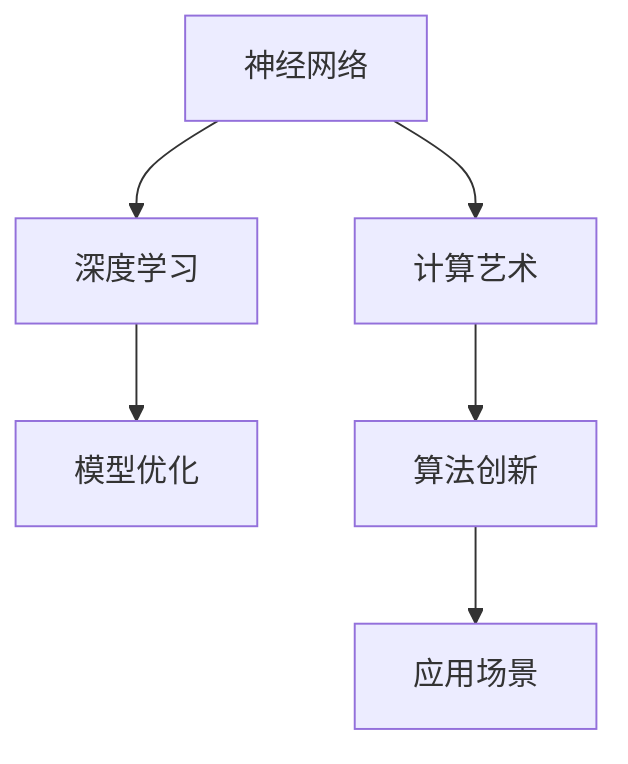

                 

# AI 神经网络计算艺术之道

> 关键词：神经网络,深度学习,计算艺术,模型优化,算法创新,应用场景,未来发展,优化算法

## 1. 背景介绍

### 1.1 问题由来

随着人工智能技术的迅速发展，深度学习和神经网络在各个领域的应用愈发广泛。从图像识别、语音识别到自然语言处理、自动驾驶，无处不在的深度学习模型正在改变我们的生活方式。但同时，神经网络的设计和训练过程也面临着诸多挑战，如何高效、精确地构建和优化神经网络模型，一直是研究人员和工程师关注的焦点。

本文将深入探讨神经网络的计算艺术，从核心概念到算法原理，再到具体的模型优化和应用场景，全面系统地介绍神经网络在实际应用中的关键技术和方法。通过深入理解神经网络的计算艺术，我们可以更好地把握其设计、优化和应用的关键，为未来的AI技术发展提供新的思考。

## 2. 核心概念与联系

### 2.1 核心概念概述

为更好地理解神经网络计算艺术，本节将介绍几个密切相关的核心概念：

- **神经网络(Neural Network, NN)**：由大量人工神经元（节点）组成的网络，通过连接权重和激活函数模拟生物神经元的信息传递和处理能力。
- **深度学习(Deep Learning)**：利用多层神经网络处理复杂任务，自动从数据中提取特征，实现端到端的任务解决。
- **计算艺术(Computational Art)**：将数学、计算机科学、艺术相融合，通过算法实现创新的艺术表现形式。
- **模型优化(Model Optimization)**：通过调整网络结构和参数，提升神经网络的计算性能和准确率。
- **算法创新(Algorithm Innovation)**：利用最新研究进展，开发新的计算方法和算法，提高神经网络的计算效率和效果。
- **应用场景(Application Scenarios)**：根据不同任务和需求，选择合适的神经网络架构和算法进行优化和应用。

这些核心概念之间的逻辑关系可以通过以下Mermaid流程图来展示：



这个流程图展示了几大核心概念之间的逻辑关系：

1. 神经网络是深度学习的核心组成。
2. 计算艺术融合数学、计算机科学和艺术，为深度学习提供新的创意和灵感。
3. 模型优化通过调整网络结构和参数，提升神经网络的性能。
4. 算法创新不断推动深度学习技术的发展和突破。
5. 应用场景根据实际需求选择合适的神经网络架构和算法进行优化和应用。

这些概念共同构成了深度学习的核心框架，使其能够在各种场景下发挥强大的计算能力。通过理解这些核心概念，我们可以更好地把握深度学习的精髓，推动其在各个领域的应用。

## 3. 核心算法原理 & 具体操作步骤
### 3.1 算法原理概述

神经网络计算艺术的精髓在于高效、精确地构建和优化网络模型。其核心算法包括前向传播、反向传播和优化算法，通过迭代训练不断提升模型的准确率和计算性能。

### 3.2 算法步骤详解

基于神经网络的计算艺术，其核心算法步骤包括：

**Step 1: 数据预处理**

- 收集和清洗数据集，将数据转换为适合神经网络处理的格式。
- 进行数据增强，通过旋转、缩放、翻转等方式扩充训练集，提高模型的泛化能力。
- 使用标准化和归一化技术，将数据缩放到适合神经网络的范围内。

**Step 2: 网络设计**

- 选择合适的神经网络架构，如卷积神经网络(CNN)、循环神经网络(RNN)、Transformer等。
- 定义网络层、激活函数、损失函数等关键组件，实现网络的前向传播。
- 引入正则化技术，如Dropout、L2正则化等，防止过拟合。

**Step 3: 前向传播**

- 将输入数据通过网络层进行前向传播，得到模型预测输出。
- 计算损失函数，如均方误差、交叉熵等，评估模型预测的准确性。

**Step 4: 反向传播**

- 根据损失函数的梯度，计算网络参数的梯度。
- 通过链式法则，逐层计算梯度，更新网络参数。

**Step 5: 优化算法**

- 选择适当的优化算法，如梯度下降、Adam、Adagrad等，更新网络参数。
- 设置学习率、批大小等超参数，控制训练过程。
- 监控模型在验证集上的性能，调整训练策略。

### 3.3 算法优缺点

神经网络计算艺术的主要优点包括：

1. **高效计算**：通过深度学习和自动特征提取，神经网络能够处理大量复杂数据，显著提升计算效率。
2. **高度灵活**：根据不同任务和数据特点，可以设计多种神经网络架构和优化算法。
3. **广泛应用**：神经网络在图像识别、语音识别、自然语言处理等领域已取得广泛应用，并不断拓展新的应用场景。

同时，神经网络计算艺术也存在一定的局限性：

1. **数据依赖**：神经网络的性能高度依赖于训练数据的质量和数量。
2. **计算资源需求高**：神经网络通常需要大量的计算资源进行训练和推理，硬件要求较高。
3. **模型解释性差**：神经网络的决策过程往往缺乏可解释性，难以理解其内部工作机制。

尽管存在这些局限性，但神经网络计算艺术以其高效、灵活和广泛的应用前景，已成为人工智能领域的重要技术。未来相关研究的重点在于如何进一步降低对数据的依赖，提高模型的可解释性和计算效率，同时兼顾应用多样性和鲁棒性。

### 3.4 算法应用领域

神经网络计算艺术在多个领域中已经得到了广泛应用，包括但不限于：

- **计算机视觉**：通过卷积神经网络(CNN)实现图像识别、目标检测、人脸识别等任务。
- **自然语言处理(NLP)**：使用循环神经网络(RNN)和Transformer模型进行文本分类、情感分析、机器翻译等任务。
- **语音识别**：通过卷积神经网络(CNN)和循环神经网络(RNN)实现语音转文本、语音命令识别等任务。
- **推荐系统**：利用神经网络模型进行用户行为分析和物品推荐，提升用户体验和系统效果。
- **自动驾驶**：使用卷积神经网络(CNN)和循环神经网络(RNN)进行环境感知、路径规划、行为决策等任务。

除了上述这些经典应用外，神经网络计算艺术还在医疗影像分析、金融风险评估、智能客服等新兴领域展现出了巨大的应用潜力。未来，随着技术的发展，神经网络计算艺术将在更多领域得到应用，为社会各个层面带来深远的影响。

## 4. 数学模型和公式 & 详细讲解 & 举例说明

### 4.1 数学模型构建

神经网络计算艺术的数学模型构建主要涉及以下几个关键组成部分：

- **输入层**：接收输入数据，如图像像素、文本序列等。
- **隐藏层**：通过多层神经元进行特征提取和信息传递。
- **输出层**：将隐藏层的特征映射到具体的任务结果，如分类结果、回归值等。
- **激活函数**：对神经元的输出进行非线性变换，如ReLU、Sigmoid、Tanh等。
- **损失函数**：用于衡量模型预测结果与真实标签之间的差异，如均方误差、交叉熵等。

### 4.2 公式推导过程

以线性回归模型为例，推导其前向传播和反向传播的数学公式。

**前向传播**：

$$
y = w^T x + b
$$

其中，$y$ 为模型预测输出，$x$ 为输入特征，$w$ 为权重矩阵，$b$ 为偏置项。

**损失函数**：

$$
\mathcal{L} = \frac{1}{2N} \sum_{i=1}^N (y_i - \hat{y_i})^2
$$

其中，$y_i$ 为真实标签，$\hat{y_i}$ 为模型预测输出。

**反向传播**：

$$
\frac{\partial \mathcal{L}}{\partial w} = \frac{\partial \mathcal{L}}{\partial y} \frac{\partial y}{\partial x}
$$

其中，$\frac{\partial \mathcal{L}}{\partial y}$ 为损失函数对输出 $y$ 的梯度，$\frac{\partial y}{\partial x}$ 为输出 $y$ 对输入 $x$ 的梯度，可以通过链式法则递归计算。

### 4.3 案例分析与讲解

以图像分类任务为例，展示如何构建和使用卷积神经网络(CNN)模型。

1. **数据预处理**：收集并清洗图像数据集，将图像数据标准化，转换为适合CNN输入的格式。

2. **网络设计**：定义卷积层、池化层、全连接层等组件，构建CNN模型。

3. **前向传播**：将输入图像通过卷积层和池化层进行特征提取，将提取的特征通过全连接层进行分类预测。

4. **损失函数**：使用交叉熵损失函数，评估模型预测结果与真实标签之间的差异。

5. **反向传播**：计算损失函数对网络参数的梯度，通过梯度下降等优化算法更新模型参数。

6. **评估与优化**：在验证集上评估模型性能，调整学习率、批大小等超参数，提升模型效果。

## 5. 项目实践：代码实例和详细解释说明
### 5.1 开发环境搭建

在进行神经网络计算艺术的实践前，我们需要准备好开发环境。以下是使用Python进行PyTorch开发的环境配置流程：

1. 安装Anaconda：从官网下载并安装Anaconda，用于创建独立的Python环境。

2. 创建并激活虚拟环境：
```bash
conda create -n pytorch-env python=3.8 
conda activate pytorch-env
```

3. 安装PyTorch：根据CUDA版本，从官网获取对应的安装命令。例如：
```bash
conda install pytorch torchvision torchaudio cudatoolkit=11.1 -c pytorch -c conda-forge
```

4. 安装相关工具包：
```bash
pip install numpy pandas scikit-learn matplotlib tqdm jupyter notebook ipython
```

完成上述步骤后，即可在`pytorch-env`环境中开始神经网络计算艺术的实践。

### 5.2 源代码详细实现

下面我们以图像分类任务为例，给出使用PyTorch构建卷积神经网络(CNN)的PyTorch代码实现。

```python
import torch
import torch.nn as nn
import torch.optim as optim
from torch.utils.data import DataLoader
from torchvision import datasets, transforms

# 定义神经网络模型
class CNN(nn.Module):
    def __init__(self):
        super(CNN, self).__init__()
        self.conv1 = nn.Conv2d(3, 32, 3, 1)
        self.relu = nn.ReLU()
        self.pool = nn.MaxPool2d(2, 2)
        self.conv2 = nn.Conv2d(32, 64, 3, 1)
        self.fc1 = nn.Linear(64 * 28 * 28, 120)
        self.fc2 = nn.Linear(120, 84)
        self.fc3 = nn.Linear(84, 10)

    def forward(self, x):
        x = self.conv1(x)
        x = self.relu(x)
        x = self.pool(x)
        x = self.conv2(x)
        x = self.relu(x)
        x = self.pool(x)
        x = x.view(-1, 64 * 28 * 28)
        x = self.fc1(x)
        x = self.relu(x)
        x = self.fc2(x)
        x = self.relu(x)
        x = self.fc3(x)
        return x

# 数据预处理
transform = transforms.Compose([
    transforms.ToTensor(),
    transforms.Normalize((0.5, 0.5, 0.5), (0.5, 0.5, 0.5))
])

train_dataset = datasets.MNIST('data', train=True, download=True, transform=transform)
test_dataset = datasets.MNIST('data', train=False, download=True, transform=transform)

# 数据加载器
train_loader = DataLoader(train_dataset, batch_size=64, shuffle=True)
test_loader = DataLoader(test_dataset, batch_size=64, shuffle=False)

# 模型、优化器、损失函数
model = CNN()
optimizer = optim.SGD(model.parameters(), lr=0.001, momentum=0.9)
criterion = nn.CrossEntropyLoss()

# 训练过程
for epoch in range(10):
    running_loss = 0.0
    for i, data in enumerate(train_loader, 0):
        inputs, labels = data
        optimizer.zero_grad()
        outputs = model(inputs)
        loss = criterion(outputs, labels)
        loss.backward()
        optimizer.step()
        running_loss += loss.item()
        if i % 100 == 99:
            print('[%d, %5d] loss: %.3f' % (epoch + 1, i + 1, running_loss / 100))
            running_loss = 0.0

# 模型评估
correct = 0
total = 0
with torch.no_grad():
    for data in test_loader:
        images, labels = data
        outputs = model(images)
        _, predicted = torch.max(outputs.data, 1)
        total += labels.size(0)
        correct += (predicted == labels).sum().item()

print('Accuracy of the network on the 10000 test images: %d %%' % (100 * correct / total))
```

以上就是使用PyTorch构建CNN模型并进行图像分类的完整代码实现。可以看到，借助PyTorch的高效计算能力，构建和优化神经网络模型变得非常简单。

### 5.3 代码解读与分析

让我们再详细解读一下关键代码的实现细节：

1. **神经网络模型定义**：使用`nn.Module`定义CNN模型，包含卷积层、激活函数、池化层和全连接层。
2. **数据预处理**：使用`transforms.Compose`定义数据增强和标准化操作，确保数据格式适合CNN输入。
3. **数据加载器**：使用`DataLoader`进行数据批次化加载，供模型训练和推理使用。
4. **模型训练**：通过循环迭代训练数据集，使用梯度下降等优化算法更新模型参数。
5. **模型评估**：在测试集上评估模型性能，计算准确率。

通过这些代码实现，可以全面理解CNN模型构建和训练的基本流程，掌握神经网络计算艺术的核心技术。

## 6. 实际应用场景

### 6.1 计算机视觉

卷积神经网络(CNN)在计算机视觉领域得到了广泛应用，如图像识别、目标检测、人脸识别等任务。传统的计算机视觉任务依赖人工设计特征提取器，而CNN能够自动学习图像特征，显著提升了识别准确率和效率。

在实际应用中，CNN通常使用数据增强技术扩充训练集，减少过拟合。同时，通过迁移学习、数据集成等技术，提升模型在特定任务上的性能。例如，在医学影像分析中，将预训练的CNN模型微调，针对特定病种进行诊断，能够显著提高诊断准确率。

### 6.2 自然语言处理(NLP)

循环神经网络(RNN)和Transformer模型在自然语言处理领域同样取得了显著成果，如文本分类、机器翻译、情感分析等任务。RNN能够处理序列数据，适合文本生成和时序建模，而Transformer则通过自注意力机制，提升了模型的并行计算能力和泛化能力。

在实际应用中，RNN和Transformer通常结合使用，通过双向编码或编码器-解码器结构，实现更加复杂和精确的语言处理任务。例如，在机器翻译任务中，使用预训练的Transformer模型进行微调，能够显著提升翻译质量。

### 6.3 语音识别

卷积神经网络(CNN)和循环神经网络(RNN)在语音识别领域也有重要应用。通过卷积操作提取音频特征，通过RNN处理时间序列信息，CNN和RNN结合能够实现高精度的语音转文本和语音命令识别。

在实际应用中，语音识别模型通常结合声学模型和语言模型，通过联合训练提升识别准确率。例如，在智能家居控制中，语音识别模型能够快速识别用户语音指令，实现智能家居设备的控制和操作。

### 6.4 未来应用展望

未来，神经网络计算艺术将不断拓展新的应用领域，带来更多创新和突破。

- **自动化驾驶**：卷积神经网络(CNN)和循环神经网络(RNN)在环境感知、路径规划、行为决策等任务中发挥重要作用，助力自动驾驶技术的发展。
- **金融风险评估**：通过卷积神经网络(CNN)和循环神经网络(RNN)分析金融市场数据，实现精准的风险评估和预警。
- **智能客服**：循环神经网络(RNN)和Transformer模型在智能客服系统中用于自然语言理解和生成，提升客户服务体验。
- **医疗影像分析**：卷积神经网络(CNN)在医学影像分类、分割等任务中展现出了强大的能力，辅助医生进行疾病诊断和治疗。

总之，随着技术的不断发展，神经网络计算艺术将在更多领域得到应用，推动AI技术迈向更广阔的舞台。

## 7. 工具和资源推荐
### 7.1 学习资源推荐

为了帮助开发者系统掌握神经网络计算艺术的理论基础和实践技巧，这里推荐一些优质的学习资源：

1. **《深度学习》课程**：由斯坦福大学Andrew Ng教授主讲的Coursera课程，系统介绍了深度学习的基础理论和应用。
2. **《TensorFlow实战Google深度学习框架》**：由李沐等人编写的深度学习实战书籍，详细介绍了TensorFlow的使用和深度学习模型的构建。
3. **《PyTorch官方文档》**：PyTorch官方提供的文档和教程，涵盖了从基础到高级的深度学习模型构建和优化。
4. **Kaggle竞赛**：参加Kaggle竞赛，通过实践解决实际问题，提升深度学习的实战能力。
5. **arXiv论文**：关注arXiv上最新的深度学习研究论文，了解最新进展和技术突破。

通过对这些资源的学习实践，相信你一定能够全面掌握神经网络计算艺术的精髓，并用于解决实际的深度学习问题。

### 7.2 开发工具推荐

高效的开发离不开优秀的工具支持。以下是几款用于神经网络计算艺术开发的常用工具：

1. **PyTorch**：基于Python的开源深度学习框架，灵活动态的计算图，适合快速迭代研究。
2. **TensorFlow**：由Google主导开发的开源深度学习框架，生产部署方便，适合大规模工程应用。
3. **Keras**：基于Python的高层深度学习库，提供了简洁易用的API，适合快速原型设计和模型构建。
4. **Jupyter Notebook**：交互式编程环境，支持代码和结果的快速展示和分享。
5. **Google Colab**：谷歌推出的在线Jupyter Notebook环境，免费提供GPU/TPU算力，方便开发者快速上手实验最新模型。

合理利用这些工具，可以显著提升神经网络计算艺术的开发效率，加快创新迭代的步伐。

### 7.3 相关论文推荐

神经网络计算艺术的发展源于学界的持续研究。以下是几篇奠基性的相关论文，推荐阅读：

1. **《ImageNet Classification with Deep Convolutional Neural Networks》**：AlexNet论文，首次展示了卷积神经网络在图像分类任务上的强大能力。
2. **《Long Short-Term Memory》**：Hochreiter等人提出的循环神经网络(RNN)，用于处理序列数据，实现时间序列建模。
3. **《Attention is All You Need》**：Transformer论文，提出自注意力机制，提升了模型的并行计算能力和泛化能力。
4. **《Deep Learning for Medical Image Analysis: A Review》**：回顾了深度学习在医学影像分析中的应用，展示了其强大的诊断能力。
5. **《Adversarial Examples in Deep Learning》**：Ian Goodfellow等人关于对抗样本的研究，揭示了深度学习模型的脆弱性，提出了对抗训练等防御措施。

这些论文代表了大神经网络计算艺术的发展脉络。通过学习这些前沿成果，可以帮助研究者把握学科前进方向，激发更多的创新灵感。

## 8. 总结：未来发展趋势与挑战

### 8.1 研究成果总结

本文从神经网络计算艺术的角度，全面系统地介绍了深度学习的核心技术和方法。首先阐述了神经网络、深度学习、计算艺术、模型优化、算法创新、应用场景等核心概念，明确了其之间的逻辑关系。接着详细讲解了神经网络的计算艺术，从核心算法原理到具体的操作步骤，给出了完整的代码实例。最后探讨了神经网络计算艺术在计算机视觉、自然语言处理、语音识别等领域的实际应用，展望了未来发展方向。

通过本文的系统梳理，可以看到，神经网络计算艺术正在成为深度学习领域的重要技术，其高效、灵活和广泛的应用前景，为未来的AI技术发展提供了新的思路。

### 8.2 未来发展趋势

展望未来，神经网络计算艺术将呈现以下几个发展趋势：

1. **模型规模不断增大**：随着算力成本的下降和数据规模的扩张，神经网络模型将朝着更大规模、更复杂的方向发展。超大模型将具备更丰富的特征提取能力和泛化能力，推动AI技术在更多领域的应用。
2. **算法创新层出不穷**：随着深度学习研究的不懈探索，新的计算方法和算法不断涌现，如生成对抗网络(GAN)、强化学习等，将进一步推动深度学习技术的发展和突破。
3. **应用领域不断拓展**：神经网络计算艺术在计算机视觉、自然语言处理、语音识别等领域的应用已日趋成熟，未来将在更多领域得到应用，如智能医疗、金融风险评估、智能客服等，带来更多的创新和突破。
4. **计算效率不断提升**：随着硬件技术的发展和算法优化，神经网络计算艺术的计算效率将不断提高，支持更大规模模型的训练和推理。

以上趋势凸显了神经网络计算艺术的广阔前景。这些方向的探索发展，必将进一步提升深度学习的性能和应用范围，为人类社会带来更深远的影响。

### 8.3 面临的挑战

尽管神经网络计算艺术已经取得了显著成就，但在迈向更加智能化、普适化应用的过程中，它仍面临着诸多挑战：

1. **数据依赖**：神经网络的性能高度依赖于训练数据的质量和数量。在数据分布变化时，模型需要重新训练以保持性能。
2. **计算资源需求高**：神经网络通常需要大量的计算资源进行训练和推理，硬件要求较高。
3. **模型解释性差**：神经网络的决策过程往往缺乏可解释性，难以理解其内部工作机制。
4. **安全性和隐私**：神经网络在处理敏感数据时，可能面临数据泄露和隐私保护的问题。
5. **公平性和偏见**：神经网络模型可能学习到有偏见的数据，导致不公平的输出。

尽管存在这些挑战，但神经网络计算艺术的广阔前景预示着未来仍有无限可能。唯有在数据、算法、工程、伦理等多个维度进行全面优化，才能真正实现深度学习技术在各个领域的应用。

### 8.4 研究展望

面对神经网络计算艺术所面临的种种挑战，未来的研究需要在以下几个方面寻求新的突破：

1. **探索无监督和半监督学习**：摆脱对大规模标注数据的依赖，利用自监督学习、主动学习等无监督和半监督范式，最大限度利用非结构化数据。
2. **研究参数高效和计算高效**：开发更加参数高效的模型，如轻量化神经网络、神经网络剪枝等，在固定大部分预训练参数的同时，只更新极少量的任务相关参数。
3. **融合因果和对比学习**：通过引入因果推断和对比学习思想，增强神经网络建立稳定因果关系的能力，学习更加普适、鲁棒的语言表征。
4. **引入更多先验知识**：将符号化的先验知识，如知识图谱、逻辑规则等，与神经网络模型进行巧妙融合，引导神经网络学习更准确、合理的语言模型。
5. **结合因果分析和博弈论**：将因果分析方法引入神经网络，识别出模型决策的关键特征，增强输出解释的因果性和逻辑性。

这些研究方向的探索，必将引领神经网络计算艺术迈向更高的台阶，为构建安全、可靠、可解释、可控的智能系统铺平道路。面向未来，神经网络计算艺术还需要与其他人工智能技术进行更深入的融合，如知识表示、因果推理、强化学习等，多路径协同发力，共同推动深度学习技术的进步。只有勇于创新、敢于突破，才能不断拓展神经网络计算艺术的边界，让AI技术更好地造福人类社会。

## 9. 附录：常见问题与解答

**Q1: 神经网络计算艺术和深度学习有什么区别？**

A: 神经网络计算艺术是深度学习的重要组成部分，它不仅关注模型的构建和优化，更强调通过算法实现创新和艺术表现。深度学习主要关注模型的设计和训练，而神经网络计算艺术在深度学习的基础上，进一步探索算法的艺术性和创新性，实现更加多样化和高级的计算形式。

**Q2: 如何选择合适的神经网络架构？**

A: 选择合适的神经网络架构应根据具体任务和数据特点进行综合考虑：
1. **任务类型**：根据任务类型选择适当的神经网络，如图像识别选择卷积神经网络(CNN)，自然语言处理选择循环神经网络(RNN)或Transformer等。
2. **数据规模**：数据规模较大时，可选择更深层次的网络，以增加模型容量；数据规模较小时，可选择参数较少的网络，以避免过拟合。
3. **计算资源**：计算资源充足时，可选择更大规模的网络，提升模型的计算性能；计算资源有限时，可选择轻量化网络，如MobileNet、SqueezeNet等，以降低计算成本。

**Q3: 神经网络计算艺术在应用中需要注意哪些问题？**

A: 神经网络计算艺术在应用中需要注意以下问题：
1. **数据预处理**：确保数据格式和标准统一，避免数据质量问题。
2. **模型调参**：选择合适的超参数，如学习率、批大小等，以提高模型效果。
3. **模型评估**：使用验证集评估模型性能，调整训练策略。
4. **模型部署**：考虑模型的计算效率和资源需求，选择合适的部署方式。
5. **模型维护**：定期更新模型参数，确保模型性能和安全性。

通过关注这些问题，可以更好地实现神经网络计算艺术的应用，提升模型的实际效果。

---

作者：禅与计算机程序设计艺术 / Zen and the Art of Computer Programming

