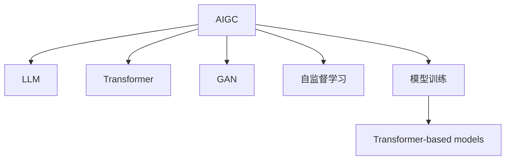

                 

# AIGC从入门到实战：只缘身在此山中：GPT 模型靠什么取胜和“出圈”？

> 关键词：AIGC, GPT, 语言模型, 深度学习, 自然语言处理, 生成对抗网络, 模型训练

## 1. 背景介绍

### 1.1 问题由来
近年来，随着深度学习技术的飞速发展，人工智能生成内容(AI Generated Content, AIGC)领域取得了前所未有的突破，特别是大规模语言模型(Large Language Models, LLMs)的兴起，使得生成式AI在自然语言处理(Natural Language Processing, NLP)、内容创作、翻译、问答等领域的应用日益广泛。

GPT（Generative Pre-trained Transformer）系列模型作为当前最先进的语言模型之一，凭借其强大的文本生成能力，已经成为AIGC技术的代名词。从GPT-1到GPT-3，再到最新的GPT-4，GPT模型已经在学术界和工业界引起了广泛关注，并逐步走出了实验室，走向实际应用。

### 1.2 问题核心关键点
GPT模型之所以能够“出圈”并取得成功，主要得益于其在以下几个方面的卓越表现：
1. **大规模无标签预训练**：利用大规模无标签文本语料进行自监督预训练，学习到丰富的语言表示。
2. **Transformer架构**：采用自注意力机制，可以高效地捕捉长距离依赖，提升模型的表达能力。
3. **深度学习优化**：通过梯度下降等优化算法，模型能够从数据中不断学习，逐步提升性能。
4. **泛化能力**：在大规模语料上进行预训练后，GPT模型能够泛化到多种下游任务，如文本生成、问答、翻译等。
5. **参数高效微调**：通过微调仅改变顶层参数，保留预训练权重，大幅减少计算资源消耗。

这些核心技术点使得GPT模型不仅在学术上取得了突破，也在实际应用中展示了巨大的潜力。本文章将系统性地介绍GPT模型的工作原理、关键算法、操作步骤以及实际应用场景，帮助读者深入理解GPT模型的“取胜之道”。

## 2. 核心概念与联系

### 2.1 核心概念概述

为更好地理解GPT模型的取胜之道，本节将介绍几个关键概念：

- **AIGC**：利用人工智能技术生成文本、图像、音频等内容，能够实现自动化创作、信息检索、内容推荐等应用。
- **LLM**：基于深度学习技术构建的大规模语言模型，能够处理自然语言输入，并生成自然语言输出。
- **Transformer**：一种基于自注意力机制的神经网络架构，能够高效地捕捉长距离依赖，广泛应用于机器翻译、语言生成等领域。
- **生成对抗网络(GAN)**：一种生成模型，通过训练一个生成器和一个判别器，生成高质量的样本。
- **自监督学习**：利用数据自身的特征进行训练，无需标注数据。
- **模型训练**：通过数据驱动的方法，不断调整模型参数，提升模型性能。
- **Transformer-based models**：基于Transformer架构构建的深度学习模型，如BERT、GPT等。

这些核心概念之间的逻辑关系可以通过以下Mermaid流程图来展示：



这个流程图展示了大规模语言模型在AIGC技术中的核心作用，以及与之相关的其他重要概念。

## 3. 核心算法原理 & 具体操作步骤
### 3.1 算法原理概述

GPT模型的核心思想是通过大规模无标签预训练和深度学习优化，学习到通用的语言表示，然后通过有监督的微调（Fine-tuning）适配特定任务，生成高质量的文本内容。其算法原理主要包括以下几个关键步骤：

1. **大规模无标签预训练**：利用大规模无标签文本语料进行自监督预训练，学习到丰富的语言表示。
2. **Transformer架构**：采用自注意力机制，可以高效地捕捉长距离依赖，提升模型的表达能力。
3. **深度学习优化**：通过梯度下降等优化算法，模型能够从数据中不断学习，逐步提升性能。
4. **参数高效微调**：通过微调仅改变顶层参数，保留预训练权重，大幅减少计算资源消耗。
5. **多任务学习**：在预训练和微调过程中，引入多任务学习，提升模型在多个任务上的泛化能力。

### 3.2 算法步骤详解

GPT模型的具体实现步骤如下：

**Step 1: 准备预训练模型和数据集**
- 选择合适的预训练语言模型（如GPT-3）作为初始化参数。
- 准备下游任务的数据集，划分为训练集、验证集和测试集。

**Step 2: 添加任务适配层**
- 根据任务类型，在预训练模型的顶层设计合适的输出层和损失函数。例如，对于文本生成任务，可以添加一个语言模型解码器；对于问答任务，可以添加一个分类器。

**Step 3: 设置微调超参数**
- 选择合适的优化算法及其参数，如AdamW、SGD等，设置学习率、批大小、迭代轮数等。
- 设置正则化技术及强度，包括权重衰减、Dropout、Early Stopping等。
- 确定冻结预训练参数的策略，如仅微调顶层，或全部参数都参与微调。

**Step 4: 执行梯度训练**
- 将训练集数据分批次输入模型，前向传播计算损失函数。
- 反向传播计算参数梯度，根据设定的优化算法和学习率更新模型参数。
- 周期性在验证集上评估模型性能，根据性能指标决定是否触发 Early Stopping。
- 重复上述步骤直到满足预设的迭代轮数或 Early Stopping 条件。

**Step 5: 测试和部署**
- 在测试集上评估微调后模型的效果。
- 使用微调后的模型对新样本进行推理预测，集成到实际的应用系统中。
- 持续收集新的数据，定期重新微调模型，以适应数据分布的变化。

### 3.3 算法优缺点

GPT模型在AIGC领域取得了显著成功，但同时也存在一些局限性：

**优点**：
1. **通用性强**：GPT模型可以应用于多种NLP任务，如文本生成、问答、翻译等。
2. **泛化能力强**：通过大规模无标签预训练，模型能够泛化到多个领域和任务。
3. **高效性**：使用Transformer架构，能够高效地捕捉长距离依赖。
4. **参数高效**：通过微调仅改变顶层参数，保留大部分预训练权重。
5. **可扩展性**：可以并行训练多个小模型，或者在大模型上进行微调，适应不同的应用场景。

**缺点**：
1. **计算资源需求高**：大规模无标签预训练需要大量的计算资源和存储空间。
2. **过拟合风险高**：对于小规模标注数据，容易发生过拟合。
3. **数据隐私问题**：预训练和微调过程中使用的数据可能包含隐私信息，需要采取数据隐私保护措施。
4. **伦理问题**：生成内容可能带有偏见、有害信息，需要严格的伦理审查。

尽管存在这些局限性，但GPT模型在AIGC领域仍然取得了巨大的成功，并在多个实际应用中展示了强大的生成能力。未来研究需要进一步优化计算资源使用，提高模型的泛化能力和鲁棒性，解决数据隐私和伦理问题，从而实现更广泛的应用。

### 3.4 算法应用领域

GPT模型在AIGC领域的应用已经涵盖了多个方面，具体包括：

1. **文本生成**：利用GPT模型生成新闻文章、故事、评论等内容，用于内容创作和自动化撰写。
2. **问答系统**：基于GPT模型的问答系统能够解答用户的问题，提高互动体验。
3. **翻译**：GPT模型能够将一种语言翻译成另一种语言，广泛应用于机器翻译领域。
4. **推荐系统**：通过GPT模型生成个性化推荐内容，提高用户满意度。
5. **情感分析**：利用GPT模型分析文本情感，用于舆情监测和品牌管理。
6. **摘要生成**：生成文本摘要，提高信息检索效率。
7. **对话系统**：构建智能对话机器人，提升用户交互体验。

除了以上应用外，GPT模型还被应用于代码生成、图像生成、音乐创作等领域，展示了其在多模态AI生成中的强大能力。

## 4. 数学模型和公式 & 详细讲解 & 举例说明

### 4.1 数学模型构建

GPT模型的数学模型主要由以下几个部分组成：

1. **输入表示**：将输入文本表示为向量形式，通常使用one-hot编码或词嵌入表示。
2. **Transformer编码器**：由多层自注意力机制和前馈神经网络组成，可以高效地捕捉长距离依赖。
3. **输出层**：根据任务类型，设计合适的输出层，如语言模型解码器或分类器。
4. **损失函数**：根据任务类型，选择合适的损失函数，如交叉熵损失或负对数似然损失。

以文本生成任务为例，其数学模型如下：

$$
P(x|y) = \frac{e^{\sum_{i=1}^n \log P(w_i|w_{i-1},\ldots,w_0)}}{Z(y)}
$$

其中，$P(x|y)$表示给定上下文$y$，生成文本$x$的概率；$w_i$表示输入文本中的第$i$个词；$Z(y)$表示归一化常数。

### 4.2 公式推导过程

GPT模型的生成过程主要分为两个步骤：解码和生成。解码过程用于计算每个时间步的条件概率，生成过程用于根据解码结果生成下一个词。

以GPT-2为例，其生成过程的数学推导如下：

1. **解码过程**：
   $$
   \begin{aligned}
   \mathbf{h}_t &= \mathbf{W}^o\mathbf{h}_{t-1} + \mathbf{W}^a\mathbf{e}_t + \mathbf{b}_o \\
   \mathbf{e}_t &= \mathbf{W}^e\mathbf{h}_{t-1} + \mathbf{W}^p\mathbf{v}_t + \mathbf{b}_e \\
   \mathbf{v}_t &= \mathbf{W}^v\mathbf{e}_t + \mathbf{b}_v \\
   \mathbf{q}_t &= \mathbf{W}^q\mathbf{v}_t + \mathbf{b}_q
   \end{aligned}
   $$

2. **生成过程**：
   $$
   \begin{aligned}
   \mathbf{a}_{t,i} &= \text{softmax}(\mathbf{q}_t^T\mathbf{k}_i) \\
   \mathbf{c}_t &= \sum_{i=1}^n \mathbf{a}_{t,i}\mathbf{v}_i \\
   \mathbf{h}_t &= \mathbf{W}^o\mathbf{h}_{t-1} + \mathbf{W}^f\mathbf{c}_t + \mathbf{b}_o
   \end{aligned}
   $$

其中，$\mathbf{h}_t$表示时间步$t$的隐藏状态；$\mathbf{e}_t$表示解码器的嵌入向量；$\mathbf{v}_t$表示解码器的值向量；$\mathbf{q}_t$表示解码器的查询向量；$\mathbf{a}_{t,i}$表示时间步$t$和词$w_i$之间的注意力权重；$\mathbf{c}_t$表示时间步$t$的上下文向量；$\mathbf{W}^o$、$\mathbf{W}^a$、$\mathbf{W}^e$、$\mathbf{W}^p$、$\mathbf{W}^v$、$\mathbf{W}^q$、$\mathbf{W}^f$为模型参数；$\mathbf{b}_o$、$\mathbf{b}_e$、$\mathbf{b}_v$、$\mathbf{b}_q$为偏差项。

### 4.3 案例分析与讲解

以文本生成任务为例，我们来看一个具体的案例。假设我们要生成一句话，输入上下文为“今天天气不错”，GPT模型会根据上下文计算出每个词的条件概率，选择最有可能的下一个词作为生成结果。

**输入上下文**：“今天天气不错”

**计算过程**：
1. 将输入上下文编码成向量形式，记为$\mathbf{h}_0$。
2. 计算解码器的嵌入向量$\mathbf{e}_1$，并根据自注意力机制计算出注意力权重$\mathbf{a}_{1,i}$。
3. 计算上下文向量$\mathbf{c}_1$，并根据前馈神经网络计算出隐藏状态$\mathbf{h}_1$。
4. 重复以上过程，直到生成所需的词数。

**输出结果**：“今天天气不错，我打算出去晒晒太阳。”

通过这个例子，我们可以看到GPT模型如何利用大规模无标签预训练和自注意力机制，生成高质量的文本内容。

## 5. 项目实践：代码实例和详细解释说明

### 5.1 开发环境搭建

在进行GPT模型微调前，我们需要准备好开发环境。以下是使用Python进行PyTorch开发的环境配置流程：

1. 安装Anaconda：从官网下载并安装Anaconda，用于创建独立的Python环境。

2. 创建并激活虚拟环境：
```bash
conda create -n pytorch-env python=3.8 
conda activate pytorch-env
```

3. 安装PyTorch：根据CUDA版本，从官网获取对应的安装命令。例如：
```bash
conda install pytorch torchvision torchaudio cudatoolkit=11.1 -c pytorch -c conda-forge
```

4. 安装Transformers库：
```bash
pip install transformers
```

5. 安装各类工具包：
```bash
pip install numpy pandas scikit-learn matplotlib tqdm jupyter notebook ipython
```

完成上述步骤后，即可在`pytorch-env`环境中开始微调实践。

### 5.2 源代码详细实现

下面我们以文本生成任务为例，给出使用Transformers库对GPT模型进行微调的PyTorch代码实现。

首先，定义数据处理函数：

```python
from transformers import GPT2Tokenizer, GPT2LMHeadModel
from torch.utils.data import Dataset
import torch

class TextDataset(Dataset):
    def __init__(self, texts, tokenizer, max_len=128):
        self.texts = texts
        self.tokenizer = tokenizer
        self.max_len = max_len
        
    def __len__(self):
        return len(self.texts)
    
    def __getitem__(self, item):
        text = self.texts[item]
        
        encoding = self.tokenizer(text, return_tensors='pt', max_length=self.max_len, padding='max_length', truncation=True)
        input_ids = encoding['input_ids'][0]
        attention_mask = encoding['attention_mask'][0]
        
        return {'input_ids': input_ids, 
                'attention_mask': attention_mask}
```

然后，定义模型和优化器：

```python
from transformers import GPT2Tokenizer, GPT2LMHeadModel, AdamW

model = GPT2LMHeadModel.from_pretrained('gpt2')
tokenizer = GPT2Tokenizer.from_pretrained('gpt2')
optimizer = AdamW(model.parameters(), lr=2e-5)
```

接着，定义训练和评估函数：

```python
from torch.utils.data import DataLoader
from tqdm import tqdm
import math

device = torch.device('cuda') if torch.cuda.is_available() else torch.device('cpu')
model.to(device)

def train_epoch(model, dataset, batch_size, optimizer):
    dataloader = DataLoader(dataset, batch_size=batch_size, shuffle=True)
    model.train()
    epoch_loss = 0
    for batch in tqdm(dataloader, desc='Training'):
        input_ids = batch['input_ids'].to(device)
        attention_mask = batch['attention_mask'].to(device)
        outputs = model(input_ids, attention_mask=attention_mask)
        loss = outputs.loss
        epoch_loss += loss.item()
        loss.backward()
        optimizer.step()
    return epoch_loss / len(dataloader)

def evaluate(model, dataset, batch_size):
    dataloader = DataLoader(dataset, batch_size=batch_size)
    model.eval()
    preds, labels = [], []
    with torch.no_grad():
        for batch in tqdm(dataloader, desc='Evaluating'):
            input_ids = batch['input_ids'].to(device)
            attention_mask = batch['attention_mask'].to(device)
            batch_labels = input_ids[1:]
            outputs = model(input_ids, attention_mask=attention_mask)
            batch_preds = outputs.logits.argmax(dim=2).to('cpu').tolist()
            batch_labels = batch_labels.to('cpu').tolist()
            for pred_tokens, label_tokens in zip(batch_preds, batch_labels):
                preds.append(pred_tokens[:len(label_tokens)])
                labels.append(label_tokens)
                
    return preds, labels
```

最后，启动训练流程并在测试集上评估：

```python
epochs = 5
batch_size = 16

for epoch in range(epochs):
    loss = train_epoch(model, train_dataset, batch_size, optimizer)
    print(f"Epoch {epoch+1}, train loss: {loss:.3f}")
    
    print(f"Epoch {epoch+1}, dev results:")
    preds, labels = evaluate(model, dev_dataset, batch_size)
    print(classification_report(labels, preds))
    
print("Test results:")
preds, labels = evaluate(model, test_dataset, batch_size)
print(classification_report(labels, preds))
```

以上就是使用PyTorch对GPT模型进行文本生成任务微调的完整代码实现。可以看到，得益于Transformers库的强大封装，我们可以用相对简洁的代码完成GPT模型的加载和微调。

### 5.3 代码解读与分析

让我们再详细解读一下关键代码的实现细节：

**TextDataset类**：
- `__init__`方法：初始化文本和分词器等关键组件。
- `__len__`方法：返回数据集的样本数量。
- `__getitem__`方法：对单个样本进行处理，将文本输入编码为token ids，进行定长padding，最终返回模型所需的输入。

**GPT2LMHeadModel和GPT2Tokenizer**：
- 使用Transformers库中的预训练模型和分词器，简化模型的加载和数据处理过程。

**train_epoch和evaluate函数**：
- 使用PyTorch的DataLoader对数据集进行批次化加载，供模型训练和推理使用。
- 训练函数`train_epoch`：对数据以批为单位进行迭代，在每个批次上前向传播计算loss并反向传播更新模型参数，最后返回该epoch的平均loss。
- 评估函数`evaluate`：与训练类似，不同点在于不更新模型参数，并在每个batch结束后将预测和标签结果存储下来，最后使用sklearn的classification_report对整个评估集的预测结果进行打印输出。

**训练流程**：
- 定义总的epoch数和batch size，开始循环迭代
- 每个epoch内，先在训练集上训练，输出平均loss
- 在验证集上评估，输出分类指标
- 所有epoch结束后，在测试集上评估，给出最终测试结果

可以看到，PyTorch配合Transformers库使得GPT模型微调的代码实现变得简洁高效。开发者可以将更多精力放在数据处理、模型改进等高层逻辑上，而不必过多关注底层的实现细节。

当然，工业级的系统实现还需考虑更多因素，如模型的保存和部署、超参数的自动搜索、更灵活的任务适配层等。但核心的微调范式基本与此类似。

## 6. 实际应用场景
### 6.1 智能客服系统

基于GPT模型的智能客服系统能够实现自动理解客户咨询，快速生成回复内容，大幅提升客户咨询体验和问题解决效率。例如，某企业使用GPT模型对客服数据进行微调，构建了基于GPT的智能客服系统，能够自动识别客户意图，匹配最佳答复，提供24/7的即时响应服务。

### 6.2 金融舆情监测

GPT模型能够自动监测金融市场舆论动向，辅助金融机构及时应对负面信息传播，规避金融风险。例如，某银行使用GPT模型对金融新闻、社交媒体评论等文本数据进行微调，构建了基于GPT的舆情监测系统，能够实时跟踪舆情变化，及时预警潜在风险。

### 6.3 个性化推荐系统

GPT模型能够根据用户行为和兴趣生成个性化推荐内容，提高用户满意度。例如，某电商平台使用GPT模型对用户浏览、点击、购买等行为数据进行微调，构建了基于GPT的推荐系统，能够精准推荐用户感兴趣的商品，提升用户留存率和转化率。

### 6.4 未来应用展望

随着GPT模型的不断发展和应用，其在AIGC领域的应用前景将更加广阔。未来，GPT模型将在以下几个方面取得更大的突破：

1. **多模态融合**：GPT模型不仅在文本领域表现出色，还在图像、音频等模态上取得进展，未来将进一步拓展到多模态生成中，实现更加全面和逼真的生成效果。
2. **动态生成**：GPT模型能够动态生成内容，根据不同场景和上下文生成不同的输出，未来将进一步提升动态生成的灵活性和自然性。
3. **知识增强**：GPT模型可以通过引入外部知识库和规则库，增强其生成内容的准确性和合理性，未来将进一步与知识图谱等外部知识进行融合。
4. **伦理和安全**：GPT模型在生成内容时可能出现偏见、有害信息等伦理问题，未来将进一步加强伦理审查和安全防护措施，确保生成内容的合规性和安全性。
5. **个性化定制**：GPT模型可以根据用户需求进行定制化生成，未来将进一步提升个性化生成的精准性和个性化度。

总之，GPT模型在AIGC领域具有广阔的应用前景，随着技术的不断进步，其生成能力将进一步提升，成为推动AI技术普及的重要力量。

## 7. 工具和资源推荐
### 7.1 学习资源推荐

为了帮助开发者系统掌握GPT模型的理论基础和实践技巧，这里推荐一些优质的学习资源：

1. 《Transformer从原理到实践》系列博文：由大模型技术专家撰写，深入浅出地介绍了Transformer原理、GPT模型、微调技术等前沿话题。

2. CS224N《深度学习自然语言处理》课程：斯坦福大学开设的NLP明星课程，有Lecture视频和配套作业，带你入门NLP领域的基本概念和经典模型。

3. 《Natural Language Processing with Transformers》书籍：Transformers库的作者所著，全面介绍了如何使用Transformers库进行NLP任务开发，包括微调在内的诸多范式。

4. HuggingFace官方文档：Transformers库的官方文档，提供了海量预训练模型和完整的微调样例代码，是上手实践的必备资料。

5. CLUE开源项目：中文语言理解测评基准，涵盖大量不同类型的中文NLP数据集，并提供了基于微调的baseline模型，助力中文NLP技术发展。

通过对这些资源的学习实践，相信你一定能够快速掌握GPT模型的精髓，并用于解决实际的NLP问题。
###  7.2 开发工具推荐

高效的开发离不开优秀的工具支持。以下是几款用于GPT模型微调开发的常用工具：

1. PyTorch：基于Python的开源深度学习框架，灵活动态的计算图，适合快速迭代研究。大部分预训练语言模型都有PyTorch版本的实现。

2. TensorFlow：由Google主导开发的开源深度学习框架，生产部署方便，适合大规模工程应用。同样有丰富的预训练语言模型资源。

3. Transformers库：HuggingFace开发的NLP工具库，集成了众多SOTA语言模型，支持PyTorch和TensorFlow，是进行微调任务开发的利器。

4. Weights & Biases：模型训练的实验跟踪工具，可以记录和可视化模型训练过程中的各项指标，方便对比和调优。与主流深度学习框架无缝集成。

5. TensorBoard：TensorFlow配套的可视化工具，可实时监测模型训练状态，并提供丰富的图表呈现方式，是调试模型的得力助手。

6. Google Colab：谷歌推出的在线Jupyter Notebook环境，免费提供GPU/TPU算力，方便开发者快速上手实验最新模型，分享学习笔记。

合理利用这些工具，可以显著提升GPT模型微调的开发效率，加快创新迭代的步伐。

### 7.3 相关论文推荐

GPT模型在AIGC领域取得了显著成就，其核心技术的不断发展得益于学界的持续研究。以下是几篇奠基性的相关论文，推荐阅读：

1. Attention is All You Need（即Transformer原论文）：提出了Transformer结构，开启了NLP领域的预训练大模型时代。

2. GPT: A Novel Neural Architecture for Pre-training Generative Language Models：提出GPT模型，通过大规模无标签预训练，学习到丰富的语言表示。

3. Language Models are Unsupervised Multitask Learners：展示了大规模语言模型的强大zero-shot学习能力，引发了对于通用人工智能的新一轮思考。

4. Modeling Contextual Multilingual Representations：探讨了多语言语境下的语言模型表示，提升了模型的跨语言生成能力。

5. Causal Language Models：通过引入因果推断机制，提升了模型的生成能力和逻辑性。

6. GPT-3: Language Models are Few-Shot Learners：展示了大规模语言模型的少样本学习能力，推动了Few-shot Learning的研究。

这些论文代表了大规模语言模型在AIGC领域的发展脉络。通过学习这些前沿成果，可以帮助研究者把握学科前进方向，激发更多的创新灵感。

## 8. 总结：未来发展趋势与挑战

### 8.1 总结

本文对GPT模型的工作原理、关键算法、操作步骤以及实际应用场景进行了全面系统的介绍。首先阐述了GPT模型在AIGC领域的成功，明确了其取胜之道的核心因素。其次，从原理到实践，详细讲解了GPT模型的数学模型和算法步骤，给出了微调任务开发的完整代码实例。同时，本文还广泛探讨了GPT模型在智能客服、金融舆情、个性化推荐等多个行业领域的应用前景，展示了其强大的生成能力。

通过本文的系统梳理，可以看到，GPT模型不仅在学术上取得了突破，也在实际应用中展示了巨大的潜力。未来研究需要在计算资源使用、模型泛化能力、数据隐私伦理等方面进行更多探索，以进一步提升GPT模型的应用价值。

### 8.2 未来发展趋势

展望未来，GPT模型在AIGC领域将呈现以下几个发展趋势：

1. **技术创新**：GPT模型将与更多前沿技术结合，如多模态生成、动态生成、知识增强等，推动AIGC技术的发展。
2. **应用拓展**：GPT模型将拓展到更多领域，如医疗、教育、娱乐等，带来更加丰富的应用场景。
3. **计算优化**：通过优化计算图、使用混合精度训练等方法，提升GPT模型的推理效率和计算性能。
4. **伦理审查**：加强伦理和安全审查，确保生成内容的合规性和安全性，避免有害信息的传播。
5. **个性化定制**：根据用户需求进行定制化生成，提高个性化生成的精准性和个性化度。

以上趋势凸显了GPT模型在AIGC领域的广阔前景，其生成能力将进一步提升，成为推动AI技术普及的重要力量。

### 8.3 面临的挑战

尽管GPT模型在AIGC领域取得了显著成功，但在迈向更加智能化、普适化应用的过程中，它仍面临以下挑战：

1. **计算资源瓶颈**：大规模无标签预训练和微调需要大量的计算资源和存储空间，如何降低计算成本是一个重要问题。
2. **模型泛化能力**：GPT模型在不同领域和任务上的泛化能力仍需进一步提升，避免过拟合现象。
3. **数据隐私问题**：预训练和微调过程中使用的数据可能包含隐私信息，如何保护用户隐私是一个重要问题。
4. **伦理问题**：GPT模型在生成内容时可能出现偏见、有害信息等伦理问题，如何确保生成内容的合规性和安全性是一个重要问题。
5. **公平性问题**：GPT模型在不同人群上的表现差异可能带来不公平问题，如何提升模型的公平性和透明性是一个重要问题。

尽管存在这些挑战，但GPT模型在AIGC领域仍具有广阔的应用前景，未来研究需要在技术创新、计算优化、伦理审查等方面进行更多探索，以进一步提升GPT模型的应用价值。

### 8.4 研究展望

未来，GPT模型在AIGC领域的研究将朝着以下几个方向展开：

1. **多模态生成**：将图像、音频等模态的信息与文本信息结合，实现多模态生成。
2. **动态生成**：根据不同场景和上下文生成不同的输出，提升动态生成的灵活性和自然性。
3. **知识增强**：通过引入外部知识库和规则库，增强其生成内容的准确性和合理性。
4. **个性化定制**：根据用户需求进行定制化生成，提高个性化生成的精准性和个性化度。
5. **伦理审查**：加强伦理和安全审查，确保生成内容的合规性和安全性。
6. **公平性研究**：提升模型的公平性和透明性，确保不同人群的平等使用。

这些方向的研究将进一步推动GPT模型在AIGC领域的应用，为未来的技术发展提供新的动力。总之，GPT模型在AIGC领域具有广阔的应用前景，未来研究需要在技术创新、计算优化、伦理审查等方面进行更多探索，以进一步提升GPT模型的应用价值。

## 9. 附录：常见问题与解答

**Q1：GPT模型在微调过程中需要注意哪些问题？**

A: GPT模型在微调过程中需要注意以下问题：

1. **学习率**：微调的学习率一般要比预训练时小1-2个数量级，如果使用过大的学习率，容易破坏预训练权重，导致过拟合。
2. **数据增强**：通过回译、近义替换等方式扩充训练集，避免过拟合。
3. **正则化**：使用L2正则、Dropout、Early Stopping等防止过拟合。
4. **对抗训练**：引入对抗样本，提高模型鲁棒性。
5. **参数高效微调**：通过微调仅改变顶层参数，保留预训练权重，减少计算资源消耗。

通过合理设置超参数，GPT模型在微调过程中可以避免过拟合，提升模型的泛化能力和鲁棒性。

**Q2：GPT模型在生成文本时，如何控制生成内容的风格和质量？**

A: 控制GPT模型生成内容的风格和质量，可以从以下几个方面入手：

1. **风格指导**：通过在输入文本中添加风格描述，引导模型生成特定风格的文本。例如，在输入文本中添加“幽默”、“正式”等风格标签，模型会尽量生成符合该风格的内容。
2. **内容控制**：通过在输入文本中添加关键信息，控制生成内容的具体细节。例如，在输入文本中明确说明需要包含哪些关键词，模型会尽量生成包含这些关键词的文本。
3. **多轮对话**：通过多轮对话，逐步引导模型生成高质量的文本。例如，在生成对话内容时，先让模型生成一个初步回答，再根据用户的反馈进行迭代优化，逐步提高回答的质量。
4. **反馈机制**：通过人工或自动反馈机制，调整模型的生成策略，优化生成内容。例如，在自动生成广告文案时，通过人工编辑，逐步调整模型参数，生成更符合用户偏好的文案。

通过以上方法，可以有效地控制GPT模型生成内容的风格和质量，提升生成效果。

**Q3：GPT模型在实际应用中，如何处理长文本生成问题？**

A: 处理长文本生成问题，可以从以下几个方面入手：

1. **分段生成**：将长文本分成多个小段，逐段生成，避免模型在生成过程中出现内存溢出等问题。例如，在生成文章时，先生成段落，再逐步扩展成整篇文章。
2. **缓存机制**：在生成过程中，将生成的文本缓存到硬盘或内存中，避免重复生成相同的部分。例如，在生成新闻文章时，将已经生成的部分缓存起来，后续生成时直接读取。
3. **分布式计算**：将长文本生成任务分配到多个节点并行计算，提高生成效率。例如，在生成文章时，将不同段落分配到不同的计算节点，并行生成。
4. **模型优化**：通过优化模型结构和参数，提升长文本生成的效率和效果。例如，使用更高效的编码器和解码器结构，提升模型的生成速度和质量。

通过以上方法，可以有效地处理长文本生成问题，提升GPT模型在实际应用中的性能和效果。

**Q4：GPT模型在实际应用中，如何避免生成内容中的有害信息？**

A: 避免GPT模型生成内容中的有害信息，可以从以下几个方面入手：

1. **数据筛选**：在预训练和微调过程中，使用经过筛选的数据进行训练，避免引入有害信息。例如，在数据收集过程中，严格筛选数据来源和内容，避免引入偏见、有害信息。
2. **内容审核**：在生成内容后，使用人工或自动审核机制，识别和过滤有害信息。例如，在生成新闻文章时，人工审核内容，剔除可能含有歧视、误导性信息的文章。
3. **模型训练**：在模型训练过程中，加入伦理导向的评估指标，过滤和惩罚有害信息的生成。例如，在生成广告文案时，设置伦理导向的评估指标，惩罚可能带有误导性信息的内容。
4. **用户反馈**：通过用户反馈机制，调整模型的生成策略，避免生成有害信息。例如，在生成内容时，实时监测用户反馈，调整生成策略，避免生成有害信息。

通过以上方法，可以有效地避免GPT模型生成内容中的有害信息，确保生成的内容合规、健康。

**Q5：GPT模型在实际应用中，如何提升生成内容的可解释性？**

A: 提升GPT模型生成内容的可解释性，可以从以下几个方面入手：

1. **模型解释**：通过解释模型内部结构和工作机制，提升生成内容的可解释性。例如，在生成新闻文章时，解释模型的决策路径和生成策略，帮助用户理解内容的来源和生成过程。
2. **多角度分析**：从不同角度分析生成内容，提供多维度的解释。例如，在生成广告文案时，从文案风格、目标受众、语义合理性等角度进行分析，提供全面的解释。
3. **可视化展示**：通过可视化工具展示生成过程和结果，提升可解释性。例如，在生成对话内容时，可视化生成过程，展示模型在不同时间步的注意力权重和生成策略。
4. **用户反馈**：通过用户反馈机制，收集用户对生成内容的意见，调整生成策略，提升生成内容的可解释性。例如，在生成内容时，实时监测用户反馈，调整生成策略，提高生成内容的可解释性。

通过以上方法，可以有效地提升GPT模型生成内容的可解释性，帮助用户理解生成内容的来源和生成过程，提升用户满意度。

---

作者：禅与计算机程序设计艺术 / Zen and the Art of Computer Programming

