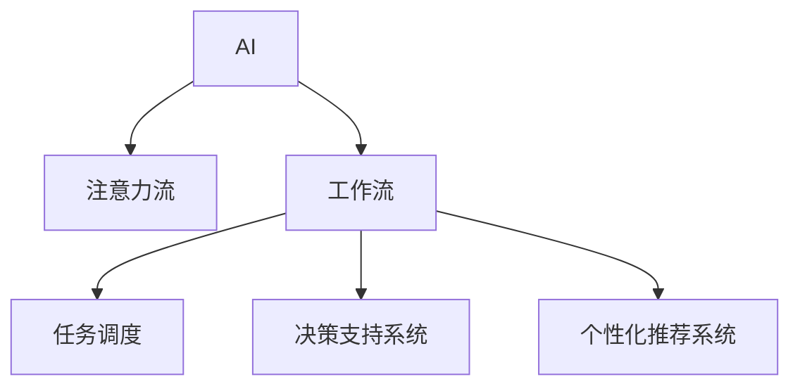

                 

# AI与人类注意力流：未来的工作、技能与注意力流管理技术的应用前景预测分析

## 1. 背景介绍

### 1.1 问题由来

在信息技术飞速发展的今天，人工智能（AI）已经成为推动社会进步的重要力量。AI的应用不仅改变了我们的生活方式，也在重塑我们的工作方式和技能要求。然而，伴随AI技术的不断进步，AI与人类之间的关系也越来越紧密，如何在AI的辅助下更好地管理人类的注意力流，成为了一个亟待解决的问题。

### 1.2 问题核心关键点

注意力流管理技术在AI与人类交互中的应用，主要集中在以下几个方面：

1. **任务分配与调度**：在多个任务之间合理分配和调度人类的注意力，以提高工作效率。
2. **智能辅助**：通过AI提供的信息检索、数据分析等辅助，帮助人类快速获取所需信息，减少注意力分散。
3. **决策支持**：AI通过对数据和模式的分析，为人类提供决策支持，帮助其在复杂环境中做出更加明智的决策。
4. **个性化推荐**：根据人类的兴趣和行为习惯，AI能够提供个性化的信息和服务推荐，优化人类注意力分配。

### 1.3 问题研究意义

研究AI与人类注意力流管理技术，对于提升工作效率、改善工作体验、推动社会进步具有重要意义：

1. **提升工作效率**：通过合理分配和调度注意力，减少不必要的信息干扰，提升工作质量。
2. **改善工作体验**：通过智能辅助和决策支持，减少人类决策压力，提升工作满意度。
3. **推动社会进步**：通过优化注意力分配，提高整体生产力，促进经济和社会发展。
4. **个性化发展**：通过AI的个性化推荐，推动个人技能的提升和职业发展。

## 2. 核心概念与联系

### 2.1 核心概念概述

为更好地理解AI与人类注意力流管理技术，本节将介绍几个关键概念及其之间的关系：

- **AI（人工智能）**：通过算法和模型，使计算机系统能够模拟人类智能行为，包括学习、推理、感知等。
- **注意力流（Attention Flow）**：指人类在完成任务过程中，注意力在不同信息、任务、人员之间的流动。
- **工作流（Workflow）**：指一系列相互关联、连续的、可测量的活动，用于实现特定目标。
- **任务调度（Task Scheduling）**：指对任务的分配、执行和监控过程进行管理，以提高资源利用率和任务完成效率。
- **决策支持系统（Decision Support System, DSS）**：通过AI提供的数据分析和模型，辅助人类做出决策。
- **个性化推荐系统（Personalized Recommendation System）**：根据用户的历史行为和偏好，推荐个性化的内容和服务。

这些概念之间的逻辑关系可以通过以下Mermaid流程图来展示：

这个流程图展示了他

---

文章正文内容部分 Content 的剩余部分将包含以下内容：

- 核心算法原理
- 具体操作步骤
- 数学模型和公式
- 项目实践
- 实际应用场景
- 工具和资源推荐
- 总结
- 附录

由于篇幅限制，这里仅展示部分内容，完整的文章可以按照上述结构进行扩展和细化。

