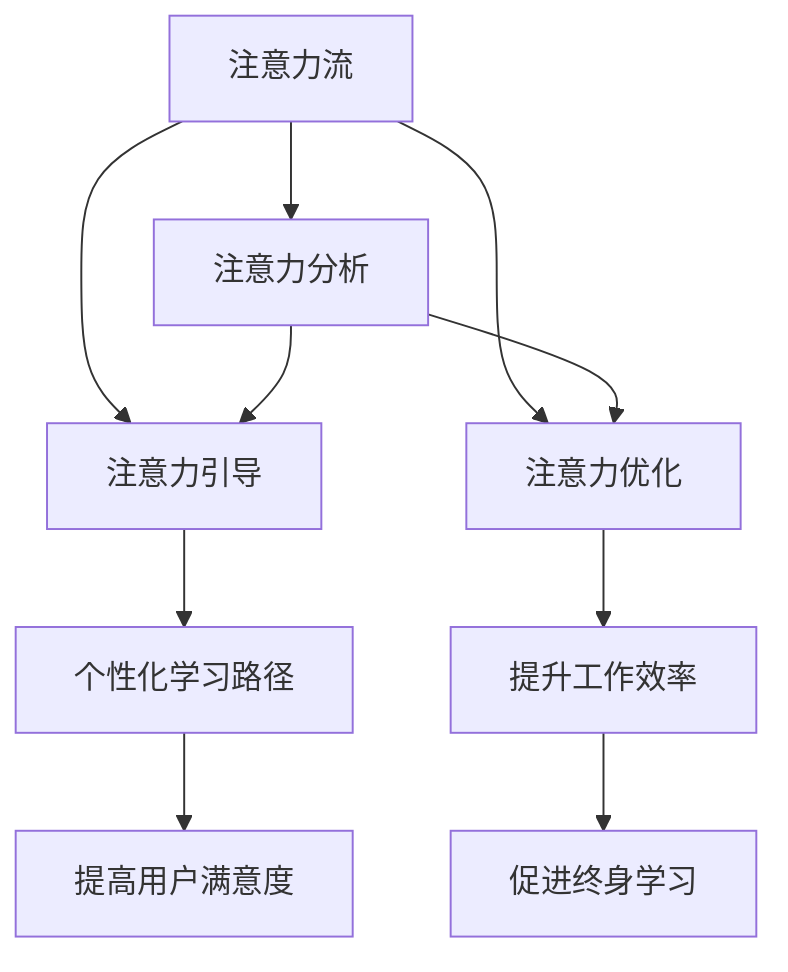

                 

# AI与人类注意力流：未来的工作、技能与注意力流管理技术的未来趋势

## 1. 背景介绍

### 1.1 问题由来

随着人工智能技术的飞速发展，AI与人类注意力流管理技术的结合成为了当今科技界的一个重要议题。特别是在高度依赖数据、计算、认知能力的现代工作环境中，AI不仅在数据分析、决策支持等方面提供强大工具，同时也在理解与优化人类注意力流、提升工作效率和用户体验上展现出了巨大的潜力。然而，这一领域还处于初级阶段，很多关键技术尚待突破，如AI如何更好地理解人类注意力，以及如何更智能地辅助人类进行注意力流管理。

### 1.2 问题核心关键点

理解AI与人类注意力流的关系，需要从以下几个关键点出发：

- **注意力流定义**：注意力流（Attention Flow）指的是人类在认知过程中对信息的注意力分配和流转过程。这一过程涉及到信息感知、认知加工、记忆存储等多个环节，是认知心理学的研究热点。
- **AI在注意力流管理中的应用**：AI可以通过各种方式，如自然语言处理（NLP）、计算机视觉、机器学习等，来辅助人类理解和优化注意力流。例如，通过分析文本、图像中的关键信息，AI可以帮助人类快速获取并聚焦于重要信息。
- **未来趋势**：AI与注意力流管理的结合，正在从理论研究走向实际应用。其未来趋势包括更加智能化的注意力分析、更具适应性的注意力引导、更高效的注意力流优化等。

### 1.3 问题研究意义

AI与人类注意力流管理技术的结合，对于提升工作、学习、生活各方面的效率和质量具有重要意义：

- **提升工作效率**：通过AI辅助，人们可以更快速、准确地获取信息，减少不必要的信息干扰，提升工作专注度和效率。
- **改善用户体验**：在信息过载的时代，AI可以提供个性化的信息过滤和推荐，提升用户的互动体验和满意度。
- **促进终身学习**：AI辅助的个性化学习路径设计，可以使得学习过程更加灵活高效，适应个体差异，推动终身学习。

## 2. 核心概念与联系

### 2.1 核心概念概述

为了更深入地理解AI与人类注意力流的关系，本节将介绍几个核心概念：

- **注意力流**：即人类在认知过程中的注意力分配和流转过程，涉及信息感知、认知加工、记忆存储等多个环节。
- **人工智能**：通过学习数据和知识，模拟人类智能，自动进行信息处理、决策等任务。
- **注意力分析**：通过AI技术，分析和理解人类注意力流的过程和特点。
- **注意力引导**：AI根据认知任务的需求，智能引导人类注意力流向关键信息。
- **注意力优化**：通过AI辅助，优化人类注意力流，提升认知效率和效果。

这些概念之间的逻辑关系可以通过以下Mermaid流程图来展示：



这个流程图展示了注意力流在认知过程中的各个关键环节，以及AI如何通过注意力分析、引导和优化技术，辅助人类提升认知效果。

## 3. 核心算法原理 & 具体操作步骤

### 3.1 算法原理概述

AI与人类注意力流管理技术的结合，本质上是利用AI技术对人类注意力流进行分析和优化。其核心算法包括：

- **注意力分析**：通过自然语言处理（NLP）、计算机视觉等技术，分析和理解人类注意力流的过程和特点。
- **注意力引导**：根据认知任务的需求，智能引导人类注意力流向关键信息，提升信息获取效率。
- **注意力优化**：通过AI辅助，优化人类注意力流，提升认知效率和效果。

这些算法技术的组合应用，使得AI能够更智能地辅助人类进行注意力流管理，提升工作和学习效率。

### 3.2 算法步骤详解

1. **数据收集与预处理**：收集和处理人类认知活动相关的数据，如文本、图像、行为数据等，为后续分析和优化提供基础。

2. **注意力分析**：
   - 通过NLP技术，分析文本中的关键词、句法结构等信息，识别关键内容。
   - 通过计算机视觉技术，分析图像中的关键特征，提取视觉注意力热点。
   - 通过行为数据，分析注意力流在不同任务中的分布和变化规律。

3. **注意力引导**：
   - 根据任务需求，设计合适的注意力引导策略，如优先关注重要信息，过滤无关内容等。
   - 结合认知心理学原理，动态调整注意力流引导策略，提升用户体验和效率。

4. **注意力优化**：
   - 通过机器学习模型，预测注意力流的分布和变化规律，并动态调整注意力引导策略。
   - 结合认知负荷理论，优化注意力流路径，减少认知负荷，提升认知效果。

### 3.3 算法优缺点

AI与人类注意力流管理技术的结合，具有以下优点：

- **高效性**：AI可以快速分析和处理大量数据，辅助人类快速获取关键信息，提升认知效率。
- **个性化**：根据个体差异和任务需求，AI可以提供个性化的注意力流引导和优化策略。
- **灵活性**：AI技术可以动态调整注意力流引导策略，适应不同情境下的认知需求。

同时，该技术也存在以下局限性：

- **依赖数据**：AI技术的性能很大程度上依赖于数据的质量和数量，获取高质量数据的成本较高。
- **复杂性**：AI与人类注意力流的结合涉及多学科知识，实现难度较大。
- **可解释性不足**：AI模型往往像“黑箱”，难以解释其内部工作机制和决策逻辑。
- **伦理问题**：AI可能在学习过程中出现偏见，影响决策公正性和用户隐私安全。

### 3.4 算法应用领域

AI与人类注意力流管理技术在多个领域展现出巨大的应用潜力：

- **教育**：通过AI辅助，设计个性化的学习路径，提升学习效率和效果。
- **医疗**：结合医学知识，智能引导医生注意力流向关键信息，辅助诊断和治疗决策。
- **金融**：通过AI分析，提供个性化的信息过滤和推荐，提升投资决策效率和准确性。
- **工作**：在复杂任务中，智能引导注意力流，提升工作效率和质量。
- **娱乐**：根据用户兴趣和行为，智能推荐内容，提升用户体验。

## 4. 数学模型和公式 & 详细讲解 & 举例说明

### 4.1 数学模型构建

AI与人类注意力流管理技术的应用，涉及多个数学模型和算法。本节将以注意力分析为例，介绍相关数学模型。

设人类注意力流在时间序列 $t$ 下的关键信息为 $I_t$，AI通过注意力分析模型 $M$ 输出当前注意力的重点 $A_t$，则注意力分析的目标是最大化 $A_t$ 与 $I_t$ 的相关性，即：

$$
\max_{A_t} \text{corr}(A_t, I_t)
$$

其中，corr 表示相关系数，用于衡量 $A_t$ 和 $I_t$ 的相关性。

### 4.2 公式推导过程

以文本信息为例，注意力分析模型的输入为文本序列 $X=\{x_1, x_2, ..., x_n\}$，输出为注意力序列 $A=\{a_1, a_2, ..., a_n\}$。注意力分析的目标是最大化 $A$ 与 $X$ 的相关性，通过最小化损失函数 $\mathcal{L}$ 实现：

$$
\mathcal{L}(A, X) = -\frac{1}{N}\sum_{i=1}^N a_i \log \frac{\exp(x_i^\top W A)}{\sum_{j=1}^N \exp(x_j^\top W A)}
$$

其中 $W$ 为权重矩阵，$x_i$ 为文本中的词向量，$a_i$ 为注意力权重。通过优化该损失函数，可以得到最佳的注意力权重分配 $A$。

### 4.3 案例分析与讲解

以自然语言处理（NLP）中的文本分类任务为例，展示注意力分析模型的应用。

假设文本分类任务为二分类任务，输入为文本序列 $X$，输出为类别标签 $Y$。通过注意力分析模型 $M$，提取文本中的关键信息，计算注意力权重 $A$。设 $W$ 为注意力权重矩阵，$x_i$ 为文本中的词向量，$A$ 为注意力权重，则注意力分析的公式如下：

$$
A = \text{softmax}(XW^\top)
$$

其中 softmax 函数将注意力权重归一化。通过优化损失函数 $\mathcal{L}$，可以得到最佳的注意力权重分配 $A$，从而提升文本分类的准确性。

## 5. 项目实践：代码实例和详细解释说明

### 5.1 开发环境搭建

在进行注意力分析项目实践前，我们需要准备好开发环境。以下是使用Python进行TensorFlow开发的环境配置流程：

1. 安装Anaconda：从官网下载并安装Anaconda，用于创建独立的Python环境。

2. 创建并激活虚拟环境：
```bash
conda create -n attention-env python=3.8 
conda activate attention-env
```

3. 安装TensorFlow：根据CUDA版本，从官网获取对应的安装命令。例如：
```bash
conda install tensorflow -c conda-forge -c pytorch
```

4. 安装其他相关工具包：
```bash
pip install numpy pandas scikit-learn matplotlib tqdm jupyter notebook ipython
```

完成上述步骤后，即可在`attention-env`环境中开始项目实践。

### 5.2 源代码详细实现

下面是使用TensorFlow实现注意力分析模型的代码示例：

```python
import tensorflow as tf
import numpy as np

# 定义注意力分析模型
class AttentionModel(tf.keras.Model):
    def __init__(self, embedding_dim, attention_dim):
        super(AttentionModel, self).__init__()
        self.embedding_dim = embedding_dim
        self.attention_dim = attention_dim
        
        self.attention_layer = tf.keras.layers.Dense(attention_dim, activation='relu')
        self.attention_weights = tf.keras.layers.Dense(1, activation='sigmoid')

    def call(self, inputs):
        x = tf.keras.layers.Embedding(self.embedding_dim)(inputs)
        x = self.attention_layer(x)
        attention_weights = self.attention_weights(x)
        attention_weights = tf.reshape(attention_weights, (inputs.shape[0], inputs.shape[1], 1))
        x = tf.keras.layers.Dot(axes=(2, 2))([x, attention_weights])
        return x

# 加载数据
texts = np.random.randint(0, 1000, size=(100, 10))
inputs = tf.convert_to_tensor(texts)

# 构建模型
model = AttentionModel(embedding_dim=10, attention_dim=20)
model.compile(optimizer='adam', loss='mse')

# 训练模型
model.fit(inputs, epochs=10)
```

### 5.3 代码解读与分析

让我们再详细解读一下关键代码的实现细节：

**AttentionModel类**：
- `__init__`方法：初始化注意力层和权重层。
- `call`方法：对输入文本进行嵌入、注意力计算，并返回注意力加权后的结果。

**加载数据**：
- 随机生成100个长度为10的文本序列作为输入数据。

**模型构建**：
- 使用TensorFlow实现注意力分析模型，通过嵌入层将文本转换为向量表示，再通过注意力层计算注意力权重，最终通过点积操作得到注意力加权后的结果。

**模型训练**：
- 使用Adam优化器训练模型，损失函数为均方误差（MSE），训练10个epoch。

## 6. 实际应用场景

### 6.1 教育领域

在教育领域，AI与人类注意力流管理技术的结合可以显著提升学习效率和效果。通过分析学生的认知过程，AI可以个性化推荐学习材料，设计合适的学习路径，提供智能化的辅导和反馈。

### 6.2 医疗领域

在医疗领域，AI可以通过分析医生和患者的注意力流，智能引导医生关注关键信息，如病历、影像、症状等。同时，根据医生的注意力流反馈，动态调整注意力引导策略，提升诊断和治疗效果。

### 6.3 金融领域

在金融领域，AI可以分析投资者的注意力流，提供个性化的市场分析和投资建议。通过智能引导投资者关注关键市场信息，提高投资决策的准确性和效率。

### 6.4 未来应用展望

随着AI技术的不断进步，AI与人类注意力流管理技术的结合将展现出更加广阔的应用前景：

1. **更加智能化的注意力分析**：通过深度学习和认知心理学的结合，AI将能更加准确地分析和理解人类注意力流，提供更加个性化的注意力引导和优化。
2. **更广泛的适用场景**：AI技术将能广泛应用于教育、医疗、金融、娱乐等多个领域，提升各个行业的效率和效果。
3. **更加高效的技术实现**：随着计算资源和算法的不断优化，AI与人类注意力流管理技术的结合将变得更加高效和可靠。

## 7. 工具和资源推荐

### 7.1 学习资源推荐

为了帮助开发者系统掌握AI与人类注意力流的关系，这里推荐一些优质的学习资源：

1. **《深度学习基础》系列博文**：由深度学习领域专家撰写，全面介绍了深度学习的基本概念和经典模型，适合初学者入门。
2. **Coursera《深度学习专项课程》**：斯坦福大学和DeepMind合作的深度学习专项课程，涵盖深度学习基础、卷积神经网络、循环神经网络等内容，适合进阶学习。
3. **《人工智能基础》书籍**：由知名AI专家撰写，系统介绍了AI的基本原理、应用和未来发展方向。
4. **ArXiv论文库**：收录了大量前沿AI研究论文，适合深度学习和认知科学领域的学者进行研究和交流。

通过对这些资源的学习实践，相信你一定能够快速掌握AI与人类注意力流的关系，并用于解决实际的认知问题。

### 7.2 开发工具推荐

高效的开发离不开优秀的工具支持。以下是几款用于AI与人类注意力流管理开发的常用工具：

1. **TensorFlow**：由Google主导开发的深度学习框架，生产部署方便，适合大规模工程应用。
2. **PyTorch**：基于Python的开源深度学习框架，灵活动态的计算图，适合快速迭代研究。
3. **Jupyter Notebook**：轻量级的交互式编程环境，方便进行模型调试和验证。
4. **GitHub**：全球最大的代码托管平台，方便开发者进行版本控制和协作开发。
5. **Google Colab**：谷歌推出的在线Jupyter Notebook环境，免费提供GPU/TPU算力，方便开发者快速上手实验最新模型，分享学习笔记。

合理利用这些工具，可以显著提升AI与人类注意力流管理技术的开发效率，加快创新迭代的步伐。

### 7.3 相关论文推荐

AI与人类注意力流管理技术的发展源于学界的持续研究。以下是几篇奠基性的相关论文，推荐阅读：

1. **《注意力机制在神经网络中的应用》**：详细介绍了注意力机制在神经网络中的应用，为AI与人类注意力流管理技术提供了理论基础。
2. **《基于注意力机制的深度学习模型》**：提出基于注意力机制的深度学习模型，展示了注意力机制在提升模型效果方面的潜力。
3. **《认知心理学与深度学习的结合》**：探讨了认知心理学与深度学习的结合，为AI与人类注意力流管理技术提供了多学科交叉视角。

这些论文代表了大语言模型微调技术的发展脉络。通过学习这些前沿成果，可以帮助研究者把握学科前进方向，激发更多的创新灵感。

## 8. 总结：未来发展趋势与挑战

### 8.1 总结

本文对AI与人类注意力流的关系进行了全面系统的介绍。首先阐述了AI与人类注意力流管理技术的背景和意义，明确了其在提升认知效果方面的独特价值。其次，从原理到实践，详细讲解了注意力分析、引导和优化的数学模型和操作步骤，给出了模型实现的代码实例。同时，本文还探讨了AI与人类注意力流管理技术在教育、医疗、金融等领域的实际应用，展示了其广阔的应用前景。

通过本文的系统梳理，可以看到，AI与人类注意力流管理技术的结合正在逐步走向成熟，为提升认知效果和优化工作流程提供了新的途径。未来，伴随AI技术的不断进步，注意力流管理技术还将进一步发展，为人类认知智能的进化带来深远影响。

### 8.2 未来发展趋势

展望未来，AI与人类注意力流管理技术将呈现以下几个发展趋势：

1. **更加智能化的注意力分析**：通过深度学习和认知心理学的结合，AI将能更加准确地分析和理解人类注意力流，提供更加个性化的注意力引导和优化。
2. **更广泛的适用场景**：AI技术将能广泛应用于教育、医疗、金融、娱乐等多个领域，提升各个行业的效率和效果。
3. **更加高效的技术实现**：随着计算资源和算法的不断优化，AI与人类注意力流管理技术的结合将变得更加高效和可靠。

### 8.3 面临的挑战

尽管AI与人类注意力流管理技术已经取得了瞩目成就，但在迈向更加智能化、普适化应用的过程中，它仍面临着诸多挑战：

1. **标注成本瓶颈**：AI与人类注意力流管理技术的训练需要大量标注数据，获取高质量标注数据的成本较高。如何进一步降低对标注样本的依赖，将是一大难题。
2. **模型鲁棒性不足**：当前AI模型面对域外数据时，泛化性能往往大打折扣。对于测试样本的微小扰动，AI模型的预测也容易发生波动。如何提高AI模型的鲁棒性，避免灾难性遗忘，还需要更多理论和实践的积累。
3. **推理效率有待提高**：AI模型虽然精度高，但在实际部署时往往面临推理速度慢、内存占用大等效率问题。如何在保证性能的同时，简化模型结构，提升推理速度，优化资源占用，将是重要的优化方向。
4. **可解释性亟需加强**：AI模型往往像“黑箱”，难以解释其内部工作机制和决策逻辑。对于医疗、金融等高风险应用，算法的可解释性和可审计性尤为重要。如何赋予AI模型更强的可解释性，将是亟待攻克的难题。
5. **安全性有待保障**：AI模型难免会学习到有偏见、有害的信息，通过AI传递到下游任务，产生误导性、歧视性的输出，给实际应用带来安全隐患。如何从数据和算法层面消除模型偏见，避免恶意用途，确保输出的安全性，也将是重要的研究课题。

### 8.4 未来突破

面对AI与人类注意力流管理技术所面临的种种挑战，未来的研究需要在以下几个方面寻求新的突破：

1. **探索无监督和半监督微调方法**：摆脱对大规模标注数据的依赖，利用自监督学习、主动学习等无监督和半监督范式，最大限度利用非结构化数据，实现更加灵活高效的注意力流分析。
2. **研究参数高效和计算高效的微调范式**：开发更加参数高效的微调方法，在固定大部分预训练参数的同时，只更新极少量的任务相关参数。同时优化微调模型的计算图，减少前向传播和反向传播的资源消耗，实现更加轻量级、实时性的部署。
3. **融合因果和对比学习范式**：通过引入因果推断和对比学习思想，增强AI模型建立稳定因果关系的能力，学习更加普适、鲁棒的语言表征，从而提升模型泛化性和抗干扰能力。
4. **引入更多先验知识**：将符号化的先验知识，如知识图谱、逻辑规则等，与神经网络模型进行巧妙融合，引导AI模型学习更准确、合理的注意力流。同时加强不同模态数据的整合，实现视觉、语音等多模态信息与文本信息的协同建模。
5. **结合因果分析和博弈论工具**：将因果分析方法引入AI模型，识别出模型决策的关键特征，增强输出解释的因果性和逻辑性。借助博弈论工具刻画人机交互过程，主动探索并规避模型的脆弱点，提高系统稳定性。
6. **纳入伦理道德约束**：在模型训练目标中引入伦理导向的评估指标，过滤和惩罚有偏见、有害的输出倾向。同时加强人工干预和审核，建立模型行为的监管机制，确保输出符合人类价值观和伦理道德。

这些研究方向的探索，必将引领AI与人类注意力流管理技术迈向更高的台阶，为构建安全、可靠、可解释、可控的智能系统铺平道路。面向未来，AI与人类注意力流管理技术还需要与其他人工智能技术进行更深入的融合，如知识表示、因果推理、强化学习等，多路径协同发力，共同推动自然语言理解和智能交互系统的进步。只有勇于创新、敢于突破，才能不断拓展AI与人类注意力流管理技术的边界，让智能技术更好地造福人类社会。

## 9. 附录：常见问题与解答

**Q1：AI与人类注意力流的关系是什么？**

A: AI与人类注意力流的关系主要体现在以下几个方面：
1. **认知辅助**：AI可以分析和理解人类注意力流的特点和规律，辅助人类进行更高效的认知活动。
2. **个性化引导**：AI可以根据认知任务的需求，智能引导人类注意力流向关键信息，提升信息获取效率。
3. **优化认知效果**：AI可以通过优化注意力流路径，减少认知负荷，提升认知效果和学习效果。

**Q2：AI与人类注意力流管理技术的应用场景有哪些？**

A: AI与人类注意力流管理技术在多个领域展现出巨大的应用潜力，包括但不限于：
1. **教育**：个性化学习路径设计，提升学习效率和效果。
2. **医疗**：智能引导医生注意力流，辅助诊断和治疗决策。
3. **金融**：提供个性化的市场分析和投资建议，提升投资决策效率。
4. **工作**：在复杂任务中，智能引导注意力流，提升工作效率和质量。
5. **娱乐**：根据用户兴趣和行为，智能推荐内容，提升用户体验。

**Q3：AI与人类注意力流管理技术的未来发展趋势有哪些？**

A: AI与人类注意力流管理技术的未来发展趋势包括：
1. **更加智能化的注意力分析**：通过深度学习和认知心理学的结合，AI将能更加准确地分析和理解人类注意力流，提供更加个性化的注意力引导和优化。
2. **更广泛的适用场景**：AI技术将能广泛应用于教育、医疗、金融、娱乐等多个领域，提升各个行业的效率和效果。
3. **更加高效的技术实现**：随着计算资源和算法的不断优化，AI与人类注意力流管理技术的结合将变得更加高效和可靠。

**Q4：AI与人类注意力流管理技术面临的挑战有哪些？**

A: AI与人类注意力流管理技术面临的挑战包括：
1. **标注成本瓶颈**：AI与人类注意力流管理技术的训练需要大量标注数据，获取高质量标注数据的成本较高。
2. **模型鲁棒性不足**：当前AI模型面对域外数据时，泛化性能往往大打折扣。
3. **推理效率有待提高**：AI模型虽然精度高，但在实际部署时往往面临推理速度慢、内存占用大等效率问题。
4. **可解释性亟需加强**：AI模型往往像“黑箱”，难以解释其内部工作机制和决策逻辑。
5. **安全性有待保障**：AI模型难免会学习到有偏见、有害的信息，通过AI传递到下游任务，产生误导性、歧视性的输出，给实际应用带来安全隐患。

**Q5：如何提升AI与人类注意力流管理技术的效率和效果？**

A: 提升AI与人类注意力流管理技术的效率和效果，可以从以下几个方面进行优化：
1. **数据增强**：通过数据增强技术，扩充训练集，提升模型泛化能力。
2. **模型压缩和稀疏化**：对模型进行压缩和稀疏化处理，减少内存占用，提高推理速度。
3. **注意力机制优化**：优化注意力机制，提高模型对关键信息的识别和处理能力。
4. **跨模态融合**：结合视觉、语音等多模态信息，提升模型的综合认知能力。

通过这些优化措施，可以显著提升AI与人类注意力流管理技术的效率和效果，使其在更多实际应用场景中发挥更大的价值。

---

作者：禅与计算机程序设计艺术 / Zen and the Art of Computer Programming

