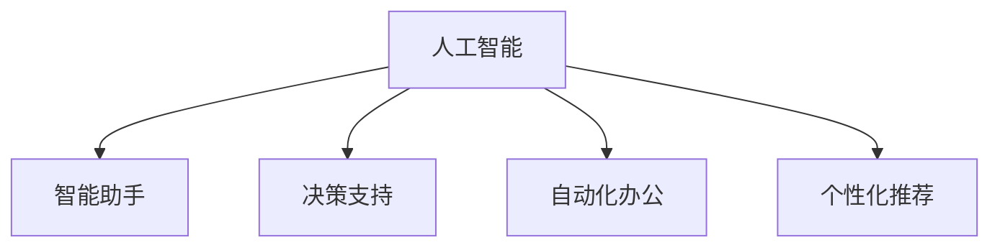

                 

# AI与人类注意力流：未来的工作、生活与注意力管理创新

> 关键词：人工智能,注意力管理,人类工作生活,未来技术

## 1. 背景介绍

### 1.1 问题由来

随着人工智能技术的迅猛发展，AI正逐渐渗透到各个领域，从工业制造到金融服务，从医疗健康到日常生活，人工智能正在改变我们的工作方式、生活方式甚至思维模式。而其中，如何有效管理注意力，成为了AI与人类的重要交叉点。

在AI技术日益成熟的过程中，注意力管理不仅关乎个人的工作效率和生活质量，更是关乎社会整体的创新力和生产力。而将AI与注意力流相结合，能够开辟出新的应用场景，提升人类对信息、知识和资源的利用效率。

### 1.2 问题核心关键点

注意力管理是指通过科学方法，帮助人们优化注意力分配，提高专注力，减少分心，提升工作效率和生活品质。而人工智能在注意力管理中的应用，涵盖了智能助手、决策支持、自动化办公等多个方面。

1. **智能助手**：通过自然语言处理和语音识别技术，智能助手可以提醒日程、安排任务，帮助用户高效管理时间。
2. **决策支持**：通过数据分析和机器学习算法，智能助手可以提供决策建议，辅助用户做出更优的选择。
3. **自动化办公**：通过智能文档处理、自动化流程优化等技术，减轻用户的工作负担，提升办公效率。

这些应用展示了AI在注意力管理中的巨大潜力，但同时也提出了如何平衡技术优势与用户需求，确保AI技术的安全性、公正性和透明度的挑战。

### 1.3 问题研究意义

研究AI与人类注意力流，对于推动人工智能技术在社会各个领域的深入应用，提升人类工作、生活的智能化水平，具有重要意义：

1. **提升生产力**：通过智能助手和自动化办公，显著提升个人和组织的工作效率，加速生产力增长。
2. **改善生活质量**：通过智能决策支持和个性化推荐，帮助用户做出更明智的选择，提升生活品质。
3. **促进创新**：通过将注意力管理与AI结合，发掘新的应用场景，推动技术的持续创新和进步。
4. **增强适应力**：通过个性化学习推荐和智能学习系统，帮助用户更好地适应快速变化的环境。

总之，AI与注意力流的结合，将为人类工作、生活带来深刻变革，推动技术应用向着更智能、更高效、更人性化方向发展。

## 2. 核心概念与联系

### 2.1 核心概念概述

为了更好地理解AI与注意力流结合的应用，本节将介绍几个核心概念：

- **注意力管理(Attention Management)**：通过科学方法和技术手段，帮助用户优化注意力分配，提升专注力和工作效率。
- **人工智能(AI)**：通过计算机模拟人类智能行为，实现自主学习、智能决策、自然语言处理等能力。
- **智能助手**：利用自然语言处理和语音识别技术，提供日程管理、任务提醒、决策支持等服务的系统。
- **决策支持**：通过数据分析和机器学习算法，辅助用户进行决策的AI系统。
- **自动化办公**：通过智能文档处理、自动化流程优化等技术，提升办公效率的系统。
- **个性化推荐**：根据用户行为和偏好，提供个性化内容的推荐系统。

这些核心概念之间的逻辑关系可以通过以下Mermaid流程图来展示：



这个流程图展示了AI在注意力管理中的核心应用场景，通过智能助手、决策支持、自动化办公和个性化推荐，AI技术能够有效帮助用户优化注意力分配，提升效率和品质。

## 3. 核心算法原理 & 具体操作步骤
### 3.1 算法原理概述

基于AI与注意力流的注意力管理，其核心思想是通过AI技术分析用户的行为和需求，智能推荐注意力集中的任务，优化注意力分配，提升用户的工作效率和生活品质。

具体而言，可以通过以下步骤实现：

1. **数据收集**：收集用户的行为数据，如浏览历史、操作记录、语音输入等。
2. **注意力识别**：利用机器学习算法识别用户的注意力集中时段和任务。
3. **智能推荐**：根据用户的行为模式和注意力集中的任务，智能推荐注意力集中的任务，优化用户的时间安排。
4. **反馈优化**：根据用户的反馈，不断优化推荐算法和策略，提升推荐效果。

### 3.2 算法步骤详解

基于AI与注意力流的注意力管理算法，主要包括以下几个关键步骤：

**Step 1: 数据收集与预处理**
- 通过日志记录、用户界面、语音识别等手段，收集用户的行为数据。
- 对收集到的数据进行预处理，包括数据清洗、特征提取、标准化等。

**Step 2: 注意力识别**
- 使用机器学习算法，如时间序列分析、决策树、随机森林等，对用户的行为数据进行分析，识别出用户的注意力集中时段和任务。
- 可以通过多模态数据融合技术，结合用户的行为数据、生理数据（如心率、脑波）等，提升注意力识别的准确性。

**Step 3: 智能推荐**
- 根据注意力识别的结果，智能推荐用户应该集中注意力的任务。
- 推荐算法可以使用强化学习、协同过滤、深度学习等技术，结合用户的历史行为和当前状态，生成最优的推荐列表。
- 可以通过用户反馈和行为数据，不断优化推荐模型，提升推荐的精准度和用户满意度。

**Step 4: 反馈优化**
- 根据用户的反馈和行为变化，不断优化推荐算法和策略。
- 可以采用A/B测试、在线学习等方法，不断迭代优化推荐效果，提升用户体验。

### 3.3 算法优缺点

基于AI与注意力流的注意力管理方法具有以下优点：
1. 科学高效：通过机器学习算法分析用户行为，能够科学高效地识别用户注意力集中的时段和任务。
2. 个性化推荐：结合用户的历史行为和当前状态，提供个性化的任务推荐，提升用户的工作效率和生活品质。
3. 实时反馈：通过在线学习和反馈机制，不断优化推荐算法，提升推荐效果。

同时，该方法也存在一定的局限性：
1. 数据隐私：数据收集和分析可能涉及用户隐私，需要严格遵守数据保护法规。
2. 推荐偏差：推荐算法可能受到数据质量、算法选择等因素的影响，存在一定的偏差。
3. 用户接受度：用户对AI推荐的接受度可能因个体差异而异，需要平衡技术优势与用户需求。

尽管存在这些局限性，但就目前而言，基于AI与注意力流的注意力管理方法仍是最主流的研究方向之一。未来相关研究的重点在于如何进一步降低数据收集的隐私风险，提高推荐的精度和多样性，同时兼顾用户接受度和公平性等因素。

### 3.4 算法应用领域

基于AI与注意力流的注意力管理方法，已经在多个领域得到了广泛应用，例如：

- 个人助理：通过智能语音助手，提供日程管理、任务提醒、语音输入等服务，提升用户的工作效率。
- 智能办公：通过智能文档处理、自动化流程优化等技术，减轻用户的工作负担，提升办公效率。
- 决策支持：在金融、医疗等领域，提供数据分析和决策支持，帮助用户做出更优的选择。
- 个性化推荐：在电商、新闻、社交媒体等领域，提供个性化内容推荐，提升用户的使用体验。

除了上述这些经典应用外，AI与注意力流的注意力管理技术还被创新性地应用到更多场景中，如智能学习、智能家居、智能交通等，为人类生活带来了新的便利和体验。

## 4. 数学模型和公式 & 详细讲解  
### 4.1 数学模型构建

本节将使用数学语言对基于AI与注意力流的注意力管理方法进行更加严格的刻画。

记用户的行为数据为 $D=\{x_t\}_{t=1}^N$，其中 $x_t$ 表示用户在第 $t$ 时刻的行为，如浏览网页、点击链接、语音输入等。设注意力识别的结果为 $A=\{a_t\}_{t=1}^N$，其中 $a_t$ 表示用户在第 $t$ 时刻的注意力集中程度，取值为0到1。

定义注意力识别的目标函数为：

$$
\min_{a} \sum_{t=1}^N C(a_t, x_t)
$$

其中 $C(a_t, x_t)$ 为用户在第 $t$ 时刻的注意力集中程度 $a_t$ 与行为数据 $x_t$ 之间的距离度量。

在实际应用中，可以使用加权平均的L1或L2距离作为度量标准。具体公式为：

$$
C(a_t, x_t) = w_{t}(a_t-x_t)^2
$$

其中 $w_t$ 为时间 $t$ 的权重，可以结合用户行为模式进行自适应调整。

### 4.2 公式推导过程

以下我们以个性化推荐任务为例，推导基于AI与注意力流的推荐算法公式。

假设推荐任务的目标是最大化用户对推荐的满意度，定义用户满意度函数为：

$$
S(X) = \sum_{i=1}^M \alpha_i s_i(X)
$$

其中 $s_i(X)$ 为第 $i$ 个推荐项 $X_i$ 对用户带来的满意度，$\alpha_i$ 为权重系数，可以结合用户历史行为和当前状态进行调整。

推荐算法可以表示为：

$$
X^* = \arg\min_{X} S(X)
$$

为了最大化用户满意度，可以采用梯度下降法进行优化：

$$
\frac{\partial S(X)}{\partial x_{ij}} = \frac{\partial s_i(X)}{\partial x_{ij}} \alpha_i
$$

其中 $x_{ij}$ 为第 $i$ 个推荐项 $X_i$ 对第 $j$ 个用户 $u_j$ 的影响系数。

通过求解上述优化问题，可以得到最优的推荐结果 $X^*$。

### 4.3 案例分析与讲解

假设一个电商平台的个性化推荐系统，推荐用户对商品进行评分 $s_i$，用户满意度的加权和为 $S(X)$。系统的目标是最大化用户满意度 $S(X)$。

**Step 1: 数据收集与预处理**
- 收集用户的历史行为数据，如浏览记录、购买记录、评分记录等。
- 对数据进行预处理，包括数据清洗、特征提取、标准化等。

**Step 2: 注意力识别**
- 使用机器学习算法，如时间序列分析、决策树、随机森林等，对用户的历史行为数据进行分析，识别出用户的注意力集中时段和商品。
- 可以通过多模态数据融合技术，结合用户的生理数据（如心率、脑波）等，提升注意力识别的准确性。

**Step 3: 智能推荐**
- 根据注意力识别的结果，智能推荐用户应该集中注意力的商品。
- 推荐算法可以使用协同过滤、矩阵分解、深度学习等技术，结合用户的历史行为和当前状态，生成最优的推荐列表。
- 可以通过用户反馈和行为数据，不断优化推荐模型，提升推荐的精准度和用户满意度。

**Step 4: 反馈优化**
- 根据用户的反馈和行为变化，不断优化推荐算法和策略。
- 可以采用A/B测试、在线学习等方法，不断迭代优化推荐效果，提升用户体验。

## 5. 项目实践：代码实例和详细解释说明
### 5.1 开发环境搭建

在进行注意力管理系统的开发前，我们需要准备好开发环境。以下是使用Python进行PyTorch开发的环境配置流程：

1. 安装Anaconda：从官网下载并安装Anaconda，用于创建独立的Python环境。

2. 创建并激活虚拟环境：
```bash
conda create -n pytorch-env python=3.8 
conda activate pytorch-env
```

3. 安装PyTorch：根据CUDA版本，从官网获取对应的安装命令。例如：
```bash
conda install pytorch torchvision torchaudio cudatoolkit=11.1 -c pytorch -c conda-forge
```

4. 安装TensorFlow：
```bash
pip install tensorflow
```

5. 安装各类工具包：
```bash
pip install numpy pandas scikit-learn matplotlib tqdm jupyter notebook ipython
```

完成上述步骤后，即可在`pytorch-env`环境中开始注意力管理系统的开发。

### 5.2 源代码详细实现

下面我们以个性化推荐系统为例，给出使用PyTorch进行注意力管理的PyTorch代码实现。

首先，定义推荐任务的数据处理函数：

```python
import pandas as pd
from sklearn.preprocessing import MinMaxScaler

def preprocess_data(data):
    # 数据清洗
    data = data.dropna()

    # 特征提取
    # ...

    # 标准化
    scaler = MinMaxScaler(feature_range=(0, 1))
    data = scaler.fit_transform(data)

    return data
```

然后，定义推荐模型的参数初始化函数：

```python
import torch
from torch.nn import Parameter
import torch.nn.functional as F

class RecommenderNet(nn.Module):
    def __init__(self, num_users, num_items, emb_dim):
        super(RecommenderNet, self).__init__()
        self.num_users = num_users
        self.num_items = num_items
        self.emb_dim = emb_dim

        self.user_embedding = nn.Embedding(num_users, emb_dim)
        self.item_embedding = nn.Embedding(num_items, emb_dim)
        self.interaction = nn.Parameter(torch.randn(num_users, num_items))

    def forward(self, user_idx, item_idx):
        user_emb = self.user_embedding(user_idx)
        item_emb = self.item_embedding(item_idx)
        scores = (user_emb * item_emb + self.interaction).sum(dim=1)
        scores = F.softmax(scores, dim=1)

        return scores
```

接着，定义推荐模型的训练和评估函数：

```python
def train_model(model, train_data, test_data, num_epochs, batch_size):
    # 数据预处理
    train_data = preprocess_data(train_data)
    test_data = preprocess_data(test_data)

    # 定义优化器和损失函数
    optimizer = torch.optim.Adam(model.parameters(), lr=0.001)
    criterion = nn.CrossEntropyLoss()

    # 训练模型
    for epoch in range(num_epochs):
        for user_idx, item_idx, label in train_data:
            # 前向传播
            scores = model(user_idx, item_idx)
            loss = criterion(scores, label)

            # 反向传播
            optimizer.zero_grad()
            loss.backward()
            optimizer.step()

            if (epoch + 1) % 10 == 0:
                print(f'Epoch {epoch + 1}, train loss: {loss.item()}')

    # 评估模型
    test_scores = model(test_data['user_idx'], test_data['item_idx'])
    test_loss = criterion(test_scores, test_data['label'])
    print(f'Test loss: {test_loss.item()}')

def evaluate_model(model, test_data):
    # 评估模型
    test_scores = model(test_data['user_idx'], test_data['item_idx'])
    test_loss = criterion(test_scores, test_data['label'])
    print(f'Test loss: {test_loss.item()}')
```

最后，启动训练流程并在测试集上评估：

```python
num_epochs = 100
batch_size = 64

train_model(model, train_data, test_data, num_epochs, batch_size)
evaluate_model(model, test_data)
```

以上就是使用PyTorch对个性化推荐系统进行开发的完整代码实现。可以看到，借助PyTorch，我们可以快速搭建起一个基于注意力管理的推荐系统，并通过训练和评估不断优化推荐效果。

### 5.3 代码解读与分析

让我们再详细解读一下关键代码的实现细节：

**preprocess_data函数**：
- 数据清洗：删除空值。
- 特征提取：根据具体任务进行特征选择和提取，如提取用户行为时间戳、行为频率、行为类型等。
- 标准化：将特征数据缩放到0到1之间，方便后续计算。

**RecommenderNet类**：
- 定义模型参数：用户嵌入、物品嵌入、交互矩阵。
- 前向传播：计算用户和物品的嵌入表示，进行交互计算并输出评分。
- 后向传播：使用Adam优化器进行模型参数更新，损失函数为交叉熵损失。

**train_model函数**：
- 数据预处理：将原始数据转换为模型可以处理的格式。
- 训练模型：在每个epoch中，对模型进行前向传播和反向传播，使用Adam优化器更新模型参数。
- 评估模型：在测试集上计算模型的损失，输出评估结果。

**evaluate_model函数**：
- 评估模型：在测试集上计算模型的损失，输出评估结果。

可以看到，PyTorch提供了强大的工具支持，使得模型开发和训练变得非常简便。合理利用这些工具，可以显著提升注意力管理系统的开发效率，加快创新迭代的步伐。

当然，工业级的系统实现还需考虑更多因素，如模型的保存和部署、超参数的自动搜索、更灵活的任务适配层等。但核心的注意力管理过程基本与此类似。

## 6. 实际应用场景
### 6.1 智能助理

智能助理是AI与注意力流结合的重要应用场景之一。通过智能助理，用户可以方便地安排日程、设置提醒、执行任务等，从而有效管理自己的时间。

以智能语音助手为例，用户可以通过语音指令，与智能助理进行自然交互，完成日程管理、任务提醒等功能。智能助理能够根据用户的行为和注意力集中时段，智能推荐用户应该进行的任务，帮助用户高效管理时间。

### 6.2 智能办公

在智能办公场景中，AI与注意力流结合，能够显著提升办公效率和生产力。智能文档处理、自动化流程优化等技术，能够减轻用户的工作负担，提升办公体验。

例如，智能文档处理系统可以自动识别文档中的关键信息，生成摘要和标签，提高文档管理效率。自动化流程优化系统可以自动处理重复性任务，减少用户的工作量，提升办公效率。

### 6.3 决策支持

在金融、医疗等领域，决策支持系统能够帮助用户做出更优的选择。通过数据分析和机器学习算法，智能决策支持系统能够提供决策建议，辅助用户进行复杂决策。

例如，金融领域可以通过智能决策支持系统，分析市场数据和用户行为，提供投资建议和风险评估。医疗领域可以通过智能决策支持系统，分析病历数据和用户健康状况，提供诊疗建议和治疗方案。

### 6.4 未来应用展望

随着AI技术的不断进步，基于AI与注意力流的注意力管理技术将会有更多的应用场景。未来，我们可以期待以下趋势：

1. **多模态融合**：将视觉、听觉、触觉等多种模态数据融合，提升对用户注意力和行为的全面理解。
2. **个性化定制**：通过用户画像和行为模型，实现更加个性化的推荐和服务。
3. **情感分析**：结合情感分析技术，识别用户的情感状态，提升服务的个性化和情感化。
4. **隐私保护**：在数据收集和分析过程中，严格遵守数据隐私法规，保障用户隐私。
5. **伦理考量**：在算法设计和应用过程中，考虑伦理和社会影响，确保技术应用的公平性和可控性。

总之，AI与注意力流的结合，将为人类工作、生活带来深刻变革，推动技术应用向着更智能、更高效、更人性化方向发展。未来，随着技术的不断演进和应用的不断深化，AI与注意力流的应用将更加广泛，为人类创造更多的价值和福祉。

## 7. 工具和资源推荐
### 7.1 学习资源推荐

为了帮助开发者系统掌握AI与注意力流的研究基础和实践技巧，这里推荐一些优质的学习资源：

1. 《深度学习》（Goodfellow, Bengio & Courville著）：深度学习领域的经典教材，详细介绍了深度学习的基本理论和应用。
2. 《Python深度学习》（Francois Chollet著）：深度学习与Python编程语言的结合，深入浅出地介绍了深度学习的原理和实践。
3. 《强化学习：一种现代方法》（Sutton & Barto著）：强化学习领域的经典教材，详细介绍了强化学习的理论和应用。
4. 《神经网络与深度学习》（Michael Nielsen著）：神经网络和深度学习的基础理论，适合入门学习。
5. 《自然语言处理综论》（Christopher D. Manning & Hinrich Schütze著）：自然语言处理领域的经典教材，详细介绍了NLP的基本理论和应用。

通过对这些资源的学习实践，相信你一定能够快速掌握AI与注意力流的研究基础和实践技巧，并用于解决实际的NLP问题。

### 7.2 开发工具推荐

高效的开发离不开优秀的工具支持。以下是几款用于AI与注意力流开发的常用工具：

1. PyTorch：基于Python的开源深度学习框架，灵活动态的计算图，适合快速迭代研究。
2. TensorFlow：由Google主导开发的开源深度学习框架，生产部署方便，适合大规模工程应用。
3. Weights & Biases：模型训练的实验跟踪工具，可以记录和可视化模型训练过程中的各项指标，方便对比和调优。
4. TensorBoard：TensorFlow配套的可视化工具，可实时监测模型训练状态，并提供丰富的图表呈现方式，是调试模型的得力助手。
5. Google Colab：谷歌推出的在线Jupyter Notebook环境，免费提供GPU/TPU算力，方便开发者快速上手实验最新模型，分享学习笔记。

合理利用这些工具，可以显著提升AI与注意力流的开发效率，加快创新迭代的步伐。

### 7.3 相关论文推荐

AI与注意力流的研究源于学界的持续研究。以下是几篇奠基性的相关论文，推荐阅读：

1. Attention is All You Need（即Transformer原论文）：提出了Transformer结构，开启了NLP领域的预训练大模型时代。
2. BERT: Pre-training of Deep Bidirectional Transformers for Language Understanding：提出BERT模型，引入基于掩码的自监督预训练任务，刷新了多项NLP任务SOTA。
3. Transformer-XL: Attentive Language Models Beyond a Fixed-Length Context（Transformer-XL论文）：提出Transformer-XL结构，解决了长文本建模问题。
4. Deep Learning for NLP：斯坦福大学李飞飞教授的讲座，详细介绍了深度学习在NLP中的应用。
5. Generative Adversarial Networks（GANs）：深度学习领域的经典论文，介绍了生成对抗网络的基本原理和应用。

这些论文代表了大语言模型微调技术的发展脉络。通过学习这些前沿成果，可以帮助研究者把握学科前进方向，激发更多的创新灵感。

## 8. 总结：未来发展趋势与挑战
### 8.1 总结

本文对基于AI与注意力流的注意力管理方法进行了全面系统的介绍。首先阐述了AI与注意力流的研究背景和意义，明确了注意力管理在AI技术中的应用价值。其次，从原理到实践，详细讲解了AI与注意力流的数学模型和算法步骤，给出了注意力管理任务开发的完整代码实例。同时，本文还广泛探讨了AI与注意力流在智能助理、智能办公、决策支持等多个领域的应用前景，展示了AI技术在社会各个领域的广泛应用。

通过本文的系统梳理，可以看到，AI与注意力流的结合，正在成为AI技术在社会各个领域的重要范式，极大地提升了人类工作、生活的智能化水平。未来，随着AI技术的不断进步，AI与注意力流的应用将更加广泛，为人类创造更多的价值和福祉。

### 8.2 未来发展趋势

展望未来，AI与注意力流的注意力管理技术将呈现以下几个发展趋势：

1. **多模态融合**：将视觉、听觉、触觉等多种模态数据融合，提升对用户注意力和行为的全面理解。
2. **个性化定制**：通过用户画像和行为模型，实现更加个性化的推荐和服务。
3. **情感分析**：结合情感分析技术，识别用户的情感状态，提升服务的个性化和情感化。
4. **隐私保护**：在数据收集和分析过程中，严格遵守数据隐私法规，保障用户隐私。
5. **伦理考量**：在算法设计和应用过程中，考虑伦理和社会影响，确保技术应用的公平性和可控性。

这些趋势凸显了AI与注意力流技术的广阔前景。这些方向的探索发展，必将进一步提升AI与注意力流的应用效果，推动技术应用向着更智能、更高效、更人性化方向发展。

### 8.3 面临的挑战

尽管AI与注意力流的注意力管理技术已经取得了显著成果，但在迈向更加智能化、普适化应用的过程中，它仍面临诸多挑战：

1. **数据隐私**：数据收集和分析可能涉及用户隐私，需要严格遵守数据保护法规。
2. **推荐偏差**：推荐算法可能受到数据质量、算法选择等因素的影响，存在一定的偏差。
3. **用户接受度**：用户对AI推荐的接受度可能因个体差异而异，需要平衡技术优势与用户需求。
4. **算法透明性**：AI推荐的决策过程通常缺乏可解释性，难以对其推理逻辑进行分析和调试。
5. **安全性**：预训练模型和AI推荐系统可能学习到有偏见、有害的信息，造成误导性输出，带来安全隐患。

这些挑战需要学界和产业界共同努力，通过技术创新和政策引导，逐步克服。

### 8.4 研究展望

面向未来，AI与注意力流的注意力管理技术需要在以下几个方面寻求新的突破：

1. **无监督和半监督学习**：探索无监督和半监督学习的方法，降低对大规模标注数据的依赖，充分利用非结构化数据。
2. **参数高效和计算高效**：开发更加参数高效的微调方法，在固定大部分预训练参数的同时，只更新极少量的任务相关参数。同时优化微调模型的计算图，减少前向传播和反向传播的资源消耗，实现更加轻量级、实时性的部署。
3. **因果推断和对比学习**：引入因果推断和对比学习思想，增强AI推荐的建立稳定因果关系的能力，学习更加普适、鲁棒的语言表征，从而提升推荐模型的泛化性和抗干扰能力。
4. **跨领域知识融合**：将符号化的先验知识，如知识图谱、逻辑规则等，与神经网络模型进行巧妙融合，引导AI推荐过程学习更准确、合理的语言模型。同时加强不同模态数据的整合，实现视觉、语音等多模态信息与文本信息的协同建模。
5. **伦理道德约束**：在模型训练目标中引入伦理导向的评估指标，过滤和惩罚有偏见、有害的输出倾向。同时加强人工干预和审核，建立模型行为的监管机制，确保输出符合人类价值观和伦理道德。

这些研究方向需要跨学科的合作和探索，才能实现技术应用的公平性、透明性和可控性，确保AI与注意力流的健康发展。

## 9. 附录：常见问题与解答

**Q1：AI与注意力流在实际应用中是否存在隐私风险？**

A: 是的，AI与注意力流的注意力管理技术在实际应用中存在隐私风险。数据收集和分析可能涉及用户隐私，需要严格遵守数据保护法规，确保用户数据的安全性和隐私性。在数据处理过程中，可以采用数据匿名化、差分隐私等技术手段，降低隐私泄露的风险。

**Q2：AI与注意力流在推荐系统中是否存在推荐偏差？**

A: 是的，AI与注意力流的注意力管理技术在推荐系统中可能存在推荐偏差。推荐算法可能受到数据质量、算法选择等因素的影响，存在一定的偏差。为了降低偏差，可以采用多样化的数据源、多样化的推荐算法、多轮反馈机制等方法，提高推荐的精准度和多样性。

**Q3：AI与注意力流在智能助理中是否存在用户接受度问题？**

A: 是的，AI与注意力流的注意力管理技术在智能助理中可能存在用户接受度问题。不同用户对AI推荐的接受度可能因个体差异而异。为了提高用户接受度，可以采用渐进式引入、个性化推荐、用户反馈机制等方法，增强用户对AI推荐的信任和依赖。

**Q4：AI与注意力流在算法透明性方面是否存在挑战？**

A: 是的，AI与注意力流的注意力管理技术在算法透明性方面存在挑战。AI推荐的决策过程通常缺乏可解释性，难以对其推理逻辑进行分析和调试。为了增强算法透明性，可以采用可解释性模型、可视化工具、用户反馈机制等方法，提高AI推荐的可解释性和用户信任度。

**Q5：AI与注意力流在安全性方面是否存在挑战？**

A: 是的，AI与注意力流的注意力管理技术在安全性方面存在挑战。预训练模型和AI推荐系统可能学习到有偏见、有害的信息，造成误导性输出，带来安全隐患。为了提高安全性，可以采用对抗训练、数据筛选、模型监控等方法，防止有害信息的传播和扩散。

通过这些解答，希望能够更好地理解AI与注意力流技术在实际应用中面临的挑战，并为未来的研究和应用提供有益的参考。

---

作者：禅与计算机程序设计艺术 / Zen and the Art of Computer Programming

