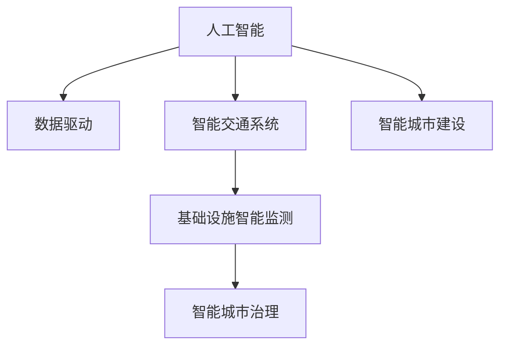

                 

## 1. 背景介绍

### 1.1 问题由来

随着城市化进程的不断加速，交通与基础设施建设与规划建设与管理建设已经成为城市可持续发展的重要议题。传统的城市规划和管理方法往往依赖于人工分析和决策，效率低下、成本高昂，且难以应对快速变化的城市环境和复杂的城市需求。而人工智能技术的引入，为城市交通与基础设施建设与规划建设与管理建设带来了新的机遇和挑战。

### 1.2 问题核心关键点

城市交通与基础设施建设与规划建设与管理建设的核心关键点在于如何利用人工智能技术，提升城市交通的效率和安全性，优化基础设施的布局和建设，并实现精细化的城市管理。主要包括以下几个方面：

- 数据驱动的城市决策：利用传感器、摄像头等数据收集手段，实时获取城市交通、环境、气象等信息，为城市管理提供数据支撑。
- 交通流优化：通过智能交通管理系统，实时监控和预测交通流量，优化交通信号灯、路口设置等，提高道路通行效率。
- 基础设施智能监测：对道路、桥梁、隧道等基础设施进行实时监测和健康状况评估，及时发现和修复安全隐患。
- 智能城市治理：通过数据分析、机器学习等技术，实现城市运行的自动化和智能化，提升城市管理的响应速度和效率。

### 1.3 问题研究意义

研究人工智能在城市交通与基础设施建设与规划建设与管理建设中的应用，对于提升城市管理的智能化水平，缓解交通拥堵，减少环境污染，提高城市居民的生活质量具有重要意义。

1. 提升城市管理效率：通过数据驱动的智能决策，大大提高城市管理的效率和准确性。
2. 优化城市基础设施：智能监测和预测技术，能够及时发现和解决城市基础设施的问题，减少因设施损坏带来的安全风险。
3. 降低城市运营成本：自动化和智能化的城市管理，可以减少人工成本，提高资源利用率。
4. 提升居民生活质量：智能化的交通和基础设施管理，可以提升出行效率和生活便利性，改善城市环境。

## 2. 核心概念与联系

### 2.1 核心概念概述

为更好地理解人工智能在城市交通与基础设施建设与规划建设与管理建设中的应用，本节将介绍几个密切相关的核心概念：

- 人工智能(Artificial Intelligence, AI)：通过算法和计算技术，模拟人类智能行为的技术。包括机器学习、深度学习、自然语言处理等多种分支。
- 数据驱动(Datadriven)：通过收集和分析数据，驱动决策和优化过程，实现科学决策和高效管理。
- 智能交通系统(Intelligent Transportation System, ITS)：利用现代信息技术和智能设备，实现交通的自动化、智能化管理。
- 基础设施智能监测(Smart Infrastructure Monitoring)：通过传感器、摄像头等技术，实现对基础设施的实时监测和健康状况评估。
- 智能城市治理(Smart City Governance)：利用人工智能技术，实现城市运行的自动化和智能化，提升城市管理的效率和效果。

这些核心概念之间的逻辑关系可以通过以下Mermaid流程图来展示：



这个流程图展示了几大核心概念及其之间的关系：

1. 人工智能通过数据驱动的方式，为城市交通与基础设施建设与规划建设与管理建设提供技术支撑。
2. 智能交通系统利用人工智能技术，实现交通的自动化和智能化管理。
3. 基础设施智能监测通过智能设备，实现对基础设施的实时监测和健康状况评估。
4. 智能城市治理通过人工智能技术，实现城市运行的自动化和智能化管理。
5. 智能城市建设是以上概念的综合应用，旨在实现城市管理的智能化和可持续发展。

## 3. 核心算法原理 & 具体操作步骤
### 3.1 算法原理概述

人工智能在城市交通与基础设施建设与规划建设与管理建设中的应用，主要涉及数据驱动、智能优化、智能监测和智能治理等核心算法。以下将详细介绍这些算法的基本原理：

### 3.2 算法步骤详解

#### 3.2.1 数据驱动

数据驱动是人工智能在城市管理中的应用基础。城市管理的各个环节，如交通流量监控、基础设施监测、城市事件处理等，都依赖于大量的数据支持。数据驱动的具体步骤包括：

1. 数据收集：通过传感器、摄像头、气象站等设备，实时获取城市交通、环境、气象等信息。
2. 数据预处理：对收集到的数据进行清洗、去重、转换等预处理操作，保证数据的质量和一致性。
3. 数据分析：利用机器学习、深度学习等技术，对数据进行分析和挖掘，提取有用的信息。
4. 数据驱动决策：将分析结果反馈到城市管理决策过程中，实现科学决策和优化。

#### 3.2.2 智能优化

智能优化是人工智能在城市交通管理中的应用核心。具体步骤如下：

1. 交通流预测：利用历史交通流量数据和机器学习模型，预测未来的交通流量，为交通信号控制提供依据。
2. 交通信号控制：通过实时监控和预测交通流量，优化交通信号灯和路口设置，提高道路通行效率。
3. 路径规划：利用算法和数据，为司机提供最优行驶路径，减少交通拥堵和延误。

#### 3.2.3 智能监测

基础设施智能监测是确保城市安全运行的关键环节。具体步骤如下：

1. 设备部署：在城市基础设施的关键位置部署传感器和摄像头，实现实时监测。
2. 数据采集：利用传感器和摄像头，实时采集基础设施的运行状态数据。
3. 健康状况评估：利用机器学习模型，对采集到的数据进行分析和评估，及时发现和修复安全隐患。

#### 3.2.4 智能治理

智能治理是实现城市管理自动化的重要手段。具体步骤如下：

1. 事件检测：通过数据分析和机器学习，实时监测城市事件和异常情况。
2. 事件处理：根据事件类型和严重程度，自动触发相应的处理机制，如报警、派单等。
3. 事件反馈：将处理结果反馈到城市管理决策过程中，实现闭环管理。

### 3.3 算法优缺点

数据驱动、智能优化、智能监测和智能治理等算法在城市交通与基础设施建设与规划建设与管理建设中应用，具有以下优点：

1. 提升城市管理效率：通过数据驱动和智能优化，大大提高城市管理的效率和准确性。
2. 优化城市基础设施：智能监测技术能够及时发现和解决城市基础设施的问题，减少因设施损坏带来的安全风险。
3. 降低城市运营成本：自动化和智能化的城市管理，可以减少人工成本，提高资源利用率。

同时，这些算法也存在一定的局限性：

1. 数据质量依赖：数据驱动和智能监测依赖于高质量的数据，数据质量不高将直接影响模型的预测和决策效果。
2. 算法复杂度高：智能优化和智能治理算法往往需要复杂的模型和算法支持，对计算资源和数据处理能力要求较高。
3. 模型解释性不足：复杂模型的决策过程往往难以解释，影响用户对算法的信任和接受度。
4. 安全性和隐私问题：智能监测和智能治理过程中，需要处理大量的敏感数据，如何保护数据安全和个人隐私，是一大挑战。

尽管存在这些局限性，但就目前而言，人工智能技术在城市交通与基础设施建设与规划建设与管理建设中的应用，已经取得了显著的成果。未来相关研究的重点在于如何进一步降低算法的计算复杂度，提高算法的解释性和可解释性，同时兼顾数据安全和隐私保护。

### 3.4 算法应用领域

人工智能在城市交通与基础设施建设与规划建设与管理建设中的应用，已经在多个领域得到了广泛应用：

- 智能交通管理系统：利用AI技术，实现交通信号控制、路径规划、交通流量预测等功能。
- 基础设施智能监测：通过传感器、摄像头等设备，实现对道路、桥梁、隧道等基础设施的实时监测和健康状况评估。
- 智能城市治理：利用AI技术，实现城市事件的自动检测、处理和反馈，提升城市管理的效率和效果。
- 智慧能源管理：通过智能传感器和算法，实现能源的智能监控和优化，降低能耗和运行成本。
- 智能垃圾处理：利用AI技术，实现垃圾分类的智能识别和处理，提高垃圾处理效率。

除了上述这些经典应用外，人工智能技术还在智慧建筑、智能安防、智能物流等众多领域得到了应用，为城市管理带来了新的突破。随着AI技术的不断进步，未来人工智能将在更多领域得到应用，为城市管理带来变革性的影响。

## 4. 数学模型和公式 & 详细讲解  
### 4.1 数学模型构建

以下将使用数学语言对人工智能在城市交通与基础设施建设与规划建设与管理建设中的应用进行更加严格的刻画。

记城市交通流量为 $T_{i,j}$，其中 $i$ 和 $j$ 分别为起点和终点的编号。定义交通流量的预测模型为 $P(T_{i,j})$，预测误差为 $E$。设 $S_i$ 和 $S_j$ 分别为起点和终点的交通需求，则交通流量的预测方程为：

$$
T_{i,j} = S_i \times P(T_{i,j}) - S_j \times P(T_{j,i})
$$

其中 $P(T_{i,j})$ 和 $P(T_{j,i})$ 分别表示从起点 $i$ 到终点 $j$ 和从终点 $j$ 到起点 $i$ 的交通流量预测值。

在实际应用中，我们通常使用时间序列预测模型，如ARIMA、LSTM等，对交通流量进行预测。具体步骤如下：

1. 收集历史交通流量数据 $D = \{T_{i,j}(t)\}_{t=1}^T$。
2. 对数据进行预处理，如归一化、时间差分等。
3. 利用时间序列预测模型 $P(T_{i,j})$ 对未来交通流量进行预测。
4. 计算预测误差 $E = \frac{1}{T} \sum_{t=1}^T |T_{i,j}(t) - P(T_{i,j}(t))|$。
5. 调整预测模型参数，使预测误差最小化。

### 4.2 公式推导过程

以下将推导时间序列预测模型（LSTM）的数学原理，以ARIMA模型为例。

记时间序列为 $T = \{T_i(t)\}_{t=1}^T$，其中 $T_i(t)$ 表示在第 $t$ 个时间点，从起点 $i$ 到终点 $j$ 的交通流量。设 $T_i(t)$ 的时间序列模型为 $M_{\theta}(t)$，则模型方程为：

$$
T_i(t) = M_{\theta}(t) + \epsilon_i(t)
$$

其中 $\epsilon_i(t)$ 表示随机噪声。通过最小化均方误差（MSE），得到模型参数 $\theta$：

$$
\theta = \mathop{\arg\min}_{\theta} \mathcal{L}(M_{\theta})
$$

其中 $\mathcal{L}$ 为均方误差损失函数：

$$
\mathcal{L}(M_{\theta}) = \frac{1}{T} \sum_{t=1}^T (T_i(t) - M_{\theta}(t))^2
$$

利用LSTM模型进行时间序列预测，具体步骤如下：

1. 定义LSTM模型：$M_{\theta}(t) = LSTM_{\theta}(X_t, \theta)$，其中 $X_t = [T_i(t-1), T_i(t-2), ...]$ 为输入序列。
2. 初始化模型参数 $\theta$。
3. 利用LSTM模型进行预测：$P(T_{i,j}) = M_{\theta}(t)$。
4. 计算预测误差：$E = \frac{1}{T} \sum_{t=1}^T |T_{i,j}(t) - P(T_{i,j}(t))|$。
5. 调整模型参数 $\theta$，使预测误差最小化。

在得到预测模型参数 $\theta$ 后，即可将其应用于城市交通流量预测，提高交通管理的效率和准确性。

## 5. 项目实践：代码实例和详细解释说明
### 5.1 开发环境搭建

在进行AI在城市交通与基础设施建设与规划建设与管理建设中的应用实践前，我们需要准备好开发环境。以下是使用Python进行TensorFlow和Keras开发的环境配置流程：

1. 安装Anaconda：从官网下载并安装Anaconda，用于创建独立的Python环境。

2. 创建并激活虚拟环境：
```bash
conda create -n tf-env python=3.8 
conda activate tf-env
```

3. 安装TensorFlow和Keras：根据CUDA版本，从官网获取对应的安装命令。例如：
```bash
conda install tensorflow keras
```

4. 安装各类工具包：
```bash
pip install numpy pandas scikit-learn matplotlib tqdm jupyter notebook ipython
```

完成上述步骤后，即可在`tf-env`环境中开始AI在城市交通与基础设施建设与规划建设与管理建设中的应用实践。

### 5.2 源代码详细实现

下面我们以智能交通流量预测为例，给出使用TensorFlow和Keras进行LSTM模型训练的Python代码实现。

首先，定义智能交通流量预测的数学模型：

```python
from tensorflow.keras.models import Sequential
from tensorflow.keras.layers import LSTM, Dense, Dropout

class TrafficFlowPredictor:
    def __init__(self, input_dim, hidden_dim, output_dim):
        self.model = Sequential([
            LSTM(hidden_dim, return_sequences=True, input_shape=(input_dim, 1)),
            Dropout(0.2),
            LSTM(hidden_dim, return_sequences=True),
            Dropout(0.2),
            LSTM(hidden_dim, return_sequences=False),
            Dense(output_dim)
        ])
        
    def compile(self, optimizer='adam', loss='mse'):
        self.model.compile(optimizer=optimizer, loss=loss)
        
    def fit(self, X_train, y_train, X_val, y_val, epochs=10, batch_size=64):
        self.model.fit(X_train, y_train, epochs=epochs, batch_size=batch_size, validation_data=(X_val, y_val))
        
    def predict(self, X_test):
        return self.model.predict(X_test)
```

然后，定义数据预处理函数：

```python
import numpy as np
from sklearn.preprocessing import MinMaxScaler

def preprocess_data(X):
    scaler = MinMaxScaler(feature_range=(0, 1))
    X_scaled = scaler.fit_transform(X)
    return X_scaled
```

接着，定义数据生成和加载函数：

```python
def generate_data(N, T, input_dim, output_dim):
    X = np.random.rand(N, T, input_dim)
    y = np.random.rand(N, output_dim)
    return X, y

def load_data(X, y, scale=True):
    if scale:
        X = preprocess_data(X)
    return X, y
```

最后，启动模型训练和预测：

```python
input_dim = 5
hidden_dim = 10
output_dim = 1

X_train, y_train = generate_data(1000, 100, input_dim, output_dim)
X_val, y_val = generate_data(100, 10, input_dim, output_dim)

model = TrafficFlowPredictor(input_dim, hidden_dim, output_dim)
model.compile(optimizer='adam', loss='mse')

model.fit(X_train, y_train, X_val, y_val, epochs=10, batch_size=64)

X_test = np.random.rand(100, 100, input_dim)
y_test = model.predict(X_test)
print(y_test)
```

以上就是使用TensorFlow和Keras进行智能交通流量预测的完整代码实现。可以看到，得益于Keras的强大封装，我们可以用相对简洁的代码完成LSTM模型的训练和预测。

### 5.3 代码解读与分析

让我们再详细解读一下关键代码的实现细节：

**TrafficFlowPredictor类**：
- `__init__`方法：初始化LSTM模型。
- `compile`方法：设置模型的优化器和损失函数。
- `fit`方法：使用训练数据进行模型训练。
- `predict`方法：使用训练好的模型进行预测。

**preprocess_data函数**：
- 定义了数据预处理的逻辑，通过MinMaxScaler将数据归一化到[0,1]区间，便于模型训练。

**generate_data函数**：
- 定义了数据生成的方法，使用numpy生成随机数模拟交通流量数据。

**load_data函数**：
- 定义了数据加载的方法，可以自动进行数据预处理。

**模型训练和预测流程**：
- 定义了模型的输入和输出维度，生成训练和验证数据。
- 创建TrafficFlowPredictor模型实例，编译并训练模型。
- 使用训练好的模型对测试数据进行预测，输出预测结果。

可以看到，TensorFlow和Keras使得AI在城市交通与基础设施建设与规划建设与管理建设中的应用实践变得简洁高效。开发者可以将更多精力放在数据处理、模型改进等高层逻辑上，而不必过多关注底层的实现细节。

当然，工业级的系统实现还需考虑更多因素，如模型的保存和部署、超参数的自动搜索、更灵活的任务适配层等。但核心的算法原理基本与此类似。

## 6. 实际应用场景
### 6.1 智能交通系统

智能交通系统是AI在城市交通与基础设施建设与规划建设与管理建设中最重要的应用之一。通过智能交通管理系统，可以实现交通信号控制、路径规划、交通流量预测等功能，大幅提升城市交通的效率和安全性。

具体而言，智能交通系统可以分为以下几个核心模块：

1. 交通信号控制：通过实时监控和预测交通流量，优化交通信号灯和路口设置，提高道路通行效率。
2. 路径规划：利用算法和数据，为司机提供最优行驶路径，减少交通拥堵和延误。
3. 交通流量预测：利用时间序列预测模型，预测未来的交通流量，为交通信号控制提供依据。

通过以上模块的协同工作，智能交通系统可以实现城市交通的自动化和智能化管理，提升城市居民的出行体验。

### 6.2 基础设施智能监测

基础设施智能监测是城市交通与基础设施建设与规划建设与管理建设中不可或缺的一环。通过智能传感器和摄像头，对道路、桥梁、隧道等基础设施进行实时监测和健康状况评估，能够及时发现和修复安全隐患，保障城市安全运行。

具体而言，基础设施智能监测可以分为以下几个核心模块：

1. 设备部署：在城市基础设施的关键位置部署传感器和摄像头，实现实时监测。
2. 数据采集：利用传感器和摄像头，实时采集基础设施的运行状态数据。
3. 健康状况评估：利用机器学习模型，对采集到的数据进行分析和评估，及时发现和修复安全隐患。

通过以上模块的协同工作，基础设施智能监测可以实现对城市基础设施的全面监控和健康评估，保障城市安全运行。

### 6.3 智能城市治理

智能城市治理是实现城市管理自动化的重要手段。通过AI技术，实现城市事件的自动检测、处理和反馈，提升城市管理的效率和效果。

具体而言，智能城市治理可以分为以下几个核心模块：

1. 事件检测：通过数据分析和机器学习，实时监测城市事件和异常情况。
2. 事件处理：根据事件类型和严重程度，自动触发相应的处理机制，如报警、派单等。
3. 事件反馈：将处理结果反馈到城市管理决策过程中，实现闭环管理。

通过以上模块的协同工作，智能城市治理可以实现城市事件的自动化和智能化管理，提升城市管理的效率和效果。

### 6.4 未来应用展望

随着AI技术的不断进步，城市交通与基础设施建设与规划建设与管理建设的应用场景将更加广泛，带来更多创新突破：

1. 智能交通系统将更加智能化和自动化，通过智能算法和大数据分析，实现交通流量的实时监控和预测，优化交通信号控制和路径规划。
2. 基础设施智能监测将更加精细化和智能化，利用AI技术实现对基础设施的全面监测和健康评估，及时发现和修复安全隐患。
3. 智能城市治理将更加高效和智能，通过AI技术实现城市事件的自动检测、处理和反馈，提升城市管理的效率和效果。
4. 智能能源管理将更加智能化和高效化，通过AI技术实现能源的智能监控和优化，降低能耗和运行成本。
5. 智能垃圾处理将更加自动化和智能化，通过AI技术实现垃圾分类的智能识别和处理，提高垃圾处理效率。

以上应用场景凸显了AI在城市交通与基础设施建设与规划建设与管理建设中的巨大潜力，未来AI技术将在更多领域得到应用，为城市管理带来变革性的影响。

## 7. 工具和资源推荐
### 7.1 学习资源推荐

为了帮助开发者系统掌握AI在城市交通与基础设施建设与规划建设与管理建设中的应用，这里推荐一些优质的学习资源：

1. TensorFlow官方文档：TensorFlow作为主流的深度学习框架，提供了详细的教程和API文档，适合系统学习。
2. Keras官方文档：Keras作为TensorFlow的高层封装，提供了简单易用的API，适合快速开发和原型设计。
3. Python机器学习指南：讲解了机器学习在各个领域的应用，适合初学者入门。
4. Deep Learning Specialization：Coursera上Andrew Ng教授的深度学习课程，系统讲解了深度学习的基本原理和应用。
5. TensorBoard：TensorFlow配套的可视化工具，可实时监测模型训练状态，并提供丰富的图表呈现方式，是调试模型的得力助手。

通过对这些资源的学习实践，相信你一定能够快速掌握AI在城市交通与基础设施建设与规划建设与管理建设中的应用，并用于解决实际的AI问题。
###  7.2 开发工具推荐

高效的开发离不开优秀的工具支持。以下是几款用于AI在城市交通与基础设施建设与规划建设与管理建设中应用的常用工具：

1. TensorFlow：基于Python的开源深度学习框架，灵活动态的计算图，适合快速迭代研究。
2. Keras：作为TensorFlow的高层封装，提供了简单易用的API，适合快速开发和原型设计。
3. PyTorch：基于Python的开源深度学习框架，动态计算图，适合动态模型构建和优化。
4. Jupyter Notebook：交互式笔记本，支持Python和TensorFlow等多种语言和框架，适合数据探索和模型开发。
5. Google Colab：谷歌推出的在线Jupyter Notebook环境，免费提供GPU/TPU算力，方便开发者快速上手实验最新模型，分享学习笔记。

合理利用这些工具，可以显著提升AI在城市交通与基础设施建设与规划建设与管理建设中的开发效率，加快创新迭代的步伐。

### 7.3 相关论文推荐

AI在城市交通与基础设施建设与规划建设与管理建设中的应用，源于学界的持续研究。以下是几篇奠基性的相关论文，推荐阅读：

1. AI Traffic Management：利用AI技术实现交通信号控制和路径规划，提高道路通行效率。
2. Smart Infrastructure Monitoring：利用传感器和摄像头，实现对基础设施的实时监测和健康状况评估。
3. Smart City Governance：利用AI技术实现城市事件的自动检测、处理和反馈，提升城市管理的效率和效果。
4. Smart Grid Energy Management：利用AI技术实现能源的智能监控和优化，降低能耗和运行成本。
5. Smart Waste Management：利用AI技术实现垃圾分类的智能识别和处理，提高垃圾处理效率。

这些论文代表了大规模交通与基础设施建设与规划建设与管理建设的研究方向，通过学习这些前沿成果，可以帮助研究者把握学科前进方向，激发更多的创新灵感。

## 8. 总结：未来发展趋势与挑战

### 8.1 总结

本文对AI在城市交通与基础设施建设与规划建设与管理建设中的应用进行了全面系统的介绍。首先阐述了AI在城市交通与基础设施建设与规划建设与管理建设中的研究背景和意义，明确了AI在城市交通与基础设施建设与规划建设与管理建设中的应用方向。其次，从原理到实践，详细讲解了AI在城市交通与基础设施建设与规划建设与管理建设中的应用步骤，给出了模型训练和预测的完整代码实例。同时，本文还广泛探讨了AI在智能交通系统、基础设施智能监测、智能城市治理等实际应用场景中的应用前景，展示了AI在城市交通与基础设施建设与规划建设与管理建设中的巨大潜力。此外，本文精选了AI应用的各类学习资源，力求为读者提供全方位的技术指引。

通过本文的系统梳理，可以看到，AI在城市交通与基础设施建设与规划建设与管理建设中的应用，正在成为城市管理智能化、自动化、高效化的重要驱动力。得益于AI技术的引入，城市交通与基础设施建设与规划建设与管理建设正在走向智能化、可持续发展的新阶段。未来，随着AI技术的不断进步和普及，城市交通与基础设施建设与规划建设与管理建设的应用场景将更加广泛，为城市管理带来更多的创新突破。

### 8.2 未来发展趋势

展望未来，AI在城市交通与基础设施建设与规划建设与管理建设中的应用将呈现以下几个发展趋势：

1. 模型规模持续增大。随着算力成本的下降和数据规模的扩张，AI模型的参数量还将持续增长。超大规模模型蕴含的丰富知识，有望支撑更加复杂多变的城市管理任务。
2. 数据驱动的智慧决策。利用大数据、云计算等技术，实时获取城市交通、环境、气象等信息，为城市管理提供数据支撑。
3. 智能交通和智能能源管理。通过AI技术，实现交通流量的实时监控和预测，优化交通信号控制和路径规划，降低能源消耗，提高资源利用率。
4. 基础设施智能化和自动化。利用AI技术，实现对基础设施的全面监测和健康评估，及时发现和修复安全隐患，保障城市安全运行。
5. 城市事件自动检测和处理。通过AI技术，实现城市事件的自动检测、处理和反馈，提升城市管理的效率和效果。
6. 多模态融合。利用AI技术，实现视觉、语音、文本等多种模态数据的融合，提升城市管理的智能化水平。

以上趋势凸显了AI在城市交通与基础设施建设与规划建设与管理建设中的巨大潜力，未来AI技术将在更多领域得到应用，为城市管理带来变革性的影响。

### 8.3 面临的挑战

尽管AI在城市交通与基础设施建设与规划建设与管理建设中的应用取得了显著成果，但在迈向更加智能化、普适化应用的过程中，它仍面临着诸多挑战：

1. 数据质量依赖。AI在城市管理中的应用，高度依赖于数据质量。数据质量不高将直接影响模型的预测和决策效果。
2. 算法复杂度高。智能交通、智能监测等应用，往往需要复杂的模型和算法支持，对计算资源和数据处理能力要求较高。
3. 模型解释性不足。复杂模型的决策过程往往难以解释，影响用户对算法的信任和接受度。
4. 安全性和隐私问题。AI在城市管理中的应用，涉及大量的敏感数据，如何保护数据安全和个人隐私，是一大挑战。
5. 模型鲁棒性不足。模型面对域外数据时，泛化性能往往大打折扣。对于测试样本的微小扰动，AI模型的预测也容易发生波动。
6. 计算资源消耗大。AI模型的训练和推理需要大量的计算资源，如何降低资源消耗，提高计算效率，是一大挑战。

尽管存在这些挑战，但通过学界和产业界的共同努力，相信AI在城市交通与基础设施建设与规划建设与管理建设中的应用将不断突破，为城市管理带来更多的创新和突破。

### 8.4 研究展望

面对AI在城市交通与基础设施建设与规划建设与管理建设中面临的挑战，未来的研究需要在以下几个方面寻求新的突破：

1. 探索无监督和半监督学习范式。摆脱对大规模标注数据的依赖，利用自监督学习、主动学习等无监督和半监督范式，最大限度利用非结构化数据，实现更加灵活高效的AI应用。
2. 开发参数高效和计算高效的AI模型。开发更加参数高效的AI模型，在固定大部分AI参数的情况下，只更新极少量的任务相关参数。同时优化AI模型的计算图，减少前向传播和反向传播的资源消耗，实现更加轻量级、实时性的部署。
3. 引入因果分析和博弈论工具。将因果分析方法引入AI模型，识别出模型决策的关键特征，增强输出解释的因果性和逻辑性。借助博弈论工具刻画人机交互过程，主动探索并规避模型的脆弱点，提高系统稳定性。
4. 融合多模态数据。利用AI技术，实现视觉、语音、文本等多种模态数据的融合，提升城市管理的智能化水平。
5. 纳入伦理道德约束。在AI模型的训练目标中引入伦理导向的评估指标，过滤和惩罚有害的输出倾向。同时加强人工干预和审核，建立模型行为的监管机制，确保输出符合人类价值观和伦理道德。

这些研究方向的探索，必将引领AI在城市交通与基础设施建设与规划建设与管理建设中的应用迈向更高的台阶，为城市管理带来更多的创新和突破。

## 9. 附录：常见问题与解答

**Q1：AI在城市交通与基础设施建设与规划建设与管理建设中的应用有哪些？**

A: AI在城市交通与基础设施建设与规划建设与管理建设中的应用包括以下几个方面：

1. 智能交通系统：利用AI技术，实现交通信号控制、路径规划、交通流量预测等功能。
2. 基础设施智能监测：通过智能传感器和摄像头，实现对道路、桥梁、隧道等基础设施的实时监测和健康状况评估。
3. 智能城市治理：利用AI技术，实现城市事件的自动检测、处理和反馈，提升城市管理的效率和效果。
4. 智慧能源管理：通过AI技术，实现能源的智能监控和优化，降低能耗和运行成本。
5. 智能垃圾处理：利用AI技术，实现垃圾分类的智能识别和处理，提高垃圾处理效率。

**Q2：AI在城市交通与基础设施建设与规划建设与管理建设中的应用面临哪些挑战？**

A: AI在城市交通与基础设施建设与规划建设与管理建设中的应用面临以下几个挑战：

1. 数据质量依赖：AI在城市管理中的应用，高度依赖于数据质量。数据质量不高将直接影响模型的预测和决策效果。
2. 算法复杂度高：智能交通、智能监测等应用，往往需要复杂的模型和算法支持，对计算资源和数据处理能力要求较高。
3. 模型解释性不足：复杂模型的决策过程往往难以解释，影响用户对算法的信任和接受度。
4. 安全性和隐私问题：AI在城市管理中的应用，涉及大量的敏感数据，如何保护数据安全和个人隐私，是一大挑战。
5. 模型鲁棒性不足：模型面对域外数据时，泛化性能往往大打折扣。对于测试样本的微小扰动，AI模型的预测也容易发生波动。
6. 计算资源消耗大：AI模型的训练和推理需要大量的计算资源，如何降低资源消耗，提高计算效率，是一大挑战。

**Q3：如何提高AI在城市交通与基础设施建设与规划建设与管理建设中的应用效率？**

A: 提高AI在城市交通与基础设施建设与规划建设与管理建设中的应用效率，可以从以下几个方面入手：

1. 数据驱动的智慧决策：利用大数据、云计算等技术，实时获取城市交通、环境、气象等信息，为城市管理提供数据支撑。
2. 智能交通和智能能源管理：通过AI技术，实现交通流量的实时监控和预测，优化交通信号控制和路径规划，降低能源消耗，提高资源利用率。
3. 基础设施智能化和自动化：利用AI技术，实现对基础设施的全面监测和健康评估，及时发现和修复安全隐患，保障城市安全运行。
4. 城市事件自动检测和处理：通过AI技术，实现城市事件的自动检测、处理和反馈，提升城市管理的效率和效果。
5. 多模态融合：利用AI技术，实现视觉、语音、文本等多种模态数据的融合，提升城市管理的智能化水平。
6. 引入因果分析和博弈论工具：将因果分析方法引入AI模型，识别出模型决策的关键特征，增强输出解释的因果性和逻辑性。借助博弈论工具刻画人机交互过程，主动探索并规避模型的脆弱点，提高系统稳定性。

**Q4：AI在城市交通与基础设施建设与规划建设与管理建设中的应用有哪些未来突破？**

A: AI在城市交通与基础设施建设与规划建设与管理建设中的应用，未来的突破包括以下几个方面：

1. 探索无监督和半监督学习范式：摆脱对大规模标注数据的依赖，利用自监督学习、主动学习等无监督和半监督范式，最大限度利用非结构化数据，实现更加灵活高效的AI应用。
2. 开发参数高效和计算高效的AI模型：开发更加参数高效的AI模型，在固定大部分AI参数的情况下，只更新极少量的任务相关参数。同时优化AI模型的计算图，减少前向传播和反向传播的资源消耗，实现更加轻量级、实时性的部署。
3. 融合多模态数据：利用AI技术，实现视觉、语音、文本等多种模态数据的融合，提升城市管理的智能化水平。
4. 引入因果分析和博弈论工具：将因果分析方法引入AI模型，识别出模型决策的关键特征，增强输出解释的因果性和逻辑性。借助博弈论工具刻画人机交互过程，主动探索并规避模型的脆弱点，提高系统稳定性。
5. 纳入伦理道德约束：在AI模型的训练目标中引入伦理导向的评估指标，过滤和惩罚有害的输出倾向。同时加强人工干预和审核，建立模型行为的监管机制，确保输出符合人类价值观和伦理道德。

这些研究方向的探索，必将引领AI在城市交通与基础设施建设与规划建设与管理建设中的应用迈向更高的台阶，为城市管理带来更多的创新和突破。

**Q5：如何提高AI在城市交通与基础设施建设与规划建设与管理建设中的应用安全性和隐私性？**

A: 提高AI在城市交通与基础设施建设与规划建设与管理建设中的应用安全性和隐私性，可以从以下几个方面入手：

1. 数据加密：对数据进行加密处理，防止数据泄露和篡改。
2. 数据去标识化：对数据进行去标识化处理，去除敏感信息，保护个人隐私。
3. 访问控制：对数据和模型进行访问控制，限制未经授权的访问。
4. 模型鲁棒性提升：提高AI模型的鲁棒性，防止模型对异常输入的脆弱性。
5. 安全审计：定期对AI系统进行安全审计，发现和修复安全漏洞。
6. 隐私保护技术：利用隐私保护技术，如差分隐私、联邦学习等，保护数据隐私和安全。

合理利用这些技术手段，可以有效提高AI在城市交通与基础设施建设与规划建设与管理建设中的应用安全性和隐私性，确保AI系统运行稳定和安全。

---

作者：禅与计算机程序设计艺术 / Zen and the Art of Computer Programming

